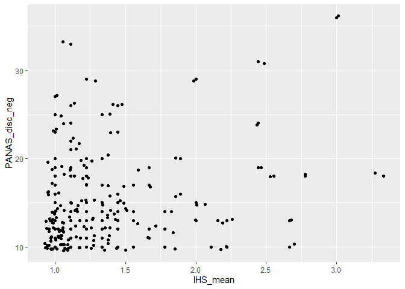
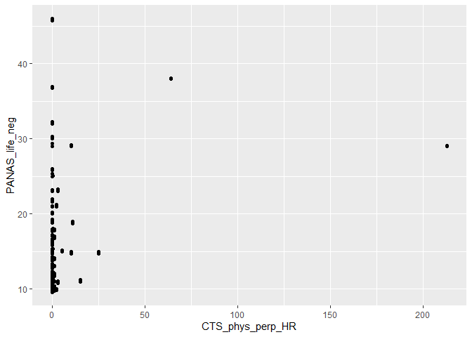

analyses_basic
================
T.J. Sullivan
2023-04-28

This document contains all of the basic analyses to report, including
reliability, descriptives, and correlations.

Load packages we’ll need:

``` r
library(tidyverse)
library(sjmisc)
library(psych)
library(brms)
library(cmdstanr)
# set options for brms to utilized cmdstanr rather than rstan default
options(mc.cores = 4,
        brms.backend = "cmdstanr")
library(easystats)
library(tidybayes)
```

Load the dataframe that we’ll use for these analyses (created from
data_clean_prep file). Note that the rest of the code in this document
utilizes this dataframe, so this is where it can be edited to re-run
descriptives for the full (n = 84 couples) vs maximum analytic sample (n
= 82 couples).

``` r
data <- readRDS("data/CCS_data_cleaned.rds")
```

# Frequencies, histograms, & scatterplots

## IHS

Histogram:

``` r
data %>% ggplot(aes(x = IHS_mean)) + geom_histogram(binwidth = .10)
```

<!-- -->

Frequencies:

``` r
data %>% frq(IHS_mean)
```

    ## IHS_mean <numeric> 
    ## # total N=168 valid N=168 mean=1.31 sd=0.45
    ## 
    ## Value |  N | Raw % | Valid % | Cum. %
    ## -------------------------------------
    ##  1.00 | 65 | 38.69 |   38.69 |  38.69
    ##  1.11 | 25 | 14.88 |   14.88 |  53.57
    ##  1.22 | 20 | 11.90 |   11.90 |  65.48
    ##  1.33 | 16 |  9.52 |    9.52 |  75.00
    ##  1.44 | 10 |  5.95 |    5.95 |  80.95
    ##  1.56 |  5 |  2.98 |    2.98 |  83.93
    ##  1.67 |  4 |  2.38 |    2.38 |  86.31
    ##  1.78 |  3 |  1.79 |    1.79 |  88.10
    ##  1.89 |  2 |  1.19 |    1.19 |  89.29
    ##  2.00 |  4 |  2.38 |    2.38 |  91.67
    ##  2.11 |  1 |  0.60 |    0.60 |  92.26
    ##  2.22 |  4 |  2.38 |    2.38 |  94.64
    ##  2.44 |  3 |  1.79 |    1.79 |  96.43
    ##  2.56 |  1 |  0.60 |    0.60 |  97.02
    ##  2.67 |  2 |  1.19 |    1.19 |  98.21
    ##  2.78 |  1 |  0.60 |    0.60 |  98.81
    ##  3.00 |  1 |  0.60 |    0.60 |  99.40
    ##  3.33 |  1 |  0.60 |    0.60 | 100.00
    ##  <NA> |  0 |  0.00 |    <NA> |   <NA>

## CTS2

Physical scatterplot:

``` r
data %>% ggplot(aes(x = CTS_phys_perp_HR)) + geom_histogram(binwidth = 1)
```

<!-- -->

We see here that this looks pretty insane when plotted at the individual
count level. This is because of a few outliers:

``` r
data %>% frq(CTS_phys_perp_HR)
```

    ## CTS_phys_perp_HR <numeric> 
    ## # total N=168 valid N=164 mean=2.31 sd=17.49
    ## 
    ## Value |   N | Raw % | Valid % | Cum. %
    ## --------------------------------------
    ##     0 | 139 | 82.74 |   84.76 |  84.76
    ##     1 |  11 |  6.55 |    6.71 |  91.46
    ##     2 |   3 |  1.79 |    1.83 |  93.29
    ##     3 |   3 |  1.79 |    1.83 |  95.12
    ##     5 |   1 |  0.60 |    0.61 |  95.73
    ##    10 |   2 |  1.19 |    1.22 |  96.95
    ##    11 |   1 |  0.60 |    0.61 |  97.56
    ##    15 |   1 |  0.60 |    0.61 |  98.17
    ##    25 |   1 |  0.60 |    0.61 |  98.78
    ##    64 |   1 |  0.60 |    0.61 |  99.39
    ##   213 |   1 |  0.60 |    0.61 | 100.00
    ##  <NA> |   4 |  2.38 |    <NA> |   <NA>

Let’s see what happens when we remove that outlier:

``` r
data %>% filter(CTS_phys_perp_HR != 213) %>% ggplot(aes(x = CTS_phys_perp_HR)) + geom_histogram(binwidth = 1)
```

<!-- -->

That still looks pretty skewed, but basically this is because there are
large jumps in count proportions for physical IPV in this sample. It’s
worth looking into how analyses hold for physical IPV when excluded the
couple with 213 acts of violence; however, as McElreath commonly notes,
outliers are sometimes truly data and we want to preserve them in
analyses because they could meaningfully inform estimates.

Psychological scatterplot:

``` r
data %>% ggplot(aes(x = CTS_psych_perp_HR)) + geom_histogram(binwidth = 1)
```

<!-- -->

Psychological frequency:

``` r
data %>% frq(CTS_psych_perp_HR)
```

    ## CTS_psych_perp_HR <numeric> 
    ## # total N=168 valid N=164 mean=21.74 sd=27.63
    ## 
    ## Value |  N | Raw % | Valid % | Cum. %
    ## -------------------------------------
    ##     0 | 14 |  8.33 |    8.54 |   8.54
    ##     1 |  9 |  5.36 |    5.49 |  14.02
    ##     2 | 22 | 13.10 |   13.41 |  27.44
    ##     3 |  5 |  2.98 |    3.05 |  30.49
    ##     4 |  9 |  5.36 |    5.49 |  35.98
    ##     5 |  5 |  2.98 |    3.05 |  39.02
    ##     6 |  4 |  2.38 |    2.44 |  41.46
    ##     7 |  2 |  1.19 |    1.22 |  42.68
    ##     8 |  7 |  4.17 |    4.27 |  46.95
    ##     9 |  2 |  1.19 |    1.22 |  48.17
    ##    10 |  5 |  2.98 |    3.05 |  51.22
    ##    11 |  6 |  3.57 |    3.66 |  54.88
    ##    12 |  4 |  2.38 |    2.44 |  57.32
    ##    13 |  2 |  1.19 |    1.22 |  58.54
    ##    14 |  2 |  1.19 |    1.22 |  59.76
    ##    16 |  1 |  0.60 |    0.61 |  60.37
    ##    18 |  1 |  0.60 |    0.61 |  60.98
    ##    19 |  1 |  0.60 |    0.61 |  61.59
    ##    20 |  3 |  1.79 |    1.83 |  63.41
    ##    21 |  2 |  1.19 |    1.22 |  64.63
    ##    22 |  3 |  1.79 |    1.83 |  66.46
    ##    24 |  2 |  1.19 |    1.22 |  67.68
    ##    25 |  1 |  0.60 |    0.61 |  68.29
    ##    26 |  1 |  0.60 |    0.61 |  68.90
    ##    27 |  2 |  1.19 |    1.22 |  70.12
    ##    28 |  3 |  1.79 |    1.83 |  71.95
    ##    29 |  4 |  2.38 |    2.44 |  74.39
    ##    31 |  1 |  0.60 |    0.61 |  75.00
    ##    32 |  1 |  0.60 |    0.61 |  75.61
    ##    33 |  2 |  1.19 |    1.22 |  76.83
    ##    35 |  2 |  1.19 |    1.22 |  78.05
    ##    37 |  1 |  0.60 |    0.61 |  78.66
    ##    38 |  2 |  1.19 |    1.22 |  79.88
    ##    40 |  3 |  1.79 |    1.83 |  81.71
    ##    42 |  4 |  2.38 |    2.44 |  84.15
    ##    45 |  1 |  0.60 |    0.61 |  84.76
    ##    48 |  1 |  0.60 |    0.61 |  85.37
    ##    49 |  1 |  0.60 |    0.61 |  85.98
    ##    51 |  1 |  0.60 |    0.61 |  86.59
    ##    53 |  1 |  0.60 |    0.61 |  87.20
    ##    54 |  1 |  0.60 |    0.61 |  87.80
    ##    56 |  1 |  0.60 |    0.61 |  88.41
    ##    57 |  2 |  1.19 |    1.22 |  89.63
    ##    58 |  1 |  0.60 |    0.61 |  90.24
    ##    59 |  1 |  0.60 |    0.61 |  90.85
    ##    64 |  1 |  0.60 |    0.61 |  91.46
    ##    65 |  1 |  0.60 |    0.61 |  92.07
    ##    66 |  2 |  1.19 |    1.22 |  93.29
    ##    69 |  1 |  0.60 |    0.61 |  93.90
    ##    75 |  1 |  0.60 |    0.61 |  94.51
    ##    80 |  1 |  0.60 |    0.61 |  95.12
    ##    81 |  1 |  0.60 |    0.61 |  95.73
    ##    88 |  1 |  0.60 |    0.61 |  96.34
    ##    90 |  1 |  0.60 |    0.61 |  96.95
    ##   100 |  1 |  0.60 |    0.61 |  97.56
    ##   113 |  1 |  0.60 |    0.61 |  98.17
    ##   118 |  1 |  0.60 |    0.61 |  98.78
    ##   121 |  1 |  0.60 |    0.61 |  99.39
    ##   149 |  1 |  0.60 |    0.61 | 100.00
    ##  <NA> |  4 |  2.38 |    <NA> |   <NA>

SGM-specific scatterplot:

``` r
data %>% ggplot(aes(x = CTS_sgm_perp_HR)) + geom_histogram(binwidth = 1)
```

<!-- -->

SGM-specific frequencies:

``` r
data %>% frq(CTS_sgm_perp_HR)
```

    ## CTS_sgm_perp_HR <numeric> 
    ## # total N=168 valid N=164 mean=0.63 sd=2.52
    ## 
    ## Value |   N | Raw % | Valid % | Cum. %
    ## --------------------------------------
    ##     0 | 142 | 84.52 |   86.59 |  86.59
    ##     1 |   4 |  2.38 |    2.44 |  89.02
    ##     2 |   8 |  4.76 |    4.88 |  93.90
    ##     4 |   4 |  2.38 |    2.44 |  96.34
    ##     6 |   1 |  0.60 |    0.61 |  96.95
    ##     8 |   3 |  1.79 |    1.83 |  98.78
    ##    12 |   1 |  0.60 |    0.61 |  99.39
    ##    25 |   1 |  0.60 |    0.61 | 100.00
    ##  <NA> |   4 |  2.38 |    <NA> |   <NA>

## PANAS

Scatterplot for life stressor discussion:

``` r
data %>% ggplot(aes(x = PANAS_life_neg)) + geom_histogram(binwidth = 1)
```

<!-- -->

Frequencies for life stressor discussion:

``` r
data %>% frq(PANAS_life_neg)
```

    ## PANAS_life_neg <numeric> 
    ## # total N=168 valid N=162 mean=14.27 sd=5.82
    ## 
    ## Value |  N | Raw % | Valid % | Cum. %
    ## -------------------------------------
    ##    10 | 40 | 23.81 |   24.69 |  24.69
    ##    11 | 23 | 13.69 |   14.20 |  38.89
    ##    12 | 21 | 12.50 |   12.96 |  51.85
    ##    13 | 18 | 10.71 |   11.11 |  62.96
    ##    14 | 11 |  6.55 |    6.79 |  69.75
    ##    15 | 12 |  7.14 |    7.41 |  77.16
    ##    16 |  4 |  2.38 |    2.47 |  79.63
    ##    17 |  3 |  1.79 |    1.85 |  81.48
    ##    18 |  4 |  2.38 |    2.47 |  83.95
    ##    19 |  7 |  4.17 |    4.32 |  88.27
    ##    20 |  2 |  1.19 |    1.23 |  89.51
    ##    21 |  2 |  1.19 |    1.23 |  90.74
    ##    22 |  2 |  1.19 |    1.23 |  91.98
    ##    23 |  2 |  1.19 |    1.23 |  93.21
    ##    25 |  2 |  1.19 |    1.23 |  94.44
    ##    26 |  1 |  0.60 |    0.62 |  95.06
    ##    29 |  3 |  1.79 |    1.85 |  96.91
    ##    30 |  1 |  0.60 |    0.62 |  97.53
    ##    32 |  1 |  0.60 |    0.62 |  98.15
    ##    37 |  1 |  0.60 |    0.62 |  98.77
    ##    38 |  1 |  0.60 |    0.62 |  99.38
    ##    46 |  1 |  0.60 |    0.62 | 100.00
    ##  <NA> |  6 |  3.57 |    <NA> |   <NA>

Scatterplot for discrimination stressor discussion:

``` r
data %>% ggplot(aes(x = PANAS_disc_neg)) + geom_histogram(binwidth = 1)
```

<!-- -->

Frequencies for discrimination discussion:

``` r
data %>% frq(PANAS_disc_neg)
```

    ## PANAS_disc_neg <numeric> 
    ## # total N=168 valid N=162 mean=14.70 sd=5.15
    ## 
    ## Value |  N | Raw % | Valid % | Cum. %
    ## -------------------------------------
    ##    10 | 33 | 19.64 |   20.37 |  20.37
    ##    11 | 18 | 10.71 |   11.11 |  31.48
    ##    12 | 17 | 10.12 |   10.49 |  41.98
    ##    13 | 21 | 12.50 |   12.96 |  54.94
    ##    14 | 14 |  8.33 |    8.64 |  63.58
    ##    15 | 11 |  6.55 |    6.79 |  70.37
    ##    16 |  6 |  3.57 |    3.70 |  74.07
    ##    17 |  5 |  2.98 |    3.09 |  77.16
    ##    18 |  7 |  4.17 |    4.32 |  81.48
    ##    19 |  6 |  3.57 |    3.70 |  85.19
    ##    20 |  5 |  2.98 |    3.09 |  88.27
    ##    21 |  1 |  0.60 |    0.62 |  88.89
    ##    22 |  2 |  1.19 |    1.23 |  90.12
    ##    23 |  3 |  1.79 |    1.85 |  91.98
    ##    24 |  2 |  1.19 |    1.23 |  93.21
    ##    25 |  2 |  1.19 |    1.23 |  94.44
    ##    26 |  3 |  1.79 |    1.85 |  96.30
    ##    27 |  1 |  0.60 |    0.62 |  96.91
    ##    29 |  2 |  1.19 |    1.23 |  98.15
    ##    31 |  1 |  0.60 |    0.62 |  98.77
    ##    33 |  1 |  0.60 |    0.62 |  99.38
    ##    36 |  1 |  0.60 |    0.62 | 100.00
    ##  <NA> |  6 |  3.57 |    <NA> |   <NA>

## Bivariate scatterplots

### IHS & CTS2 subscales

Physical:

``` r
data %>% ggplot(aes(x = IHS_mean, y = CTS_phys_perp_HR)) + geom_point() + geom_jitter(width = 0.075)
```

<!-- -->

Let’s see what that plot looks like without the very large outliers:

``` r
data %>% filter(CTS_phys_perp_HR != 213 & CTS_phys_perp_HR != 64) %>% ggplot(aes(x = IHS_mean, y = CTS_phys_perp_HR)) + geom_point() + geom_jitter(width = 0.075)
```

<!-- -->

Psychological:

``` r
data %>% ggplot(aes(x = IHS_mean, y = CTS_psych_perp_HR)) + geom_point() + geom_jitter(width = 0.075)
```

<!-- -->

SGM-specific:

``` r
data %>% ggplot(aes(x = IHS_mean, y = CTS_sgm_perp_HR)) + geom_point() + geom_jitter(width = 0.075)
```

<!-- -->

### IHS & PANAS

``` r
data %>% ggplot(aes(x = IHS_mean, y = PANAS_life_neg)) + geom_point() + geom_jitter(width = 0.075) 
```

<!-- -->

``` r
data %>% ggplot(aes(x = IHS_mean, y = PANAS_disc_neg)) + geom_point() + geom_jitter(width = 0.075)
```

<!-- -->

### PANAS & CTS2 subscales

Physical:

``` r
data %>% ggplot(aes(y = PANAS_life_neg, x = CTS_phys_perp_HR)) + geom_point() + geom_jitter(width = 0.075)
```

<!-- -->

``` r
data %>% ggplot(aes(y = PANAS_disc_neg, x = CTS_phys_perp_HR)) + geom_point() + geom_jitter(width = 0.075)
```

<!-- -->

Psychological:

``` r
data %>% ggplot(aes(y = PANAS_life_neg, x = CTS_psych_perp_HR)) + geom_point() + geom_jitter(width = 0.075)
```

<!-- -->

``` r
data %>% ggplot(aes(y = PANAS_disc_neg, x = CTS_psych_perp_HR)) + geom_point() + geom_jitter(width = 0.075)
```

<!-- -->

SGM-specific:

``` r
data %>% ggplot(aes(y = PANAS_life_neg, x = CTS_sgm_perp_HR)) + geom_point() + geom_jitter(width = 0.075)
```

<!-- -->

``` r
data %>% ggplot(aes(y = PANAS_disc_neg, x = CTS_sgm_perp_HR)) + geom_point() + geom_jitter(width = 0.075)
```

<!-- -->

# Descriptives

## IPV prevalence

Let’s get individual-level prevalence across subscales and for specific
acts on the CTS2:

``` r
# workflow to get percentage & n endorsed for each act of IPV 
prev <- data %>% 
  # select variables for reporting
  select(phys_ipv_prev, CTS_phys_threw_perp:CTS_phys_kick_perp,
         psych_ipv_prev, CTS_psych_swore_perp:CTS_psych_threat_perp,
         sgm_ipv_prev, CTS_sgm_threatout_perp:CTS_sgm_pda_perp) %>% 
  # recode them as yes/no 
  mutate(across(everything(), ~ if_else(.x > 0, T, F))) %>%
  # reduce down to sum of yes and percent (based on total valid n)
  summarize(across(everything(), list(sum = ~ sum(.x, na.rm = T), 
                                      perc = ~ ((sum(.x, na.rm = T)) / (sum(!is.na(.x))))),
                   .names = "{.col}-{.fn}"
                   )
            ) %>% 
  # reorganize
  pivot_longer(cols = everything(),
               names_to = c("ColNames", ".value"), 
               names_sep = "-"
               ) %>% 
  # make pretty
  mutate(perc = perc*100,
         perc = round(perc, digits = 1),
         sum = paste0('(', sum) %>% paste0(')')) %>% 
  unite(perc_n, c("perc", "sum"), sep = " ")

# save output for table reporting
write_csv(prev, "output/ipv_individ_prev.csv")

# display output 
prev
```

    ## # A tibble: 28 × 2
    ##    ColNames             perc_n   
    ##    <chr>                <chr>    
    ##  1 phys_ipv_prev        15.2 (25)
    ##  2 CTS_phys_threw_perp  5.5 (9)  
    ##  3 CTS_phys_twist_perp  3 (5)    
    ##  4 CTS_phys_push_perp   7.9 (13) 
    ##  5 CTS_phys_grab_perp   8.5 (14) 
    ##  6 CTS_phys_slap_perp   7.3 (12) 
    ##  7 CTS_phys_weapon_perp 1.2 (2)  
    ##  8 CTS_phys_punch_perp  4.3 (7)  
    ##  9 CTS_phys_choke_perp  2.4 (4)  
    ## 10 CTS_phys_slam_perp   3 (5)    
    ## # ℹ 18 more rows

Then let’s pull prevalence at the couple level.

``` r
data %>% select(CoupleID, phys_ipv_prev_couple, psych_ipv_prev_couple, sgm_ipv_prev_couple) %>%
  group_by(CoupleID) %>% 
  summarize(across(everything(), ~ first(.x))) %>% 
  ungroup() %>% select(-CoupleID) %>% 
  frq()
```

    ## phys_ipv_prev_couple <categorical> 
    ## # total N=84 valid N=82 mean=1.30 sd=0.68
    ## 
    ## Value          |  N | Raw % | Valid % | Cum. %
    ## ----------------------------------------------
    ## no violence    | 67 | 79.76 |   81.71 |  81.71
    ## unidirectional |  5 |  5.95 |    6.10 |  87.80
    ## bidirectional  | 10 | 11.90 |   12.20 | 100.00
    ## <NA>           |  2 |  2.38 |    <NA> |   <NA>
    ## 
    ## psych_ipv_prev_couple <categorical> 
    ## # total N=84 valid N=84 mean=2.83 sd=0.49
    ## 
    ## Value          |  N | Raw % | Valid % | Cum. %
    ## ----------------------------------------------
    ## no violence    |  4 |  4.76 |    4.76 |   4.76
    ## unidirectional |  6 |  7.14 |    7.14 |  11.90
    ## bidirectional  | 74 | 88.10 |   88.10 | 100.00
    ## <NA>           |  0 |  0.00 |    <NA> |   <NA>
    ## 
    ## sgm_ipv_prev_couple <categorical> 
    ## # total N=84 valid N=83 mean=1.29 sd=0.62
    ## 
    ## Value          |  N | Raw % | Valid % | Cum. %
    ## ----------------------------------------------
    ## no violence    | 66 | 78.57 |   79.52 |  79.52
    ## unidirectional | 10 | 11.90 |   12.05 |  91.57
    ## bidirectional  |  7 |  8.33 |    8.43 | 100.00
    ## <NA>           |  1 |  1.19 |    <NA> |   <NA>

## Mean, median, SD, range

``` r
data %>% 
  select(IHS_mean, CTS_phys_perp_HR, CTS_psych_perp_HR, CTS_sgm_perp_HR, PANAS_life_neg, PANAS_disc_neg) %>% 
  summarize(across(everything(), list(mean = ~ mean(.x, na.rm = T),
                                      median = ~ median(.x, na.rm = T),
                                      sd = ~ sd(.x, na.rm = T),
                                      min = ~ min(.x, na.rm = T),
                                      max = ~ max(.x, na.rm = T)),
                   .names = "{.col}-{.fn}")
            ) %>% 
  pivot_longer(cols = everything(),
               names_to = c("ColNames", ".value"), 
               names_sep = "-",
               ) %>% 
  mutate(max = round(max, digits = 2)) %>% 
  unite(range, c("min", "max"), sep = "-")
```

    ## # A tibble: 6 × 5
    ##   ColNames            mean median     sd range 
    ##   <chr>              <dbl>  <dbl>  <dbl> <chr> 
    ## 1 IHS_mean           1.31    1.11  0.450 1-3.33
    ## 2 CTS_phys_perp_HR   2.31    0    17.5   0-213 
    ## 3 CTS_psych_perp_HR 21.7    10    27.6   0-149 
    ## 4 CTS_sgm_perp_HR    0.628   0     2.52  0-25  
    ## 5 PANAS_life_neg    14.3    12     5.82  10-46 
    ## 6 PANAS_disc_neg    14.7    13     5.15  10-36

Possible TO DO: save these descriptives into a table. If included in
bivariate correlation table, flip `Colnames` and `.value` arguments
above.

# Reliability

## IHS

``` r
data %>% select(IHS_1:IHS_9) %>% alpha()
```

    ## 
    ## Reliability analysis   
    ## Call: alpha(x = .)
    ## 
    ##   raw_alpha std.alpha G6(smc) average_r S/N   ase mean   sd median_r
    ##       0.86      0.87    0.87      0.42 6.6 0.015  1.3 0.45      0.4
    ## 
    ##     95% confidence boundaries 
    ##          lower alpha upper
    ## Feldt     0.82  0.86  0.89
    ## Duhachek  0.83  0.86  0.89
    ## 
    ##  Reliability if an item is dropped:
    ##       raw_alpha std.alpha G6(smc) average_r S/N alpha se var.r med.r
    ## IHS_1      0.87      0.87    0.87      0.46 6.8    0.014 0.016  0.44
    ## IHS_2      0.85      0.86    0.86      0.43 5.9    0.017 0.020  0.38
    ## IHS_3      0.82      0.84    0.83      0.39 5.2    0.020 0.011  0.37
    ## IHS_4      0.83      0.85    0.85      0.41 5.6    0.018 0.016  0.38
    ## IHS_5      0.85      0.86    0.87      0.44 6.4    0.016 0.019  0.43
    ## IHS_6      0.83      0.84    0.85      0.40 5.4    0.019 0.016  0.39
    ## IHS_7      0.84      0.85    0.85      0.41 5.6    0.018 0.017  0.40
    ## IHS_8      0.86      0.87    0.87      0.45 6.5    0.016 0.017  0.42
    ## IHS_9      0.84      0.85    0.85      0.41 5.6    0.017 0.020  0.38
    ## 
    ##  Item statistics 
    ##         n raw.r std.r r.cor r.drop mean   sd
    ## IHS_1 168  0.56  0.54  0.44   0.40  1.5 0.79
    ## IHS_2 168  0.66  0.68  0.63   0.56  1.2 0.59
    ## IHS_3 168  0.85  0.84  0.85   0.78  1.3 0.76
    ## IHS_4 167  0.78  0.75  0.73   0.68  1.4 0.75
    ## IHS_5 168  0.63  0.61  0.52   0.50  1.5 0.76
    ## IHS_6 168  0.79  0.78  0.76   0.71  1.3 0.67
    ## IHS_7 168  0.75  0.75  0.72   0.67  1.3 0.62
    ## IHS_8 168  0.50  0.59  0.51   0.46  1.0 0.23
    ## IHS_9 168  0.72  0.75  0.71   0.65  1.2 0.55
    ## 
    ## Non missing response frequency for each item
    ##          1    2    3    4 miss
    ## IHS_1 0.64 0.21 0.13 0.02 0.00
    ## IHS_2 0.87 0.07 0.05 0.01 0.00
    ## IHS_3 0.85 0.07 0.04 0.05 0.00
    ## IHS_4 0.71 0.19 0.08 0.02 0.01
    ## IHS_5 0.70 0.17 0.11 0.02 0.00
    ## IHS_6 0.77 0.14 0.08 0.01 0.00
    ## IHS_7 0.80 0.13 0.05 0.01 0.00
    ## IHS_8 0.96 0.03 0.01 0.00 0.00
    ## IHS_9 0.84 0.10 0.07 0.00 0.00

``` r
data %>% select(IHS_1:IHS_9) %>% omega(plot = F)
```

    ## Loading required namespace: GPArotation

    ## Omega 
    ## Call: omegah(m = m, nfactors = nfactors, fm = fm, key = key, flip = flip, 
    ##     digits = digits, title = title, sl = sl, labels = labels, 
    ##     plot = plot, n.obs = n.obs, rotate = rotate, Phi = Phi, option = option, 
    ##     covar = covar)
    ## Alpha:                 0.87 
    ## G.6:                   0.87 
    ## Omega Hierarchical:    0.71 
    ## Omega H asymptotic:    0.79 
    ## Omega Total            0.9 
    ## 
    ## Schmid Leiman Factor loadings greater than  0.2 
    ##          g   F1*   F2*   F3*   h2   u2   p2
    ## IHS_1 0.39        0.21       0.20 0.80 0.75
    ## IHS_2 0.60              0.57 0.70 0.30 0.52
    ## IHS_3 0.75  0.45             0.78 0.22 0.71
    ## IHS_4 0.64  0.57             0.74 0.26 0.56
    ## IHS_5 0.45  0.22             0.27 0.73 0.76
    ## IHS_6 0.68  0.27  0.30       0.64 0.36 0.74
    ## IHS_7 0.64  0.28  0.26       0.56 0.44 0.74
    ## IHS_8 0.48        0.22  0.34 0.41 0.59 0.57
    ## IHS_9 0.66        0.43       0.63 0.37 0.69
    ## 
    ## With Sums of squares  of:
    ##    g  F1*  F2*  F3* 
    ## 3.23 0.75 0.47 0.47 
    ## 
    ## general/max  4.32   max/min =   1.6
    ## mean percent general =  0.67    with sd =  0.09 and cv of  0.14 
    ## Explained Common Variance of the general factor =  0.66 
    ## 
    ## The degrees of freedom are 12  and the fit is  0.07 
    ## The number of observations was  168  with Chi Square =  11.9  with prob <  0.45
    ## The root mean square of the residuals is  0.02 
    ## The df corrected root mean square of the residuals is  0.04
    ## RMSEA index =  0  and the 10 % confidence intervals are  0 0.078
    ## BIC =  -49.59
    ## 
    ## Compare this with the adequacy of just a general factor and no group factors
    ## The degrees of freedom for just the general factor are 27  and the fit is  0.6 
    ## The number of observations was  168  with Chi Square =  98.09  with prob <  5.3e-10
    ## The root mean square of the residuals is  0.1 
    ## The df corrected root mean square of the residuals is  0.12 
    ## 
    ## RMSEA index =  0.125  and the 10 % confidence intervals are  0.099 0.153
    ## BIC =  -40.26 
    ## 
    ## Measures of factor score adequacy             
    ##                                                  g   F1*   F2*   F3*
    ## Correlation of scores with factors            0.85  0.69  0.59  0.68
    ## Multiple R square of scores with factors      0.73  0.47  0.34  0.46
    ## Minimum correlation of factor score estimates 0.45 -0.06 -0.31 -0.07
    ## 
    ##  Total, General and Subset omega for each subset
    ##                                                  g  F1*  F2*  F3*
    ## Omega total for total scores and subscales    0.90 0.82 0.70 0.68
    ## Omega general for total scores and subscales  0.71 0.59 0.54 0.40
    ## Omega group for total scores and subscales    0.10 0.22 0.16 0.28

## CTS2

The reliability functions cannot accommodate missing data on any of the
variables. If you do reliability with all 12 physical assault items, it
will throw an error for `CTS_phys_weapon_perp` because this case is
removed from the analysis. It will run excluding that item:

``` r
data %>% select(CTS_phys_threw_perp:CTS_phys_kick_perp) %>% na.omit() %>% select(-CTS_phys_weapon_perp) %>% omega(plot = F)
```

    ## Warning in cor.smooth(r): Matrix was not positive definite, smoothing was done

    ## In factor.scores, the correlation matrix is singular, the pseudo inverse is  used

    ## I was unable to calculate the factor score weights, factor loadings used instead

    ## Warning in GPFoblq(A, Tmat = Tmat, normalize = normalize, eps = eps, maxit =
    ## maxit, : convergence not obtained in GPFoblq. 1000 iterations used.

    ## Warning in GPFoblq(A, Tmat = Tmat, normalize = normalize, eps = eps, maxit =
    ## maxit, : Matrix was not positive definite, smoothing was done

    ## Warning in GPFoblq(A, Tmat = Tmat, normalize = normalize, eps = eps, maxit =
    ## maxit, : Matrix was not positive definite, smoothing was done

    ## Omega 
    ## Call: omegah(m = m, nfactors = nfactors, fm = fm, key = key, flip = flip, 
    ##     digits = digits, title = title, sl = sl, labels = labels, 
    ##     plot = plot, n.obs = n.obs, rotate = rotate, Phi = Phi, option = option, 
    ##     covar = covar)
    ## Alpha:                 0.97 
    ## G.6:                   0.99 
    ## Omega Hierarchical:    0.93 
    ## Omega H asymptotic:    0.94 
    ## Omega Total            0.99 
    ## 
    ## Schmid Leiman Factor loadings greater than  0.2 
    ##                         g   F1*   F2*   F3*   h2   u2   p2
    ## CTS_phys_threw_perp  0.95  0.25             0.98 0.02 0.93
    ## CTS_phys_twist_perp  0.96  0.26             0.99 0.01 0.92
    ## CTS_phys_push_perp   0.96                   0.99 0.01 0.94
    ## CTS_phys_grab_perp   0.94        0.30       0.97 0.03 0.90
    ## CTS_phys_slap_perp   0.91        0.40       0.98 0.02 0.84
    ## CTS_phys_punch_perp  0.92  0.23        0.31 1.00 0.00 0.85
    ## CTS_phys_choke_perp  0.94  0.32             1.00 0.00 0.89
    ## CTS_phys_slam_perp   0.95  0.30             1.00 0.00 0.91
    ## CTS_phys_beat_perp   0.94  0.32             1.00 0.00 0.89
    ## CTS_phys_burn_perp-                         0.00 1.00 0.40
    ## CTS_phys_kick_perp   0.93  0.31             0.97 0.03 0.89
    ## 
    ## With Sums of squares  of:
    ##    g  F1*  F2*  F3* 
    ## 8.87 0.62 0.27 0.13 
    ## 
    ## general/max  14.38   max/min =   4.73
    ## mean percent general =  0.85    with sd =  0.15 and cv of  0.18 
    ## Explained Common Variance of the general factor =  0.9 
    ## 
    ## The degrees of freedom are 25  and the fit is  19.07 
    ## The number of observations was  162  with Chi Square =  2945.88  with prob <  0
    ## The root mean square of the residuals is  0 
    ## The df corrected root mean square of the residuals is  0
    ## RMSEA index =  0.849  and the 10 % confidence intervals are  0.826 0.878
    ## BIC =  2818.69
    ## 
    ## Compare this with the adequacy of just a general factor and no group factors
    ## The degrees of freedom for just the general factor are 44  and the fit is  32.67 
    ## The number of observations was  162  with Chi Square =  5091.83  with prob <  0
    ## The root mean square of the residuals is  0.06 
    ## The df corrected root mean square of the residuals is  0.07 
    ## 
    ## RMSEA index =  0.842  and the 10 % confidence intervals are  0.825 0.864
    ## BIC =  4867.98 
    ## 
    ## Measures of factor score adequacy             
    ##                                                  g   F1*  F2*  F3*
    ## Correlation of scores with factors            0.97  0.64 0.79 0.97
    ## Multiple R square of scores with factors      0.94  0.41 0.63 0.95
    ## Minimum correlation of factor score estimates 0.88 -0.19 0.25 0.90
    ## 
    ##  Total, General and Subset omega for each subset
    ##                                                  g  F1*  F2*  F3*
    ## Omega total for total scores and subscales    0.99 1.00 0.79 0.94
    ## Omega general for total scores and subscales  0.93 0.92 0.69 0.85
    ## Omega group for total scores and subscales    0.05 0.08 0.10 0.09

``` r
data %>% select(CTS_psych_swore_perp:CTS_psych_threat_perp) %>% omega(plot = F)
```

    ## Omega 
    ## Call: omegah(m = m, nfactors = nfactors, fm = fm, key = key, flip = flip, 
    ##     digits = digits, title = title, sl = sl, labels = labels, 
    ##     plot = plot, n.obs = n.obs, rotate = rotate, Phi = Phi, option = option, 
    ##     covar = covar)
    ## Alpha:                 0.86 
    ## G.6:                   0.88 
    ## Omega Hierarchical:    0.65 
    ## Omega H asymptotic:    0.72 
    ## Omega Total            0.91 
    ## 
    ## Schmid Leiman Factor loadings greater than  0.2 
    ##                           g   F1*   F2*   F3*   h2   u2   p2
    ## CTS_psych_swore_perp   0.48        0.56       0.55 0.45 0.43
    ## CTS_psych_shout_perp   0.64        0.56       0.73 0.27 0.56
    ## CTS_psych_stomp_perp   0.69              0.42 0.67 0.33 0.71
    ## CTS_psych_spite_perp   0.64              0.43 0.60 0.40 0.68
    ## CTS_psych_insult_perp  0.50  0.30  0.27       0.42 0.58 0.61
    ## CTS_psych_destroy_perp 0.53  0.70             0.78 0.22 0.36
    ## CTS_psych_lousy_perp   0.59  0.35        0.22 0.52 0.48 0.67
    ## CTS_psych_threat_perp  0.48  0.73             0.78 0.22 0.30
    ## 
    ## With Sums of squares  of:
    ##    g  F1*  F2*  F3* 
    ## 2.64 1.24 0.72 0.43 
    ## 
    ## general/max  2.12   max/min =   2.88
    ## mean percent general =  0.54    with sd =  0.16 and cv of  0.29 
    ## Explained Common Variance of the general factor =  0.52 
    ## 
    ## The degrees of freedom are 7  and the fit is  0.08 
    ## The number of observations was  168  with Chi Square =  12.91  with prob <  0.074
    ## The root mean square of the residuals is  0.02 
    ## The df corrected root mean square of the residuals is  0.04
    ## RMSEA index =  0.071  and the 10 % confidence intervals are  0 0.131
    ## BIC =  -22.96
    ## 
    ## Compare this with the adequacy of just a general factor and no group factors
    ## The degrees of freedom for just the general factor are 20  and the fit is  1.22 
    ## The number of observations was  168  with Chi Square =  198.21  with prob <  2.5e-31
    ## The root mean square of the residuals is  0.16 
    ## The df corrected root mean square of the residuals is  0.19 
    ## 
    ## RMSEA index =  0.23  and the 10 % confidence intervals are  0.202 0.261
    ## BIC =  95.73 
    ## 
    ## Measures of factor score adequacy             
    ##                                                  g  F1*  F2*   F3*
    ## Correlation of scores with factors            0.83 0.85 0.72  0.58
    ## Multiple R square of scores with factors      0.69 0.72 0.52  0.33
    ## Minimum correlation of factor score estimates 0.38 0.44 0.05 -0.34
    ## 
    ##  Total, General and Subset omega for each subset
    ##                                                  g  F1*  F2*  F3*
    ## Omega total for total scores and subscales    0.91 0.84 0.78 0.77
    ## Omega general for total scores and subscales  0.65 0.42 0.39 0.54
    ## Omega group for total scores and subscales    0.20 0.42 0.39 0.23

``` r
data %>% select(CTS_sgm_threatout_perp:CTS_sgm_pda_perp) %>% omega(plot = F)
```

    ## Omega 
    ## Call: omegah(m = m, nfactors = nfactors, fm = fm, key = key, flip = flip, 
    ##     digits = digits, title = title, sl = sl, labels = labels, 
    ##     plot = plot, n.obs = n.obs, rotate = rotate, Phi = Phi, option = option, 
    ##     covar = covar)
    ## Alpha:                 0.6 
    ## G.6:                   0.74 
    ## Omega Hierarchical:    0.46 
    ## Omega H asymptotic:    0.57 
    ## Omega Total            0.8 
    ## 
    ## Schmid Leiman Factor loadings greater than  0.2 
    ##                            g   F1*   F2*   F3*   h2   u2   p2
    ## CTS_sgm_threatout_perp  0.35  0.91             0.96 0.04 0.13
    ## CTS_sgm_alone_perp      0.25                   0.07 0.93 0.88
    ## CTS_sgm_rumor_perp      0.90        0.20       0.84 0.16 0.95
    ## CTS_sgm_out_perp        0.58  0.81             0.99 0.01 0.34
    ## CTS_sgm_pda_perp-                        -0.43 0.19 0.81 0.00
    ## 
    ## With Sums of squares  of:
    ##    g  F1*  F2*  F3* 
    ## 1.32 1.49 0.04 0.20 
    ## 
    ## general/max  0.89   max/min =   33.87
    ## mean percent general =  0.46    with sd =  0.43 and cv of  0.94 
    ## Explained Common Variance of the general factor =  0.43 
    ## 
    ## The degrees of freedom are -2  and the fit is  0 
    ## The number of observations was  168  with Chi Square =  0  with prob <  NA
    ## The root mean square of the residuals is  0 
    ## The df corrected root mean square of the residuals is  NA
    ## 
    ## Compare this with the adequacy of just a general factor and no group factors
    ## The degrees of freedom for just the general factor are 5  and the fit is  2.37 
    ## The number of observations was  168  with Chi Square =  388.47  with prob <  9.1e-82
    ## The root mean square of the residuals is  0.23 
    ## The df corrected root mean square of the residuals is  0.33 
    ## 
    ## RMSEA index =  0.676  and the 10 % confidence intervals are  0.621 0.736
    ## BIC =  362.85 
    ## 
    ## Measures of factor score adequacy             
    ##                                                  g  F1*   F2*   F3*
    ## Correlation of scores with factors            0.92 0.97  0.22  0.50
    ## Multiple R square of scores with factors      0.84 0.93  0.05  0.25
    ## Minimum correlation of factor score estimates 0.69 0.86 -0.90 -0.51
    ## 
    ##  Total, General and Subset omega for each subset
    ##                                                  g  F1*  F2*  F3*
    ## Omega total for total scores and subscales    0.80 0.99 0.84 0.16
    ## Omega general for total scores and subscales  0.46 0.22 0.81 0.03
    ## Omega group for total scores and subscales    0.34 0.76 0.04 0.12

## PANAS

Life stressor discussion:

``` r
data %>% select(c("PANAS_life_2", "PANAS_life_4", "PANAS_life_6", "PANAS_life_7", "PANAS_life_8", "PANAS_life_11", "PANAS_life_13", "PANAS_life_15", "PANAS_life_18", "PANAS_life_20")) %>% omega(plot = F)
```

    ## Omega 
    ## Call: omegah(m = m, nfactors = nfactors, fm = fm, key = key, flip = flip, 
    ##     digits = digits, title = title, sl = sl, labels = labels, 
    ##     plot = plot, n.obs = n.obs, rotate = rotate, Phi = Phi, option = option, 
    ##     covar = covar)
    ## Alpha:                 0.91 
    ## G.6:                   0.92 
    ## Omega Hierarchical:    0.75 
    ## Omega H asymptotic:    0.8 
    ## Omega Total            0.93 
    ## 
    ## Schmid Leiman Factor loadings greater than  0.2 
    ##                  g   F1*   F2*   F3*   h2   u2   p2
    ## PANAS_life_2  0.71  0.21        0.31 0.65 0.35 0.77
    ## PANAS_life_4  0.64              0.31 0.55 0.45 0.75
    ## PANAS_life_6  0.45              0.57 0.53 0.47 0.38
    ## PANAS_life_7  0.70  0.38             0.66 0.34 0.75
    ## PANAS_life_8  0.59        0.52       0.63 0.37 0.55
    ## PANAS_life_11 0.62        0.68       0.84 0.16 0.45
    ## PANAS_life_13 0.60        0.24  0.42 0.59 0.41 0.61
    ## PANAS_life_15 0.69  0.39             0.65 0.35 0.74
    ## PANAS_life_18 0.63  0.34             0.51 0.49 0.76
    ## PANAS_life_20 0.74  0.50             0.80 0.20 0.69
    ## 
    ## With Sums of squares  of:
    ##    g  F1*  F2*  F3* 
    ## 4.11 0.73 0.85 0.71 
    ## 
    ## general/max  4.82   max/min =   1.2
    ## mean percent general =  0.64    with sd =  0.14 and cv of  0.22 
    ## Explained Common Variance of the general factor =  0.64 
    ## 
    ## The degrees of freedom are 18  and the fit is  0.41 
    ## The number of observations was  168  with Chi Square =  66.32  with prob <  1.9e-07
    ## The root mean square of the residuals is  0.04 
    ## The df corrected root mean square of the residuals is  0.06
    ## RMSEA index =  0.126  and the 10 % confidence intervals are  0.095 0.16
    ## BIC =  -25.91
    ## 
    ## Compare this with the adequacy of just a general factor and no group factors
    ## The degrees of freedom for just the general factor are 35  and the fit is  1.45 
    ## The number of observations was  168  with Chi Square =  235.23  with prob <  1.6e-31
    ## The root mean square of the residuals is  0.12 
    ## The df corrected root mean square of the residuals is  0.14 
    ## 
    ## RMSEA index =  0.184  and the 10 % confidence intervals are  0.163 0.208
    ## BIC =  55.89 
    ## 
    ## Measures of factor score adequacy             
    ##                                                  g   F1*  F2*  F3*
    ## Correlation of scores with factors            0.87  0.61 0.81 0.72
    ## Multiple R square of scores with factors      0.76  0.37 0.65 0.52
    ## Minimum correlation of factor score estimates 0.52 -0.25 0.30 0.05
    ## 
    ##  Total, General and Subset omega for each subset
    ##                                                  g  F1*  F2*  F3*
    ## Omega total for total scores and subscales    0.93 0.88 0.85 0.80
    ## Omega general for total scores and subscales  0.75 0.66 0.42 0.55
    ## Omega group for total scores and subscales    0.12 0.22 0.42 0.25

Discrimination stressor discussion:

``` r
data %>% select(c("PANAS_disc_2", "PANAS_disc_4", "PANAS_disc_6", "PANAS_disc_7", "PANAS_disc_8", "PANAS_disc_11", "PANAS_disc_13", "PANAS_disc_15", "PANAS_disc_18", "PANAS_disc_20")) %>% omega(plot = F)
```

    ## Omega 
    ## Call: omegah(m = m, nfactors = nfactors, fm = fm, key = key, flip = flip, 
    ##     digits = digits, title = title, sl = sl, labels = labels, 
    ##     plot = plot, n.obs = n.obs, rotate = rotate, Phi = Phi, option = option, 
    ##     covar = covar)
    ## Alpha:                 0.88 
    ## G.6:                   0.89 
    ## Omega Hierarchical:    0.68 
    ## Omega H asymptotic:    0.75 
    ## Omega Total            0.91 
    ## 
    ## Schmid Leiman Factor loadings greater than  0.2 
    ##                  g   F1*   F2*   F3*   h2   u2   p2
    ## PANAS_disc_2  0.64  0.21  0.44       0.64 0.36 0.63
    ## PANAS_disc_4  0.63        0.41       0.60 0.40 0.67
    ## PANAS_disc_6  0.66              0.61 0.81 0.19 0.54
    ## PANAS_disc_7  0.52              0.25 0.36 0.64 0.74
    ## PANAS_disc_8  0.46        0.52       0.51 0.49 0.42
    ## PANAS_disc_11 0.40        0.51       0.43 0.57 0.38
    ## PANAS_disc_13 0.54              0.36 0.44 0.56 0.67
    ## PANAS_disc_15 0.60  0.52             0.63 0.37 0.58
    ## PANAS_disc_18 0.53  0.41             0.47 0.53 0.60
    ## PANAS_disc_20 0.69  0.44        0.23 0.72 0.28 0.65
    ## 
    ## With Sums of squares  of:
    ##    g  F1*  F2*  F3* 
    ## 3.30 0.73 0.94 0.64 
    ## 
    ## general/max  3.52   max/min =   1.46
    ## mean percent general =  0.59    with sd =  0.11 and cv of  0.19 
    ## Explained Common Variance of the general factor =  0.59 
    ## 
    ## The degrees of freedom are 18  and the fit is  0.12 
    ## The number of observations was  168  with Chi Square =  19.72  with prob <  0.35
    ## The root mean square of the residuals is  0.02 
    ## The df corrected root mean square of the residuals is  0.04
    ## RMSEA index =  0.023  and the 10 % confidence intervals are  0 0.075
    ## BIC =  -72.51
    ## 
    ## Compare this with the adequacy of just a general factor and no group factors
    ## The degrees of freedom for just the general factor are 35  and the fit is  0.93 
    ## The number of observations was  168  with Chi Square =  151.56  with prob <  1.9e-16
    ## The root mean square of the residuals is  0.13 
    ## The df corrected root mean square of the residuals is  0.14 
    ## 
    ## RMSEA index =  0.141  and the 10 % confidence intervals are  0.119 0.165
    ## BIC =  -27.78 
    ## 
    ## Measures of factor score adequacy             
    ##                                                  g   F1*  F2*  F3*
    ## Correlation of scores with factors            0.84  0.68 0.73 0.72
    ## Multiple R square of scores with factors      0.70  0.46 0.53 0.52
    ## Minimum correlation of factor score estimates 0.41 -0.08 0.07 0.03
    ## 
    ##  Total, General and Subset omega for each subset
    ##                                                  g  F1*  F2*  F3*
    ## Omega total for total scores and subscales    0.91 0.81 0.81 0.75
    ## Omega general for total scores and subscales  0.68 0.51 0.46 0.50
    ## Omega group for total scores and subscales    0.15 0.29 0.35 0.25

## CSI

``` r
data %>% select(CSI_1:CSI_10, CSI_11r, CSI_12, CSI_13r, CSI_14r, CSI_15, CSI_16r) %>% omega(plot = F)
```

    ## Omega 
    ## Call: omegah(m = m, nfactors = nfactors, fm = fm, key = key, flip = flip, 
    ##     digits = digits, title = title, sl = sl, labels = labels, 
    ##     plot = plot, n.obs = n.obs, rotate = rotate, Phi = Phi, option = option, 
    ##     covar = covar)
    ## Alpha:                 0.95 
    ## G.6:                   0.96 
    ## Omega Hierarchical:    0.83 
    ## Omega H asymptotic:    0.86 
    ## Omega Total            0.96 
    ## 
    ## Schmid Leiman Factor loadings greater than  0.2 
    ##            g   F1*   F2*   F3*   h2   u2   p2
    ## CSI_1   0.58                   0.39 0.61 0.87
    ## CSI_2   0.71  0.22             0.58 0.42 0.86
    ## CSI_3   0.79  0.37             0.76 0.24 0.82
    ## CSI_4   0.80  0.35             0.77 0.23 0.84
    ## CSI_5   0.82  0.30             0.77 0.23 0.86
    ## CSI_6   0.74  0.39             0.70 0.30 0.77
    ## CSI_7   0.77  0.37             0.73 0.27 0.81
    ## CSI_8   0.63  0.39             0.59 0.41 0.68
    ## CSI_9   0.65  0.25  0.20       0.53 0.47 0.81
    ## CSI_10  0.82  0.33             0.79 0.21 0.85
    ## CSI_11r 0.49              0.37 0.42 0.58 0.58
    ## CSI_12  0.69        0.33       0.62 0.38 0.77
    ## CSI_13r 0.71              0.39 0.68 0.32 0.74
    ## CSI_14r 0.67        0.37       0.61 0.39 0.73
    ## CSI_15  0.48        0.40       0.40 0.60 0.58
    ## CSI_16r 0.82        0.26  0.21 0.82 0.18 0.83
    ## 
    ## With Sums of squares  of:
    ##    g  F1*  F2*  F3* 
    ## 7.98 1.11 0.65 0.43 
    ## 
    ## general/max  7.19   max/min =   2.6
    ## mean percent general =  0.78    with sd =  0.09 and cv of  0.12 
    ## Explained Common Variance of the general factor =  0.79 
    ## 
    ## The degrees of freedom are 75  and the fit is  0.7 
    ## The number of observations was  168  with Chi Square =  110.6  with prob <  0.0047
    ## The root mean square of the residuals is  0.02 
    ## The df corrected root mean square of the residuals is  0.03
    ## RMSEA index =  0.053  and the 10 % confidence intervals are  0.03 0.074
    ## BIC =  -273.69
    ## 
    ## Compare this with the adequacy of just a general factor and no group factors
    ## The degrees of freedom for just the general factor are 104  and the fit is  1.73 
    ## The number of observations was  168  with Chi Square =  276.66  with prob <  1.3e-17
    ## The root mean square of the residuals is  0.09 
    ## The df corrected root mean square of the residuals is  0.1 
    ## 
    ## RMSEA index =  0.099  and the 10 % confidence intervals are  0.086 0.114
    ## BIC =  -256.23 
    ## 
    ## Measures of factor score adequacy             
    ##                                                  g   F1*  F2*   F3*
    ## Correlation of scores with factors            0.92  0.56 0.71  0.61
    ## Multiple R square of scores with factors      0.84  0.32 0.50  0.37
    ## Minimum correlation of factor score estimates 0.68 -0.37 0.00 -0.26
    ## 
    ##  Total, General and Subset omega for each subset
    ##                                                  g  F1*  F2*  F3*
    ## Omega total for total scores and subscales    0.96 0.94 0.82 0.69
    ## Omega general for total scores and subscales  0.83 0.80 0.65 0.49
    ## Omega group for total scores and subscales    0.08 0.15 0.17 0.20

# Correlations

Ok so following recommendations from Kenny et al. 2006 (and Griffin &
Gonzalez, 1995), we need to do a bivariate version of the intraclass
correlation coefficient in order to get 1) regular ICCs for all
variables, 2) intrapartner correlations (i.e. within-person) - however
note that this still conflates dyad-level variability in those
estimates, and 3) inter-partner correlations.

We can get a Bayesian version of this by following some recommendations
from Solomon Kurz on his blog:
<https://solomonkurz.netlify.app/blog/2019-02-16-bayesian-correlations-let-s-talk-options/>

For this, we’ll be doing the multivariate version of the model where we
put in standardized predictors and specify multivariate correlations,
which will essentially just give us a correlation matrix from a brms
model (f9 in his post). This will require some data wrangling to get the
output in a format suitable for a table.

First, let’s restructure the data into actor and partner variables
(which are needed to compute the ICCs and pairwise correlations - see
Kenny et al., 2006 + Griffin & Gonzalez, 1995 for more details here),
then we standardize each of those variables

``` r
# functions we'll need
long_to_pw <- function(df, dyadid, var){
  df %>%
    group_by({{dyadid}}) %>%
    mutate("{{var}}_partner" := coalesce(lead({{var}}), lag({{var}}))) %>%
    ungroup() %>%
    rename("{{var}}_actor" := {{var}}) %>%
    relocate(ends_with("_partner"), .after = ends_with("_actor"))
}
std <- function(x){
  (x - mean(x, na.rm = T)) / sd(x, na.rm = T)
}

# pull out only the variables that we want to report on, convert into actor & partner variables
corr <- data |> 
  select(CoupleID, IHS_mean, PANAS_life_neg, PANAS_disc_neg, CTS_phys_perp_HR, CTS_psych_perp_HR, CTS_sgm_perp_HR) 

corr <- long_to_pw(corr, CoupleID, IHS_mean)
corr <- long_to_pw(corr, CoupleID, PANAS_life_neg)
corr <- long_to_pw(corr, CoupleID, PANAS_disc_neg)
corr <- long_to_pw(corr, CoupleID, CTS_phys_perp_HR)
corr <- long_to_pw(corr, CoupleID, CTS_psych_perp_HR)
corr <- long_to_pw(corr, CoupleID, CTS_sgm_perp_HR)

# standardized variables
corr <- corr |>
  mutate(across(c(IHS_mean_actor:CTS_sgm_perp_HR_partner), std)) 
```

Next, let’s run that model. We can use a weakly regularizing prior on
correlation coefficients (it’s still pretty wide).

``` r
corr_model <- brm(
  bf(mvbind(IHS_mean_actor, IHS_mean_partner, PANAS_life_neg_actor, PANAS_life_neg_partner, PANAS_disc_neg_actor, PANAS_disc_neg_partner, CTS_phys_perp_HR_actor, CTS_phys_perp_HR_partner, CTS_psych_perp_HR_actor, CTS_psych_perp_HR_partner, CTS_sgm_perp_HR_actor, CTS_sgm_perp_HR_partner) ~ 0,
     sigma ~ 0) + set_rescor(rescor = T),
  prior(lkj(2), class = rescor),
  data = corr,
  family = gaussian,
  seed = 1234,
  chains = 4, iter = 2000, warmup = 1000, cores = 4,
  file = "fits/corr_model",
  file_refit = "on_change"
)
```

That’s a hell of a lot to work through and so I didn’t bother to
summarize the output here (but it did sample well). Let’s wrangle that
data into a matrix for reporting. We’ll take advantage of the fact that
the `matrix()` function in R will split up a single column into a matrix
going down the column (e.g., if there are 10 values, values 1-5 go in
column1 and then 6-10 go in column2). We’ll use this to label the
correlation coefficients from the output in the order that we want. I
created an Excel sheet with what I wanted the correlation matrix to look
like to guide me through this part. Perhaps one day I’ll figure out a
way to automate a function to do this for me automatically, but today is
not that day.

``` r
output <- as_draws_df(corr_model) |> 
  select(-lprior, -.chain, -.draw, -.iteration, -lp__) |> 
  pivot_longer(everything()) |> 
  group_by(name) |> 
  median_qi(value, .width = .89) |> 
  select(-.width, -.point, -.interval) |> 
  mutate(across(c("value", ".lower", ".upper"), ~ sub("^(-?)0.", "\\1.", sprintf("%.2f", .)))) |>
  mutate(.lower = paste0('[', .lower),
         .lower = paste0(.lower, ','),
         .upper = paste0(.upper, ']')) |> 
  unite(r_CrI, c("value", ".lower", ".upper"), sep = " ", remove = T) |> 
  mutate(id = case_when(
    ## iccs - these go on the diagonal elements of the matrix
    name == "rescor__IHSmeanactor__IHSmeanpartner" ~ 1,
    name == "rescor__PANASlifenegactor__PANASlifenegpartner" ~ 8,
    name == "rescor__PANASdiscnegactor__PANASdiscnegpartner" ~ 15,
    name == "rescor__CTSphysperpHRactor__CTSphysperpHRpartner" ~ 22,
    name == "rescor__CTSpsychperpHRactor__CTSpsychperpHRpartner" ~ 29,
    name == "rescor__CTSsgmperpHRactor__CTSsgmperpHRpartner" ~ 36,
    
    ## number the bottom diagonal of the correlation matrix - this reflects intrapersonal r's
    # 2-6
    name == "rescor__IHSmeanactor__PANASlifenegactor" ~ 2,
    name == "rescor__IHSmeanactor__PANASdiscnegactor" ~ 3,
    name == "rescor__IHSmeanactor__CTSphysperpHRactor" ~ 4,
    name == "rescor__IHSmeanactor__CTSpsychperpHRactor" ~ 5,
    name == "rescor__IHSmeanactor__CTSsgmperpHRactor" ~ 6,
    
    # 9-12
    name == "rescor__PANASlifenegactor__PANASdiscnegactor" ~ 9,
    name == "rescor__PANASlifenegactor__CTSphysperpHRactor" ~ 10,
    name == "rescor__PANASlifenegactor__CTSpsychperpHRactor" ~ 11,
    name == "rescor__PANASlifenegactor__CTSsgmperpHRactor" ~ 12,
    
    # 16-18
    name == "rescor__PANASdiscnegactor__CTSphysperpHRactor" ~ 16,
    name == "rescor__PANASdiscnegactor__CTSpsychperpHRactor" ~ 17,
    name == "rescor__PANASdiscnegactor__CTSsgmperpHRactor" ~ 18,
    
    # 23 and 24
    name == "rescor__CTSphysperpHRactor__CTSpsychperpHRactor" ~ 23,
    name == "rescor__CTSphysperpHRactor__CTSsgmperpHRactor" ~ 24,
    
    # 30
    name == "rescor__CTSpsychperpHRactor__CTSsgmperpHRactor" ~ 30,
    
    ## number the upper diagonal of the correlation matrix - this reflects interpersonal r's - this is the same code as the above bottom diagonal section just with the last variable change from "actor" to "partner"
    name == "rescor__IHSmeanactor__PANASlifenegpartner" ~ 7,
    name == "rescor__IHSmeanactor__PANASdiscnegpartner" ~ 13,
    name == "rescor__IHSmeanactor__CTSphysperpHRpartner" ~ 19,
    name == "rescor__IHSmeanactor__CTSpsychperpHRpartner" ~ 25,
    name == "rescor__IHSmeanactor__CTSsgmperpHRpartner" ~ 31,
    
    name == "rescor__PANASlifenegactor__PANASdiscnegpartner" ~ 14,
    name == "rescor__PANASlifenegactor__CTSphysperpHRpartner" ~ 20,
    name == "rescor__PANASlifenegactor__CTSpsychperpHRpartner" ~ 26,
    name == "rescor__PANASlifenegactor__CTSsgmperpHRpartner" ~ 32,
    
    name == "rescor__PANASdiscnegactor__CTSphysperpHRpartner" ~ 21,
    name == "rescor__PANASdiscnegactor__CTSpsychperpHRpartner" ~ 27,
    name == "rescor__PANASdiscnegactor__CTSsgmperpHRpartner" ~ 33,
    
    name == "rescor__CTSphysperpHRactor__CTSpsychperpHRpartner" ~ 28,
    name == "rescor__CTSphysperpHRactor__CTSsgmperpHRpartner" ~ 34,

    name == "rescor__CTSpsychperpHRactor__CTSsgmperpHRpartner" ~ 35)) |> 
  filter(!is.na(id)) |> 
  arrange(id) 
```

    ## Warning: Dropping 'draws_df' class as required metadata was removed.

``` r
output_matrix <- output$r_CrI 
output_matrix <- as.data.frame(matrix(output_matrix, nrow = 6)) |> 
  mutate(variable = c("is", "na_life", "na_disc", "cts_phys", "cts_psych", "cts_sgm")) |> 
  relocate(variable, .before = V1) |> 
  rename(is = V1, na_life = V2, na_disc = V3, cts_phys = V4, cts_psych = V5, cts_sgm = V6)
output_matrix
```

    ##    variable               is         na_life         na_disc         cts_phys
    ## 1        is  .12 [-.00, .23] .01 [-.11, .13] .07 [-.05, .18] -.07 [-.18, .05]
    ## 2   na_life   .12 [.00, .23]  .20 [.08, .30] .09 [-.02, .20]   .33 [.23, .43]
    ## 3   na_disc   .25 [.13, .35]  .58 [.50, .65]  .21 [.10, .31]   .14 [.02, .25]
    ## 4  cts_phys -.05 [-.16, .07]  .24 [.13, .34] .03 [-.09, .14]   .49 [.40, .57]
    ## 5 cts_psych   .13 [.02, .24]  .26 [.15, .36] .11 [-.01, .22]   .42 [.32, .51]
    ## 6   cts_sgm  .05 [-.06, .17] .11 [-.01, .22]  .13 [.02, .24]   .25 [.14, .35]
    ##         cts_psych        cts_sgm
    ## 1 .07 [-.04, .19] .21 [.09, .31]
    ## 2  .35 [.24, .45] .19 [.08, .30]
    ## 3  .16 [.04, .27] .21 [.10, .32]
    ## 4  .33 [.22, .43] .12 [.00, .23]
    ## 5  .82 [.79, .85] .26 [.15, .36]
    ## 6  .13 [.02, .24] .16 [.05, .27]

Then save this:

``` r
write.csv(output_matrix, "output/corr_table1.csv")
```

## Covariates

For now, let’s keep things simple and not include these correlations in
the main dissertation document. However, they are important to know for
contextualizing results. Let’s have a quick look at this, using the
`correlation` package from `easystats`.

First, let’s look at covariates on negative affect - this is a “quick &
dirty” method, ignore the significance tests b/c they are inaccurate due
to couple nesting.

``` r
corr_na <- data |> 
  select(NA_life = PANAS_life_neg, 
         NA_disc = PANAS_disc_neg, 
         DC_life = GlobalCoping_rc_life, 
         DC_disc = GlobalCoping_rc_disc, 
         Sev_life = StressorTopic_sev, 
         Sev_disc = DiscrimTopic_sev, 
         CSI = CSI_sum) 

c_na <- correlation(corr_na)
s_na <- summary(c_na)
display(s_na)
```

| Parameter |    CSI    |  Sev_disc  | Sev_life  |  DC_disc   | DC_life |  NA_disc   |
|:----------|:---------:|:----------:|:---------:|:----------:|:-------:|:----------:|
| NA_life   | -0.31\*\* |    0.01    | -9.83e-03 |   -0.17    | -0.25\* | 0.62\*\*\* |
| NA_disc   |   -0.22   |    0.08    |   0.10    |   -0.12    |  -0.08  |            |
| DC_life   |   0.14    |    0.10    |   -0.11   | 0.44\*\*\* |         |            |
| DC_disc   | 0.30\*\*  |    0.14    |   0.05    |            |         |            |
| Sev_life  |   -0.09   | 0.40\*\*\* |           |            |         |            |
| Sev_disc  | 6.41e-03  |            |           |            |         |            |

Correlation Matrix (pearson-method)

p-value adjustment method: Holm (1979)

Next, covariates on IPV:

``` r
corr_ipv <- data |> 
  select(IS = IHS_mean,
         CTS_phys = CTS_phys_perp_HR,
         CTS_psych = CTS_psych_perp_HR,
         CTS_sgm = CTS_sgm_perp_HR,
         age = Age,
         rel_length = rel_length_yrs)

c_ipv <- correlation(corr_ipv)
s_ipv <- summary(c_ipv)
display(s_ipv)
```

| Parameter | rel_length |  age  | CTS_sgm  | CTS_psych  | CTS_phys |
|:----------|:----------:|:-----:|:--------:|:----------:|:--------:|
| IS        |    0.03    | 0.03  |   0.07   |    0.16    |  -0.04   |
| CTS_phys  |    0.02    | -0.01 | 0.29\*\* | 0.47\*\*\* |          |
| CTS_psych |    0.14    | 0.09  |   0.19   |            |          |
| CTS_sgm   |    0.12    | 0.08  |          |            |          |
| age       | 0.34\*\*\* |       |          |            |          |

Correlation Matrix (pearson-method)

p-value adjustment method: Holm (1979)

# Missing data evaluation

Let’s look to see if missing data is meaningfully related to key
variables of interest: IHS, IPV perpetration, PANAS, relationship
length, age, relationship satisfaction.

As a reminder, here’s how many have complete data:

``` r
data %>% 
  # 2 couples excluded 
  filter(missing_CTSphys == F) %>%
  filter(missing_CTSpsych == F) %>% 
  filter(missing_CTSsgm == F) %>% 
  # 2 couples excluded 
  filter(CoupleID != 1054 | CoupleID != 1138) %>% 
  # 1 couple excluded
  filter(missing_PANASlife == F) %>%
  filter(missing_PANASdisc == F) %>% 
  # 5 couples excluded
  filter(missing_GlobalDClife == F) %>% 
  # 1 couple excluded 
  filter(missing_GlobalDCdisc == F) %>% 
  # 1 additional couple excluded b/c one partner did not report on race/ethnicity
  filter(CoupleID != 1083)
```

    ## # A tibble: 144 × 255
    ##    CoupleID ParticipantID   Age race_categ  race_categ_spec race_dich race_match
    ##       <dbl>         <dbl> <dbl> <fct>       <fct>           <fct>     <fct>     
    ##  1     1002           103    30 Hispanic/L… Hispanic/Latinx BIPOC     Both BIPOC
    ##  2     1002           104    29 Asian       Asian           BIPOC     Both BIPOC
    ##  3     1006           111    21 Hispanic/L… Hispanic/Latinx BIPOC     Mixed (on…
    ##  4     1006           112    21 Non-Hispan… Non-Hispanic W… Non-Hisp… Mixed (on…
    ##  5     1007           113    24 Multiracial Non-Hispanic M… BIPOC     Mixed (on…
    ##  6     1007           114    25 Non-Hispan… Non-Hispanic W… Non-Hisp… Mixed (on…
    ##  7     1009           117    20 Non-Hispan… Non-Hispanic W… Non-Hisp… Mixed (on…
    ##  8     1009           118    26 Hispanic/W… Hispanic/White  BIPOC     Mixed (on…
    ##  9     1011           121    21 Non-Hispan… Non-Hispanic W… Non-Hisp… Both non-…
    ## 10     1011           122    20 Non-Hispan… Non-Hispanic W… Non-Hisp… Both non-…
    ## # ℹ 134 more rows
    ## # ℹ 248 more variables: Educ <fct>, Income <fct>, Employment <fct>,
    ## #   SxlOrx <fct>, SxlOrx_Other_Text <chr>, SxlOrx_match <fct>,
    ## #   sxlorx_dich <fct>, GenderIdent <fct>, GenderIdent_Other_Text <chr>,
    ## #   GenderIdent_match <fct>, gender_three <fct>, Cohab <fct>,
    ## #   cohab_length_mths <dbl>, cohab_length_yrs <dbl>, rel_length_mths <dbl>,
    ## #   rel_length_yrs <dbl>, CSI_1 <dbl>, CSI_2 <dbl>, CSI_3 <dbl>, CSI_4 <dbl>, …

Now let’s create a variable based on that to see if missingness relates
to anything important. This code marks the 11 couples who are missing
data on any of the variables of interest, plus 1 couple where one of the
partners did not report their race/ethnicity. This leaves us with 72
couples with complete data for this study.

``` r
data <- data |> 
  mutate(missing_any = ifelse((missing_CTSphys == T | missing_CTSpsych == T | missing_CTSsgm == T | CoupleID == 1054 | CoupleID == 1138 | missing_PANASlife == T | missing_PANASdisc == T | missing_GlobalDClife == T | missing_GlobalDCdisc == T | CoupleID == 1083), T, F)) 
frq(data$missing_any)
```

    ## x <lgl> 
    ## # total N=168 valid N=168 mean=0.14 sd=0.35
    ## 
    ## Value |   N | Raw % | Valid % | Cum. %
    ## --------------------------------------
    ## FALSE | 144 | 85.71 |   85.71 |  85.71
    ## TRUE  |  24 | 14.29 |   14.29 | 100.00
    ## <NA>  |   0 |  0.00 |    <NA> |   <NA>

Next, let’s run a series of linear regressions to see if missing any
data is related to meaningful differences in our variables of interest.
We’ll do this in a frequentist framework as these are preliminary
analyses and these estimates are likely to be very similar in a Bayesian
model.

``` r
summary(lm(IHS_mean ~ missing_any, data = data))
```

    ## 
    ## Call:
    ## lm(formula = IHS_mean ~ missing_any, data = data)
    ## 
    ## Residuals:
    ##     Min      1Q  Median      3Q     Max 
    ## -0.3256 -0.3256 -0.2083  0.1188  2.0077 
    ## 
    ## Coefficients:
    ##                 Estimate Std. Error t value Pr(>|t|)    
    ## (Intercept)      1.32562    0.03744  35.408   <2e-16 ***
    ## missing_anyTRUE -0.11728    0.09905  -1.184    0.238    
    ## ---
    ## Signif. codes:  0 '***' 0.001 '**' 0.01 '*' 0.05 '.' 0.1 ' ' 1
    ## 
    ## Residual standard error: 0.4493 on 166 degrees of freedom
    ## Multiple R-squared:  0.008375,   Adjusted R-squared:  0.002401 
    ## F-statistic: 1.402 on 1 and 166 DF,  p-value: 0.2381

``` r
summary(lm(CTS_phys_perp_HR ~ missing_any, data = data))
```

    ## 
    ## Call:
    ## lm(formula = CTS_phys_perp_HR ~ missing_any, data = data)
    ## 
    ## Residuals:
    ##     Min      1Q  Median      3Q     Max 
    ##  -2.618  -2.618  -2.618  -1.618 210.382 
    ## 
    ## Coefficients:
    ##                 Estimate Std. Error t value Pr(>|t|)  
    ## (Intercept)        2.618      1.460   1.793   0.0748 .
    ## missing_anyTRUE   -2.518      4.181  -0.602   0.5478  
    ## ---
    ## Signif. codes:  0 '***' 0.001 '**' 0.01 '*' 0.05 '.' 0.1 ' ' 1
    ## 
    ## Residual standard error: 17.52 on 162 degrees of freedom
    ##   (4 observations deleted due to missingness)
    ## Multiple R-squared:  0.002234,   Adjusted R-squared:  -0.003925 
    ## F-statistic: 0.3628 on 1 and 162 DF,  p-value: 0.5478

``` r
summary(lm(CTS_psych_perp_HR ~ missing_any, data = data))
```

    ## 
    ## Call:
    ## lm(formula = CTS_psych_perp_HR ~ missing_any, data = data)
    ## 
    ## Residuals:
    ##     Min      1Q  Median      3Q     Max 
    ## -25.200 -19.257 -11.257   9.993 127.743 
    ## 
    ## Coefficients:
    ##                 Estimate Std. Error t value Pr(>|t|)    
    ## (Intercept)       21.257      2.307   9.214   <2e-16 ***
    ## missing_anyTRUE    3.943      6.606   0.597    0.551    
    ## ---
    ## Signif. codes:  0 '***' 0.001 '**' 0.01 '*' 0.05 '.' 0.1 ' ' 1
    ## 
    ## Residual standard error: 27.68 on 162 degrees of freedom
    ##   (4 observations deleted due to missingness)
    ## Multiple R-squared:  0.002194,   Adjusted R-squared:  -0.003965 
    ## F-statistic: 0.3563 on 1 and 162 DF,  p-value: 0.5514

``` r
summary(lm(CTS_sgm_perp_HR ~ missing_any, data = data))
```

    ## 
    ## Call:
    ## lm(formula = CTS_sgm_perp_HR ~ missing_any, data = data)
    ## 
    ## Residuals:
    ##     Min      1Q  Median      3Q     Max 
    ## -0.7014 -0.7014 -0.7014 -0.5510 24.2986 
    ## 
    ## Coefficients:
    ##                 Estimate Std. Error t value Pr(>|t|)   
    ## (Intercept)       0.7014     0.2097   3.345  0.00102 **
    ## missing_anyTRUE  -0.6014     0.6005  -1.001  0.31811   
    ## ---
    ## Signif. codes:  0 '***' 0.001 '**' 0.01 '*' 0.05 '.' 0.1 ' ' 1
    ## 
    ## Residual standard error: 2.517 on 162 degrees of freedom
    ##   (4 observations deleted due to missingness)
    ## Multiple R-squared:  0.006152,   Adjusted R-squared:  1.76e-05 
    ## F-statistic: 1.003 on 1 and 162 DF,  p-value: 0.3181

``` r
summary(lm(PANAS_life_neg ~ missing_any, data = data))
```

    ## 
    ## Call:
    ## lm(formula = PANAS_life_neg ~ missing_any, data = data)
    ## 
    ## Residuals:
    ##    Min     1Q Median     3Q    Max 
    ## -4.368 -3.368 -1.444  0.632 31.632 
    ## 
    ## Coefficients:
    ##                 Estimate Std. Error t value Pr(>|t|)    
    ## (Intercept)      14.3681     0.4863  29.548   <2e-16 ***
    ## missing_anyTRUE  -0.9236     1.4588  -0.633    0.528    
    ## ---
    ## Signif. codes:  0 '***' 0.001 '**' 0.01 '*' 0.05 '.' 0.1 ' ' 1
    ## 
    ## Residual standard error: 5.835 on 160 degrees of freedom
    ##   (6 observations deleted due to missingness)
    ## Multiple R-squared:  0.002499,   Adjusted R-squared:  -0.003735 
    ## F-statistic: 0.4009 on 1 and 160 DF,  p-value: 0.5276

``` r
summary(lm(PANAS_disc_neg ~ missing_any, data = data))
```

    ## 
    ## Call:
    ## lm(formula = PANAS_disc_neg ~ missing_any, data = data)
    ## 
    ## Residuals:
    ##    Min     1Q Median     3Q    Max 
    ## -4.736 -3.736 -1.736  2.264 21.264 
    ## 
    ## Coefficients:
    ##                 Estimate Std. Error t value Pr(>|t|)    
    ## (Intercept)      14.7361     0.4303  34.245   <2e-16 ***
    ## missing_anyTRUE  -0.2917     1.2910  -0.226    0.822    
    ## ---
    ## Signif. codes:  0 '***' 0.001 '**' 0.01 '*' 0.05 '.' 0.1 ' ' 1
    ## 
    ## Residual standard error: 5.164 on 160 degrees of freedom
    ##   (6 observations deleted due to missingness)
    ## Multiple R-squared:  0.0003189,  Adjusted R-squared:  -0.005929 
    ## F-statistic: 0.05104 on 1 and 160 DF,  p-value: 0.8215

``` r
summary(lm(CSI_sum ~ missing_any, data = data))
```

    ## 
    ## Call:
    ## lm(formula = CSI_sum ~ missing_any, data = data)
    ## 
    ## Residuals:
    ##     Min      1Q  Median      3Q     Max 
    ## -40.986  -3.986   3.014   8.014  13.014 
    ## 
    ## Coefficients:
    ##                 Estimate Std. Error t value Pr(>|t|)    
    ## (Intercept)      67.9861     0.9328  72.886   <2e-16 ***
    ## missing_anyTRUE   1.5972     2.4679   0.647    0.518    
    ## ---
    ## Signif. codes:  0 '***' 0.001 '**' 0.01 '*' 0.05 '.' 0.1 ' ' 1
    ## 
    ## Residual standard error: 11.19 on 166 degrees of freedom
    ## Multiple R-squared:  0.002517,   Adjusted R-squared:  -0.003492 
    ## F-statistic: 0.4189 on 1 and 166 DF,  p-value: 0.5184

``` r
summary(lm(rel_length_yrs ~ missing_any, data = data))
```

    ## 
    ## Call:
    ## lm(formula = rel_length_yrs ~ missing_any, data = data)
    ## 
    ## Residuals:
    ##     Min      1Q  Median      3Q     Max 
    ## -2.7619 -1.6889 -0.6691  1.6548  7.8215 
    ## 
    ## Coefficients:
    ##                 Estimate Std. Error t value Pr(>|t|)    
    ## (Intercept)       3.0119     0.1856  16.231  < 2e-16 ***
    ## missing_anyTRUE  -1.3521     0.4910  -2.754  0.00654 ** 
    ## ---
    ## Signif. codes:  0 '***' 0.001 '**' 0.01 '*' 0.05 '.' 0.1 ' ' 1
    ## 
    ## Residual standard error: 2.227 on 166 degrees of freedom
    ## Multiple R-squared:  0.0437, Adjusted R-squared:  0.03793 
    ## F-statistic: 7.585 on 1 and 166 DF,  p-value: 0.006542

``` r
summary(lm(Age ~ missing_any, data = data))
```

    ## 
    ## Call:
    ## lm(formula = Age ~ missing_any, data = data)
    ## 
    ## Residuals:
    ##     Min      1Q  Median      3Q     Max 
    ## -7.3264 -3.3264 -0.3264  2.6736 10.6736 
    ## 
    ## Coefficients:
    ##                 Estimate Std. Error t value Pr(>|t|)    
    ## (Intercept)      25.3264     0.3366  75.232   <2e-16 ***
    ## missing_anyTRUE   0.3403     0.8907   0.382    0.703    
    ## ---
    ## Signif. codes:  0 '***' 0.001 '**' 0.01 '*' 0.05 '.' 0.1 ' ' 1
    ## 
    ## Residual standard error: 4.04 on 166 degrees of freedom
    ## Multiple R-squared:  0.0008785,  Adjusted R-squared:  -0.00514 
    ## F-statistic: 0.146 on 1 and 166 DF,  p-value: 0.7029

The only reliable effect here was those missing data reported shorter
relationships than those not. This is likely not a large concern for
this study, as some of the preliminary analyses above did not show that
relationship was correlated significantly or strongly with any of the
main variables of interest (internalized stigma, negative affect, and
IPV).

For reporting, let’s re-run the linear regression on relationship length
in `brms`:

``` r
rel_length_missing <- brm(
  rel_length_yrs ~ 1 + missing_any, 
  data = data, 
  family = gaussian,
  seed = 1234
)
```

    ## Start sampling

    ## Running MCMC with 4 parallel chains...
    ## 
    ## Chain 1 Iteration:    1 / 2000 [  0%]  (Warmup) 
    ## Chain 1 Iteration:  100 / 2000 [  5%]  (Warmup) 
    ## Chain 1 Iteration:  200 / 2000 [ 10%]  (Warmup) 
    ## Chain 1 Iteration:  300 / 2000 [ 15%]  (Warmup) 
    ## Chain 1 Iteration:  400 / 2000 [ 20%]  (Warmup) 
    ## Chain 1 Iteration:  500 / 2000 [ 25%]  (Warmup) 
    ## Chain 1 Iteration:  600 / 2000 [ 30%]  (Warmup) 
    ## Chain 1 Iteration:  700 / 2000 [ 35%]  (Warmup) 
    ## Chain 1 Iteration:  800 / 2000 [ 40%]  (Warmup) 
    ## Chain 1 Iteration:  900 / 2000 [ 45%]  (Warmup) 
    ## Chain 1 Iteration: 1000 / 2000 [ 50%]  (Warmup) 
    ## Chain 1 Iteration: 1001 / 2000 [ 50%]  (Sampling) 
    ## Chain 1 Iteration: 1100 / 2000 [ 55%]  (Sampling) 
    ## Chain 1 Iteration: 1200 / 2000 [ 60%]  (Sampling) 
    ## Chain 1 Iteration: 1300 / 2000 [ 65%]  (Sampling) 
    ## Chain 1 Iteration: 1400 / 2000 [ 70%]  (Sampling) 
    ## Chain 1 Iteration: 1500 / 2000 [ 75%]  (Sampling) 
    ## Chain 1 Iteration: 1600 / 2000 [ 80%]  (Sampling) 
    ## Chain 1 Iteration: 1700 / 2000 [ 85%]  (Sampling) 
    ## Chain 1 Iteration: 1800 / 2000 [ 90%]  (Sampling) 
    ## Chain 1 Iteration: 1900 / 2000 [ 95%]  (Sampling) 
    ## Chain 1 Iteration: 2000 / 2000 [100%]  (Sampling) 
    ## Chain 2 Iteration:    1 / 2000 [  0%]  (Warmup) 
    ## Chain 2 Iteration:  100 / 2000 [  5%]  (Warmup) 
    ## Chain 2 Iteration:  200 / 2000 [ 10%]  (Warmup) 
    ## Chain 2 Iteration:  300 / 2000 [ 15%]  (Warmup) 
    ## Chain 2 Iteration:  400 / 2000 [ 20%]  (Warmup) 
    ## Chain 2 Iteration:  500 / 2000 [ 25%]  (Warmup) 
    ## Chain 2 Iteration:  600 / 2000 [ 30%]  (Warmup) 
    ## Chain 2 Iteration:  700 / 2000 [ 35%]  (Warmup) 
    ## Chain 2 Iteration:  800 / 2000 [ 40%]  (Warmup) 
    ## Chain 2 Iteration:  900 / 2000 [ 45%]  (Warmup) 
    ## Chain 2 Iteration: 1000 / 2000 [ 50%]  (Warmup) 
    ## Chain 2 Iteration: 1001 / 2000 [ 50%]  (Sampling) 
    ## Chain 2 Iteration: 1100 / 2000 [ 55%]  (Sampling) 
    ## Chain 2 Iteration: 1200 / 2000 [ 60%]  (Sampling) 
    ## Chain 2 Iteration: 1300 / 2000 [ 65%]  (Sampling) 
    ## Chain 2 Iteration: 1400 / 2000 [ 70%]  (Sampling) 
    ## Chain 2 Iteration: 1500 / 2000 [ 75%]  (Sampling) 
    ## Chain 2 Iteration: 1600 / 2000 [ 80%]  (Sampling) 
    ## Chain 2 Iteration: 1700 / 2000 [ 85%]  (Sampling) 
    ## Chain 2 Iteration: 1800 / 2000 [ 90%]  (Sampling) 
    ## Chain 2 Iteration: 1900 / 2000 [ 95%]  (Sampling) 
    ## Chain 2 Iteration: 2000 / 2000 [100%]  (Sampling) 
    ## Chain 3 Iteration:    1 / 2000 [  0%]  (Warmup) 
    ## Chain 3 Iteration:  100 / 2000 [  5%]  (Warmup) 
    ## Chain 3 Iteration:  200 / 2000 [ 10%]  (Warmup) 
    ## Chain 3 Iteration:  300 / 2000 [ 15%]  (Warmup) 
    ## Chain 3 Iteration:  400 / 2000 [ 20%]  (Warmup) 
    ## Chain 3 Iteration:  500 / 2000 [ 25%]  (Warmup) 
    ## Chain 3 Iteration:  600 / 2000 [ 30%]  (Warmup) 
    ## Chain 3 Iteration:  700 / 2000 [ 35%]  (Warmup) 
    ## Chain 3 Iteration:  800 / 2000 [ 40%]  (Warmup) 
    ## Chain 3 Iteration:  900 / 2000 [ 45%]  (Warmup) 
    ## Chain 3 Iteration: 1000 / 2000 [ 50%]  (Warmup) 
    ## Chain 3 Iteration: 1001 / 2000 [ 50%]  (Sampling) 
    ## Chain 3 Iteration: 1100 / 2000 [ 55%]  (Sampling) 
    ## Chain 3 Iteration: 1200 / 2000 [ 60%]  (Sampling) 
    ## Chain 3 Iteration: 1300 / 2000 [ 65%]  (Sampling) 
    ## Chain 3 Iteration: 1400 / 2000 [ 70%]  (Sampling) 
    ## Chain 3 Iteration: 1500 / 2000 [ 75%]  (Sampling) 
    ## Chain 3 Iteration: 1600 / 2000 [ 80%]  (Sampling) 
    ## Chain 3 Iteration: 1700 / 2000 [ 85%]  (Sampling) 
    ## Chain 3 Iteration: 1800 / 2000 [ 90%]  (Sampling) 
    ## Chain 3 Iteration: 1900 / 2000 [ 95%]  (Sampling) 
    ## Chain 3 Iteration: 2000 / 2000 [100%]  (Sampling) 
    ## Chain 4 Iteration:    1 / 2000 [  0%]  (Warmup) 
    ## Chain 4 Iteration:  100 / 2000 [  5%]  (Warmup) 
    ## Chain 4 Iteration:  200 / 2000 [ 10%]  (Warmup) 
    ## Chain 4 Iteration:  300 / 2000 [ 15%]  (Warmup) 
    ## Chain 4 Iteration:  400 / 2000 [ 20%]  (Warmup) 
    ## Chain 4 Iteration:  500 / 2000 [ 25%]  (Warmup) 
    ## Chain 4 Iteration:  600 / 2000 [ 30%]  (Warmup) 
    ## Chain 4 Iteration:  700 / 2000 [ 35%]  (Warmup) 
    ## Chain 4 Iteration:  800 / 2000 [ 40%]  (Warmup) 
    ## Chain 4 Iteration:  900 / 2000 [ 45%]  (Warmup) 
    ## Chain 4 Iteration: 1000 / 2000 [ 50%]  (Warmup) 
    ## Chain 4 Iteration: 1001 / 2000 [ 50%]  (Sampling) 
    ## Chain 4 Iteration: 1100 / 2000 [ 55%]  (Sampling) 
    ## Chain 4 Iteration: 1200 / 2000 [ 60%]  (Sampling) 
    ## Chain 4 Iteration: 1300 / 2000 [ 65%]  (Sampling) 
    ## Chain 4 Iteration: 1400 / 2000 [ 70%]  (Sampling) 
    ## Chain 4 Iteration: 1500 / 2000 [ 75%]  (Sampling) 
    ## Chain 4 Iteration: 1600 / 2000 [ 80%]  (Sampling) 
    ## Chain 4 Iteration: 1700 / 2000 [ 85%]  (Sampling) 
    ## Chain 4 Iteration: 1800 / 2000 [ 90%]  (Sampling) 
    ## Chain 4 Iteration: 1900 / 2000 [ 95%]  (Sampling) 
    ## Chain 4 Iteration: 2000 / 2000 [100%]  (Sampling) 
    ## Chain 1 finished in 0.0 seconds.
    ## Chain 2 finished in 0.0 seconds.
    ## Chain 3 finished in 0.0 seconds.
    ## Chain 4 finished in 0.0 seconds.
    ## 
    ## All 4 chains finished successfully.
    ## Mean chain execution time: 0.0 seconds.
    ## Total execution time: 0.4 seconds.

``` r
summary(rel_length_missing, prob = .89)
```

    ##  Family: gaussian 
    ##   Links: mu = identity; sigma = identity 
    ## Formula: rel_length_yrs ~ 1 + missing_any 
    ##    Data: data (Number of observations: 168) 
    ##   Draws: 4 chains, each with iter = 2000; warmup = 1000; thin = 1;
    ##          total post-warmup draws = 4000
    ## 
    ## Population-Level Effects: 
    ##                 Estimate Est.Error l-89% CI u-89% CI Rhat Bulk_ESS Tail_ESS
    ## Intercept           3.01      0.19     2.71     3.32 1.00     4138     2653
    ## missing_anyTRUE    -1.36      0.49    -2.14    -0.57 1.00     4030     3014
    ## 
    ## Family Specific Parameters: 
    ##       Estimate Est.Error l-89% CI u-89% CI Rhat Bulk_ESS Tail_ESS
    ## sigma     2.24      0.12     2.05     2.44 1.00     4245     2910
    ## 
    ## Draws were sampled using sample(hmc). For each parameter, Bulk_ESS
    ## and Tail_ESS are effective sample size measures, and Rhat is the potential
    ## scale reduction factor on split chains (at convergence, Rhat = 1).

# Prior topic discussion

Let’s see whether having previously discussed a stressor topic
meaningfully related to post-discusison negative affect.

For discrimination topic discussions:

``` r
summary(lm(PANAS_disc_neg ~ DiscrimTopic_choice_prior, data = data))
```

    ## 
    ## Call:
    ## lm(formula = PANAS_disc_neg ~ DiscrimTopic_choice_prior, data = data)
    ## 
    ## Residuals:
    ##    Min     1Q Median     3Q    Max 
    ##  -4.75  -3.75  -1.75   2.25  21.25 
    ## 
    ## Coefficients:
    ##                                                    Estimate Std. Error t value
    ## (Intercept)                                          13.100      1.112  11.783
    ## DiscrimTopic_choice_priorYes, previously discussed    1.650      1.191   1.386
    ##                                                    Pr(>|t|)    
    ## (Intercept)                                          <2e-16 ***
    ## DiscrimTopic_choice_priorYes, previously discussed    0.168    
    ## ---
    ## Signif. codes:  0 '***' 0.001 '**' 0.01 '*' 0.05 '.' 0.1 ' ' 1
    ## 
    ## Residual standard error: 4.972 on 154 degrees of freedom
    ##   (12 observations deleted due to missingness)
    ## Multiple R-squared:  0.01231,    Adjusted R-squared:  0.005901 
    ## F-statistic:  1.92 on 1 and 154 DF,  p-value: 0.1679

For life stressor topic discussions:

``` r
summary(lm(PANAS_life_neg ~ StressorTopic_choice_prior, data = data))
```

    ## 
    ## Call:
    ## lm(formula = PANAS_life_neg ~ StressorTopic_choice_prior, data = data)
    ## 
    ## Residuals:
    ##    Min     1Q Median     3Q    Max 
    ## -4.344 -3.344 -2.344  0.656 31.656 
    ## 
    ## Coefficients:
    ##                                                     Estimate Std. Error t value
    ## (Intercept)                                          14.0000     2.9452   4.753
    ## StressorTopic_choice_priorYes, previously discussed   0.3442     2.9832   0.115
    ##                                                     Pr(>|t|)    
    ## (Intercept)                                         4.51e-06 ***
    ## StressorTopic_choice_priorYes, previously discussed    0.908    
    ## ---
    ## Signif. codes:  0 '***' 0.001 '**' 0.01 '*' 0.05 '.' 0.1 ' ' 1
    ## 
    ## Residual standard error: 5.89 on 156 degrees of freedom
    ##   (10 observations deleted due to missingness)
    ## Multiple R-squared:  8.531e-05,  Adjusted R-squared:  -0.006324 
    ## F-statistic: 0.01331 on 1 and 156 DF,  p-value: 0.9083

We see here that it was not.
