This document contains all of the main analyses to report for the actor-partner interdependence models for Aims 1-3. Load packages we'll need:


``` r
library(tidyverse)
library(sjmisc)
library(psych)
library(brms)
library(cmdstanr)
# set options for brms to utilized cmdstanr rather than rstan default
options(mc.cores = 4,
        brms.backend = "cmdstanr")
library(simstudy)
library(marginaleffects)
library(tidybayes)
library(easystats)
```

Set options for Load the dataframe that we'll use for these analyses (created from data_clean_prep file).


``` r
data_clean <- readRDS("data/CCS_data_cleaned.rds")
```

# Prep for analyses

Let's clean up the dataframe so we only have the summary variables and relevant covariates - we don't need item level data for the main analyses here.


``` r
data <- data_clean |>
  select(CoupleID, ParticipantID,
         # main variables
         IHS_mean, PANAS_disc_neg, PANAS_life_neg, CTS_phys_perp_HR, CTS_psych_perp_HR, CTS_psych_perp_HR_minor, CTS_psych_perp_HR_severe, CTS_sgm_perp_HR,
         # covariates
         Age, rel_length_yrs, sxlorx_dich, gender_three, race_dich, 
         CSI_sum, DiscussionOrder,
         GlobalCoping_rc_disc, stressor_type_rc_disc, DiscrimTopic_sev, DiscrimTopic_choice, 
         GlobalCoping_rc_life, stressor_type_rc_life, StressorTopic_sev, StressorTopic_choice,
         starts_with("missing"))
glimpse(data)
```

```
## Rows: 168
## Columns: 36
## $ CoupleID                 <dbl> 1001, 1001, 1002, 1002, 1006, 1006, 1007, 100…
## $ ParticipantID            <dbl> 101, 102, 103, 104, 111, 112, 113, 114, 117, …
## $ IHS_mean                 <dbl> 1.444444, 1.222222, 1.666667, 1.666667, 1.000…
## $ PANAS_disc_neg           <dbl> 12, 13, 12, 11, 13, 15, 10, 12, 11, 14, 17, 1…
## $ PANAS_life_neg           <dbl> 12, 15, 13, 13, 13, 16, 10, 11, 12, 10, 17, 1…
## $ CTS_phys_perp_HR         <dbl> 0, 0, 0, 0, 0, 0, 0, 0, 0, 0, 0, 0, 0, 0, 0, …
## $ CTS_psych_perp_HR        <dbl> 5, 6, 22, 22, 2, 2, 1, 4, 12, 8, 4, 2, 3, 6, …
## $ CTS_psych_perp_HR_minor  <dbl> 5, 6, 14, 7, 2, 2, 1, 4, 12, 6, 4, 2, 3, 6, 3…
## $ CTS_psych_perp_HR_severe <dbl> 0, 0, 8, 15, 0, 0, 0, 0, 0, 2, 0, 0, 0, 0, 5,…
## $ CTS_sgm_perp_HR          <dbl> 0, 0, 0, 0, 0, 0, 0, 0, 0, 0, 0, 0, 0, 0, 0, …
## $ Age                      <dbl> 25, 25, 30, 29, 21, 21, 24, 25, 20, 26, 21, 2…
## $ rel_length_yrs           <dbl> 0.9166667, 0.9166667, 6.0000000, 6.0000000, 2…
## $ sxlorx_dich              <fct> Bi+, Bi+, Bi+, Bi+, Bi+, Bi+, Bi+, Bi+, Bi+, …
## $ gender_three             <fct> Gender diverse, Cis woman, Cis man, Cis man, …
## $ race_dich                <fct> Non-Hispanic White, Non-Hispanic White, BIPOC…
## $ CSI_sum                  <dbl> 73, 75, 41, 37, 81, 79, 74, 75, 78, 77, 76, 7…
## $ DiscussionOrder          <fct> Life stressor discussion first, Life stressor…
## $ GlobalCoping_rc_disc     <dbl> 3, 3, 1, 1, 1, 1, 2, 2, 2, 2, 3, 3, 2, 2, 3, …
## $ stressor_type_rc_disc    <fct> Individual stressor, Individual stressor, Ind…
## $ DiscrimTopic_sev         <dbl> 3, 3, 3, 3, 4, 4, 4, 4, 4, 4, 2, 2, 2, 2, 3, …
## $ DiscrimTopic_choice      <fct> Chosen for discussion, NOT chosen for discuss…
## $ GlobalCoping_rc_life     <dbl> NA, NA, 1, 1, 2, 2, 1, 1, 1, 1, 4, 4, 1, 1, 3…
## $ stressor_type_rc_life    <fct> NA, NA, Individual stressor, Individual stres…
## $ StressorTopic_sev        <dbl> 3, 3, 4, 4, 4, 4, 4, 4, 4, 4, 3, 3, 4, 4, 4, …
## $ StressorTopic_choice     <fct> NOT chosen for discussion, Chosen for discuss…
## $ missing_IHS              <lgl> FALSE, FALSE, FALSE, FALSE, FALSE, FALSE, FAL…
## $ missing_CTSphys          <lgl> FALSE, FALSE, FALSE, FALSE, FALSE, FALSE, FAL…
## $ missing_CTSpsych         <lgl> FALSE, FALSE, FALSE, FALSE, FALSE, FALSE, FAL…
## $ missing_CTSpsych_min     <lgl> FALSE, FALSE, FALSE, FALSE, FALSE, FALSE, FAL…
## $ missing_CTSpsych_sev     <lgl> FALSE, FALSE, FALSE, FALSE, FALSE, FALSE, FAL…
## $ missing_CTSsgm           <lgl> FALSE, FALSE, FALSE, FALSE, FALSE, FALSE, FAL…
## $ missing_PANASlife        <lgl> FALSE, FALSE, FALSE, FALSE, FALSE, FALSE, FAL…
## $ missing_PANASdisc        <lgl> FALSE, FALSE, FALSE, FALSE, FALSE, FALSE, FAL…
## $ missing_CSI              <lgl> FALSE, FALSE, FALSE, FALSE, FALSE, FALSE, FAL…
## $ missing_GlobalDClife     <lgl> TRUE, TRUE, FALSE, FALSE, FALSE, FALSE, FALSE…
## $ missing_GlobalDCdisc     <lgl> FALSE, FALSE, FALSE, FALSE, FALSE, FALSE, FAL…
```

Need to make IHS and PANAS into actor & partner effects. We're going to pull a function created based on Kenny et al.'s (2006) Doing Dyadic Data Analyses book.


``` r
long_to_pw <- function(df, dyadid, var){
  df %>%
    group_by({{dyadid}}) %>%
    mutate("{{var}}_partner" := coalesce(lead({{var}}), lag({{var}}))) %>%
    ungroup() %>%
    rename("{{var}}_actor" := {{var}}) %>%
    relocate(ends_with("_partner"), .after = ends_with("_actor"))
}
data <- long_to_pw(data, CoupleID, IHS_mean)
data <- long_to_pw(data, CoupleID, PANAS_disc_neg)
data <- long_to_pw(data, CoupleID, PANAS_life_neg)
glimpse(data)
```

```
## Rows: 168
## Columns: 39
## $ CoupleID                 <dbl> 1001, 1001, 1002, 1002, 1006, 1006, 1007, 100…
## $ ParticipantID            <dbl> 101, 102, 103, 104, 111, 112, 113, 114, 117, …
## $ IHS_mean_actor           <dbl> 1.444444, 1.222222, 1.666667, 1.666667, 1.000…
## $ PANAS_disc_neg_actor     <dbl> 12, 13, 12, 11, 13, 15, 10, 12, 11, 14, 17, 1…
## $ PANAS_life_neg_actor     <dbl> 12, 15, 13, 13, 13, 16, 10, 11, 12, 10, 17, 1…
## $ IHS_mean_partner         <dbl> 1.222222, 1.444444, 1.666667, 1.666667, 1.222…
## $ PANAS_disc_neg_partner   <dbl> 13, 12, 11, 12, 15, 13, 12, 10, 14, 11, 13, 1…
## $ PANAS_life_neg_partner   <dbl> 15, 12, 13, 13, 16, 13, 11, 10, 10, 12, 13, 1…
## $ CTS_phys_perp_HR         <dbl> 0, 0, 0, 0, 0, 0, 0, 0, 0, 0, 0, 0, 0, 0, 0, …
## $ CTS_psych_perp_HR        <dbl> 5, 6, 22, 22, 2, 2, 1, 4, 12, 8, 4, 2, 3, 6, …
## $ CTS_psych_perp_HR_minor  <dbl> 5, 6, 14, 7, 2, 2, 1, 4, 12, 6, 4, 2, 3, 6, 3…
## $ CTS_psych_perp_HR_severe <dbl> 0, 0, 8, 15, 0, 0, 0, 0, 0, 2, 0, 0, 0, 0, 5,…
## $ CTS_sgm_perp_HR          <dbl> 0, 0, 0, 0, 0, 0, 0, 0, 0, 0, 0, 0, 0, 0, 0, …
## $ Age                      <dbl> 25, 25, 30, 29, 21, 21, 24, 25, 20, 26, 21, 2…
## $ rel_length_yrs           <dbl> 0.9166667, 0.9166667, 6.0000000, 6.0000000, 2…
## $ sxlorx_dich              <fct> Bi+, Bi+, Bi+, Bi+, Bi+, Bi+, Bi+, Bi+, Bi+, …
## $ gender_three             <fct> Gender diverse, Cis woman, Cis man, Cis man, …
## $ race_dich                <fct> Non-Hispanic White, Non-Hispanic White, BIPOC…
## $ CSI_sum                  <dbl> 73, 75, 41, 37, 81, 79, 74, 75, 78, 77, 76, 7…
## $ DiscussionOrder          <fct> Life stressor discussion first, Life stressor…
## $ GlobalCoping_rc_disc     <dbl> 3, 3, 1, 1, 1, 1, 2, 2, 2, 2, 3, 3, 2, 2, 3, …
## $ stressor_type_rc_disc    <fct> Individual stressor, Individual stressor, Ind…
## $ DiscrimTopic_sev         <dbl> 3, 3, 3, 3, 4, 4, 4, 4, 4, 4, 2, 2, 2, 2, 3, …
## $ DiscrimTopic_choice      <fct> Chosen for discussion, NOT chosen for discuss…
## $ GlobalCoping_rc_life     <dbl> NA, NA, 1, 1, 2, 2, 1, 1, 1, 1, 4, 4, 1, 1, 3…
## $ stressor_type_rc_life    <fct> NA, NA, Individual stressor, Individual stres…
## $ StressorTopic_sev        <dbl> 3, 3, 4, 4, 4, 4, 4, 4, 4, 4, 3, 3, 4, 4, 4, …
## $ StressorTopic_choice     <fct> NOT chosen for discussion, Chosen for discuss…
## $ missing_IHS              <lgl> FALSE, FALSE, FALSE, FALSE, FALSE, FALSE, FAL…
## $ missing_CTSphys          <lgl> FALSE, FALSE, FALSE, FALSE, FALSE, FALSE, FAL…
## $ missing_CTSpsych         <lgl> FALSE, FALSE, FALSE, FALSE, FALSE, FALSE, FAL…
## $ missing_CTSpsych_min     <lgl> FALSE, FALSE, FALSE, FALSE, FALSE, FALSE, FAL…
## $ missing_CTSpsych_sev     <lgl> FALSE, FALSE, FALSE, FALSE, FALSE, FALSE, FAL…
## $ missing_CTSsgm           <lgl> FALSE, FALSE, FALSE, FALSE, FALSE, FALSE, FAL…
## $ missing_PANASlife        <lgl> FALSE, FALSE, FALSE, FALSE, FALSE, FALSE, FAL…
## $ missing_PANASdisc        <lgl> FALSE, FALSE, FALSE, FALSE, FALSE, FALSE, FAL…
## $ missing_CSI              <lgl> FALSE, FALSE, FALSE, FALSE, FALSE, FALSE, FAL…
## $ missing_GlobalDClife     <lgl> TRUE, TRUE, FALSE, FALSE, FALSE, FALSE, FALSE…
## $ missing_GlobalDCdisc     <lgl> FALSE, FALSE, FALSE, FALSE, FALSE, FALSE, FAL…
```

Go ahead and standardize or grand-mean center continuous predictors.


``` r
center <- function(x){
  (x - mean(x, na.rm = T))
}
std <- function(x){
  (x - mean(x, na.rm = T)) / sd(x, na.rm = T)
}
data <- data |>
  mutate(across(c(GlobalCoping_rc_disc, GlobalCoping_rc_life, DiscrimTopic_sev, StressorTopic_sev), center)) |>
  mutate(across(c(Age, rel_length_yrs, CSI_sum, IHS_mean_actor, IHS_mean_partner, PANAS_disc_neg_actor, PANAS_life_neg_actor, PANAS_disc_neg_partner, PANAS_life_neg_partner), std))
```

I made the decision to standardize most variables for ease of interpretation and to keep model estimation simpler - it is possible to have sampling issues if you have many variables with wildly different scales. 

Create a binary outcome variable for physical and SGM-specific IPV:

``` r
data <- data |> 
  mutate(CTS_phys_perp_binary = if_else(CTS_phys_perp_HR > 0, 1, 0),
         CTS_sgm_perp_binary = if_else(CTS_sgm_perp_HR > 0, 1, 0)) |> 
  relocate(c(CTS_phys_perp_binary, CTS_sgm_perp_binary), .after = CTS_sgm_perp_HR)
```


# Model likelihood

Before we start on any of the main analyses, we need to properly specify the likelihood to be used in `brms()` models. We'll be utilizing a hurdle model approach, which models both the occurrence and the frequency of IPV perpetration. The occurrence is modeled as a logistic regression (0/1 did it happen or not). Frequency is modeled among those who had 1s (happened) and can be specified in as a Poisson or negative binomial distribution. Typically, we justify Poisson vs. negative binomial by looking at the mean & variance of the outcome variable. Poisson is only appropriate when the mean and variance are roughly equal. This is *not* the case for pretty much all of the variables (see output from analyses_basic.Rmd files), so we'll go for the negative binomial distribution in these analyses. Before we get into any more complex model building, let's go ahead and run an outcomes-only model for each type of IPV so we can see what that looks like and to build up some of the interpretation here. We'll do so using default priors in `brms()` . Reported analyses will utilize informative priors based on prior work (see below). 

For future reference, here are more resources on the hurdle modeling approach that were consulted in this: 
- <https://www.andrewheiss.com/blog/2022/05/09/hurdle-lognormal-gaussian-brms/> 
- For hurdle distribution functions: <https://rdrr.io/cran/brms/man/Hurdle.html> 
- Marginal effects package page that has material on processing stuff: <https://vincentarelbundock.github.io/marginaleffects/articles/comparisons.html#ratios> 

## Priors 

### Default

Ok so let's take a look at what these models look like with default priors here. We'll split this up by psychological and then physical & SGM-specific IPV perpetration b/c there are vastly different rates of zeroes across these two variables. For psych (minor + overall), almost everyone perpetrated a little bit wheres for physical and SGM-specific, only ~15% of the sample had endorsed any perpetration in the past year. Let's run these models:


``` r
like_psych <- brm(bf(CTS_psych_perp_HR ~ 1,
                     hu ~ 1),
                  data = data,
                  family = hurdle_negbinomial(),
                  chains = 4, iter = 2000, warmup = 1000, cores = 4,
                  seed = 1234,
                  file = "fits/like_psych",
                  file_refit = "on_change"
                  )
```

```
## Warning: Rows containing NAs were excluded from the model.
```

``` r
like_psych_min <- brm(bf(CTS_psych_perp_HR_minor ~ 1,
                     hu ~ 1),
                  data = data,
                  family = hurdle_negbinomial(),
                  chains = 4, iter = 2000, warmup = 1000, cores = 4,
                  seed = 1234,
                  file = "fits/like_psych_min",
                  file_refit = "on_change"
                  )

like_psych_sev <- brm(bf(CTS_psych_perp_HR_severe ~ 1,
                     hu ~ 1),
                  data = data,
                  family = hurdle_negbinomial(),
                  chains = 4, iter = 2000, warmup = 1000, cores = 4,
                  seed = 1234,
                  file = "fits/like_psych_sev",
                  file_refit = "on_change"
                  )
```

```
## Warning: Rows containing NAs were excluded from the model.
```

``` r
like_phys <- brm(bf(CTS_phys_perp_HR ~ 1,
                     hu ~ 1),
                  data = data,
                  family = hurdle_negbinomial(),
                  chains = 4, iter = 2000, warmup = 1000, cores = 4,
                  seed = 1234,
                  file = "fits/like_phys",
                  file_refit = "on_change"
                  )
```

```
## Warning: Rows containing NAs were excluded from the model.
```

``` r
like_sgm <- brm(bf(CTS_sgm_perp_HR ~ 1,
                   hu ~ 1),
                  data = data,
                  family = hurdle_negbinomial(),
                  chains = 4, iter = 2000, warmup = 1000, cores = 4,
                  seed = 1234,
                  file = "fits/like_sgm",
                  file_refit = "on_change"
                  )
```

```
## Warning: Rows containing NAs were excluded from the model.
```

Let's take a look at psych IPV perpetration first. Let's go ahead and summarize that model here: 


``` r
summary(like_psych)
```

```
## Loading required package: rstan
```

```
## Loading required package: StanHeaders
```

```
## 
## rstan version 2.36.0.9000 (Stan version 2.36.0)
```

```
## For execution on a local, multicore CPU with excess RAM we recommend calling
## options(mc.cores = parallel::detectCores()).
## To avoid recompilation of unchanged Stan programs, we recommend calling
## rstan_options(auto_write = TRUE)
## For within-chain threading using `reduce_sum()` or `map_rect()` Stan functions,
## change `threads_per_chain` option:
## rstan_options(threads_per_chain = 1)
```

```
## Do not specify '-march=native' in 'LOCAL_CPPFLAGS' or a Makevars file
```

```
## 
## Attaching package: 'rstan'
```

```
## The following object is masked from 'package:psych':
## 
##     lookup
```

```
## The following object is masked from 'package:tidyr':
## 
##     extract
```

```
##  Family: hurdle_negbinomial 
##   Links: mu = log; shape = identity; hu = logit 
## Formula: CTS_psych_perp_HR ~ 1 
##          hu ~ 1
##    Data: data (Number of observations: 164) 
##   Draws: 4 chains, each with iter = 2000; warmup = 1000; thin = 1;
##          total post-warmup draws = 4000
## 
## Regression Coefficients:
##              Estimate Est.Error l-95% CI u-95% CI Rhat Bulk_ESS Tail_ESS
## Intercept        2.95      0.15     2.63     3.21 1.00     2202     2071
## hu_Intercept    -2.34      0.27    -2.87    -1.83 1.00     2883     2311
## 
## Further Distributional Parameters:
##       Estimate Est.Error l-95% CI u-95% CI Rhat Bulk_ESS Tail_ESS
## shape     0.44      0.10     0.26     0.64 1.00     2378     2057
## 
## Draws were sampled using sample(hmc). For each parameter, Bulk_ESS
## and Tail_ESS are effective sample size measures, and Rhat is the potential
## scale reduction factor on split chains (at convergence, Rhat = 1).
```

The Intercept population-level effect here is the negative binomial term. This is in the log scale, which needs to be exponentiated for interpretation. In the above model, the Intercept term is 2.94. That would correspond to:


``` r
exp(2.94)
```

```
## [1] 18.91585
```

This is the "rate" for the Poisson distribution, which is just the mean & is also called lambda. The shape parameter basically describes the Poisson rates across each of the cases b/c we have parameterized this model to allow for each case to have it's own rate to account for over-dispersion. This is not directly interpreted. hu_Intercept term is the proportion of zeros in the data. This is in the logit scale, which needs to be back-transformed for interpretation. In the above model, the hu_Intercept term is -2.33. That would correspond to:


``` r
inv_logit_scaled(-2.33)
```

```
## [1] 0.08866866
```

Which means the estimated proportion of 0s in the data is 8.9%. That's not terribly far from the empirical proportion of 0s for psych IPV perpetration (8.5%). So overall, this basic model here predicts that the probability of no psychological IPV perpetration is 8.5% and, among those who do perpetrate, they perpetrate an estimated 18.92 acts (past-year). 

Let's see how that works out for minor and severe psych IPV perpetration. 


``` r
summary(like_psych_min)
```

```
##  Family: hurdle_negbinomial 
##   Links: mu = log; shape = identity; hu = logit 
## Formula: CTS_psych_perp_HR_minor ~ 1 
##          hu ~ 1
##    Data: data (Number of observations: 168) 
##   Draws: 4 chains, each with iter = 2000; warmup = 1000; thin = 1;
##          total post-warmup draws = 4000
## 
## Regression Coefficients:
##              Estimate Est.Error l-95% CI u-95% CI Rhat Bulk_ESS Tail_ESS
## Intercept        2.76      0.14     2.45     3.01 1.00     1919     1421
## hu_Intercept    -2.15      0.24    -2.64    -1.70 1.00     3185     2479
## 
## Further Distributional Parameters:
##       Estimate Est.Error l-95% CI u-95% CI Rhat Bulk_ESS Tail_ESS
## shape     0.50      0.11     0.28     0.74 1.00     1945     1547
## 
## Draws were sampled using sample(hmc). For each parameter, Bulk_ESS
## and Tail_ESS are effective sample size measures, and Rhat is the potential
## scale reduction factor on split chains (at convergence, Rhat = 1).
```


``` r
exp(2.76)
```

```
## [1] 15.79984
```

``` r
inv_logit_scaled(-2.15)
```

```
## [1] 0.1043312
```


``` r
summary(like_psych_sev)
```

```
## Warning: There were 5 divergent transitions after warmup. Increasing
## adapt_delta above 0.8 may help. See
## http://mc-stan.org/misc/warnings.html#divergent-transitions-after-warmup
```

```
##  Family: hurdle_negbinomial 
##   Links: mu = log; shape = identity; hu = logit 
## Formula: CTS_psych_perp_HR_severe ~ 1 
##          hu ~ 1
##    Data: data (Number of observations: 164) 
##   Draws: 4 chains, each with iter = 2000; warmup = 1000; thin = 1;
##          total post-warmup draws = 4000
## 
## Regression Coefficients:
##              Estimate Est.Error l-95% CI u-95% CI Rhat Bulk_ESS Tail_ESS
## Intercept       -2.22      3.42   -10.27     1.77 1.01      553      552
## hu_Intercept     0.20      0.16    -0.11     0.51 1.00     1150     1323
## 
## Further Distributional Parameters:
##       Estimate Est.Error l-95% CI u-95% CI Rhat Bulk_ESS Tail_ESS
## shape     0.05      0.10     0.00     0.35 1.01      556      556
## 
## Draws were sampled using sample(hmc). For each parameter, Bulk_ESS
## and Tail_ESS are effective sample size measures, and Rhat is the potential
## scale reduction factor on split chains (at convergence, Rhat = 1).
```


``` r
exp(-2.22)
```

```
## [1] 0.1086091
```

``` r
inv_logit_scaled(0.20)
```

```
## [1] 0.549834
```

We see here that the minor model was relatively similar to the observed data, but the severe model was less so. The model is widely uncertain about the rate and it does not mirror the observed data. 

Now let's do this for physical:


``` r
summary(like_phys)
```

```
## Warning: There were 1 divergent transitions after warmup. Increasing
## adapt_delta above 0.8 may help. See
## http://mc-stan.org/misc/warnings.html#divergent-transitions-after-warmup
```

```
##  Family: hurdle_negbinomial 
##   Links: mu = log; shape = identity; hu = logit 
## Formula: CTS_phys_perp_HR ~ 1 
##          hu ~ 1
##    Data: data (Number of observations: 164) 
##   Draws: 4 chains, each with iter = 2000; warmup = 1000; thin = 1;
##          total post-warmup draws = 4000
## 
## Regression Coefficients:
##              Estimate Est.Error l-95% CI u-95% CI Rhat Bulk_ESS Tail_ESS
## Intercept       -3.25      2.88   -10.78     0.77 1.00      736      477
## hu_Intercept     1.71      0.21     1.29     2.13 1.01     1483     1535
## 
## Further Distributional Parameters:
##       Estimate Est.Error l-95% CI u-95% CI Rhat Bulk_ESS Tail_ESS
## shape     0.00      0.01     0.00     0.03 1.00      719      473
## 
## Draws were sampled using sample(hmc). For each parameter, Bulk_ESS
## and Tail_ESS are effective sample size measures, and Rhat is the potential
## scale reduction factor on split chains (at convergence, Rhat = 1).
```

Mean/rate:


``` r
exp(-3.23)
```

```
## [1] 0.0395575
```

% of 0s:


``` r
plogis(1.70)
```

```
## [1] 0.8455347
```

We see here that the proportion of zeroes predicted by the model is pretty close to the observed data (84%) but the mean rate of IPV is VASTLY underestimated relative to the empirical mean here. However, there is a HUGE range of credible values for that mean rate (range from 0 to 2.16, which is closer to the empirial mean at the tail end). What this means is that the model is pretty uncertain about what that rate could be, and this is likely because there is just so little data from which to make this estimation. Further, we have a pretty severe outlier in the couple. For now, we're going to keep that couple in b/c, as McElreath notes, outliers are sometimes true data to not be discarded. We'll do some sensitivity analyses later on to see how they influence parameter estimation. 

Note we also get a warning about a divergent transition - that's ok for now, there's still rather effective sampling and we'll make sure the final models don't have these. 

Finally, let's look at SGM-specific perpetration:


``` r
summary(like_sgm)
```

```
## Warning: There were 1 divergent transitions after warmup. Increasing
## adapt_delta above 0.8 may help. See
## http://mc-stan.org/misc/warnings.html#divergent-transitions-after-warmup
```

```
##  Family: hurdle_negbinomial 
##   Links: mu = log; shape = identity; hu = logit 
## Formula: CTS_sgm_perp_HR ~ 1 
##          hu ~ 1
##    Data: data (Number of observations: 164) 
##   Draws: 4 chains, each with iter = 2000; warmup = 1000; thin = 1;
##          total post-warmup draws = 4000
## 
## Regression Coefficients:
##              Estimate Est.Error l-95% CI u-95% CI Rhat Bulk_ESS Tail_ESS
## Intercept       -2.47      2.92    -9.41     1.32 1.00      915      794
## hu_Intercept     1.84      0.22     1.43     2.29 1.00     1606     1467
## 
## Further Distributional Parameters:
##       Estimate Est.Error l-95% CI u-95% CI Rhat Bulk_ESS Tail_ESS
## shape     0.10      0.24     0.00     0.84 1.00      910      767
## 
## Draws were sampled using sample(hmc). For each parameter, Bulk_ESS
## and Tail_ESS are effective sample size measures, and Rhat is the potential
## scale reduction factor on split chains (at convergence, Rhat = 1).
```

Mean rate:


``` r
exp(-2.47)
```

```
## [1] 0.08458486
```

\% of 0s:


``` r
plogis(1.84)
```

```
## [1] 0.8629487
```

Again, we see that the prediction of zeroes is pretty close to the empirical data but the overall mean is pretty under-estimated relative to the empirical means. 

OK. SO. The default priors are bad. We know that they are going to have a minimal influence on the parameter estimates and so they're going to rely on the data more for estimating the posterior. This is probably fine for overall and minor psychological IPV b/c we have a good amount of data there, but this is definitely not fine for physical and SGM-specific IPV because of the low rates of perpetration. It might not be fine for severe psychological IPV either. And, regardless, we can do better b/c we have content domain knowledge about what are reasonable bounds of the data for these models. 

One question I have is how the hurdle model works with simulated data, so I can see whether the model actually picks up on the population parameters that we used. It's real possible that these models get finicky with the physical and SGM-specific IPV perpetration estimates b/c there is so little data. In this next section, I play around with priors for these models. 

### Simulating hurdle models 

We'll separate out these simulations b/c physical & SGM-specific IPV would be expected to have low proportions of zeroes, whereas psych IPV should have high proportions of zeroes. This will require some different priors. 

#### Physical & SGM-specific IPV

First, let's see what the default priors are for these models: 


``` r
prior_summary(like_phys)
```

```
##                    prior     class coef group resp dpar nlpar lb ub  source
##  student_t(3, -2.3, 2.5) Intercept                                  default
##           logistic(0, 1) Intercept                   hu             default
##        gamma(0.01, 0.01)     shape                             0    default
```

This are pretty broad, and will allow the data to have free reign on the posterior. Let's simulate some data from the `simstudy` package. 

First, simulate some data:

``` r
# set population parameters - formula is the Intercept rate and the variance is the dispersion parameter
def <- defData(varname = "ipv", dist = "negBinomial", formula = 1, variance = 15, link = "log")

# simulate a dataset of 184 people to utilize
set.seed(12345)
dd <- genData(168, def)
```

Let's see what that looks like

``` r
dd |> frq(ipv)
```

```
## ipv <integer> 
## # total N=168 valid N=168 mean=4.10 sd=14.28
## 
## Value |   N | Raw % | Valid % | Cum. %
## --------------------------------------
##     0 | 132 | 78.57 |   78.57 |  78.57
##     1 |   5 |  2.98 |    2.98 |  81.55
##     2 |   3 |  1.79 |    1.79 |  83.33
##     3 |   4 |  2.38 |    2.38 |  85.71
##     4 |   2 |  1.19 |    1.19 |  86.90
##     5 |   2 |  1.19 |    1.19 |  88.10
##     6 |   1 |  0.60 |    0.60 |  88.69
##     7 |   1 |  0.60 |    0.60 |  89.29
##     8 |   1 |  0.60 |    0.60 |  89.88
##    10 |   2 |  1.19 |    1.19 |  91.07
##    12 |   1 |  0.60 |    0.60 |  91.67
##    15 |   2 |  1.19 |    1.19 |  92.86
##    16 |   1 |  0.60 |    0.60 |  93.45
##    19 |   1 |  0.60 |    0.60 |  94.05
##    20 |   1 |  0.60 |    0.60 |  94.64
##    27 |   1 |  0.60 |    0.60 |  95.24
##    29 |   1 |  0.60 |    0.60 |  95.83
##    30 |   1 |  0.60 |    0.60 |  96.43
##    40 |   1 |  0.60 |    0.60 |  97.02
##    53 |   1 |  0.60 |    0.60 |  97.62
##    73 |   1 |  0.60 |    0.60 |  98.21
##    78 |   2 |  1.19 |    1.19 |  99.40
##   102 |   1 |  0.60 |    0.60 | 100.00
##  <NA> |   0 |  0.00 |    <NA> |   <NA>
```

``` r
ggplot(dd, aes(x = ipv)) + geom_histogram(binwidth = 1)
```

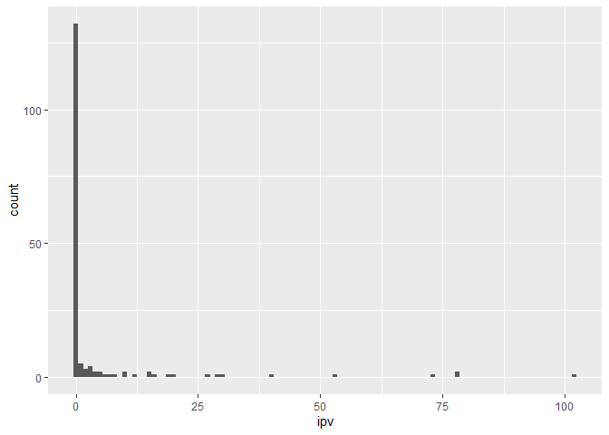<!-- -->

Now, let's go ahead and run the model:


``` r
sim_phys_1 <- brm(bf(ipv ~ 1,
                     hu ~ 1),
                     data = dd,
                     family = hurdle_negbinomial(),
                     chains = 4, iter = 2000, warmup = 1000, cores = 4,
                     seed = 1234,
                     file = "fits/sim_phys_1",
                     file_refit = "on_change"
                )
```

And summarize the output: 

``` r
summary(sim_phys_1)
```

```
##  Family: hurdle_negbinomial 
##   Links: mu = log; shape = identity; hu = logit 
## Formula: ipv ~ 1 
##          hu ~ 1
##    Data: dd (Number of observations: 168) 
##   Draws: 4 chains, each with iter = 2000; warmup = 1000; thin = 1;
##          total post-warmup draws = 4000
## 
## Regression Coefficients:
##              Estimate Est.Error l-95% CI u-95% CI Rhat Bulk_ESS Tail_ESS
## Intercept       -2.24      3.17    -9.57     2.66 1.00      673      697
## hu_Intercept     1.28      0.18     0.93     1.64 1.00     1511     1585
## 
## Further Distributional Parameters:
##       Estimate Est.Error l-95% CI u-95% CI Rhat Bulk_ESS Tail_ESS
## shape     0.03      0.08     0.00     0.30 1.00      671      729
## 
## Draws were sampled using sample(hmc). For each parameter, Bulk_ESS
## and Tail_ESS are effective sample size measures, and Rhat is the potential
## scale reduction factor on split chains (at convergence, Rhat = 1).
```

This result is somewhat similar to what we had with the observed data for physical or SGM-specific IPV. In this model, we'd want to see an Intercept around 1 because this is the population parameter that we simulated (but we're not getting that). In other words, when there's really high variance/dispersion going on here, we don't get accurate recovery of the mean/rate parameters in the population. It's not even the 95% compatibility interval, so that's pretty severe. 

Let's also do a posterior predictive check to see how well the model-implied predicted values correspond to the actual data.


``` r
pp_check(sim_phys_1, ndraws = 100)
```

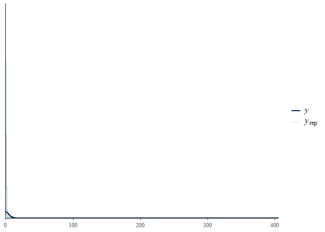<!-- -->

Not the worst in the world, but it's not doing a particularly good job here either. 

Let's take a look at what some more sensible priors would look like. Note, for documentation here I just have the ones that I landed on but different values can be played around with if needed.


``` r
# a is the Intercept term ON THE LOG SCALE, b is the hu_Intercept term ON THE LOG ODDS/LOGIT SCALE; we then back-transform to see what these priors imply about the observed data
set.seed(1234)
psim <- tibble(a = rnorm(1e4, mean = 0, sd = 0.8),
               b = rnorm(1e4, mean = 1.5, sd = 1)) |>
  mutate(lambda = exp(a),
         hu = inv_logit_scaled(b))
```

Let's take a look at the Intercept term (expected mean/rate)

``` r
ggplot(psim, aes(x = a)) + geom_histogram() + xlab("Intercept - log scale")
```

```
## `stat_bin()` using `bins = 30`. Pick better value with `binwidth`.
```

``` r
ggplot(psim, aes(x = lambda)) + geom_histogram(binwidth = 1) + xlab("Intercept - outcome scale")
```

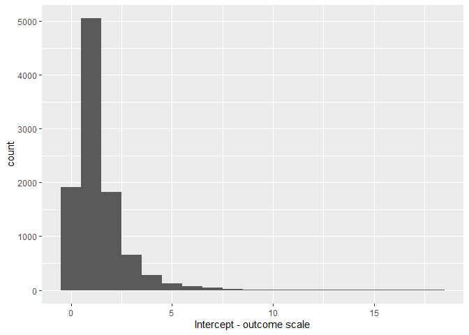

And the hu_Intercept term (proportion of 0s in the data)

``` r
ggplot(psim, aes(x = b)) + geom_histogram() + xlab("hu_Intercept - logit scale")
```

```
## `stat_bin()` using `bins = 30`. Pick better value with `binwidth`.
```

``` r
ggplot(psim, aes(x = hu)) + geom_histogram() + xlab("hu_Intercept - outcome scale")
```

```
## `stat_bin()` using `bins = 30`. Pick better value with `binwidth`.
```

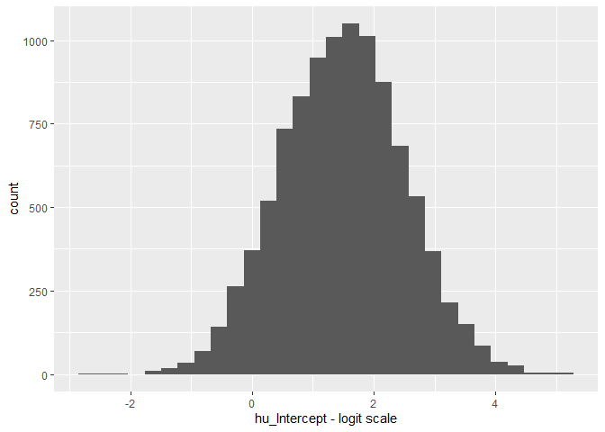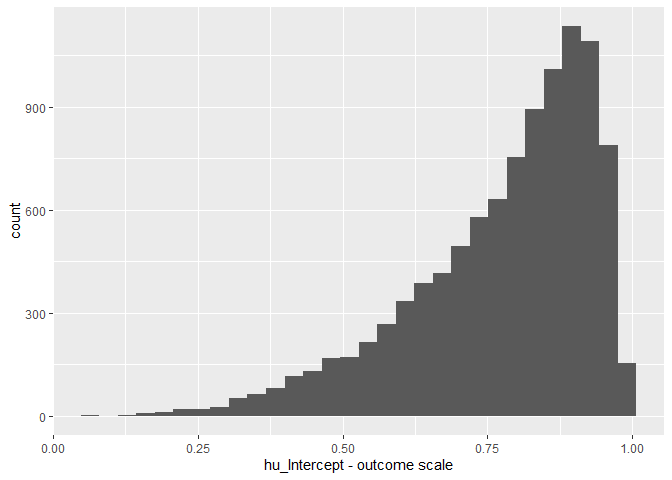

Finally, we have the shape parameter that we want to think about. First let's simulate that default prior:

``` r
set.seed(1234)
psim <- psim |> 
  mutate(c = rgamma(1e4, 0.01, 0.01))
```

Then plot it:

``` r
ggplot(psim, aes(x = c)) + geom_histogram() + xlab("Shape/dispersion - gamma(0.01, 0.01)")
```

```
## `stat_bin()` using `bins = 30`. Pick better value with `binwidth`.
```

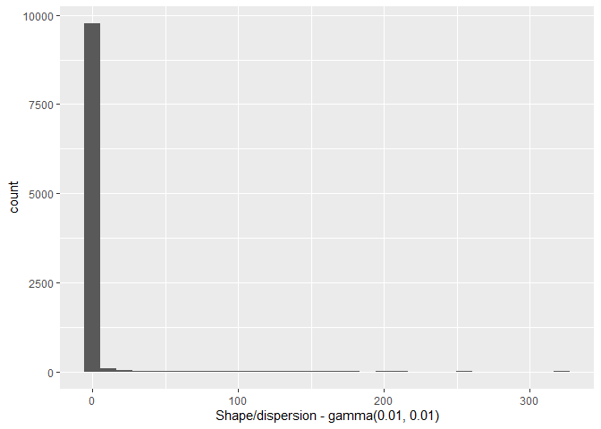<!-- -->
We see here that there are plausible values that go into the 100s. Note that this is on the scale of the data, although it's a little weird to interpret the parameter directly. That's pretty wild, let's keep it at a more reasonable level with the weakly regularizing exponential(1) prior: 


``` r
set.seed(1234)
psim <- psim |> 
  mutate(c = rexp(1e4, 1))
ggplot(psim, aes(x = c)) + geom_histogram() + xlab("Shape/dispersion - exponential(1)")
```

```
## `stat_bin()` using `bins = 30`. Pick better value with `binwidth`.
```

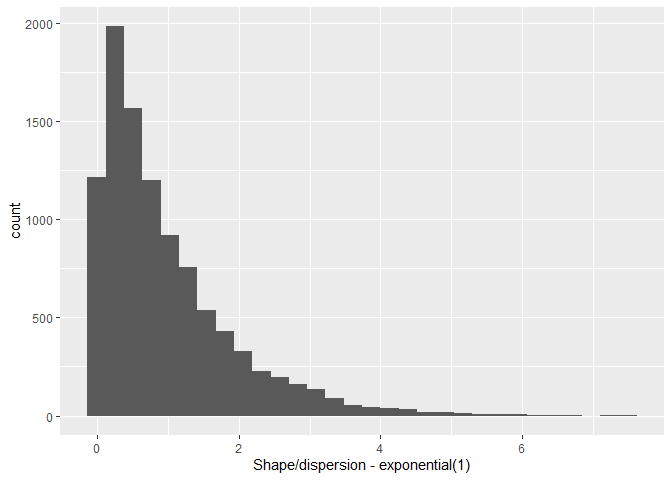<!-- -->
That's much more reasonable here. Wonderful! 

Great, those all look pretty reasonable in terms of the mean/rate & the probability of being a 0 & the dispersion. Let's go ahead and re-run the model with these priors. We'll also place a more regularized prior on the dispersion parameter (labeled shape) so it's not going to go off into the wild too much. 


``` r
sim_phys_2 <- brm(bf(ipv ~ 1,
                     hu ~ 1),
                  prior = c(prior(normal(0, 0.8), class = Intercept), # prior on mean (log scale)
                            prior(normal(1.5, 1), class = Intercept, dpar = hu), # prior on odds of being 0 (logit scale)
                            prior(exponential(1), class = shape) # prior on dispersion
                  ),
                     data = dd,
                     family = hurdle_negbinomial(),
                     chains = 4, iter = 2000, warmup = 1000, cores = 4,
                     seed = 1234,
                     file = "fits/sim_phys_2",
                     file_refit = "on_change"
                )
```

And summarize the output: 

``` r
summary(sim_phys_2)
```

```
##  Family: hurdle_negbinomial 
##   Links: mu = log; shape = identity; hu = logit 
## Formula: ipv ~ 1 
##          hu ~ 1
##    Data: dd (Number of observations: 168) 
##   Draws: 4 chains, each with iter = 2000; warmup = 1000; thin = 1;
##          total post-warmup draws = 4000
## 
## Regression Coefficients:
##              Estimate Est.Error l-95% CI u-95% CI Rhat Bulk_ESS Tail_ESS
## Intercept        0.89      0.85    -0.81     2.40 1.00     1342     1618
## hu_Intercept     1.32      0.19     0.95     1.71 1.00     1985     1615
## 
## Further Distributional Parameters:
##       Estimate Est.Error l-95% CI u-95% CI Rhat Bulk_ESS Tail_ESS
## shape     0.06      0.07     0.00     0.27 1.00     1311     1650
## 
## Draws were sampled using sample(hmc). For each parameter, Bulk_ESS
## and Tail_ESS are effective sample size measures, and Rhat is the potential
## scale reduction factor on split chains (at convergence, Rhat = 1).
```

Now this is MUCH better - we see that the Intercept is roughly within the range of the population parameter. Further, we see that the compatibility interval around that estimate now contains the true population parameter (1.0), which is much more encouraging. These priors still leave some room for the data to speak to the story of what is going on here. 

Finally, let's take a look at the posterior predictive check:

``` r
pp_check(sim_phys_2, ndraws = 100)
```

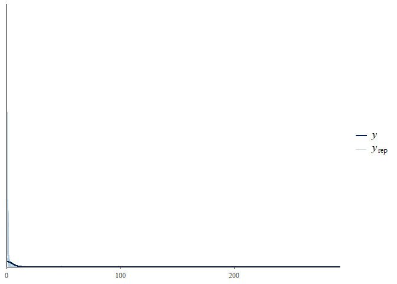<!-- -->

That's roughly within the bounds of the simulated data as well, although the model does predict some potential really extreme values out in the tails. That's ok - that is possible in these data where you might get a really aggressive couple or two in the sample. 

#### Psych IPV - overall & minor 

Now let's fiddle with some data simulation where the rate of zeroes in psych IPV (both overall and minor) is closer to 10% (vs. 80ish% for physical & SGM-specific IPV).

First, simulate some data:

``` r
# set population parameters - formula is the Intercept rate and the variance is the dispersion parameter
def <- defData(varname = "ipv", dist = "negBinomial", formula = 3, variance = 2, link = "log")

# simulate a dataset of 184 people to utilize
set.seed(12345)
dd <- genData(168, def)
```

Let's see what that looks like

``` r
dd |> frq(ipv)
```

```
## ipv <integer> 
## # total N=168 valid N=168 mean=21.00 sd=27.23
## 
## Value |  N | Raw % | Valid % | Cum. %
## -------------------------------------
##     0 | 21 | 12.50 |   12.50 |  12.50
##     1 | 10 |  5.95 |    5.95 |  18.45
##     2 |  9 |  5.36 |    5.36 |  23.81
##     3 |  6 |  3.57 |    3.57 |  27.38
##     4 | 11 |  6.55 |    6.55 |  33.93
##     5 |  5 |  2.98 |    2.98 |  36.90
##     6 |  5 |  2.98 |    2.98 |  39.88
##     7 |  4 |  2.38 |    2.38 |  42.26
##     8 |  3 |  1.79 |    1.79 |  44.05
##     9 |  9 |  5.36 |    5.36 |  49.40
##    10 |  3 |  1.79 |    1.79 |  51.19
##    11 |  4 |  2.38 |    2.38 |  53.57
##    12 |  3 |  1.79 |    1.79 |  55.36
##    15 |  3 |  1.79 |    1.79 |  57.14
##    16 |  4 |  2.38 |    2.38 |  59.52
##    17 |  3 |  1.79 |    1.79 |  61.31
##    18 |  3 |  1.79 |    1.79 |  63.10
##    20 |  4 |  2.38 |    2.38 |  65.48
##    21 |  4 |  2.38 |    2.38 |  67.86
##    22 |  4 |  2.38 |    2.38 |  70.24
##    24 |  3 |  1.79 |    1.79 |  72.02
##    25 |  1 |  0.60 |    0.60 |  72.62
##    27 |  1 |  0.60 |    0.60 |  73.21
##    28 |  1 |  0.60 |    0.60 |  73.81
##    29 |  2 |  1.19 |    1.19 |  75.00
##    30 |  5 |  2.98 |    2.98 |  77.98
##    31 |  2 |  1.19 |    1.19 |  79.17
##    32 |  1 |  0.60 |    0.60 |  79.76
##    35 |  1 |  0.60 |    0.60 |  80.36
##    36 |  4 |  2.38 |    2.38 |  82.74
##    37 |  1 |  0.60 |    0.60 |  83.33
##    38 |  2 |  1.19 |    1.19 |  84.52
##    39 |  2 |  1.19 |    1.19 |  85.71
##    41 |  1 |  0.60 |    0.60 |  86.31
##    48 |  1 |  0.60 |    0.60 |  86.90
##    49 |  1 |  0.60 |    0.60 |  87.50
##    51 |  1 |  0.60 |    0.60 |  88.10
##    52 |  1 |  0.60 |    0.60 |  88.69
##    53 |  1 |  0.60 |    0.60 |  89.29
##    54 |  1 |  0.60 |    0.60 |  89.88
##    57 |  1 |  0.60 |    0.60 |  90.48
##    61 |  1 |  0.60 |    0.60 |  91.07
##    64 |  1 |  0.60 |    0.60 |  91.67
##    65 |  1 |  0.60 |    0.60 |  92.26
##    74 |  1 |  0.60 |    0.60 |  92.86
##    75 |  1 |  0.60 |    0.60 |  93.45
##    76 |  1 |  0.60 |    0.60 |  94.05
##    80 |  1 |  0.60 |    0.60 |  94.64
##    83 |  1 |  0.60 |    0.60 |  95.24
##    87 |  2 |  1.19 |    1.19 |  96.43
##    92 |  1 |  0.60 |    0.60 |  97.02
##   102 |  1 |  0.60 |    0.60 |  97.62
##   111 |  1 |  0.60 |    0.60 |  98.21
##   124 |  1 |  0.60 |    0.60 |  98.81
##   127 |  1 |  0.60 |    0.60 |  99.40
##   137 |  1 |  0.60 |    0.60 | 100.00
##  <NA> |  0 |  0.00 |    <NA> |   <NA>
```

``` r
ggplot(dd, aes(x = ipv)) + geom_histogram(binwidth = 1)
```

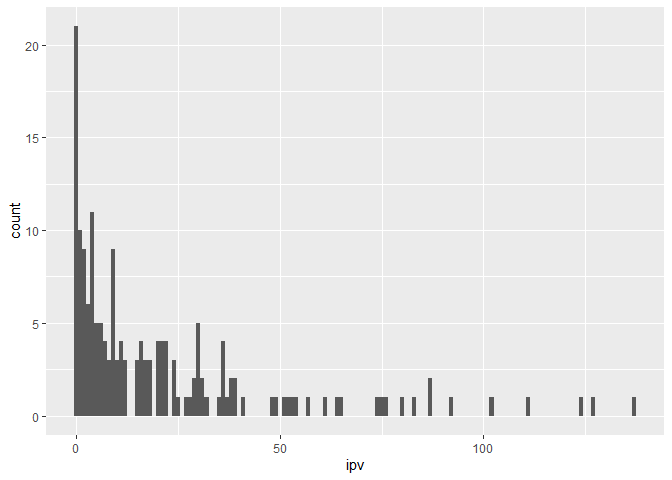<!-- -->

Now, let's go ahead and run the model:


``` r
sim_psych_1 <- brm(bf(ipv ~ 1,
                     hu ~ 1),
                     data = dd,
                     family = hurdle_negbinomial(),
                     chains = 4, iter = 2000, warmup = 1000, cores = 4,
                     seed = 1234,
                     file = "fits/sim_psych_1",
                     file_refit = "on_change"
                )
```

And summarize the output: 

``` r
summary(sim_psych_1)
```

```
##  Family: hurdle_negbinomial 
##   Links: mu = log; shape = identity; hu = logit 
## Formula: ipv ~ 1 
##          hu ~ 1
##    Data: dd (Number of observations: 168) 
##   Draws: 4 chains, each with iter = 2000; warmup = 1000; thin = 1;
##          total post-warmup draws = 4000
## 
## Regression Coefficients:
##              Estimate Est.Error l-95% CI u-95% CI Rhat Bulk_ESS Tail_ESS
## Intercept        3.04      0.12     2.80     3.27 1.00     2562     2584
## hu_Intercept    -1.92      0.23    -2.39    -1.50 1.00     3087     2380
## 
## Further Distributional Parameters:
##       Estimate Est.Error l-95% CI u-95% CI Rhat Bulk_ESS Tail_ESS
## shape     0.58      0.11     0.37     0.82 1.00     2460     2480
## 
## Draws were sampled using sample(hmc). For each parameter, Bulk_ESS
## and Tail_ESS are effective sample size measures, and Rhat is the potential
## scale reduction factor on split chains (at convergence, Rhat = 1).
```

We see here that, UNLIKE the physical & SGM-specific IPV, the default priors do a much better job in this model. We see parameter estimates that are roughly equivalent to the population parameters that we simulated here. Let's see how the posterior predictive check fairs:


``` r
pp_check(sim_psych_1, ndraws = 100)
```

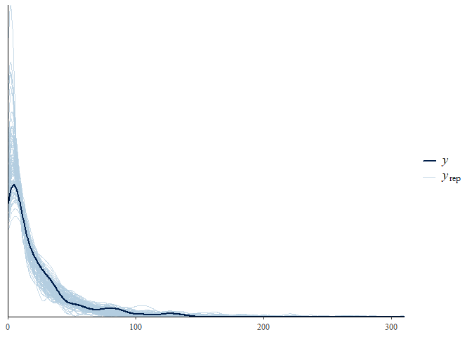<!-- -->

Not too shabby here! 

Still, we want to make sure that we have reasoned priors that incorporate our domain knowledge about psych IPV perpetration into the model (rather than just based on the data at hand). 


``` r
# a is the Intercept term ON THE LOG SCALE, b is the hu_Intercept term ON THE LOG ODDS/LOGIT SCALE; we then back-transform to see what these priors imply about the observed data
set.seed(1234)
psim <- tibble(a = rnorm(1e4, mean = 1, sd = 0.5),
               b = rnorm(1e4, mean = -1.5, sd = 1)) |>
  mutate(lambda = exp(a),
         hu = inv_logit_scaled(b))
```

Let's take a look at the Intercept term (expected mean/rate)

``` r
ggplot(psim, aes(x = a)) + geom_histogram() + xlab("Intercept - log scale")
```

```
## `stat_bin()` using `bins = 30`. Pick better value with `binwidth`.
```

``` r
ggplot(psim, aes(x = lambda)) + geom_histogram(binwidth = 1) + xlab("Intercept - outcome scale")
```

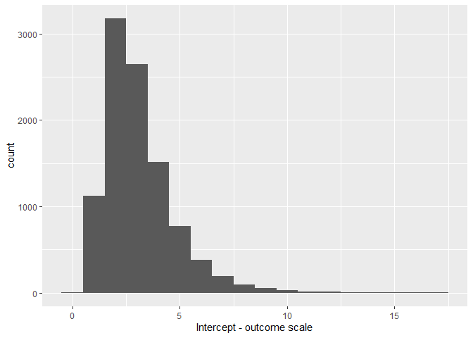

And the hu_Intercept term (proportion of 0s in the data)

``` r
ggplot(psim, aes(x = b)) + geom_histogram() + xlab("hu_Intercept - logit scale")
```

```
## `stat_bin()` using `bins = 30`. Pick better value with `binwidth`.
```

``` r
ggplot(psim, aes(x = hu)) + geom_histogram() + xlab("hu_Intercept - outcome scale")
```

```
## `stat_bin()` using `bins = 30`. Pick better value with `binwidth`.
```

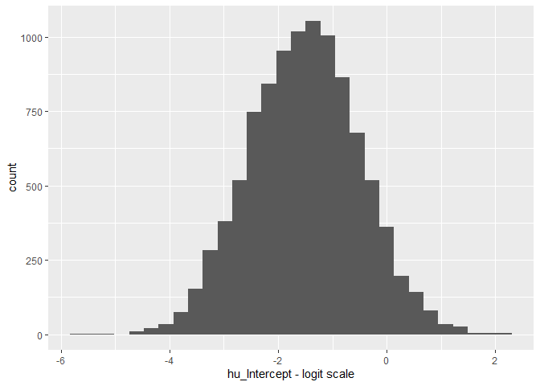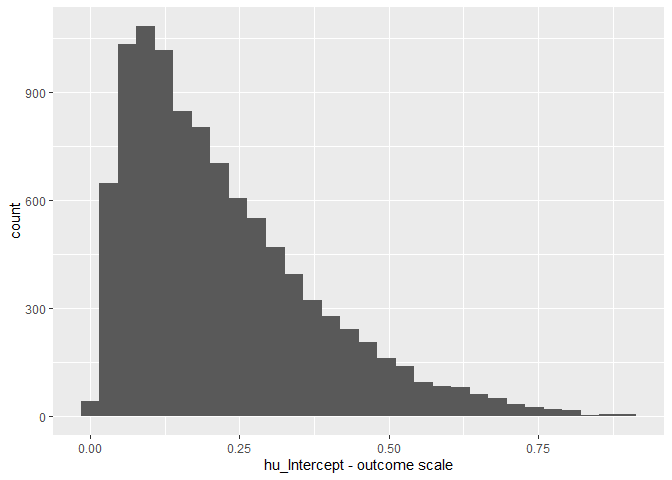

Now let's re-run the model with those priors:

``` r
sim_psych_2 <- brm(bf(ipv ~ 1,
                      hu ~ 1),
                  prior = c(prior(normal(1, 0.5), class = Intercept), # prior on mean (log scale)
                            prior(normal(-1.5, 1), class = Intercept, dpar = hu), # prior on odds of being 0 (logit scale)
                            prior(exponential(1), class = shape) # prior on dispersion
                  ),
                     data = dd,
                     family = hurdle_negbinomial(),
                     chains = 4, iter = 2000, warmup = 1000, cores = 4,
                     seed = 1234,
                     file = "fits/sim_psych_2",
                     file_refit = "on_change"
                )
```

Summarize:

``` r
summary(sim_psych_2)
```

```
##  Family: hurdle_negbinomial 
##   Links: mu = log; shape = identity; hu = logit 
## Formula: ipv ~ 1 
##          hu ~ 1
##    Data: dd (Number of observations: 168) 
##   Draws: 4 chains, each with iter = 2000; warmup = 1000; thin = 1;
##          total post-warmup draws = 4000
## 
## Regression Coefficients:
##              Estimate Est.Error l-95% CI u-95% CI Rhat Bulk_ESS Tail_ESS
## Intercept        2.93      0.13     2.65     3.16 1.00     2226     1572
## hu_Intercept    -1.94      0.23    -2.38    -1.51 1.00     2985     2823
## 
## Further Distributional Parameters:
##       Estimate Est.Error l-95% CI u-95% CI Rhat Bulk_ESS Tail_ESS
## shape     0.54      0.12     0.31     0.78 1.00     2230     1932
## 
## Draws were sampled using sample(hmc). For each parameter, Bulk_ESS
## and Tail_ESS are effective sample size measures, and Rhat is the potential
## scale reduction factor on split chains (at convergence, Rhat = 1).
```

It's really not that different from the original, default priors. This is good! It might not matter for this basic, intercept-only model that doesn't account for nesting but it might in future models as we get more complex here. Let's check out the posterior predictive check as well:


``` r
pp_check(sim_psych_2, ndraws = 100)
```

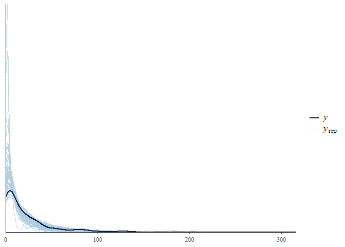<!-- -->

Also doing a really nice job here still! 

One thing to note for your future self is that the Intercept parameter in these hurdle models seems to correspond to the OVERALL mean in the data. It's not necessarily picking up on the mean of those who are > 0. 

#### Psych IPV - severe 

Now let's fiddle with some data simulation where the rate of zeroes in severe psych IPV is closer to 50% (vs. 80ish% for physical & SGM-specific IPV + 10% for overall & minor psych IPV).

First, simulate some data:

``` r
# set population parameters - formula is the Intercept rate and the variance is the dispersion parameter
def <- defData(varname = "ipv", dist = "negBinomial", formula = 0.5, variance = 3, link = "log")

# simulate a dataset of 184 people to utilize
set.seed(12345)
dd <- genData(168, def)
```

Let's see what that looks like

``` r
dd |> frq(ipv)
```

```
## ipv <integer> 
## # total N=168 valid N=168 mean=1.74 sd=2.96
## 
## Value |  N | Raw % | Valid % | Cum. %
## -------------------------------------
##     0 | 92 | 54.76 |   54.76 |  54.76
##     1 | 16 |  9.52 |    9.52 |  64.29
##     2 | 19 | 11.31 |   11.31 |  75.60
##     3 | 15 |  8.93 |    8.93 |  84.52
##     4 |  8 |  4.76 |    4.76 |  89.29
##     5 |  2 |  1.19 |    1.19 |  90.48
##     6 |  1 |  0.60 |    0.60 |  91.07
##     7 |  3 |  1.79 |    1.79 |  92.86
##     8 |  3 |  1.79 |    1.79 |  94.64
##     9 |  4 |  2.38 |    2.38 |  97.02
##    10 |  1 |  0.60 |    0.60 |  97.62
##    12 |  1 |  0.60 |    0.60 |  98.21
##    13 |  2 |  1.19 |    1.19 |  99.40
##    17 |  1 |  0.60 |    0.60 | 100.00
##  <NA> |  0 |  0.00 |    <NA> |   <NA>
```

``` r
ggplot(dd, aes(x = ipv)) + geom_histogram(binwidth = 1)
```

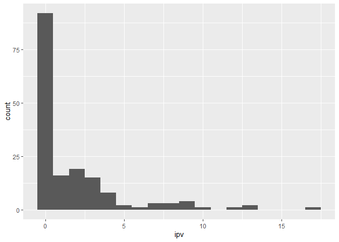<!-- -->


``` r
# a is the Intercept term ON THE LOG SCALE, b is the hu_Intercept term ON THE LOG ODDS/LOGIT SCALE; we then back-transform to see what these priors imply about the observed data
set.seed(1234)
psim <- tibble(a = rnorm(1e4, mean = 1, sd = 0.5),
               b = rnorm(1e4, mean = 0, sd = 0.5)) |>
  mutate(lambda = exp(a),
         hu = inv_logit_scaled(b))
```

Let's take a look at the Intercept term (expected mean/rate)

``` r
ggplot(psim, aes(x = a)) + geom_histogram() + xlab("Intercept - log scale")
```

```
## `stat_bin()` using `bins = 30`. Pick better value with `binwidth`.
```

``` r
ggplot(psim, aes(x = lambda)) + geom_histogram(binwidth = 1) + xlab("Intercept - outcome scale")
```

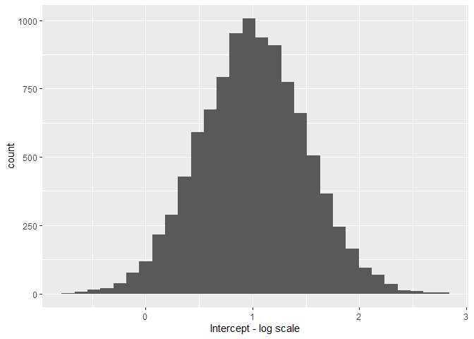

And the hu_Intercept term (proportion of 0s in the data)

``` r
ggplot(psim, aes(x = b)) + geom_histogram() + xlab("hu_Intercept - logit scale")
```

```
## `stat_bin()` using `bins = 30`. Pick better value with `binwidth`.
```

``` r
ggplot(psim, aes(x = hu)) + geom_histogram() + xlab("hu_Intercept - outcome scale")
```

```
## `stat_bin()` using `bins = 30`. Pick better value with `binwidth`.
```

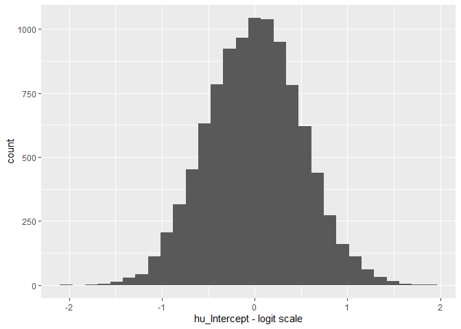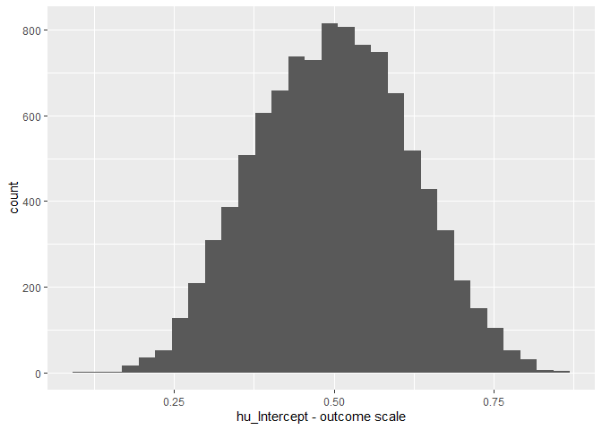

Now let's re-run the model with those priors:

``` r
sim_psych_3 <- brm(bf(ipv ~ 1,
                      hu ~ 1),
                  prior = c(prior(normal(1, 0.5), class = Intercept), # prior on mean (log scale)
                            prior(normal(0, 0.5), class = Intercept, dpar = hu), # prior on odds of being 0 (logit scale)
                            prior(exponential(1), class = shape) # prior on dispersion
                  ),
                     data = dd,
                     family = hurdle_negbinomial(),
                     chains = 4, iter = 2000, warmup = 1000, cores = 4,
                     seed = 1234,
                     file = "fits/sim_psych_3",
                     file_refit = "on_change"
                )
```

Summarize:

``` r
summary(sim_psych_3)
```

```
##  Family: hurdle_negbinomial 
##   Links: mu = log; shape = identity; hu = logit 
## Formula: ipv ~ 1 
##          hu ~ 1
##    Data: dd (Number of observations: 168) 
##   Draws: 4 chains, each with iter = 2000; warmup = 1000; thin = 1;
##          total post-warmup draws = 4000
## 
## Regression Coefficients:
##              Estimate Est.Error l-95% CI u-95% CI Rhat Bulk_ESS Tail_ESS
## Intercept        1.01      0.19     0.59     1.33 1.00     2004     1750
## hu_Intercept     0.17      0.15    -0.12     0.46 1.00     2661     2602
## 
## Further Distributional Parameters:
##       Estimate Est.Error l-95% CI u-95% CI Rhat Bulk_ESS Tail_ESS
## shape     1.00      0.42     0.36     2.03 1.00     1837     1764
## 
## Draws were sampled using sample(hmc). For each parameter, Bulk_ESS
## and Tail_ESS are effective sample size measures, and Rhat is the potential
## scale reduction factor on split chains (at convergence, Rhat = 1).
```

We see here that it does an OK (but not great) job of capturing the simulated data here. 


``` r
pp_check(sim_psych_3, ndraws = 100)
```

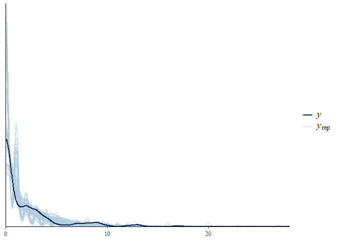<!-- -->

### Informative 

Now that we've specified some priors, let's re-run the basic models from before with these priors in place. 


``` r
like_psych_1 <- brm(bf(CTS_psych_perp_HR ~ 1,
                     hu ~ 1),
                  prior = c(prior(normal(1, 0.5), class = Intercept), # prior on mean (log scale)
                            prior(normal(-1.5, 1), class = Intercept, dpar = hu), # prior on odds of being 0 (logit scale)
                            prior(exponential(1), class = shape) # prior on dispersion
                  ),
                  data = data,
                  family = hurdle_negbinomial(),
                  chains = 4, iter = 2000, warmup = 1000, cores = 4,
                  seed = 1234,
                  file = "fits/like_psych_1",
                  file_refit = "on_change"
                  )
```

```
## Warning: Rows containing NAs were excluded from the model.
```

``` r
like_psych_min_1 <- brm(bf(CTS_psych_perp_HR_minor ~ 1,
                     hu ~ 1),
                  prior = c(prior(normal(1, 0.5), class = Intercept), # prior on mean (log scale)
                            prior(normal(-1.5, 1), class = Intercept, dpar = hu), # prior on odds of being 0 (logit scale)
                            prior(exponential(1), class = shape) # prior on dispersion
                  ),
                  data = data,
                  family = hurdle_negbinomial(),
                  chains = 4, iter = 2000, warmup = 1000, cores = 4,
                  seed = 1234,
                  file = "fits/like_psych_min_1",
                  file_refit = "on_change"
                  )
  
like_psych_sev_1 <- brm(bf(CTS_psych_perp_HR_severe ~ 1,
                     hu ~ 1),
                  prior = c(prior(normal(1, 0.5), class = Intercept), # prior on mean (log scale)
                            prior(normal(0, 0.5), class = Intercept, dpar = hu), # prior on odds of being 0 (logit scale)
                            prior(exponential(1), class = shape) # prior on dispersion
                  ),
                  data = data,
                  family = hurdle_negbinomial(),
                  chains = 4, iter = 2000, warmup = 1000, cores = 4,
                  seed = 1234,
                  file = "fits/like_psych_sev_1",
                  file_refit = "on_change"
                  )
```

```
## Warning: Rows containing NAs were excluded from the model.
```

``` r
like_phys_1 <- brm(bf(CTS_phys_perp_HR ~ 1,
                     hu ~ 1),
                  prior = c(prior(normal(0, 0.8), class = Intercept), # prior on mean (log scale)
                            prior(normal(1.5, 1), class = Intercept, dpar = hu), # prior on odds of being 0 (logit scale)
                            prior(exponential(1), class = shape) # prior on dispersion
                  ),
                 data = data,
                  family = hurdle_negbinomial(),
                  chains = 4, iter = 2000, warmup = 1000, cores = 4,
                  seed = 1234,
                  file = "fits/like_phys_1",
                  file_refit = "on_change"
                  )
```

```
## Warning: Rows containing NAs were excluded from the model.
```

``` r
like_sgm_1 <- brm(bf(CTS_sgm_perp_HR ~ 1,
                   hu ~ 1),
                  prior = c(prior(normal(0, 0.8), class = Intercept), # prior on mean (log scale)
                            prior(normal(1.5, 1), class = Intercept, dpar = hu), # prior on odds of being 0 (logit scale)
                            prior(exponential(1), class = shape) # prior on dispersion
                  ),
                data = data,
                  family = hurdle_negbinomial(),
                  chains = 4, iter = 2000, warmup = 1000, cores = 4,
                  seed = 1234,
                  file = "fits/like_sgm_1",
                  file_refit = "on_change"
                  )
```

```
## Warning: Rows containing NAs were excluded from the model.
```

Now let's summarize. Psychological:

``` r
summary(like_psych_1)
```

```
##  Family: hurdle_negbinomial 
##   Links: mu = log; shape = identity; hu = logit 
## Formula: CTS_psych_perp_HR ~ 1 
##          hu ~ 1
##    Data: data (Number of observations: 164) 
##   Draws: 4 chains, each with iter = 2000; warmup = 1000; thin = 1;
##          total post-warmup draws = 4000
## 
## Regression Coefficients:
##              Estimate Est.Error l-95% CI u-95% CI Rhat Bulk_ESS Tail_ESS
## Intercept        2.78      0.20     2.33     3.08 1.00     1382     1262
## hu_Intercept    -2.34      0.26    -2.89    -1.86 1.00     2242     2060
## 
## Further Distributional Parameters:
##       Estimate Est.Error l-95% CI u-95% CI Rhat Bulk_ESS Tail_ESS
## shape     0.38      0.11     0.17     0.61 1.00     1418     1121
## 
## Draws were sampled using sample(hmc). For each parameter, Bulk_ESS
## and Tail_ESS are effective sample size measures, and Rhat is the potential
## scale reduction factor on split chains (at convergence, Rhat = 1).
```

Psychological minor:

``` r
summary(like_psych_min_1)
```

```
##  Family: hurdle_negbinomial 
##   Links: mu = log; shape = identity; hu = logit 
## Formula: CTS_psych_perp_HR_minor ~ 1 
##          hu ~ 1
##    Data: data (Number of observations: 168) 
##   Draws: 4 chains, each with iter = 2000; warmup = 1000; thin = 1;
##          total post-warmup draws = 4000
## 
## Regression Coefficients:
##              Estimate Est.Error l-95% CI u-95% CI Rhat Bulk_ESS Tail_ESS
## Intercept        2.63      0.17     2.24     2.90 1.00     1474     1068
## hu_Intercept    -2.16      0.24    -2.66    -1.70 1.00     2774     2149
## 
## Further Distributional Parameters:
##       Estimate Est.Error l-95% CI u-95% CI Rhat Bulk_ESS Tail_ESS
## shape     0.45      0.12     0.21     0.69 1.00     1529      971
## 
## Draws were sampled using sample(hmc). For each parameter, Bulk_ESS
## and Tail_ESS are effective sample size measures, and Rhat is the potential
## scale reduction factor on split chains (at convergence, Rhat = 1).
```

Psychological severe:

``` r
summary(like_psych_sev_1)
```

```
##  Family: hurdle_negbinomial 
##   Links: mu = log; shape = identity; hu = logit 
## Formula: CTS_psych_perp_HR_severe ~ 1 
##          hu ~ 1
##    Data: data (Number of observations: 164) 
##   Draws: 4 chains, each with iter = 2000; warmup = 1000; thin = 1;
##          total post-warmup draws = 4000
## 
## Regression Coefficients:
##              Estimate Est.Error l-95% CI u-95% CI Rhat Bulk_ESS Tail_ESS
## Intercept        1.31      0.37     0.46     1.91 1.00     1433     1294
## hu_Intercept     0.18      0.15    -0.11     0.47 1.00     2012     1768
## 
## Further Distributional Parameters:
##       Estimate Est.Error l-95% CI u-95% CI Rhat Bulk_ESS Tail_ESS
## shape     0.21      0.11     0.06     0.47 1.00     1437     1336
## 
## Draws were sampled using sample(hmc). For each parameter, Bulk_ESS
## and Tail_ESS are effective sample size measures, and Rhat is the potential
## scale reduction factor on split chains (at convergence, Rhat = 1).
```

Physical:

``` r
summary(like_phys_1)
```

```
##  Family: hurdle_negbinomial 
##   Links: mu = log; shape = identity; hu = logit 
## Formula: CTS_phys_perp_HR ~ 1 
##          hu ~ 1
##    Data: data (Number of observations: 164) 
##   Draws: 4 chains, each with iter = 2000; warmup = 1000; thin = 1;
##          total post-warmup draws = 4000
## 
## Regression Coefficients:
##              Estimate Est.Error l-95% CI u-95% CI Rhat Bulk_ESS Tail_ESS
## Intercept        0.33      0.70    -1.07     1.67 1.00     1487     1951
## hu_Intercept     1.72      0.22     1.30     2.16 1.00     2239     2210
## 
## Further Distributional Parameters:
##       Estimate Est.Error l-95% CI u-95% CI Rhat Bulk_ESS Tail_ESS
## shape     0.03      0.03     0.00     0.11 1.00     1571     2004
## 
## Draws were sampled using sample(hmc). For each parameter, Bulk_ESS
## and Tail_ESS are effective sample size measures, and Rhat is the potential
## scale reduction factor on split chains (at convergence, Rhat = 1).
```

SGM-specific:

``` r
summary(like_sgm_1)
```

```
##  Family: hurdle_negbinomial 
##   Links: mu = log; shape = identity; hu = logit 
## Formula: CTS_sgm_perp_HR ~ 1 
##          hu ~ 1
##    Data: data (Number of observations: 164) 
##   Draws: 4 chains, each with iter = 2000; warmup = 1000; thin = 1;
##          total post-warmup draws = 4000
## 
## Regression Coefficients:
##              Estimate Est.Error l-95% CI u-95% CI Rhat Bulk_ESS Tail_ESS
## Intercept        0.60      0.59    -0.77     1.50 1.00     1196     1301
## hu_Intercept     1.86      0.23     1.43     2.31 1.00     2379     1914
## 
## Further Distributional Parameters:
##       Estimate Est.Error l-95% CI u-95% CI Rhat Bulk_ESS Tail_ESS
## shape     0.38      0.32     0.04     1.18 1.00     1288     1567
## 
## Draws were sampled using sample(hmc). For each parameter, Bulk_ESS
## and Tail_ESS are effective sample size measures, and Rhat is the potential
## scale reduction factor on split chains (at convergence, Rhat = 1).
```

Now we see that the intervals for all of these models are much tighter and within the bounds of the data. Just for curiosity, let's see what the posterior predictive checks show. 

Psychological:

``` r
pp_check(like_psych_1, ndraws = 100)
```

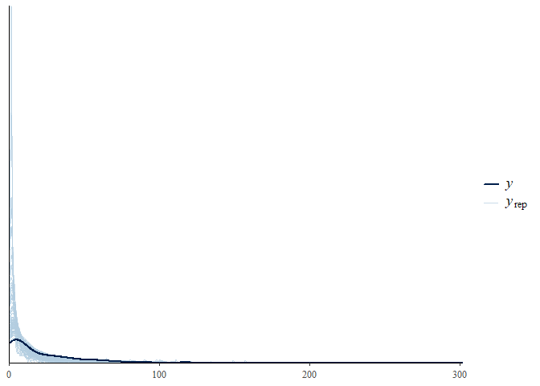<!-- -->

Psychological - minor:

``` r
pp_check(like_psych_min_1, ndraws = 100)
```

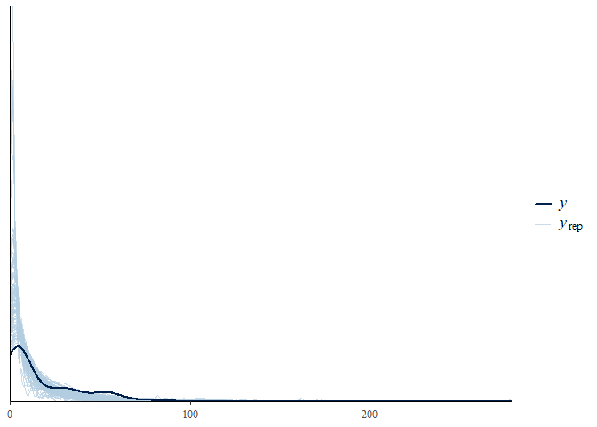<!-- -->

Psychological - severe:

``` r
pp_check(like_psych_sev_1, ndraws = 100)
```

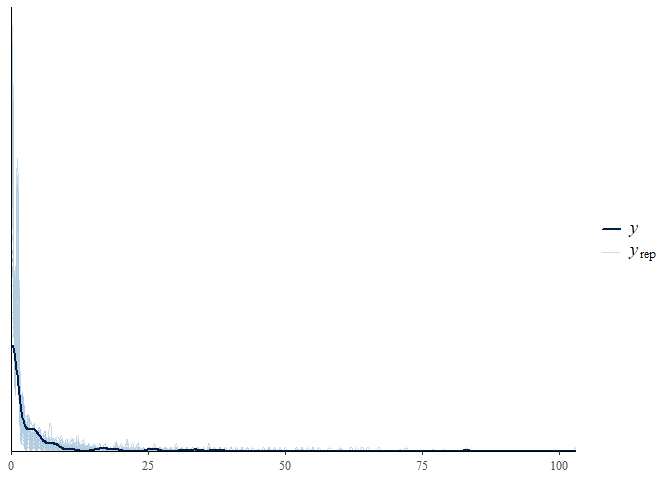<!-- -->

Physical:

``` r
pp_check(like_phys_1, ndraws = 100)
```

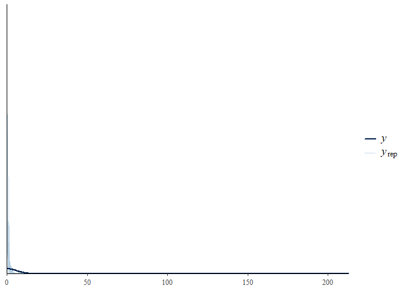<!-- -->

SGM_specific:

``` r
pp_check(like_sgm_1, ndraws = 100)
```

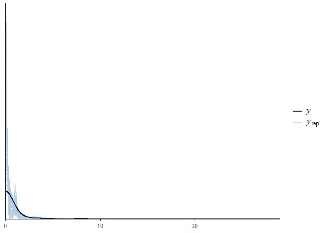<!-- -->

Not too terrible there with any of these! Physical is the least similar, but not that the wide range is likely because of the one couple (1082) with a very large number of physical acts (213) so it's going to show on the y-axis there. 

Up to now, we've been ignoring the non-independence that is introduced by couple nesting. This is absolutely something we are going to have to model, so now let's turn to how we can set some sensible priors when we account for dyad-level variation in estimated odds of being a 0 and mean/rates of IPV perpetraton frequency. 

### Couple nesting

Let's see what happens when we account for dyadic interdependence. We'll leave the default prior on intercept variation in these models to see what that looks like. 


``` r
like_psych_2 <- brm(bf(CTS_psych_perp_HR ~ 0 + Intercept + (1 | CoupleID),
                     hu ~ 0 + Intercept+ (1 | CoupleID)),
                  prior = c(prior(normal(1, 0.5), class = b, coef = Intercept), # prior on mean (log scale)
                            prior(normal(-1.5, 1), class = b, coef = Intercept, dpar = hu), # prior on odds of being 0 (logit scale)
                            prior(exponential(1), class = shape) # prior on dispersion
                  ),
                  data = data,
                  family = hurdle_negbinomial(),
                  chains = 4, iter = 2000, warmup = 1000, cores = 4,
                  seed = 1234,
                  file = "fits/like_psych_2",
                  file_refit = "on_change"
                  )
```

```
## Warning: Rows containing NAs were excluded from the model.
```

``` r
like_psych_min_2 <- brm(bf(CTS_psych_perp_HR_minor ~ 0 + Intercept + (1 | CoupleID),
                     hu ~ 0 + Intercept+ (1 | CoupleID)),
                  prior = c(prior(normal(1, 0.5), class = b, coef = Intercept), # prior on mean (log scale)
                            prior(normal(-1.5, 1), class = b, coef = Intercept, dpar = hu), # prior on odds of being 0 (logit scale)
                            prior(exponential(1), class = shape) # prior on dispersion
                  ),
                  data = data,
                  family = hurdle_negbinomial(),
                  chains = 4, iter = 2000, warmup = 1000, cores = 4,
                  seed = 1234,
                  file = "fits/like_psych_min_2",
                  file_refit = "on_change"
                  )

like_psych_sev_2 <- brm(bf(CTS_psych_perp_HR_severe ~ 0 + Intercept + (1 | CoupleID),
                     hu ~ 0 + Intercept+ (1 | CoupleID)),
                  prior = c(prior(normal(1, 0.5), class = b, coef = Intercept), # prior on mean (log scale)
                            prior(normal(0, 0.5), class = b, coef = Intercept, dpar = hu), # prior on odds of being 0 (logit scale)
                            prior(exponential(1), class = shape) # prior on dispersion
                  ),
                  data = data,
                  family = hurdle_negbinomial(),
                  chains = 4, iter = 2000, warmup = 1000, cores = 4,
                  seed = 1234,
                  file = "fits/like_psych_sev_2",
                  file_refit = "on_change"
                  )
```

```
## Warning: Rows containing NAs were excluded from the model.
```

``` r
like_phys_2 <- brm(bf(CTS_phys_perp_HR ~ 0 + Intercept+ (1 | CoupleID),
                     hu ~ 0 + Intercept+ (1 | CoupleID)),
                  prior = c(prior(normal(0, 0.8), class = b, coef = Intercept), # prior on mean (log scale)
                            prior(normal(1.5, 1), class = b, coef = Intercept, dpar = hu), # prior on odds of being 0 (logit scale)
                            prior(exponential(1), class = shape) # prior on dispersion
                  ),
                 data = data,
                  family = hurdle_negbinomial(),
                  chains = 4, iter = 2000, warmup = 1000, cores = 4,
                  seed = 1234,
                  file = "fits/like_phys_2",
                  file_refit = "on_change"
                  )
```

```
## Warning: Rows containing NAs were excluded from the model.
```

``` r
like_sgm_2 <- brm(bf(CTS_sgm_perp_HR ~ 0 + Intercept + (1 | CoupleID),
                   hu ~ 0 + Intercept + (1 | CoupleID)),
                  prior = c(prior(normal(0, 0.8), class = b, coef = Intercept), # prior on mean (log scale)
                            prior(normal(1.5, 1), class = b, coef = Intercept, dpar = hu), # prior on odds of being 0 (logit scale)
                            prior(exponential(1), class = shape) # prior on dispersion
                  ),
                data = data,
                  family = hurdle_negbinomial(),
                  chains = 4, iter = 2000, warmup = 1000, cores = 4,
                  seed = 1234,
                  file = "fits/like_sgm_2",
                  file_refit = "on_change"
                  )
```

```
## Warning: Rows containing NAs were excluded from the model.
```

Now let's summarize & look at the posterior predictive checks for each model. Starting with psychological:


``` r
summary(like_psych_2)
```

```
##  Family: hurdle_negbinomial 
##   Links: mu = log; shape = identity; hu = logit 
## Formula: CTS_psych_perp_HR ~ 0 + Intercept + (1 | CoupleID) 
##          hu ~ 0 + Intercept + (1 | CoupleID)
##    Data: data (Number of observations: 164) 
##   Draws: 4 chains, each with iter = 2000; warmup = 1000; thin = 1;
##          total post-warmup draws = 4000
## 
## Multilevel Hyperparameters:
## ~CoupleID (Number of levels: 82) 
##                  Estimate Est.Error l-95% CI u-95% CI Rhat Bulk_ESS Tail_ESS
## sd(Intercept)        1.40      0.14     1.15     1.69 1.00      999     1688
## sd(hu_Intercept)     1.99      0.66     0.66     3.35 1.00     1020      813
## 
## Regression Coefficients:
##              Estimate Est.Error l-95% CI u-95% CI Rhat Bulk_ESS Tail_ESS
## Intercept        2.25      0.16     1.93     2.56 1.00      592     1228
## hu_Intercept    -3.38      0.58    -4.56    -2.32 1.00     1550     1798
## 
## Further Distributional Parameters:
##       Estimate Est.Error l-95% CI u-95% CI Rhat Bulk_ESS Tail_ESS
## shape     6.90      1.59     4.23    10.48 1.00     2427     3008
## 
## Draws were sampled using sample(hmc). For each parameter, Bulk_ESS
## and Tail_ESS are effective sample size measures, and Rhat is the potential
## scale reduction factor on split chains (at convergence, Rhat = 1).
```

& PPC:

``` r
pp_check(like_psych_2, ndraws = 100)
```

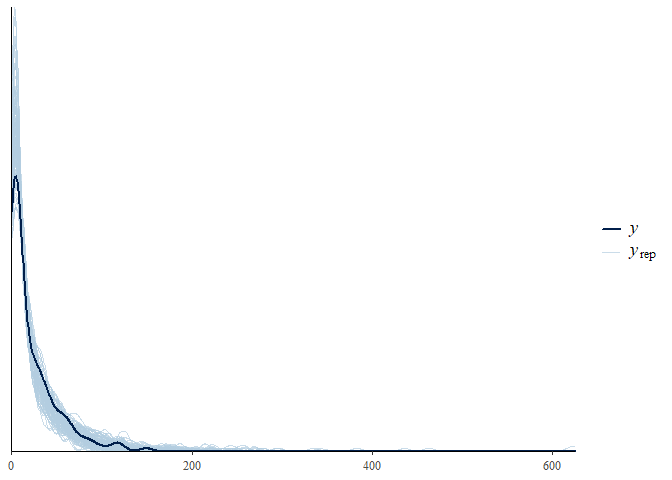<!-- -->

Psychological minor:

``` r
summary(like_psych_min_2)
```

```
##  Family: hurdle_negbinomial 
##   Links: mu = log; shape = identity; hu = logit 
## Formula: CTS_psych_perp_HR_minor ~ 0 + Intercept + (1 | CoupleID) 
##          hu ~ 0 + Intercept + (1 | CoupleID)
##    Data: data (Number of observations: 168) 
##   Draws: 4 chains, each with iter = 2000; warmup = 1000; thin = 1;
##          total post-warmup draws = 4000
## 
## Multilevel Hyperparameters:
## ~CoupleID (Number of levels: 84) 
##                  Estimate Est.Error l-95% CI u-95% CI Rhat Bulk_ESS Tail_ESS
## sd(Intercept)        1.32      0.13     1.08     1.60 1.00      749     1458
## sd(hu_Intercept)     1.82      0.65     0.58     3.17 1.00     1342     1364
## 
## Regression Coefficients:
##              Estimate Est.Error l-95% CI u-95% CI Rhat Bulk_ESS Tail_ESS
## Intercept        2.13      0.15     1.83     2.44 1.00      561     1204
## hu_Intercept    -3.04      0.55    -4.18    -2.06 1.00     1840     2683
## 
## Further Distributional Parameters:
##       Estimate Est.Error l-95% CI u-95% CI Rhat Bulk_ESS Tail_ESS
## shape     7.73      1.82     4.68    11.79 1.00     2448     2825
## 
## Draws were sampled using sample(hmc). For each parameter, Bulk_ESS
## and Tail_ESS are effective sample size measures, and Rhat is the potential
## scale reduction factor on split chains (at convergence, Rhat = 1).
```

& PPC:

``` r
pp_check(like_psych_min_2, ndraws = 100)
```

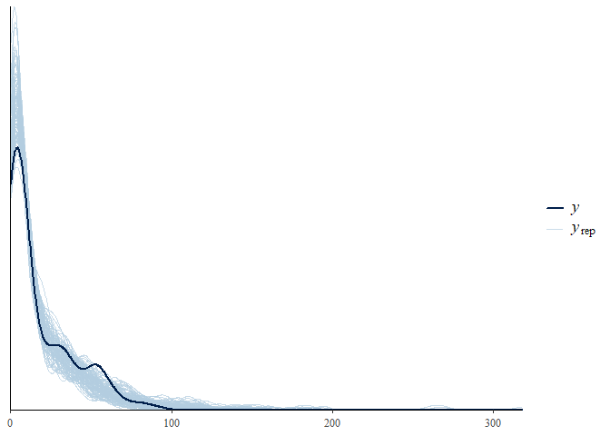<!-- -->

Psychological severe:

``` r
summary(like_psych_sev_2)
```

```
##  Family: hurdle_negbinomial 
##   Links: mu = log; shape = identity; hu = logit 
## Formula: CTS_psych_perp_HR_severe ~ 0 + Intercept + (1 | CoupleID) 
##          hu ~ 0 + Intercept + (1 | CoupleID)
##    Data: data (Number of observations: 164) 
##   Draws: 4 chains, each with iter = 2000; warmup = 1000; thin = 1;
##          total post-warmup draws = 4000
## 
## Multilevel Hyperparameters:
## ~CoupleID (Number of levels: 82) 
##                  Estimate Est.Error l-95% CI u-95% CI Rhat Bulk_ESS Tail_ESS
## sd(Intercept)        1.29      0.23     0.90     1.82 1.00     1267     2013
## sd(hu_Intercept)     4.28      1.19     2.50     7.03 1.00     1689     2483
## 
## Regression Coefficients:
##              Estimate Est.Error l-95% CI u-95% CI Rhat Bulk_ESS Tail_ESS
## Intercept        1.31      0.23     0.84     1.73 1.00     1469     2306
## hu_Intercept     0.23      0.37    -0.49     0.97 1.00     2795     2823
## 
## Further Distributional Parameters:
##       Estimate Est.Error l-95% CI u-95% CI Rhat Bulk_ESS Tail_ESS
## shape     2.60      0.99     1.02     4.86 1.00     1788     1797
## 
## Draws were sampled using sample(hmc). For each parameter, Bulk_ESS
## and Tail_ESS are effective sample size measures, and Rhat is the potential
## scale reduction factor on split chains (at convergence, Rhat = 1).
```

& PPC:

``` r
pp_check(like_psych_sev_2, ndraws = 100)
```

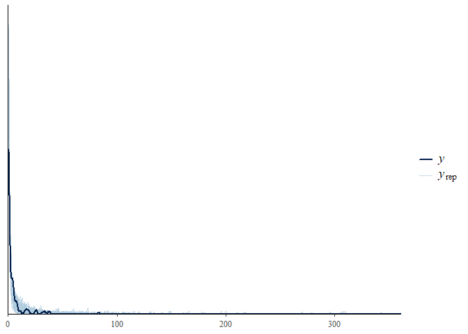<!-- -->

Physical:

``` r
summary(like_phys_2)
```

```
##  Family: hurdle_negbinomial 
##   Links: mu = log; shape = identity; hu = logit 
## Formula: CTS_phys_perp_HR ~ 0 + Intercept + (1 | CoupleID) 
##          hu ~ 0 + Intercept + (1 | CoupleID)
##    Data: data (Number of observations: 164) 
##   Draws: 4 chains, each with iter = 2000; warmup = 1000; thin = 1;
##          total post-warmup draws = 4000
## 
## Multilevel Hyperparameters:
## ~CoupleID (Number of levels: 82) 
##                  Estimate Est.Error l-95% CI u-95% CI Rhat Bulk_ESS Tail_ESS
## sd(Intercept)        2.61      0.75     1.47     4.34 1.00     2340     2923
## sd(hu_Intercept)     3.56      0.89     2.10     5.52 1.00     1980     2534
## 
## Regression Coefficients:
##              Estimate Est.Error l-95% CI u-95% CI Rhat Bulk_ESS Tail_ESS
## Intercept        0.09      0.58    -1.10     1.18 1.00     3902     3134
## hu_Intercept     3.46      0.61     2.36     4.70 1.00     3691     2921
## 
## Further Distributional Parameters:
##       Estimate Est.Error l-95% CI u-95% CI Rhat Bulk_ESS Tail_ESS
## shape     1.60      1.10     0.14     4.26 1.00     1836     2087
## 
## Draws were sampled using sample(hmc). For each parameter, Bulk_ESS
## and Tail_ESS are effective sample size measures, and Rhat is the potential
## scale reduction factor on split chains (at convergence, Rhat = 1).
```

& PPC:

``` r
pp_check(like_phys_2, ndraws = 100)
```

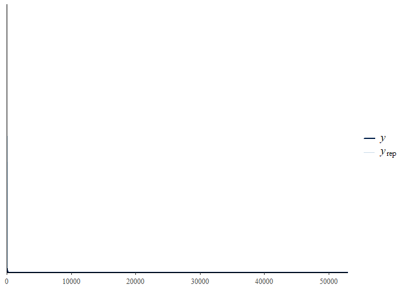<!-- -->

SGM-specific:

``` r
summary(like_sgm_2, ndraws = 100)
```

```
##  Family: hurdle_negbinomial 
##   Links: mu = log; shape = identity; hu = logit 
## Formula: CTS_sgm_perp_HR ~ 0 + Intercept + (1 | CoupleID) 
##          hu ~ 0 + Intercept + (1 | CoupleID)
##    Data: data (Number of observations: 164) 
##   Draws: 4 chains, each with iter = 2000; warmup = 1000; thin = 1;
##          total post-warmup draws = 4000
## 
## Multilevel Hyperparameters:
## ~CoupleID (Number of levels: 82) 
##                  Estimate Est.Error l-95% CI u-95% CI Rhat Bulk_ESS Tail_ESS
## sd(Intercept)        1.08      0.52     0.14     2.27 1.00      974      979
## sd(hu_Intercept)     2.28      0.68     1.07     3.75 1.00     1458     2072
## 
## Regression Coefficients:
##              Estimate Est.Error l-95% CI u-95% CI Rhat Bulk_ESS Tail_ESS
## Intercept        0.67      0.47    -0.40     1.46 1.00     3162     2276
## hu_Intercept     2.95      0.55     2.00     4.16 1.00     2466     2805
## 
## Further Distributional Parameters:
##       Estimate Est.Error l-95% CI u-95% CI Rhat Bulk_ESS Tail_ESS
## shape     1.47      1.28     0.09     4.61 1.00     1204     1775
## 
## Draws were sampled using sample(hmc). For each parameter, Bulk_ESS
## and Tail_ESS are effective sample size measures, and Rhat is the potential
## scale reduction factor on split chains (at convergence, Rhat = 1).
```

& PPC:

``` r
pp_check(like_sgm_2, ndraws = 100)
```

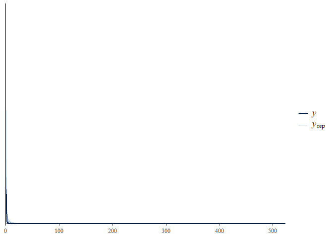<!-- -->

Ok so we see here that the default prior is pretty ok for psych IPV, although that model did not sample super well. The default priors for physical and SGM-specific IPV, however, are pretty wild. Because of the introduction of the variability around the Intercept and hu_Intercept, the model estimates a WIDE range of values based on each couple. Because we're working on log scales here, that can escalate pretty quickly. For example, the physical IPV perp model has some plausible predicted mean rates of IPV in the 5000s. We'll need to think of a more restrictive prior (i.e. a regularizing one) for the standard deviation terms so these models don't get too out of hand with the limited data. 

One rather weakly regularizing prior for standard deviation parameters is the Exponential(1) prior. Let's see what that looks like: 

``` r
set.seed(1234)
psim <- psim |> 
  mutate(exp = rexp(1e4, 1)) 
ggplot(psim, aes(x = exp)) + geom_histogram()
```

```
## `stat_bin()` using `bins = 30`. Pick better value with `binwidth`.
```

<!-- -->
Here, we see that the expected values of the standard deviation around the intercept terms are in the lower end, with the majority of the probable values between 0 and 2. This is still a *very* permissive prior here b/c this is on the log scale. Let's see if we regularize that more substantially with the exponential(4).


``` r
set.seed(1234)
psim <- psim |> 
  mutate(exp = rexp(1e4, 4)) 
ggplot(psim, aes(x = exp)) + geom_histogram()
```

```
## `stat_bin()` using `bins = 30`. Pick better value with `binwidth`.
```

<!-- -->
This places the majority of values below 1, but still allows for greater values here. Let's see what happens if we re-run these models with the more aggressive exponential(4) prior for the standard deviation terms. 


``` r
like_psych_3 <- brm(bf(CTS_psych_perp_HR ~ 0 + Intercept + (1 | CoupleID),
                     hu ~ 0 + Intercept+ (1 | CoupleID)),
                  prior = c(prior(normal(1, 0.5), class = b, coef = Intercept), # prior on mean (log scale)
                            prior(normal(-1.5, 1), class = b, coef = Intercept, dpar = hu), # prior on odds of being 0 (logit scale)
                            prior(exponential(4), class = sd), # prior on couple variability
                            prior(exponential(1), class = shape) # prior on dispersion
                  ),
                  data = data,
                  family = hurdle_negbinomial(),
                  chains = 4, iter = 2000, warmup = 1000, cores = 4,
                  seed = 1234,
                  file = "fits/like_psych_3",
                  file_refit = "on_change"
                  )
```

```
## Warning: Rows containing NAs were excluded from the model.
```

``` r
like_psych_min_3 <- brm(bf(CTS_psych_perp_HR_minor ~ 0 + Intercept + (1 | CoupleID),
                     hu ~ 0 + Intercept+ (1 | CoupleID)),
                  prior = c(prior(normal(1, 0.5), class = b, coef = Intercept), # prior on mean (log scale)
                            prior(normal(-1.5, 1), class = b, coef = Intercept, dpar = hu), # prior on odds of being 0 (logit scale)
                            prior(exponential(4), class = sd), # prior on couple variability
                            prior(exponential(1), class = shape) # prior on dispersion
                  ),
                  data = data,
                  family = hurdle_negbinomial(),
                  chains = 4, iter = 2000, warmup = 1000, cores = 4,
                  seed = 1234,
                  file = "fits/like_psych_min_3",
                  file_refit = "on_change"
                  )

like_psych_sev_3 <- brm(bf(CTS_psych_perp_HR_severe ~ 0 + Intercept + (1 | CoupleID),
                     hu ~ 0 + Intercept+ (1 | CoupleID)),
                  prior = c(prior(normal(1, 0.5), class = b, coef = Intercept), # prior on mean (log scale)
                            prior(normal(0, 0.5), class = b, coef = Intercept, dpar = hu), # prior on odds of being 0 (logit scale)
                            prior(exponential(4), class = sd), # prior on couple variability
                            prior(exponential(1), class = shape) # prior on dispersion
                  ),
                  data = data,
                  family = hurdle_negbinomial(),
                  chains = 4, iter = 2000, warmup = 1000, cores = 4,
                  seed = 1234,
                  file = "fits/like_psych_sev_3",
                  file_refit = "on_change"
                  )
```

```
## Warning: Rows containing NAs were excluded from the model.
```

``` r
like_phys_3 <- brm(bf(CTS_phys_perp_HR ~ 0 + Intercept+ (1 | CoupleID),
                     hu ~ 0 + Intercept+ (1 | CoupleID)),
                  prior = c(prior(normal(0, 0.8), class = b, coef = Intercept), # prior on mean (log scale)
                            prior(normal(1.5, 1), class = b, coef = Intercept, dpar = hu), # prior on odds of being 0 (logit scale)
                            prior(exponential(4), class = sd), # prior on couple variability
                            prior(exponential(1), class = shape) # prior on dispersion
                  ),
                 data = data,
                  family = hurdle_negbinomial(),
                  chains = 4, iter = 2000, warmup = 1000, cores = 4,
                  seed = 1234,
                  file = "fits/like_phys_3",
                  file_refit = "on_change"
                  )
```

```
## Warning: Rows containing NAs were excluded from the model.
```

``` r
like_sgm_3 <- brm(bf(CTS_sgm_perp_HR ~ 0 + Intercept + (1 | CoupleID),
                   hu ~ 0 + Intercept + (1 | CoupleID)),
                  prior = c(prior(normal(0, 0.8), class = b, coef = Intercept), # prior on mean (log scale)
                            prior(normal(1.5, 1), class = b, coef = Intercept, dpar = hu), # prior on odds of being 0 (logit scale)
                            prior(exponential(4), class = sd), # prior on couple variability
                            prior(exponential(1), class = shape) # prior on dispersion
                  ),
                data = data,
                  family = hurdle_negbinomial(),
                  chains = 4, iter = 2000, warmup = 1000, cores = 4,
                  seed = 1234,
                  file = "fits/like_sgm_3",
                  file_refit = "on_change"
                  )
```

```
## Warning: Rows containing NAs were excluded from the model.
```

Now let's summarize & look at the posterior predictive checks for each model. Starting with psychological:


``` r
summary(like_psych_3)
```

```
##  Family: hurdle_negbinomial 
##   Links: mu = log; shape = identity; hu = logit 
## Formula: CTS_psych_perp_HR ~ 0 + Intercept + (1 | CoupleID) 
##          hu ~ 0 + Intercept + (1 | CoupleID)
##    Data: data (Number of observations: 164) 
##   Draws: 4 chains, each with iter = 2000; warmup = 1000; thin = 1;
##          total post-warmup draws = 4000
## 
## Multilevel Hyperparameters:
## ~CoupleID (Number of levels: 82) 
##                  Estimate Est.Error l-95% CI u-95% CI Rhat Bulk_ESS Tail_ESS
## sd(Intercept)        1.33      0.13     1.11     1.61 1.00      770     1718
## sd(hu_Intercept)     2.01      0.65     0.78     3.35 1.00      662      539
## 
## Regression Coefficients:
##              Estimate Est.Error l-95% CI u-95% CI Rhat Bulk_ESS Tail_ESS
## Intercept        2.27      0.15     1.97     2.56 1.01      652      813
## hu_Intercept    -3.39      0.58    -4.61    -2.35 1.00     1263     1015
## 
## Further Distributional Parameters:
##       Estimate Est.Error l-95% CI u-95% CI Rhat Bulk_ESS Tail_ESS
## shape     6.84      1.59     4.15    10.40 1.00     1977     2828
## 
## Draws were sampled using sample(hmc). For each parameter, Bulk_ESS
## and Tail_ESS are effective sample size measures, and Rhat is the potential
## scale reduction factor on split chains (at convergence, Rhat = 1).
```

& PPC:

``` r
pp_check(like_psych_3, ndraws = 100)
```

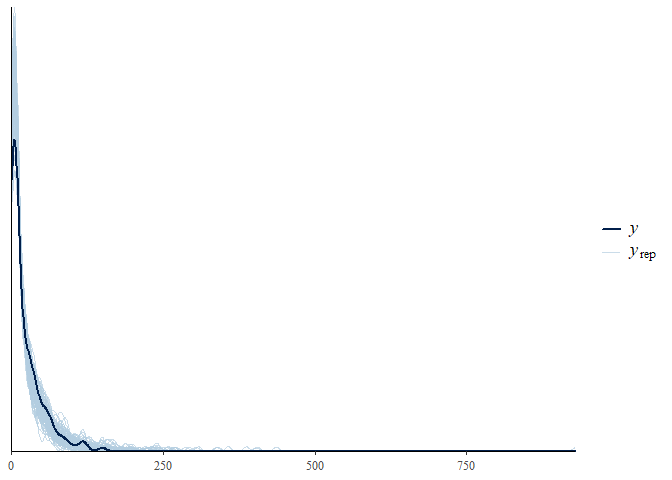<!-- -->

Psychological minor:


``` r
summary(like_psych_min_3)
```

```
##  Family: hurdle_negbinomial 
##   Links: mu = log; shape = identity; hu = logit 
## Formula: CTS_psych_perp_HR_minor ~ 0 + Intercept + (1 | CoupleID) 
##          hu ~ 0 + Intercept + (1 | CoupleID)
##    Data: data (Number of observations: 168) 
##   Draws: 4 chains, each with iter = 2000; warmup = 1000; thin = 1;
##          total post-warmup draws = 4000
## 
## Multilevel Hyperparameters:
## ~CoupleID (Number of levels: 84) 
##                  Estimate Est.Error l-95% CI u-95% CI Rhat Bulk_ESS Tail_ESS
## sd(Intercept)        1.28      0.12     1.05     1.54 1.01      713     1325
## sd(hu_Intercept)     1.85      0.65     0.56     3.16 1.00      608      349
## 
## Regression Coefficients:
##              Estimate Est.Error l-95% CI u-95% CI Rhat Bulk_ESS Tail_ESS
## Intercept        2.16      0.15     1.85     2.45 1.01      471      914
## hu_Intercept    -3.07      0.54    -4.20    -2.09 1.00      918      963
## 
## Further Distributional Parameters:
##       Estimate Est.Error l-95% CI u-95% CI Rhat Bulk_ESS Tail_ESS
## shape     7.64      1.82     4.62    11.70 1.00     2111     2287
## 
## Draws were sampled using sample(hmc). For each parameter, Bulk_ESS
## and Tail_ESS are effective sample size measures, and Rhat is the potential
## scale reduction factor on split chains (at convergence, Rhat = 1).
```

& PPC:

``` r
pp_check(like_psych_min_3, ndraws = 100)
```

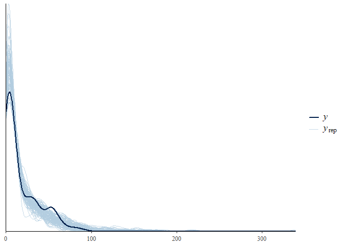<!-- -->

Psychological severe:


``` r
summary(like_psych_sev_3)
```

```
##  Family: hurdle_negbinomial 
##   Links: mu = log; shape = identity; hu = logit 
## Formula: CTS_psych_perp_HR_severe ~ 0 + Intercept + (1 | CoupleID) 
##          hu ~ 0 + Intercept + (1 | CoupleID)
##    Data: data (Number of observations: 164) 
##   Draws: 4 chains, each with iter = 2000; warmup = 1000; thin = 1;
##          total post-warmup draws = 4000
## 
## Multilevel Hyperparameters:
## ~CoupleID (Number of levels: 82) 
##                  Estimate Est.Error l-95% CI u-95% CI Rhat Bulk_ESS Tail_ESS
## sd(Intercept)        1.12      0.20     0.76     1.54 1.00      852     1198
## sd(hu_Intercept)     4.24      1.18     2.43     6.93 1.00     1336     1956
## 
## Regression Coefficients:
##              Estimate Est.Error l-95% CI u-95% CI Rhat Bulk_ESS Tail_ESS
## Intercept        1.36      0.21     0.93     1.76 1.01     1378     1881
## hu_Intercept     0.23      0.37    -0.51     0.94 1.00     2251     2880
## 
## Further Distributional Parameters:
##       Estimate Est.Error l-95% CI u-95% CI Rhat Bulk_ESS Tail_ESS
## shape     2.51      1.01     0.88     4.88 1.00     1205     1035
## 
## Draws were sampled using sample(hmc). For each parameter, Bulk_ESS
## and Tail_ESS are effective sample size measures, and Rhat is the potential
## scale reduction factor on split chains (at convergence, Rhat = 1).
```

& PPC:

``` r
pp_check(like_psych_sev_3, ndraws = 100)
```

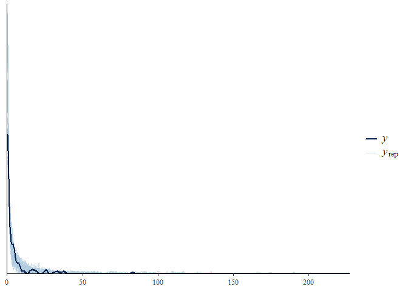<!-- -->

Physical:

``` r
summary(like_phys_3)
```

```
##  Family: hurdle_negbinomial 
##   Links: mu = log; shape = identity; hu = logit 
## Formula: CTS_phys_perp_HR ~ 0 + Intercept + (1 | CoupleID) 
##          hu ~ 0 + Intercept + (1 | CoupleID)
##    Data: data (Number of observations: 164) 
##   Draws: 4 chains, each with iter = 2000; warmup = 1000; thin = 1;
##          total post-warmup draws = 4000
## 
## Multilevel Hyperparameters:
## ~CoupleID (Number of levels: 82) 
##                  Estimate Est.Error l-95% CI u-95% CI Rhat Bulk_ESS Tail_ESS
## sd(Intercept)        1.66      0.39     0.97     2.48 1.00     1625     1703
## sd(hu_Intercept)     3.57      0.89     2.13     5.61 1.00     2060     2802
## 
## Regression Coefficients:
##              Estimate Est.Error l-95% CI u-95% CI Rhat Bulk_ESS Tail_ESS
## Intercept        0.37      0.50    -0.65     1.30 1.00     3081     2920
## hu_Intercept     3.45      0.61     2.34     4.71 1.00     2885     2878
## 
## Further Distributional Parameters:
##       Estimate Est.Error l-95% CI u-95% CI Rhat Bulk_ESS Tail_ESS
## shape     1.59      1.16     0.09     4.38 1.00     1102     1166
## 
## Draws were sampled using sample(hmc). For each parameter, Bulk_ESS
## and Tail_ESS are effective sample size measures, and Rhat is the potential
## scale reduction factor on split chains (at convergence, Rhat = 1).
```

& PPC:

``` r
pp_check(like_phys_3, ndraws = 100)
```

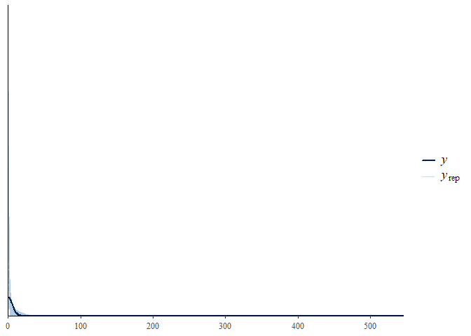<!-- -->

SGM-specific:

``` r
summary(like_sgm_3, ndraws = 100)
```

```
## Warning: There were 2 divergent transitions after warmup. Increasing
## adapt_delta above 0.8 may help. See
## http://mc-stan.org/misc/warnings.html#divergent-transitions-after-warmup
```

```
##  Family: hurdle_negbinomial 
##   Links: mu = log; shape = identity; hu = logit 
## Formula: CTS_sgm_perp_HR ~ 0 + Intercept + (1 | CoupleID) 
##          hu ~ 0 + Intercept + (1 | CoupleID)
##    Data: data (Number of observations: 164) 
##   Draws: 4 chains, each with iter = 2000; warmup = 1000; thin = 1;
##          total post-warmup draws = 4000
## 
## Multilevel Hyperparameters:
## ~CoupleID (Number of levels: 82) 
##                  Estimate Est.Error l-95% CI u-95% CI Rhat Bulk_ESS Tail_ESS
## sd(Intercept)        0.39      0.32     0.01     1.14 1.00      875     2205
## sd(hu_Intercept)     2.29      0.66     1.08     3.70 1.00     1013     1897
## 
## Regression Coefficients:
##              Estimate Est.Error l-95% CI u-95% CI Rhat Bulk_ESS Tail_ESS
## Intercept        0.65      0.55    -0.68     1.50 1.00     2517     1904
## hu_Intercept     2.96      0.54     2.00     4.12 1.00     1711     2384
## 
## Further Distributional Parameters:
##       Estimate Est.Error l-95% CI u-95% CI Rhat Bulk_ESS Tail_ESS
## shape     0.72      0.83     0.05     3.00 1.00     1110     1983
## 
## Draws were sampled using sample(hmc). For each parameter, Bulk_ESS
## and Tail_ESS are effective sample size measures, and Rhat is the potential
## scale reduction factor on split chains (at convergence, Rhat = 1).
```

& PPC:

``` r
pp_check(like_sgm_3, ndraws = 100)
```

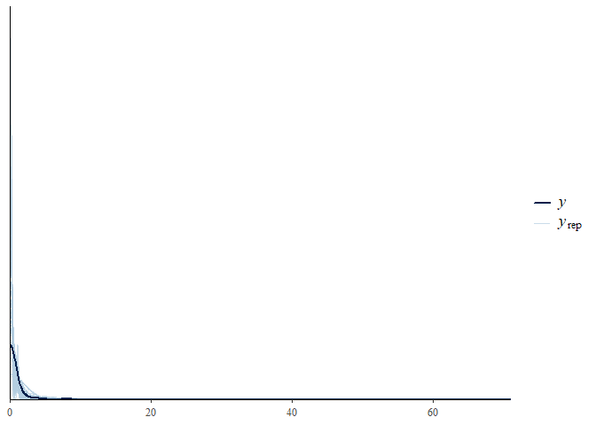<!-- -->

We still see that it's not the most effective sampling for psychological IPV. We still have some pretty wild posterior predicted values for physical IPV (it just moved from the 5000s to the 2000s in terms of the range of the x-axis). SGM-specific IPV is also a lot better, but still a little bit beyond the range of the data. This could be due to the one more aggressive couple in the sample, however, the implausible values don't seem restricted to just physical IPV--we still get the same issue with SGM-specific IPV as well. This suggests that it's because of the limited variability in the data, so the model is rather uncertain as to the estimation of the couple-level variability in parameter estimates. This may be because so many couples have 0s there. 

Because of this, I don't think it makes sense to move forward with modeling physical and SGM-specific IPV frequency b/c it's going to have limited utility and is going to be asking too much of the data. 

So let's go ahead and re-run those models with binary (0/1) variables for the physical and SGM-specific IPV outcomes. Of note, let's go back to the normal exponential(1) prior on the intercept variability. It likely doesn't need to be as aggressive there. 


``` r
like_phys_3.1 <- brm(bf(CTS_phys_perp_binary ~ 0 + Intercept+ (1 | CoupleID)),
                  prior = c(prior(normal(1.5, 1), class = b, coef = Intercept), # prior on odds of being 0 (logit scale)
                            prior(exponential(1), class = sd) # prior on couple variability
                  ),
                 data = data,
                  family = bernoulli,
                  chains = 4, iter = 2000, warmup = 1000, cores = 4,
                  seed = 1234,
                  file = "fits/like_phys_3.1",
                  file_refit = "on_change"
                  )
```

```
## Warning: Rows containing NAs were excluded from the model.
```

``` r
like_sgm_3.1 <- brm(bf(CTS_sgm_perp_binary ~ 0 + Intercept + (1 | CoupleID)),
                  prior = c(prior(normal(1.5, 1), class = b, coef = Intercept), # prior on odds of being 0 (logit scale)
                            prior(exponential(1), class = sd) # prior on couple variability
                  ),
                data = data,
                  family = bernoulli,
                  chains = 4, iter = 2000, warmup = 1000, cores = 4,
                  seed = 1234,
                  file = "fits/like_sgm_3.1",
                  file_refit = "on_change"
                  )
```

```
## Warning: Rows containing NAs were excluded from the model.
```

Let's look at the output of these.

Physical:

``` r
summary(like_phys_3.1)
```

```
##  Family: bernoulli 
##   Links: mu = logit 
## Formula: CTS_phys_perp_binary ~ 0 + Intercept + (1 | CoupleID) 
##    Data: data (Number of observations: 164) 
##   Draws: 4 chains, each with iter = 2000; warmup = 1000; thin = 1;
##          total post-warmup draws = 4000
## 
## Multilevel Hyperparameters:
## ~CoupleID (Number of levels: 82) 
##               Estimate Est.Error l-95% CI u-95% CI Rhat Bulk_ESS Tail_ESS
## sd(Intercept)     2.60      0.71     1.42     4.24 1.00     1782     2294
## 
## Regression Coefficients:
##           Estimate Est.Error l-95% CI u-95% CI Rhat Bulk_ESS Tail_ESS
## Intercept    -2.50      0.45    -3.46    -1.69 1.00     4236     3010
## 
## Draws were sampled using sample(hmc). For each parameter, Bulk_ESS
## and Tail_ESS are effective sample size measures, and Rhat is the potential
## scale reduction factor on split chains (at convergence, Rhat = 1).
```

& PPC:

``` r
pp_check(like_phys_3.1, ndraws = 100)
```

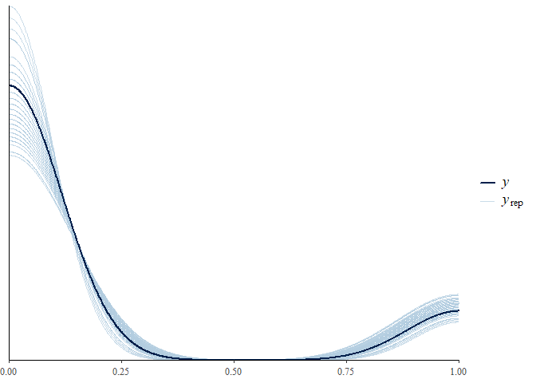<!-- -->

SGM-specific:

``` r
summary(like_sgm_3.1)
```

```
##  Family: bernoulli 
##   Links: mu = logit 
## Formula: CTS_sgm_perp_binary ~ 0 + Intercept + (1 | CoupleID) 
##    Data: data (Number of observations: 164) 
##   Draws: 4 chains, each with iter = 2000; warmup = 1000; thin = 1;
##          total post-warmup draws = 4000
## 
## Multilevel Hyperparameters:
## ~CoupleID (Number of levels: 82) 
##               Estimate Est.Error l-95% CI u-95% CI Rhat Bulk_ESS Tail_ESS
## sd(Intercept)     1.42      0.61     0.22     2.66 1.01      728      876
## 
## Regression Coefficients:
##           Estimate Est.Error l-95% CI u-95% CI Rhat Bulk_ESS Tail_ESS
## Intercept    -2.19      0.41    -3.10    -1.51 1.00     1307     1562
## 
## Draws were sampled using sample(hmc). For each parameter, Bulk_ESS
## and Tail_ESS are effective sample size measures, and Rhat is the potential
## scale reduction factor on split chains (at convergence, Rhat = 1).
```

& PPC:

``` r
pp_check(like_sgm_3.1, ndraws = 100)
```

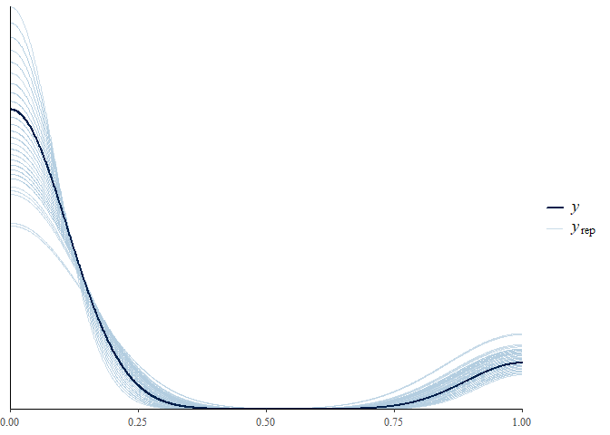<!-- -->

Those are MUCH better posterior predictives, so let's go ahead and work with those models. 

Given this decision to use logistic regression for physical and SGM-specific IPV perpetration due to the limited number of couples who perpetrated IPV, I also made the decision to simplify the models for psychological aggression to negative binomial models. This decision is based on making the models more parsimonious and the fact that the *vast* majority of people in this sample perpetrated some psychological aggression, so the hu/zero part of the model is going to be based on only 14 people. This is even less than the amount of people who perpetrated physical or SGM-specific IPV, so it seems appropriate to follow the same logic that the parameter estimates for these portions of the model are going to be based on very limited information. It will also make interpretation easier in line with the physical and SGM-specific forms of perpetration b/c we will not have to switch between occurrence/non-occurrence language here. This is less so the case for severe psychological aggression, though remains true for minor psychological aggression. For consistency and parismony, I decided to still simplify these models to negative binomial models.  

### Internalized stigma slope priors

Now that we have our basic, intercept-only model here, let's figure out some priors for the actor-partner interdependence model. 

Small note b/c I'm not sure where else to put this: typically within a MLM for APIMs, you want to set up a compound symmetry correlation structure for the residual variance to allow for possible negative correlations between dyad scores. This is not possible within a GLM framework b/c there is no residual variance term given the different likelihood of the data that is used for these models. Thus, you have to make the assumption that ICCs are positive for the couple. In this study, this is a very fine assumption to make since IPV between partners is typically rather strongly, positively correlated. This may not be the case for other types of constructs though, so that's just a caveat of these models here. 

Ok now back to the priors here. This gets really complicated/tricky because we are working on the log or log odds/logit scale, depending upon the portion of the model that we are estimating here. Here are some additional resources for making sense of this when you inevitably forget what you figured out when coming up with these priors: 

- NEGATIVE logit regression coefficient means less likely to happen. 0 logit is 50/50 prob, above 0 is MORE likely to happen  

- Conversion between odds, odds ratios, and probabilities can be done here: https://easystats.github.io/effectsize/articles/convert_p_OR_RR.html. 

For example, if we have a logit of .04 (i.e., unstandardized regression cofficient), we can convert it to an odds ratio via this:

``` r
# logit to odds ratio
inv_logit_scaled(.04)/(1 - inv_logit_scaled(.04))
```

```
## [1] 1.040811
```

Similarly if we need to convert an odds ratio to logit, let's say we want to convert .95, then we can use this: 

``` r
# odds ratio to logit
log(.95)
```

```
## [1] -0.05129329
```

If you need some type of annotated output for logistic regression (of MPlus) for looking at how this may have appeared in the Li et al. 2022 paper, you can find that here: https://stats.oarc.ucla.edu/mplus/output/logit-regression/. 

SO, with all of that being put there for future you, let's go ahead and summarize some of the results from the prior literature. 

*Li et al. 2022:*
* Physical IPV occurrence: actor unstandardized coefficient of -.05 (OR = .95); partner unstandardized coefficient of -.07 (OR = .94) 
* Psychological IPV occurrence: actor unstandardized coefficient of 1.07 (OR = 2.90); partner unstandardized coefficient of .82 (OR = 2.27)
* Psychological IPV frequency: actor unstandardized coefficient of .92, partner unstandardized coefficient of .71

*Do et al. 2021:*
Note they say they have standardized regression coefficients but if you do the logit to odds ratio conversion it equals the ORs they report in their tables.

* Physical IPV occurrence: actor coefficient of .19, se = .18 (OR = 1.22, [0.85, 1.72]); partner coefficient of .00, se = .19 (OR = 1.00, [0.69, 1.44])
* Psych IPV occurrence (not severe vs. severe): actor coefficient of -.03, se = .14 (OR = 0.97, [0.74, 1.28]); partner coefficient of .08, se = .14 (OR = 1.08, 0.83, 1.41)

*Badenes-Ribera et al. 2019 meta-analysis:*
* Mean r = .15 for any type of IPV (also backed by Kimmes et al. 2019 meta that found r = .14 among sexual minority women and r = .23 among sexual minority men)

That's all fine and dandy, but can we convert the correlation coefficient to an odds ratio? Turns out we can with the `easystats` package: 

``` r
d <- r_to_d(0.15)
d_to_oddsratio(d)
```

```
## [1] 1.733889
```

And we can also have it appear on the log scale, which makes it an unstandardized regression coefficient: 

``` r
d_to_oddsratio(d, log = T)
```

```
## [1] 0.5503667
```

Now that we have all of that background information, let's go ahead and make some sensible priors out of them.

#### Psych & phys occurrence:

- Li et al. have coefficient of 1.07, whereas Do et al have coefficient of -.03; meta-analysis would suggest inclusion of 0.55 in the range as well (see above conversion for where I got that). We want a distribution that could reflect ALL of these potential values here. A normal(0.5, 0.75) would contain all of these plausible values. It places the most weight on the estimate from the meta-analysis, but still incorporates values consistent with Do and with Li. 

``` r
set.seed(1234)
psim <- psim |> 
  mutate(b_ihs_occur = rnorm(1e4, mean = 0.5, sd = 0.75))
ggplot(psim, aes(x = b_ihs_occur)) + geom_histogram(binwidth = 0.1)
```

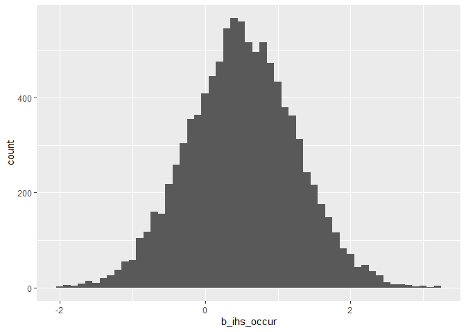<!-- -->
Probability that the coefficient is below 0:

``` r
psim |> summarize(sum = sum(ifelse(b_ihs_occur < 0, T, F))/1e4)
```

```
## # A tibble: 1 × 1
##     sum
##   <dbl>
## 1 0.248
```
Probabiliy that the coefficient is above 0.5 (mean from meta-analysis): 

``` r
psim |> summarize(sum = sum(ifelse(b_ihs_occur > 0.5, T, F))/1e4)
```

```
## # A tibble: 1 × 1
##     sum
##   <dbl>
## 1 0.502
```
#### Psych frequency

Based on Li et al 2022 results, let's do mean of 0.80 (which is mean of .92 actor and .71 partner). We'll still allow for significant variability around that so it's possible to have negative values as well. 

``` r
set.seed(1234)
psim <- psim |> 
  mutate(b_ihs_freq = rnorm(1e4, mean = 0.8, sd = 1))
ggplot(psim, aes(x = b_ihs_freq)) + geom_histogram(binwidth = 0.1)
```

<!-- -->
Proportion of distribution below 0: 

``` r
psim |> summarize(sum = sum(ifelse(b_ihs_freq < 0, T, F))/1e4)
```

```
## # A tibble: 1 × 1
##     sum
##   <dbl>
## 1 0.209
```
#### SGM-specific 

This is the first study to look at internalized stigma and SGM-specific IPV, so let's keep this prior much more vague. Here's what we should do for occurrence instead of the more "positive" prior above: 


``` r
set.seed(1234)
psim <- psim |> 
  mutate(b_ihs_occur = rnorm(1e4, mean = 0, sd = 0.5))
ggplot(psim, aes(x = b_ihs_occur)) + geom_histogram(binwidth = 0.1)
```

<!-- -->

Basically, it'll place the mass of probability around 0, and keep the range of possible coefficients reasonable but still letting the data inform the story here. 

#### Important caveat

One IMPORTANT thing to note about the priors above is that they are based on regression coefficients (IPV regressed on internalized stigma) that use a different scale than this study, and internalized stigma was not standardized in those studies. However, generally the zero-order correlations b/t internalized stigma and IPV perpetration ranged ~ .14 (with some variability in there depending on the study and whether it was psych or physical IPV). The priors above, which are based on the meta-analytic correlation of .14, thus contain these values. They are good enough for these purposes here. 

### Negative affect

Next up is reasoning through priors for negative affect scores. The examples will utilize just one of the negative affect variables (PANAS_disc_neg_actor) with the assumption that priors will be the same throughout all portions of the model (i.e., partner effect for discrimination, actor + partner effects for life stressor discussions). Remember that negative affect and internalized stigma are standardized in these analyses. 

#### Internalized stigma & NA 


``` r
like_na <- brm(PANAS_disc_neg_actor ~ 0 + Intercept + cosy(gr = CoupleID),
              data = data,
              family = gaussian(),
              chains = 4, iter = 2000, warmup = 1000, cores = 4,
              seed = 1234,
              file = "fits/like_na",
              file_refit = "on_change"
)
```

```
## Warning: Rows containing NAs were excluded from the model.
```

Summarize:

``` r
summary(like_na, prob = .89)
```

```
##  Family: gaussian 
##   Links: mu = identity; sigma = identity 
## Formula: PANAS_disc_neg_actor ~ 0 + Intercept + cosy(gr = CoupleID) 
##    Data: data (Number of observations: 162) 
##   Draws: 4 chains, each with iter = 2000; warmup = 1000; thin = 1;
##          total post-warmup draws = 4000
## 
## Correlation Structures:
##      Estimate Est.Error l-89% CI u-89% CI Rhat Bulk_ESS Tail_ESS
## cosy     0.23      0.10     0.07     0.40 1.01     1569      906
## 
## Regression Coefficients:
##           Estimate Est.Error l-89% CI u-89% CI Rhat Bulk_ESS Tail_ESS
## Intercept     0.00      0.09    -0.14     0.14 1.00     2696     2179
## 
## Further Distributional Parameters:
##       Estimate Est.Error l-89% CI u-89% CI Rhat Bulk_ESS Tail_ESS
## sigma     1.01      0.06     0.93     1.11 1.00     2855     2262
## 
## Draws were sampled using sample(hmc). For each parameter, Bulk_ESS
## and Tail_ESS are effective sample size measures, and Rhat is the potential
## scale reduction factor on split chains (at convergence, Rhat = 1).
```

& PPC:

``` r
pp_check(like_na, ndraws = 100)
```

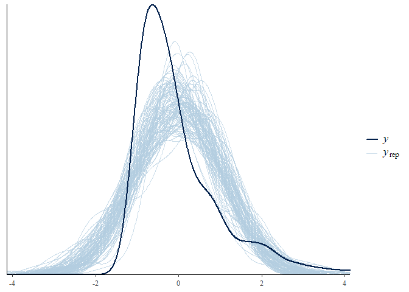<!-- -->

Default priors are probably fine here. Note that the observed data has significant skew, which is why the model-implied values are not as cleanly estimated here. That's ok for now, and this is also how these data are mostly going to be estimated. To keep with convention and to not make these models too wild, we're going to stick with a Gaussian likelihood for this study rather than introducing the skew_normal distribution into things. 

Next, let's add in the actor & partner effects of internalized stigma with default priors. This is a "proper" actor-partner interdependence model here b/c we are able to specify a compound symmetry correlation structure here. 


``` r
like_na_1 <- brm(PANAS_disc_neg_actor ~ 0 + Intercept + IHS_mean_actor + IHS_mean_partner + cosy(gr = CoupleID),
              data = data,
              family = gaussian(),
              chains = 4, iter = 2000, warmup = 1000, cores = 4,
              seed = 1234,
              file = "fits/like_na_1",
              file_refit = "on_change"
)
```

```
## Warning: Rows containing NAs were excluded from the model.
```

Summarize:

``` r
summary(like_na_1, prob = .89)
```

```
##  Family: gaussian 
##   Links: mu = identity; sigma = identity 
## Formula: PANAS_disc_neg_actor ~ 0 + Intercept + IHS_mean_actor + IHS_mean_partner + cosy(gr = CoupleID) 
##    Data: data (Number of observations: 162) 
##   Draws: 4 chains, each with iter = 2000; warmup = 1000; thin = 1;
##          total post-warmup draws = 4000
## 
## Correlation Structures:
##      Estimate Est.Error l-89% CI u-89% CI Rhat Bulk_ESS Tail_ESS
## cosy     0.22      0.10     0.06     0.38 1.00     2418     1309
## 
## Regression Coefficients:
##                  Estimate Est.Error l-89% CI u-89% CI Rhat Bulk_ESS Tail_ESS
## Intercept           -0.00      0.09    -0.14     0.13 1.00     4273     2533
## IHS_mean_actor       0.25      0.07     0.14     0.37 1.00     4518     2817
## IHS_mean_partner     0.03      0.08    -0.09     0.16 1.00     3933     2491
## 
## Further Distributional Parameters:
##       Estimate Est.Error l-89% CI u-89% CI Rhat Bulk_ESS Tail_ESS
## sigma     0.98      0.06     0.90     1.08 1.00     3717     2768
## 
## Draws were sampled using sample(hmc). For each parameter, Bulk_ESS
## and Tail_ESS are effective sample size measures, and Rhat is the potential
## scale reduction factor on split chains (at convergence, Rhat = 1).
```

& PPC: 

``` r
pp_check(like_na_1, ndraws = 100)
```

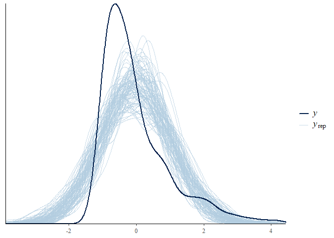<!-- -->

That's all pretty good! At least for this specific mediator, we see evidence of a reliably positive actor effect, but not so much for the partner effect. Right now, these models are with the default priors. They're honestly probably pretty ok here in terms of nothing being too wild or off, but let's reason through some sensible priors here because it's quite possible this will matter when we move to the monster of the mediation model. 

Let's get the summary of the default priors here: 

``` r
prior_summary(like_na_1)
```

```
##                 prior class             coef group resp dpar nlpar lb ub
##                (flat)     b                                             
##                (flat)     b   IHS_mean_actor                            
##                (flat)     b IHS_mean_partner                            
##                (flat)     b        Intercept                            
##                (flat)  cosy                                         0  1
##  student_t(3, 0, 2.5) sigma                                         0   
##        source
##       default
##  (vectorized)
##  (vectorized)
##  (vectorized)
##       default
##       default
```

The compound symmetry prior SHOULD be a correlation that allows negative values, but apparently the cosy() terms are bounded to be positive in `brms` by default. There are more details about this issue here: https://github.com/paul-buerkner/brms/issues/878. For the purposes of this study given the size of the model and the relatively sparse data, it's best to just keep with these defaults. Testing out the implications of this and the programming in Stan is a little beyond my skillset at this point in time, and likely won't change inference for this study given that we do expect positive correlations for NA here between partners (not negative).

First we have the overall Intercept. This should be close to 0 because we are working with standardized data here. It's possible it could fluctuate a bit, but it shouldn't be too wild. A normal(0, 0.25) prior will keep it pretty reasonable. 


``` r
psim <- psim |> 
  mutate(b_na = rnorm(1e4, mean = 0, sd = 0.25))
ggplot(psim, aes(x = b_na)) + geom_histogram(binwidth = 0.1)
```

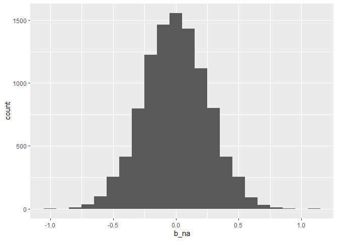<!-- -->

Finally, we have the actor and partner effects of internalized stigma on negative affect. There's no direct study out there that has tested this, to my knowledge, so we're going to rely on some broader correlations from prior research. Seager van Dyk et al. (2021) found a .3 correlation between internalized stigma and negative affect in their minority stress induction study, so let's consider a prior that generally points in a more positive direction but still very well includes 0. Of course, a regression model with more than one parameter in it isn't technically a correlation coefficient. However, we're very much in the ballpark here. This prior is also weakly informative enough that the data will probably dominate the posterior. 


``` r
psim <- psim |> 
  mutate(b_na_ihs = rnorm(1e4, mean = 0.15, sd = 0.3))
ggplot(psim, aes(x = b_na_ihs)) + geom_histogram(binwidth = 0.1)
```

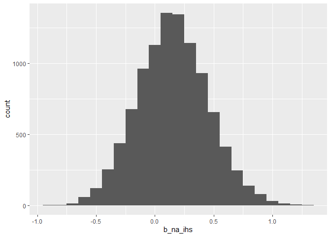<!-- -->

Proportion below zero:

``` r
psim |> summarize(sum = sum(ifelse(b_na_ihs < 0, T, F))/1e4)
```

```
## # A tibble: 1 × 1
##     sum
##   <dbl>
## 1 0.309
```
That seems pretty reasonable! Lots of chances to be near zero or at zero, but still has a more positive slant to it that is reflective of at least one prior study on this topic to inform the direction of effects here. 

Because we don't really know what partner effects of internalized stigma on negative affect would be here, let's keep that prior a little more agnostic:

``` r
psim <- psim |> 
  mutate(b_na_ihs_partner = rnorm(1e4, mean = 0, sd = 0.3))
ggplot(psim, aes(x = b_na_ihs_partner)) + geom_histogram(binwidth = 0.1)
```

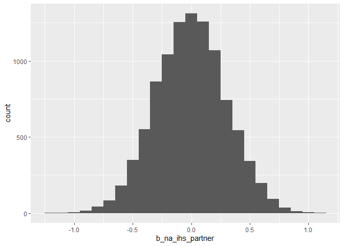<!-- -->

Proportion below zero: 

``` r
psim |> summarize(sum = sum(ifelse(b_na_ihs_partner < 0, T, F))/1e4)
```

```
## # A tibble: 1 × 1
##     sum
##   <dbl>
## 1 0.505
```
Great! 

Now with all of these priors in hand, let's re-run that model. We'll use the normal Exponential(1) prior for sigma in line with McElreath (2020) as a weakly informative prior for variance estimates.


``` r
like_na_2 <- brm(PANAS_disc_neg_actor ~ 0 + Intercept + IHS_mean_actor + IHS_mean_partner + cosy(gr = CoupleID),
              prior = c(prior(normal(0, 0.25), class = b, coef = Intercept),
                        prior(normal(0.15, 0.3), class = b, coef = IHS_mean_actor),
                        prior(normal(0, 0.3), class = b, coef = IHS_mean_partner),
                        prior(exponential(1), class = sigma)),
                 data = data,
              family = gaussian(),
              chains = 4, iter = 2000, warmup = 1000, cores = 4,
              seed = 1234,
              file = "fits/like_na_2",
              file_refit = "on_change"
)
```

```
## Warning: Rows containing NAs were excluded from the model.
```

Summarize:

``` r
summary(like_na_2, prob = .89)
```

```
##  Family: gaussian 
##   Links: mu = identity; sigma = identity 
## Formula: PANAS_disc_neg_actor ~ 0 + Intercept + IHS_mean_actor + IHS_mean_partner + cosy(gr = CoupleID) 
##    Data: data (Number of observations: 162) 
##   Draws: 4 chains, each with iter = 2000; warmup = 1000; thin = 1;
##          total post-warmup draws = 4000
## 
## Correlation Structures:
##      Estimate Est.Error l-89% CI u-89% CI Rhat Bulk_ESS Tail_ESS
## cosy     0.22      0.10     0.06     0.38 1.00     2971     1573
## 
## Regression Coefficients:
##                  Estimate Est.Error l-89% CI u-89% CI Rhat Bulk_ESS Tail_ESS
## Intercept           -0.01      0.08    -0.13     0.12 1.00     5235     2921
## IHS_mean_actor       0.25      0.07     0.13     0.36 1.00     4639     2962
## IHS_mean_partner     0.03      0.07    -0.08     0.15 1.00     4542     2212
## 
## Further Distributional Parameters:
##       Estimate Est.Error l-89% CI u-89% CI Rhat Bulk_ESS Tail_ESS
## sigma     0.98      0.06     0.89     1.08 1.00     4546     2938
## 
## Draws were sampled using sample(hmc). For each parameter, Bulk_ESS
## and Tail_ESS are effective sample size measures, and Rhat is the potential
## scale reduction factor on split chains (at convergence, Rhat = 1).
```

We see here that the priors had very little influence on these parameter estimates, they're basically the same as before. However, this can probably help a lot in the bigger models! 

#### NA & IPV perpetration

Ok next up in building this out are the actor & partner effects of negative affect on IPV perpetration, which is entered in combination with the actor & partner effects of internalized stigma on IPV perpetration. We'll have to reason this out separately for psych + physical/SGM perpetration because these are on different scales (log vs. logit). 

##### Physical/SGM 

Now that we have all of that background information, let's go ahead and make some sensible priors out of them.

This prior here is similar to the one we used for actor & partner effects for internalized stigma on IPV occurrence. This is based on a mean correlation of .25 from the Birkley & Eckhardt (2015) meta-analysis of emotion issues & IPV perpetration. This corresponds to a Cohen's d effect size of 0.51, which corresponds to an odds ratio of 2.55. On the logit scale, this would be a coefficient of about 0.94. We'd want this to be included in the regression coefficients.

Let's verify that with the conversions from `easystats`:


``` r
d <- r_to_d(0.25)
d
```

```
## [1] 0.5163978
```

``` r
d_to_oddsratio(d)
```

```
## [1] 2.551399
```

And we can also have it appear on the log scale, which makes it an unstandardized regression coefficient: 

``` r
d_to_oddsratio(d, log = T)
```

```
## [1] 0.936642
```

And then visualize that distribution:


``` r
set.seed(1234)
psim <- psim |> 
  mutate(b_na_occur = rnorm(1e4, mean = 1, sd = 1))
ggplot(psim, aes(x = b_na_occur)) + geom_histogram(binwidth = 0.1)
```

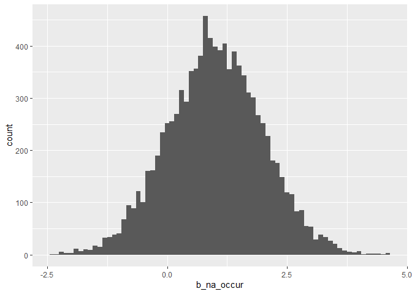<!-- -->
That seems good enough! It also allows for zero values to come up if they're present in the data: 


``` r
psim |> summarize(sum = sum(ifelse(b_na_occur < 0, T, F))/1e4)
```

```
## # A tibble: 1 × 1
##     sum
##   <dbl>
## 1 0.155
```
Of note, this is a little bit of a stronger prior than the one for internalized stigma (though not that dramatic) - I feel more comfortable with this given the body of work linking negative emotions to IPV perpetration is much bigger than the body of work linking internalized stigma to IPV perpetration. 

##### Psychological

Unfortunately, it's not super straight-forward how to convert a correlation of .25 to a negative binomial regression coefficient. Thus, let's go with a weakly informative prior approach that still skews in the positive direction. We utilized normal(0.5,0.75) for effects of internalized stigma on IPV perpetration based on coefficients from one prior study. The zero-order correlation between internalized stigma and IPV perp in that study (Li et al 2022) was .15. Here, let's use a wider range to capture potentially higher values. 


``` r
set.seed(1234)
psim <- psim |> 
  mutate(b_na_freq = rnorm(1e4, mean = 0.5, sd = 1))
ggplot(psim, aes(x = b_na_freq)) + geom_histogram(binwidth = 0.1)
```

<!-- -->

### Covariates

For priors involving covariates, I kept these to be relatively uninformative to let the data tell the story but still keep these parameter estimates within reasonable ranges. For covariates on negative affect scores (CSI, global dyadic coping, discussion order, stressor type, and stressor severity), priors were all normal(0,1) because the outcome was standardized. This is thus a pretty broad prior. For covariates on IPV perpetration (age, relationship length, sexual orientation, gender identity, and race/ethnicity), priors were all normal (0, 0.5).

# Aim 1

Now that we have our priors figured out, let's go ahead and run those first analyses for aim 1, which is an APIM of internalized stigma (standardized) predicting IPV. First, we'll run the models with no covariates. Then we'll run them with. Finally, we'll do a quick check to see if results are sensitive to our prior specification for both the no covariate and covariate adjusted models. 

## No covariates

First, let's run the models in a group batch here:


``` r
aim1_psych <- brm(bf(CTS_psych_perp_HR ~ 0 + Intercept + IHS_mean_actor + IHS_mean_partner + (1 | CoupleID)),
                  prior = c(# prior on mean (log scale)
                            prior(normal(1, 0.5), class = b, coef = Intercept), 
                            # priors for frequency
                            prior(normal(0.8, 1), class = b, coef = IHS_mean_actor),
                            prior(normal(0.8, 1), class = b, coef = IHS_mean_partner),
                            # prior on couple variability
                            prior(exponential(1), class = sd),
                            # prior on dispersion parameter
                            prior(exponential(1), class = shape) 
                  ),
                  data = data,
                  family = negbinomial(),
                  chains = 4, iter = 3500, warmup = 1000, cores = 4, 
                  seed = 1234,
                  control = list(adapt_delta = .99),
                  file = "fits/aim1_psych",
                  file_refit = "on_change"
                  )

aim1_psych_min <- brm(bf(CTS_psych_perp_HR_minor ~ 0 + Intercept + IHS_mean_actor + IHS_mean_partner + (1 | CoupleID)),
                  prior = c(# prior on mean (log scale)
                            prior(normal(1, 0.5), class = b, coef = Intercept), 
                            # priors for frequency
                            prior(normal(0.8, 1), class = b, coef = IHS_mean_actor),
                            prior(normal(0.8, 1), class = b, coef = IHS_mean_partner),
                            # prior on couple variability
                            prior(exponential(1), class = sd),
                            # prior on dispersion parameter
                            prior(exponential(1), class = shape) 
                  ),
                  data = data,
                  family = negbinomial(),
                  chains = 4, iter = 3500, warmup = 1000, cores = 4, 
                  seed = 1234,
                  control = list(adapt_delta = .99),
                  file = "fits/aim1_psych_min",
                  file_refit = "on_change"
                  )
```

```
## Start sampling
```

```
## Running MCMC with 4 parallel chains...
## 
## Chain 1 Iteration:    1 / 3500 [  0%]  (Warmup) 
## Chain 2 Iteration:    1 / 3500 [  0%]  (Warmup) 
## Chain 3 Iteration:    1 / 3500 [  0%]  (Warmup) 
## Chain 4 Iteration:    1 / 3500 [  0%]  (Warmup) 
## Chain 1 Iteration:  100 / 3500 [  2%]  (Warmup) 
## Chain 2 Iteration:  100 / 3500 [  2%]  (Warmup) 
## Chain 3 Iteration:  100 / 3500 [  2%]  (Warmup) 
## Chain 4 Iteration:  100 / 3500 [  2%]  (Warmup) 
## Chain 1 Iteration:  200 / 3500 [  5%]  (Warmup) 
## Chain 4 Iteration:  200 / 3500 [  5%]  (Warmup) 
## Chain 3 Iteration:  200 / 3500 [  5%]  (Warmup) 
## Chain 1 Iteration:  300 / 3500 [  8%]  (Warmup) 
## Chain 2 Iteration:  200 / 3500 [  5%]  (Warmup) 
## Chain 1 Iteration:  400 / 3500 [ 11%]  (Warmup) 
## Chain 4 Iteration:  300 / 3500 [  8%]  (Warmup) 
## Chain 3 Iteration:  300 / 3500 [  8%]  (Warmup) 
## Chain 1 Iteration:  500 / 3500 [ 14%]  (Warmup) 
## Chain 4 Iteration:  400 / 3500 [ 11%]  (Warmup) 
## Chain 3 Iteration:  400 / 3500 [ 11%]  (Warmup) 
## Chain 2 Iteration:  300 / 3500 [  8%]  (Warmup) 
## Chain 1 Iteration:  600 / 3500 [ 17%]  (Warmup) 
## Chain 4 Iteration:  500 / 3500 [ 14%]  (Warmup) 
## Chain 2 Iteration:  400 / 3500 [ 11%]  (Warmup) 
## Chain 1 Iteration:  700 / 3500 [ 20%]  (Warmup) 
## Chain 3 Iteration:  500 / 3500 [ 14%]  (Warmup) 
## Chain 4 Iteration:  600 / 3500 [ 17%]  (Warmup) 
## Chain 2 Iteration:  500 / 3500 [ 14%]  (Warmup) 
## Chain 3 Iteration:  600 / 3500 [ 17%]  (Warmup) 
## Chain 1 Iteration:  800 / 3500 [ 22%]  (Warmup) 
## Chain 4 Iteration:  700 / 3500 [ 20%]  (Warmup) 
## Chain 2 Iteration:  600 / 3500 [ 17%]  (Warmup) 
## Chain 3 Iteration:  700 / 3500 [ 20%]  (Warmup) 
## Chain 1 Iteration:  900 / 3500 [ 25%]  (Warmup) 
## Chain 2 Iteration:  700 / 3500 [ 20%]  (Warmup) 
## Chain 4 Iteration:  800 / 3500 [ 22%]  (Warmup) 
## Chain 3 Iteration:  800 / 3500 [ 22%]  (Warmup) 
## Chain 2 Iteration:  800 / 3500 [ 22%]  (Warmup) 
## Chain 4 Iteration:  900 / 3500 [ 25%]  (Warmup) 
## Chain 3 Iteration:  900 / 3500 [ 25%]  (Warmup) 
## Chain 1 Iteration: 1000 / 3500 [ 28%]  (Warmup) 
## Chain 1 Iteration: 1001 / 3500 [ 28%]  (Sampling) 
## Chain 2 Iteration:  900 / 3500 [ 25%]  (Warmup) 
## Chain 4 Iteration: 1000 / 3500 [ 28%]  (Warmup) 
## Chain 4 Iteration: 1001 / 3500 [ 28%]  (Sampling) 
## Chain 3 Iteration: 1000 / 3500 [ 28%]  (Warmup) 
## Chain 4 Iteration: 1100 / 3500 [ 31%]  (Sampling) 
## Chain 1 Iteration: 1100 / 3500 [ 31%]  (Sampling) 
## Chain 3 Iteration: 1001 / 3500 [ 28%]  (Sampling) 
## Chain 2 Iteration: 1000 / 3500 [ 28%]  (Warmup) 
## Chain 2 Iteration: 1001 / 3500 [ 28%]  (Sampling) 
## Chain 3 Iteration: 1100 / 3500 [ 31%]  (Sampling) 
## Chain 4 Iteration: 1200 / 3500 [ 34%]  (Sampling) 
## Chain 1 Iteration: 1200 / 3500 [ 34%]  (Sampling) 
## Chain 4 Iteration: 1300 / 3500 [ 37%]  (Sampling) 
## Chain 2 Iteration: 1100 / 3500 [ 31%]  (Sampling) 
## Chain 3 Iteration: 1200 / 3500 [ 34%]  (Sampling) 
## Chain 1 Iteration: 1300 / 3500 [ 37%]  (Sampling) 
## Chain 4 Iteration: 1400 / 3500 [ 40%]  (Sampling) 
## Chain 2 Iteration: 1200 / 3500 [ 34%]  (Sampling) 
## Chain 3 Iteration: 1300 / 3500 [ 37%]  (Sampling) 
## Chain 4 Iteration: 1500 / 3500 [ 42%]  (Sampling) 
## Chain 1 Iteration: 1400 / 3500 [ 40%]  (Sampling) 
## Chain 2 Iteration: 1300 / 3500 [ 37%]  (Sampling) 
## Chain 4 Iteration: 1600 / 3500 [ 45%]  (Sampling) 
## Chain 3 Iteration: 1400 / 3500 [ 40%]  (Sampling) 
## Chain 1 Iteration: 1500 / 3500 [ 42%]  (Sampling) 
## Chain 4 Iteration: 1700 / 3500 [ 48%]  (Sampling) 
## Chain 2 Iteration: 1400 / 3500 [ 40%]  (Sampling) 
## Chain 3 Iteration: 1500 / 3500 [ 42%]  (Sampling) 
## Chain 4 Iteration: 1800 / 3500 [ 51%]  (Sampling) 
## Chain 1 Iteration: 1600 / 3500 [ 45%]  (Sampling) 
## Chain 4 Iteration: 1900 / 3500 [ 54%]  (Sampling) 
## Chain 2 Iteration: 1500 / 3500 [ 42%]  (Sampling) 
## Chain 3 Iteration: 1600 / 3500 [ 45%]  (Sampling) 
## Chain 4 Iteration: 2000 / 3500 [ 57%]  (Sampling) 
## Chain 1 Iteration: 1700 / 3500 [ 48%]  (Sampling) 
## Chain 2 Iteration: 1600 / 3500 [ 45%]  (Sampling) 
## Chain 3 Iteration: 1700 / 3500 [ 48%]  (Sampling) 
## Chain 4 Iteration: 2100 / 3500 [ 60%]  (Sampling) 
## Chain 1 Iteration: 1800 / 3500 [ 51%]  (Sampling) 
## Chain 4 Iteration: 2200 / 3500 [ 62%]  (Sampling) 
## Chain 2 Iteration: 1700 / 3500 [ 48%]  (Sampling) 
## Chain 3 Iteration: 1800 / 3500 [ 51%]  (Sampling) 
## Chain 1 Iteration: 1900 / 3500 [ 54%]  (Sampling) 
## Chain 4 Iteration: 2300 / 3500 [ 65%]  (Sampling) 
## Chain 2 Iteration: 1800 / 3500 [ 51%]  (Sampling) 
## Chain 4 Iteration: 2400 / 3500 [ 68%]  (Sampling) 
## Chain 3 Iteration: 1900 / 3500 [ 54%]  (Sampling) 
## Chain 1 Iteration: 2000 / 3500 [ 57%]  (Sampling) 
## Chain 4 Iteration: 2500 / 3500 [ 71%]  (Sampling) 
## Chain 2 Iteration: 1900 / 3500 [ 54%]  (Sampling) 
## Chain 3 Iteration: 2000 / 3500 [ 57%]  (Sampling) 
## Chain 4 Iteration: 2600 / 3500 [ 74%]  (Sampling) 
## Chain 1 Iteration: 2100 / 3500 [ 60%]  (Sampling) 
## Chain 2 Iteration: 2000 / 3500 [ 57%]  (Sampling) 
## Chain 4 Iteration: 2700 / 3500 [ 77%]  (Sampling) 
## Chain 3 Iteration: 2100 / 3500 [ 60%]  (Sampling) 
## Chain 1 Iteration: 2200 / 3500 [ 62%]  (Sampling) 
## Chain 4 Iteration: 2800 / 3500 [ 80%]  (Sampling) 
## Chain 2 Iteration: 2100 / 3500 [ 60%]  (Sampling) 
## Chain 3 Iteration: 2200 / 3500 [ 62%]  (Sampling) 
## Chain 4 Iteration: 2900 / 3500 [ 82%]  (Sampling) 
## Chain 1 Iteration: 2300 / 3500 [ 65%]  (Sampling) 
## Chain 2 Iteration: 2200 / 3500 [ 62%]  (Sampling) 
## Chain 4 Iteration: 3000 / 3500 [ 85%]  (Sampling) 
## Chain 3 Iteration: 2300 / 3500 [ 65%]  (Sampling) 
## Chain 1 Iteration: 2400 / 3500 [ 68%]  (Sampling) 
## Chain 4 Iteration: 3100 / 3500 [ 88%]  (Sampling) 
## Chain 2 Iteration: 2300 / 3500 [ 65%]  (Sampling) 
## Chain 3 Iteration: 2400 / 3500 [ 68%]  (Sampling) 
## Chain 4 Iteration: 3200 / 3500 [ 91%]  (Sampling) 
## Chain 1 Iteration: 2500 / 3500 [ 71%]  (Sampling) 
## Chain 2 Iteration: 2400 / 3500 [ 68%]  (Sampling) 
## Chain 3 Iteration: 2500 / 3500 [ 71%]  (Sampling) 
## Chain 4 Iteration: 3300 / 3500 [ 94%]  (Sampling) 
## Chain 1 Iteration: 2600 / 3500 [ 74%]  (Sampling) 
## Chain 4 Iteration: 3400 / 3500 [ 97%]  (Sampling) 
## Chain 2 Iteration: 2500 / 3500 [ 71%]  (Sampling) 
## Chain 3 Iteration: 2600 / 3500 [ 74%]  (Sampling) 
## Chain 1 Iteration: 2700 / 3500 [ 77%]  (Sampling) 
## Chain 4 Iteration: 3500 / 3500 [100%]  (Sampling) 
## Chain 4 finished in 14.0 seconds.
## Chain 2 Iteration: 2600 / 3500 [ 74%]  (Sampling) 
## Chain 3 Iteration: 2700 / 3500 [ 77%]  (Sampling) 
## Chain 1 Iteration: 2800 / 3500 [ 80%]  (Sampling) 
## Chain 2 Iteration: 2700 / 3500 [ 77%]  (Sampling) 
## Chain 3 Iteration: 2800 / 3500 [ 80%]  (Sampling) 
## Chain 1 Iteration: 2900 / 3500 [ 82%]  (Sampling) 
## Chain 2 Iteration: 2800 / 3500 [ 80%]  (Sampling) 
## Chain 3 Iteration: 2900 / 3500 [ 82%]  (Sampling) 
## Chain 1 Iteration: 3000 / 3500 [ 85%]  (Sampling) 
## Chain 2 Iteration: 2900 / 3500 [ 82%]  (Sampling) 
## Chain 3 Iteration: 3000 / 3500 [ 85%]  (Sampling) 
## Chain 1 Iteration: 3100 / 3500 [ 88%]  (Sampling) 
## Chain 2 Iteration: 3000 / 3500 [ 85%]  (Sampling) 
## Chain 3 Iteration: 3100 / 3500 [ 88%]  (Sampling) 
## Chain 1 Iteration: 3200 / 3500 [ 91%]  (Sampling) 
## Chain 2 Iteration: 3100 / 3500 [ 88%]  (Sampling) 
## Chain 3 Iteration: 3200 / 3500 [ 91%]  (Sampling) 
## Chain 1 Iteration: 3300 / 3500 [ 94%]  (Sampling) 
## Chain 2 Iteration: 3200 / 3500 [ 91%]  (Sampling) 
## Chain 3 Iteration: 3300 / 3500 [ 94%]  (Sampling) 
## Chain 1 Iteration: 3400 / 3500 [ 97%]  (Sampling) 
## Chain 2 Iteration: 3300 / 3500 [ 94%]  (Sampling) 
## Chain 3 Iteration: 3400 / 3500 [ 97%]  (Sampling) 
## Chain 1 Iteration: 3500 / 3500 [100%]  (Sampling) 
## Chain 1 finished in 18.6 seconds.
## Chain 2 Iteration: 3400 / 3500 [ 97%]  (Sampling) 
## Chain 3 Iteration: 3500 / 3500 [100%]  (Sampling) 
## Chain 3 finished in 18.8 seconds.
## Chain 2 Iteration: 3500 / 3500 [100%]  (Sampling) 
## Chain 2 finished in 19.4 seconds.
## 
## All 4 chains finished successfully.
## Mean chain execution time: 17.7 seconds.
## Total execution time: 19.6 seconds.
```

``` r
aim1_psych_sev <- brm(bf(CTS_psych_perp_HR_severe ~ 0 + Intercept + IHS_mean_actor + IHS_mean_partner + (1 | CoupleID)),
                  prior = c(# prior on mean (log scale) - note same for overall & minor psych aggression 
                            prior(normal(1, 0.5), class = b, coef = Intercept), 
                            # priors for frequency
                            prior(normal(0.8, 1), class = b, coef = IHS_mean_actor),
                            prior(normal(0.8, 1), class = b, coef = IHS_mean_partner),
                            # prior on couple variability
                            prior(exponential(1), class = sd),
                            # prior on dispersion parameter
                            prior(exponential(1), class = shape) 
                  ),
                  data = data,
                  family = negbinomial(),
                  chains = 4, iter = 3500, warmup = 1000, cores = 4, 
                  seed = 1234,
                  control = list(adapt_delta = .99),
                  file = "fits/aim1_psych_sev",
                  file_refit = "on_change"
                  )

aim1_phys <- brm(bf(CTS_phys_perp_binary ~ 0 + Intercept + IHS_mean_actor + IHS_mean_partner + (1 | CoupleID)),
                  prior = c(# prior on odds of being 1 (logit scale)
                            prior(normal(1.5, 1), class = b, coef = Intercept), 
                            # prior on regression relationship
                            prior(normal(0.5, 0.75), class = b, coef = IHS_mean_actor),
                            prior(normal(0.5, 0.75), class = b, coef = IHS_mean_partner), 
                            # prior on couple variability
                            prior(exponential(1), class = sd) 
                  ),
                 data = data,
                  family = bernoulli,
                  chains = 4, iter = 2000, warmup = 1000, cores = 4,
                  seed = 1234,
                  file = "fits/aim1_phys",
                  file_refit = "on_change"
                  )

aim1_sgm <- brm(bf(CTS_sgm_perp_binary ~ 0 + Intercept + IHS_mean_actor + IHS_mean_partner + (1 | CoupleID)),
                  prior = c(# prior on odds of being a 1 (logit scale)
                            prior(normal(1.5, 1), class = b, coef = Intercept),
                            # prior on regression relationship
                            prior(normal(0, 0.5), class = b, coef = IHS_mean_actor),
                            prior(normal(0, 0.5), class = b, coef = IHS_mean_partner), 
                            # prior on couple variability
                            prior(exponential(1), class = sd) 
                  ),
                data = data,
                  family = bernoulli,
                  chains = 4, iter = 2000, warmup = 1000, cores = 4,
                  seed = 1234,
                  file = "fits/aim1_sgm",
                  file_refit = "on_change"
                  )
```

And the sections below are going to parse out those results in a little more detail. 

### Psychological

Summarize output: 

``` r
summary(aim1_psych, prob = .89)
```

```
##  Family: negbinomial 
##   Links: mu = log; shape = identity 
## Formula: CTS_psych_perp_HR ~ 0 + Intercept + IHS_mean_actor + IHS_mean_partner + (1 | CoupleID) 
##    Data: data (Number of observations: 164) 
##   Draws: 4 chains, each with iter = 3500; warmup = 1000; thin = 1;
##          total post-warmup draws = 10000
## 
## Multilevel Hyperparameters:
## ~CoupleID (Number of levels: 82) 
##               Estimate Est.Error l-89% CI u-89% CI Rhat Bulk_ESS Tail_ESS
## sd(Intercept)     1.48      0.14     1.27     1.71 1.00     1935     3120
## 
## Regression Coefficients:
##                  Estimate Est.Error l-89% CI u-89% CI Rhat Bulk_ESS Tail_ESS
## Intercept            2.12      0.17     1.85     2.38 1.00     1320     2461
## IHS_mean_actor       0.30      0.12     0.12     0.50 1.00     1573     2643
## IHS_mean_partner     0.24      0.12     0.05     0.43 1.00     1540     2370
## 
## Further Distributional Parameters:
##       Estimate Est.Error l-89% CI u-89% CI Rhat Bulk_ESS Tail_ESS
## shape     6.99      1.57     4.76     9.68 1.00     5453     6877
## 
## Draws were sampled using sample(hmc). For each parameter, Bulk_ESS
## and Tail_ESS are effective sample size measures, and Rhat is the potential
## scale reduction factor on split chains (at convergence, Rhat = 1).
```

We see here that we have evidence of positive, reliable actor and partner effects of internalized stigma on the frequency of psychological IPV perpetration. 

PPC:

``` r
pp_check(aim1_psych, ndraws = 100)
```

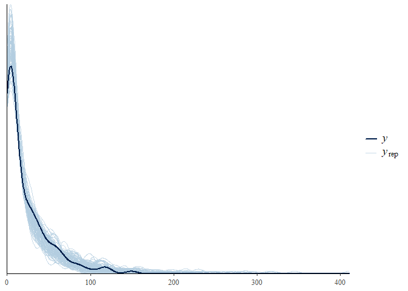<!-- -->

We see here that the model does a pretty good job of generating predictiosn that look like our data. 

### Psychological - minor

Summarize output: 

``` r
summary(aim1_psych_min, prob = .89)
```

```
##  Family: negbinomial 
##   Links: mu = log; shape = identity 
## Formula: CTS_psych_perp_HR_minor ~ 0 + Intercept + IHS_mean_actor + IHS_mean_partner + (1 | CoupleID) 
##    Data: data (Number of observations: 168) 
##   Draws: 4 chains, each with iter = 3500; warmup = 1000; thin = 1;
##          total post-warmup draws = 10000
## 
## Multilevel Hyperparameters:
## ~CoupleID (Number of levels: 84) 
##               Estimate Est.Error l-89% CI u-89% CI Rhat Bulk_ESS Tail_ESS
## sd(Intercept)     1.43      0.13     1.22     1.65 1.00     1667     3473
## 
## Regression Coefficients:
##                  Estimate Est.Error l-89% CI u-89% CI Rhat Bulk_ESS Tail_ESS
## Intercept            1.96      0.16     1.70     2.21 1.00     1163     2276
## IHS_mean_actor       0.28      0.11     0.11     0.46 1.00     1077     2659
## IHS_mean_partner     0.22      0.11     0.05     0.39 1.00     1081     2497
## 
## Further Distributional Parameters:
##       Estimate Est.Error l-89% CI u-89% CI Rhat Bulk_ESS Tail_ESS
## shape     7.34      1.70     4.94    10.25 1.00     5583     6730
## 
## Draws were sampled using sample(hmc). For each parameter, Bulk_ESS
## and Tail_ESS are effective sample size measures, and Rhat is the potential
## scale reduction factor on split chains (at convergence, Rhat = 1).
```

We see here that we have evidence of positive, reliable actor and partner effects of internalized stigma on the frequency of psychological IPV perpetration. The results are similar to the overall psych aggression scores. 

PPC:

``` r
pp_check(aim1_psych_min, ndraws = 100)
```

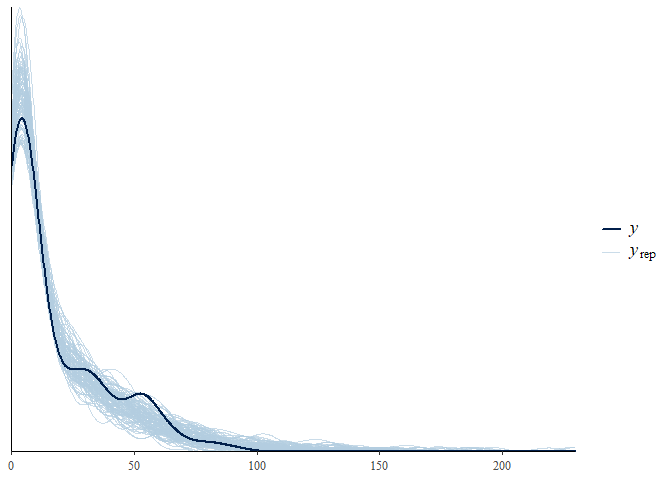<!-- -->

We see here that the model does a pretty good job of generating predictions that look like our data. 

### Psychological - severe

Summarize output: 

``` r
summary(aim1_psych_sev, prob = .89)
```

```
##  Family: negbinomial 
##   Links: mu = log; shape = identity 
## Formula: CTS_psych_perp_HR_severe ~ 0 + Intercept + IHS_mean_actor + IHS_mean_partner + (1 | CoupleID) 
##    Data: data (Number of observations: 164) 
##   Draws: 4 chains, each with iter = 3500; warmup = 1000; thin = 1;
##          total post-warmup draws = 10000
## 
## Multilevel Hyperparameters:
## ~CoupleID (Number of levels: 82) 
##               Estimate Est.Error l-89% CI u-89% CI Rhat Bulk_ESS Tail_ESS
## sd(Intercept)     2.20      0.28     1.78     2.68 1.00     2319     4354
## 
## Regression Coefficients:
##                  Estimate Est.Error l-89% CI u-89% CI Rhat Bulk_ESS Tail_ESS
## Intercept           -0.15      0.25    -0.57     0.25 1.00     2915     4809
## IHS_mean_actor       0.50      0.19     0.21     0.80 1.00     2366     4005
## IHS_mean_partner     0.42      0.19     0.13     0.73 1.00     2404     4366
## 
## Further Distributional Parameters:
##       Estimate Est.Error l-89% CI u-89% CI Rhat Bulk_ESS Tail_ESS
## shape     2.54      0.85     1.39     4.05 1.00     5181     5598
## 
## Draws were sampled using sample(hmc). For each parameter, Bulk_ESS
## and Tail_ESS are effective sample size measures, and Rhat is the potential
## scale reduction factor on split chains (at convergence, Rhat = 1).
```

We see here that we have evidence of positive, reliable actor and partner effects of internalized stigma on the frequency of psychological IPV perpetration. Results are consistent with the minor & overall psych IPV models, with the exception of the intercept term that is now generally negative and compatible with zero. 

PPC:

``` r
pp_check(aim1_psych_sev, ndraws = 100)
```

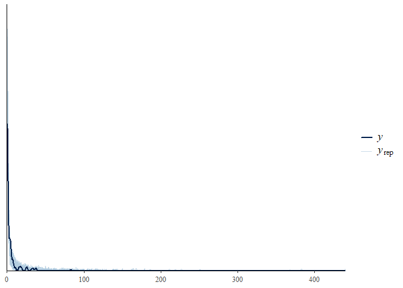<!-- -->

We see here that the model generates some predictions that are outside the range of observed data. 

### Physical

Summary:


``` r
summary(aim1_phys, prob = .89)
```

```
##  Family: bernoulli 
##   Links: mu = logit 
## Formula: CTS_phys_perp_binary ~ 0 + Intercept + IHS_mean_actor + IHS_mean_partner + (1 | CoupleID) 
##    Data: data (Number of observations: 164) 
##   Draws: 4 chains, each with iter = 2000; warmup = 1000; thin = 1;
##          total post-warmup draws = 4000
## 
## Multilevel Hyperparameters:
## ~CoupleID (Number of levels: 82) 
##               Estimate Est.Error l-89% CI u-89% CI Rhat Bulk_ESS Tail_ESS
## sd(Intercept)     2.72      0.70     1.72     3.90 1.00     1965     2441
## 
## Regression Coefficients:
##                  Estimate Est.Error l-89% CI u-89% CI Rhat Bulk_ESS Tail_ESS
## Intercept           -2.57      0.46    -3.35    -1.88 1.00     3552     3358
## IHS_mean_actor       0.21      0.32    -0.32     0.74 1.00     4073     3286
## IHS_mean_partner     0.35      0.32    -0.16     0.87 1.00     4080     3138
## 
## Draws were sampled using sample(hmc). For each parameter, Bulk_ESS
## and Tail_ESS are effective sample size measures, and Rhat is the potential
## scale reduction factor on split chains (at convergence, Rhat = 1).
```

We see here that there's an estimated positive effect of actor and partner internalized stigma on the log odds of physical IPV perpetration. However, this effect is pretty variable and not reliably different from zero. 

PPC:

``` r
pp_check(aim1_phys, ndraws = 100)
```

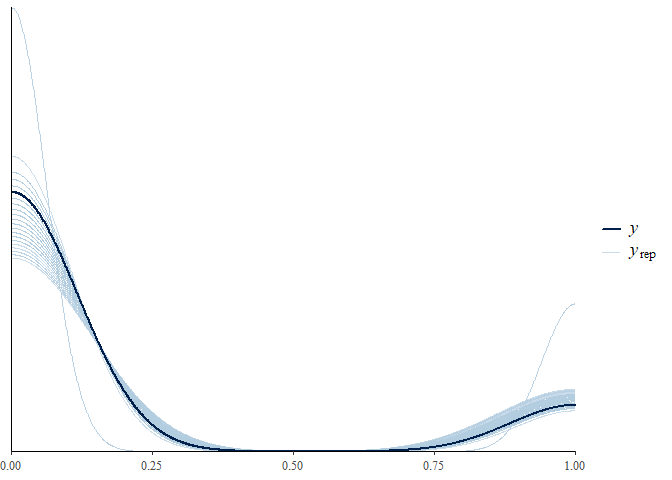<!-- -->

We see here that the model does a pretty decent job of predicting probabilities of engaging in physical IPV. 

### SGM-specific

Summarize: 

``` r
summary(aim1_sgm, prob = .89)
```

```
##  Family: bernoulli 
##   Links: mu = logit 
## Formula: CTS_sgm_perp_binary ~ 0 + Intercept + IHS_mean_actor + IHS_mean_partner + (1 | CoupleID) 
##    Data: data (Number of observations: 164) 
##   Draws: 4 chains, each with iter = 2000; warmup = 1000; thin = 1;
##          total post-warmup draws = 4000
## 
## Multilevel Hyperparameters:
## ~CoupleID (Number of levels: 82) 
##               Estimate Est.Error l-89% CI u-89% CI Rhat Bulk_ESS Tail_ESS
## sd(Intercept)     1.16      0.58     0.20     2.07 1.01      816     1152
## 
## Regression Coefficients:
##                  Estimate Est.Error l-89% CI u-89% CI Rhat Bulk_ESS Tail_ESS
## Intercept           -2.17      0.36    -2.79    -1.65 1.00     1959     2546
## IHS_mean_actor       0.25      0.22    -0.10     0.59 1.00     4996     3102
## IHS_mean_partner     0.57      0.22     0.23     0.93 1.00     4111     2624
## 
## Draws were sampled using sample(hmc). For each parameter, Bulk_ESS
## and Tail_ESS are effective sample size measures, and Rhat is the potential
## scale reduction factor on split chains (at convergence, Rhat = 1).
```

Here we see evidence of a positive, reliable partner internalized stigma effect on log odds of perpetrating SGM-related IPV. There's an estimated positive effect for actor internalized stigma as well, but this is not reliably different from zero. 

PPC:

``` r
pp_check(aim1_sgm, ndraws = 100)
```

<!-- -->

Not a terrible job in predicting probabilities of engaging in aggression. 

## Covariates

Now let's run the models with our chosen covariates to evaluate whether accounting for their potential influence on both internalized stigma and IPV perpetration may change results. 

Run all of the models here: 


``` r
aim1_psych_cov <- brm(bf(CTS_psych_perp_HR ~ 0 + Intercept + IHS_mean_actor + IHS_mean_partner + Age + rel_length_yrs + sxlorx_dich + gender_three + race_dich + (1 | CoupleID)),
                  prior = c(# prior on mean (log scale)
                            prior(normal(1, 0.5), class = b, coef = Intercept), 
                            # priors for frequency
                            prior(normal(0.8, 1), class = b, coef = IHS_mean_actor),
                            prior(normal(0.8, 1), class = b, coef = IHS_mean_partner),
                            # priors for covariates
                            prior(normal(0, 0.5), class = b, coef = Age),
                            prior(normal(0, 0.5), class = b, coef = rel_length_yrs),
                            prior(normal(0, 0.5), class = b, coef = sxlorx_dichBiP),
                            prior(normal(0, 0.5), class = b, coef = gender_threeCisman),
                            prior(normal(0, 0.5), class = b, coef = gender_threeGenderdiverse),
                            prior(normal(0, 0.5), class = b, coef = race_dichBIPOC),
                            # prior on couple variability
                            prior(exponential(1), class = sd),
                            # prior on dispersion parameter
                            prior(exponential(1), class = shape) 
                  ),
                  data = data,
                  family = negbinomial(),
                  chains = 4, iter = 3500, warmup = 1000, cores = 4, 
                  seed = 1234,
                  control = list(adapt_delta = .99),
                  file = "fits/aim1_psych_cov",
                  file_refit = "on_change"
                  )

aim1_psych_cov_min <- brm(bf(CTS_psych_perp_HR_minor ~ 0 + Intercept + IHS_mean_actor + IHS_mean_partner + Age + rel_length_yrs + sxlorx_dich + gender_three + race_dich + (1 | CoupleID)),
                  prior = c(# prior on mean (log scale)
                            prior(normal(1, 0.5), class = b, coef = Intercept), 
                            # priors for frequency
                            prior(normal(0.8, 1), class = b, coef = IHS_mean_actor),
                            prior(normal(0.8, 1), class = b, coef = IHS_mean_partner),
                            # priors for covariates
                            prior(normal(0, 0.5), class = b, coef = Age),
                            prior(normal(0, 0.5), class = b, coef = rel_length_yrs),
                            prior(normal(0, 0.5), class = b, coef = sxlorx_dichBiP),
                            prior(normal(0, 0.5), class = b, coef = gender_threeCisman),
                            prior(normal(0, 0.5), class = b, coef = gender_threeGenderdiverse),
                            prior(normal(0, 0.5), class = b, coef = race_dichBIPOC),
                            # prior on couple variability
                            prior(exponential(1), class = sd),
                            # prior on dispersion parameter
                            prior(exponential(1), class = shape) 
                  ),
                  data = data,
                  family = negbinomial(),
                  chains = 4, iter = 3500, warmup = 1000, cores = 4, 
                  seed = 1234,
                  control = list(adapt_delta = .99),
                  file = "fits/aim1_psych_cov_min",
                  file_refit = "on_change"
                  )

aim1_psych_cov_sev <- brm(bf(CTS_psych_perp_HR_severe ~ 0 + Intercept + IHS_mean_actor + IHS_mean_partner + Age + rel_length_yrs + sxlorx_dich + gender_three + race_dich + (1 | CoupleID)),
                  prior = c(# prior on mean (log scale)
                            prior(normal(1, 0.5), class = b, coef = Intercept), 
                            # priors for frequency
                            prior(normal(0.8, 1), class = b, coef = IHS_mean_actor),
                            prior(normal(0.8, 1), class = b, coef = IHS_mean_partner),
                            # priors for covariates
                            prior(normal(0, 0.5), class = b, coef = Age),
                            prior(normal(0, 0.5), class = b, coef = rel_length_yrs),
                            prior(normal(0, 0.5), class = b, coef = sxlorx_dichBiP),
                            prior(normal(0, 0.5), class = b, coef = gender_threeCisman),
                            prior(normal(0, 0.5), class = b, coef = gender_threeGenderdiverse),
                            prior(normal(0, 0.5), class = b, coef = race_dichBIPOC),
                            # prior on couple variability
                            prior(exponential(1), class = sd),
                            # prior on dispersion parameter
                            prior(exponential(1), class = shape) 
                  ),
                  data = data,
                  family = negbinomial(),
                  chains = 4, iter = 3500, warmup = 1000, cores = 4, 
                  seed = 1234,
                  control = list(adapt_delta = .99),
                  file = "fits/aim1_psych_cov_sev",
                  file_refit = "on_change"
                  )

aim1_phys_cov <- brm(bf(CTS_phys_perp_binary ~ 0 + Intercept + IHS_mean_actor + IHS_mean_partner + Age + rel_length_yrs + sxlorx_dich + gender_three + race_dich + (1 | CoupleID)),
                  prior = c(# prior on odds of being 1 (logit scale)
                            prior(normal(1.5, 1), class = b, coef = Intercept), 
                            # prior on regression relationship
                            prior(normal(0.5, 0.75), class = b, coef = IHS_mean_actor),
                            prior(normal(0.5, 0.75), class = b, coef = IHS_mean_partner), 
                            # priors for covariates
                            prior(normal(0, 0.5), class = b, coef = Age),
                            prior(normal(0, 0.5), class = b, coef = rel_length_yrs),
                            prior(normal(0, 0.5), class = b, coef = sxlorx_dichBiP),
                            prior(normal(0, 0.5), class = b, coef = gender_threeCisman),
                            prior(normal(0, 0.5), class = b, coef = gender_threeGenderdiverse),
                            prior(normal(0, 0.5), class = b, coef = race_dichBIPOC),
                            # prior on couple variability
                            prior(exponential(1), class = sd) 
                  ),
                 data = data,
                  family = bernoulli,
                  chains = 4, iter = 2000, warmup = 1000, cores = 4,
                  seed = 1234,
                  file = "fits/aim1_phys_cov",
                  file_refit = "on_change"
                  )

aim1_sgm_cov <- brm(bf(CTS_sgm_perp_binary ~ 0 + Intercept + IHS_mean_actor + IHS_mean_partner + Age + rel_length_yrs + sxlorx_dich + gender_three + race_dich + (1 | CoupleID)),
                  prior = c(# prior on odds of being a 1 (logit scale)
                            prior(normal(1.5, 1), class = b, coef = Intercept),
                            # prior on regression relationship
                            prior(normal(0, 0.5), class = b, coef = IHS_mean_actor),
                            prior(normal(0, 0.5), class = b, coef = IHS_mean_partner), 
                            # priors for covariates
                            prior(normal(0, 0.5), class = b, coef = Age),
                            prior(normal(0, 0.5), class = b, coef = rel_length_yrs),
                            prior(normal(0, 0.5), class = b, coef = sxlorx_dichBiP),
                            prior(normal(0, 0.5), class = b, coef = gender_threeCisman),
                            prior(normal(0, 0.5), class = b, coef = gender_threeGenderdiverse),
                            prior(normal(0, 0.5), class = b, coef = race_dichBIPOC),
                            # prior on couple variability
                            prior(exponential(1), class = sd) 
                  ),
                data = data,
                  family = bernoulli,
                  chains = 4, iter = 2000, warmup = 1000, cores = 4,
                  seed = 1234,
                  file = "fits/aim1_sgm_cov",
                  file_refit = "on_change"
                  )
```

Then, as before, we'll go ahead and inspect the results by each type of IPV.

### Psychological 

Summarize:

``` r
summary(aim1_psych_cov, prob = .89)
```

```
##  Family: negbinomial 
##   Links: mu = log; shape = identity 
## Formula: CTS_psych_perp_HR ~ 0 + Intercept + IHS_mean_actor + IHS_mean_partner + Age + rel_length_yrs + sxlorx_dich + gender_three + race_dich + (1 | CoupleID) 
##    Data: data (Number of observations: 163) 
##   Draws: 4 chains, each with iter = 3500; warmup = 1000; thin = 1;
##          total post-warmup draws = 10000
## 
## Multilevel Hyperparameters:
## ~CoupleID (Number of levels: 82) 
##               Estimate Est.Error l-89% CI u-89% CI Rhat Bulk_ESS Tail_ESS
## sd(Intercept)     1.46      0.14     1.26     1.70 1.00     1652     3081
## 
## Regression Coefficients:
##                           Estimate Est.Error l-89% CI u-89% CI Rhat Bulk_ESS
## Intercept                     2.05      0.20     1.71     2.37 1.00     1608
## IHS_mean_actor                0.29      0.11     0.11     0.47 1.00     1223
## IHS_mean_partner              0.22      0.11     0.04     0.40 1.00     1246
## Age                           0.05      0.11    -0.12     0.23 1.00     2432
## rel_length_yrs                0.26      0.17    -0.01     0.52 1.00     1442
## sxlorx_dichBiP               -0.02      0.14    -0.24     0.20 1.00     4164
## gender_threeCisman            0.12      0.23    -0.25     0.48 1.00     2463
## gender_threeGenderdiverse     0.08      0.16    -0.18     0.33 1.00     4820
## race_dichBIPOC                0.05      0.14    -0.18     0.28 1.00     4733
##                           Tail_ESS
## Intercept                     2797
## IHS_mean_actor                2301
## IHS_mean_partner              2214
## Age                           3967
## rel_length_yrs                2225
## sxlorx_dichBiP                5873
## gender_threeCisman            4745
## gender_threeGenderdiverse     6136
## race_dichBIPOC                6652
## 
## Further Distributional Parameters:
##       Estimate Est.Error l-89% CI u-89% CI Rhat Bulk_ESS Tail_ESS
## shape     6.53      1.51     4.38     9.14 1.00     4327     6169
## 
## Draws were sampled using sample(hmc). For each parameter, Bulk_ESS
## and Tail_ESS are effective sample size measures, and Rhat is the potential
## scale reduction factor on split chains (at convergence, Rhat = 1).
```
Generally, covariates were not reliably related to psychological IPV perpetration with the exception of relationship length, which just barely passed over the 0 threshold. We also see that the estimates of the actor & partner effects are pretty similar, though they decrease slightly. 

### Psychological - minor 

Summarize:

``` r
summary(aim1_psych_cov_min, prob = .89)
```

```
##  Family: negbinomial 
##   Links: mu = log; shape = identity 
## Formula: CTS_psych_perp_HR_minor ~ 0 + Intercept + IHS_mean_actor + IHS_mean_partner + Age + rel_length_yrs + sxlorx_dich + gender_three + race_dich + (1 | CoupleID) 
##    Data: data (Number of observations: 167) 
##   Draws: 4 chains, each with iter = 3500; warmup = 1000; thin = 1;
##          total post-warmup draws = 10000
## 
## Multilevel Hyperparameters:
## ~CoupleID (Number of levels: 84) 
##               Estimate Est.Error l-89% CI u-89% CI Rhat Bulk_ESS Tail_ESS
## sd(Intercept)     1.40      0.13     1.20     1.63 1.00     2312     3783
## 
## Regression Coefficients:
##                           Estimate Est.Error l-89% CI u-89% CI Rhat Bulk_ESS
## Intercept                     1.95      0.19     1.64     2.26 1.00     2098
## IHS_mean_actor                0.27      0.11     0.10     0.44 1.00     1778
## IHS_mean_partner              0.21      0.11     0.03     0.38 1.00     1791
## Age                           0.04      0.11    -0.12     0.21 1.00     3463
## rel_length_yrs                0.28      0.16     0.03     0.53 1.00     1975
## sxlorx_dichBiP               -0.04      0.14    -0.26     0.20 1.00     6029
## gender_threeCisman            0.08      0.23    -0.27     0.45 1.00     3395
## gender_threeGenderdiverse     0.09      0.16    -0.16     0.34 1.00     6372
## race_dichBIPOC               -0.02      0.14    -0.24     0.21 1.00     6711
##                           Tail_ESS
## Intercept                     3961
## IHS_mean_actor                3591
## IHS_mean_partner              3416
## Age                           5097
## rel_length_yrs                4031
## sxlorx_dichBiP                6618
## gender_threeCisman            4729
## gender_threeGenderdiverse     6837
## race_dichBIPOC                7212
## 
## Further Distributional Parameters:
##       Estimate Est.Error l-89% CI u-89% CI Rhat Bulk_ESS Tail_ESS
## shape     6.91      1.67     4.52     9.84 1.00     4765     5656
## 
## Draws were sampled using sample(hmc). For each parameter, Bulk_ESS
## and Tail_ESS are effective sample size measures, and Rhat is the potential
## scale reduction factor on split chains (at convergence, Rhat = 1).
```
Generally, covariates were not reliably related to psychological IPV perpetration with the exception of relationship length, which just barely passed over the 0 threshold. We also see that the estimates of the actor & partner effects are pretty similar, though they decrease slightly. 

### Psychological - severe

Summarize:

``` r
summary(aim1_psych_cov_sev, prob = .89)
```

```
##  Family: negbinomial 
##   Links: mu = log; shape = identity 
## Formula: CTS_psych_perp_HR_severe ~ 0 + Intercept + IHS_mean_actor + IHS_mean_partner + Age + rel_length_yrs + sxlorx_dich + gender_three + race_dich + (1 | CoupleID) 
##    Data: data (Number of observations: 163) 
##   Draws: 4 chains, each with iter = 3500; warmup = 1000; thin = 1;
##          total post-warmup draws = 10000
## 
## Multilevel Hyperparameters:
## ~CoupleID (Number of levels: 82) 
##               Estimate Est.Error l-89% CI u-89% CI Rhat Bulk_ESS Tail_ESS
## sd(Intercept)     2.29      0.30     1.85     2.81 1.00     2209     4867
## 
## Regression Coefficients:
##                           Estimate Est.Error l-89% CI u-89% CI Rhat Bulk_ESS
## Intercept                    -0.00      0.31    -0.50     0.49 1.00     3153
## IHS_mean_actor                0.50      0.20     0.19     0.82 1.00     1927
## IHS_mean_partner              0.41      0.20     0.09     0.72 1.00     1923
## Age                           0.05      0.22    -0.29     0.39 1.00     3103
## rel_length_yrs                0.21      0.26    -0.20     0.62 1.00     2525
## sxlorx_dichBiP               -0.26      0.26    -0.68     0.17 1.00     6672
## gender_threeCisman           -0.19      0.36    -0.77     0.38 1.00     5077
## gender_threeGenderdiverse    -0.23      0.29    -0.70     0.24 1.00     7000
## race_dichBIPOC                0.18      0.28    -0.27     0.63 1.00     5993
##                           Tail_ESS
## Intercept                     5314
## IHS_mean_actor                3553
## IHS_mean_partner              3711
## Age                           4874
## rel_length_yrs                3664
## sxlorx_dichBiP                7206
## gender_threeCisman            6708
## gender_threeGenderdiverse     7492
## race_dichBIPOC                6897
## 
## Further Distributional Parameters:
##       Estimate Est.Error l-89% CI u-89% CI Rhat Bulk_ESS Tail_ESS
## shape     2.39      0.82     1.30     3.85 1.00     4199     5135
## 
## Draws were sampled using sample(hmc). For each parameter, Bulk_ESS
## and Tail_ESS are effective sample size measures, and Rhat is the potential
## scale reduction factor on split chains (at convergence, Rhat = 1).
```
Generally, covariates were not reliably related to psychological IPV perpetration with the exception of relationship length, which just barely passed over the 0 threshold. We also see that the estimates of the actor & partner effects are pretty similar, though they decrease slightly. 


### Physical 

Summarize:

``` r
summary(aim1_phys_cov, prob = .89)
```

```
##  Family: bernoulli 
##   Links: mu = logit 
## Formula: CTS_phys_perp_binary ~ 0 + Intercept + IHS_mean_actor + IHS_mean_partner + Age + rel_length_yrs + sxlorx_dich + gender_three + race_dich + (1 | CoupleID) 
##    Data: data (Number of observations: 163) 
##   Draws: 4 chains, each with iter = 2000; warmup = 1000; thin = 1;
##          total post-warmup draws = 4000
## 
## Multilevel Hyperparameters:
## ~CoupleID (Number of levels: 82) 
##               Estimate Est.Error l-89% CI u-89% CI Rhat Bulk_ESS Tail_ESS
## sd(Intercept)     2.97      0.75     1.91     4.24 1.00     2026     2508
## 
## Regression Coefficients:
##                           Estimate Est.Error l-89% CI u-89% CI Rhat Bulk_ESS
## Intercept                    -2.18      0.54    -3.09    -1.34 1.00     3632
## IHS_mean_actor                0.23      0.34    -0.31     0.77 1.00     3867
## IHS_mean_partner              0.34      0.34    -0.18     0.90 1.00     3556
## Age                          -0.09      0.35    -0.63     0.45 1.00     4590
## rel_length_yrs                0.31      0.35    -0.24     0.85 1.00     3718
## sxlorx_dichBiP               -0.60      0.42    -1.26     0.06 1.00     6023
## gender_threeCisman           -0.07      0.46    -0.81     0.67 1.00     5686
## gender_threeGenderdiverse    -0.34      0.44    -1.06     0.34 1.00     5969
## race_dichBIPOC               -0.35      0.43    -1.04     0.33 1.00     5930
##                           Tail_ESS
## Intercept                     2795
## IHS_mean_actor                2842
## IHS_mean_partner              2850
## Age                           3422
## rel_length_yrs                3233
## sxlorx_dichBiP                3071
## gender_threeCisman            2477
## gender_threeGenderdiverse     2811
## race_dichBIPOC                2783
## 
## Draws were sampled using sample(hmc). For each parameter, Bulk_ESS
## and Tail_ESS are effective sample size measures, and Rhat is the potential
## scale reduction factor on split chains (at convergence, Rhat = 1).
```

We see here the covariates aren't reliably different from 0, and the actor & partner effect estimates don't really change. 

### SGM-specific

Summarize:

``` r
summary(aim1_sgm_cov, prob = .89)
```

```
##  Family: bernoulli 
##   Links: mu = logit 
## Formula: CTS_sgm_perp_binary ~ 0 + Intercept + IHS_mean_actor + IHS_mean_partner + Age + rel_length_yrs + sxlorx_dich + gender_three + race_dich + (1 | CoupleID) 
##    Data: data (Number of observations: 163) 
##   Draws: 4 chains, each with iter = 2000; warmup = 1000; thin = 1;
##          total post-warmup draws = 4000
## 
## Multilevel Hyperparameters:
## ~CoupleID (Number of levels: 82) 
##               Estimate Est.Error l-89% CI u-89% CI Rhat Bulk_ESS Tail_ESS
## sd(Intercept)     1.37      0.63     0.28     2.36 1.01      467      575
## 
## Regression Coefficients:
##                           Estimate Est.Error l-89% CI u-89% CI Rhat Bulk_ESS
## Intercept                    -2.03      0.45    -2.78    -1.33 1.00     2280
## IHS_mean_actor                0.25      0.24    -0.13     0.64 1.00     4522
## IHS_mean_partner              0.58      0.23     0.22     0.96 1.00     3839
## Age                          -0.07      0.27    -0.51     0.36 1.00     4321
## rel_length_yrs                0.02      0.27    -0.41     0.44 1.00     3993
## sxlorx_dichBiP               -0.26      0.38    -0.86     0.35 1.00     4205
## gender_threeCisman           -0.23      0.40    -0.88     0.41 1.00     4865
## gender_threeGenderdiverse    -0.41      0.41    -1.08     0.24 1.00     5647
## race_dichBIPOC                0.13      0.38    -0.46     0.73 1.00     4959
##                           Tail_ESS
## Intercept                     2822
## IHS_mean_actor                2737
## IHS_mean_partner              3085
## Age                           2787
## rel_length_yrs                3163
## sxlorx_dichBiP                2989
## gender_threeCisman            3216
## gender_threeGenderdiverse     3070
## race_dichBIPOC                2991
## 
## Draws were sampled using sample(hmc). For each parameter, Bulk_ESS
## and Tail_ESS are effective sample size measures, and Rhat is the potential
## scale reduction factor on split chains (at convergence, Rhat = 1).
```

Again, not much of a change. 

## Sensitivity to priors

Let's see how sensitive those results are to the priors we set for the actor & partner effects. Let's first look at the models without covariates. 


``` r
aim1_psych_1 <- brm(bf(CTS_psych_perp_HR ~ 0 + Intercept + IHS_mean_actor + IHS_mean_partner + (1 | CoupleID)),
                  prior = c(# prior on mean (log scale)
                            prior(normal(1, 0.5), class = b, coef = Intercept), 
                            # prior on couple variability
                            prior(exponential(1), class = sd),
                            # prior on dispersion parameter
                            prior(exponential(1), class = shape) 
                  ),
                  data = data,
                  family = negbinomial(),
                  chains = 4, iter = 2000, warmup = 1000, cores = 4, 
                  seed = 1234,
                  file = "fits/aim1_psych_1",
                  file_refit = "on_change"
                  )

aim1_psych_1_min <- brm(bf(CTS_psych_perp_HR_minor ~ 0 + Intercept + IHS_mean_actor + IHS_mean_partner + (1 | CoupleID)),
                  prior = c(# prior on mean (log scale)
                            prior(normal(1, 0.5), class = b, coef = Intercept), 
                            # prior on couple variability
                            prior(exponential(1), class = sd),
                            # prior on dispersion parameter
                            prior(exponential(1), class = shape) 
                  ),
                  data = data,
                  family = negbinomial(),
                  chains = 4, iter = 2000, warmup = 1000, cores = 4, 
                  seed = 1234,
                  file = "fits/aim1_psych_1_min",
                  file_refit = "on_change"
                  )

aim1_psych_1_sev <- brm(bf(CTS_psych_perp_HR_severe ~ 0 + Intercept + IHS_mean_actor + IHS_mean_partner + (1 | CoupleID)),
                  prior = c(# prior on mean (log scale)
                            prior(normal(1, 0.5), class = b, coef = Intercept), 
                            # prior on couple variability
                            prior(exponential(1), class = sd),
                            # prior on dispersion parameter
                            prior(exponential(1), class = shape) 
                  ),
                  data = data,
                  family = negbinomial(),
                  chains = 4, iter = 2000, warmup = 1000, cores = 4, 
                  seed = 1234,
                  file = "fits/aim1_psych_1_sev",
                  file_refit = "on_change"
                  )

aim1_phys_1 <- brm(bf(CTS_phys_perp_binary ~ 0 + Intercept + IHS_mean_actor + IHS_mean_partner + (1 | CoupleID)),
                  prior = c(# prior on odds of being 1 (logit scale)
                            prior(normal(1.5, 1), class = b, coef = Intercept), 
                            # prior on couple variability
                            prior(exponential(1), class = sd) 
                  ),
                 data = data,
                  family = bernoulli,
                  chains = 4, iter = 2000, warmup = 1000, cores = 4,
                  seed = 1234,
                  file = "fits/aim1_phys_1",
                  file_refit = "on_change"
                  )

aim1_sgm_1 <- brm(bf(CTS_sgm_perp_binary ~ 0 + Intercept + IHS_mean_actor + IHS_mean_partner + (1 | CoupleID)),
                  prior = c(# prior on odds of being a 1 (logit scale)
                            prior(normal(1.5, 1), class = b, coef = Intercept),
                            # prior on couple variability
                            prior(exponential(1), class = sd) 
                  ),
                data = data,
                  family = bernoulli,
                  chains = 4, iter = 2000, warmup = 1000, cores = 4,
                  seed = 1234,
                  file = "fits/aim1_sgm_1",
                  file_refit = "on_change"
                  )
```

Summarize:


``` r
summary(aim1_psych_1, prob = .89)
```

```
##  Family: negbinomial 
##   Links: mu = log; shape = identity 
## Formula: CTS_psych_perp_HR ~ 0 + Intercept + IHS_mean_actor + IHS_mean_partner + (1 | CoupleID) 
##    Data: data (Number of observations: 164) 
##   Draws: 4 chains, each with iter = 2000; warmup = 1000; thin = 1;
##          total post-warmup draws = 4000
## 
## Multilevel Hyperparameters:
## ~CoupleID (Number of levels: 82) 
##               Estimate Est.Error l-89% CI u-89% CI Rhat Bulk_ESS Tail_ESS
## sd(Intercept)     1.49      0.14     1.28     1.73 1.01      575     1107
## 
## Regression Coefficients:
##                  Estimate Est.Error l-89% CI u-89% CI Rhat Bulk_ESS Tail_ESS
## Intercept            2.10      0.17     1.82     2.36 1.01      357      705
## IHS_mean_actor       0.29      0.12     0.11     0.48 1.01      547     1071
## IHS_mean_partner     0.23      0.12     0.04     0.41 1.01      522      974
## 
## Further Distributional Parameters:
##       Estimate Est.Error l-89% CI u-89% CI Rhat Bulk_ESS Tail_ESS
## shape     7.00      1.58     4.80     9.84 1.00     2103     2629
## 
## Draws were sampled using sample(hmc). For each parameter, Bulk_ESS
## and Tail_ESS are effective sample size measures, and Rhat is the potential
## scale reduction factor on split chains (at convergence, Rhat = 1).
```

``` r
summary(aim1_psych_1_min, prob = .89)
```

```
##  Family: negbinomial 
##   Links: mu = log; shape = identity 
## Formula: CTS_psych_perp_HR_minor ~ 0 + Intercept + IHS_mean_actor + IHS_mean_partner + (1 | CoupleID) 
##    Data: data (Number of observations: 168) 
##   Draws: 4 chains, each with iter = 2000; warmup = 1000; thin = 1;
##          total post-warmup draws = 4000
## 
## Multilevel Hyperparameters:
## ~CoupleID (Number of levels: 84) 
##               Estimate Est.Error l-89% CI u-89% CI Rhat Bulk_ESS Tail_ESS
## sd(Intercept)     1.42      0.13     1.22     1.65 1.01      511      950
## 
## Regression Coefficients:
##                  Estimate Est.Error l-89% CI u-89% CI Rhat Bulk_ESS Tail_ESS
## Intercept            1.97      0.16     1.72     2.21 1.01      396      838
## IHS_mean_actor       0.27      0.11     0.09     0.44 1.01      460      828
## IHS_mean_partner     0.20      0.11     0.03     0.37 1.01      445      809
## 
## Further Distributional Parameters:
##       Estimate Est.Error l-89% CI u-89% CI Rhat Bulk_ESS Tail_ESS
## shape     7.32      1.74     4.88    10.33 1.00     1847     2469
## 
## Draws were sampled using sample(hmc). For each parameter, Bulk_ESS
## and Tail_ESS are effective sample size measures, and Rhat is the potential
## scale reduction factor on split chains (at convergence, Rhat = 1).
```

``` r
summary(aim1_psych_1_sev, prob = .89)
```

```
##  Family: negbinomial 
##   Links: mu = log; shape = identity 
## Formula: CTS_psych_perp_HR_severe ~ 0 + Intercept + IHS_mean_actor + IHS_mean_partner + (1 | CoupleID) 
##    Data: data (Number of observations: 164) 
##   Draws: 4 chains, each with iter = 2000; warmup = 1000; thin = 1;
##          total post-warmup draws = 4000
## 
## Multilevel Hyperparameters:
## ~CoupleID (Number of levels: 82) 
##               Estimate Est.Error l-89% CI u-89% CI Rhat Bulk_ESS Tail_ESS
## sd(Intercept)     2.19      0.28     1.79     2.67 1.01      883     1830
## 
## Regression Coefficients:
##                  Estimate Est.Error l-89% CI u-89% CI Rhat Bulk_ESS Tail_ESS
## Intercept           -0.13      0.26    -0.54     0.28 1.00     1081     1804
## IHS_mean_actor       0.47      0.19     0.17     0.78 1.01      618     1426
## IHS_mean_partner     0.39      0.19     0.10     0.71 1.01      701     1328
## 
## Further Distributional Parameters:
##       Estimate Est.Error l-89% CI u-89% CI Rhat Bulk_ESS Tail_ESS
## shape     2.53      0.85     1.40     4.02 1.00     2023     2579
## 
## Draws were sampled using sample(hmc). For each parameter, Bulk_ESS
## and Tail_ESS are effective sample size measures, and Rhat is the potential
## scale reduction factor on split chains (at convergence, Rhat = 1).
```

``` r
summary(aim1_phys_1, prob = .89)
```

```
##  Family: bernoulli 
##   Links: mu = logit 
## Formula: CTS_phys_perp_binary ~ 0 + Intercept + IHS_mean_actor + IHS_mean_partner + (1 | CoupleID) 
##    Data: data (Number of observations: 164) 
##   Draws: 4 chains, each with iter = 2000; warmup = 1000; thin = 1;
##          total post-warmup draws = 4000
## 
## Multilevel Hyperparameters:
## ~CoupleID (Number of levels: 82) 
##               Estimate Est.Error l-89% CI u-89% CI Rhat Bulk_ESS Tail_ESS
## sd(Intercept)     2.74      0.73     1.72     3.97 1.00     1940     2179
## 
## Regression Coefficients:
##                  Estimate Est.Error l-89% CI u-89% CI Rhat Bulk_ESS Tail_ESS
## Intercept           -2.58      0.46    -3.35    -1.88 1.00     3624     3281
## IHS_mean_actor       0.12      0.37    -0.47     0.70 1.00     3382     2580
## IHS_mean_partner     0.30      0.37    -0.26     0.90 1.00     3035     2663
## 
## Draws were sampled using sample(hmc). For each parameter, Bulk_ESS
## and Tail_ESS are effective sample size measures, and Rhat is the potential
## scale reduction factor on split chains (at convergence, Rhat = 1).
```

``` r
summary(aim1_sgm_1, prob = .89)
```

```
##  Family: bernoulli 
##   Links: mu = logit 
## Formula: CTS_sgm_perp_binary ~ 0 + Intercept + IHS_mean_actor + IHS_mean_partner + (1 | CoupleID) 
##    Data: data (Number of observations: 164) 
##   Draws: 4 chains, each with iter = 2000; warmup = 1000; thin = 1;
##          total post-warmup draws = 4000
## 
## Multilevel Hyperparameters:
## ~CoupleID (Number of levels: 82) 
##               Estimate Est.Error l-89% CI u-89% CI Rhat Bulk_ESS Tail_ESS
## sd(Intercept)     1.27      0.63     0.23     2.28 1.00      576      966
## 
## Regression Coefficients:
##                  Estimate Est.Error l-89% CI u-89% CI Rhat Bulk_ESS Tail_ESS
## Intercept           -2.25      0.40    -2.95    -1.67 1.00     1299     2177
## IHS_mean_actor       0.33      0.26    -0.08     0.75 1.00     2828     2424
## IHS_mean_partner     0.73      0.27     0.32     1.20 1.00     1887     1870
## 
## Draws were sampled using sample(hmc). For each parameter, Bulk_ESS
## and Tail_ESS are effective sample size measures, and Rhat is the potential
## scale reduction factor on split chains (at convergence, Rhat = 1).
```

Now let's look at the models with covariates:


``` r
aim1_psych_cov_1 <- brm(bf(CTS_psych_perp_HR ~ 0 + Intercept + IHS_mean_actor + IHS_mean_partner + Age + rel_length_yrs + sxlorx_dich + gender_three + race_dich + (1 | CoupleID)),
                  prior = c(# prior on mean (log scale)
                            prior(normal(1, 0.5), class = b, coef = Intercept), 
                            # prior on couple variability
                            prior(exponential(1), class = sd),
                            # prior on dispersion parameter
                            prior(exponential(1), class = shape) 
                  ),
                  data = data,
                  family = negbinomial(),
                  chains = 4, iter = 3500, warmup = 1000, cores = 4, 
                  seed = 1234,
                  control = list(adapt_delta = .99),
                  file = "fits/aim1_psych_cov_1",
                  file_refit = "on_change"
                  )

aim1_psych_cov_1_min <- brm(bf(CTS_psych_perp_HR_minor ~ 0 + Intercept + IHS_mean_actor + IHS_mean_partner + Age + rel_length_yrs + sxlorx_dich + gender_three + race_dich + (1 | CoupleID)),
                  prior = c(# prior on mean (log scale)
                            prior(normal(1, 0.5), class = b, coef = Intercept), 
                            # prior on couple variability
                            prior(exponential(1), class = sd),
                            # prior on dispersion parameter
                            prior(exponential(1), class = shape) 
                  ),
                  data = data,
                  family = negbinomial(),
                  chains = 4, iter = 3500, warmup = 1000, cores = 4, 
                  seed = 1234,
                  control = list(adapt_delta = .99),
                  file = "fits/aim1_psych_cov_1_min",
                  file_refit = "on_change"
                  )

aim1_psych_cov_1_sev <- brm(bf(CTS_psych_perp_HR_severe ~ 0 + Intercept + IHS_mean_actor + IHS_mean_partner + Age + rel_length_yrs + sxlorx_dich + gender_three + race_dich + (1 | CoupleID)),
                  prior = c(# prior on mean (log scale)
                            prior(normal(1, 0.5), class = b, coef = Intercept), 
                            # prior on couple variability
                            prior(exponential(1), class = sd),
                            # prior on dispersion parameter
                            prior(exponential(1), class = shape) 
                  ),
                  data = data,
                  family = negbinomial(),
                  chains = 4, iter = 3500, warmup = 1000, cores = 4, 
                  seed = 1234,
                  control = list(adapt_delta = .99),
                  file = "fits/aim1_psych_cov_1_sev",
                  file_refit = "on_change"
                  )

aim1_phys_cov_1 <- brm(bf(CTS_phys_perp_binary ~ 0 + Intercept + IHS_mean_actor + IHS_mean_partner + Age + rel_length_yrs + sxlorx_dich + gender_three + race_dich + (1 | CoupleID)),
                  prior = c(# prior on odds of being 1 (logit scale)
                            prior(normal(1.5, 1), class = b, coef = Intercept), 
                            # prior on couple variability
                            prior(exponential(1), class = sd) 
                  ),
                 data = data,
                  family = bernoulli,
                  chains = 4, iter = 2000, warmup = 1000, cores = 4,
                  seed = 1234,
                  file = "fits/aim1_phys_cov_1",
                  file_refit = "on_change"
                  )

aim1_sgm_cov_1 <- brm(bf(CTS_sgm_perp_binary ~ 0 + Intercept + IHS_mean_actor + IHS_mean_partner + Age + rel_length_yrs + sxlorx_dich + gender_three + race_dich + (1 | CoupleID)),
                  prior = c(# prior on odds of being a 1 (logit scale)
                            prior(normal(1.5, 1), class = b, coef = Intercept),
                            # prior on couple variability
                            prior(exponential(1), class = sd) 
                  ),
                data = data,
                  family = bernoulli,
                  chains = 4, iter = 2000, warmup = 1000, cores = 4,
                  seed = 1234,
                  file = "fits/aim1_sgm_cov_1",
                  file_refit = "on_change"
                  )
```

Summary:

``` r
summary(aim1_psych_cov_1, prob = .89)
```

```
##  Family: negbinomial 
##   Links: mu = log; shape = identity 
## Formula: CTS_psych_perp_HR ~ 0 + Intercept + IHS_mean_actor + IHS_mean_partner + Age + rel_length_yrs + sxlorx_dich + gender_three + race_dich + (1 | CoupleID) 
##    Data: data (Number of observations: 163) 
##   Draws: 4 chains, each with iter = 3500; warmup = 1000; thin = 1;
##          total post-warmup draws = 10000
## 
## Multilevel Hyperparameters:
## ~CoupleID (Number of levels: 82) 
##               Estimate Est.Error l-89% CI u-89% CI Rhat Bulk_ESS Tail_ESS
## sd(Intercept)     1.47      0.14     1.26     1.71 1.00     1815     3408
## 
## Regression Coefficients:
##                           Estimate Est.Error l-89% CI u-89% CI Rhat Bulk_ESS
## Intercept                     2.03      0.21     1.69     2.37 1.00     1790
## IHS_mean_actor                0.27      0.12     0.08     0.47 1.00     1383
## IHS_mean_partner              0.21      0.12     0.01     0.40 1.00     1395
## Age                           0.05      0.12    -0.13     0.24 1.00     2350
## rel_length_yrs                0.30      0.18     0.02     0.58 1.00     1252
## sxlorx_dichBiP               -0.02      0.15    -0.26     0.22 1.00     4488
## gender_threeCisman            0.15      0.26    -0.26     0.57 1.00     2475
## gender_threeGenderdiverse     0.10      0.17    -0.18     0.37 1.00     4786
## race_dichBIPOC                0.06      0.15    -0.18     0.31 1.00     5033
##                           Tail_ESS
## Intercept                     3915
## IHS_mean_actor                2622
## IHS_mean_partner              2926
## Age                           3853
## rel_length_yrs                2313
## sxlorx_dichBiP                5803
## gender_threeCisman            4237
## gender_threeGenderdiverse     6173
## race_dichBIPOC                6230
## 
## Further Distributional Parameters:
##       Estimate Est.Error l-89% CI u-89% CI Rhat Bulk_ESS Tail_ESS
## shape     6.45      1.48     4.33     8.93 1.00     4765     6042
## 
## Draws were sampled using sample(hmc). For each parameter, Bulk_ESS
## and Tail_ESS are effective sample size measures, and Rhat is the potential
## scale reduction factor on split chains (at convergence, Rhat = 1).
```

``` r
summary(aim1_psych_cov_1_min, prob = .89)
```

```
##  Family: negbinomial 
##   Links: mu = log; shape = identity 
## Formula: CTS_psych_perp_HR_minor ~ 0 + Intercept + IHS_mean_actor + IHS_mean_partner + Age + rel_length_yrs + sxlorx_dich + gender_three + race_dich + (1 | CoupleID) 
##    Data: data (Number of observations: 167) 
##   Draws: 4 chains, each with iter = 3500; warmup = 1000; thin = 1;
##          total post-warmup draws = 10000
## 
## Multilevel Hyperparameters:
## ~CoupleID (Number of levels: 84) 
##               Estimate Est.Error l-89% CI u-89% CI Rhat Bulk_ESS Tail_ESS
## sd(Intercept)     1.41      0.14     1.20     1.64 1.00     1558     3346
## 
## Regression Coefficients:
##                           Estimate Est.Error l-89% CI u-89% CI Rhat Bulk_ESS
## Intercept                     1.93      0.20     1.61     2.25 1.00     2282
## IHS_mean_actor                0.26      0.11     0.08     0.44 1.00     1355
## IHS_mean_partner              0.19      0.11     0.02     0.38 1.00     1405
## Age                           0.03      0.11    -0.14     0.21 1.00     2973
## rel_length_yrs                0.31      0.18     0.03     0.59 1.00     1217
## sxlorx_dichBiP               -0.05      0.15    -0.28     0.20 1.00     4427
## gender_threeCisman            0.11      0.26    -0.31     0.52 1.00     2288
## gender_threeGenderdiverse     0.11      0.17    -0.16     0.38 1.00     4253
## race_dichBIPOC               -0.01      0.15    -0.25     0.23 1.00     4740
##                           Tail_ESS
## Intercept                     3462
## IHS_mean_actor                2409
## IHS_mean_partner              2373
## Age                           4448
## rel_length_yrs                2599
## sxlorx_dichBiP                6557
## gender_threeCisman            4081
## gender_threeGenderdiverse     6178
## race_dichBIPOC                6329
## 
## Further Distributional Parameters:
##       Estimate Est.Error l-89% CI u-89% CI Rhat Bulk_ESS Tail_ESS
## shape     6.86      1.67     4.52     9.77 1.00     4352     5898
## 
## Draws were sampled using sample(hmc). For each parameter, Bulk_ESS
## and Tail_ESS are effective sample size measures, and Rhat is the potential
## scale reduction factor on split chains (at convergence, Rhat = 1).
```

``` r
summary(aim1_psych_cov_1_sev, prob = .89)
```

```
##  Family: negbinomial 
##   Links: mu = log; shape = identity 
## Formula: CTS_psych_perp_HR_severe ~ 0 + Intercept + IHS_mean_actor + IHS_mean_partner + Age + rel_length_yrs + sxlorx_dich + gender_three + race_dich + (1 | CoupleID) 
##    Data: data (Number of observations: 163) 
##   Draws: 4 chains, each with iter = 3500; warmup = 1000; thin = 1;
##          total post-warmup draws = 10000
## 
## Multilevel Hyperparameters:
## ~CoupleID (Number of levels: 82) 
##               Estimate Est.Error l-89% CI u-89% CI Rhat Bulk_ESS Tail_ESS
## sd(Intercept)     2.36      0.32     1.90     2.90 1.00     2510     4803
## 
## Regression Coefficients:
##                           Estimate Est.Error l-89% CI u-89% CI Rhat Bulk_ESS
## Intercept                     0.09      0.34    -0.47     0.63 1.00     5569
## IHS_mean_actor                0.48      0.21     0.15     0.81 1.00     2912
## IHS_mean_partner              0.38      0.21     0.06     0.73 1.00     2939
## Age                           0.03      0.25    -0.36     0.44 1.00     3636
## rel_length_yrs                0.33      0.32    -0.16     0.84 1.00     3110
## sxlorx_dichBiP               -0.38      0.34    -0.92     0.14 1.00     6691
## gender_threeCisman           -0.49      0.53    -1.36     0.35 1.00     3881
## gender_threeGenderdiverse    -0.40      0.39    -1.02     0.21 1.00     6002
## race_dichBIPOC                0.32      0.36    -0.25     0.89 1.00     6082
##                           Tail_ESS
## Intercept                     6950
## IHS_mean_actor                5145
## IHS_mean_partner              4540
## Age                           5717
## rel_length_yrs                4839
## sxlorx_dichBiP                7217
## gender_threeCisman            5436
## gender_threeGenderdiverse     7161
## race_dichBIPOC                7019
## 
## Further Distributional Parameters:
##       Estimate Est.Error l-89% CI u-89% CI Rhat Bulk_ESS Tail_ESS
## shape     2.29      0.76     1.28     3.64 1.00     4641     6250
## 
## Draws were sampled using sample(hmc). For each parameter, Bulk_ESS
## and Tail_ESS are effective sample size measures, and Rhat is the potential
## scale reduction factor on split chains (at convergence, Rhat = 1).
```

``` r
summary(aim1_phys_cov_1, prob = .89)
```

```
##  Family: bernoulli 
##   Links: mu = logit 
## Formula: CTS_phys_perp_binary ~ 0 + Intercept + IHS_mean_actor + IHS_mean_partner + Age + rel_length_yrs + sxlorx_dich + gender_three + race_dich + (1 | CoupleID) 
##    Data: data (Number of observations: 163) 
##   Draws: 4 chains, each with iter = 2000; warmup = 1000; thin = 1;
##          total post-warmup draws = 4000
## 
## Multilevel Hyperparameters:
## ~CoupleID (Number of levels: 82) 
##               Estimate Est.Error l-89% CI u-89% CI Rhat Bulk_ESS Tail_ESS
## sd(Intercept)     6.56      1.97     3.84    10.00 1.00     1310     1888
## 
## Regression Coefficients:
##                           Estimate Est.Error l-89% CI u-89% CI Rhat Bulk_ESS
## Intercept                    -0.58      0.87    -1.94     0.89 1.00     2677
## IHS_mean_actor                0.26      0.79    -1.01     1.48 1.00     2008
## IHS_mean_partner              0.50      0.80    -0.74     1.79 1.00     2207
## Age                          -0.92      1.05    -2.71     0.58 1.00     2388
## rel_length_yrs                1.57      1.18    -0.15     3.50 1.00     1865
## sxlorx_dichBiP               -3.32      1.57    -6.00    -1.07 1.00     3414
## gender_threeCisman           -2.80      2.21    -6.59     0.29 1.00     1859
## gender_threeGenderdiverse    -4.06      2.59    -8.84    -0.58 1.00     1736
## race_dichBIPOC               -2.35      1.91    -5.62     0.29 1.00     2779
##                           Tail_ESS
## Intercept                     3042
## IHS_mean_actor                2403
## IHS_mean_partner              2551
## Age                           2212
## rel_length_yrs                2292
## sxlorx_dichBiP                2941
## gender_threeCisman            1565
## gender_threeGenderdiverse     1415
## race_dichBIPOC                2013
## 
## Draws were sampled using sample(hmc). For each parameter, Bulk_ESS
## and Tail_ESS are effective sample size measures, and Rhat is the potential
## scale reduction factor on split chains (at convergence, Rhat = 1).
```

``` r
summary(aim1_sgm_cov_1, prob = .89)
```

```
##  Family: bernoulli 
##   Links: mu = logit 
## Formula: CTS_sgm_perp_binary ~ 0 + Intercept + IHS_mean_actor + IHS_mean_partner + Age + rel_length_yrs + sxlorx_dich + gender_three + race_dich + (1 | CoupleID) 
##    Data: data (Number of observations: 163) 
##   Draws: 4 chains, each with iter = 2000; warmup = 1000; thin = 1;
##          total post-warmup draws = 4000
## 
## Multilevel Hyperparameters:
## ~CoupleID (Number of levels: 82) 
##               Estimate Est.Error l-89% CI u-89% CI Rhat Bulk_ESS Tail_ESS
## sd(Intercept)     3.57      1.40     1.71     6.05 1.00      850     1354
## 
## Regression Coefficients:
##                           Estimate Est.Error l-89% CI u-89% CI Rhat Bulk_ESS
## Intercept                    -1.32      0.75    -2.47    -0.08 1.00     2853
## IHS_mean_actor                0.57      0.54    -0.21     1.47 1.00     2552
## IHS_mean_partner              1.36      0.66     0.54     2.52 1.00     1543
## Age                          -0.39      0.65    -1.48     0.55 1.00     2631
## rel_length_yrs                0.54      0.69    -0.41     1.72 1.00     1942
## sxlorx_dichBiP               -1.58      1.15    -3.52     0.06 1.00     1946
## gender_threeCisman           -3.85      2.42    -8.03    -0.86 1.00     1049
## gender_threeGenderdiverse    -2.77      1.71    -5.80    -0.47 1.00     1735
## race_dichBIPOC                0.91      1.11    -0.71     2.80 1.00     2499
##                           Tail_ESS
## Intercept                     2371
## IHS_mean_actor                1838
## IHS_mean_partner              1392
## Age                           2416
## rel_length_yrs                1757
## sxlorx_dichBiP                2347
## gender_threeCisman            1345
## gender_threeGenderdiverse     1318
## race_dichBIPOC                2201
## 
## Draws were sampled using sample(hmc). For each parameter, Bulk_ESS
## and Tail_ESS are effective sample size measures, and Rhat is the potential
## scale reduction factor on split chains (at convergence, Rhat = 1).
```

Ok it looks like our models are not that sensitive to the priors we put on the regression relationships. If anything our priors downwardly bias the estimates there. 

Of note, we do see that we start to get pretty wild/unlikely regression relationships for the physical & SGM-specific IPV models when we include covariates. Our priors keep things a lot more tame there, and importantly our choice of prior does not affect substantive conclusions for any of the effects here (e.g., the partner internalized stigma effect). 

## Pulling results for reporting 

TO DO: edit this section if needed to pull results for minor/severe

Next we want to pull up the results in a way that makes it easy to report in tables. We're going to rely on the `tidybayes` package for this. 

Let's do psych IPV:


``` r
aim1_draws <- as_draws_df(aim1_psych) |> 
  # clean up dataframe
  select(b1_Intercept = b_Intercept,
         b2_Actor_IS = b_IHS_mean_actor,
         b3_Partner_IS = b_IHS_mean_partner) |> 
  # exponentiate to get IRR estimate
  mutate(irr1_Intercept = exp(b1_Intercept),
         irr2_Actor_IS = exp(b2_Actor_IS),
         irr3_Partner_IS = exp(b3_Partner_IS)) 

aim1_draws |> 
  pivot_longer(b1_Intercept:irr3_Partner_IS) |> 
  group_by(name) |> 
  median_qi(value, .width = .89)
```

```
## # A tibble: 6 × 7
##   name            value .lower .upper .width .point .interval
##   <chr>           <dbl>  <dbl>  <dbl>  <dbl> <chr>  <chr>    
## 1 b1_Intercept    2.12  1.85    2.38    0.89 median qi       
## 2 b2_Actor_IS     0.304 0.117   0.497   0.89 median qi       
## 3 b3_Partner_IS   0.239 0.0526  0.431   0.89 median qi       
## 4 irr1_Intercept  8.33  6.33   10.8     0.89 median qi       
## 5 irr2_Actor_IS   1.36  1.12    1.64    0.89 median qi       
## 6 irr3_Partner_IS 1.27  1.05    1.54    0.89 median qi
```

``` r
# first, let's get the unstandardized coefficients 

unstd_psych_1 <- as_draws_df(aim1_psych) |> 
  # isolate just the coefficients of interest
  select(b1_Intercept = b_Intercept,
         b2_Actor_IS = b_IHS_mean_actor,
         b3_Partner_IS = b_IHS_mean_partner) |> 
  # put in long format
  pivot_longer(everything()) |> 
  group_by(name) |> 
  median_qi(value, .width = .89) |>
  # get rid of columns not needed
  select(-.width, -.point, -.interval) |> 
  # round values out
  mutate(across(c("value", ".lower", ".upper"), ~ format(round(., 2), nsmall = 2))) |>
  # add brackets to confidence interval terms
  mutate(.lower = paste0('[', .lower),
         .lower = paste0(.lower, ','),
         .upper = paste0(.upper, ']')) |> 
  unite(psych_b_CrI, c("value", ".lower", ".upper"), sep = " ", remove = T)
unstd_psych_1
```

```
## # A tibble: 3 × 2
##   name          psych_b_CrI      
##   <chr>         <chr>            
## 1 b1_Intercept  2.12 [1.85, 2.38]
## 2 b2_Actor_IS   0.30 [0.12, 0.50]
## 3 b3_Partner_IS 0.24 [0.05, 0.43]
```

``` r
std_psych_1 <- as_draws_df(aim1_psych) |> 
  # isolate just the coefficients of interest
  select(b1_Intercept = b_Intercept,
         b2_Actor_IS = b_IHS_mean_actor,
         b3_Partner_IS = b_IHS_mean_partner) |> 
  # exponentiate them - this step was added in
  mutate(b1_Intercept = exp(b1_Intercept),
         b2_Actor_IS = exp(b2_Actor_IS),
         b3_Partner_IS = exp(b3_Partner_IS)) |> 
  # put in long format
  pivot_longer(everything()) |> 
  group_by(name) |> 
  median_qi(value, .width = .89) |>
  # get rid of columns not needed
  select(-.width, -.point, -.interval) |> 
  # round values out
  mutate(across(c("value", ".lower", ".upper"), ~ format(round(., 2), nsmall = 2))) |>
  # add brackets to confidence interval terms
  mutate(.lower = paste0('[', .lower),
         .lower = paste0(.lower, ','),
         .upper = paste0(.upper, ']')) |> 
  unite(psych_irr_CrI, c("value", ".lower", ".upper"), sep = " ", remove = T)
std_psych_1
```

```
## # A tibble: 3 × 2
##   name          psych_irr_CrI     
##   <chr>         <chr>             
## 1 b1_Intercept  8.33 [6.33, 10.76]
## 2 b2_Actor_IS   1.36 [1.12,  1.64]
## 3 b3_Partner_IS 1.27 [1.05,  1.54]
```

Doing this with physical:

``` r
# first, let's get the unstandardized coefficients 

unstd_phys_1 <- as_draws_df(aim1_phys) |> 
  # isolate just the coefficients of interest
  select(b1_Intercept = b_Intercept,
         b2_Actor_IS = b_IHS_mean_actor,
         b3_Partner_IS = b_IHS_mean_partner) |> 
  # put in long format
  pivot_longer(everything()) |> 
  group_by(name) |> 
  median_qi(value, .width = .89) |>
  # get rid of columns not needed
  select(-.width, -.point, -.interval) |> 
  # round values out
  mutate(across(c("value", ".lower", ".upper"), ~ format(round(., 2), nsmall = 2))) |>
  # add brackets to confidence interval terms
  mutate(.lower = paste0('[', .lower),
         .lower = paste0(.lower, ','),
         .upper = paste0(.upper, ']')) |> 
  unite(phys_b_CrI, c("value", ".lower", ".upper"), sep = " ", remove = T)
```

```
## Warning: Dropping 'draws_df' class as required metadata was removed.
```

``` r
unstd_phys_1
```

```
## # A tibble: 3 × 2
##   name          phys_b_CrI            
##   <chr>         <chr>                 
## 1 b1_Intercept  "-2.54 [-3.35, -1.88]"
## 2 b2_Actor_IS   " 0.21 [-0.32,  0.74]"
## 3 b3_Partner_IS " 0.35 [-0.16,  0.87]"
```

``` r
std_phys_1 <- as_draws_df(aim1_phys) |> 
  # isolate just the coefficients of interest
  select(b1_Intercept = b_Intercept,
         b2_Actor_IS = b_IHS_mean_actor,
         b3_Partner_IS = b_IHS_mean_partner) |> 
  # exponentiate them - this step was added in
  mutate(b1_Intercept = exp(b1_Intercept),
         b2_Actor_IS = exp(b2_Actor_IS),
         b3_Partner_IS = exp(b3_Partner_IS)) |> 
  # put in long format
  pivot_longer(everything()) |> 
  group_by(name) |> 
  median_qi(value, .width = .89) |>
  # get rid of columns not needed
  select(-.width, -.point, -.interval) |> 
  # round values out
  mutate(across(c("value", ".lower", ".upper"), ~ format(round(., 2), nsmall = 2))) |>
  # add brackets to confidence interval terms
  mutate(.lower = paste0('[', .lower),
         .lower = paste0(.lower, ','),
         .upper = paste0(.upper, ']')) |> 
  unite(phys_or_CrI, c("value", ".lower", ".upper"), sep = " ", remove = T)
```

```
## Warning: Dropping 'draws_df' class as required metadata was removed.
```

``` r
std_phys_1
```

```
## # A tibble: 3 × 2
##   name          phys_or_CrI      
##   <chr>         <chr>            
## 1 b1_Intercept  0.08 [0.04, 0.15]
## 2 b2_Actor_IS   1.23 [0.73, 2.09]
## 3 b3_Partner_IS 1.42 [0.85, 2.39]
```

SGM-specific:

``` r
unstd_sgm_1 <- as_draws_df(aim1_sgm) |> 
  # isolate just the coefficients of interest
  select(b1_Intercept = b_Intercept,
         b2_Actor_IS = b_IHS_mean_actor,
         b3_Partner_IS = b_IHS_mean_partner) |> 
  # put in long format
  pivot_longer(everything()) |> 
  group_by(name) |> 
  median_qi(value, .width = .89) |>
  # get rid of columns not needed
  select(-.width, -.point, -.interval) |> 
  # round values out
  mutate(across(c("value", ".lower", ".upper"), ~ format(round(., 2), nsmall = 2))) |>
  # add brackets to confidence interval terms
  mutate(.lower = paste0('[', .lower),
         .lower = paste0(.lower, ','),
         .upper = paste0(.upper, ']')) |> 
  unite(sgm_b_CrI, c("value", ".lower", ".upper"), sep = " ", remove = T)
```

```
## Warning: Dropping 'draws_df' class as required metadata was removed.
```

``` r
unstd_sgm_1
```

```
## # A tibble: 3 × 2
##   name          sgm_b_CrI             
##   <chr>         <chr>                 
## 1 b1_Intercept  "-2.14 [-2.79, -1.65]"
## 2 b2_Actor_IS   " 0.25 [-0.10,  0.59]"
## 3 b3_Partner_IS " 0.57 [ 0.23,  0.93]"
```

``` r
std_sgm_1 <- as_draws_df(aim1_sgm) |> 
  # isolate just the coefficients of interest
  select(b1_Intercept = b_Intercept,
         b2_Actor_IS = b_IHS_mean_actor,
         b3_Partner_IS = b_IHS_mean_partner) |> 
  # exponentiate them - this step was added in
  mutate(b1_Intercept = exp(b1_Intercept),
         b2_Actor_IS = exp(b2_Actor_IS),
         b3_Partner_IS = exp(b3_Partner_IS)) |> 
  # put in long format
  pivot_longer(everything()) |> 
  group_by(name) |> 
  median_qi(value, .width = .89) |>
  # get rid of columns not needed
  select(-.width, -.point, -.interval) |> 
  # round values out
  mutate(across(c("value", ".lower", ".upper"), ~ format(round(., 2), nsmall = 2))) |>
  # add brackets to confidence interval terms
  mutate(.lower = paste0('[', .lower),
         .lower = paste0(.lower, ','),
         .upper = paste0(.upper, ']')) |> 
  unite(sgm_or_CrI, c("value", ".lower", ".upper"), sep = " ", remove = T)
```

```
## Warning: Dropping 'draws_df' class as required metadata was removed.
```

``` r
std_sgm_1
```

```
## # A tibble: 3 × 2
##   name          sgm_or_CrI       
##   <chr>         <chr>            
## 1 b1_Intercept  0.12 [0.06, 0.19]
## 2 b2_Actor_IS   1.28 [0.91, 1.81]
## 3 b3_Partner_IS 1.77 [1.26, 2.54]
```

Unite all of them together:

``` r
aim1_no_cov <- unstd_psych_1 |> 
  left_join(std_psych_1) |> 
  left_join(unstd_phys_1) |> 
  left_join(std_phys_1) |> 
  left_join(unstd_sgm_1) |> 
  left_join(std_sgm_1)
aim1_no_cov
```

```
## # A tibble: 3 × 7
##   name     psych_b_CrI psych_irr_CrI phys_b_CrI phys_or_CrI sgm_b_CrI sgm_or_CrI
##   <chr>    <chr>       <chr>         <chr>      <chr>       <chr>     <chr>     
## 1 b1_Inte… 2.12 [1.85… 8.33 [6.33, … "-2.54 [-… 0.08 [0.04… "-2.14 [… 0.12 [0.0…
## 2 b2_Acto… 0.30 [0.12… 1.36 [1.12, … " 0.21 [-… 1.23 [0.73… " 0.25 [… 1.28 [0.9…
## 3 b3_Part… 0.24 [0.05… 1.27 [1.05, … " 0.35 [-… 1.42 [0.85… " 0.57 [… 1.77 [1.2…
```

Now let's do the same process for the models with covariates:


``` r
unstd_psych_1_cov <- as_draws_df(aim1_psych_cov) |> 
  # isolate just the coefficients of interest
  select(b1_Intercept = b_Intercept,
         b2_Actor_IS = b_IHS_mean_actor,
         b3_Partner_IS = b_IHS_mean_partner,
         b4_age = b_Age,
         b5_length = b_rel_length_yrs,
         b6_sxlorx = b_sxlorx_dichBiP,
         b7_cism = b_gender_threeCisman,
         b8_gd = b_gender_threeGenderdiverse,
         b9_poc = b_race_dichBIPOC) |> 
  # put in long format
  pivot_longer(everything()) |> 
  group_by(name) |> 
  median_qi(value, .width = .89) |>
  # get rid of columns not needed
  select(-.width, -.point, -.interval) |> 
  # round values out
  mutate(across(c("value", ".lower", ".upper"), ~ format(round(., 2), nsmall = 2))) |>
  # add brackets to confidence interval terms
  mutate(.lower = paste0('[', .lower),
         .lower = paste0(.lower, ','),
         .upper = paste0(.upper, ']')) |> 
  unite(psych_b_CrI, c("value", ".lower", ".upper"), sep = " ", remove = T)
```

```
## Warning: Dropping 'draws_df' class as required metadata was removed.
```

``` r
unstd_psych_1_cov
```

```
## # A tibble: 9 × 2
##   name          psych_b_CrI          
##   <chr>         <chr>                
## 1 b1_Intercept  " 2.05 [ 1.71, 2.37]"
## 2 b2_Actor_IS   " 0.29 [ 0.11, 0.47]"
## 3 b3_Partner_IS " 0.22 [ 0.04, 0.40]"
## 4 b4_age        " 0.05 [-0.12, 0.23]"
## 5 b5_length     " 0.26 [-0.01, 0.52]"
## 6 b6_sxlorx     "-0.02 [-0.24, 0.20]"
## 7 b7_cism       " 0.12 [-0.25, 0.48]"
## 8 b8_gd         " 0.08 [-0.18, 0.33]"
## 9 b9_poc        " 0.05 [-0.18, 0.28]"
```

``` r
std_psych_1_cov <- as_draws_df(aim1_psych_cov) |> 
  # isolate just the coefficients of interest
  select(b1_Intercept = b_Intercept,
         b2_Actor_IS = b_IHS_mean_actor,
         b3_Partner_IS = b_IHS_mean_partner,
         b4_age = b_Age,
         b5_length = b_rel_length_yrs,
         b6_sxlorx = b_sxlorx_dichBiP,
         b7_cism = b_gender_threeCisman,
         b8_gd = b_gender_threeGenderdiverse,
         b9_poc = b_race_dichBIPOC) |> 
  # exponentiate them - this step was added in
  mutate(b1_Intercept = exp(b1_Intercept),
         b2_Actor_IS = exp(b2_Actor_IS),
         b3_Partner_IS = exp(b3_Partner_IS),
         b4_age = exp(b4_age),
         b5_length = exp(b5_length),
         b6_sxlorx = exp(b6_sxlorx),
         b7_cism = exp(b7_cism),
         b8_gd = exp(b8_gd),
         b9_poc = exp(b9_poc)) |> 
  # put in long format
  pivot_longer(everything()) |> 
  group_by(name) |> 
  median_qi(value, .width = .89) |>
  # get rid of columns not needed
  select(-.width, -.point, -.interval) |> 
  # round values out
  mutate(across(c("value", ".lower", ".upper"), ~ format(round(., 2), nsmall = 2))) |>
  # add brackets to confidence interval terms
  mutate(.lower = paste0('[', .lower),
         .lower = paste0(.lower, ','),
         .upper = paste0(.upper, ']')) |> 
  unite(psych_irr_CrI, c("value", ".lower", ".upper"), sep = " ", remove = T)
```

```
## Warning: Dropping 'draws_df' class as required metadata was removed.
```

``` r
std_psych_1_cov
```

```
## # A tibble: 9 × 2
##   name          psych_irr_CrI     
##   <chr>         <chr>             
## 1 b1_Intercept  7.78 [5.55, 10.65]
## 2 b2_Actor_IS   1.33 [1.12,  1.60]
## 3 b3_Partner_IS 1.25 [1.04,  1.50]
## 4 b4_age        1.05 [0.89,  1.26]
## 5 b5_length     1.29 [0.99,  1.68]
## 6 b6_sxlorx     0.98 [0.78,  1.23]
## 7 b7_cism       1.13 [0.78,  1.62]
## 8 b8_gd         1.08 [0.84,  1.39]
## 9 b9_poc        1.06 [0.84,  1.32]
```

Physical:

``` r
unstd_phys_1_cov <- as_draws_df(aim1_phys_cov) |> 
  # isolate just the coefficients of interest
  select(b1_Intercept = b_Intercept,
         b2_Actor_IS = b_IHS_mean_actor,
         b3_Partner_IS = b_IHS_mean_partner,
         b4_age = b_Age,
         b5_length = b_rel_length_yrs,
         b6_sxlorx = b_sxlorx_dichBiP,
         b7_cism = b_gender_threeCisman,
         b8_gd = b_gender_threeGenderdiverse,
         b9_poc = b_race_dichBIPOC) |> 
  # put in long format
  pivot_longer(everything()) |> 
  group_by(name) |> 
  median_qi(value, .width = .89) |>
  # get rid of columns not needed
  select(-.width, -.point, -.interval) |> 
  # round values out
  mutate(across(c("value", ".lower", ".upper"), ~ format(round(., 2), nsmall = 2))) |>
  # add brackets to confidence interval terms
  mutate(.lower = paste0('[', .lower),
         .lower = paste0(.lower, ','),
         .upper = paste0(.upper, ']')) |> 
  unite(phys_b_CrI, c("value", ".lower", ".upper"), sep = " ", remove = T)
```

```
## Warning: Dropping 'draws_df' class as required metadata was removed.
```

``` r
unstd_phys_1_cov
```

```
## # A tibble: 9 × 2
##   name          phys_b_CrI            
##   <chr>         <chr>                 
## 1 b1_Intercept  "-2.17 [-3.09, -1.34]"
## 2 b2_Actor_IS   " 0.23 [-0.31,  0.77]"
## 3 b3_Partner_IS " 0.34 [-0.18,  0.90]"
## 4 b4_age        "-0.10 [-0.63,  0.45]"
## 5 b5_length     " 0.31 [-0.24,  0.85]"
## 6 b6_sxlorx     "-0.60 [-1.26,  0.06]"
## 7 b7_cism       "-0.06 [-0.81,  0.67]"
## 8 b8_gd         "-0.34 [-1.06,  0.34]"
## 9 b9_poc        "-0.35 [-1.04,  0.33]"
```

``` r
std_phys_1_cov <- as_draws_df(aim1_phys_cov) |> 
  # isolate just the coefficients of interest
  select(b1_Intercept = b_Intercept,
         b2_Actor_IS = b_IHS_mean_actor,
         b3_Partner_IS = b_IHS_mean_partner,
         b4_age = b_Age,
         b5_length = b_rel_length_yrs,
         b6_sxlorx = b_sxlorx_dichBiP,
         b7_cism = b_gender_threeCisman,
         b8_gd = b_gender_threeGenderdiverse,
         b9_poc = b_race_dichBIPOC) |> 
  # exponentiate them - this step was added in
  mutate(b1_Intercept = exp(b1_Intercept),
         b2_Actor_IS = exp(b2_Actor_IS),
         b3_Partner_IS = exp(b3_Partner_IS),
         b4_age = exp(b4_age),
         b5_length = exp(b5_length),
         b6_sxlorx = exp(b6_sxlorx),
         b7_cism = exp(b7_cism),
         b8_gd = exp(b8_gd),
         b9_poc = exp(b9_poc)) |> 
  # put in long format
  pivot_longer(everything()) |> 
  group_by(name) |> 
  median_qi(value, .width = .89) |>
  # get rid of columns not needed
  select(-.width, -.point, -.interval) |> 
  # round values out
  mutate(across(c("value", ".lower", ".upper"), ~ format(round(., 2), nsmall = 2))) |>
  # add brackets to confidence interval terms
  mutate(.lower = paste0('[', .lower),
         .lower = paste0(.lower, ','),
         .upper = paste0(.upper, ']')) |> 
  unite(phys_or_CrI, c("value", ".lower", ".upper"), sep = " ", remove = T)
```

```
## Warning: Dropping 'draws_df' class as required metadata was removed.
```

``` r
std_phys_1_cov
```

```
## # A tibble: 9 × 2
##   name          phys_or_CrI      
##   <chr>         <chr>            
## 1 b1_Intercept  0.11 [0.05, 0.26]
## 2 b2_Actor_IS   1.26 [0.74, 2.17]
## 3 b3_Partner_IS 1.41 [0.83, 2.45]
## 4 b4_age        0.90 [0.53, 1.57]
## 5 b5_length     1.36 [0.78, 2.33]
## 6 b6_sxlorx     0.55 [0.28, 1.06]
## 7 b7_cism       0.95 [0.45, 1.96]
## 8 b8_gd         0.71 [0.34, 1.40]
## 9 b9_poc        0.71 [0.35, 1.39]
```

SGM-specific:

``` r
unstd_sgm_1_cov <- as_draws_df(aim1_sgm_cov) |> 
  # isolate just the coefficients of interest
  select(b1_Intercept = b_Intercept,
         b2_Actor_IS = b_IHS_mean_actor,
         b3_Partner_IS = b_IHS_mean_partner,
         b4_age = b_Age,
         b5_length = b_rel_length_yrs,
         b6_sxlorx = b_sxlorx_dichBiP,
         b7_cism = b_gender_threeCisman,
         b8_gd = b_gender_threeGenderdiverse,
         b9_poc = b_race_dichBIPOC) |> 
  # put in long format
  pivot_longer(everything()) |> 
  group_by(name) |> 
  median_qi(value, .width = .89) |>
  # get rid of columns not needed
  select(-.width, -.point, -.interval) |> 
  # round values out
  mutate(across(c("value", ".lower", ".upper"), ~ format(round(., 2), nsmall = 2))) |>
  # add brackets to confidence interval terms
  mutate(.lower = paste0('[', .lower),
         .lower = paste0(.lower, ','),
         .upper = paste0(.upper, ']')) |> 
  unite(sgm_b_CrI, c("value", ".lower", ".upper"), sep = " ", remove = T)
```

```
## Warning: Dropping 'draws_df' class as required metadata was removed.
```

``` r
unstd_sgm_1_cov
```

```
## # A tibble: 9 × 2
##   name          sgm_b_CrI             
##   <chr>         <chr>                 
## 1 b1_Intercept  "-2.01 [-2.78, -1.33]"
## 2 b2_Actor_IS   " 0.26 [-0.13,  0.64]"
## 3 b3_Partner_IS " 0.58 [ 0.22,  0.96]"
## 4 b4_age        "-0.08 [-0.51,  0.36]"
## 5 b5_length     " 0.03 [-0.41,  0.44]"
## 6 b6_sxlorx     "-0.26 [-0.86,  0.35]"
## 7 b7_cism       "-0.23 [-0.88,  0.41]"
## 8 b8_gd         "-0.41 [-1.08,  0.24]"
## 9 b9_poc        " 0.13 [-0.46,  0.73]"
```

``` r
std_sgm_1_cov <- as_draws_df(aim1_sgm_cov) |> 
  # isolate just the coefficients of interest
  select(b1_Intercept = b_Intercept,
         b2_Actor_IS = b_IHS_mean_actor,
         b3_Partner_IS = b_IHS_mean_partner,
         b4_age = b_Age,
         b5_length = b_rel_length_yrs,
         b6_sxlorx = b_sxlorx_dichBiP,
         b7_cism = b_gender_threeCisman,
         b8_gd = b_gender_threeGenderdiverse,
         b9_poc = b_race_dichBIPOC) |> 
  # exponentiate them - this step was added in
  mutate(b1_Intercept = exp(b1_Intercept),
         b2_Actor_IS = exp(b2_Actor_IS),
         b3_Partner_IS = exp(b3_Partner_IS),
         b4_age = exp(b4_age),
         b5_length = exp(b5_length),
         b6_sxlorx = exp(b6_sxlorx),
         b7_cism = exp(b7_cism),
         b8_gd = exp(b8_gd),
         b9_poc = exp(b9_poc)) |> 
  # put in long format
  pivot_longer(everything()) |> 
  group_by(name) |> 
  median_qi(value, .width = .89) |>
  # get rid of columns not needed
  select(-.width, -.point, -.interval) |> 
  # round values out
  mutate(across(c("value", ".lower", ".upper"), ~ format(round(., 2), nsmall = 2))) |>
  # add brackets to confidence interval terms
  mutate(.lower = paste0('[', .lower),
         .lower = paste0(.lower, ','),
         .upper = paste0(.upper, ']')) |> 
  unite(sgm_or_CrI, c("value", ".lower", ".upper"), sep = " ", remove = T)
```

```
## Warning: Dropping 'draws_df' class as required metadata was removed.
```

``` r
std_sgm_1_cov
```

```
## # A tibble: 9 × 2
##   name          sgm_or_CrI       
##   <chr>         <chr>            
## 1 b1_Intercept  0.13 [0.06, 0.26]
## 2 b2_Actor_IS   1.29 [0.88, 1.89]
## 3 b3_Partner_IS 1.78 [1.25, 2.61]
## 4 b4_age        0.93 [0.60, 1.43]
## 5 b5_length     1.03 [0.66, 1.55]
## 6 b6_sxlorx     0.77 [0.42, 1.42]
## 7 b7_cism       0.80 [0.41, 1.50]
## 8 b8_gd         0.66 [0.34, 1.28]
## 9 b9_poc        1.14 [0.63, 2.08]
```

Now combine models with covariates together:

``` r
aim1_cov <- unstd_psych_1_cov |> 
  left_join(std_psych_1_cov) |> 
  left_join(unstd_phys_1_cov) |> 
  left_join(std_phys_1_cov) |> 
  left_join(unstd_sgm_1_cov) |> 
  left_join(std_sgm_1_cov)
```

```
## Joining with `by = join_by(name)`
## Joining with `by = join_by(name)`
## Joining with `by = join_by(name)`
## Joining with `by = join_by(name)`
## Joining with `by = join_by(name)`
```

``` r
aim1_cov
```

```
## # A tibble: 9 × 7
##   name     psych_b_CrI psych_irr_CrI phys_b_CrI phys_or_CrI sgm_b_CrI sgm_or_CrI
##   <chr>    <chr>       <chr>         <chr>      <chr>       <chr>     <chr>     
## 1 b1_Inte… " 2.05 [ 1… 7.78 [5.55, … "-2.17 [-… 0.11 [0.05… "-2.01 [… 0.13 [0.0…
## 2 b2_Acto… " 0.29 [ 0… 1.33 [1.12, … " 0.23 [-… 1.26 [0.74… " 0.26 [… 1.29 [0.8…
## 3 b3_Part… " 0.22 [ 0… 1.25 [1.04, … " 0.34 [-… 1.41 [0.83… " 0.58 [… 1.78 [1.2…
## 4 b4_age   " 0.05 [-0… 1.05 [0.89, … "-0.10 [-… 0.90 [0.53… "-0.08 [… 0.93 [0.6…
## 5 b5_leng… " 0.26 [-0… 1.29 [0.99, … " 0.31 [-… 1.36 [0.78… " 0.03 [… 1.03 [0.6…
## 6 b6_sxlo… "-0.02 [-0… 0.98 [0.78, … "-0.60 [-… 0.55 [0.28… "-0.26 [… 0.77 [0.4…
## 7 b7_cism  " 0.12 [-0… 1.13 [0.78, … "-0.06 [-… 0.95 [0.45… "-0.23 [… 0.80 [0.4…
## 8 b8_gd    " 0.08 [-0… 1.08 [0.84, … "-0.34 [-… 0.71 [0.34… "-0.41 [… 0.66 [0.3…
## 9 b9_poc   " 0.05 [-0… 1.06 [0.84, … "-0.35 [-… 0.71 [0.35… " 0.13 [… 1.14 [0.6…
```

Finally combine all models together:

``` r
aim1_output <- rbind(aim1_no_cov, aim1_cov)
aim1_output
```

```
## # A tibble: 12 × 7
##    name    psych_b_CrI psych_irr_CrI phys_b_CrI phys_or_CrI sgm_b_CrI sgm_or_CrI
##    <chr>   <chr>       <chr>         <chr>      <chr>       <chr>     <chr>     
##  1 b1_Int… "2.12 [1.8… 8.33 [6.33, … "-2.54 [-… 0.08 [0.04… "-2.14 [… 0.12 [0.0…
##  2 b2_Act… "0.30 [0.1… 1.36 [1.12, … " 0.21 [-… 1.23 [0.73… " 0.25 [… 1.28 [0.9…
##  3 b3_Par… "0.24 [0.0… 1.27 [1.05, … " 0.35 [-… 1.42 [0.85… " 0.57 [… 1.77 [1.2…
##  4 b1_Int… " 2.05 [ 1… 7.78 [5.55, … "-2.17 [-… 0.11 [0.05… "-2.01 [… 0.13 [0.0…
##  5 b2_Act… " 0.29 [ 0… 1.33 [1.12, … " 0.23 [-… 1.26 [0.74… " 0.26 [… 1.29 [0.8…
##  6 b3_Par… " 0.22 [ 0… 1.25 [1.04, … " 0.34 [-… 1.41 [0.83… " 0.58 [… 1.78 [1.2…
##  7 b4_age  " 0.05 [-0… 1.05 [0.89, … "-0.10 [-… 0.90 [0.53… "-0.08 [… 0.93 [0.6…
##  8 b5_len… " 0.26 [-0… 1.29 [0.99, … " 0.31 [-… 1.36 [0.78… " 0.03 [… 1.03 [0.6…
##  9 b6_sxl… "-0.02 [-0… 0.98 [0.78, … "-0.60 [-… 0.55 [0.28… "-0.26 [… 0.77 [0.4…
## 10 b7_cism " 0.12 [-0… 1.13 [0.78, … "-0.06 [-… 0.95 [0.45… "-0.23 [… 0.80 [0.4…
## 11 b8_gd   " 0.08 [-0… 1.08 [0.84, … "-0.34 [-… 0.71 [0.34… "-0.41 [… 0.66 [0.3…
## 12 b9_poc  " 0.05 [-0… 1.06 [0.84, … "-0.35 [-… 0.71 [0.35… " 0.13 [… 1.14 [0.6…
```

& save the output:

``` r
write.csv(aim1_output, "output/aim1_output.csv")
```

# Aims 2/3

Ok, now we test negative affect measured after stressor discussions as a mediator between internalized stigma and IPV perpetration. 

We're going to be utilizing a parallel mediation approach for this. See Hayes (2022) Intro to Mediation, Moderation, and Conditional Process Analysis (3rd edition), chapter 5 specifically. Kurz has a brms translation for the second edition: https://bookdown.org/content/b472c7b3-ede5-40f0-9677-75c3704c7e5c/more-than-one-mediator.html#models-with-parallel-and-serial-mediation-properties. In an ideal world, it'd be possible to use a conditional process analysis to describe how indirect effects are moderated. Preliminary analyses though suggested that this would be pretty complicated to do in brms b/c our moderator of interest here (discussion type) is also a repeated measure. However, it does seem tenable to be able to use a parallel mediation approach. Furthermore, it'll still let us compare the strength & direction of the indirect effects so that's pretty nice. 

As with Aim 1, we'll do two versions: one with covariates, one without covariates. Of note, we aren't going to do any sensitivity analyses with the prior specifications b/c we have already done this in the code above (for the direct effect model and when testing out the prior specifications for the negative affect portions of the models). 

## No covariates 

Following along with Kurz, we'll go ahead and separate out the different portions of the mediation model into different lists so we can put them all together in the main model code (below). 

Setting up the models: 

``` r
m1_actor <- bf(PANAS_disc_neg_actor ~ 0 + Intercept + IHS_mean_actor + IHS_mean_partner + cosy(gr = CoupleID), family = "gaussian")
m1_partner <- bf(PANAS_disc_neg_partner ~ 0 + Intercept + IHS_mean_actor + IHS_mean_partner + cosy(gr = CoupleID), family = "gaussian")
m2_actor <- bf(PANAS_life_neg_actor ~ 0 + Intercept + IHS_mean_actor + IHS_mean_partner + cosy(gr = CoupleID), family = "gaussian")
m2_partner <- bf(PANAS_life_neg_partner ~ 0 + Intercept + IHS_mean_actor + IHS_mean_partner + cosy(gr = CoupleID), family = "gaussian")

y_mod_psych <- bf(CTS_psych_perp_HR ~ 0 + Intercept + 
                    IHS_mean_actor + IHS_mean_partner + 
                    PANAS_disc_neg_actor + PANAS_disc_neg_partner +
                    PANAS_life_neg_actor + PANAS_life_neg_partner +
                    (1 | CoupleID), family = "negbinomial")

y_mod_psych_min <- bf(CTS_psych_perp_HR_minor ~ 0 + Intercept + 
                    IHS_mean_actor + IHS_mean_partner + 
                    PANAS_disc_neg_actor + PANAS_disc_neg_partner +
                    PANAS_life_neg_actor + PANAS_life_neg_partner +
                    (1 | CoupleID), family = "negbinomial")

y_mod_psych_sev <- bf(CTS_psych_perp_HR_severe ~ 0 + Intercept + 
                    IHS_mean_actor + IHS_mean_partner + 
                    PANAS_disc_neg_actor + PANAS_disc_neg_partner +
                    PANAS_life_neg_actor + PANAS_life_neg_partner +
                    (1 | CoupleID), family = "negbinomial")

y_mod_phys <- bf(CTS_phys_perp_binary ~ 0 + Intercept + 
                    IHS_mean_actor + IHS_mean_partner + 
                    PANAS_disc_neg_actor + PANAS_disc_neg_partner +
                    PANAS_life_neg_actor + PANAS_life_neg_partner +
                    (1 | CoupleID), family = "bernoulli")

y_mod_sgm <- bf(CTS_sgm_perp_binary ~ 0 + Intercept + 
                    IHS_mean_actor + IHS_mean_partner + 
                    PANAS_disc_neg_actor + PANAS_disc_neg_partner +
                    PANAS_life_neg_actor + PANAS_life_neg_partner +
                    (1 | CoupleID), family = "bernoulli")
```

### Psychological

Set the priors: 

``` r
psych_prior <- c(
## IPV PERPETRATION
  # prior on mean (log scale)
  prior(normal(1, 0.5), class = b, coef = Intercept, resp = CTSpsychperpHR), 
  # priors for frequency
  prior(normal(0.8, 1), class = b, coef = IHS_mean_actor, resp = CTSpsychperpHR),
  prior(normal(0.8, 1), class = b, coef = IHS_mean_partner, resp = CTSpsychperpHR),
  # priors for negative affect predicting IPV
  prior(normal(0.5, 1), class = b, coef = PANAS_disc_neg_actor, resp = CTSpsychperpHR),
  prior(normal(0.5, 1), class = b, coef = PANAS_disc_neg_partner, resp = CTSpsychperpHR),
  prior(normal(0.5, 1), class = b, coef = PANAS_life_neg_actor, resp = CTSpsychperpHR),
  prior(normal(0.5, 1), class = b, coef = PANAS_life_neg_partner, resp = CTSpsychperpHR),
  # prior on couple variability
  prior(exponential(1), class = sd, resp = CTSpsychperpHR),
  # prior on dispersion parameter
  prior(exponential(1), class = shape, resp = CTSpsychperpHR),

## NEGATIVE AFFECT
  # prior for mean NA
  prior(normal(0, 0.25), class = b, coef = Intercept, resp = PANASdiscnegactor),
  prior(normal(0, 0.25), class = b, coef = Intercept, resp = PANASdiscnegpartner),
  prior(normal(0, 0.25), class = b, coef = Intercept, resp = PANASlifenegactor),
  prior(normal(0, 0.25), class = b, coef = Intercept, resp = PANASlifenegpartner),
  # priors for internalized stigma predicting negative affect
  prior(normal(0.15, 0.3), class = b, coef = IHS_mean_actor, resp = PANASdiscnegactor), 
  prior(normal(0.15, 0.3), class = b, coef = IHS_mean_actor, resp = PANASdiscnegpartner),
  prior(normal(0.15, 0.3), class = b, coef = IHS_mean_actor, resp = PANASlifenegactor),
  prior(normal(0.15, 0.3), class = b, coef = IHS_mean_actor, resp = PANASlifenegpartner),
  prior(normal(0, 0.3), class = b, coef = IHS_mean_partner, resp = PANASdiscnegactor), 
  prior(normal(0, 0.3), class = b, coef = IHS_mean_partner, resp = PANASdiscnegpartner),
  prior(normal(0, 0.3), class = b, coef = IHS_mean_partner, resp = PANASlifenegactor),
  prior(normal(0, 0.3), class = b, coef = IHS_mean_partner, resp = PANASlifenegpartner),
  # priors for sigma (negative affect)
  prior(exponential(1), class = sigma, resp = PANASdiscnegactor),
  prior(exponential(1), class = sigma, resp = PANASdiscnegpartner),
  prior(exponential(1), class = sigma, resp = PANASlifenegactor),
  prior(exponential(1), class = sigma, resp = PANASlifenegpartner)
)
```

Run the model:

``` r
aim3_psych <- brm(m1_actor + m1_partner + m2_actor + m2_partner + y_mod_psych + set_rescor(rescor = F),
                  prior = psych_prior,
                  data = data,
                  chains = 4, iter = 3500, warmup = 1000, cores = 4, 
                  seed = 1234,
                  control = list(adapt_delta = .99),
                  file = "fits/aim3_psych",
                  file_refit = "on_change")
```

Check it out:

``` r
summary(aim3_psych, prob = .89)
```

```
##  Family: MV(gaussian, gaussian, gaussian, gaussian, negbinomial) 
##   Links: mu = identity; sigma = identity
##          mu = identity; sigma = identity
##          mu = identity; sigma = identity
##          mu = identity; sigma = identity
##          mu = log; shape = identity 
## Formula: PANAS_disc_neg_actor ~ 0 + Intercept + IHS_mean_actor + IHS_mean_partner + cosy(gr = CoupleID) 
##          PANAS_disc_neg_partner ~ 0 + Intercept + IHS_mean_actor + IHS_mean_partner + cosy(gr = CoupleID) 
##          PANAS_life_neg_actor ~ 0 + Intercept + IHS_mean_actor + IHS_mean_partner + cosy(gr = CoupleID) 
##          PANAS_life_neg_partner ~ 0 + Intercept + IHS_mean_actor + IHS_mean_partner + cosy(gr = CoupleID) 
##          CTS_psych_perp_HR ~ 0 + Intercept + IHS_mean_actor + IHS_mean_partner + PANAS_disc_neg_actor + PANAS_disc_neg_partner + PANAS_life_neg_actor + PANAS_life_neg_partner + (1 | CoupleID) 
##    Data: data (Number of observations: 158) 
##   Draws: 4 chains, each with iter = 3500; warmup = 1000; thin = 1;
##          total post-warmup draws = 10000
## 
## Correlation Structures:
##                          Estimate Est.Error l-89% CI u-89% CI Rhat Bulk_ESS
## cosy_PANASdiscnegactor       0.23      0.10     0.07     0.38 1.00     8361
## cosy_PANASdiscnegpartner     0.23      0.10     0.07     0.39 1.00     8006
## cosy_PANASlifenegactor       0.24      0.10     0.08     0.40 1.00     8520
## cosy_PANASlifenegpartner     0.25      0.10     0.08     0.41 1.00     8084
##                          Tail_ESS
## cosy_PANASdiscnegactor       4161
## cosy_PANASdiscnegpartner     3211
## cosy_PANASlifenegactor       4599
## cosy_PANASlifenegpartner     3681
## 
## Multilevel Hyperparameters:
## ~CoupleID (Number of levels: 79) 
##                              Estimate Est.Error l-89% CI u-89% CI Rhat Bulk_ESS
## sd(CTSpsychperpHR_Intercept)     1.39      0.14     1.19     1.63 1.00     2154
##                              Tail_ESS
## sd(CTSpsychperpHR_Intercept)     3087
## 
## Regression Coefficients:
##                                       Estimate Est.Error l-89% CI u-89% CI Rhat
## PANASdiscnegactor_Intercept               0.01      0.08    -0.13     0.13 1.00
## PANASdiscnegactor_IHS_mean_actor          0.27      0.08     0.15     0.39 1.00
## PANASdiscnegactor_IHS_mean_partner        0.05      0.08    -0.08     0.16 1.00
## PANASdiscnegpartner_Intercept             0.00      0.08    -0.12     0.13 1.00
## PANASdiscnegpartner_IHS_mean_actor        0.05      0.07    -0.06     0.17 1.00
## PANASdiscnegpartner_IHS_mean_partner      0.26      0.08     0.14     0.38 1.00
## PANASlifenegactor_Intercept               0.01      0.08    -0.13     0.14 1.00
## PANASlifenegactor_IHS_mean_actor          0.14      0.08     0.02     0.26 1.00
## PANASlifenegactor_IHS_mean_partner        0.00      0.08    -0.12     0.12 1.00
## PANASlifenegpartner_Intercept             0.01      0.09    -0.13     0.14 1.00
## PANASlifenegpartner_IHS_mean_actor        0.01      0.08    -0.11     0.14 1.00
## PANASlifenegpartner_IHS_mean_partner      0.13      0.08     0.01     0.26 1.00
## CTSpsychperpHR_Intercept                  2.14      0.16     1.88     2.39 1.00
## CTSpsychperpHR_IHS_mean_actor             0.27      0.12     0.08     0.46 1.00
## CTSpsychperpHR_IHS_mean_partner           0.19      0.12    -0.00     0.38 1.00
## CTSpsychperpHR_PANAS_disc_neg_actor      -0.10      0.14    -0.32     0.12 1.00
## CTSpsychperpHR_PANAS_disc_neg_partner    -0.08      0.14    -0.30     0.15 1.00
## CTSpsychperpHR_PANAS_life_neg_actor       0.33      0.13     0.12     0.55 1.00
## CTSpsychperpHR_PANAS_life_neg_partner     0.40      0.13     0.18     0.61 1.00
##                                       Bulk_ESS Tail_ESS
## PANASdiscnegactor_Intercept              14214     7457
## PANASdiscnegactor_IHS_mean_actor         15140     7044
## PANASdiscnegactor_IHS_mean_partner       14937     7405
## PANASdiscnegpartner_Intercept            13490     6865
## PANASdiscnegpartner_IHS_mean_actor       15918     7239
## PANASdiscnegpartner_IHS_mean_partner     16339     7338
## PANASlifenegactor_Intercept              13420     7450
## PANASlifenegactor_IHS_mean_actor         15816     7449
## PANASlifenegactor_IHS_mean_partner       14764     6620
## PANASlifenegpartner_Intercept            15592     7697
## PANASlifenegpartner_IHS_mean_actor       16058     7168
## PANASlifenegpartner_IHS_mean_partner     15108     7674
## CTSpsychperpHR_Intercept                  1627     3085
## CTSpsychperpHR_IHS_mean_actor             1842     3409
## CTSpsychperpHR_IHS_mean_partner           1878     3379
## CTSpsychperpHR_PANAS_disc_neg_actor       1855     3638
## CTSpsychperpHR_PANAS_disc_neg_partner     1888     3767
## CTSpsychperpHR_PANAS_life_neg_actor       2353     4093
## CTSpsychperpHR_PANAS_life_neg_partner     2313     4016
## 
## Further Distributional Parameters:
##                           Estimate Est.Error l-89% CI u-89% CI Rhat Bulk_ESS
## sigma_PANASdiscnegactor       0.98      0.06     0.89     1.08 1.00    15201
## sigma_PANASdiscnegpartner     0.98      0.06     0.89     1.08 1.00    15551
## sigma_PANASlifenegactor       1.01      0.06     0.93     1.11 1.00    15932
## sigma_PANASlifenegpartner     1.02      0.06     0.92     1.12 1.00    16267
## shape_CTSpsychperpHR          6.92      1.63     4.62     9.80 1.00     5430
##                           Tail_ESS
## sigma_PANASdiscnegactor       7265
## sigma_PANASdiscnegpartner     7311
## sigma_PANASlifenegactor       6733
## sigma_PANASlifenegpartner     6847
## shape_CTSpsychperpHR          7224
## 
## Draws were sampled using sample(hmc). For each parameter, Bulk_ESS
## and Tail_ESS are effective sample size measures, and Rhat is the potential
## scale reduction factor on split chains (at convergence, Rhat = 1).
```

Calculate indirect effects via the product-of-coefficients approach:


``` r
psych_draws <- as_draws_df(aim3_psych)

psych_draws <- psych_draws |> 
  # first, rename variables to be consistent with a, b, and c frameworks 
  mutate(a1 = b_PANASdiscnegactor_IHS_mean_actor,
         a2 = b_PANASdiscnegpartner_IHS_mean_actor,
         a3 = b_PANASdiscnegactor_IHS_mean_partner,
         a4 = b_PANASdiscnegpartner_IHS_mean_partner,
         b1 = b_CTSpsychperpHR_PANAS_disc_neg_actor,
         b2 = b_CTSpsychperpHR_PANAS_disc_neg_partner,
         
         a5 = b_PANASlifenegactor_IHS_mean_actor,
         a6 = b_PANASlifenegpartner_IHS_mean_actor,
         a7 = b_PANASlifenegactor_IHS_mean_partner,
         a8 = b_PANASlifenegpartner_IHS_mean_partner,
         b3 = b_CTSpsychperpHR_PANAS_life_neg_actor,
         b4 = b_CTSpsychperpHR_PANAS_life_neg_partner,
         
         c_prime1 = b_CTSpsychperpHR_IHS_mean_actor,
         c_prime2 = b_CTSpsychperpHR_IHS_mean_partner
         ) |> 
  mutate(a1b1 = a1 * b1,
         a2b2 = a2 * b2,
         a3b1 = a3 * b1,
         a4b2 = a4 * b2,
         
         a5b3 = a5 * b3,
         a6b4 = a6 * b4,
         a7b3 = a7 * b3,
         a8b4 = a8 * b4)
```


Next, we'll summarize those indirect effects:

``` r
psych_draws |> 
  select(a1b1:a8b4) |> 
  pivot_longer(a1b1:a8b4) |> 
  group_by(name) |> 
  median_qi(value, .width = .89)
```

```
## # A tibble: 8 × 7
##   name      value   .lower .upper .width .point .interval
##   <chr>     <dbl>    <dbl>  <dbl>  <dbl> <chr>  <chr>    
## 1 a1b1  -0.0243   -0.0919  0.0322   0.89 median qi       
## 2 a2b2  -0.00166  -0.0293  0.0142   0.89 median qi       
## 3 a3b1  -0.00177  -0.0299  0.0139   0.89 median qi       
## 4 a4b2  -0.0182   -0.0832  0.0384   0.89 median qi       
## 5 a5b3   0.0424    0.00305 0.106    0.89 median qi       
## 6 a6b4   0.00391  -0.0471  0.0591   0.89 median qi       
## 7 a7b3   0.000910 -0.0425  0.0459   0.89 median qi       
## 8 a8b4   0.0497    0.00299 0.121    0.89 median qi
```

We see two indirect effects that are reliably different from zero: a5b3 (actor IS --> actor NA post life stressor discussion --> psych IPV) and a8b4 (partner IS --> partner NA post life stressor discussion --> psych IPV). For Aim 3, we'll calculate the difference in the size of those indirect effects to see if they are different from the discrimination stressor discussion. 

One important thing here is that the two indirect effects that are being compared here are DIFFERENT IN SIGN. Following recommendations from Hayes (2022), we'll calculate the difference between the absolute values of the indirect effect estimates so we can evaluate whether they differ in strength. 


``` r
psych_draws <- psych_draws |> 
  mutate(comp1 = abs(a5b3) - abs(a1b1),
         comp2 = abs(a8b4) - abs(a4b2))

psych_draws |> 
  select(comp1:comp2) |> 
  pivot_longer(comp1:comp2) |> 
  group_by(name) |> 
  median_qi(value, .width = .89)
```

```
## # A tibble: 2 × 7
##   name   value  .lower .upper .width .point .interval
##   <chr>  <dbl>   <dbl>  <dbl>  <dbl> <chr>  <chr>    
## 1 comp1 0.0110 -0.0512 0.0718   0.89 median qi       
## 2 comp2 0.0207 -0.0419 0.0878   0.89 median qi
```
We see here that these contrasts are not reliably different from zero, which means that the strength of association in the two indirect pathways may overlap substantially. 

### Psychological - minor 

Set the priors: 

``` r
psych_prior_min <- c(
## IPV PERPETRATION
  # prior on mean (log scale)
  prior(normal(1, 0.5), class = b, coef = Intercept, resp = CTSpsychperpHRminor), 
  # priors for frequency
  prior(normal(0.8, 1), class = b, coef = IHS_mean_actor, resp = CTSpsychperpHRminor),
  prior(normal(0.8, 1), class = b, coef = IHS_mean_partner, resp = CTSpsychperpHRminor),
  # priors for negative affect predicting IPV
  prior(normal(0.5, 1), class = b, coef = PANAS_disc_neg_actor, resp = CTSpsychperpHRminor),
  prior(normal(0.5, 1), class = b, coef = PANAS_disc_neg_partner, resp = CTSpsychperpHRminor),
  prior(normal(0.5, 1), class = b, coef = PANAS_life_neg_actor, resp = CTSpsychperpHRminor),
  prior(normal(0.5, 1), class = b, coef = PANAS_life_neg_partner, resp = CTSpsychperpHRminor),
  # prior on couple variability
  prior(exponential(1), class = sd, resp = CTSpsychperpHRminor),
  # prior on dispersion parameter
  prior(exponential(1), class = shape, resp = CTSpsychperpHRminor),
  
## NEGATIVE AFFECT
  # prior for mean NA
  prior(normal(0, 0.25), class = b, coef = Intercept, resp = PANASdiscnegactor),
  prior(normal(0, 0.25), class = b, coef = Intercept, resp = PANASdiscnegpartner),
  prior(normal(0, 0.25), class = b, coef = Intercept, resp = PANASlifenegactor),
  prior(normal(0, 0.25), class = b, coef = Intercept, resp = PANASlifenegpartner),
  # priors for internalized stigma predicting negative affect
  prior(normal(0.15, 0.3), class = b, coef = IHS_mean_actor, resp = PANASdiscnegactor), 
  prior(normal(0.15, 0.3), class = b, coef = IHS_mean_actor, resp = PANASdiscnegpartner),
  prior(normal(0.15, 0.3), class = b, coef = IHS_mean_actor, resp = PANASlifenegactor),
  prior(normal(0.15, 0.3), class = b, coef = IHS_mean_actor, resp = PANASlifenegpartner),
  prior(normal(0, 0.3), class = b, coef = IHS_mean_partner, resp = PANASdiscnegactor), 
  prior(normal(0, 0.3), class = b, coef = IHS_mean_partner, resp = PANASdiscnegpartner),
  prior(normal(0, 0.3), class = b, coef = IHS_mean_partner, resp = PANASlifenegactor),
  prior(normal(0, 0.3), class = b, coef = IHS_mean_partner, resp = PANASlifenegpartner),
  # priors for sigma (negative affect)
  prior(exponential(1), class = sigma, resp = PANASdiscnegactor),
  prior(exponential(1), class = sigma, resp = PANASdiscnegpartner),
  prior(exponential(1), class = sigma, resp = PANASlifenegactor),
  prior(exponential(1), class = sigma, resp = PANASlifenegpartner)
)
```

Run the model:

``` r
aim3_psych_min <- brm(m1_actor + m1_partner + m2_actor + m2_partner + y_mod_psych_min + set_rescor(rescor = F),
                  prior = psych_prior_min,
                  data = data,
                  chains = 4, iter = 3500, warmup = 1000, cores = 4, 
                  seed = 1234,
                  control = list(adapt_delta = .99),
                  file = "fits/aim3_psych_min",
                  file_refit = "on_change")
```

Check it out:

``` r
summary(aim3_psych_min, prob = .89)
```

```
##  Family: MV(gaussian, gaussian, gaussian, gaussian, negbinomial) 
##   Links: mu = identity; sigma = identity
##          mu = identity; sigma = identity
##          mu = identity; sigma = identity
##          mu = identity; sigma = identity
##          mu = log; shape = identity 
## Formula: PANAS_disc_neg_actor ~ 0 + Intercept + IHS_mean_actor + IHS_mean_partner + cosy(gr = CoupleID) 
##          PANAS_disc_neg_partner ~ 0 + Intercept + IHS_mean_actor + IHS_mean_partner + cosy(gr = CoupleID) 
##          PANAS_life_neg_actor ~ 0 + Intercept + IHS_mean_actor + IHS_mean_partner + cosy(gr = CoupleID) 
##          PANAS_life_neg_partner ~ 0 + Intercept + IHS_mean_actor + IHS_mean_partner + cosy(gr = CoupleID) 
##          CTS_psych_perp_HR_minor ~ 0 + Intercept + IHS_mean_actor + IHS_mean_partner + PANAS_disc_neg_actor + PANAS_disc_neg_partner + PANAS_life_neg_actor + PANAS_life_neg_partner + (1 | CoupleID) 
##    Data: data (Number of observations: 162) 
##   Draws: 4 chains, each with iter = 3500; warmup = 1000; thin = 1;
##          total post-warmup draws = 10000
## 
## Correlation Structures:
##                          Estimate Est.Error l-89% CI u-89% CI Rhat Bulk_ESS
## cosy_PANASdiscnegactor       0.22      0.10     0.06     0.38 1.00     5701
## cosy_PANASdiscnegpartner     0.22      0.10     0.06     0.38 1.00     5786
## cosy_PANASlifenegactor       0.25      0.10     0.08     0.41 1.00     5408
## cosy_PANASlifenegpartner     0.25      0.10     0.08     0.41 1.00     6280
##                          Tail_ESS
## cosy_PANASdiscnegactor       2936
## cosy_PANASdiscnegpartner     2943
## cosy_PANASlifenegactor       2663
## cosy_PANASlifenegpartner     2948
## 
## Multilevel Hyperparameters:
## ~CoupleID (Number of levels: 81) 
##                                   Estimate Est.Error l-89% CI u-89% CI Rhat
## sd(CTSpsychperpHRminor_Intercept)     1.34      0.13     1.15     1.57 1.00
##                                   Bulk_ESS Tail_ESS
## sd(CTSpsychperpHRminor_Intercept)     1558     2626
## 
## Regression Coefficients:
##                                            Estimate Est.Error l-89% CI u-89% CI
## PANASdiscnegactor_Intercept                   -0.00      0.08    -0.14     0.13
## PANASdiscnegactor_IHS_mean_actor               0.25      0.07     0.13     0.37
## PANASdiscnegactor_IHS_mean_partner             0.03      0.07    -0.09     0.15
## PANASdiscnegpartner_Intercept                 -0.00      0.08    -0.13     0.13
## PANASdiscnegpartner_IHS_mean_actor             0.04      0.07    -0.08     0.16
## PANASdiscnegpartner_IHS_mean_partner           0.24      0.07     0.12     0.35
## PANASlifenegactor_Intercept                   -0.00      0.08    -0.14     0.13
## PANASlifenegactor_IHS_mean_actor               0.13      0.07     0.01     0.25
## PANASlifenegactor_IHS_mean_partner            -0.01      0.08    -0.13     0.11
## PANASlifenegpartner_Intercept                 -0.00      0.08    -0.14     0.13
## PANASlifenegpartner_IHS_mean_actor            -0.00      0.08    -0.12     0.12
## PANASlifenegpartner_IHS_mean_partner           0.12      0.07     0.00     0.24
## CTSpsychperpHRminor_Intercept                  2.00      0.15     1.75     2.24
## CTSpsychperpHRminor_IHS_mean_actor             0.24      0.11     0.07     0.42
## CTSpsychperpHRminor_IHS_mean_partner           0.16      0.11    -0.01     0.34
## CTSpsychperpHRminor_PANAS_disc_neg_actor      -0.06      0.14    -0.27     0.16
## CTSpsychperpHRminor_PANAS_disc_neg_partner    -0.02      0.14    -0.23     0.20
## CTSpsychperpHRminor_PANAS_life_neg_actor       0.31      0.13     0.10     0.52
## CTSpsychperpHRminor_PANAS_life_neg_partner     0.35      0.13     0.14     0.56
##                                            Rhat Bulk_ESS Tail_ESS
## PANASdiscnegactor_Intercept                1.00    10981     7196
## PANASdiscnegactor_IHS_mean_actor           1.00    10323     7578
## PANASdiscnegactor_IHS_mean_partner         1.00     9906     7241
## PANASdiscnegpartner_Intercept              1.00    10391     6407
## PANASdiscnegpartner_IHS_mean_actor         1.00    10354     7595
## PANASdiscnegpartner_IHS_mean_partner       1.00     9536     7398
## PANASlifenegactor_Intercept                1.00    12247     7462
## PANASlifenegactor_IHS_mean_actor           1.00    11097     7476
## PANASlifenegactor_IHS_mean_partner         1.00    11538     6994
## PANASlifenegpartner_Intercept              1.00    10924     7101
## PANASlifenegpartner_IHS_mean_actor         1.00     9527     7412
## PANASlifenegpartner_IHS_mean_partner       1.00     9224     6785
## CTSpsychperpHRminor_Intercept              1.00     1404     2498
## CTSpsychperpHRminor_IHS_mean_actor         1.00     1446     2760
## CTSpsychperpHRminor_IHS_mean_partner       1.00     1440     2558
## CTSpsychperpHRminor_PANAS_disc_neg_actor   1.00     1313     2526
## CTSpsychperpHRminor_PANAS_disc_neg_partner 1.00     1289     2436
## CTSpsychperpHRminor_PANAS_life_neg_actor   1.00     1169     2723
## CTSpsychperpHRminor_PANAS_life_neg_partner 1.00     1149     2454
## 
## Further Distributional Parameters:
##                           Estimate Est.Error l-89% CI u-89% CI Rhat Bulk_ESS
## sigma_PANASdiscnegactor       0.98      0.06     0.89     1.08 1.00    10892
## sigma_PANASdiscnegpartner     0.98      0.06     0.89     1.08 1.00    10038
## sigma_PANASlifenegactor       1.01      0.06     0.92     1.10 1.00     9877
## sigma_PANASlifenegpartner     1.01      0.06     0.92     1.11 1.00    11112
## shape_CTSpsychperpHRminor     7.17      1.70     4.77    10.07 1.00     5045
##                           Tail_ESS
## sigma_PANASdiscnegactor       6963
## sigma_PANASdiscnegpartner     7345
## sigma_PANASlifenegactor       7176
## sigma_PANASlifenegpartner     7720
## shape_CTSpsychperpHRminor     6776
## 
## Draws were sampled using sample(hmc). For each parameter, Bulk_ESS
## and Tail_ESS are effective sample size measures, and Rhat is the potential
## scale reduction factor on split chains (at convergence, Rhat = 1).
```

Calculate indirect effects via the product-of-coefficients approach:


``` r
psych_draws_min <- as_draws_df(aim3_psych_min)

psych_draws_min <- psych_draws_min |> 
  # first, rename variables to be consistent with a, b, and c frameworks 
  mutate(a1 = b_PANASdiscnegactor_IHS_mean_actor,
         a2 = b_PANASdiscnegpartner_IHS_mean_actor,
         a3 = b_PANASdiscnegactor_IHS_mean_partner,
         a4 = b_PANASdiscnegpartner_IHS_mean_partner,
         b1 = b_CTSpsychperpHRminor_PANAS_disc_neg_actor,
         b2 = b_CTSpsychperpHRminor_PANAS_disc_neg_partner,
         
         a5 = b_PANASlifenegactor_IHS_mean_actor,
         a6 = b_PANASlifenegpartner_IHS_mean_actor,
         a7 = b_PANASlifenegactor_IHS_mean_partner,
         a8 = b_PANASlifenegpartner_IHS_mean_partner,
         b3 = b_CTSpsychperpHRminor_PANAS_life_neg_actor,
         b4 = b_CTSpsychperpHRminor_PANAS_life_neg_partner,
         
         c_prime1 = b_CTSpsychperpHRminor_IHS_mean_actor,
         c_prime2 = b_CTSpsychperpHRminor_IHS_mean_partner
         ) |> 
  mutate(a1b1 = a1 * b1,
         a2b2 = a2 * b2,
         a3b1 = a3 * b1,
         a4b2 = a4 * b2,
         
         a5b3 = a5 * b3,
         a6b4 = a6 * b4,
         a7b3 = a7 * b3,
         a8b4 = a8 * b4)
```


Next, we'll summarize those indirect effects:

``` r
psych_draws_min |> 
  select(a1b1:a8b4) |> 
  pivot_longer(a1b1:a8b4) |> 
  group_by(name) |> 
  median_qi(value, .width = .89)
```

```
## # A tibble: 8 × 7
##   name       value     .lower .upper .width .point .interval
##   <chr>      <dbl>      <dbl>  <dbl>  <dbl> <chr>  <chr>    
## 1 a1b1  -0.0133    -0.0712    0.0413   0.89 median qi       
## 2 a2b2  -0.000138  -0.0191    0.0158   0.89 median qi       
## 3 a3b1  -0.000617  -0.0214    0.0144   0.89 median qi       
## 4 a4b2  -0.00424   -0.0580    0.0490   0.89 median qi       
## 5 a5b3   0.0358     0.000365  0.0943   0.89 median qi       
## 6 a6b4  -0.0000899 -0.0450    0.0457   0.89 median qi       
## 7 a7b3  -0.00218   -0.0444    0.0368   0.89 median qi       
## 8 a8b4   0.0386    -0.0000712 0.100    0.89 median qi
```

Ok we see that 1 indirect effect is reliably different form zero: a5b3 (actor IS --> actor NA post life stressor discussion --> minor psych IPV). The a8b4 (partner IS --> partner NA post life stressor discussion --> psych IPV) effect is no longer reliably different from zero. 

One important thing here is that the two indirect effects that are being compared here are DIFFERENT IN SIGN. Following recommendations from Hayes (2022), we'll calculate the difference between the absolute values of the indirect effect estimates so we can evaluate whether they differ in strength. 


``` r
psych_draws_min <- psych_draws_min |> 
  mutate(comp1 = abs(a5b3) - abs(a1b1))

psych_draws_min |> 
  select(comp1) |> 
  pivot_longer(comp1) |> 
  group_by(name) |> 
  median_qi(value, .width = .89)
```

```
## # A tibble: 1 × 7
##   name   value  .lower .upper .width .point .interval
##   <chr>  <dbl>   <dbl>  <dbl>  <dbl> <chr>  <chr>    
## 1 comp1 0.0111 -0.0427 0.0674   0.89 median qi
```
We see here that this contrast is  not reliably different from zero, which means that the strength of association in the indirect pathway may overlap substantially. 

### Psychological - severe 

Set the priors: 

``` r
psych_prior_sev <- c(
## IPV PERPETRATION
  # prior on mean (log scale)
  prior(normal(1, 0.5), class = b, coef = Intercept, resp = CTSpsychperpHRsevere), 
  # priors for frequency
  prior(normal(0.8, 1), class = b, coef = IHS_mean_actor, resp = CTSpsychperpHRsevere),
  prior(normal(0.8, 1), class = b, coef = IHS_mean_partner, resp = CTSpsychperpHRsevere),
  # priors for negative affect predicting IPV
  prior(normal(0.5, 1), class = b, coef = PANAS_disc_neg_actor, resp = CTSpsychperpHRsevere),
  prior(normal(0.5, 1), class = b, coef = PANAS_disc_neg_partner, resp = CTSpsychperpHRsevere),
  prior(normal(0.5, 1), class = b, coef = PANAS_life_neg_actor, resp = CTSpsychperpHRsevere),
  prior(normal(0.5, 1), class = b, coef = PANAS_life_neg_partner, resp = CTSpsychperpHRsevere),
  # prior on couple variability
  prior(exponential(1), class = sd, resp = CTSpsychperpHRsevere),
  # prior on dispersion parameter
  prior(exponential(1), class = shape, resp = CTSpsychperpHRsevere),

## NEGATIVE AFFECT
  # prior for mean NA
  prior(normal(0, 0.25), class = b, coef = Intercept, resp = PANASdiscnegactor),
  prior(normal(0, 0.25), class = b, coef = Intercept, resp = PANASdiscnegpartner),
  prior(normal(0, 0.25), class = b, coef = Intercept, resp = PANASlifenegactor),
  prior(normal(0, 0.25), class = b, coef = Intercept, resp = PANASlifenegpartner),
  # priors for internalized stigma predicting negative affect
  prior(normal(0.15, 0.3), class = b, coef = IHS_mean_actor, resp = PANASdiscnegactor), 
  prior(normal(0.15, 0.3), class = b, coef = IHS_mean_actor, resp = PANASdiscnegpartner),
  prior(normal(0.15, 0.3), class = b, coef = IHS_mean_actor, resp = PANASlifenegactor),
  prior(normal(0.15, 0.3), class = b, coef = IHS_mean_actor, resp = PANASlifenegpartner),
  prior(normal(0, 0.3), class = b, coef = IHS_mean_partner, resp = PANASdiscnegactor), 
  prior(normal(0, 0.3), class = b, coef = IHS_mean_partner, resp = PANASdiscnegpartner),
  prior(normal(0, 0.3), class = b, coef = IHS_mean_partner, resp = PANASlifenegactor),
  prior(normal(0, 0.3), class = b, coef = IHS_mean_partner, resp = PANASlifenegpartner),
  # priors for sigma (negative affect)
  prior(exponential(1), class = sigma, resp = PANASdiscnegactor),
  prior(exponential(1), class = sigma, resp = PANASdiscnegpartner),
  prior(exponential(1), class = sigma, resp = PANASlifenegactor),
  prior(exponential(1), class = sigma, resp = PANASlifenegpartner)
)
```

Run the model:

``` r
aim3_psych_sev <- brm(m1_actor + m1_partner + m2_actor + m2_partner + y_mod_psych_sev + set_rescor(rescor = F),
                  prior = psych_prior_sev,
                  data = data,
                  chains = 4, iter = 3500, warmup = 1000, cores = 4, 
                  seed = 1234,
                  control = list(adapt_delta = .99),
                  file = "fits/aim3_psych_sev",
                  file_refit = "on_change")
```

Check it out:

``` r
summary(aim3_psych_sev, prob = .89)
```

```
##  Family: MV(gaussian, gaussian, gaussian, gaussian, negbinomial) 
##   Links: mu = identity; sigma = identity
##          mu = identity; sigma = identity
##          mu = identity; sigma = identity
##          mu = identity; sigma = identity
##          mu = log; shape = identity 
## Formula: PANAS_disc_neg_actor ~ 0 + Intercept + IHS_mean_actor + IHS_mean_partner + cosy(gr = CoupleID) 
##          PANAS_disc_neg_partner ~ 0 + Intercept + IHS_mean_actor + IHS_mean_partner + cosy(gr = CoupleID) 
##          PANAS_life_neg_actor ~ 0 + Intercept + IHS_mean_actor + IHS_mean_partner + cosy(gr = CoupleID) 
##          PANAS_life_neg_partner ~ 0 + Intercept + IHS_mean_actor + IHS_mean_partner + cosy(gr = CoupleID) 
##          CTS_psych_perp_HR_severe ~ 0 + Intercept + IHS_mean_actor + IHS_mean_partner + PANAS_disc_neg_actor + PANAS_disc_neg_partner + PANAS_life_neg_actor + PANAS_life_neg_partner + (1 | CoupleID) 
##    Data: data (Number of observations: 158) 
##   Draws: 4 chains, each with iter = 3500; warmup = 1000; thin = 1;
##          total post-warmup draws = 10000
## 
## Correlation Structures:
##                          Estimate Est.Error l-89% CI u-89% CI Rhat Bulk_ESS
## cosy_PANASdiscnegactor       0.23      0.10     0.07     0.39 1.00     8232
## cosy_PANASdiscnegpartner     0.22      0.10     0.06     0.39 1.00     7269
## cosy_PANASlifenegactor       0.25      0.10     0.08     0.40 1.00     8293
## cosy_PANASlifenegpartner     0.25      0.10     0.08     0.40 1.00     8415
##                          Tail_ESS
## cosy_PANASdiscnegactor       3747
## cosy_PANASdiscnegpartner     3402
## cosy_PANASlifenegactor       3542
## cosy_PANASlifenegpartner     4597
## 
## Multilevel Hyperparameters:
## ~CoupleID (Number of levels: 79) 
##                                    Estimate Est.Error l-89% CI u-89% CI Rhat
## sd(CTSpsychperpHRsevere_Intercept)     2.08      0.28     1.66     2.56 1.00
##                                    Bulk_ESS Tail_ESS
## sd(CTSpsychperpHRsevere_Intercept)     2388     4566
## 
## Regression Coefficients:
##                                             Estimate Est.Error l-89% CI
## PANASdiscnegactor_Intercept                     0.00      0.08    -0.12
## PANASdiscnegactor_IHS_mean_actor                0.27      0.08     0.15
## PANASdiscnegactor_IHS_mean_partner              0.05      0.08    -0.07
## PANASdiscnegpartner_Intercept                   0.00      0.08    -0.12
## PANASdiscnegpartner_IHS_mean_actor              0.05      0.08    -0.07
## PANASdiscnegpartner_IHS_mean_partner            0.26      0.07     0.14
## PANASlifenegactor_Intercept                     0.01      0.08    -0.13
## PANASlifenegactor_IHS_mean_actor                0.14      0.08     0.02
## PANASlifenegactor_IHS_mean_partner              0.00      0.08    -0.12
## PANASlifenegpartner_Intercept                   0.01      0.08    -0.13
## PANASlifenegpartner_IHS_mean_actor              0.01      0.08    -0.11
## PANASlifenegpartner_IHS_mean_partner            0.13      0.08     0.01
## CTSpsychperpHRsevere_Intercept                 -0.13      0.25    -0.53
## CTSpsychperpHRsevere_IHS_mean_actor             0.43      0.20     0.13
## CTSpsychperpHRsevere_IHS_mean_partner           0.40      0.20     0.09
## CTSpsychperpHRsevere_PANAS_disc_neg_actor      -0.06      0.24    -0.45
## CTSpsychperpHRsevere_PANAS_disc_neg_partner    -0.34      0.25    -0.73
## CTSpsychperpHRsevere_PANAS_life_neg_actor       0.36      0.22     0.00
## CTSpsychperpHRsevere_PANAS_life_neg_partner     0.68      0.22     0.33
##                                             u-89% CI Rhat Bulk_ESS Tail_ESS
## PANASdiscnegactor_Intercept                     0.13 1.00    14629     7779
## PANASdiscnegactor_IHS_mean_actor                0.39 1.00    13877     6482
## PANASdiscnegactor_IHS_mean_partner              0.17 1.00    14266     7368
## PANASdiscnegpartner_Intercept                   0.13 1.00    15729     7233
## PANASdiscnegpartner_IHS_mean_actor              0.18 1.00    16274     7231
## PANASdiscnegpartner_IHS_mean_partner            0.38 1.00    15919     7615
## PANASlifenegactor_Intercept                     0.15 1.00    14954     7100
## PANASlifenegactor_IHS_mean_actor                0.27 1.00    14647     7207
## PANASlifenegactor_IHS_mean_partner              0.13 1.00    13867     7618
## PANASlifenegpartner_Intercept                   0.14 1.00    15540     7315
## PANASlifenegpartner_IHS_mean_actor              0.13 1.00    14638     7260
## PANASlifenegpartner_IHS_mean_partner            0.25 1.00    14155     7418
## CTSpsychperpHRsevere_Intercept                  0.28 1.00     3166     5065
## CTSpsychperpHRsevere_IHS_mean_actor             0.76 1.00     2056     4215
## CTSpsychperpHRsevere_IHS_mean_partner           0.72 1.00     2012     3926
## CTSpsychperpHRsevere_PANAS_disc_neg_actor       0.33 1.00     2411     4456
## CTSpsychperpHRsevere_PANAS_disc_neg_partner     0.06 1.00     2364     4403
## CTSpsychperpHRsevere_PANAS_life_neg_actor       0.71 1.00     2981     5067
## CTSpsychperpHRsevere_PANAS_life_neg_partner     1.03 1.00     2753     5036
## 
## Further Distributional Parameters:
##                            Estimate Est.Error l-89% CI u-89% CI Rhat Bulk_ESS
## sigma_PANASdiscnegactor        0.98      0.06     0.89     1.08 1.00    14006
## sigma_PANASdiscnegpartner      0.98      0.06     0.89     1.07 1.00    14946
## sigma_PANASlifenegactor        1.02      0.06     0.93     1.11 1.00    14351
## sigma_PANASlifenegpartner      1.02      0.06     0.92     1.12 1.00    15558
## shape_CTSpsychperpHRsevere     2.52      0.87     1.35     4.05 1.00     4565
##                            Tail_ESS
## sigma_PANASdiscnegactor        7910
## sigma_PANASdiscnegpartner      7450
## sigma_PANASlifenegactor        7483
## sigma_PANASlifenegpartner      7618
## shape_CTSpsychperpHRsevere     6191
## 
## Draws were sampled using sample(hmc). For each parameter, Bulk_ESS
## and Tail_ESS are effective sample size measures, and Rhat is the potential
## scale reduction factor on split chains (at convergence, Rhat = 1).
```

Calculate indirect effects via the product-of-coefficients approach:


``` r
psych_draws_sev <- as_draws_df(aim3_psych_sev)

psych_draws_sev <- psych_draws_sev |> 
  # first, rename variables to be consistent with a, b, and c frameworks 
  mutate(a1 = b_PANASdiscnegactor_IHS_mean_actor,
         a2 = b_PANASdiscnegpartner_IHS_mean_actor,
         a3 = b_PANASdiscnegactor_IHS_mean_partner,
         a4 = b_PANASdiscnegpartner_IHS_mean_partner,
         b1 = b_CTSpsychperpHRsevere_PANAS_disc_neg_actor,
         b2 = b_CTSpsychperpHRsevere_PANAS_disc_neg_partner,
         
         a5 = b_PANASlifenegactor_IHS_mean_actor,
         a6 = b_PANASlifenegpartner_IHS_mean_actor,
         a7 = b_PANASlifenegactor_IHS_mean_partner,
         a8 = b_PANASlifenegpartner_IHS_mean_partner,
         b3 = b_CTSpsychperpHRsevere_PANAS_life_neg_actor,
         b4 = b_CTSpsychperpHRsevere_PANAS_life_neg_partner,
         
         c_prime1 = b_CTSpsychperpHRsevere_IHS_mean_actor,
         c_prime2 = b_CTSpsychperpHRsevere_IHS_mean_partner
         ) |> 
  mutate(a1b1 = a1 * b1,
         a2b2 = a2 * b2,
         a3b1 = a3 * b1,
         a4b2 = a4 * b2,
         
         a5b3 = a5 * b3,
         a6b4 = a6 * b4,
         a7b3 = a7 * b3,
         a8b4 = a8 * b4)
```


Next, we'll summarize those indirect effects:

``` r
psych_draws_sev |> 
  select(a1b1:a8b4) |> 
  pivot_longer(a1b1:a8b4) |> 
  group_by(name) |> 
  median_qi(value, .width = .89)
```

```
## # A tibble: 8 × 7
##   name      value   .lower .upper .width .point .interval
##   <chr>     <dbl>    <dbl>  <dbl>  <dbl> <chr>  <chr>    
## 1 a1b1  -0.0151   -0.125   0.0911   0.89 median qi       
## 2 a2b2  -0.0116   -0.0801  0.0270   0.89 median qi       
## 3 a3b1  -0.000587 -0.0387  0.0288   0.89 median qi       
## 4 a4b2  -0.0793   -0.210   0.0141   0.89 median qi       
## 5 a5b3   0.0435   -0.00478 0.135    0.89 median qi       
## 6 a6b4   0.00697  -0.0769  0.0966   0.89 median qi       
## 7 a7b3   0.000379 -0.0488  0.0542   0.89 median qi       
## 8 a8b4   0.0822    0.00401 0.200    0.89 median qi
```
We see one of the two indirect effects for overall psych that is reliably different from zero: a8b4 (partner IS --> partner NA post life stressor discussion --> severe psych IPV). This is different than minor where the a5b3 (but not a8b4) was reliably different from zero. For Aim 3, we'll calculate the difference in the size of those indirect effects to see if they are different from the discrimination stressor discussion. 

One important thing here is that the two indirect effects that are being compared here are DIFFERENT IN SIGN. Following recommendations from Hayes (2022), we'll calculate the difference between the absolute values of the indirect effect estimates so we can evaluate whether they differ in strength. 


``` r
psych_draws_sev <- psych_draws_sev |> 
  mutate(comp2 = abs(a8b4) - abs(a4b2))

psych_draws_sev |> 
  select(comp2) |> 
  pivot_longer(comp2) |> 
  group_by(name) |> 
  median_qi(value, .width = .89)
```

```
## # A tibble: 1 × 7
##   name    value .lower .upper .width .point .interval
##   <chr>   <dbl>  <dbl>  <dbl>  <dbl> <chr>  <chr>    
## 1 comp2 0.00361 -0.126  0.114   0.89 median qi
```
We see here that these contrasts are not reliably different from zero, which means that the strength of association in the two indirect pathways may overlap substantially. 


### Physical

Set the priors:

``` r
phys_prior <- c(
## IPV PERPETRATION
  # prior on Intercept (logit scale)
  prior(normal(1.5, 1), class = b, coef = Intercept, resp = CTSphysperpbinary), 
  # prior on internalized stigma predicting IPV 
  prior(normal(0.5, 0.75), class = b, coef = IHS_mean_actor, resp = CTSphysperpbinary),
  prior(normal(0.5, 0.75), class = b, coef = IHS_mean_partner, resp = CTSphysperpbinary), 
  # prior on couple variability
  prior(exponential(1), class = sd, resp = CTSphysperpbinary),
  
  # priors for negative affect predicting IPV
  prior(normal(1, 1), class = b, coef = PANAS_disc_neg_actor, resp = CTSphysperpbinary),
  prior(normal(1, 1), class = b, coef = PANAS_disc_neg_partner, resp = CTSphysperpbinary),
  prior(normal(1, 1), class = b, coef = PANAS_life_neg_actor, resp = CTSphysperpbinary),
  prior(normal(1, 1), class = b, coef = PANAS_life_neg_partner, resp = CTSphysperpbinary),
  
## NEGATIVE AFFECT
  # prior for mean NA
  prior(normal(0, 0.25), class = b, coef = Intercept, resp = PANASdiscnegactor),
  prior(normal(0, 0.25), class = b, coef = Intercept, resp = PANASdiscnegpartner),
  prior(normal(0, 0.25), class = b, coef = Intercept, resp = PANASlifenegactor),
  prior(normal(0, 0.25), class = b, coef = Intercept, resp = PANASlifenegpartner),
  # priors for internalized stigma predicting negative affect
  prior(normal(0.15, 0.3), class = b, coef = IHS_mean_actor, resp = PANASdiscnegactor), 
  prior(normal(0.15, 0.3), class = b, coef = IHS_mean_actor, resp = PANASdiscnegpartner),
  prior(normal(0.15, 0.3), class = b, coef = IHS_mean_actor, resp = PANASlifenegactor),
  prior(normal(0.15, 0.3), class = b, coef = IHS_mean_actor, resp = PANASlifenegpartner),
  prior(normal(0, 0.3), class = b, coef = IHS_mean_partner, resp = PANASdiscnegactor), 
  prior(normal(0, 0.3), class = b, coef = IHS_mean_partner, resp = PANASdiscnegpartner),
  prior(normal(0, 0.3), class = b, coef = IHS_mean_partner, resp = PANASlifenegactor),
  prior(normal(0, 0.3), class = b, coef = IHS_mean_partner, resp = PANASlifenegpartner),
  # priors for sigma (negative affect)
  prior(exponential(1), class = sigma, resp = PANASdiscnegactor),
  prior(exponential(1), class = sigma, resp = PANASdiscnegpartner),
  prior(exponential(1), class = sigma, resp = PANASlifenegactor),
  prior(exponential(1), class = sigma, resp = PANASlifenegpartner)
)
```

Run the model:

``` r
aim3_phys <- brm(m1_actor + m1_partner + m2_actor + m2_partner + y_mod_phys + set_rescor(rescor = F),
                 prior = phys_prior,
                 data = data,
                 chains = 4, iter = 2000, warmup = 1000, cores = 4,
                 seed = 1234,
                 file = "fits/aim3_phys",
                 file_refit = "on_change")
```

Summarize:

``` r
summary(aim3_phys, prob = .89)
```

```
##  Family: MV(gaussian, gaussian, gaussian, gaussian, bernoulli) 
##   Links: mu = identity; sigma = identity
##          mu = identity; sigma = identity
##          mu = identity; sigma = identity
##          mu = identity; sigma = identity
##          mu = logit 
## Formula: PANAS_disc_neg_actor ~ 0 + Intercept + IHS_mean_actor + IHS_mean_partner + cosy(gr = CoupleID) 
##          PANAS_disc_neg_partner ~ 0 + Intercept + IHS_mean_actor + IHS_mean_partner + cosy(gr = CoupleID) 
##          PANAS_life_neg_actor ~ 0 + Intercept + IHS_mean_actor + IHS_mean_partner + cosy(gr = CoupleID) 
##          PANAS_life_neg_partner ~ 0 + Intercept + IHS_mean_actor + IHS_mean_partner + cosy(gr = CoupleID) 
##          CTS_phys_perp_binary ~ 0 + Intercept + IHS_mean_actor + IHS_mean_partner + PANAS_disc_neg_actor + PANAS_disc_neg_partner + PANAS_life_neg_actor + PANAS_life_neg_partner + (1 | CoupleID) 
##    Data: data (Number of observations: 158) 
##   Draws: 4 chains, each with iter = 2000; warmup = 1000; thin = 1;
##          total post-warmup draws = 4000
## 
## Correlation Structures:
##                          Estimate Est.Error l-89% CI u-89% CI Rhat Bulk_ESS
## cosy_PANASdiscnegactor       0.22      0.10     0.06     0.39 1.00     3494
## cosy_PANASdiscnegpartner     0.23      0.10     0.06     0.38 1.00     3511
## cosy_PANASlifenegactor       0.24      0.10     0.08     0.41 1.00     3011
## cosy_PANASlifenegpartner     0.25      0.10     0.08     0.41 1.00     3236
##                          Tail_ESS
## cosy_PANASdiscnegactor       1610
## cosy_PANASdiscnegpartner     1647
## cosy_PANASlifenegactor       1368
## cosy_PANASlifenegpartner     1668
## 
## Multilevel Hyperparameters:
## ~CoupleID (Number of levels: 79) 
##                                 Estimate Est.Error l-89% CI u-89% CI Rhat
## sd(CTSphysperpbinary_Intercept)     3.26      0.88     2.01     4.77 1.00
##                                 Bulk_ESS Tail_ESS
## sd(CTSphysperpbinary_Intercept)     1290     2080
## 
## Regression Coefficients:
##                                          Estimate Est.Error l-89% CI u-89% CI
## PANASdiscnegactor_Intercept                  0.00      0.08    -0.12     0.13
## PANASdiscnegactor_IHS_mean_actor             0.27      0.07     0.15     0.39
## PANASdiscnegactor_IHS_mean_partner           0.05      0.08    -0.07     0.17
## PANASdiscnegpartner_Intercept                0.01      0.08    -0.12     0.14
## PANASdiscnegpartner_IHS_mean_actor           0.06      0.07    -0.06     0.17
## PANASdiscnegpartner_IHS_mean_partner         0.26      0.08     0.14     0.38
## PANASlifenegactor_Intercept                  0.01      0.09    -0.13     0.14
## PANASlifenegactor_IHS_mean_actor             0.14      0.08     0.02     0.27
## PANASlifenegactor_IHS_mean_partner           0.01      0.08    -0.12     0.13
## PANASlifenegpartner_Intercept                0.01      0.09    -0.13     0.15
## PANASlifenegpartner_IHS_mean_actor           0.01      0.08    -0.11     0.13
## PANASlifenegpartner_IHS_mean_partner         0.13      0.08     0.01     0.26
## CTSphysperpbinary_Intercept                 -2.70      0.51    -3.54    -1.94
## CTSphysperpbinary_IHS_mean_actor             0.16      0.38    -0.45     0.77
## CTSphysperpbinary_IHS_mean_partner           0.23      0.37    -0.38     0.81
## CTSphysperpbinary_PANAS_disc_neg_actor       0.02      0.48    -0.76     0.78
## CTSphysperpbinary_PANAS_disc_neg_partner     0.31      0.48    -0.45     1.09
## CTSphysperpbinary_PANAS_life_neg_actor       0.29      0.46    -0.44     1.02
## CTSphysperpbinary_PANAS_life_neg_partner     0.67      0.45    -0.02     1.42
##                                          Rhat Bulk_ESS Tail_ESS
## PANASdiscnegactor_Intercept              1.00     6754     2530
## PANASdiscnegactor_IHS_mean_actor         1.00     6330     2956
## PANASdiscnegactor_IHS_mean_partner       1.00     6896     2950
## PANASdiscnegpartner_Intercept            1.00     9342     2935
## PANASdiscnegpartner_IHS_mean_actor       1.00     8175     2832
## PANASdiscnegpartner_IHS_mean_partner     1.00     6430     2406
## PANASlifenegactor_Intercept              1.00     6755     2623
## PANASlifenegactor_IHS_mean_actor         1.00     5717     3065
## PANASlifenegactor_IHS_mean_partner       1.00     7612     2852
## PANASlifenegpartner_Intercept            1.00     7727     2768
## PANASlifenegpartner_IHS_mean_actor       1.00     7738     2746
## PANASlifenegpartner_IHS_mean_partner     1.00     5799     3122
## CTSphysperpbinary_Intercept              1.00     3388     2940
## CTSphysperpbinary_IHS_mean_actor         1.00     3390     2936
## CTSphysperpbinary_IHS_mean_partner       1.00     3013     2639
## CTSphysperpbinary_PANAS_disc_neg_actor   1.00     3190     2858
## CTSphysperpbinary_PANAS_disc_neg_partner 1.00     3261     2961
## CTSphysperpbinary_PANAS_life_neg_actor   1.00     3027     3015
## CTSphysperpbinary_PANAS_life_neg_partner 1.00     3152     2818
## 
## Further Distributional Parameters:
##                           Estimate Est.Error l-89% CI u-89% CI Rhat Bulk_ESS
## sigma_PANASdiscnegactor       0.98      0.06     0.89     1.08 1.00     5917
## sigma_PANASdiscnegpartner     0.98      0.06     0.89     1.07 1.00     6460
## sigma_PANASlifenegactor       1.02      0.06     0.93     1.12 1.00     6620
## sigma_PANASlifenegpartner     1.02      0.06     0.93     1.12 1.00     6680
##                           Tail_ESS
## sigma_PANASdiscnegactor       2687
## sigma_PANASdiscnegpartner     3193
## sigma_PANASlifenegactor       2702
## sigma_PANASlifenegpartner     3119
## 
## Draws were sampled using sample(hmc). For each parameter, Bulk_ESS
## and Tail_ESS are effective sample size measures, and Rhat is the potential
## scale reduction factor on split chains (at convergence, Rhat = 1).
```

Now let's calculate the indirect effects:


``` r
phys_draws <- as_draws_df(aim3_phys)

phys_draws <- phys_draws |> 
  mutate(a1 = b_PANASdiscnegactor_IHS_mean_actor,
         a2 = b_PANASdiscnegpartner_IHS_mean_actor,
         a3 = b_PANASdiscnegactor_IHS_mean_partner,
         a4 = b_PANASdiscnegpartner_IHS_mean_partner,
         b1 = b_CTSphysperpbinary_PANAS_disc_neg_actor,
         b2 = b_CTSphysperpbinary_PANAS_disc_neg_partner,
         
         a5 = b_PANASlifenegactor_IHS_mean_actor,
         a6 = b_PANASlifenegpartner_IHS_mean_actor,
         a7 = b_PANASlifenegactor_IHS_mean_partner,
         a8 = b_PANASlifenegpartner_IHS_mean_partner,
         b3 = b_CTSphysperpbinary_PANAS_life_neg_actor,
         b4 = b_CTSphysperpbinary_PANAS_life_neg_partner,
         
         c_prime1 = b_CTSphysperpbinary_IHS_mean_actor,
         c_prime2 = b_CTSphysperpbinary_IHS_mean_partner
         ) |> 
  mutate(a1b1 = a1 * b1,
         a2b2 = a2 * b2,
         a3b1 = a3 * b1,
         a4b2 = a4 * b2,
         
         a5b3 = a5 * b3,
         a6b4 = a6 * b4,
         a7b3 = a7 * b3,
         a8b4 = a8 * b4)
```

And summarize them:

``` r
phys_draws |> 
  select(a1b1:a8b4) |> 
  pivot_longer(a1b1:a8b4) |> 
  group_by(name) |> 
  median_qi(value, .width = .89)
```

```
## # A tibble: 8 × 7
##   name      value  .lower .upper .width .point .interval
##   <chr>     <dbl>   <dbl>  <dbl>  <dbl> <chr>  <chr>    
## 1 a1b1  0.00627   -0.211  0.211    0.89 median qi       
## 2 a2b2  0.00686   -0.0445 0.105    0.89 median qi       
## 3 a3b1  0.0000127 -0.0663 0.0659   0.89 median qi       
## 4 a4b2  0.0730    -0.117  0.296    0.89 median qi       
## 5 a5b3  0.0313    -0.0637 0.177    0.89 median qi       
## 6 a6b4  0.00383   -0.0841 0.106    0.89 median qi       
## 7 a7b3  0.000110  -0.0609 0.0694   0.89 median qi       
## 8 a8b4  0.0708    -0.0116 0.247    0.89 median qi
```

We see here that none of them are reliably different from zero. 

### SGM-specific

Set the priors: 

``` r
sgm_prior <- c(
## IPV PERPETRATION
  # prior on Intercept (logit scale)
  prior(normal(1.5, 1), class = b, coef = Intercept, resp = CTSsgmperpbinary), 
  # prior on internalized stigma predicting IPV 
  prior(normal(0, 0.5), class = b, coef = IHS_mean_actor, resp = CTSsgmperpbinary),
  prior(normal(0, 0.5), class = b, coef = IHS_mean_partner, resp = CTSsgmperpbinary), 
  # prior on couple variability
  prior(exponential(1), class = sd, resp = CTSsgmperpbinary),
  
  # priors for negative affect predicting IPV
  prior(normal(1, 1), class = b, coef = PANAS_disc_neg_actor, resp = CTSsgmperpbinary),
  prior(normal(1, 1), class = b, coef = PANAS_disc_neg_partner, resp = CTSsgmperpbinary),
  prior(normal(1, 1), class = b, coef = PANAS_life_neg_actor, resp = CTSsgmperpbinary),
  prior(normal(1, 1), class = b, coef = PANAS_life_neg_partner, resp = CTSsgmperpbinary),
  
## NEGATIVE AFFECT
  # prior for mean NA
  prior(normal(0, 0.25), class = b, coef = Intercept, resp = PANASdiscnegactor),
  prior(normal(0, 0.25), class = b, coef = Intercept, resp = PANASdiscnegpartner),
  prior(normal(0, 0.25), class = b, coef = Intercept, resp = PANASlifenegactor),
  prior(normal(0, 0.25), class = b, coef = Intercept, resp = PANASlifenegpartner),
  # priors for internalized stigma predicting negative affect
  prior(normal(0.15, 0.3), class = b, coef = IHS_mean_actor, resp = PANASdiscnegactor), 
  prior(normal(0.15, 0.3), class = b, coef = IHS_mean_actor, resp = PANASdiscnegpartner),
  prior(normal(0.15, 0.3), class = b, coef = IHS_mean_actor, resp = PANASlifenegactor),
  prior(normal(0.15, 0.3), class = b, coef = IHS_mean_actor, resp = PANASlifenegpartner),
  prior(normal(0, 0.3), class = b, coef = IHS_mean_partner, resp = PANASdiscnegactor), 
  prior(normal(0, 0.3), class = b, coef = IHS_mean_partner, resp = PANASdiscnegpartner),
  prior(normal(0, 0.3), class = b, coef = IHS_mean_partner, resp = PANASlifenegactor),
  prior(normal(0, 0.3), class = b, coef = IHS_mean_partner, resp = PANASlifenegpartner),
  # priors for sigma (negative affect)
  prior(exponential(1), class = sigma, resp = PANASdiscnegactor),
  prior(exponential(1), class = sigma, resp = PANASdiscnegpartner),
  prior(exponential(1), class = sigma, resp = PANASlifenegactor),
  prior(exponential(1), class = sigma, resp = PANASlifenegpartner)
)
```

Run the model: 

``` r
aim3_sgm <- brm(m1_actor + m1_partner + m2_actor + m2_partner + y_mod_sgm + set_rescor(rescor = F),
                prior = sgm_prior,
                data = data,
                chains = 4, iter = 2000, warmup = 1000, cores = 4,
                seed = 1234,
                control = list(adapt_delta = .9),
                file = "fits/aim3_sgm",
                file_refit = "on_change")
```

Summarize:

``` r
summary(aim3_sgm, prob = .89)
```

```
##  Family: MV(gaussian, gaussian, gaussian, gaussian, bernoulli) 
##   Links: mu = identity; sigma = identity
##          mu = identity; sigma = identity
##          mu = identity; sigma = identity
##          mu = identity; sigma = identity
##          mu = logit 
## Formula: PANAS_disc_neg_actor ~ 0 + Intercept + IHS_mean_actor + IHS_mean_partner + cosy(gr = CoupleID) 
##          PANAS_disc_neg_partner ~ 0 + Intercept + IHS_mean_actor + IHS_mean_partner + cosy(gr = CoupleID) 
##          PANAS_life_neg_actor ~ 0 + Intercept + IHS_mean_actor + IHS_mean_partner + cosy(gr = CoupleID) 
##          PANAS_life_neg_partner ~ 0 + Intercept + IHS_mean_actor + IHS_mean_partner + cosy(gr = CoupleID) 
##          CTS_sgm_perp_binary ~ 0 + Intercept + IHS_mean_actor + IHS_mean_partner + PANAS_disc_neg_actor + PANAS_disc_neg_partner + PANAS_life_neg_actor + PANAS_life_neg_partner + (1 | CoupleID) 
##    Data: data (Number of observations: 158) 
##   Draws: 4 chains, each with iter = 2000; warmup = 1000; thin = 1;
##          total post-warmup draws = 4000
## 
## Correlation Structures:
##                          Estimate Est.Error l-89% CI u-89% CI Rhat Bulk_ESS
## cosy_PANASdiscnegactor       0.23      0.10     0.07     0.38 1.00     3858
## cosy_PANASdiscnegpartner     0.22      0.10     0.06     0.38 1.00     3111
## cosy_PANASlifenegactor       0.24      0.10     0.07     0.40 1.00     2894
## cosy_PANASlifenegpartner     0.25      0.10     0.09     0.41 1.00     3815
##                          Tail_ESS
## cosy_PANASdiscnegactor       1422
## cosy_PANASdiscnegpartner     1395
## cosy_PANASlifenegactor       1547
## cosy_PANASlifenegpartner     1847
## 
## Multilevel Hyperparameters:
## ~CoupleID (Number of levels: 79) 
##                                Estimate Est.Error l-89% CI u-89% CI Rhat
## sd(CTSsgmperpbinary_Intercept)     1.14      0.66     0.14     2.22 1.00
##                                Bulk_ESS Tail_ESS
## sd(CTSsgmperpbinary_Intercept)      660     1194
## 
## Regression Coefficients:
##                                         Estimate Est.Error l-89% CI u-89% CI
## PANASdiscnegactor_Intercept                 0.00      0.08    -0.13     0.14
## PANASdiscnegactor_IHS_mean_actor            0.27      0.07     0.15     0.38
## PANASdiscnegactor_IHS_mean_partner          0.05      0.08    -0.08     0.17
## PANASdiscnegpartner_Intercept               0.01      0.08    -0.13     0.14
## PANASdiscnegpartner_IHS_mean_actor          0.05      0.07    -0.07     0.17
## PANASdiscnegpartner_IHS_mean_partner        0.26      0.07     0.14     0.38
## PANASlifenegactor_Intercept                 0.01      0.08    -0.13     0.14
## PANASlifenegactor_IHS_mean_actor            0.14      0.08     0.02     0.26
## PANASlifenegactor_IHS_mean_partner          0.00      0.08    -0.12     0.13
## PANASlifenegpartner_Intercept               0.01      0.09    -0.13     0.15
## PANASlifenegpartner_IHS_mean_actor          0.01      0.07    -0.11     0.13
## PANASlifenegpartner_IHS_mean_partner        0.13      0.08     0.01     0.25
## CTSsgmperpbinary_Intercept                 -2.47      0.41    -3.18    -1.88
## CTSsgmperpbinary_IHS_mean_actor             0.13      0.24    -0.26     0.51
## CTSsgmperpbinary_IHS_mean_partner           0.46      0.24     0.08     0.85
## CTSsgmperpbinary_PANAS_disc_neg_actor       0.35      0.34    -0.18     0.89
## CTSsgmperpbinary_PANAS_disc_neg_partner     0.57      0.34     0.06     1.12
## CTSsgmperpbinary_PANAS_life_neg_actor       0.31      0.32    -0.18     0.84
## CTSsgmperpbinary_PANAS_life_neg_partner     0.38      0.31    -0.09     0.88
##                                         Rhat Bulk_ESS Tail_ESS
## PANASdiscnegactor_Intercept             1.00     7031     3048
## PANASdiscnegactor_IHS_mean_actor        1.00     7436     2945
## PANASdiscnegactor_IHS_mean_partner      1.00     7728     2818
## PANASdiscnegpartner_Intercept           1.00     6777     2652
## PANASdiscnegpartner_IHS_mean_actor      1.00     7259     3070
## PANASdiscnegpartner_IHS_mean_partner    1.00     7294     2971
## PANASlifenegactor_Intercept             1.00     6106     2884
## PANASlifenegactor_IHS_mean_actor        1.00     7070     3179
## PANASlifenegactor_IHS_mean_partner      1.00     7228     2429
## PANASlifenegpartner_Intercept           1.00     6390     2711
## PANASlifenegpartner_IHS_mean_actor      1.00     6796     3148
## PANASlifenegpartner_IHS_mean_partner    1.00     6185     2992
## CTSsgmperpbinary_Intercept              1.00     1868     2878
## CTSsgmperpbinary_IHS_mean_actor         1.00     5428     2840
## CTSsgmperpbinary_IHS_mean_partner       1.00     4834     2654
## CTSsgmperpbinary_PANAS_disc_neg_actor   1.00     3961     2896
## CTSsgmperpbinary_PANAS_disc_neg_partner 1.00     3114     3047
## CTSsgmperpbinary_PANAS_life_neg_actor   1.00     3942     2246
## CTSsgmperpbinary_PANAS_life_neg_partner 1.00     3757     3032
## 
## Further Distributional Parameters:
##                           Estimate Est.Error l-89% CI u-89% CI Rhat Bulk_ESS
## sigma_PANASdiscnegactor       0.98      0.06     0.89     1.07 1.00     6463
## sigma_PANASdiscnegpartner     0.98      0.06     0.89     1.08 1.00     6496
## sigma_PANASlifenegactor       1.02      0.06     0.93     1.11 1.00     6276
## sigma_PANASlifenegpartner     1.02      0.06     0.92     1.12 1.01     7098
##                           Tail_ESS
## sigma_PANASdiscnegactor       2838
## sigma_PANASdiscnegpartner     2952
## sigma_PANASlifenegactor       2926
## sigma_PANASlifenegpartner     3085
## 
## Draws were sampled using sample(hmc). For each parameter, Bulk_ESS
## and Tail_ESS are effective sample size measures, and Rhat is the potential
## scale reduction factor on split chains (at convergence, Rhat = 1).
```

Calculate the indirect effects:


``` r
sgm_draws <- as_draws_df(aim3_sgm)

sgm_draws <- sgm_draws |> 
  mutate(a1 = b_PANASdiscnegactor_IHS_mean_actor,
         a2 = b_PANASdiscnegpartner_IHS_mean_actor,
         a3 = b_PANASdiscnegactor_IHS_mean_partner,
         a4 = b_PANASdiscnegpartner_IHS_mean_partner,
         b1 = b_CTSsgmperpbinary_PANAS_disc_neg_actor,
         b2 = b_CTSsgmperpbinary_PANAS_disc_neg_partner,
         
         a5 = b_PANASlifenegactor_IHS_mean_actor,
         a6 = b_PANASlifenegpartner_IHS_mean_actor,
         a7 = b_PANASlifenegactor_IHS_mean_partner,
         a8 = b_PANASlifenegpartner_IHS_mean_partner,
         b3 = b_CTSsgmperpbinary_PANAS_life_neg_actor,
         b4 = b_CTSsgmperpbinary_PANAS_life_neg_partner,
         
         c_prime1 = b_CTSsgmperpbinary_IHS_mean_actor,
         c_prime2 = b_CTSsgmperpbinary_IHS_mean_partner
         ) |> 
  mutate(a1b1 = a1 * b1,
         a2b2 = a2 * b2,
         a3b1 = a3 * b1,
         a4b2 = a4 * b2,
         
         a5b3 = a5 * b3,
         a6b4 = a6 * b4,
         a7b3 = a7 * b3,
         a8b4 = a8 * b4)
```

Summarize the indirect effects:


``` r
sgm_draws |> 
  select(a1b1:a8b4) |> 
  pivot_longer(a1b1:a8b4) |> 
  group_by(name) |> 
  median_qi(value, .width = .89)
```

```
## # A tibble: 8 × 7
##   name     value  .lower .upper .width .point .interval
##   <chr>    <dbl>   <dbl>  <dbl>  <dbl> <chr>  <chr>    
## 1 a1b1  0.0852   -0.0486 0.261    0.89 median qi       
## 2 a2b2  0.0231   -0.0417 0.121    0.89 median qi       
## 3 a3b1  0.00792  -0.0352 0.0876   0.89 median qi       
## 4 a4b2  0.136     0.0115 0.322    0.89 median qi       
## 5 a5b3  0.0337   -0.0265 0.148    0.89 median qi       
## 6 a6b4  0.00180  -0.0482 0.0619   0.89 median qi       
## 7 a7b3  0.000148 -0.0495 0.0509   0.89 median qi       
## 8 a8b4  0.0400   -0.0143 0.154    0.89 median qi
```

We see here that one of these effects (partner IS --> partner neg affect after discrimination discussion --> SGM IPV perpetration) is reliably different from zero. Let's see if this is significantly different in strength from the adjacent pathway via post-life stressor discussion affect. 


``` r
sgm_draws <- sgm_draws |> 
  mutate(comp = abs(a4b2) - abs(a8b4))

sgm_draws |> 
  select(comp) |> 
  pivot_longer(comp) |> 
  group_by(name) |> 
  median_qi(value, .width = .89)
```

```
## # A tibble: 1 × 7
##   name   value  .lower .upper .width .point .interval
##   <chr>  <dbl>   <dbl>  <dbl>  <dbl> <chr>  <chr>    
## 1 comp  0.0903 -0.0847  0.294   0.89 median qi
```

There's a relatively wide range here, and the difference is not reliably different from zero. 

## Covariates

Set up the models: 

``` r
m1_actor_cov <- bf(PANAS_disc_neg_actor ~ 0 + Intercept + IHS_mean_actor + IHS_mean_partner + CSI_sum + GlobalCoping_rc_disc + DiscussionOrder + stressor_type_rc_disc + DiscrimTopic_sev + DiscrimTopic_choice + cosy(gr = CoupleID), family = "gaussian")
m1_partner_cov <- bf(PANAS_disc_neg_partner ~ 0 + Intercept + IHS_mean_actor + IHS_mean_partner + CSI_sum + GlobalCoping_rc_disc + DiscussionOrder + stressor_type_rc_disc + DiscrimTopic_sev + DiscrimTopic_choice + cosy(gr = CoupleID), family = "gaussian")
m2_actor_cov <- bf(PANAS_life_neg_actor ~ 0 + Intercept + IHS_mean_actor + IHS_mean_partner + CSI_sum + GlobalCoping_rc_life + DiscussionOrder + stressor_type_rc_life + StressorTopic_sev + StressorTopic_choice + cosy(gr = CoupleID), family = "gaussian")
m2_partner_cov <- bf(PANAS_life_neg_partner ~ 0 + Intercept + IHS_mean_actor + IHS_mean_partner + CSI_sum + GlobalCoping_rc_life + DiscussionOrder + stressor_type_rc_life + StressorTopic_sev + StressorTopic_choice + cosy(gr = CoupleID), family = "gaussian")

y_mod_psych_cov <- bf(CTS_psych_perp_HR ~ 0 + Intercept + 
                    IHS_mean_actor + IHS_mean_partner + 
                    PANAS_disc_neg_actor + PANAS_disc_neg_partner +
                    PANAS_life_neg_actor + PANAS_life_neg_partner +
                    Age + rel_length_yrs + sxlorx_dich + gender_three + race_dich + 
                    (1 | CoupleID), family = "negbinomial")

y_mod_psych_cov_min <- bf(CTS_psych_perp_HR_minor ~ 0 + Intercept + 
                    IHS_mean_actor + IHS_mean_partner + 
                    PANAS_disc_neg_actor + PANAS_disc_neg_partner +
                    PANAS_life_neg_actor + PANAS_life_neg_partner +
                    Age + rel_length_yrs + sxlorx_dich + gender_three + race_dich + 
                    (1 | CoupleID), family = "negbinomial")

y_mod_psych_cov_sev <- bf(CTS_psych_perp_HR_severe ~ 0 + Intercept + 
                    IHS_mean_actor + IHS_mean_partner + 
                    PANAS_disc_neg_actor + PANAS_disc_neg_partner +
                    PANAS_life_neg_actor + PANAS_life_neg_partner +
                    Age + rel_length_yrs + sxlorx_dich + gender_three + race_dich + 
                    (1 | CoupleID), family = "negbinomial")

y_mod_phys_cov <- bf(CTS_phys_perp_binary ~ 0 + Intercept + 
                    IHS_mean_actor + IHS_mean_partner + 
                    PANAS_disc_neg_actor + PANAS_disc_neg_partner +
                    PANAS_life_neg_actor + PANAS_life_neg_partner +
                    Age + rel_length_yrs + sxlorx_dich + gender_three + race_dich +
                    (1 | CoupleID), family = "bernoulli")

y_mod_sgm_cov <- bf(CTS_sgm_perp_binary ~ 0 + Intercept + 
                    IHS_mean_actor + IHS_mean_partner + 
                    PANAS_disc_neg_actor + PANAS_disc_neg_partner +
                    PANAS_life_neg_actor + PANAS_life_neg_partner +
                    Age + rel_length_yrs + sxlorx_dich + gender_three + race_dich +
                    (1 | CoupleID), family = "bernoulli")
```


### Psychological

Set the priors:

``` r
psych_prior_cov <- c(
## IPV PERPETRATION
  # prior on mean (log scale)
  prior(normal(1, 0.5), class = b, coef = Intercept, resp = CTSpsychperpHR), 
  # priors for frequency
  prior(normal(0.8, 1), class = b, coef = IHS_mean_actor, resp = CTSpsychperpHR),
  prior(normal(0.8, 1), class = b, coef = IHS_mean_partner, resp = CTSpsychperpHR),
  # priors for negative affect predicting IPV
  prior(normal(0.5, 1), class = b, coef = PANAS_disc_neg_actor, resp = CTSpsychperpHR),
  prior(normal(0.5, 1), class = b, coef = PANAS_disc_neg_partner, resp = CTSpsychperpHR),
  prior(normal(0.5, 1), class = b, coef = PANAS_life_neg_actor, resp = CTSpsychperpHR),
  prior(normal(0.5, 1), class = b, coef = PANAS_life_neg_partner, resp = CTSpsychperpHR),
  # prior on couple variability
  prior(exponential(1), class = sd, resp = CTSpsychperpHR),
  # prior on dispersion parameter
  prior(exponential(1), class = shape, resp = CTSpsychperpHR),
  # priors for covariates
  prior(normal(0, 0.5), class = b, coef = Age, resp = CTSpsychperpHR),
  prior(normal(0, 0.5), class = b, coef = rel_length_yrs, resp = CTSpsychperpHR),
  prior(normal(0, 0.5), class = b, coef = sxlorx_dichBiP, resp = CTSpsychperpHR),
  prior(normal(0, 0.5), class = b, coef = gender_threeCisman, resp = CTSpsychperpHR),
  prior(normal(0, 0.5), class = b, coef = gender_threeGenderdiverse, resp = CTSpsychperpHR),
  prior(normal(0, 0.5), class = b, coef = race_dichBIPOC, resp = CTSpsychperpHR),

## NEGATIVE AFFECT
  # prior for mean NA
  prior(normal(0, 0.25), class = b, coef = Intercept, resp = PANASdiscnegactor),
  prior(normal(0, 0.25), class = b, coef = Intercept, resp = PANASdiscnegpartner),
  prior(normal(0, 0.25), class = b, coef = Intercept, resp = PANASlifenegactor),
  prior(normal(0, 0.25), class = b, coef = Intercept, resp = PANASlifenegpartner),
  # priors for internalized stigma predicting negative affect
  prior(normal(0.15, 0.3), class = b, coef = IHS_mean_actor, resp = PANASdiscnegactor), 
  prior(normal(0.15, 0.3), class = b, coef = IHS_mean_actor, resp = PANASdiscnegpartner),
  prior(normal(0.15, 0.3), class = b, coef = IHS_mean_actor, resp = PANASlifenegactor),
  prior(normal(0.15, 0.3), class = b, coef = IHS_mean_actor, resp = PANASlifenegpartner),
  prior(normal(0, 0.3), class = b, coef = IHS_mean_partner, resp = PANASdiscnegactor), 
  prior(normal(0, 0.3), class = b, coef = IHS_mean_partner, resp = PANASdiscnegpartner),
  prior(normal(0, 0.3), class = b, coef = IHS_mean_partner, resp = PANASlifenegactor),
  prior(normal(0, 0.3), class = b, coef = IHS_mean_partner, resp = PANASlifenegpartner),
  # priors for sigma (negative affect)
  prior(exponential(1), class = sigma, resp = PANASdiscnegactor),
  prior(exponential(1), class = sigma, resp = PANASdiscnegpartner),
  prior(exponential(1), class = sigma, resp = PANASlifenegactor),
  prior(exponential(1), class = sigma, resp = PANASlifenegpartner),
  # priors for covariates 
  prior(normal(0, 1), class = b, coef = CSI_sum, resp = PANASdiscnegactor),
  prior(normal(0, 1), class = b, coef = DiscussionOrderLifestressordiscussionfirst, resp = PANASdiscnegactor),
  prior(normal(0, 1), class = b, coef = GlobalCoping_rc_disc, resp = PANASdiscnegactor),
  prior(normal(0, 1), class = b, coef = stressor_type_rc_discJointstressor, resp = PANASdiscnegactor),
  prior(normal(0, 1), class = b, coef = DiscrimTopic_sev, resp = PANASdiscnegactor),
  prior(normal(0, 1), class = b, coef = DiscrimTopic_choiceChosenfordiscussion, resp = PANASdiscnegactor),
  
  prior(normal(0, 1), class = b, coef = CSI_sum, resp = PANASdiscnegpartner),
  prior(normal(0, 1), class = b, coef = DiscussionOrderLifestressordiscussionfirst, resp = PANASdiscnegpartner),
  prior(normal(0, 1), class = b, coef = GlobalCoping_rc_disc, resp = PANASdiscnegpartner),
  prior(normal(0, 1), class = b, coef = stressor_type_rc_discJointstressor, resp = PANASdiscnegpartner),
  prior(normal(0, 1), class = b, coef = DiscrimTopic_sev, resp = PANASdiscnegpartner),
  prior(normal(0, 1), class = b, coef = DiscrimTopic_choiceChosenfordiscussion, resp = PANASdiscnegpartner),
  
  prior(normal(0, 1), class = b, coef = CSI_sum, resp = PANASlifenegactor),
  prior(normal(0, 1), class = b, coef = DiscussionOrderLifestressordiscussionfirst, resp = PANASlifenegactor),
  prior(normal(0, 1), class = b, coef = GlobalCoping_rc_life, resp = PANASlifenegactor),
  prior(normal(0, 1), class = b, coef = stressor_type_rc_lifeJointstressor, resp = PANASlifenegactor),
  prior(normal(0, 1), class = b, coef = StressorTopic_sev, resp = PANASlifenegactor),
  prior(normal(0, 1), class = b, coef = StressorTopic_choiceChosenfordiscussion, resp = PANASlifenegactor),
  
  prior(normal(0, 1), class = b, coef = CSI_sum, resp = PANASlifenegpartner),
  prior(normal(0, 1), class = b, coef = DiscussionOrderLifestressordiscussionfirst, resp = PANASlifenegpartner),
  prior(normal(0, 1), class = b, coef = GlobalCoping_rc_life, resp = PANASlifenegpartner),
  prior(normal(0, 1), class = b, coef = stressor_type_rc_lifeJointstressor, resp = PANASlifenegpartner),
  prior(normal(0, 1), class = b, coef = StressorTopic_sev, resp = PANASlifenegpartner),
  prior(normal(0, 1), class = b, coef = StressorTopic_choiceChosenfordiscussion, resp = PANASlifenegpartner)
)
```

Run the model:

``` r
aim3_psych_cov <- brm(m1_actor_cov + m1_partner_cov + m2_actor_cov + m2_partner_cov + y_mod_psych_cov + set_rescor(rescor = F),
                  prior = psych_prior_cov,
                  data = data,
                  chains = 4, iter = 3500, warmup = 1000, cores = 4, 
                  seed = 1234,
                  control = list(adapt_delta = .99),
                  file = "fits/aim3_psych_cov",
                  file_refit = "on_change")
```

Summarize:

``` r
summary(aim3_psych_cov, prob = .89)
```

```
##  Family: MV(gaussian, gaussian, gaussian, gaussian, negbinomial) 
##   Links: mu = identity; sigma = identity
##          mu = identity; sigma = identity
##          mu = identity; sigma = identity
##          mu = identity; sigma = identity
##          mu = log; shape = identity 
## Formula: PANAS_disc_neg_actor ~ 0 + Intercept + IHS_mean_actor + IHS_mean_partner + CSI_sum + GlobalCoping_rc_disc + DiscussionOrder + stressor_type_rc_disc + DiscrimTopic_sev + DiscrimTopic_choice + cosy(gr = CoupleID) 
##          PANAS_disc_neg_partner ~ 0 + Intercept + IHS_mean_actor + IHS_mean_partner + CSI_sum + GlobalCoping_rc_disc + DiscussionOrder + stressor_type_rc_disc + DiscrimTopic_sev + DiscrimTopic_choice + cosy(gr = CoupleID) 
##          PANAS_life_neg_actor ~ 0 + Intercept + IHS_mean_actor + IHS_mean_partner + CSI_sum + GlobalCoping_rc_life + DiscussionOrder + stressor_type_rc_life + StressorTopic_sev + StressorTopic_choice + cosy(gr = CoupleID) 
##          PANAS_life_neg_partner ~ 0 + Intercept + IHS_mean_actor + IHS_mean_partner + CSI_sum + GlobalCoping_rc_life + DiscussionOrder + stressor_type_rc_life + StressorTopic_sev + StressorTopic_choice + cosy(gr = CoupleID) 
##          CTS_psych_perp_HR ~ 0 + Intercept + IHS_mean_actor + IHS_mean_partner + PANAS_disc_neg_actor + PANAS_disc_neg_partner + PANAS_life_neg_actor + PANAS_life_neg_partner + Age + rel_length_yrs + sxlorx_dich + gender_three + race_dich + (1 | CoupleID) 
##    Data: data (Number of observations: 145) 
##   Draws: 4 chains, each with iter = 3500; warmup = 1000; thin = 1;
##          total post-warmup draws = 10000
## 
## Correlation Structures:
##                          Estimate Est.Error l-89% CI u-89% CI Rhat Bulk_ESS
## cosy_PANASdiscnegactor       0.20      0.10     0.04     0.36 1.00     6833
## cosy_PANASdiscnegpartner     0.19      0.10     0.04     0.36 1.00     6096
## cosy_PANASlifenegactor       0.21      0.10     0.05     0.38 1.00     6924
## cosy_PANASlifenegpartner     0.19      0.10     0.03     0.37 1.00     6629
##                          Tail_ESS
## cosy_PANASdiscnegactor       3757
## cosy_PANASdiscnegpartner     3287
## cosy_PANASlifenegactor       3660
## cosy_PANASlifenegpartner     3938
## 
## Multilevel Hyperparameters:
## ~CoupleID (Number of levels: 73) 
##                              Estimate Est.Error l-89% CI u-89% CI Rhat Bulk_ESS
## sd(CTSpsychperpHR_Intercept)     1.30      0.14     1.10     1.54 1.00     2652
##                              Tail_ESS
## sd(CTSpsychperpHR_Intercept)     4886
## 
## Regression Coefficients:
##                                                                Estimate
## PANASdiscnegactor_Intercept                                       -0.18
## PANASdiscnegactor_IHS_mean_actor                                   0.21
## PANASdiscnegactor_IHS_mean_partner                                 0.03
## PANASdiscnegactor_CSI_sum                                         -0.16
## PANASdiscnegactor_GlobalCoping_rc_disc                            -0.04
## PANASdiscnegactor_DiscussionOrderLifestressordiscussionfirst       0.23
## PANASdiscnegactor_stressor_type_rc_discJointstressor              -0.01
## PANASdiscnegactor_DiscrimTopic_sev                                 0.11
## PANASdiscnegactor_DiscrimTopic_choiceChosenfordiscussion           0.15
## PANASdiscnegpartner_Intercept                                     -0.06
## PANASdiscnegpartner_IHS_mean_actor                                 0.04
## PANASdiscnegpartner_IHS_mean_partner                               0.23
## PANASdiscnegpartner_CSI_sum                                       -0.07
## PANASdiscnegpartner_GlobalCoping_rc_disc                          -0.07
## PANASdiscnegpartner_DiscussionOrderLifestressordiscussionfirst     0.28
## PANASdiscnegpartner_stressor_type_rc_discJointstressor             0.01
## PANASdiscnegpartner_DiscrimTopic_sev                               0.11
## PANASdiscnegpartner_DiscrimTopic_choiceChosenfordiscussion        -0.18
## PANASlifenegactor_Intercept                                       -0.08
## PANASlifenegactor_IHS_mean_actor                                   0.05
## PANASlifenegactor_IHS_mean_partner                                -0.04
## PANASlifenegactor_CSI_sum                                         -0.29
## PANASlifenegactor_GlobalCoping_rc_life                            -0.19
## PANASlifenegactor_DiscussionOrderLifestressordiscussionfirst      -0.02
## PANASlifenegactor_stressor_type_rc_lifeJointstressor              -0.17
## PANASlifenegactor_StressorTopic_sev                               -0.09
## PANASlifenegactor_StressorTopic_choiceChosenfordiscussion          0.29
## PANASlifenegpartner_Intercept                                      0.13
## PANASlifenegpartner_IHS_mean_actor                                -0.03
## PANASlifenegpartner_IHS_mean_partner                               0.11
## PANASlifenegpartner_CSI_sum                                       -0.12
## PANASlifenegpartner_GlobalCoping_rc_life                          -0.21
## PANASlifenegpartner_DiscussionOrderLifestressordiscussionfirst     0.07
## PANASlifenegpartner_stressor_type_rc_lifeJointstressor            -0.18
## PANASlifenegpartner_StressorTopic_sev                             -0.08
## PANASlifenegpartner_StressorTopic_choiceChosenfordiscussion       -0.29
## CTSpsychperpHR_Intercept                                           2.03
## CTSpsychperpHR_IHS_mean_actor                                      0.29
## CTSpsychperpHR_IHS_mean_partner                                    0.19
## CTSpsychperpHR_PANAS_disc_neg_actor                               -0.21
## CTSpsychperpHR_PANAS_disc_neg_partner                             -0.16
## CTSpsychperpHR_PANAS_life_neg_actor                                0.42
## CTSpsychperpHR_PANAS_life_neg_partner                              0.47
## CTSpsychperpHR_Age                                                 0.08
## CTSpsychperpHR_rel_length_yrs                                      0.29
## CTSpsychperpHR_sxlorx_dichBiP                                     -0.08
## CTSpsychperpHR_gender_threeCisman                                  0.13
## CTSpsychperpHR_gender_threeGenderdiverse                           0.06
## CTSpsychperpHR_race_dichBIPOC                                      0.09
##                                                                Est.Error
## PANASdiscnegactor_Intercept                                         0.13
## PANASdiscnegactor_IHS_mean_actor                                    0.08
## PANASdiscnegactor_IHS_mean_partner                                  0.08
## PANASdiscnegactor_CSI_sum                                           0.09
## PANASdiscnegactor_GlobalCoping_rc_disc                              0.10
## PANASdiscnegactor_DiscussionOrderLifestressordiscussionfirst        0.17
## PANASdiscnegactor_stressor_type_rc_discJointstressor                0.17
## PANASdiscnegactor_DiscrimTopic_sev                                  0.09
## PANASdiscnegactor_DiscrimTopic_choiceChosenfordiscussion            0.14
## PANASdiscnegpartner_Intercept                                       0.13
## PANASdiscnegpartner_IHS_mean_actor                                  0.08
## PANASdiscnegpartner_IHS_mean_partner                                0.08
## PANASdiscnegpartner_CSI_sum                                         0.09
## PANASdiscnegpartner_GlobalCoping_rc_disc                            0.10
## PANASdiscnegpartner_DiscussionOrderLifestressordiscussionfirst      0.17
## PANASdiscnegpartner_stressor_type_rc_discJointstressor              0.17
## PANASdiscnegpartner_DiscrimTopic_sev                                0.09
## PANASdiscnegpartner_DiscrimTopic_choiceChosenfordiscussion          0.14
## PANASlifenegactor_Intercept                                         0.13
## PANASlifenegactor_IHS_mean_actor                                    0.08
## PANASlifenegactor_IHS_mean_partner                                  0.08
## PANASlifenegactor_CSI_sum                                           0.09
## PANASlifenegactor_GlobalCoping_rc_life                              0.08
## PANASlifenegactor_DiscussionOrderLifestressordiscussionfirst        0.17
## PANASlifenegactor_stressor_type_rc_lifeJointstressor                0.24
## PANASlifenegactor_StressorTopic_sev                                 0.15
## PANASlifenegactor_StressorTopic_choiceChosenfordiscussion           0.14
## PANASlifenegpartner_Intercept                                       0.13
## PANASlifenegpartner_IHS_mean_actor                                  0.08
## PANASlifenegpartner_IHS_mean_partner                                0.08
## PANASlifenegpartner_CSI_sum                                         0.09
## PANASlifenegpartner_GlobalCoping_rc_life                            0.08
## PANASlifenegpartner_DiscussionOrderLifestressordiscussionfirst      0.17
## PANASlifenegpartner_stressor_type_rc_lifeJointstressor              0.25
## PANASlifenegpartner_StressorTopic_sev                               0.15
## PANASlifenegpartner_StressorTopic_choiceChosenfordiscussion         0.14
## CTSpsychperpHR_Intercept                                            0.20
## CTSpsychperpHR_IHS_mean_actor                                       0.12
## CTSpsychperpHR_IHS_mean_partner                                     0.12
## CTSpsychperpHR_PANAS_disc_neg_actor                                 0.15
## CTSpsychperpHR_PANAS_disc_neg_partner                               0.15
## CTSpsychperpHR_PANAS_life_neg_actor                                 0.14
## CTSpsychperpHR_PANAS_life_neg_partner                               0.13
## CTSpsychperpHR_Age                                                  0.12
## CTSpsychperpHR_rel_length_yrs                                       0.16
## CTSpsychperpHR_sxlorx_dichBiP                                       0.15
## CTSpsychperpHR_gender_threeCisman                                   0.23
## CTSpsychperpHR_gender_threeGenderdiverse                            0.17
## CTSpsychperpHR_race_dichBIPOC                                       0.15
##                                                                l-89% CI
## PANASdiscnegactor_Intercept                                       -0.39
## PANASdiscnegactor_IHS_mean_actor                                   0.08
## PANASdiscnegactor_IHS_mean_partner                                -0.09
## PANASdiscnegactor_CSI_sum                                         -0.30
## PANASdiscnegactor_GlobalCoping_rc_disc                            -0.20
## PANASdiscnegactor_DiscussionOrderLifestressordiscussionfirst      -0.04
## PANASdiscnegactor_stressor_type_rc_discJointstressor              -0.28
## PANASdiscnegactor_DiscrimTopic_sev                                -0.04
## PANASdiscnegactor_DiscrimTopic_choiceChosenfordiscussion          -0.07
## PANASdiscnegpartner_Intercept                                     -0.28
## PANASdiscnegpartner_IHS_mean_actor                                -0.09
## PANASdiscnegpartner_IHS_mean_partner                               0.11
## PANASdiscnegpartner_CSI_sum                                       -0.21
## PANASdiscnegpartner_GlobalCoping_rc_disc                          -0.24
## PANASdiscnegpartner_DiscussionOrderLifestressordiscussionfirst     0.01
## PANASdiscnegpartner_stressor_type_rc_discJointstressor            -0.26
## PANASdiscnegpartner_DiscrimTopic_sev                              -0.04
## PANASdiscnegpartner_DiscrimTopic_choiceChosenfordiscussion        -0.40
## PANASlifenegactor_Intercept                                       -0.28
## PANASlifenegactor_IHS_mean_actor                                  -0.08
## PANASlifenegactor_IHS_mean_partner                                -0.16
## PANASlifenegactor_CSI_sum                                         -0.42
## PANASlifenegactor_GlobalCoping_rc_life                            -0.32
## PANASlifenegactor_DiscussionOrderLifestressordiscussionfirst      -0.30
## PANASlifenegactor_stressor_type_rc_lifeJointstressor              -0.55
## PANASlifenegactor_StressorTopic_sev                               -0.33
## PANASlifenegactor_StressorTopic_choiceChosenfordiscussion          0.08
## PANASlifenegpartner_Intercept                                     -0.08
## PANASlifenegpartner_IHS_mean_actor                                -0.15
## PANASlifenegpartner_IHS_mean_partner                              -0.02
## PANASlifenegpartner_CSI_sum                                       -0.26
## PANASlifenegpartner_GlobalCoping_rc_life                          -0.34
## PANASlifenegpartner_DiscussionOrderLifestressordiscussionfirst    -0.20
## PANASlifenegpartner_stressor_type_rc_lifeJointstressor            -0.58
## PANASlifenegpartner_StressorTopic_sev                             -0.33
## PANASlifenegpartner_StressorTopic_choiceChosenfordiscussion       -0.52
## CTSpsychperpHR_Intercept                                           1.70
## CTSpsychperpHR_IHS_mean_actor                                      0.11
## CTSpsychperpHR_IHS_mean_partner                                    0.01
## CTSpsychperpHR_PANAS_disc_neg_actor                               -0.44
## CTSpsychperpHR_PANAS_disc_neg_partner                             -0.39
## CTSpsychperpHR_PANAS_life_neg_actor                                0.20
## CTSpsychperpHR_PANAS_life_neg_partner                              0.26
## CTSpsychperpHR_Age                                                -0.11
## CTSpsychperpHR_rel_length_yrs                                      0.04
## CTSpsychperpHR_sxlorx_dichBiP                                     -0.31
## CTSpsychperpHR_gender_threeCisman                                 -0.23
## CTSpsychperpHR_gender_threeGenderdiverse                          -0.21
## CTSpsychperpHR_race_dichBIPOC                                     -0.16
##                                                                u-89% CI Rhat
## PANASdiscnegactor_Intercept                                        0.04 1.00
## PANASdiscnegactor_IHS_mean_actor                                   0.34 1.00
## PANASdiscnegactor_IHS_mean_partner                                 0.16 1.00
## PANASdiscnegactor_CSI_sum                                         -0.02 1.00
## PANASdiscnegactor_GlobalCoping_rc_disc                             0.13 1.00
## PANASdiscnegactor_DiscussionOrderLifestressordiscussionfirst       0.49 1.00
## PANASdiscnegactor_stressor_type_rc_discJointstressor               0.26 1.00
## PANASdiscnegactor_DiscrimTopic_sev                                 0.26 1.00
## PANASdiscnegactor_DiscrimTopic_choiceChosenfordiscussion           0.37 1.00
## PANASdiscnegpartner_Intercept                                      0.15 1.00
## PANASdiscnegpartner_IHS_mean_actor                                 0.17 1.00
## PANASdiscnegpartner_IHS_mean_partner                               0.36 1.00
## PANASdiscnegpartner_CSI_sum                                        0.06 1.00
## PANASdiscnegpartner_GlobalCoping_rc_disc                           0.09 1.00
## PANASdiscnegpartner_DiscussionOrderLifestressordiscussionfirst     0.55 1.00
## PANASdiscnegpartner_stressor_type_rc_discJointstressor             0.28 1.00
## PANASdiscnegpartner_DiscrimTopic_sev                               0.26 1.00
## PANASdiscnegpartner_DiscrimTopic_choiceChosenfordiscussion         0.04 1.00
## PANASlifenegactor_Intercept                                        0.13 1.00
## PANASlifenegactor_IHS_mean_actor                                   0.18 1.00
## PANASlifenegactor_IHS_mean_partner                                 0.08 1.00
## PANASlifenegactor_CSI_sum                                         -0.15 1.00
## PANASlifenegactor_GlobalCoping_rc_life                            -0.06 1.00
## PANASlifenegactor_DiscussionOrderLifestressordiscussionfirst       0.25 1.00
## PANASlifenegactor_stressor_type_rc_lifeJointstressor               0.22 1.00
## PANASlifenegactor_StressorTopic_sev                                0.15 1.00
## PANASlifenegactor_StressorTopic_choiceChosenfordiscussion          0.51 1.00
## PANASlifenegpartner_Intercept                                      0.34 1.00
## PANASlifenegpartner_IHS_mean_actor                                 0.10 1.00
## PANASlifenegpartner_IHS_mean_partner                               0.24 1.00
## PANASlifenegpartner_CSI_sum                                        0.02 1.00
## PANASlifenegpartner_GlobalCoping_rc_life                          -0.07 1.00
## PANASlifenegpartner_DiscussionOrderLifestressordiscussionfirst     0.34 1.00
## PANASlifenegpartner_stressor_type_rc_lifeJointstressor             0.21 1.00
## PANASlifenegpartner_StressorTopic_sev                              0.16 1.00
## PANASlifenegpartner_StressorTopic_choiceChosenfordiscussion       -0.06 1.00
## CTSpsychperpHR_Intercept                                           2.36 1.00
## CTSpsychperpHR_IHS_mean_actor                                      0.48 1.00
## CTSpsychperpHR_IHS_mean_partner                                    0.38 1.00
## CTSpsychperpHR_PANAS_disc_neg_actor                                0.03 1.00
## CTSpsychperpHR_PANAS_disc_neg_partner                              0.07 1.00
## CTSpsychperpHR_PANAS_life_neg_actor                                0.63 1.00
## CTSpsychperpHR_PANAS_life_neg_partner                              0.69 1.00
## CTSpsychperpHR_Age                                                 0.27 1.00
## CTSpsychperpHR_rel_length_yrs                                      0.55 1.00
## CTSpsychperpHR_sxlorx_dichBiP                                      0.17 1.00
## CTSpsychperpHR_gender_threeCisman                                  0.50 1.00
## CTSpsychperpHR_gender_threeGenderdiverse                           0.33 1.00
## CTSpsychperpHR_race_dichBIPOC                                      0.34 1.00
##                                                                Bulk_ESS
## PANASdiscnegactor_Intercept                                        8486
## PANASdiscnegactor_IHS_mean_actor                                  10428
## PANASdiscnegactor_IHS_mean_partner                                11348
## PANASdiscnegactor_CSI_sum                                         10230
## PANASdiscnegactor_GlobalCoping_rc_disc                            10275
## PANASdiscnegactor_DiscussionOrderLifestressordiscussionfirst       9067
## PANASdiscnegactor_stressor_type_rc_discJointstressor               9589
## PANASdiscnegactor_DiscrimTopic_sev                                12741
## PANASdiscnegactor_DiscrimTopic_choiceChosenfordiscussion          10552
## PANASdiscnegpartner_Intercept                                      6983
## PANASdiscnegpartner_IHS_mean_actor                                10733
## PANASdiscnegpartner_IHS_mean_partner                              11653
## PANASdiscnegpartner_CSI_sum                                        9575
## PANASdiscnegpartner_GlobalCoping_rc_disc                           9949
## PANASdiscnegpartner_DiscussionOrderLifestressordiscussionfirst     8755
## PANASdiscnegpartner_stressor_type_rc_discJointstressor             9648
## PANASdiscnegpartner_DiscrimTopic_sev                              11430
## PANASdiscnegpartner_DiscrimTopic_choiceChosenfordiscussion        11116
## PANASlifenegactor_Intercept                                        7332
## PANASlifenegactor_IHS_mean_actor                                  10421
## PANASlifenegactor_IHS_mean_partner                                12537
## PANASlifenegactor_CSI_sum                                         11528
## PANASlifenegactor_GlobalCoping_rc_life                            10886
## PANASlifenegactor_DiscussionOrderLifestressordiscussionfirst       8619
## PANASlifenegactor_stressor_type_rc_lifeJointstressor              10057
## PANASlifenegactor_StressorTopic_sev                               11247
## PANASlifenegactor_StressorTopic_choiceChosenfordiscussion          9321
## PANASlifenegpartner_Intercept                                      8100
## PANASlifenegpartner_IHS_mean_actor                                12409
## PANASlifenegpartner_IHS_mean_partner                              12257
## PANASlifenegpartner_CSI_sum                                       10442
## PANASlifenegpartner_GlobalCoping_rc_life                          12285
## PANASlifenegpartner_DiscussionOrderLifestressordiscussionfirst     8845
## PANASlifenegpartner_stressor_type_rc_lifeJointstressor            10000
## PANASlifenegpartner_StressorTopic_sev                             11971
## PANASlifenegpartner_StressorTopic_choiceChosenfordiscussion       11420
## CTSpsychperpHR_Intercept                                           3077
## CTSpsychperpHR_IHS_mean_actor                                      2689
## CTSpsychperpHR_IHS_mean_partner                                    2772
## CTSpsychperpHR_PANAS_disc_neg_actor                                2479
## CTSpsychperpHR_PANAS_disc_neg_partner                              2489
## CTSpsychperpHR_PANAS_life_neg_actor                                2676
## CTSpsychperpHR_PANAS_life_neg_partner                              2702
## CTSpsychperpHR_Age                                                 4207
## CTSpsychperpHR_rel_length_yrs                                      2739
## CTSpsychperpHR_sxlorx_dichBiP                                      6672
## CTSpsychperpHR_gender_threeCisman                                  4189
## CTSpsychperpHR_gender_threeGenderdiverse                           6924
## CTSpsychperpHR_race_dichBIPOC                                      7714
##                                                                Tail_ESS
## PANASdiscnegactor_Intercept                                        7081
## PANASdiscnegactor_IHS_mean_actor                                   7357
## PANASdiscnegactor_IHS_mean_partner                                 7359
## PANASdiscnegactor_CSI_sum                                          7333
## PANASdiscnegactor_GlobalCoping_rc_disc                             7932
## PANASdiscnegactor_DiscussionOrderLifestressordiscussionfirst       6849
## PANASdiscnegactor_stressor_type_rc_discJointstressor               7698
## PANASdiscnegactor_DiscrimTopic_sev                                 7050
## PANASdiscnegactor_DiscrimTopic_choiceChosenfordiscussion           7164
## PANASdiscnegpartner_Intercept                                      6539
## PANASdiscnegpartner_IHS_mean_actor                                 7872
## PANASdiscnegpartner_IHS_mean_partner                               6750
## PANASdiscnegpartner_CSI_sum                                        7457
## PANASdiscnegpartner_GlobalCoping_rc_disc                           7689
## PANASdiscnegpartner_DiscussionOrderLifestressordiscussionfirst     7070
## PANASdiscnegpartner_stressor_type_rc_discJointstressor             7620
## PANASdiscnegpartner_DiscrimTopic_sev                               7135
## PANASdiscnegpartner_DiscrimTopic_choiceChosenfordiscussion         6629
## PANASlifenegactor_Intercept                                        6664
## PANASlifenegactor_IHS_mean_actor                                   7445
## PANASlifenegactor_IHS_mean_partner                                 7177
## PANASlifenegactor_CSI_sum                                          7615
## PANASlifenegactor_GlobalCoping_rc_life                             7790
## PANASlifenegactor_DiscussionOrderLifestressordiscussionfirst       6641
## PANASlifenegactor_stressor_type_rc_lifeJointstressor               7416
## PANASlifenegactor_StressorTopic_sev                                7206
## PANASlifenegactor_StressorTopic_choiceChosenfordiscussion          7508
## PANASlifenegpartner_Intercept                                      7159
## PANASlifenegpartner_IHS_mean_actor                                 7572
## PANASlifenegpartner_IHS_mean_partner                               7480
## PANASlifenegpartner_CSI_sum                                        7789
## PANASlifenegpartner_GlobalCoping_rc_life                           7636
## PANASlifenegpartner_DiscussionOrderLifestressordiscussionfirst     6757
## PANASlifenegpartner_stressor_type_rc_lifeJointstressor             7203
## PANASlifenegpartner_StressorTopic_sev                              7042
## PANASlifenegpartner_StressorTopic_choiceChosenfordiscussion        7664
## CTSpsychperpHR_Intercept                                           4748
## CTSpsychperpHR_IHS_mean_actor                                      4461
## CTSpsychperpHR_IHS_mean_partner                                    4528
## CTSpsychperpHR_PANAS_disc_neg_actor                                4452
## CTSpsychperpHR_PANAS_disc_neg_partner                              4347
## CTSpsychperpHR_PANAS_life_neg_actor                                4317
## CTSpsychperpHR_PANAS_life_neg_partner                              4588
## CTSpsychperpHR_Age                                                 6003
## CTSpsychperpHR_rel_length_yrs                                      4169
## CTSpsychperpHR_sxlorx_dichBiP                                      5987
## CTSpsychperpHR_gender_threeCisman                                  5896
## CTSpsychperpHR_gender_threeGenderdiverse                           6857
## CTSpsychperpHR_race_dichBIPOC                                      7768
## 
## Further Distributional Parameters:
##                           Estimate Est.Error l-89% CI u-89% CI Rhat Bulk_ESS
## sigma_PANASdiscnegactor       0.96      0.06     0.87     1.06 1.00    10635
## sigma_PANASdiscnegpartner     0.97      0.06     0.88     1.07 1.00    11063
## sigma_PANASlifenegactor       0.97      0.06     0.88     1.07 1.00     9991
## sigma_PANASlifenegpartner     1.00      0.06     0.90     1.10 1.00    10686
## shape_CTSpsychperpHR          5.95      1.45     3.91     8.54 1.00     4245
##                           Tail_ESS
## sigma_PANASdiscnegactor       6837
## sigma_PANASdiscnegpartner     6843
## sigma_PANASlifenegactor       7010
## sigma_PANASlifenegpartner     7007
## shape_CTSpsychperpHR          6026
## 
## Draws were sampled using sample(hmc). For each parameter, Bulk_ESS
## and Tail_ESS are effective sample size measures, and Rhat is the potential
## scale reduction factor on split chains (at convergence, Rhat = 1).
```

Calculate indirect effects:


``` r
psych_cov_draws <- as_draws_df(aim3_psych_cov)

psych_cov_draws <- psych_cov_draws |> 
  mutate(a1 = b_PANASdiscnegactor_IHS_mean_actor,
         a2 = b_PANASdiscnegpartner_IHS_mean_actor,
         a3 = b_PANASdiscnegactor_IHS_mean_partner,
         a4 = b_PANASdiscnegpartner_IHS_mean_partner,
         b1 = b_CTSpsychperpHR_PANAS_disc_neg_actor,
         b2 = b_CTSpsychperpHR_PANAS_disc_neg_partner,
         
         a5 = b_PANASlifenegactor_IHS_mean_actor,
         a6 = b_PANASlifenegpartner_IHS_mean_actor,
         a7 = b_PANASlifenegactor_IHS_mean_partner,
         a8 = b_PANASlifenegpartner_IHS_mean_partner,
         b3 = b_CTSpsychperpHR_PANAS_life_neg_actor,
         b4 = b_CTSpsychperpHR_PANAS_life_neg_partner,
         
         c_prime1 = b_CTSpsychperpHR_IHS_mean_actor,
         c_prime2 = b_CTSpsychperpHR_IHS_mean_partner
         ) |> 
  mutate(a1b1 = a1 * b1,
         a2b2 = a2 * b2,
         a3b1 = a3 * b1,
         a4b2 = a4 * b2,
         
         a5b3 = a5 * b3,
         a6b4 = a6 * b4,
         a7b3 = a7 * b3,
         a8b4 = a8 * b4)
```

Summarize indirect effect output:

``` r
psych_cov_draws |> 
  select(a1b1:a8b4) |> 
  pivot_longer(a1b1:a8b4) |> 
  group_by(name) |> 
  median_qi(value, .width = .89)
```

```
## # A tibble: 8 × 7
##   name     value   .lower  .upper .width .point .interval
##   <chr>    <dbl>    <dbl>   <dbl>  <dbl> <chr>  <chr>    
## 1 a1b1  -0.0388  -0.107   0.00513   0.89 median qi       
## 2 a2b2  -0.00292 -0.0380  0.0182    0.89 median qi       
## 3 a3b1  -0.00388 -0.0416  0.0206    0.89 median qi       
## 4 a4b2  -0.0333  -0.101   0.0150    0.89 median qi       
## 5 a5b3   0.0195  -0.0303  0.0827    0.89 median qi       
## 6 a6b4  -0.0115  -0.0765  0.0490    0.89 median qi       
## 7 a7b3  -0.0141  -0.0723  0.0342    0.89 median qi       
## 8 a8b4   0.0490  -0.00777 0.125     0.89 median qi
```

We see here now that none of the indirect effects were reliably different from zero. This could potentially be because we included dyadic coping as a covariate, which be a mediator along the pathway from internalized stigma --> negative affect after life stressor discususions --> psychological IPV perpetration. This is because these indirect effects are no longer reliably different from zero when we include it in models. 

### Psychological - minor 

Set the priors:

``` r
psych_prior_cov_min <- c(
## IPV PERPETRATION
  # prior on mean (log scale)
  prior(normal(1, 0.5), class = b, coef = Intercept, resp = CTSpsychperpHRminor), 
  # priors for frequency
  prior(normal(0.8, 1), class = b, coef = IHS_mean_actor, resp = CTSpsychperpHRminor),
  prior(normal(0.8, 1), class = b, coef = IHS_mean_partner, resp = CTSpsychperpHRminor),
  # priors for negative affect predicting IPV
  prior(normal(0.5, 1), class = b, coef = PANAS_disc_neg_actor, resp = CTSpsychperpHRminor),
  prior(normal(0.5, 1), class = b, coef = PANAS_disc_neg_partner, resp = CTSpsychperpHRminor),
  prior(normal(0.5, 1), class = b, coef = PANAS_life_neg_actor, resp = CTSpsychperpHRminor),
  prior(normal(0.5, 1), class = b, coef = PANAS_life_neg_partner, resp = CTSpsychperpHRminor),
  # prior on couple variability
  prior(exponential(1), class = sd, resp = CTSpsychperpHRminor),
  # prior on dispersion parameter
  prior(exponential(1), class = shape, resp = CTSpsychperpHRminor),
  # priors for covariates
  prior(normal(0, 0.5), class = b, coef = Age, resp = CTSpsychperpHRminor),
  prior(normal(0, 0.5), class = b, coef = rel_length_yrs, resp = CTSpsychperpHRminor),
  prior(normal(0, 0.5), class = b, coef = sxlorx_dichBiP, resp = CTSpsychperpHRminor),
  prior(normal(0, 0.5), class = b, coef = gender_threeCisman, resp = CTSpsychperpHRminor),
  prior(normal(0, 0.5), class = b, coef = gender_threeGenderdiverse, resp = CTSpsychperpHRminor),
  prior(normal(0, 0.5), class = b, coef = race_dichBIPOC, resp = CTSpsychperpHRminor),

## NEGATIVE AFFECT
  # prior for mean NA
  prior(normal(0, 0.25), class = b, coef = Intercept, resp = PANASdiscnegactor),
  prior(normal(0, 0.25), class = b, coef = Intercept, resp = PANASdiscnegpartner),
  prior(normal(0, 0.25), class = b, coef = Intercept, resp = PANASlifenegactor),
  prior(normal(0, 0.25), class = b, coef = Intercept, resp = PANASlifenegpartner),
  # priors for internalized stigma predicting negative affect
  prior(normal(0.15, 0.3), class = b, coef = IHS_mean_actor, resp = PANASdiscnegactor), 
  prior(normal(0.15, 0.3), class = b, coef = IHS_mean_actor, resp = PANASdiscnegpartner),
  prior(normal(0.15, 0.3), class = b, coef = IHS_mean_actor, resp = PANASlifenegactor),
  prior(normal(0.15, 0.3), class = b, coef = IHS_mean_actor, resp = PANASlifenegpartner),
  prior(normal(0, 0.3), class = b, coef = IHS_mean_partner, resp = PANASdiscnegactor), 
  prior(normal(0, 0.3), class = b, coef = IHS_mean_partner, resp = PANASdiscnegpartner),
  prior(normal(0, 0.3), class = b, coef = IHS_mean_partner, resp = PANASlifenegactor),
  prior(normal(0, 0.3), class = b, coef = IHS_mean_partner, resp = PANASlifenegpartner),
  # priors for sigma (negative affect)
  prior(exponential(1), class = sigma, resp = PANASdiscnegactor),
  prior(exponential(1), class = sigma, resp = PANASdiscnegpartner),
  prior(exponential(1), class = sigma, resp = PANASlifenegactor),
  prior(exponential(1), class = sigma, resp = PANASlifenegpartner),
  # priors for covariates 
  prior(normal(0, 1), class = b, coef = CSI_sum, resp = PANASdiscnegactor),
  prior(normal(0, 1), class = b, coef = DiscussionOrderLifestressordiscussionfirst, resp = PANASdiscnegactor),
  prior(normal(0, 1), class = b, coef = GlobalCoping_rc_disc, resp = PANASdiscnegactor),
  prior(normal(0, 1), class = b, coef = stressor_type_rc_discJointstressor, resp = PANASdiscnegactor),
  prior(normal(0, 1), class = b, coef = DiscrimTopic_sev, resp = PANASdiscnegactor),
  prior(normal(0, 1), class = b, coef = DiscrimTopic_choiceChosenfordiscussion, resp = PANASdiscnegactor),
  
  prior(normal(0, 1), class = b, coef = CSI_sum, resp = PANASdiscnegpartner),
  prior(normal(0, 1), class = b, coef = DiscussionOrderLifestressordiscussionfirst, resp = PANASdiscnegpartner),
  prior(normal(0, 1), class = b, coef = GlobalCoping_rc_disc, resp = PANASdiscnegpartner),
  prior(normal(0, 1), class = b, coef = stressor_type_rc_discJointstressor, resp = PANASdiscnegpartner),
  prior(normal(0, 1), class = b, coef = DiscrimTopic_sev, resp = PANASdiscnegpartner),
  prior(normal(0, 1), class = b, coef = DiscrimTopic_choiceChosenfordiscussion, resp = PANASdiscnegpartner),
  
  prior(normal(0, 1), class = b, coef = CSI_sum, resp = PANASlifenegactor),
  prior(normal(0, 1), class = b, coef = DiscussionOrderLifestressordiscussionfirst, resp = PANASlifenegactor),
  prior(normal(0, 1), class = b, coef = GlobalCoping_rc_life, resp = PANASlifenegactor),
  prior(normal(0, 1), class = b, coef = stressor_type_rc_lifeJointstressor, resp = PANASlifenegactor),
  prior(normal(0, 1), class = b, coef = StressorTopic_sev, resp = PANASlifenegactor),
  prior(normal(0, 1), class = b, coef = StressorTopic_choiceChosenfordiscussion, resp = PANASlifenegactor),
  
  prior(normal(0, 1), class = b, coef = CSI_sum, resp = PANASlifenegpartner),
  prior(normal(0, 1), class = b, coef = DiscussionOrderLifestressordiscussionfirst, resp = PANASlifenegpartner),
  prior(normal(0, 1), class = b, coef = GlobalCoping_rc_life, resp = PANASlifenegpartner),
  prior(normal(0, 1), class = b, coef = stressor_type_rc_lifeJointstressor, resp = PANASlifenegpartner),
  prior(normal(0, 1), class = b, coef = StressorTopic_sev, resp = PANASlifenegpartner),
  prior(normal(0, 1), class = b, coef = StressorTopic_choiceChosenfordiscussion, resp = PANASlifenegpartner)
)
```

Run the model:

``` r
aim3_psych_cov_min <- brm(m1_actor_cov + m1_partner_cov + m2_actor_cov + m2_partner_cov + y_mod_psych_cov_min + set_rescor(rescor = F),
                  prior = psych_prior_cov_min,
                  data = data,
                  chains = 4, iter = 3500, warmup = 1000, cores = 4, 
                  seed = 1234,
                  control = list(adapt_delta = .99),
                  file = "fits/aim3_psych_cov_min",
                  file_refit = "on_change")
```

Summarize:

``` r
summary(aim3_psych_cov_min, prob = .89)
```

```
##  Family: MV(gaussian, gaussian, gaussian, gaussian, negbinomial) 
##   Links: mu = identity; sigma = identity
##          mu = identity; sigma = identity
##          mu = identity; sigma = identity
##          mu = identity; sigma = identity
##          mu = log; shape = identity 
## Formula: PANAS_disc_neg_actor ~ 0 + Intercept + IHS_mean_actor + IHS_mean_partner + CSI_sum + GlobalCoping_rc_disc + DiscussionOrder + stressor_type_rc_disc + DiscrimTopic_sev + DiscrimTopic_choice + cosy(gr = CoupleID) 
##          PANAS_disc_neg_partner ~ 0 + Intercept + IHS_mean_actor + IHS_mean_partner + CSI_sum + GlobalCoping_rc_disc + DiscussionOrder + stressor_type_rc_disc + DiscrimTopic_sev + DiscrimTopic_choice + cosy(gr = CoupleID) 
##          PANAS_life_neg_actor ~ 0 + Intercept + IHS_mean_actor + IHS_mean_partner + CSI_sum + GlobalCoping_rc_life + DiscussionOrder + stressor_type_rc_life + StressorTopic_sev + StressorTopic_choice + cosy(gr = CoupleID) 
##          PANAS_life_neg_partner ~ 0 + Intercept + IHS_mean_actor + IHS_mean_partner + CSI_sum + GlobalCoping_rc_life + DiscussionOrder + stressor_type_rc_life + StressorTopic_sev + StressorTopic_choice + cosy(gr = CoupleID) 
##          CTS_psych_perp_HR_minor ~ 0 + Intercept + IHS_mean_actor + IHS_mean_partner + PANAS_disc_neg_actor + PANAS_disc_neg_partner + PANAS_life_neg_actor + PANAS_life_neg_partner + Age + rel_length_yrs + sxlorx_dich + gender_three + race_dich + (1 | CoupleID) 
##    Data: data (Number of observations: 149) 
##   Draws: 4 chains, each with iter = 3500; warmup = 1000; thin = 1;
##          total post-warmup draws = 10000
## 
## Correlation Structures:
##                          Estimate Est.Error l-89% CI u-89% CI Rhat Bulk_ESS
## cosy_PANASdiscnegactor       0.18      0.10     0.03     0.35 1.00     5958
## cosy_PANASdiscnegpartner     0.18      0.10     0.03     0.35 1.00     6282
## cosy_PANASlifenegactor       0.21      0.10     0.05     0.37 1.00     6429
## cosy_PANASlifenegpartner     0.19      0.10     0.04     0.36 1.00     6775
##                          Tail_ESS
## cosy_PANASdiscnegactor       3615
## cosy_PANASdiscnegpartner     3508
## cosy_PANASlifenegactor       3752
## cosy_PANASlifenegpartner     4255
## 
## Multilevel Hyperparameters:
## ~CoupleID (Number of levels: 75) 
##                                   Estimate Est.Error l-89% CI u-89% CI Rhat
## sd(CTSpsychperpHRminor_Intercept)     1.24      0.13     1.05     1.46 1.00
##                                   Bulk_ESS Tail_ESS
## sd(CTSpsychperpHRminor_Intercept)     2415     4401
## 
## Regression Coefficients:
##                                                                Estimate
## PANASdiscnegactor_Intercept                                       -0.21
## PANASdiscnegactor_IHS_mean_actor                                   0.20
## PANASdiscnegactor_IHS_mean_partner                                 0.03
## PANASdiscnegactor_CSI_sum                                         -0.17
## PANASdiscnegactor_GlobalCoping_rc_disc                            -0.03
## PANASdiscnegactor_DiscussionOrderLifestressordiscussionfirst       0.24
## PANASdiscnegactor_stressor_type_rc_discJointstressor              -0.00
## PANASdiscnegactor_DiscrimTopic_sev                                 0.11
## PANASdiscnegactor_DiscrimTopic_choiceChosenfordiscussion           0.18
## PANASdiscnegpartner_Intercept                                     -0.07
## PANASdiscnegpartner_IHS_mean_actor                                 0.03
## PANASdiscnegpartner_IHS_mean_partner                               0.22
## PANASdiscnegpartner_CSI_sum                                       -0.08
## PANASdiscnegpartner_GlobalCoping_rc_disc                          -0.06
## PANASdiscnegpartner_DiscussionOrderLifestressordiscussionfirst     0.29
## PANASdiscnegpartner_stressor_type_rc_discJointstressor             0.03
## PANASdiscnegpartner_DiscrimTopic_sev                               0.12
## PANASdiscnegpartner_DiscrimTopic_choiceChosenfordiscussion        -0.21
## PANASlifenegactor_Intercept                                       -0.09
## PANASlifenegactor_IHS_mean_actor                                   0.04
## PANASlifenegactor_IHS_mean_partner                                -0.05
## PANASlifenegactor_CSI_sum                                         -0.29
## PANASlifenegactor_GlobalCoping_rc_life                            -0.19
## PANASlifenegactor_DiscussionOrderLifestressordiscussionfirst      -0.02
## PANASlifenegactor_stressor_type_rc_lifeJointstressor              -0.14
## PANASlifenegactor_StressorTopic_sev                               -0.10
## PANASlifenegactor_StressorTopic_choiceChosenfordiscussion          0.27
## PANASlifenegpartner_Intercept                                      0.11
## PANASlifenegpartner_IHS_mean_actor                                -0.04
## PANASlifenegpartner_IHS_mean_partner                               0.10
## PANASlifenegpartner_CSI_sum                                       -0.13
## PANASlifenegpartner_GlobalCoping_rc_life                          -0.21
## PANASlifenegpartner_DiscussionOrderLifestressordiscussionfirst     0.07
## PANASlifenegpartner_stressor_type_rc_lifeJointstressor            -0.15
## PANASlifenegpartner_StressorTopic_sev                             -0.10
## PANASlifenegpartner_StressorTopic_choiceChosenfordiscussion       -0.28
## CTSpsychperpHRminor_Intercept                                      1.91
## CTSpsychperpHRminor_IHS_mean_actor                                 0.27
## CTSpsychperpHRminor_IHS_mean_partner                               0.18
## CTSpsychperpHRminor_PANAS_disc_neg_actor                          -0.16
## CTSpsychperpHRminor_PANAS_disc_neg_partner                        -0.12
## CTSpsychperpHRminor_PANAS_life_neg_actor                           0.40
## CTSpsychperpHRminor_PANAS_life_neg_partner                         0.44
## CTSpsychperpHRminor_Age                                            0.04
## CTSpsychperpHRminor_rel_length_yrs                                 0.32
## CTSpsychperpHRminor_sxlorx_dichBiP                                -0.11
## CTSpsychperpHRminor_gender_threeCisman                             0.11
## CTSpsychperpHRminor_gender_threeGenderdiverse                      0.09
## CTSpsychperpHRminor_race_dichBIPOC                                 0.03
##                                                                Est.Error
## PANASdiscnegactor_Intercept                                         0.13
## PANASdiscnegactor_IHS_mean_actor                                    0.08
## PANASdiscnegactor_IHS_mean_partner                                  0.08
## PANASdiscnegactor_CSI_sum                                           0.08
## PANASdiscnegactor_GlobalCoping_rc_disc                              0.10
## PANASdiscnegactor_DiscussionOrderLifestressordiscussionfirst        0.16
## PANASdiscnegactor_stressor_type_rc_discJointstressor                0.17
## PANASdiscnegactor_DiscrimTopic_sev                                  0.09
## PANASdiscnegactor_DiscrimTopic_choiceChosenfordiscussion            0.13
## PANASdiscnegpartner_Intercept                                       0.13
## PANASdiscnegpartner_IHS_mean_actor                                  0.08
## PANASdiscnegpartner_IHS_mean_partner                                0.08
## PANASdiscnegpartner_CSI_sum                                         0.09
## PANASdiscnegpartner_GlobalCoping_rc_disc                            0.10
## PANASdiscnegpartner_DiscussionOrderLifestressordiscussionfirst      0.17
## PANASdiscnegpartner_stressor_type_rc_discJointstressor              0.17
## PANASdiscnegpartner_DiscrimTopic_sev                                0.09
## PANASdiscnegpartner_DiscrimTopic_choiceChosenfordiscussion          0.14
## PANASlifenegactor_Intercept                                         0.12
## PANASlifenegactor_IHS_mean_actor                                    0.08
## PANASlifenegactor_IHS_mean_partner                                  0.07
## PANASlifenegactor_CSI_sum                                           0.08
## PANASlifenegactor_GlobalCoping_rc_life                              0.08
## PANASlifenegactor_DiscussionOrderLifestressordiscussionfirst        0.16
## PANASlifenegactor_stressor_type_rc_lifeJointstressor                0.25
## PANASlifenegactor_StressorTopic_sev                                 0.15
## PANASlifenegactor_StressorTopic_choiceChosenfordiscussion           0.13
## PANASlifenegpartner_Intercept                                       0.13
## PANASlifenegpartner_IHS_mean_actor                                  0.08
## PANASlifenegpartner_IHS_mean_partner                                0.08
## PANASlifenegpartner_CSI_sum                                         0.09
## PANASlifenegpartner_GlobalCoping_rc_life                            0.08
## PANASlifenegpartner_DiscussionOrderLifestressordiscussionfirst      0.17
## PANASlifenegpartner_stressor_type_rc_lifeJointstressor              0.25
## PANASlifenegpartner_StressorTopic_sev                               0.15
## PANASlifenegpartner_StressorTopic_choiceChosenfordiscussion         0.14
## CTSpsychperpHRminor_Intercept                                       0.20
## CTSpsychperpHRminor_IHS_mean_actor                                  0.11
## CTSpsychperpHRminor_IHS_mean_partner                                0.11
## CTSpsychperpHRminor_PANAS_disc_neg_actor                            0.14
## CTSpsychperpHRminor_PANAS_disc_neg_partner                          0.14
## CTSpsychperpHRminor_PANAS_life_neg_actor                            0.13
## CTSpsychperpHRminor_PANAS_life_neg_partner                          0.13
## CTSpsychperpHRminor_Age                                             0.12
## CTSpsychperpHRminor_rel_length_yrs                                  0.16
## CTSpsychperpHRminor_sxlorx_dichBiP                                  0.15
## CTSpsychperpHRminor_gender_threeCisman                              0.22
## CTSpsychperpHRminor_gender_threeGenderdiverse                       0.17
## CTSpsychperpHRminor_race_dichBIPOC                                  0.15
##                                                                l-89% CI
## PANASdiscnegactor_Intercept                                       -0.42
## PANASdiscnegactor_IHS_mean_actor                                   0.07
## PANASdiscnegactor_IHS_mean_partner                                -0.10
## PANASdiscnegactor_CSI_sum                                         -0.30
## PANASdiscnegactor_GlobalCoping_rc_disc                            -0.18
## PANASdiscnegactor_DiscussionOrderLifestressordiscussionfirst      -0.02
## PANASdiscnegactor_stressor_type_rc_discJointstressor              -0.27
## PANASdiscnegactor_DiscrimTopic_sev                                -0.03
## PANASdiscnegactor_DiscrimTopic_choiceChosenfordiscussion          -0.04
## PANASdiscnegpartner_Intercept                                     -0.29
## PANASdiscnegpartner_IHS_mean_actor                                -0.10
## PANASdiscnegpartner_IHS_mean_partner                               0.10
## PANASdiscnegpartner_CSI_sum                                       -0.22
## PANASdiscnegpartner_GlobalCoping_rc_disc                          -0.22
## PANASdiscnegpartner_DiscussionOrderLifestressordiscussionfirst     0.03
## PANASdiscnegpartner_stressor_type_rc_discJointstressor            -0.24
## PANASdiscnegpartner_DiscrimTopic_sev                              -0.03
## PANASdiscnegpartner_DiscrimTopic_choiceChosenfordiscussion        -0.43
## PANASlifenegactor_Intercept                                       -0.29
## PANASlifenegactor_IHS_mean_actor                                  -0.08
## PANASlifenegactor_IHS_mean_partner                                -0.17
## PANASlifenegactor_CSI_sum                                         -0.42
## PANASlifenegactor_GlobalCoping_rc_life                            -0.32
## PANASlifenegactor_DiscussionOrderLifestressordiscussionfirst      -0.27
## PANASlifenegactor_stressor_type_rc_lifeJointstressor              -0.53
## PANASlifenegactor_StressorTopic_sev                               -0.33
## PANASlifenegactor_StressorTopic_choiceChosenfordiscussion          0.06
## PANASlifenegpartner_Intercept                                     -0.09
## PANASlifenegpartner_IHS_mean_actor                                -0.17
## PANASlifenegpartner_IHS_mean_partner                              -0.03
## PANASlifenegpartner_CSI_sum                                       -0.28
## PANASlifenegpartner_GlobalCoping_rc_life                          -0.33
## PANASlifenegpartner_DiscussionOrderLifestressordiscussionfirst    -0.19
## PANASlifenegpartner_stressor_type_rc_lifeJointstressor            -0.55
## PANASlifenegpartner_StressorTopic_sev                             -0.34
## PANASlifenegpartner_StressorTopic_choiceChosenfordiscussion       -0.51
## CTSpsychperpHRminor_Intercept                                      1.60
## CTSpsychperpHRminor_IHS_mean_actor                                 0.11
## CTSpsychperpHRminor_IHS_mean_partner                               0.01
## CTSpsychperpHRminor_PANAS_disc_neg_actor                          -0.38
## CTSpsychperpHRminor_PANAS_disc_neg_partner                        -0.34
## CTSpsychperpHRminor_PANAS_life_neg_actor                           0.19
## CTSpsychperpHRminor_PANAS_life_neg_partner                         0.24
## CTSpsychperpHRminor_Age                                           -0.15
## CTSpsychperpHRminor_rel_length_yrs                                 0.08
## CTSpsychperpHRminor_sxlorx_dichBiP                                -0.36
## CTSpsychperpHRminor_gender_threeCisman                            -0.24
## CTSpsychperpHRminor_gender_threeGenderdiverse                     -0.18
## CTSpsychperpHRminor_race_dichBIPOC                                -0.22
##                                                                u-89% CI Rhat
## PANASdiscnegactor_Intercept                                        0.01 1.00
## PANASdiscnegactor_IHS_mean_actor                                   0.32 1.00
## PANASdiscnegactor_IHS_mean_partner                                 0.15 1.00
## PANASdiscnegactor_CSI_sum                                         -0.03 1.00
## PANASdiscnegactor_GlobalCoping_rc_disc                             0.13 1.00
## PANASdiscnegactor_DiscussionOrderLifestressordiscussionfirst       0.49 1.00
## PANASdiscnegactor_stressor_type_rc_discJointstressor               0.27 1.00
## PANASdiscnegactor_DiscrimTopic_sev                                 0.26 1.00
## PANASdiscnegactor_DiscrimTopic_choiceChosenfordiscussion           0.40 1.00
## PANASdiscnegpartner_Intercept                                      0.14 1.00
## PANASdiscnegpartner_IHS_mean_actor                                 0.16 1.00
## PANASdiscnegpartner_IHS_mean_partner                               0.34 1.00
## PANASdiscnegpartner_CSI_sum                                        0.06 1.00
## PANASdiscnegpartner_GlobalCoping_rc_disc                           0.09 1.00
## PANASdiscnegpartner_DiscussionOrderLifestressordiscussionfirst     0.56 1.00
## PANASdiscnegpartner_stressor_type_rc_discJointstressor             0.30 1.00
## PANASdiscnegpartner_DiscrimTopic_sev                               0.26 1.00
## PANASdiscnegpartner_DiscrimTopic_choiceChosenfordiscussion         0.01 1.00
## PANASlifenegactor_Intercept                                        0.11 1.00
## PANASlifenegactor_IHS_mean_actor                                   0.17 1.00
## PANASlifenegactor_IHS_mean_partner                                 0.07 1.00
## PANASlifenegactor_CSI_sum                                         -0.16 1.00
## PANASlifenegactor_GlobalCoping_rc_life                            -0.06 1.00
## PANASlifenegactor_DiscussionOrderLifestressordiscussionfirst       0.25 1.00
## PANASlifenegactor_stressor_type_rc_lifeJointstressor               0.24 1.00
## PANASlifenegactor_StressorTopic_sev                                0.14 1.00
## PANASlifenegactor_StressorTopic_choiceChosenfordiscussion          0.49 1.00
## PANASlifenegpartner_Intercept                                      0.32 1.00
## PANASlifenegpartner_IHS_mean_actor                                 0.09 1.00
## PANASlifenegpartner_IHS_mean_partner                               0.22 1.00
## PANASlifenegpartner_CSI_sum                                        0.02 1.00
## PANASlifenegpartner_GlobalCoping_rc_life                          -0.08 1.00
## PANASlifenegpartner_DiscussionOrderLifestressordiscussionfirst     0.35 1.00
## PANASlifenegpartner_stressor_type_rc_lifeJointstressor             0.24 1.00
## PANASlifenegpartner_StressorTopic_sev                              0.14 1.00
## PANASlifenegpartner_StressorTopic_choiceChosenfordiscussion       -0.06 1.00
## CTSpsychperpHRminor_Intercept                                      2.22 1.00
## CTSpsychperpHRminor_IHS_mean_actor                                 0.44 1.00
## CTSpsychperpHRminor_IHS_mean_partner                               0.35 1.00
## CTSpsychperpHRminor_PANAS_disc_neg_actor                           0.06 1.00
## CTSpsychperpHRminor_PANAS_disc_neg_partner                         0.10 1.00
## CTSpsychperpHRminor_PANAS_life_neg_actor                           0.60 1.00
## CTSpsychperpHRminor_PANAS_life_neg_partner                         0.64 1.00
## CTSpsychperpHRminor_Age                                            0.23 1.00
## CTSpsychperpHRminor_rel_length_yrs                                 0.57 1.00
## CTSpsychperpHRminor_sxlorx_dichBiP                                 0.13 1.00
## CTSpsychperpHRminor_gender_threeCisman                             0.47 1.00
## CTSpsychperpHRminor_gender_threeGenderdiverse                      0.37 1.00
## CTSpsychperpHRminor_race_dichBIPOC                                 0.27 1.00
##                                                                Bulk_ESS
## PANASdiscnegactor_Intercept                                        7954
## PANASdiscnegactor_IHS_mean_actor                                  11013
## PANASdiscnegactor_IHS_mean_partner                                11542
## PANASdiscnegactor_CSI_sum                                         11049
## PANASdiscnegactor_GlobalCoping_rc_disc                             9918
## PANASdiscnegactor_DiscussionOrderLifestressordiscussionfirst       9067
## PANASdiscnegactor_stressor_type_rc_discJointstressor               9728
## PANASdiscnegactor_DiscrimTopic_sev                                10222
## PANASdiscnegactor_DiscrimTopic_choiceChosenfordiscussion           9941
## PANASdiscnegpartner_Intercept                                      6595
## PANASdiscnegpartner_IHS_mean_actor                                10699
## PANASdiscnegpartner_IHS_mean_partner                               9942
## PANASdiscnegpartner_CSI_sum                                        9229
## PANASdiscnegpartner_GlobalCoping_rc_disc                           9291
## PANASdiscnegpartner_DiscussionOrderLifestressordiscussionfirst     8898
## PANASdiscnegpartner_stressor_type_rc_discJointstressor             8937
## PANASdiscnegpartner_DiscrimTopic_sev                              10660
## PANASdiscnegpartner_DiscrimTopic_choiceChosenfordiscussion         9014
## PANASlifenegactor_Intercept                                        7760
## PANASlifenegactor_IHS_mean_actor                                  10410
## PANASlifenegactor_IHS_mean_partner                                11793
## PANASlifenegactor_CSI_sum                                         11241
## PANASlifenegactor_GlobalCoping_rc_life                            11168
## PANASlifenegactor_DiscussionOrderLifestressordiscussionfirst       9056
## PANASlifenegactor_stressor_type_rc_lifeJointstressor              10876
## PANASlifenegactor_StressorTopic_sev                               11968
## PANASlifenegactor_StressorTopic_choiceChosenfordiscussion         10579
## PANASlifenegpartner_Intercept                                      7738
## PANASlifenegpartner_IHS_mean_actor                                 8928
## PANASlifenegpartner_IHS_mean_partner                              11933
## PANASlifenegpartner_CSI_sum                                        9517
## PANASlifenegpartner_GlobalCoping_rc_life                          11781
## PANASlifenegpartner_DiscussionOrderLifestressordiscussionfirst     9946
## PANASlifenegpartner_stressor_type_rc_lifeJointstressor            11180
## PANASlifenegpartner_StressorTopic_sev                             11227
## PANASlifenegpartner_StressorTopic_choiceChosenfordiscussion        9950
## CTSpsychperpHRminor_Intercept                                      3209
## CTSpsychperpHRminor_IHS_mean_actor                                 2279
## CTSpsychperpHRminor_IHS_mean_partner                               2298
## CTSpsychperpHRminor_PANAS_disc_neg_actor                           2695
## CTSpsychperpHRminor_PANAS_disc_neg_partner                         2678
## CTSpsychperpHRminor_PANAS_life_neg_actor                           2839
## CTSpsychperpHRminor_PANAS_life_neg_partner                         2918
## CTSpsychperpHRminor_Age                                            4025
## CTSpsychperpHRminor_rel_length_yrs                                 2790
## CTSpsychperpHRminor_sxlorx_dichBiP                                 6430
## CTSpsychperpHRminor_gender_threeCisman                             4473
## CTSpsychperpHRminor_gender_threeGenderdiverse                      6841
## CTSpsychperpHRminor_race_dichBIPOC                                 6125
##                                                                Tail_ESS
## PANASdiscnegactor_Intercept                                        7645
## PANASdiscnegactor_IHS_mean_actor                                   7179
## PANASdiscnegactor_IHS_mean_partner                                 7942
## PANASdiscnegactor_CSI_sum                                          7569
## PANASdiscnegactor_GlobalCoping_rc_disc                             7569
## PANASdiscnegactor_DiscussionOrderLifestressordiscussionfirst       7078
## PANASdiscnegactor_stressor_type_rc_discJointstressor               6889
## PANASdiscnegactor_DiscrimTopic_sev                                 6153
## PANASdiscnegactor_DiscrimTopic_choiceChosenfordiscussion           7237
## PANASdiscnegpartner_Intercept                                      6640
## PANASdiscnegpartner_IHS_mean_actor                                 7699
## PANASdiscnegpartner_IHS_mean_partner                               7266
## PANASdiscnegpartner_CSI_sum                                        6718
## PANASdiscnegpartner_GlobalCoping_rc_disc                           7410
## PANASdiscnegpartner_DiscussionOrderLifestressordiscussionfirst     7283
## PANASdiscnegpartner_stressor_type_rc_discJointstressor             6437
## PANASdiscnegpartner_DiscrimTopic_sev                               7545
## PANASdiscnegpartner_DiscrimTopic_choiceChosenfordiscussion         6364
## PANASlifenegactor_Intercept                                        7398
## PANASlifenegactor_IHS_mean_actor                                   6758
## PANASlifenegactor_IHS_mean_partner                                 7501
## PANASlifenegactor_CSI_sum                                          7854
## PANASlifenegactor_GlobalCoping_rc_life                             7212
## PANASlifenegactor_DiscussionOrderLifestressordiscussionfirst       7674
## PANASlifenegactor_stressor_type_rc_lifeJointstressor               7359
## PANASlifenegactor_StressorTopic_sev                                6876
## PANASlifenegactor_StressorTopic_choiceChosenfordiscussion          7396
## PANASlifenegpartner_Intercept                                      7246
## PANASlifenegpartner_IHS_mean_actor                                 7197
## PANASlifenegpartner_IHS_mean_partner                               7018
## PANASlifenegpartner_CSI_sum                                        7007
## PANASlifenegpartner_GlobalCoping_rc_life                           7742
## PANASlifenegpartner_DiscussionOrderLifestressordiscussionfirst     7336
## PANASlifenegpartner_stressor_type_rc_lifeJointstressor             6994
## PANASlifenegpartner_StressorTopic_sev                              7294
## PANASlifenegpartner_StressorTopic_choiceChosenfordiscussion        7874
## CTSpsychperpHRminor_Intercept                                      5446
## CTSpsychperpHRminor_IHS_mean_actor                                 4265
## CTSpsychperpHRminor_IHS_mean_partner                               4475
## CTSpsychperpHRminor_PANAS_disc_neg_actor                           4480
## CTSpsychperpHRminor_PANAS_disc_neg_partner                         4230
## CTSpsychperpHRminor_PANAS_life_neg_actor                           4522
## CTSpsychperpHRminor_PANAS_life_neg_partner                         4940
## CTSpsychperpHRminor_Age                                            5730
## CTSpsychperpHRminor_rel_length_yrs                                 4332
## CTSpsychperpHRminor_sxlorx_dichBiP                                 6909
## CTSpsychperpHRminor_gender_threeCisman                             5887
## CTSpsychperpHRminor_gender_threeGenderdiverse                      7017
## CTSpsychperpHRminor_race_dichBIPOC                                 6983
## 
## Further Distributional Parameters:
##                           Estimate Est.Error l-89% CI u-89% CI Rhat Bulk_ESS
## sigma_PANASdiscnegactor       0.96      0.06     0.87     1.06 1.00    11380
## sigma_PANASdiscnegpartner     0.97      0.06     0.88     1.07 1.00    10973
## sigma_PANASlifenegactor       0.96      0.06     0.87     1.06 1.00     8688
## sigma_PANASlifenegpartner     0.99      0.06     0.89     1.09 1.00    10263
## shape_CTSpsychperpHRminor     6.20      1.60     3.98     9.01 1.00     4345
##                           Tail_ESS
## sigma_PANASdiscnegactor       7989
## sigma_PANASdiscnegpartner     7444
## sigma_PANASlifenegactor       6975
## sigma_PANASlifenegpartner     8113
## shape_CTSpsychperpHRminor     6243
## 
## Draws were sampled using sample(hmc). For each parameter, Bulk_ESS
## and Tail_ESS are effective sample size measures, and Rhat is the potential
## scale reduction factor on split chains (at convergence, Rhat = 1).
```

Calculate indirect effects:


``` r
psych_cov_draws_min <- as_draws_df(aim3_psych_cov_min)

psych_cov_draws_min <- psych_cov_draws_min |> 
  mutate(a1 = b_PANASdiscnegactor_IHS_mean_actor,
         a2 = b_PANASdiscnegpartner_IHS_mean_actor,
         a3 = b_PANASdiscnegactor_IHS_mean_partner,
         a4 = b_PANASdiscnegpartner_IHS_mean_partner,
         b1 = b_CTSpsychperpHRminor_PANAS_disc_neg_actor,
         b2 = b_CTSpsychperpHRminor_PANAS_disc_neg_partner,
         
         a5 = b_PANASlifenegactor_IHS_mean_actor,
         a6 = b_PANASlifenegpartner_IHS_mean_actor,
         a7 = b_PANASlifenegactor_IHS_mean_partner,
         a8 = b_PANASlifenegpartner_IHS_mean_partner,
         b3 = b_CTSpsychperpHRminor_PANAS_life_neg_actor,
         b4 = b_CTSpsychperpHRminor_PANAS_life_neg_partner,
         
         c_prime1 = b_CTSpsychperpHRminor_IHS_mean_actor,
         c_prime2 = b_CTSpsychperpHRminor_IHS_mean_partner
         ) |> 
  mutate(a1b1 = a1 * b1,
         a2b2 = a2 * b2,
         a3b1 = a3 * b1,
         a4b2 = a4 * b2,
         
         a5b3 = a5 * b3,
         a6b4 = a6 * b4,
         a7b3 = a7 * b3,
         a8b4 = a8 * b4)
```

Summarize indirect effect output:

``` r
psych_cov_draws_min |> 
  select(a1b1:a8b4) |> 
  pivot_longer(a1b1:a8b4) |> 
  group_by(name) |> 
  median_qi(value, .width = .89)
```

```
## # A tibble: 8 × 7
##   name     value  .lower .upper .width .point .interval
##   <chr>    <dbl>   <dbl>  <dbl>  <dbl> <chr>  <chr>    
## 1 a1b1  -0.0278  -0.0871 0.0103   0.89 median qi       
## 2 a2b2  -0.00121 -0.0286 0.0171   0.89 median qi       
## 3 a3b1  -0.00196 -0.0317 0.0179   0.89 median qi       
## 4 a4b2  -0.0221  -0.0833 0.0216   0.89 median qi       
## 5 a5b3   0.0150  -0.0313 0.0717   0.89 median qi       
## 6 a6b4  -0.0156  -0.0786 0.0389   0.89 median qi       
## 7 a7b3  -0.0169  -0.0727 0.0278   0.89 median qi       
## 8 a8b4   0.0398  -0.0105 0.104    0.89 median qi
```

We see here now that none of the indirect effects were reliably different from zero. This could potentially be because we included dyadic coping as a covariate, which be a mediator along the pathway from internalized stigma --> negative affect after life stressor discususions --> psychological IPV perpetration. This is because these indirect effects are no longer reliably different from zero when we include it in models. 

### Psychological - severe 

Set the priors:

``` r
psych_prior_cov_sev <- c(
## IPV PERPETRATION
  # prior on mean (log scale)
  prior(normal(1, 0.5), class = b, coef = Intercept, resp = CTSpsychperpHRsevere), 
  # priors for frequency
  prior(normal(0.8, 1), class = b, coef = IHS_mean_actor, resp = CTSpsychperpHRsevere),
  prior(normal(0.8, 1), class = b, coef = IHS_mean_partner, resp = CTSpsychperpHRsevere),
  # priors for negative affect predicting IPV
  prior(normal(0.5, 1), class = b, coef = PANAS_disc_neg_actor, resp = CTSpsychperpHRsevere),
  prior(normal(0.5, 1), class = b, coef = PANAS_disc_neg_partner, resp = CTSpsychperpHRsevere),
  prior(normal(0.5, 1), class = b, coef = PANAS_life_neg_actor, resp = CTSpsychperpHRsevere),
  prior(normal(0.5, 1), class = b, coef = PANAS_life_neg_partner, resp = CTSpsychperpHRsevere),
  # prior on couple variability
  prior(exponential(1), class = sd, resp = CTSpsychperpHRsevere),
  # prior on dispersion parameter
  prior(exponential(1), class = shape, resp = CTSpsychperpHRsevere),
  # priors for covariates
  prior(normal(0, 0.5), class = b, coef = Age, resp = CTSpsychperpHRsevere),
  prior(normal(0, 0.5), class = b, coef = rel_length_yrs, resp = CTSpsychperpHRsevere),
  prior(normal(0, 0.5), class = b, coef = sxlorx_dichBiP, resp = CTSpsychperpHRsevere),
  prior(normal(0, 0.5), class = b, coef = gender_threeCisman, resp = CTSpsychperpHRsevere),
  prior(normal(0, 0.5), class = b, coef = gender_threeGenderdiverse, resp = CTSpsychperpHRsevere),
  prior(normal(0, 0.5), class = b, coef = race_dichBIPOC, resp = CTSpsychperpHRsevere),

## NEGATIVE AFFECT
  # prior for mean NA
  prior(normal(0, 0.25), class = b, coef = Intercept, resp = PANASdiscnegactor),
  prior(normal(0, 0.25), class = b, coef = Intercept, resp = PANASdiscnegpartner),
  prior(normal(0, 0.25), class = b, coef = Intercept, resp = PANASlifenegactor),
  prior(normal(0, 0.25), class = b, coef = Intercept, resp = PANASlifenegpartner),
  # priors for internalized stigma predicting negative affect
  prior(normal(0.15, 0.3), class = b, coef = IHS_mean_actor, resp = PANASdiscnegactor), 
  prior(normal(0.15, 0.3), class = b, coef = IHS_mean_actor, resp = PANASdiscnegpartner),
  prior(normal(0.15, 0.3), class = b, coef = IHS_mean_actor, resp = PANASlifenegactor),
  prior(normal(0.15, 0.3), class = b, coef = IHS_mean_actor, resp = PANASlifenegpartner),
  prior(normal(0, 0.3), class = b, coef = IHS_mean_partner, resp = PANASdiscnegactor), 
  prior(normal(0, 0.3), class = b, coef = IHS_mean_partner, resp = PANASdiscnegpartner),
  prior(normal(0, 0.3), class = b, coef = IHS_mean_partner, resp = PANASlifenegactor),
  prior(normal(0, 0.3), class = b, coef = IHS_mean_partner, resp = PANASlifenegpartner),
  # priors for sigma (negative affect)
  prior(exponential(1), class = sigma, resp = PANASdiscnegactor),
  prior(exponential(1), class = sigma, resp = PANASdiscnegpartner),
  prior(exponential(1), class = sigma, resp = PANASlifenegactor),
  prior(exponential(1), class = sigma, resp = PANASlifenegpartner),
  # priors for covariates 
  prior(normal(0, 1), class = b, coef = CSI_sum, resp = PANASdiscnegactor),
  prior(normal(0, 1), class = b, coef = DiscussionOrderLifestressordiscussionfirst, resp = PANASdiscnegactor),
  prior(normal(0, 1), class = b, coef = GlobalCoping_rc_disc, resp = PANASdiscnegactor),
  prior(normal(0, 1), class = b, coef = stressor_type_rc_discJointstressor, resp = PANASdiscnegactor),
  prior(normal(0, 1), class = b, coef = DiscrimTopic_sev, resp = PANASdiscnegactor),
  prior(normal(0, 1), class = b, coef = DiscrimTopic_choiceChosenfordiscussion, resp = PANASdiscnegactor),
  
  prior(normal(0, 1), class = b, coef = CSI_sum, resp = PANASdiscnegpartner),
  prior(normal(0, 1), class = b, coef = DiscussionOrderLifestressordiscussionfirst, resp = PANASdiscnegpartner),
  prior(normal(0, 1), class = b, coef = GlobalCoping_rc_disc, resp = PANASdiscnegpartner),
  prior(normal(0, 1), class = b, coef = stressor_type_rc_discJointstressor, resp = PANASdiscnegpartner),
  prior(normal(0, 1), class = b, coef = DiscrimTopic_sev, resp = PANASdiscnegpartner),
  prior(normal(0, 1), class = b, coef = DiscrimTopic_choiceChosenfordiscussion, resp = PANASdiscnegpartner),
  
  prior(normal(0, 1), class = b, coef = CSI_sum, resp = PANASlifenegactor),
  prior(normal(0, 1), class = b, coef = DiscussionOrderLifestressordiscussionfirst, resp = PANASlifenegactor),
  prior(normal(0, 1), class = b, coef = GlobalCoping_rc_life, resp = PANASlifenegactor),
  prior(normal(0, 1), class = b, coef = stressor_type_rc_lifeJointstressor, resp = PANASlifenegactor),
  prior(normal(0, 1), class = b, coef = StressorTopic_sev, resp = PANASlifenegactor),
  prior(normal(0, 1), class = b, coef = StressorTopic_choiceChosenfordiscussion, resp = PANASlifenegactor),
  
  prior(normal(0, 1), class = b, coef = CSI_sum, resp = PANASlifenegpartner),
  prior(normal(0, 1), class = b, coef = DiscussionOrderLifestressordiscussionfirst, resp = PANASlifenegpartner),
  prior(normal(0, 1), class = b, coef = GlobalCoping_rc_life, resp = PANASlifenegpartner),
  prior(normal(0, 1), class = b, coef = stressor_type_rc_lifeJointstressor, resp = PANASlifenegpartner),
  prior(normal(0, 1), class = b, coef = StressorTopic_sev, resp = PANASlifenegpartner),
  prior(normal(0, 1), class = b, coef = StressorTopic_choiceChosenfordiscussion, resp = PANASlifenegpartner)
)
```

Run the model:

``` r
aim3_psych_cov_sev <- brm(m1_actor_cov + m1_partner_cov + m2_actor_cov + m2_partner_cov + y_mod_psych_cov_sev + set_rescor(rescor = F),
                  prior = psych_prior_cov_sev,
                  data = data,
                  chains = 4, iter = 3500, warmup = 1000, cores = 4, 
                  seed = 1234,
                  control = list(adapt_delta = .99),
                  file = "fits/aim3_psych_cov_sev",
                  file_refit = "on_change")
```

Summarize:

``` r
summary(aim3_psych_cov_sev, prob = .89)
```

```
##  Family: MV(gaussian, gaussian, gaussian, gaussian, negbinomial) 
##   Links: mu = identity; sigma = identity
##          mu = identity; sigma = identity
##          mu = identity; sigma = identity
##          mu = identity; sigma = identity
##          mu = log; shape = identity 
## Formula: PANAS_disc_neg_actor ~ 0 + Intercept + IHS_mean_actor + IHS_mean_partner + CSI_sum + GlobalCoping_rc_disc + DiscussionOrder + stressor_type_rc_disc + DiscrimTopic_sev + DiscrimTopic_choice + cosy(gr = CoupleID) 
##          PANAS_disc_neg_partner ~ 0 + Intercept + IHS_mean_actor + IHS_mean_partner + CSI_sum + GlobalCoping_rc_disc + DiscussionOrder + stressor_type_rc_disc + DiscrimTopic_sev + DiscrimTopic_choice + cosy(gr = CoupleID) 
##          PANAS_life_neg_actor ~ 0 + Intercept + IHS_mean_actor + IHS_mean_partner + CSI_sum + GlobalCoping_rc_life + DiscussionOrder + stressor_type_rc_life + StressorTopic_sev + StressorTopic_choice + cosy(gr = CoupleID) 
##          PANAS_life_neg_partner ~ 0 + Intercept + IHS_mean_actor + IHS_mean_partner + CSI_sum + GlobalCoping_rc_life + DiscussionOrder + stressor_type_rc_life + StressorTopic_sev + StressorTopic_choice + cosy(gr = CoupleID) 
##          CTS_psych_perp_HR_severe ~ 0 + Intercept + IHS_mean_actor + IHS_mean_partner + PANAS_disc_neg_actor + PANAS_disc_neg_partner + PANAS_life_neg_actor + PANAS_life_neg_partner + Age + rel_length_yrs + sxlorx_dich + gender_three + race_dich + (1 | CoupleID) 
##    Data: data (Number of observations: 145) 
##   Draws: 4 chains, each with iter = 3500; warmup = 1000; thin = 1;
##          total post-warmup draws = 10000
## 
## Correlation Structures:
##                          Estimate Est.Error l-89% CI u-89% CI Rhat Bulk_ESS
## cosy_PANASdiscnegactor       0.19      0.10     0.04     0.36 1.00     7527
## cosy_PANASdiscnegpartner     0.19      0.10     0.04     0.36 1.00     6894
## cosy_PANASlifenegactor       0.21      0.10     0.04     0.38 1.00     6897
## cosy_PANASlifenegpartner     0.19      0.10     0.03     0.36 1.00     7135
##                          Tail_ESS
## cosy_PANASdiscnegactor       4142
## cosy_PANASdiscnegpartner     3748
## cosy_PANASlifenegactor       3176
## cosy_PANASlifenegpartner     4077
## 
## Multilevel Hyperparameters:
## ~CoupleID (Number of levels: 73) 
##                                    Estimate Est.Error l-89% CI u-89% CI Rhat
## sd(CTSpsychperpHRsevere_Intercept)     2.06      0.29     1.63     2.56 1.00
##                                    Bulk_ESS Tail_ESS
## sd(CTSpsychperpHRsevere_Intercept)     2534     4756
## 
## Regression Coefficients:
##                                                                Estimate
## PANASdiscnegactor_Intercept                                       -0.17
## PANASdiscnegactor_IHS_mean_actor                                   0.21
## PANASdiscnegactor_IHS_mean_partner                                 0.03
## PANASdiscnegactor_CSI_sum                                         -0.16
## PANASdiscnegactor_GlobalCoping_rc_disc                            -0.04
## PANASdiscnegactor_DiscussionOrderLifestressordiscussionfirst       0.22
## PANASdiscnegactor_stressor_type_rc_discJointstressor              -0.01
## PANASdiscnegactor_DiscrimTopic_sev                                 0.11
## PANASdiscnegactor_DiscrimTopic_choiceChosenfordiscussion           0.15
## PANASdiscnegpartner_Intercept                                     -0.07
## PANASdiscnegpartner_IHS_mean_actor                                 0.04
## PANASdiscnegpartner_IHS_mean_partner                               0.23
## PANASdiscnegpartner_CSI_sum                                       -0.07
## PANASdiscnegpartner_GlobalCoping_rc_disc                          -0.07
## PANASdiscnegpartner_DiscussionOrderLifestressordiscussionfirst     0.28
## PANASdiscnegpartner_stressor_type_rc_discJointstressor             0.02
## PANASdiscnegpartner_DiscrimTopic_sev                               0.11
## PANASdiscnegpartner_DiscrimTopic_choiceChosenfordiscussion        -0.18
## PANASlifenegactor_Intercept                                       -0.08
## PANASlifenegactor_IHS_mean_actor                                   0.05
## PANASlifenegactor_IHS_mean_partner                                -0.04
## PANASlifenegactor_CSI_sum                                         -0.29
## PANASlifenegactor_GlobalCoping_rc_life                            -0.19
## PANASlifenegactor_DiscussionOrderLifestressordiscussionfirst      -0.02
## PANASlifenegactor_stressor_type_rc_lifeJointstressor              -0.17
## PANASlifenegactor_StressorTopic_sev                               -0.09
## PANASlifenegactor_StressorTopic_choiceChosenfordiscussion          0.30
## PANASlifenegpartner_Intercept                                      0.13
## PANASlifenegpartner_IHS_mean_actor                                -0.03
## PANASlifenegpartner_IHS_mean_partner                               0.11
## PANASlifenegpartner_CSI_sum                                       -0.13
## PANASlifenegpartner_GlobalCoping_rc_life                          -0.21
## PANASlifenegpartner_DiscussionOrderLifestressordiscussionfirst     0.07
## PANASlifenegpartner_stressor_type_rc_lifeJointstressor            -0.17
## PANASlifenegpartner_StressorTopic_sev                             -0.08
## PANASlifenegpartner_StressorTopic_choiceChosenfordiscussion       -0.29
## CTSpsychperpHRsevere_Intercept                                    -0.04
## CTSpsychperpHRsevere_IHS_mean_actor                                0.50
## CTSpsychperpHRsevere_IHS_mean_partner                              0.40
## CTSpsychperpHRsevere_PANAS_disc_neg_actor                         -0.30
## CTSpsychperpHRsevere_PANAS_disc_neg_partner                       -0.35
## CTSpsychperpHRsevere_PANAS_life_neg_actor                          0.55
## CTSpsychperpHRsevere_PANAS_life_neg_partner                        0.69
## CTSpsychperpHRsevere_Age                                           0.27
## CTSpsychperpHRsevere_rel_length_yrs                                0.17
## CTSpsychperpHRsevere_sxlorx_dichBiP                               -0.27
## CTSpsychperpHRsevere_gender_threeCisman                           -0.22
## CTSpsychperpHRsevere_gender_threeGenderdiverse                    -0.39
## CTSpsychperpHRsevere_race_dichBIPOC                                0.24
##                                                                Est.Error
## PANASdiscnegactor_Intercept                                         0.13
## PANASdiscnegactor_IHS_mean_actor                                    0.08
## PANASdiscnegactor_IHS_mean_partner                                  0.08
## PANASdiscnegactor_CSI_sum                                           0.09
## PANASdiscnegactor_GlobalCoping_rc_disc                              0.10
## PANASdiscnegactor_DiscussionOrderLifestressordiscussionfirst        0.17
## PANASdiscnegactor_stressor_type_rc_discJointstressor                0.17
## PANASdiscnegactor_DiscrimTopic_sev                                  0.09
## PANASdiscnegactor_DiscrimTopic_choiceChosenfordiscussion            0.14
## PANASdiscnegpartner_Intercept                                       0.14
## PANASdiscnegpartner_IHS_mean_actor                                  0.08
## PANASdiscnegpartner_IHS_mean_partner                                0.08
## PANASdiscnegpartner_CSI_sum                                         0.09
## PANASdiscnegpartner_GlobalCoping_rc_disc                            0.10
## PANASdiscnegpartner_DiscussionOrderLifestressordiscussionfirst      0.17
## PANASdiscnegpartner_stressor_type_rc_discJointstressor              0.17
## PANASdiscnegpartner_DiscrimTopic_sev                                0.09
## PANASdiscnegpartner_DiscrimTopic_choiceChosenfordiscussion          0.14
## PANASlifenegactor_Intercept                                         0.13
## PANASlifenegactor_IHS_mean_actor                                    0.08
## PANASlifenegactor_IHS_mean_partner                                  0.08
## PANASlifenegactor_CSI_sum                                           0.09
## PANASlifenegactor_GlobalCoping_rc_life                              0.08
## PANASlifenegactor_DiscussionOrderLifestressordiscussionfirst        0.17
## PANASlifenegactor_stressor_type_rc_lifeJointstressor                0.24
## PANASlifenegactor_StressorTopic_sev                                 0.15
## PANASlifenegactor_StressorTopic_choiceChosenfordiscussion           0.14
## PANASlifenegpartner_Intercept                                       0.13
## PANASlifenegpartner_IHS_mean_actor                                  0.08
## PANASlifenegpartner_IHS_mean_partner                                0.08
## PANASlifenegpartner_CSI_sum                                         0.09
## PANASlifenegpartner_GlobalCoping_rc_life                            0.08
## PANASlifenegpartner_DiscussionOrderLifestressordiscussionfirst      0.17
## PANASlifenegpartner_stressor_type_rc_lifeJointstressor              0.25
## PANASlifenegpartner_StressorTopic_sev                               0.16
## PANASlifenegpartner_StressorTopic_choiceChosenfordiscussion         0.14
## CTSpsychperpHRsevere_Intercept                                      0.31
## CTSpsychperpHRsevere_IHS_mean_actor                                 0.21
## CTSpsychperpHRsevere_IHS_mean_partner                               0.21
## CTSpsychperpHRsevere_PANAS_disc_neg_actor                           0.28
## CTSpsychperpHRsevere_PANAS_disc_neg_partner                         0.27
## CTSpsychperpHRsevere_PANAS_life_neg_actor                           0.24
## CTSpsychperpHRsevere_PANAS_life_neg_partner                         0.23
## CTSpsychperpHRsevere_Age                                            0.22
## CTSpsychperpHRsevere_rel_length_yrs                                 0.26
## CTSpsychperpHRsevere_sxlorx_dichBiP                                 0.27
## CTSpsychperpHRsevere_gender_threeCisman                             0.35
## CTSpsychperpHRsevere_gender_threeGenderdiverse                      0.31
## CTSpsychperpHRsevere_race_dichBIPOC                                 0.29
##                                                                l-89% CI
## PANASdiscnegactor_Intercept                                       -0.39
## PANASdiscnegactor_IHS_mean_actor                                   0.08
## PANASdiscnegactor_IHS_mean_partner                                -0.09
## PANASdiscnegactor_CSI_sum                                         -0.29
## PANASdiscnegactor_GlobalCoping_rc_disc                            -0.20
## PANASdiscnegactor_DiscussionOrderLifestressordiscussionfirst      -0.05
## PANASdiscnegactor_stressor_type_rc_discJointstressor              -0.29
## PANASdiscnegactor_DiscrimTopic_sev                                -0.04
## PANASdiscnegactor_DiscrimTopic_choiceChosenfordiscussion          -0.07
## PANASdiscnegpartner_Intercept                                     -0.29
## PANASdiscnegpartner_IHS_mean_actor                                -0.09
## PANASdiscnegpartner_IHS_mean_partner                               0.11
## PANASdiscnegpartner_CSI_sum                                       -0.21
## PANASdiscnegpartner_GlobalCoping_rc_disc                          -0.24
## PANASdiscnegpartner_DiscussionOrderLifestressordiscussionfirst     0.01
## PANASdiscnegpartner_stressor_type_rc_discJointstressor            -0.26
## PANASdiscnegpartner_DiscrimTopic_sev                              -0.04
## PANASdiscnegpartner_DiscrimTopic_choiceChosenfordiscussion        -0.40
## PANASlifenegactor_Intercept                                       -0.28
## PANASlifenegactor_IHS_mean_actor                                  -0.08
## PANASlifenegactor_IHS_mean_partner                                -0.17
## PANASlifenegactor_CSI_sum                                         -0.43
## PANASlifenegactor_GlobalCoping_rc_life                            -0.32
## PANASlifenegactor_DiscussionOrderLifestressordiscussionfirst      -0.29
## PANASlifenegactor_stressor_type_rc_lifeJointstressor              -0.56
## PANASlifenegactor_StressorTopic_sev                               -0.33
## PANASlifenegactor_StressorTopic_choiceChosenfordiscussion          0.07
## PANASlifenegpartner_Intercept                                     -0.08
## PANASlifenegpartner_IHS_mean_actor                                -0.16
## PANASlifenegpartner_IHS_mean_partner                              -0.02
## PANASlifenegpartner_CSI_sum                                       -0.28
## PANASlifenegpartner_GlobalCoping_rc_life                          -0.33
## PANASlifenegpartner_DiscussionOrderLifestressordiscussionfirst    -0.21
## PANASlifenegpartner_stressor_type_rc_lifeJointstressor            -0.56
## PANASlifenegpartner_StressorTopic_sev                             -0.33
## PANASlifenegpartner_StressorTopic_choiceChosenfordiscussion       -0.51
## CTSpsychperpHRsevere_Intercept                                    -0.53
## CTSpsychperpHRsevere_IHS_mean_actor                                0.17
## CTSpsychperpHRsevere_IHS_mean_partner                              0.06
## CTSpsychperpHRsevere_PANAS_disc_neg_actor                         -0.74
## CTSpsychperpHRsevere_PANAS_disc_neg_partner                       -0.78
## CTSpsychperpHRsevere_PANAS_life_neg_actor                          0.16
## CTSpsychperpHRsevere_PANAS_life_neg_partner                        0.33
## CTSpsychperpHRsevere_Age                                          -0.09
## CTSpsychperpHRsevere_rel_length_yrs                               -0.24
## CTSpsychperpHRsevere_sxlorx_dichBiP                               -0.70
## CTSpsychperpHRsevere_gender_threeCisman                           -0.78
## CTSpsychperpHRsevere_gender_threeGenderdiverse                    -0.88
## CTSpsychperpHRsevere_race_dichBIPOC                               -0.22
##                                                                u-89% CI Rhat
## PANASdiscnegactor_Intercept                                        0.04 1.00
## PANASdiscnegactor_IHS_mean_actor                                   0.34 1.00
## PANASdiscnegactor_IHS_mean_partner                                 0.16 1.00
## PANASdiscnegactor_CSI_sum                                         -0.02 1.00
## PANASdiscnegactor_GlobalCoping_rc_disc                             0.12 1.00
## PANASdiscnegactor_DiscussionOrderLifestressordiscussionfirst       0.50 1.00
## PANASdiscnegactor_stressor_type_rc_discJointstressor               0.26 1.00
## PANASdiscnegactor_DiscrimTopic_sev                                 0.25 1.00
## PANASdiscnegactor_DiscrimTopic_choiceChosenfordiscussion           0.37 1.00
## PANASdiscnegpartner_Intercept                                      0.15 1.00
## PANASdiscnegpartner_IHS_mean_actor                                 0.17 1.00
## PANASdiscnegpartner_IHS_mean_partner                               0.36 1.00
## PANASdiscnegpartner_CSI_sum                                        0.07 1.00
## PANASdiscnegpartner_GlobalCoping_rc_disc                           0.09 1.00
## PANASdiscnegpartner_DiscussionOrderLifestressordiscussionfirst     0.55 1.00
## PANASdiscnegpartner_stressor_type_rc_discJointstressor             0.30 1.00
## PANASdiscnegpartner_DiscrimTopic_sev                               0.26 1.00
## PANASdiscnegpartner_DiscrimTopic_choiceChosenfordiscussion         0.05 1.00
## PANASlifenegactor_Intercept                                        0.12 1.00
## PANASlifenegactor_IHS_mean_actor                                   0.18 1.00
## PANASlifenegactor_IHS_mean_partner                                 0.09 1.00
## PANASlifenegactor_CSI_sum                                         -0.15 1.00
## PANASlifenegactor_GlobalCoping_rc_life                            -0.06 1.00
## PANASlifenegactor_DiscussionOrderLifestressordiscussionfirst       0.24 1.00
## PANASlifenegactor_stressor_type_rc_lifeJointstressor               0.22 1.00
## PANASlifenegactor_StressorTopic_sev                                0.15 1.00
## PANASlifenegactor_StressorTopic_choiceChosenfordiscussion          0.52 1.00
## PANASlifenegpartner_Intercept                                      0.34 1.00
## PANASlifenegpartner_IHS_mean_actor                                 0.10 1.00
## PANASlifenegpartner_IHS_mean_partner                               0.23 1.00
## PANASlifenegpartner_CSI_sum                                        0.02 1.00
## PANASlifenegpartner_GlobalCoping_rc_life                          -0.08 1.00
## PANASlifenegpartner_DiscussionOrderLifestressordiscussionfirst     0.34 1.00
## PANASlifenegpartner_stressor_type_rc_lifeJointstressor             0.23 1.00
## PANASlifenegpartner_StressorTopic_sev                              0.17 1.00
## PANASlifenegpartner_StressorTopic_choiceChosenfordiscussion       -0.07 1.00
## CTSpsychperpHRsevere_Intercept                                     0.45 1.00
## CTSpsychperpHRsevere_IHS_mean_actor                                0.83 1.00
## CTSpsychperpHRsevere_IHS_mean_partner                              0.73 1.00
## CTSpsychperpHRsevere_PANAS_disc_neg_actor                          0.14 1.00
## CTSpsychperpHRsevere_PANAS_disc_neg_partner                        0.08 1.00
## CTSpsychperpHRsevere_PANAS_life_neg_actor                          0.94 1.00
## CTSpsychperpHRsevere_PANAS_life_neg_partner                        1.07 1.00
## CTSpsychperpHRsevere_Age                                           0.63 1.00
## CTSpsychperpHRsevere_rel_length_yrs                                0.58 1.00
## CTSpsychperpHRsevere_sxlorx_dichBiP                                0.17 1.00
## CTSpsychperpHRsevere_gender_threeCisman                            0.34 1.00
## CTSpsychperpHRsevere_gender_threeGenderdiverse                     0.10 1.00
## CTSpsychperpHRsevere_race_dichBIPOC                                0.70 1.00
##                                                                Bulk_ESS
## PANASdiscnegactor_Intercept                                        7548
## PANASdiscnegactor_IHS_mean_actor                                  11234
## PANASdiscnegactor_IHS_mean_partner                                11100
## PANASdiscnegactor_CSI_sum                                         10278
## PANASdiscnegactor_GlobalCoping_rc_disc                             9262
## PANASdiscnegactor_DiscussionOrderLifestressordiscussionfirst       8797
## PANASdiscnegactor_stressor_type_rc_discJointstressor              10165
## PANASdiscnegactor_DiscrimTopic_sev                                12192
## PANASdiscnegactor_DiscrimTopic_choiceChosenfordiscussion           9509
## PANASdiscnegpartner_Intercept                                      6916
## PANASdiscnegpartner_IHS_mean_actor                                10287
## PANASdiscnegpartner_IHS_mean_partner                               9936
## PANASdiscnegpartner_CSI_sum                                        9608
## PANASdiscnegpartner_GlobalCoping_rc_disc                           8794
## PANASdiscnegpartner_DiscussionOrderLifestressordiscussionfirst     8868
## PANASdiscnegpartner_stressor_type_rc_discJointstressor             9288
## PANASdiscnegpartner_DiscrimTopic_sev                              12471
## PANASdiscnegpartner_DiscrimTopic_choiceChosenfordiscussion        10269
## PANASlifenegactor_Intercept                                        8379
## PANASlifenegactor_IHS_mean_actor                                  10901
## PANASlifenegactor_IHS_mean_partner                                12309
## PANASlifenegactor_CSI_sum                                         12691
## PANASlifenegactor_GlobalCoping_rc_life                            11687
## PANASlifenegactor_DiscussionOrderLifestressordiscussionfirst       9784
## PANASlifenegactor_stressor_type_rc_lifeJointstressor              11007
## PANASlifenegactor_StressorTopic_sev                               14792
## PANASlifenegactor_StressorTopic_choiceChosenfordiscussion         10210
## PANASlifenegpartner_Intercept                                      8094
## PANASlifenegpartner_IHS_mean_actor                                12026
## PANASlifenegpartner_IHS_mean_partner                              11719
## PANASlifenegpartner_CSI_sum                                       10173
## PANASlifenegpartner_GlobalCoping_rc_life                          10705
## PANASlifenegpartner_DiscussionOrderLifestressordiscussionfirst     9188
## PANASlifenegpartner_stressor_type_rc_lifeJointstressor            11249
## PANASlifenegpartner_StressorTopic_sev                             10788
## PANASlifenegpartner_StressorTopic_choiceChosenfordiscussion       10769
## CTSpsychperpHRsevere_Intercept                                     4644
## CTSpsychperpHRsevere_IHS_mean_actor                                2137
## CTSpsychperpHRsevere_IHS_mean_partner                              2090
## CTSpsychperpHRsevere_PANAS_disc_neg_actor                          3043
## CTSpsychperpHRsevere_PANAS_disc_neg_partner                        2921
## CTSpsychperpHRsevere_PANAS_life_neg_actor                          3099
## CTSpsychperpHRsevere_PANAS_life_neg_partner                        3135
## CTSpsychperpHRsevere_Age                                           3888
## CTSpsychperpHRsevere_rel_length_yrs                                3338
## CTSpsychperpHRsevere_sxlorx_dichBiP                                6560
## CTSpsychperpHRsevere_gender_threeCisman                            6040
## CTSpsychperpHRsevere_gender_threeGenderdiverse                     7586
## CTSpsychperpHRsevere_race_dichBIPOC                                6656
##                                                                Tail_ESS
## PANASdiscnegactor_Intercept                                        7099
## PANASdiscnegactor_IHS_mean_actor                                   6918
## PANASdiscnegactor_IHS_mean_partner                                 7438
## PANASdiscnegactor_CSI_sum                                          7147
## PANASdiscnegactor_GlobalCoping_rc_disc                             7293
## PANASdiscnegactor_DiscussionOrderLifestressordiscussionfirst       7159
## PANASdiscnegactor_stressor_type_rc_discJointstressor               7535
## PANASdiscnegactor_DiscrimTopic_sev                                 7449
## PANASdiscnegactor_DiscrimTopic_choiceChosenfordiscussion           7239
## PANASdiscnegpartner_Intercept                                      6761
## PANASdiscnegpartner_IHS_mean_actor                                 7736
## PANASdiscnegpartner_IHS_mean_partner                               7710
## PANASdiscnegpartner_CSI_sum                                        7771
## PANASdiscnegpartner_GlobalCoping_rc_disc                           7294
## PANASdiscnegpartner_DiscussionOrderLifestressordiscussionfirst     7349
## PANASdiscnegpartner_stressor_type_rc_discJointstressor             7500
## PANASdiscnegpartner_DiscrimTopic_sev                               7117
## PANASdiscnegpartner_DiscrimTopic_choiceChosenfordiscussion         6759
## PANASlifenegactor_Intercept                                        7977
## PANASlifenegactor_IHS_mean_actor                                   7275
## PANASlifenegactor_IHS_mean_partner                                 7285
## PANASlifenegactor_CSI_sum                                          7600
## PANASlifenegactor_GlobalCoping_rc_life                             7514
## PANASlifenegactor_DiscussionOrderLifestressordiscussionfirst       7189
## PANASlifenegactor_stressor_type_rc_lifeJointstressor               8319
## PANASlifenegactor_StressorTopic_sev                                7875
## PANASlifenegactor_StressorTopic_choiceChosenfordiscussion          7848
## PANASlifenegpartner_Intercept                                      8019
## PANASlifenegpartner_IHS_mean_actor                                 8013
## PANASlifenegpartner_IHS_mean_partner                               7110
## PANASlifenegpartner_CSI_sum                                        7744
## PANASlifenegpartner_GlobalCoping_rc_life                           7903
## PANASlifenegpartner_DiscussionOrderLifestressordiscussionfirst     7651
## PANASlifenegpartner_stressor_type_rc_lifeJointstressor             7676
## PANASlifenegpartner_StressorTopic_sev                              7291
## PANASlifenegpartner_StressorTopic_choiceChosenfordiscussion        7512
## CTSpsychperpHRsevere_Intercept                                     6370
## CTSpsychperpHRsevere_IHS_mean_actor                                3471
## CTSpsychperpHRsevere_IHS_mean_partner                              3706
## CTSpsychperpHRsevere_PANAS_disc_neg_actor                          4543
## CTSpsychperpHRsevere_PANAS_disc_neg_partner                        5445
## CTSpsychperpHRsevere_PANAS_life_neg_actor                          4769
## CTSpsychperpHRsevere_PANAS_life_neg_partner                        4962
## CTSpsychperpHRsevere_Age                                           5350
## CTSpsychperpHRsevere_rel_length_yrs                                5565
## CTSpsychperpHRsevere_sxlorx_dichBiP                                7239
## CTSpsychperpHRsevere_gender_threeCisman                            6898
## CTSpsychperpHRsevere_gender_threeGenderdiverse                     7204
## CTSpsychperpHRsevere_race_dichBIPOC                                7252
## 
## Further Distributional Parameters:
##                            Estimate Est.Error l-89% CI u-89% CI Rhat Bulk_ESS
## sigma_PANASdiscnegactor        0.96      0.06     0.87     1.06 1.00    12179
## sigma_PANASdiscnegpartner      0.97      0.06     0.88     1.07 1.00    10349
## sigma_PANASlifenegactor        0.97      0.06     0.88     1.07 1.00    10568
## sigma_PANASlifenegpartner      1.00      0.06     0.90     1.10 1.00    11003
## shape_CTSpsychperpHRsevere     2.41      0.91     1.22     4.02 1.00     4201
##                            Tail_ESS
## sigma_PANASdiscnegactor        7552
## sigma_PANASdiscnegpartner      6992
## sigma_PANASlifenegactor        7027
## sigma_PANASlifenegpartner      7737
## shape_CTSpsychperpHRsevere     5521
## 
## Draws were sampled using sample(hmc). For each parameter, Bulk_ESS
## and Tail_ESS are effective sample size measures, and Rhat is the potential
## scale reduction factor on split chains (at convergence, Rhat = 1).
```

Calculate indirect effects:


``` r
psych_cov_draws_sev <- as_draws_df(aim3_psych_cov_sev)

psych_cov_draws_sev <- psych_cov_draws_sev |> 
  mutate(a1 = b_PANASdiscnegactor_IHS_mean_actor,
         a2 = b_PANASdiscnegpartner_IHS_mean_actor,
         a3 = b_PANASdiscnegactor_IHS_mean_partner,
         a4 = b_PANASdiscnegpartner_IHS_mean_partner,
         b1 = b_CTSpsychperpHRsevere_PANAS_disc_neg_actor,
         b2 = b_CTSpsychperpHRsevere_PANAS_disc_neg_partner,
         
         a5 = b_PANASlifenegactor_IHS_mean_actor,
         a6 = b_PANASlifenegpartner_IHS_mean_actor,
         a7 = b_PANASlifenegactor_IHS_mean_partner,
         a8 = b_PANASlifenegpartner_IHS_mean_partner,
         b3 = b_CTSpsychperpHRsevere_PANAS_life_neg_actor,
         b4 = b_CTSpsychperpHRsevere_PANAS_life_neg_partner,
         
         c_prime1 = b_CTSpsychperpHRsevere_IHS_mean_actor,
         c_prime2 = b_CTSpsychperpHRsevere_IHS_mean_partner
         ) |> 
  mutate(a1b1 = a1 * b1,
         a2b2 = a2 * b2,
         a3b1 = a3 * b1,
         a4b2 = a4 * b2,
         
         a5b3 = a5 * b3,
         a6b4 = a6 * b4,
         a7b3 = a7 * b3,
         a8b4 = a8 * b4)
```

Summarize indirect effect output:

``` r
psych_cov_draws_sev |> 
  select(a1b1:a8b4) |> 
  pivot_longer(a1b1:a8b4) |> 
  group_by(name) |> 
  median_qi(value, .width = .89)
```

```
## # A tibble: 8 × 7
##   name     value   .lower .upper .width .point .interval
##   <chr>    <dbl>    <dbl>  <dbl>  <dbl> <chr>  <chr>    
## 1 a1b1  -0.0558  -0.177   0.0263   0.89 median qi       
## 2 a2b2  -0.00753 -0.0800  0.0332   0.89 median qi       
## 3 a3b1  -0.00428 -0.0684  0.0348   0.89 median qi       
## 4 a4b2  -0.0714  -0.206   0.0186   0.89 median qi       
## 5 a5b3   0.0222  -0.0413  0.113    0.89 median qi       
## 6 a6b4  -0.0169  -0.122   0.0730   0.89 median qi       
## 7 a7b3  -0.0164  -0.103   0.0490   0.89 median qi       
## 8 a8b4   0.0677  -0.00986 0.185    0.89 median qi
```

We see here now that none of the indirect effects were reliably different from zero. This could potentially be because we included dyadic coping as a covariate, which be a mediator along the pathway from internalized stigma --> negative affect after life stressor discususions --> psychological IPV perpetration. This is because these indirect effects are no longer reliably different from zero when we include it in models. 

### Physical

Set up the priors: 

``` r
phys_prior_cov <- c(
## IPV PERPETRATION
  # prior on Intercept (logit scale)
  prior(normal(1.5, 1), class = b, coef = Intercept, resp = CTSphysperpbinary), 
  # prior on internalized stigma predicting IPV 
  prior(normal(0.5, 0.75), class = b, coef = IHS_mean_actor, resp = CTSphysperpbinary),
  prior(normal(0.5, 0.75), class = b, coef = IHS_mean_partner, resp = CTSphysperpbinary), 
  # prior on couple variability
  prior(exponential(1), class = sd, resp = CTSphysperpbinary),
  
  # priors for negative affect predicting IPV
  prior(normal(1, 1), class = b, coef = PANAS_disc_neg_actor, resp = CTSphysperpbinary),
  prior(normal(1, 1), class = b, coef = PANAS_disc_neg_partner, resp = CTSphysperpbinary),
  prior(normal(1, 1), class = b, coef = PANAS_life_neg_actor, resp = CTSphysperpbinary),
  prior(normal(1, 1), class = b, coef = PANAS_life_neg_partner, resp = CTSphysperpbinary),
  # priors for covariates
  prior(normal(0, 0.5), class = b, coef = Age, resp = CTSphysperpbinary),
  prior(normal(0, 0.5), class = b, coef = rel_length_yrs, resp = CTSphysperpbinary),
  prior(normal(0, 0.5), class = b, coef = sxlorx_dichBiP, resp = CTSphysperpbinary),
  prior(normal(0, 0.5), class = b, coef = gender_threeCisman, resp = CTSphysperpbinary),
  prior(normal(0, 0.5), class = b, coef = gender_threeGenderdiverse, resp = CTSphysperpbinary),
  prior(normal(0, 0.5), class = b, coef = race_dichBIPOC, resp = CTSphysperpbinary),
  
## NEGATIVE AFFECT
  # prior for mean NA
  prior(normal(0, 0.25), class = b, coef = Intercept, resp = PANASdiscnegactor),
  prior(normal(0, 0.25), class = b, coef = Intercept, resp = PANASdiscnegpartner),
  prior(normal(0, 0.25), class = b, coef = Intercept, resp = PANASlifenegactor),
  prior(normal(0, 0.25), class = b, coef = Intercept, resp = PANASlifenegpartner),
  # priors for internalized stigma predicting negative affect
  prior(normal(0.15, 0.3), class = b, coef = IHS_mean_actor, resp = PANASdiscnegactor), 
  prior(normal(0.15, 0.3), class = b, coef = IHS_mean_actor, resp = PANASdiscnegpartner),
  prior(normal(0.15, 0.3), class = b, coef = IHS_mean_actor, resp = PANASlifenegactor),
  prior(normal(0.15, 0.3), class = b, coef = IHS_mean_actor, resp = PANASlifenegpartner),
  prior(normal(0, 0.3), class = b, coef = IHS_mean_partner, resp = PANASdiscnegactor), 
  prior(normal(0, 0.3), class = b, coef = IHS_mean_partner, resp = PANASdiscnegpartner),
  prior(normal(0, 0.3), class = b, coef = IHS_mean_partner, resp = PANASlifenegactor),
  prior(normal(0, 0.3), class = b, coef = IHS_mean_partner, resp = PANASlifenegpartner),
  # priors for sigma (negative affect)
  prior(exponential(1), class = sigma, resp = PANASdiscnegactor),
  prior(exponential(1), class = sigma, resp = PANASdiscnegpartner),
  prior(exponential(1), class = sigma, resp = PANASlifenegactor),
  prior(exponential(1), class = sigma, resp = PANASlifenegpartner),

  # priors for covariates 
  # priors for covariates 
  prior(normal(0, 1), class = b, coef = CSI_sum, resp = PANASdiscnegactor),
  prior(normal(0, 1), class = b, coef = DiscussionOrderLifestressordiscussionfirst, resp = PANASdiscnegactor),
  prior(normal(0, 1), class = b, coef = GlobalCoping_rc_disc, resp = PANASdiscnegactor),
  prior(normal(0, 1), class = b, coef = stressor_type_rc_discJointstressor, resp = PANASdiscnegactor),
  prior(normal(0, 1), class = b, coef = DiscrimTopic_sev, resp = PANASdiscnegactor),
  prior(normal(0, 1), class = b, coef = DiscrimTopic_choiceChosenfordiscussion, resp = PANASdiscnegactor),
  
  prior(normal(0, 1), class = b, coef = CSI_sum, resp = PANASdiscnegpartner),
  prior(normal(0, 1), class = b, coef = DiscussionOrderLifestressordiscussionfirst, resp = PANASdiscnegpartner),
  prior(normal(0, 1), class = b, coef = GlobalCoping_rc_disc, resp = PANASdiscnegpartner),
  prior(normal(0, 1), class = b, coef = stressor_type_rc_discJointstressor, resp = PANASdiscnegpartner),
  prior(normal(0, 1), class = b, coef = DiscrimTopic_sev, resp = PANASdiscnegpartner),
  prior(normal(0, 1), class = b, coef = DiscrimTopic_choiceChosenfordiscussion, resp = PANASdiscnegpartner),
  
  prior(normal(0, 1), class = b, coef = CSI_sum, resp = PANASlifenegactor),
  prior(normal(0, 1), class = b, coef = DiscussionOrderLifestressordiscussionfirst, resp = PANASlifenegactor),
  prior(normal(0, 1), class = b, coef = GlobalCoping_rc_life, resp = PANASlifenegactor),
  prior(normal(0, 1), class = b, coef = stressor_type_rc_lifeJointstressor, resp = PANASlifenegactor),
  prior(normal(0, 1), class = b, coef = StressorTopic_sev, resp = PANASlifenegactor),
  prior(normal(0, 1), class = b, coef = StressorTopic_choiceChosenfordiscussion, resp = PANASlifenegactor),
  
  prior(normal(0, 1), class = b, coef = CSI_sum, resp = PANASlifenegpartner),
  prior(normal(0, 1), class = b, coef = DiscussionOrderLifestressordiscussionfirst, resp = PANASlifenegpartner),
  prior(normal(0, 1), class = b, coef = GlobalCoping_rc_life, resp = PANASlifenegpartner),
  prior(normal(0, 1), class = b, coef = stressor_type_rc_lifeJointstressor, resp = PANASlifenegpartner),
  prior(normal(0, 1), class = b, coef = StressorTopic_sev, resp = PANASlifenegpartner),
  prior(normal(0, 1), class = b, coef = StressorTopic_choiceChosenfordiscussion, resp = PANASlifenegpartner)
)
```

Run the model:

``` r
aim3_phys_cov <- brm(m1_actor_cov + m1_partner_cov + m2_actor_cov + m2_partner_cov + y_mod_phys_cov + set_rescor(rescor = F),
                 prior = phys_prior_cov,
                 data = data,
                 chains = 4, iter = 2000, warmup = 1000, cores = 4,
                 seed = 1234,
                 file = "fits/aim3_phys_cov",
                 file_refit = "on_change")
```

```
## Start sampling
```

```
## Running MCMC with 4 parallel chains...
## 
## Chain 1 Iteration:    1 / 2000 [  0%]  (Warmup) 
## Chain 2 Iteration:    1 / 2000 [  0%]  (Warmup) 
## Chain 3 Iteration:    1 / 2000 [  0%]  (Warmup) 
## Chain 4 Iteration:    1 / 2000 [  0%]  (Warmup) 
## Chain 1 Iteration:  100 / 2000 [  5%]  (Warmup) 
## Chain 2 Iteration:  100 / 2000 [  5%]  (Warmup) 
## Chain 3 Iteration:  100 / 2000 [  5%]  (Warmup) 
## Chain 4 Iteration:  100 / 2000 [  5%]  (Warmup) 
## Chain 1 Iteration:  200 / 2000 [ 10%]  (Warmup) 
## Chain 2 Iteration:  200 / 2000 [ 10%]  (Warmup) 
## Chain 3 Iteration:  200 / 2000 [ 10%]  (Warmup) 
## Chain 4 Iteration:  200 / 2000 [ 10%]  (Warmup) 
## Chain 1 Iteration:  300 / 2000 [ 15%]  (Warmup) 
## Chain 3 Iteration:  300 / 2000 [ 15%]  (Warmup) 
## Chain 2 Iteration:  300 / 2000 [ 15%]  (Warmup) 
## Chain 4 Iteration:  300 / 2000 [ 15%]  (Warmup) 
## Chain 1 Iteration:  400 / 2000 [ 20%]  (Warmup) 
## Chain 3 Iteration:  400 / 2000 [ 20%]  (Warmup) 
## Chain 2 Iteration:  400 / 2000 [ 20%]  (Warmup) 
## Chain 4 Iteration:  400 / 2000 [ 20%]  (Warmup) 
## Chain 1 Iteration:  500 / 2000 [ 25%]  (Warmup) 
## Chain 3 Iteration:  500 / 2000 [ 25%]  (Warmup) 
## Chain 2 Iteration:  500 / 2000 [ 25%]  (Warmup) 
## Chain 4 Iteration:  500 / 2000 [ 25%]  (Warmup) 
## Chain 1 Iteration:  600 / 2000 [ 30%]  (Warmup) 
## Chain 3 Iteration:  600 / 2000 [ 30%]  (Warmup) 
## Chain 2 Iteration:  600 / 2000 [ 30%]  (Warmup) 
## Chain 4 Iteration:  600 / 2000 [ 30%]  (Warmup) 
## Chain 1 Iteration:  700 / 2000 [ 35%]  (Warmup) 
## Chain 3 Iteration:  700 / 2000 [ 35%]  (Warmup) 
## Chain 4 Iteration:  700 / 2000 [ 35%]  (Warmup) 
## Chain 2 Iteration:  700 / 2000 [ 35%]  (Warmup) 
## Chain 1 Iteration:  800 / 2000 [ 40%]  (Warmup) 
## Chain 3 Iteration:  800 / 2000 [ 40%]  (Warmup) 
## Chain 2 Iteration:  800 / 2000 [ 40%]  (Warmup) 
## Chain 4 Iteration:  800 / 2000 [ 40%]  (Warmup) 
## Chain 1 Iteration:  900 / 2000 [ 45%]  (Warmup) 
## Chain 3 Iteration:  900 / 2000 [ 45%]  (Warmup) 
## Chain 4 Iteration:  900 / 2000 [ 45%]  (Warmup) 
## Chain 2 Iteration:  900 / 2000 [ 45%]  (Warmup) 
## Chain 1 Iteration: 1000 / 2000 [ 50%]  (Warmup) 
## Chain 1 Iteration: 1001 / 2000 [ 50%]  (Sampling) 
## Chain 3 Iteration: 1000 / 2000 [ 50%]  (Warmup) 
## Chain 4 Iteration: 1000 / 2000 [ 50%]  (Warmup) 
## Chain 2 Iteration: 1000 / 2000 [ 50%]  (Warmup) 
## Chain 3 Iteration: 1001 / 2000 [ 50%]  (Sampling) 
## Chain 4 Iteration: 1001 / 2000 [ 50%]  (Sampling) 
## Chain 1 Iteration: 1100 / 2000 [ 55%]  (Sampling) 
## Chain 2 Iteration: 1001 / 2000 [ 50%]  (Sampling) 
## Chain 3 Iteration: 1100 / 2000 [ 55%]  (Sampling) 
## Chain 4 Iteration: 1100 / 2000 [ 55%]  (Sampling) 
## Chain 2 Iteration: 1100 / 2000 [ 55%]  (Sampling) 
## Chain 1 Iteration: 1200 / 2000 [ 60%]  (Sampling) 
## Chain 3 Iteration: 1200 / 2000 [ 60%]  (Sampling) 
## Chain 4 Iteration: 1200 / 2000 [ 60%]  (Sampling) 
## Chain 2 Iteration: 1200 / 2000 [ 60%]  (Sampling) 
## Chain 1 Iteration: 1300 / 2000 [ 65%]  (Sampling) 
## Chain 3 Iteration: 1300 / 2000 [ 65%]  (Sampling) 
## Chain 4 Iteration: 1300 / 2000 [ 65%]  (Sampling) 
## Chain 1 Iteration: 1400 / 2000 [ 70%]  (Sampling) 
## Chain 2 Iteration: 1300 / 2000 [ 65%]  (Sampling) 
## Chain 3 Iteration: 1400 / 2000 [ 70%]  (Sampling) 
## Chain 4 Iteration: 1400 / 2000 [ 70%]  (Sampling) 
## Chain 2 Iteration: 1400 / 2000 [ 70%]  (Sampling) 
## Chain 1 Iteration: 1500 / 2000 [ 75%]  (Sampling) 
## Chain 3 Iteration: 1500 / 2000 [ 75%]  (Sampling) 
## Chain 4 Iteration: 1500 / 2000 [ 75%]  (Sampling) 
## Chain 1 Iteration: 1600 / 2000 [ 80%]  (Sampling) 
## Chain 2 Iteration: 1500 / 2000 [ 75%]  (Sampling) 
## Chain 3 Iteration: 1600 / 2000 [ 80%]  (Sampling) 
## Chain 4 Iteration: 1600 / 2000 [ 80%]  (Sampling) 
## Chain 1 Iteration: 1700 / 2000 [ 85%]  (Sampling) 
## Chain 2 Iteration: 1600 / 2000 [ 80%]  (Sampling) 
## Chain 3 Iteration: 1700 / 2000 [ 85%]  (Sampling) 
## Chain 4 Iteration: 1700 / 2000 [ 85%]  (Sampling) 
## Chain 1 Iteration: 1800 / 2000 [ 90%]  (Sampling) 
## Chain 2 Iteration: 1700 / 2000 [ 85%]  (Sampling) 
## Chain 3 Iteration: 1800 / 2000 [ 90%]  (Sampling) 
## Chain 4 Iteration: 1800 / 2000 [ 90%]  (Sampling) 
## Chain 1 Iteration: 1900 / 2000 [ 95%]  (Sampling) 
## Chain 2 Iteration: 1800 / 2000 [ 90%]  (Sampling) 
## Chain 4 Iteration: 1900 / 2000 [ 95%]  (Sampling) 
## Chain 3 Iteration: 1900 / 2000 [ 95%]  (Sampling) 
## Chain 1 Iteration: 2000 / 2000 [100%]  (Sampling) 
## Chain 1 finished in 10.2 seconds.
## Chain 2 Iteration: 1900 / 2000 [ 95%]  (Sampling) 
## Chain 3 Iteration: 2000 / 2000 [100%]  (Sampling) 
## Chain 4 Iteration: 2000 / 2000 [100%]  (Sampling) 
## Chain 4 finished in 10.4 seconds.
## Chain 3 finished in 10.5 seconds.
## Chain 2 Iteration: 2000 / 2000 [100%]  (Sampling) 
## Chain 2 finished in 10.8 seconds.
## 
## All 4 chains finished successfully.
## Mean chain execution time: 10.5 seconds.
## Total execution time: 10.9 seconds.
```

Summarize:

``` r
summary(aim3_phys_cov, prob = .89)
```

```
##  Family: MV(gaussian, gaussian, gaussian, gaussian, bernoulli) 
##   Links: mu = identity; sigma = identity
##          mu = identity; sigma = identity
##          mu = identity; sigma = identity
##          mu = identity; sigma = identity
##          mu = logit 
## Formula: PANAS_disc_neg_actor ~ 0 + Intercept + IHS_mean_actor + IHS_mean_partner + CSI_sum + GlobalCoping_rc_disc + DiscussionOrder + stressor_type_rc_disc + DiscrimTopic_sev + DiscrimTopic_choice + cosy(gr = CoupleID) 
##          PANAS_disc_neg_partner ~ 0 + Intercept + IHS_mean_actor + IHS_mean_partner + CSI_sum + GlobalCoping_rc_disc + DiscussionOrder + stressor_type_rc_disc + DiscrimTopic_sev + DiscrimTopic_choice + cosy(gr = CoupleID) 
##          PANAS_life_neg_actor ~ 0 + Intercept + IHS_mean_actor + IHS_mean_partner + CSI_sum + GlobalCoping_rc_life + DiscussionOrder + stressor_type_rc_life + StressorTopic_sev + StressorTopic_choice + cosy(gr = CoupleID) 
##          PANAS_life_neg_partner ~ 0 + Intercept + IHS_mean_actor + IHS_mean_partner + CSI_sum + GlobalCoping_rc_life + DiscussionOrder + stressor_type_rc_life + StressorTopic_sev + StressorTopic_choice + cosy(gr = CoupleID) 
##          CTS_phys_perp_binary ~ 0 + Intercept + IHS_mean_actor + IHS_mean_partner + PANAS_disc_neg_actor + PANAS_disc_neg_partner + PANAS_life_neg_actor + PANAS_life_neg_partner + Age + rel_length_yrs + sxlorx_dich + gender_three + race_dich + (1 | CoupleID) 
##    Data: data (Number of observations: 145) 
##   Draws: 4 chains, each with iter = 2000; warmup = 1000; thin = 1;
##          total post-warmup draws = 4000
## 
## Correlation Structures:
##                          Estimate Est.Error l-89% CI u-89% CI Rhat Bulk_ESS
## cosy_PANASdiscnegactor       0.20      0.10     0.04     0.37 1.00     3152
## cosy_PANASdiscnegpartner     0.19      0.10     0.04     0.36 1.00     3151
## cosy_PANASlifenegactor       0.21      0.10     0.05     0.38 1.00     3738
## cosy_PANASlifenegpartner     0.19      0.10     0.04     0.36 1.00     2815
##                          Tail_ESS
## cosy_PANASdiscnegactor       1490
## cosy_PANASdiscnegpartner     1728
## cosy_PANASlifenegactor       1962
## cosy_PANASlifenegpartner     1553
## 
## Multilevel Hyperparameters:
## ~CoupleID (Number of levels: 73) 
##                                 Estimate Est.Error l-89% CI u-89% CI Rhat
## sd(CTSphysperpbinary_Intercept)     3.35      0.92     2.10     4.93 1.00
##                                 Bulk_ESS Tail_ESS
## sd(CTSphysperpbinary_Intercept)     1550     2035
## 
## Regression Coefficients:
##                                                                Estimate
## PANASdiscnegactor_Intercept                                       -0.18
## PANASdiscnegactor_IHS_mean_actor                                   0.21
## PANASdiscnegactor_IHS_mean_partner                                 0.04
## PANASdiscnegactor_CSI_sum                                         -0.16
## PANASdiscnegactor_GlobalCoping_rc_disc                            -0.04
## PANASdiscnegactor_DiscussionOrderLifestressordiscussionfirst       0.23
## PANASdiscnegactor_stressor_type_rc_discJointstressor              -0.01
## PANASdiscnegactor_DiscrimTopic_sev                                 0.11
## PANASdiscnegactor_DiscrimTopic_choiceChosenfordiscussion           0.15
## PANASdiscnegpartner_Intercept                                     -0.07
## PANASdiscnegpartner_IHS_mean_actor                                 0.04
## PANASdiscnegpartner_IHS_mean_partner                               0.23
## PANASdiscnegpartner_CSI_sum                                       -0.07
## PANASdiscnegpartner_GlobalCoping_rc_disc                          -0.07
## PANASdiscnegpartner_DiscussionOrderLifestressordiscussionfirst     0.28
## PANASdiscnegpartner_stressor_type_rc_discJointstressor             0.02
## PANASdiscnegpartner_DiscrimTopic_sev                               0.11
## PANASdiscnegpartner_DiscrimTopic_choiceChosenfordiscussion        -0.18
## PANASlifenegactor_Intercept                                       -0.08
## PANASlifenegactor_IHS_mean_actor                                   0.05
## PANASlifenegactor_IHS_mean_partner                                -0.04
## PANASlifenegactor_CSI_sum                                         -0.29
## PANASlifenegactor_GlobalCoping_rc_life                            -0.19
## PANASlifenegactor_DiscussionOrderLifestressordiscussionfirst      -0.03
## PANASlifenegactor_stressor_type_rc_lifeJointstressor              -0.16
## PANASlifenegactor_StressorTopic_sev                               -0.09
## PANASlifenegactor_StressorTopic_choiceChosenfordiscussion          0.29
## PANASlifenegpartner_Intercept                                      0.13
## PANASlifenegpartner_IHS_mean_actor                                -0.03
## PANASlifenegpartner_IHS_mean_partner                               0.11
## PANASlifenegpartner_CSI_sum                                       -0.13
## PANASlifenegpartner_GlobalCoping_rc_life                          -0.21
## PANASlifenegpartner_DiscussionOrderLifestressordiscussionfirst     0.06
## PANASlifenegpartner_stressor_type_rc_lifeJointstressor            -0.17
## PANASlifenegpartner_StressorTopic_sev                             -0.08
## PANASlifenegpartner_StressorTopic_choiceChosenfordiscussion       -0.29
## CTSphysperpbinary_Intercept                                       -2.22
## CTSphysperpbinary_IHS_mean_actor                                   0.02
## CTSphysperpbinary_IHS_mean_partner                                 0.13
## CTSphysperpbinary_PANAS_disc_neg_actor                             0.12
## CTSphysperpbinary_PANAS_disc_neg_partner                           0.41
## CTSphysperpbinary_PANAS_life_neg_actor                             0.35
## CTSphysperpbinary_PANAS_life_neg_partner                           0.73
## CTSphysperpbinary_Age                                             -0.03
## CTSphysperpbinary_rel_length_yrs                                   0.19
## CTSphysperpbinary_sxlorx_dichBiP                                  -0.61
## CTSphysperpbinary_gender_threeCisman                              -0.20
## CTSphysperpbinary_gender_threeGenderdiverse                       -0.25
## CTSphysperpbinary_race_dichBIPOC                                  -0.36
##                                                                Est.Error
## PANASdiscnegactor_Intercept                                         0.14
## PANASdiscnegactor_IHS_mean_actor                                    0.08
## PANASdiscnegactor_IHS_mean_partner                                  0.08
## PANASdiscnegactor_CSI_sum                                           0.09
## PANASdiscnegactor_GlobalCoping_rc_disc                              0.10
## PANASdiscnegactor_DiscussionOrderLifestressordiscussionfirst        0.16
## PANASdiscnegactor_stressor_type_rc_discJointstressor                0.17
## PANASdiscnegactor_DiscrimTopic_sev                                  0.09
## PANASdiscnegactor_DiscrimTopic_choiceChosenfordiscussion            0.14
## PANASdiscnegpartner_Intercept                                       0.14
## PANASdiscnegpartner_IHS_mean_actor                                  0.08
## PANASdiscnegpartner_IHS_mean_partner                                0.08
## PANASdiscnegpartner_CSI_sum                                         0.09
## PANASdiscnegpartner_GlobalCoping_rc_disc                            0.10
## PANASdiscnegpartner_DiscussionOrderLifestressordiscussionfirst      0.17
## PANASdiscnegpartner_stressor_type_rc_discJointstressor              0.18
## PANASdiscnegpartner_DiscrimTopic_sev                                0.09
## PANASdiscnegpartner_DiscrimTopic_choiceChosenfordiscussion          0.14
## PANASlifenegactor_Intercept                                         0.13
## PANASlifenegactor_IHS_mean_actor                                    0.08
## PANASlifenegactor_IHS_mean_partner                                  0.08
## PANASlifenegactor_CSI_sum                                           0.09
## PANASlifenegactor_GlobalCoping_rc_life                              0.08
## PANASlifenegactor_DiscussionOrderLifestressordiscussionfirst        0.17
## PANASlifenegactor_stressor_type_rc_lifeJointstressor                0.24
## PANASlifenegactor_StressorTopic_sev                                 0.15
## PANASlifenegactor_StressorTopic_choiceChosenfordiscussion           0.14
## PANASlifenegpartner_Intercept                                       0.13
## PANASlifenegpartner_IHS_mean_actor                                  0.08
## PANASlifenegpartner_IHS_mean_partner                                0.08
## PANASlifenegpartner_CSI_sum                                         0.09
## PANASlifenegpartner_GlobalCoping_rc_life                            0.08
## PANASlifenegpartner_DiscussionOrderLifestressordiscussionfirst      0.17
## PANASlifenegpartner_stressor_type_rc_lifeJointstressor              0.25
## PANASlifenegpartner_StressorTopic_sev                               0.15
## PANASlifenegpartner_StressorTopic_choiceChosenfordiscussion         0.14
## CTSphysperpbinary_Intercept                                         0.58
## CTSphysperpbinary_IHS_mean_actor                                    0.40
## CTSphysperpbinary_IHS_mean_partner                                  0.40
## CTSphysperpbinary_PANAS_disc_neg_actor                              0.51
## CTSphysperpbinary_PANAS_disc_neg_partner                            0.52
## CTSphysperpbinary_PANAS_life_neg_actor                              0.47
## CTSphysperpbinary_PANAS_life_neg_partner                            0.47
## CTSphysperpbinary_Age                                               0.38
## CTSphysperpbinary_rel_length_yrs                                    0.39
## CTSphysperpbinary_sxlorx_dichBiP                                    0.44
## CTSphysperpbinary_gender_threeCisman                                0.46
## CTSphysperpbinary_gender_threeGenderdiverse                         0.45
## CTSphysperpbinary_race_dichBIPOC                                    0.44
##                                                                l-89% CI
## PANASdiscnegactor_Intercept                                       -0.40
## PANASdiscnegactor_IHS_mean_actor                                   0.08
## PANASdiscnegactor_IHS_mean_partner                                -0.09
## PANASdiscnegactor_CSI_sum                                         -0.30
## PANASdiscnegactor_GlobalCoping_rc_disc                            -0.20
## PANASdiscnegactor_DiscussionOrderLifestressordiscussionfirst      -0.04
## PANASdiscnegactor_stressor_type_rc_discJointstressor              -0.29
## PANASdiscnegactor_DiscrimTopic_sev                                -0.04
## PANASdiscnegactor_DiscrimTopic_choiceChosenfordiscussion          -0.06
## PANASdiscnegpartner_Intercept                                     -0.28
## PANASdiscnegpartner_IHS_mean_actor                                -0.09
## PANASdiscnegpartner_IHS_mean_partner                               0.10
## PANASdiscnegpartner_CSI_sum                                       -0.22
## PANASdiscnegpartner_GlobalCoping_rc_disc                          -0.23
## PANASdiscnegpartner_DiscussionOrderLifestressordiscussionfirst     0.01
## PANASdiscnegpartner_stressor_type_rc_discJointstressor            -0.27
## PANASdiscnegpartner_DiscrimTopic_sev                              -0.04
## PANASdiscnegpartner_DiscrimTopic_choiceChosenfordiscussion        -0.39
## PANASlifenegactor_Intercept                                       -0.29
## PANASlifenegactor_IHS_mean_actor                                  -0.08
## PANASlifenegactor_IHS_mean_partner                                -0.16
## PANASlifenegactor_CSI_sum                                         -0.43
## PANASlifenegactor_GlobalCoping_rc_life                            -0.32
## PANASlifenegactor_DiscussionOrderLifestressordiscussionfirst      -0.30
## PANASlifenegactor_stressor_type_rc_lifeJointstressor              -0.56
## PANASlifenegactor_StressorTopic_sev                               -0.32
## PANASlifenegactor_StressorTopic_choiceChosenfordiscussion          0.07
## PANASlifenegpartner_Intercept                                     -0.08
## PANASlifenegpartner_IHS_mean_actor                                -0.16
## PANASlifenegpartner_IHS_mean_partner                              -0.02
## PANASlifenegpartner_CSI_sum                                       -0.27
## PANASlifenegpartner_GlobalCoping_rc_life                          -0.34
## PANASlifenegpartner_DiscussionOrderLifestressordiscussionfirst    -0.22
## PANASlifenegpartner_stressor_type_rc_lifeJointstressor            -0.57
## PANASlifenegpartner_StressorTopic_sev                             -0.32
## PANASlifenegpartner_StressorTopic_choiceChosenfordiscussion       -0.52
## CTSphysperpbinary_Intercept                                       -3.18
## CTSphysperpbinary_IHS_mean_actor                                  -0.65
## CTSphysperpbinary_IHS_mean_partner                                -0.50
## CTSphysperpbinary_PANAS_disc_neg_actor                            -0.67
## CTSphysperpbinary_PANAS_disc_neg_partner                          -0.40
## CTSphysperpbinary_PANAS_life_neg_actor                            -0.38
## CTSphysperpbinary_PANAS_life_neg_partner                          -0.01
## CTSphysperpbinary_Age                                             -0.63
## CTSphysperpbinary_rel_length_yrs                                  -0.44
## CTSphysperpbinary_sxlorx_dichBiP                                  -1.30
## CTSphysperpbinary_gender_threeCisman                              -0.92
## CTSphysperpbinary_gender_threeGenderdiverse                       -0.98
## CTSphysperpbinary_race_dichBIPOC                                  -1.05
##                                                                u-89% CI Rhat
## PANASdiscnegactor_Intercept                                        0.04 1.00
## PANASdiscnegactor_IHS_mean_actor                                   0.34 1.00
## PANASdiscnegactor_IHS_mean_partner                                 0.16 1.00
## PANASdiscnegactor_CSI_sum                                         -0.02 1.00
## PANASdiscnegactor_GlobalCoping_rc_disc                             0.13 1.00
## PANASdiscnegactor_DiscussionOrderLifestressordiscussionfirst       0.49 1.00
## PANASdiscnegactor_stressor_type_rc_discJointstressor               0.26 1.00
## PANASdiscnegactor_DiscrimTopic_sev                                 0.25 1.00
## PANASdiscnegactor_DiscrimTopic_choiceChosenfordiscussion           0.37 1.00
## PANASdiscnegpartner_Intercept                                      0.15 1.00
## PANASdiscnegpartner_IHS_mean_actor                                 0.16 1.00
## PANASdiscnegpartner_IHS_mean_partner                               0.36 1.00
## PANASdiscnegpartner_CSI_sum                                        0.07 1.00
## PANASdiscnegpartner_GlobalCoping_rc_disc                           0.09 1.00
## PANASdiscnegpartner_DiscussionOrderLifestressordiscussionfirst     0.55 1.00
## PANASdiscnegpartner_stressor_type_rc_discJointstressor             0.30 1.00
## PANASdiscnegpartner_DiscrimTopic_sev                               0.26 1.00
## PANASdiscnegpartner_DiscrimTopic_choiceChosenfordiscussion         0.05 1.00
## PANASlifenegactor_Intercept                                        0.13 1.00
## PANASlifenegactor_IHS_mean_actor                                   0.18 1.00
## PANASlifenegactor_IHS_mean_partner                                 0.08 1.00
## PANASlifenegactor_CSI_sum                                         -0.15 1.00
## PANASlifenegactor_GlobalCoping_rc_life                            -0.06 1.00
## PANASlifenegactor_DiscussionOrderLifestressordiscussionfirst       0.25 1.00
## PANASlifenegactor_stressor_type_rc_lifeJointstressor               0.23 1.00
## PANASlifenegactor_StressorTopic_sev                                0.15 1.00
## PANASlifenegactor_StressorTopic_choiceChosenfordiscussion          0.51 1.00
## PANASlifenegpartner_Intercept                                      0.34 1.00
## PANASlifenegpartner_IHS_mean_actor                                 0.11 1.00
## PANASlifenegpartner_IHS_mean_partner                               0.24 1.00
## PANASlifenegpartner_CSI_sum                                        0.02 1.00
## PANASlifenegpartner_GlobalCoping_rc_life                          -0.08 1.00
## PANASlifenegpartner_DiscussionOrderLifestressordiscussionfirst     0.35 1.00
## PANASlifenegpartner_stressor_type_rc_lifeJointstressor             0.23 1.00
## PANASlifenegpartner_StressorTopic_sev                              0.16 1.00
## PANASlifenegpartner_StressorTopic_choiceChosenfordiscussion       -0.07 1.00
## CTSphysperpbinary_Intercept                                       -1.31 1.00
## CTSphysperpbinary_IHS_mean_actor                                   0.65 1.00
## CTSphysperpbinary_IHS_mean_partner                                 0.75 1.00
## CTSphysperpbinary_PANAS_disc_neg_actor                             0.93 1.00
## CTSphysperpbinary_PANAS_disc_neg_partner                           1.26 1.00
## CTSphysperpbinary_PANAS_life_neg_actor                             1.12 1.00
## CTSphysperpbinary_PANAS_life_neg_partner                           1.51 1.00
## CTSphysperpbinary_Age                                              0.56 1.00
## CTSphysperpbinary_rel_length_yrs                                   0.81 1.00
## CTSphysperpbinary_sxlorx_dichBiP                                   0.09 1.00
## CTSphysperpbinary_gender_threeCisman                               0.53 1.00
## CTSphysperpbinary_gender_threeGenderdiverse                        0.47 1.00
## CTSphysperpbinary_race_dichBIPOC                                   0.33 1.00
##                                                                Bulk_ESS
## PANASdiscnegactor_Intercept                                        3136
## PANASdiscnegactor_IHS_mean_actor                                   5044
## PANASdiscnegactor_IHS_mean_partner                                 5081
## PANASdiscnegactor_CSI_sum                                          5018
## PANASdiscnegactor_GlobalCoping_rc_disc                             4231
## PANASdiscnegactor_DiscussionOrderLifestressordiscussionfirst       4474
## PANASdiscnegactor_stressor_type_rc_discJointstressor               4392
## PANASdiscnegactor_DiscrimTopic_sev                                 5742
## PANASdiscnegactor_DiscrimTopic_choiceChosenfordiscussion           4476
## PANASdiscnegpartner_Intercept                                      3637
## PANASdiscnegpartner_IHS_mean_actor                                 5251
## PANASdiscnegpartner_IHS_mean_partner                               5898
## PANASdiscnegpartner_CSI_sum                                        5524
## PANASdiscnegpartner_GlobalCoping_rc_disc                           5013
## PANASdiscnegpartner_DiscussionOrderLifestressordiscussionfirst     4187
## PANASdiscnegpartner_stressor_type_rc_discJointstressor             4928
## PANASdiscnegpartner_DiscrimTopic_sev                               4649
## PANASdiscnegpartner_DiscrimTopic_choiceChosenfordiscussion         5363
## PANASlifenegactor_Intercept                                        3090
## PANASlifenegactor_IHS_mean_actor                                   4949
## PANASlifenegactor_IHS_mean_partner                                 6059
## PANASlifenegactor_CSI_sum                                          5262
## PANASlifenegactor_GlobalCoping_rc_life                             5237
## PANASlifenegactor_DiscussionOrderLifestressordiscussionfirst       3886
## PANASlifenegactor_stressor_type_rc_lifeJointstressor               5076
## PANASlifenegactor_StressorTopic_sev                                5403
## PANASlifenegactor_StressorTopic_choiceChosenfordiscussion          4979
## PANASlifenegpartner_Intercept                                      3782
## PANASlifenegpartner_IHS_mean_actor                                 5688
## PANASlifenegpartner_IHS_mean_partner                               5873
## PANASlifenegpartner_CSI_sum                                        4443
## PANASlifenegpartner_GlobalCoping_rc_life                           5959
## PANASlifenegpartner_DiscussionOrderLifestressordiscussionfirst     4585
## PANASlifenegpartner_stressor_type_rc_lifeJointstressor             5462
## PANASlifenegpartner_StressorTopic_sev                              6809
## PANASlifenegpartner_StressorTopic_choiceChosenfordiscussion        5039
## CTSphysperpbinary_Intercept                                        3075
## CTSphysperpbinary_IHS_mean_actor                                   2989
## CTSphysperpbinary_IHS_mean_partner                                 3353
## CTSphysperpbinary_PANAS_disc_neg_actor                             2391
## CTSphysperpbinary_PANAS_disc_neg_partner                           2464
## CTSphysperpbinary_PANAS_life_neg_actor                             2681
## CTSphysperpbinary_PANAS_life_neg_partner                           2858
## CTSphysperpbinary_Age                                              3963
## CTSphysperpbinary_rel_length_yrs                                   3326
## CTSphysperpbinary_sxlorx_dichBiP                                   4866
## CTSphysperpbinary_gender_threeCisman                               4348
## CTSphysperpbinary_gender_threeGenderdiverse                        5344
## CTSphysperpbinary_race_dichBIPOC                                   5170
##                                                                Tail_ESS
## PANASdiscnegactor_Intercept                                        2819
## PANASdiscnegactor_IHS_mean_actor                                   3500
## PANASdiscnegactor_IHS_mean_partner                                 3153
## PANASdiscnegactor_CSI_sum                                          3184
## PANASdiscnegactor_GlobalCoping_rc_disc                             3039
## PANASdiscnegactor_DiscussionOrderLifestressordiscussionfirst       3127
## PANASdiscnegactor_stressor_type_rc_discJointstressor               2986
## PANASdiscnegactor_DiscrimTopic_sev                                 3164
## PANASdiscnegactor_DiscrimTopic_choiceChosenfordiscussion           3137
## PANASdiscnegpartner_Intercept                                      3339
## PANASdiscnegpartner_IHS_mean_actor                                 2844
## PANASdiscnegpartner_IHS_mean_partner                               2957
## PANASdiscnegpartner_CSI_sum                                        3158
## PANASdiscnegpartner_GlobalCoping_rc_disc                           3354
## PANASdiscnegpartner_DiscussionOrderLifestressordiscussionfirst     2753
## PANASdiscnegpartner_stressor_type_rc_discJointstressor             3064
## PANASdiscnegpartner_DiscrimTopic_sev                               3002
## PANASdiscnegpartner_DiscrimTopic_choiceChosenfordiscussion         2720
## PANASlifenegactor_Intercept                                        3135
## PANASlifenegactor_IHS_mean_actor                                   3007
## PANASlifenegactor_IHS_mean_partner                                 2892
## PANASlifenegactor_CSI_sum                                          3094
## PANASlifenegactor_GlobalCoping_rc_life                             2954
## PANASlifenegactor_DiscussionOrderLifestressordiscussionfirst       3088
## PANASlifenegactor_stressor_type_rc_lifeJointstressor               3130
## PANASlifenegactor_StressorTopic_sev                                2941
## PANASlifenegactor_StressorTopic_choiceChosenfordiscussion          2749
## PANASlifenegpartner_Intercept                                      3185
## PANASlifenegpartner_IHS_mean_actor                                 3251
## PANASlifenegpartner_IHS_mean_partner                               3054
## PANASlifenegpartner_CSI_sum                                        3483
## PANASlifenegpartner_GlobalCoping_rc_life                           3025
## PANASlifenegpartner_DiscussionOrderLifestressordiscussionfirst     3280
## PANASlifenegpartner_stressor_type_rc_lifeJointstressor             2979
## PANASlifenegpartner_StressorTopic_sev                              3063
## PANASlifenegpartner_StressorTopic_choiceChosenfordiscussion        3188
## CTSphysperpbinary_Intercept                                        2834
## CTSphysperpbinary_IHS_mean_actor                                   2797
## CTSphysperpbinary_IHS_mean_partner                                 2993
## CTSphysperpbinary_PANAS_disc_neg_actor                             2796
## CTSphysperpbinary_PANAS_disc_neg_partner                           2688
## CTSphysperpbinary_PANAS_life_neg_actor                             2745
## CTSphysperpbinary_PANAS_life_neg_partner                           2514
## CTSphysperpbinary_Age                                              3158
## CTSphysperpbinary_rel_length_yrs                                   3129
## CTSphysperpbinary_sxlorx_dichBiP                                   2557
## CTSphysperpbinary_gender_threeCisman                               2880
## CTSphysperpbinary_gender_threeGenderdiverse                        2745
## CTSphysperpbinary_race_dichBIPOC                                   2930
## 
## Further Distributional Parameters:
##                           Estimate Est.Error l-89% CI u-89% CI Rhat Bulk_ESS
## sigma_PANASdiscnegactor       0.96      0.06     0.87     1.07 1.00     4433
## sigma_PANASdiscnegpartner     0.97      0.06     0.88     1.07 1.00     4940
## sigma_PANASlifenegactor       0.97      0.06     0.88     1.07 1.00     5687
## sigma_PANASlifenegpartner     1.00      0.06     0.90     1.10 1.00     5855
##                           Tail_ESS
## sigma_PANASdiscnegactor       2834
## sigma_PANASdiscnegpartner     2627
## sigma_PANASlifenegactor       3078
## sigma_PANASlifenegpartner     3008
## 
## Draws were sampled using sample(hmc). For each parameter, Bulk_ESS
## and Tail_ESS are effective sample size measures, and Rhat is the potential
## scale reduction factor on split chains (at convergence, Rhat = 1).
```

Calculate indirect effects:


``` r
phys_cov_draws <- as_draws_df(aim3_phys_cov)

phys_cov_draws <- phys_cov_draws |> 
  mutate(a1 = b_PANASdiscnegactor_IHS_mean_actor,
         a2 = b_PANASdiscnegpartner_IHS_mean_actor,
         a3 = b_PANASdiscnegactor_IHS_mean_partner,
         a4 = b_PANASdiscnegpartner_IHS_mean_partner,
         b1 = b_CTSphysperpbinary_PANAS_disc_neg_actor,
         b2 = b_CTSphysperpbinary_PANAS_disc_neg_partner,
         
         a5 = b_PANASlifenegactor_IHS_mean_actor,
         a6 = b_PANASlifenegpartner_IHS_mean_actor,
         a7 = b_PANASlifenegactor_IHS_mean_partner,
         a8 = b_PANASlifenegpartner_IHS_mean_partner,
         b3 = b_CTSphysperpbinary_PANAS_life_neg_actor,
         b4 = b_CTSphysperpbinary_PANAS_life_neg_partner,
         
         c_prime1 = b_CTSphysperpbinary_IHS_mean_actor,
         c_prime2 = b_CTSphysperpbinary_IHS_mean_partner
         ) |> 
  mutate(a1b1 = a1 * b1,
         a2b2 = a2 * b2,
         a3b1 = a3 * b1,
         a4b2 = a4 * b2,
         
         a5b3 = a5 * b3,
         a6b4 = a6 * b4,
         a7b3 = a7 * b3,
         a8b4 = a8 * b4)
```


``` r
phys_cov_draws |> 
  select(a1b1:a8b4) |> 
  pivot_longer(a1b1:a8b4) |> 
  group_by(name) |> 
  median_qi(value, .width = .89)
```

```
## # A tibble: 8 × 7
##   name     value  .lower .upper .width .point .interval
##   <chr>    <dbl>   <dbl>  <dbl>  <dbl> <chr>  <chr>    
## 1 a1b1   0.0195  -0.150  0.212    0.89 median qi       
## 2 a2b2   0.00524 -0.0580 0.108    0.89 median qi       
## 3 a3b1   0.00110 -0.0606 0.0706   0.89 median qi       
## 4 a4b2   0.0816  -0.0891 0.326    0.89 median qi       
## 5 a5b3   0.00775 -0.0480 0.113    0.89 median qi       
## 6 a6b4  -0.0120  -0.144  0.0866   0.89 median qi       
## 7 a7b3  -0.00548 -0.0964 0.0500   0.89 median qi       
## 8 a8b4   0.0624  -0.0198 0.239    0.89 median qi
```

Again, we see that none of the indirect effects of interest were reliably different from zero. 


### SGM-specific 

Set the priors: 

``` r
sgm_prior_cov <- c(
## IPV PERPETRATION
  # prior on Intercept (logit scale)
  prior(normal(1.5, 1), class = b, coef = Intercept, resp = CTSsgmperpbinary), 
  # prior on internalized stigma predicting IPV 
  prior(normal(0, 0.5), class = b, coef = IHS_mean_actor, resp = CTSsgmperpbinary),
  prior(normal(0, 0.5), class = b, coef = IHS_mean_partner, resp = CTSsgmperpbinary), 
  # prior on couple variability
  prior(exponential(1), class = sd, resp = CTSsgmperpbinary),
  
  # priors for negative affect predicting IPV
  prior(normal(1, 1), class = b, coef = PANAS_disc_neg_actor, resp = CTSsgmperpbinary),
  prior(normal(1, 1), class = b, coef = PANAS_disc_neg_partner, resp = CTSsgmperpbinary),
  prior(normal(1, 1), class = b, coef = PANAS_life_neg_actor, resp = CTSsgmperpbinary),
  prior(normal(1, 1), class = b, coef = PANAS_life_neg_partner, resp = CTSsgmperpbinary),
  # priors for covariates
  prior(normal(0, 0.5), class = b, coef = Age, resp = CTSsgmperpbinary),
  prior(normal(0, 0.5), class = b, coef = rel_length_yrs, resp = CTSsgmperpbinary),
  prior(normal(0, 0.5), class = b, coef = sxlorx_dichBiP, resp = CTSsgmperpbinary),
  prior(normal(0, 0.5), class = b, coef = gender_threeCisman, resp = CTSsgmperpbinary),
  prior(normal(0, 0.5), class = b, coef = gender_threeGenderdiverse, resp = CTSsgmperpbinary),
  prior(normal(0, 0.5), class = b, coef = race_dichBIPOC, resp = CTSsgmperpbinary),
  
## NEGATIVE AFFECT
  # prior for mean NA
  prior(normal(0, 0.25), class = b, coef = Intercept, resp = PANASdiscnegactor),
  prior(normal(0, 0.25), class = b, coef = Intercept, resp = PANASdiscnegpartner),
  prior(normal(0, 0.25), class = b, coef = Intercept, resp = PANASlifenegactor),
  prior(normal(0, 0.25), class = b, coef = Intercept, resp = PANASlifenegpartner),
  # priors for internalized stigma predicting negative affect
  prior(normal(0.15, 0.3), class = b, coef = IHS_mean_actor, resp = PANASdiscnegactor), 
  prior(normal(0.15, 0.3), class = b, coef = IHS_mean_actor, resp = PANASdiscnegpartner),
  prior(normal(0.15, 0.3), class = b, coef = IHS_mean_actor, resp = PANASlifenegactor),
  prior(normal(0.15, 0.3), class = b, coef = IHS_mean_actor, resp = PANASlifenegpartner),
  prior(normal(0, 0.3), class = b, coef = IHS_mean_partner, resp = PANASdiscnegactor), 
  prior(normal(0, 0.3), class = b, coef = IHS_mean_partner, resp = PANASdiscnegpartner),
  prior(normal(0, 0.3), class = b, coef = IHS_mean_partner, resp = PANASlifenegactor),
  prior(normal(0, 0.3), class = b, coef = IHS_mean_partner, resp = PANASlifenegpartner),
  # priors for sigma (negative affect)
  prior(exponential(1), class = sigma, resp = PANASdiscnegactor),
  prior(exponential(1), class = sigma, resp = PANASdiscnegpartner),
  prior(exponential(1), class = sigma, resp = PANASlifenegactor),
  prior(exponential(1), class = sigma, resp = PANASlifenegpartner),

  # priors for covariates 
  prior(normal(0, 1), class = b, coef = CSI_sum, resp = PANASdiscnegactor),
  prior(normal(0, 1), class = b, coef = DiscussionOrderLifestressordiscussionfirst, resp = PANASdiscnegactor),
  prior(normal(0, 1), class = b, coef = GlobalCoping_rc_disc, resp = PANASdiscnegactor),
  prior(normal(0, 1), class = b, coef = stressor_type_rc_discJointstressor, resp = PANASdiscnegactor),
  prior(normal(0, 1), class = b, coef = DiscrimTopic_sev, resp = PANASdiscnegactor),
  prior(normal(0, 1), class = b, coef = DiscrimTopic_choiceChosenfordiscussion, resp = PANASdiscnegactor),
  
  prior(normal(0, 1), class = b, coef = CSI_sum, resp = PANASdiscnegpartner),
  prior(normal(0, 1), class = b, coef = DiscussionOrderLifestressordiscussionfirst, resp = PANASdiscnegpartner),
  prior(normal(0, 1), class = b, coef = GlobalCoping_rc_disc, resp = PANASdiscnegpartner),
  prior(normal(0, 1), class = b, coef = stressor_type_rc_discJointstressor, resp = PANASdiscnegpartner),
  prior(normal(0, 1), class = b, coef = DiscrimTopic_sev, resp = PANASdiscnegpartner),
  prior(normal(0, 1), class = b, coef = DiscrimTopic_choiceChosenfordiscussion, resp = PANASdiscnegpartner),
  
  prior(normal(0, 1), class = b, coef = CSI_sum, resp = PANASlifenegactor),
  prior(normal(0, 1), class = b, coef = DiscussionOrderLifestressordiscussionfirst, resp = PANASlifenegactor),
  prior(normal(0, 1), class = b, coef = GlobalCoping_rc_life, resp = PANASlifenegactor),
  prior(normal(0, 1), class = b, coef = stressor_type_rc_lifeJointstressor, resp = PANASlifenegactor),
  prior(normal(0, 1), class = b, coef = StressorTopic_sev, resp = PANASlifenegactor),
  prior(normal(0, 1), class = b, coef = StressorTopic_choiceChosenfordiscussion, resp = PANASlifenegactor),
  
  prior(normal(0, 1), class = b, coef = CSI_sum, resp = PANASlifenegpartner),
  prior(normal(0, 1), class = b, coef = DiscussionOrderLifestressordiscussionfirst, resp = PANASlifenegpartner),
  prior(normal(0, 1), class = b, coef = GlobalCoping_rc_life, resp = PANASlifenegpartner),
  prior(normal(0, 1), class = b, coef = stressor_type_rc_lifeJointstressor, resp = PANASlifenegpartner),
  prior(normal(0, 1), class = b, coef = StressorTopic_sev, resp = PANASlifenegpartner),
  prior(normal(0, 1), class = b, coef = StressorTopic_choiceChosenfordiscussion, resp = PANASlifenegpartner)
)
```

Run the model:

``` r
aim3_sgm_cov <- brm(m1_actor_cov + m1_partner_cov + m2_actor_cov + m2_partner_cov + y_mod_sgm_cov + set_rescor(rescor = F),
                prior = sgm_prior_cov,
                data = data,
                chains = 4, iter = 2000, warmup = 1000, cores = 4,
                seed = 1234,
                control = list(adapt_delta = .9),
                file = "fits/aim3_sgm_cov",
                file_refit = "on_change")
```

```
## Start sampling
```

```
## Running MCMC with 4 parallel chains...
## 
## Chain 1 Iteration:    1 / 2000 [  0%]  (Warmup) 
## Chain 2 Iteration:    1 / 2000 [  0%]  (Warmup) 
## Chain 3 Iteration:    1 / 2000 [  0%]  (Warmup) 
## Chain 4 Iteration:    1 / 2000 [  0%]  (Warmup) 
## Chain 1 Iteration:  100 / 2000 [  5%]  (Warmup) 
## Chain 2 Iteration:  100 / 2000 [  5%]  (Warmup) 
## Chain 3 Iteration:  100 / 2000 [  5%]  (Warmup) 
## Chain 4 Iteration:  100 / 2000 [  5%]  (Warmup) 
## Chain 1 Iteration:  200 / 2000 [ 10%]  (Warmup) 
## Chain 2 Iteration:  200 / 2000 [ 10%]  (Warmup) 
## Chain 3 Iteration:  200 / 2000 [ 10%]  (Warmup) 
## Chain 4 Iteration:  200 / 2000 [ 10%]  (Warmup) 
## Chain 1 Iteration:  300 / 2000 [ 15%]  (Warmup) 
## Chain 4 Iteration:  300 / 2000 [ 15%]  (Warmup) 
## Chain 2 Iteration:  300 / 2000 [ 15%]  (Warmup) 
## Chain 3 Iteration:  300 / 2000 [ 15%]  (Warmup) 
## Chain 4 Iteration:  400 / 2000 [ 20%]  (Warmup) 
## Chain 1 Iteration:  400 / 2000 [ 20%]  (Warmup) 
## Chain 2 Iteration:  400 / 2000 [ 20%]  (Warmup) 
## Chain 3 Iteration:  400 / 2000 [ 20%]  (Warmup) 
## Chain 4 Iteration:  500 / 2000 [ 25%]  (Warmup) 
## Chain 1 Iteration:  500 / 2000 [ 25%]  (Warmup) 
## Chain 1 Iteration:  600 / 2000 [ 30%]  (Warmup) 
## Chain 4 Iteration:  600 / 2000 [ 30%]  (Warmup) 
## Chain 2 Iteration:  500 / 2000 [ 25%]  (Warmup) 
## Chain 3 Iteration:  500 / 2000 [ 25%]  (Warmup) 
## Chain 1 Iteration:  700 / 2000 [ 35%]  (Warmup) 
## Chain 4 Iteration:  700 / 2000 [ 35%]  (Warmup) 
## Chain 2 Iteration:  600 / 2000 [ 30%]  (Warmup) 
## Chain 3 Iteration:  600 / 2000 [ 30%]  (Warmup) 
## Chain 1 Iteration:  800 / 2000 [ 40%]  (Warmup) 
## Chain 4 Iteration:  800 / 2000 [ 40%]  (Warmup) 
## Chain 2 Iteration:  700 / 2000 [ 35%]  (Warmup) 
## Chain 3 Iteration:  700 / 2000 [ 35%]  (Warmup) 
## Chain 1 Iteration:  900 / 2000 [ 45%]  (Warmup) 
## Chain 4 Iteration:  900 / 2000 [ 45%]  (Warmup) 
## Chain 2 Iteration:  800 / 2000 [ 40%]  (Warmup) 
## Chain 3 Iteration:  800 / 2000 [ 40%]  (Warmup) 
## Chain 1 Iteration: 1000 / 2000 [ 50%]  (Warmup) 
## Chain 4 Iteration: 1000 / 2000 [ 50%]  (Warmup) 
## Chain 1 Iteration: 1001 / 2000 [ 50%]  (Sampling) 
## Chain 2 Iteration:  900 / 2000 [ 45%]  (Warmup) 
## Chain 4 Iteration: 1001 / 2000 [ 50%]  (Sampling) 
## Chain 3 Iteration:  900 / 2000 [ 45%]  (Warmup) 
## Chain 4 Iteration: 1100 / 2000 [ 55%]  (Sampling) 
## Chain 1 Iteration: 1100 / 2000 [ 55%]  (Sampling) 
## Chain 2 Iteration: 1000 / 2000 [ 50%]  (Warmup) 
## Chain 2 Iteration: 1001 / 2000 [ 50%]  (Sampling) 
## Chain 3 Iteration: 1000 / 2000 [ 50%]  (Warmup) 
## Chain 3 Iteration: 1001 / 2000 [ 50%]  (Sampling) 
## Chain 4 Iteration: 1200 / 2000 [ 60%]  (Sampling) 
## Chain 2 Iteration: 1100 / 2000 [ 55%]  (Sampling) 
## Chain 1 Iteration: 1200 / 2000 [ 60%]  (Sampling) 
## Chain 4 Iteration: 1300 / 2000 [ 65%]  (Sampling) 
## Chain 3 Iteration: 1100 / 2000 [ 55%]  (Sampling) 
## Chain 2 Iteration: 1200 / 2000 [ 60%]  (Sampling) 
## Chain 4 Iteration: 1400 / 2000 [ 70%]  (Sampling) 
## Chain 1 Iteration: 1300 / 2000 [ 65%]  (Sampling) 
## Chain 2 Iteration: 1300 / 2000 [ 65%]  (Sampling) 
## Chain 3 Iteration: 1200 / 2000 [ 60%]  (Sampling) 
## Chain 4 Iteration: 1500 / 2000 [ 75%]  (Sampling) 
## Chain 4 Iteration: 1600 / 2000 [ 80%]  (Sampling) 
## Chain 1 Iteration: 1400 / 2000 [ 70%]  (Sampling) 
## Chain 2 Iteration: 1400 / 2000 [ 70%]  (Sampling) 
## Chain 3 Iteration: 1300 / 2000 [ 65%]  (Sampling) 
## Chain 4 Iteration: 1700 / 2000 [ 85%]  (Sampling) 
## Chain 2 Iteration: 1500 / 2000 [ 75%]  (Sampling) 
## Chain 1 Iteration: 1500 / 2000 [ 75%]  (Sampling) 
## Chain 4 Iteration: 1800 / 2000 [ 90%]  (Sampling) 
## Chain 2 Iteration: 1600 / 2000 [ 80%]  (Sampling) 
## Chain 3 Iteration: 1400 / 2000 [ 70%]  (Sampling) 
## Chain 4 Iteration: 1900 / 2000 [ 95%]  (Sampling) 
## Chain 1 Iteration: 1600 / 2000 [ 80%]  (Sampling) 
## Chain 2 Iteration: 1700 / 2000 [ 85%]  (Sampling) 
## Chain 4 Iteration: 2000 / 2000 [100%]  (Sampling) 
## Chain 4 finished in 12.2 seconds.
## Chain 3 Iteration: 1500 / 2000 [ 75%]  (Sampling) 
## Chain 2 Iteration: 1800 / 2000 [ 90%]  (Sampling) 
## Chain 1 Iteration: 1700 / 2000 [ 85%]  (Sampling) 
## Chain 2 Iteration: 1900 / 2000 [ 95%]  (Sampling) 
## Chain 3 Iteration: 1600 / 2000 [ 80%]  (Sampling) 
## Chain 1 Iteration: 1800 / 2000 [ 90%]  (Sampling) 
## Chain 2 Iteration: 2000 / 2000 [100%]  (Sampling) 
## Chain 2 finished in 13.5 seconds.
## Chain 3 Iteration: 1700 / 2000 [ 85%]  (Sampling) 
## Chain 1 Iteration: 1900 / 2000 [ 95%]  (Sampling) 
## Chain 3 Iteration: 1800 / 2000 [ 90%]  (Sampling) 
## Chain 1 Iteration: 2000 / 2000 [100%]  (Sampling) 
## Chain 1 finished in 14.7 seconds.
## Chain 3 Iteration: 1900 / 2000 [ 95%]  (Sampling) 
## Chain 3 Iteration: 2000 / 2000 [100%]  (Sampling) 
## Chain 3 finished in 15.6 seconds.
## 
## All 4 chains finished successfully.
## Mean chain execution time: 14.0 seconds.
## Total execution time: 15.8 seconds.
```

Summarize:

``` r
summary(aim3_sgm_cov, prob = .89)
```

```
##  Family: MV(gaussian, gaussian, gaussian, gaussian, bernoulli) 
##   Links: mu = identity; sigma = identity
##          mu = identity; sigma = identity
##          mu = identity; sigma = identity
##          mu = identity; sigma = identity
##          mu = logit 
## Formula: PANAS_disc_neg_actor ~ 0 + Intercept + IHS_mean_actor + IHS_mean_partner + CSI_sum + GlobalCoping_rc_disc + DiscussionOrder + stressor_type_rc_disc + DiscrimTopic_sev + DiscrimTopic_choice + cosy(gr = CoupleID) 
##          PANAS_disc_neg_partner ~ 0 + Intercept + IHS_mean_actor + IHS_mean_partner + CSI_sum + GlobalCoping_rc_disc + DiscussionOrder + stressor_type_rc_disc + DiscrimTopic_sev + DiscrimTopic_choice + cosy(gr = CoupleID) 
##          PANAS_life_neg_actor ~ 0 + Intercept + IHS_mean_actor + IHS_mean_partner + CSI_sum + GlobalCoping_rc_life + DiscussionOrder + stressor_type_rc_life + StressorTopic_sev + StressorTopic_choice + cosy(gr = CoupleID) 
##          PANAS_life_neg_partner ~ 0 + Intercept + IHS_mean_actor + IHS_mean_partner + CSI_sum + GlobalCoping_rc_life + DiscussionOrder + stressor_type_rc_life + StressorTopic_sev + StressorTopic_choice + cosy(gr = CoupleID) 
##          CTS_sgm_perp_binary ~ 0 + Intercept + IHS_mean_actor + IHS_mean_partner + PANAS_disc_neg_actor + PANAS_disc_neg_partner + PANAS_life_neg_actor + PANAS_life_neg_partner + Age + rel_length_yrs + sxlorx_dich + gender_three + race_dich + (1 | CoupleID) 
##    Data: data (Number of observations: 145) 
##   Draws: 4 chains, each with iter = 2000; warmup = 1000; thin = 1;
##          total post-warmup draws = 4000
## 
## Correlation Structures:
##                          Estimate Est.Error l-89% CI u-89% CI Rhat Bulk_ESS
## cosy_PANASdiscnegactor       0.19      0.10     0.04     0.36 1.00     2937
## cosy_PANASdiscnegpartner     0.19      0.10     0.04     0.36 1.00     2720
## cosy_PANASlifenegactor       0.20      0.10     0.04     0.38 1.00     2853
## cosy_PANASlifenegpartner     0.19      0.10     0.03     0.36 1.00     2683
##                          Tail_ESS
## cosy_PANASdiscnegactor       1584
## cosy_PANASdiscnegpartner     1615
## cosy_PANASlifenegactor       1253
## cosy_PANASlifenegpartner     1567
## 
## Multilevel Hyperparameters:
## ~CoupleID (Number of levels: 73) 
##                                Estimate Est.Error l-89% CI u-89% CI Rhat
## sd(CTSsgmperpbinary_Intercept)     1.36      0.71     0.19     2.49 1.00
##                                Bulk_ESS Tail_ESS
## sd(CTSsgmperpbinary_Intercept)      777     1135
## 
## Regression Coefficients:
##                                                                Estimate
## PANASdiscnegactor_Intercept                                       -0.17
## PANASdiscnegactor_IHS_mean_actor                                   0.21
## PANASdiscnegactor_IHS_mean_partner                                 0.03
## PANASdiscnegactor_CSI_sum                                         -0.16
## PANASdiscnegactor_GlobalCoping_rc_disc                            -0.04
## PANASdiscnegactor_DiscussionOrderLifestressordiscussionfirst       0.23
## PANASdiscnegactor_stressor_type_rc_discJointstressor              -0.01
## PANASdiscnegactor_DiscrimTopic_sev                                 0.11
## PANASdiscnegactor_DiscrimTopic_choiceChosenfordiscussion           0.15
## PANASdiscnegpartner_Intercept                                     -0.07
## PANASdiscnegpartner_IHS_mean_actor                                 0.04
## PANASdiscnegpartner_IHS_mean_partner                               0.23
## PANASdiscnegpartner_CSI_sum                                       -0.07
## PANASdiscnegpartner_GlobalCoping_rc_disc                          -0.07
## PANASdiscnegpartner_DiscussionOrderLifestressordiscussionfirst     0.28
## PANASdiscnegpartner_stressor_type_rc_discJointstressor             0.02
## PANASdiscnegpartner_DiscrimTopic_sev                               0.11
## PANASdiscnegpartner_DiscrimTopic_choiceChosenfordiscussion        -0.18
## PANASlifenegactor_Intercept                                       -0.08
## PANASlifenegactor_IHS_mean_actor                                   0.05
## PANASlifenegactor_IHS_mean_partner                                -0.04
## PANASlifenegactor_CSI_sum                                         -0.29
## PANASlifenegactor_GlobalCoping_rc_life                            -0.19
## PANASlifenegactor_DiscussionOrderLifestressordiscussionfirst      -0.01
## PANASlifenegactor_stressor_type_rc_lifeJointstressor              -0.17
## PANASlifenegactor_StressorTopic_sev                               -0.09
## PANASlifenegactor_StressorTopic_choiceChosenfordiscussion          0.29
## PANASlifenegpartner_Intercept                                      0.13
## PANASlifenegpartner_IHS_mean_actor                                -0.03
## PANASlifenegpartner_IHS_mean_partner                               0.11
## PANASlifenegpartner_CSI_sum                                       -0.13
## PANASlifenegpartner_GlobalCoping_rc_life                          -0.21
## PANASlifenegpartner_DiscussionOrderLifestressordiscussionfirst     0.07
## PANASlifenegpartner_stressor_type_rc_lifeJointstressor            -0.17
## PANASlifenegpartner_StressorTopic_sev                             -0.08
## PANASlifenegpartner_StressorTopic_choiceChosenfordiscussion       -0.30
## CTSsgmperpbinary_Intercept                                        -2.24
## CTSsgmperpbinary_IHS_mean_actor                                    0.06
## CTSsgmperpbinary_IHS_mean_partner                                  0.41
## CTSsgmperpbinary_PANAS_disc_neg_actor                              0.45
## CTSsgmperpbinary_PANAS_disc_neg_partner                            0.73
## CTSsgmperpbinary_PANAS_life_neg_actor                              0.35
## CTSsgmperpbinary_PANAS_life_neg_partner                            0.41
## CTSsgmperpbinary_Age                                               0.02
## CTSsgmperpbinary_rel_length_yrs                                   -0.14
## CTSsgmperpbinary_sxlorx_dichBiP                                   -0.37
## CTSsgmperpbinary_gender_threeCisman                               -0.20
## CTSsgmperpbinary_gender_threeGenderdiverse                        -0.28
## CTSsgmperpbinary_race_dichBIPOC                                    0.21
##                                                                Est.Error
## PANASdiscnegactor_Intercept                                         0.14
## PANASdiscnegactor_IHS_mean_actor                                    0.08
## PANASdiscnegactor_IHS_mean_partner                                  0.08
## PANASdiscnegactor_CSI_sum                                           0.08
## PANASdiscnegactor_GlobalCoping_rc_disc                              0.10
## PANASdiscnegactor_DiscussionOrderLifestressordiscussionfirst        0.17
## PANASdiscnegactor_stressor_type_rc_discJointstressor                0.18
## PANASdiscnegactor_DiscrimTopic_sev                                  0.09
## PANASdiscnegactor_DiscrimTopic_choiceChosenfordiscussion            0.14
## PANASdiscnegpartner_Intercept                                       0.14
## PANASdiscnegpartner_IHS_mean_actor                                  0.08
## PANASdiscnegpartner_IHS_mean_partner                                0.08
## PANASdiscnegpartner_CSI_sum                                         0.09
## PANASdiscnegpartner_GlobalCoping_rc_disc                            0.10
## PANASdiscnegpartner_DiscussionOrderLifestressordiscussionfirst      0.17
## PANASdiscnegpartner_stressor_type_rc_discJointstressor              0.17
## PANASdiscnegpartner_DiscrimTopic_sev                                0.09
## PANASdiscnegpartner_DiscrimTopic_choiceChosenfordiscussion          0.14
## PANASlifenegactor_Intercept                                         0.13
## PANASlifenegactor_IHS_mean_actor                                    0.08
## PANASlifenegactor_IHS_mean_partner                                  0.08
## PANASlifenegactor_CSI_sum                                           0.09
## PANASlifenegactor_GlobalCoping_rc_life                              0.08
## PANASlifenegactor_DiscussionOrderLifestressordiscussionfirst        0.17
## PANASlifenegactor_stressor_type_rc_lifeJointstressor                0.24
## PANASlifenegactor_StressorTopic_sev                                 0.15
## PANASlifenegactor_StressorTopic_choiceChosenfordiscussion           0.14
## PANASlifenegpartner_Intercept                                       0.13
## PANASlifenegpartner_IHS_mean_actor                                  0.08
## PANASlifenegpartner_IHS_mean_partner                                0.08
## PANASlifenegpartner_CSI_sum                                         0.09
## PANASlifenegpartner_GlobalCoping_rc_life                            0.08
## PANASlifenegpartner_DiscussionOrderLifestressordiscussionfirst      0.17
## PANASlifenegpartner_stressor_type_rc_lifeJointstressor              0.25
## PANASlifenegpartner_StressorTopic_sev                               0.15
## PANASlifenegpartner_StressorTopic_choiceChosenfordiscussion         0.14
## CTSsgmperpbinary_Intercept                                          0.48
## CTSsgmperpbinary_IHS_mean_actor                                     0.26
## CTSsgmperpbinary_IHS_mean_partner                                   0.26
## CTSsgmperpbinary_PANAS_disc_neg_actor                               0.37
## CTSsgmperpbinary_PANAS_disc_neg_partner                             0.38
## CTSsgmperpbinary_PANAS_life_neg_actor                               0.35
## CTSsgmperpbinary_PANAS_life_neg_partner                             0.34
## CTSsgmperpbinary_Age                                                0.31
## CTSsgmperpbinary_rel_length_yrs                                     0.29
## CTSsgmperpbinary_sxlorx_dichBiP                                     0.40
## CTSsgmperpbinary_gender_threeCisman                                 0.41
## CTSsgmperpbinary_gender_threeGenderdiverse                          0.43
## CTSsgmperpbinary_race_dichBIPOC                                     0.40
##                                                                l-89% CI
## PANASdiscnegactor_Intercept                                       -0.40
## PANASdiscnegactor_IHS_mean_actor                                   0.08
## PANASdiscnegactor_IHS_mean_partner                                -0.09
## PANASdiscnegactor_CSI_sum                                         -0.29
## PANASdiscnegactor_GlobalCoping_rc_disc                            -0.20
## PANASdiscnegactor_DiscussionOrderLifestressordiscussionfirst      -0.05
## PANASdiscnegactor_stressor_type_rc_discJointstressor              -0.30
## PANASdiscnegactor_DiscrimTopic_sev                                -0.04
## PANASdiscnegactor_DiscrimTopic_choiceChosenfordiscussion          -0.07
## PANASdiscnegpartner_Intercept                                     -0.29
## PANASdiscnegpartner_IHS_mean_actor                                -0.09
## PANASdiscnegpartner_IHS_mean_partner                               0.11
## PANASdiscnegpartner_CSI_sum                                       -0.21
## PANASdiscnegpartner_GlobalCoping_rc_disc                          -0.23
## PANASdiscnegpartner_DiscussionOrderLifestressordiscussionfirst     0.01
## PANASdiscnegpartner_stressor_type_rc_discJointstressor            -0.27
## PANASdiscnegpartner_DiscrimTopic_sev                              -0.04
## PANASdiscnegpartner_DiscrimTopic_choiceChosenfordiscussion        -0.40
## PANASlifenegactor_Intercept                                       -0.29
## PANASlifenegactor_IHS_mean_actor                                  -0.08
## PANASlifenegactor_IHS_mean_partner                                -0.16
## PANASlifenegactor_CSI_sum                                         -0.43
## PANASlifenegactor_GlobalCoping_rc_life                            -0.32
## PANASlifenegactor_DiscussionOrderLifestressordiscussionfirst      -0.28
## PANASlifenegactor_stressor_type_rc_lifeJointstressor              -0.56
## PANASlifenegactor_StressorTopic_sev                               -0.33
## PANASlifenegactor_StressorTopic_choiceChosenfordiscussion          0.07
## PANASlifenegpartner_Intercept                                     -0.08
## PANASlifenegpartner_IHS_mean_actor                                -0.16
## PANASlifenegpartner_IHS_mean_partner                              -0.02
## PANASlifenegpartner_CSI_sum                                       -0.27
## PANASlifenegpartner_GlobalCoping_rc_life                          -0.34
## PANASlifenegpartner_DiscussionOrderLifestressordiscussionfirst    -0.21
## PANASlifenegpartner_stressor_type_rc_lifeJointstressor            -0.57
## PANASlifenegpartner_StressorTopic_sev                             -0.33
## PANASlifenegpartner_StressorTopic_choiceChosenfordiscussion       -0.52
## CTSsgmperpbinary_Intercept                                        -3.05
## CTSsgmperpbinary_IHS_mean_actor                                   -0.36
## CTSsgmperpbinary_IHS_mean_partner                                  0.02
## CTSsgmperpbinary_PANAS_disc_neg_actor                             -0.13
## CTSsgmperpbinary_PANAS_disc_neg_partner                            0.15
## CTSsgmperpbinary_PANAS_life_neg_actor                             -0.21
## CTSsgmperpbinary_PANAS_life_neg_partner                           -0.11
## CTSsgmperpbinary_Age                                              -0.48
## CTSsgmperpbinary_rel_length_yrs                                   -0.60
## CTSsgmperpbinary_sxlorx_dichBiP                                   -1.01
## CTSsgmperpbinary_gender_threeCisman                               -0.87
## CTSsgmperpbinary_gender_threeGenderdiverse                        -0.97
## CTSsgmperpbinary_race_dichBIPOC                                   -0.43
##                                                                u-89% CI Rhat
## PANASdiscnegactor_Intercept                                        0.04 1.00
## PANASdiscnegactor_IHS_mean_actor                                   0.34 1.00
## PANASdiscnegactor_IHS_mean_partner                                 0.16 1.00
## PANASdiscnegactor_CSI_sum                                         -0.02 1.00
## PANASdiscnegactor_GlobalCoping_rc_disc                             0.12 1.00
## PANASdiscnegactor_DiscussionOrderLifestressordiscussionfirst       0.50 1.00
## PANASdiscnegactor_stressor_type_rc_discJointstressor               0.26 1.00
## PANASdiscnegactor_DiscrimTopic_sev                                 0.25 1.00
## PANASdiscnegactor_DiscrimTopic_choiceChosenfordiscussion           0.37 1.00
## PANASdiscnegpartner_Intercept                                      0.15 1.00
## PANASdiscnegpartner_IHS_mean_actor                                 0.17 1.00
## PANASdiscnegpartner_IHS_mean_partner                               0.36 1.00
## PANASdiscnegpartner_CSI_sum                                        0.07 1.00
## PANASdiscnegpartner_GlobalCoping_rc_disc                           0.09 1.00
## PANASdiscnegpartner_DiscussionOrderLifestressordiscussionfirst     0.56 1.00
## PANASdiscnegpartner_stressor_type_rc_discJointstressor             0.30 1.00
## PANASdiscnegpartner_DiscrimTopic_sev                               0.26 1.00
## PANASdiscnegpartner_DiscrimTopic_choiceChosenfordiscussion         0.04 1.00
## PANASlifenegactor_Intercept                                        0.13 1.00
## PANASlifenegactor_IHS_mean_actor                                   0.18 1.00
## PANASlifenegactor_IHS_mean_partner                                 0.08 1.00
## PANASlifenegactor_CSI_sum                                         -0.15 1.00
## PANASlifenegactor_GlobalCoping_rc_life                            -0.06 1.00
## PANASlifenegactor_DiscussionOrderLifestressordiscussionfirst       0.25 1.00
## PANASlifenegactor_stressor_type_rc_lifeJointstressor               0.22 1.00
## PANASlifenegactor_StressorTopic_sev                                0.16 1.00
## PANASlifenegactor_StressorTopic_choiceChosenfordiscussion          0.51 1.00
## PANASlifenegpartner_Intercept                                      0.34 1.00
## PANASlifenegpartner_IHS_mean_actor                                 0.10 1.00
## PANASlifenegpartner_IHS_mean_partner                               0.24 1.00
## PANASlifenegpartner_CSI_sum                                        0.02 1.00
## PANASlifenegpartner_GlobalCoping_rc_life                          -0.08 1.00
## PANASlifenegpartner_DiscussionOrderLifestressordiscussionfirst     0.34 1.00
## PANASlifenegpartner_stressor_type_rc_lifeJointstressor             0.23 1.00
## PANASlifenegpartner_StressorTopic_sev                              0.16 1.00
## PANASlifenegpartner_StressorTopic_choiceChosenfordiscussion       -0.07 1.00
## CTSsgmperpbinary_Intercept                                        -1.50 1.00
## CTSsgmperpbinary_IHS_mean_actor                                    0.46 1.00
## CTSsgmperpbinary_IHS_mean_partner                                  0.82 1.00
## CTSsgmperpbinary_PANAS_disc_neg_actor                              1.06 1.00
## CTSsgmperpbinary_PANAS_disc_neg_partner                            1.35 1.00
## CTSsgmperpbinary_PANAS_life_neg_actor                              0.90 1.00
## CTSsgmperpbinary_PANAS_life_neg_partner                            0.98 1.00
## CTSsgmperpbinary_Age                                               0.51 1.00
## CTSsgmperpbinary_rel_length_yrs                                    0.32 1.00
## CTSsgmperpbinary_sxlorx_dichBiP                                    0.26 1.00
## CTSsgmperpbinary_gender_threeCisman                                0.44 1.00
## CTSsgmperpbinary_gender_threeGenderdiverse                         0.42 1.00
## CTSsgmperpbinary_race_dichBIPOC                                    0.85 1.00
##                                                                Bulk_ESS
## PANASdiscnegactor_Intercept                                        3800
## PANASdiscnegactor_IHS_mean_actor                                   5139
## PANASdiscnegactor_IHS_mean_partner                                 4896
## PANASdiscnegactor_CSI_sum                                          5088
## PANASdiscnegactor_GlobalCoping_rc_disc                             4881
## PANASdiscnegactor_DiscussionOrderLifestressordiscussionfirst       5109
## PANASdiscnegactor_stressor_type_rc_discJointstressor               5302
## PANASdiscnegactor_DiscrimTopic_sev                                 5065
## PANASdiscnegactor_DiscrimTopic_choiceChosenfordiscussion           5439
## PANASdiscnegpartner_Intercept                                      3868
## PANASdiscnegpartner_IHS_mean_actor                                 6009
## PANASdiscnegpartner_IHS_mean_partner                               6615
## PANASdiscnegpartner_CSI_sum                                        5245
## PANASdiscnegpartner_GlobalCoping_rc_disc                           5608
## PANASdiscnegpartner_DiscussionOrderLifestressordiscussionfirst     4840
## PANASdiscnegpartner_stressor_type_rc_discJointstressor             4381
## PANASdiscnegpartner_DiscrimTopic_sev                               6195
## PANASdiscnegpartner_DiscrimTopic_choiceChosenfordiscussion         5431
## PANASlifenegactor_Intercept                                        3921
## PANASlifenegactor_IHS_mean_actor                                   5591
## PANASlifenegactor_IHS_mean_partner                                 6035
## PANASlifenegactor_CSI_sum                                          5428
## PANASlifenegactor_GlobalCoping_rc_life                             6056
## PANASlifenegactor_DiscussionOrderLifestressordiscussionfirst       5353
## PANASlifenegactor_stressor_type_rc_lifeJointstressor               6208
## PANASlifenegactor_StressorTopic_sev                                4937
## PANASlifenegactor_StressorTopic_choiceChosenfordiscussion          5029
## PANASlifenegpartner_Intercept                                      3784
## PANASlifenegpartner_IHS_mean_actor                                 5699
## PANASlifenegpartner_IHS_mean_partner                               5908
## PANASlifenegpartner_CSI_sum                                        4730
## PANASlifenegpartner_GlobalCoping_rc_life                           5357
## PANASlifenegpartner_DiscussionOrderLifestressordiscussionfirst     4225
## PANASlifenegpartner_stressor_type_rc_lifeJointstressor             5647
## PANASlifenegpartner_StressorTopic_sev                              6259
## PANASlifenegpartner_StressorTopic_choiceChosenfordiscussion        5524
## CTSsgmperpbinary_Intercept                                         2964
## CTSsgmperpbinary_IHS_mean_actor                                    3819
## CTSsgmperpbinary_IHS_mean_partner                                  4644
## CTSsgmperpbinary_PANAS_disc_neg_actor                              3258
## CTSsgmperpbinary_PANAS_disc_neg_partner                            3295
## CTSsgmperpbinary_PANAS_life_neg_actor                              3254
## CTSsgmperpbinary_PANAS_life_neg_partner                            3590
## CTSsgmperpbinary_Age                                               4723
## CTSsgmperpbinary_rel_length_yrs                                    4066
## CTSsgmperpbinary_sxlorx_dichBiP                                    5004
## CTSsgmperpbinary_gender_threeCisman                                5135
## CTSsgmperpbinary_gender_threeGenderdiverse                         5206
## CTSsgmperpbinary_race_dichBIPOC                                    5416
##                                                                Tail_ESS
## PANASdiscnegactor_Intercept                                        2809
## PANASdiscnegactor_IHS_mean_actor                                   3020
## PANASdiscnegactor_IHS_mean_partner                                 2801
## PANASdiscnegactor_CSI_sum                                          3057
## PANASdiscnegactor_GlobalCoping_rc_disc                             3329
## PANASdiscnegactor_DiscussionOrderLifestressordiscussionfirst       2511
## PANASdiscnegactor_stressor_type_rc_discJointstressor               2995
## PANASdiscnegactor_DiscrimTopic_sev                                 2649
## PANASdiscnegactor_DiscrimTopic_choiceChosenfordiscussion           2863
## PANASdiscnegpartner_Intercept                                      2764
## PANASdiscnegpartner_IHS_mean_actor                                 3353
## PANASdiscnegpartner_IHS_mean_partner                               3567
## PANASdiscnegpartner_CSI_sum                                        3243
## PANASdiscnegpartner_GlobalCoping_rc_disc                           3212
## PANASdiscnegpartner_DiscussionOrderLifestressordiscussionfirst     2921
## PANASdiscnegpartner_stressor_type_rc_discJointstressor             2952
## PANASdiscnegpartner_DiscrimTopic_sev                               2940
## PANASdiscnegpartner_DiscrimTopic_choiceChosenfordiscussion         2896
## PANASlifenegactor_Intercept                                        3145
## PANASlifenegactor_IHS_mean_actor                                   3237
## PANASlifenegactor_IHS_mean_partner                                 2912
## PANASlifenegactor_CSI_sum                                          2992
## PANASlifenegactor_GlobalCoping_rc_life                             2431
## PANASlifenegactor_DiscussionOrderLifestressordiscussionfirst       2796
## PANASlifenegactor_stressor_type_rc_lifeJointstressor               2838
## PANASlifenegactor_StressorTopic_sev                                3020
## PANASlifenegactor_StressorTopic_choiceChosenfordiscussion          3275
## PANASlifenegpartner_Intercept                                      3042
## PANASlifenegpartner_IHS_mean_actor                                 3247
## PANASlifenegpartner_IHS_mean_partner                               3078
## PANASlifenegpartner_CSI_sum                                        2703
## PANASlifenegpartner_GlobalCoping_rc_life                           3145
## PANASlifenegpartner_DiscussionOrderLifestressordiscussionfirst     2511
## PANASlifenegpartner_stressor_type_rc_lifeJointstressor             3106
## PANASlifenegpartner_StressorTopic_sev                              3497
## PANASlifenegpartner_StressorTopic_choiceChosenfordiscussion        3033
## CTSsgmperpbinary_Intercept                                         2669
## CTSsgmperpbinary_IHS_mean_actor                                    3024
## CTSsgmperpbinary_IHS_mean_partner                                  3427
## CTSsgmperpbinary_PANAS_disc_neg_actor                              2600
## CTSsgmperpbinary_PANAS_disc_neg_partner                            3136
## CTSsgmperpbinary_PANAS_life_neg_actor                              2723
## CTSsgmperpbinary_PANAS_life_neg_partner                            2459
## CTSsgmperpbinary_Age                                               2838
## CTSsgmperpbinary_rel_length_yrs                                    2741
## CTSsgmperpbinary_sxlorx_dichBiP                                    3141
## CTSsgmperpbinary_gender_threeCisman                                2964
## CTSsgmperpbinary_gender_threeGenderdiverse                         2840
## CTSsgmperpbinary_race_dichBIPOC                                    3167
## 
## Further Distributional Parameters:
##                           Estimate Est.Error l-89% CI u-89% CI Rhat Bulk_ESS
## sigma_PANASdiscnegactor       0.96      0.06     0.87     1.06 1.00     5580
## sigma_PANASdiscnegpartner     0.97      0.06     0.88     1.07 1.00     5431
## sigma_PANASlifenegactor       0.97      0.06     0.88     1.07 1.00     5519
## sigma_PANASlifenegpartner     1.00      0.06     0.90     1.10 1.00     5175
##                           Tail_ESS
## sigma_PANASdiscnegactor       3286
## sigma_PANASdiscnegpartner     2799
## sigma_PANASlifenegactor       2984
## sigma_PANASlifenegpartner     2907
## 
## Draws were sampled using sample(hmc). For each parameter, Bulk_ESS
## and Tail_ESS are effective sample size measures, and Rhat is the potential
## scale reduction factor on split chains (at convergence, Rhat = 1).
```

Calculate indirect effects:

``` r
sgm_cov_draws <- as_draws_df(aim3_sgm_cov)

sgm_cov_draws <- sgm_cov_draws |> 
  mutate(a1 = b_PANASdiscnegactor_IHS_mean_actor,
         a2 = b_PANASdiscnegpartner_IHS_mean_actor,
         a3 = b_PANASdiscnegactor_IHS_mean_partner,
         a4 = b_PANASdiscnegpartner_IHS_mean_partner,
         b1 = b_CTSsgmperpbinary_PANAS_disc_neg_actor,
         b2 = b_CTSsgmperpbinary_PANAS_disc_neg_partner,
         
         a5 = b_PANASlifenegactor_IHS_mean_actor,
         a6 = b_PANASlifenegpartner_IHS_mean_actor,
         a7 = b_PANASlifenegactor_IHS_mean_partner,
         a8 = b_PANASlifenegpartner_IHS_mean_partner,
         b3 = b_CTSsgmperpbinary_PANAS_life_neg_actor,
         b4 = b_CTSsgmperpbinary_PANAS_life_neg_partner,
         
         c_prime1 = b_CTSsgmperpbinary_IHS_mean_actor,
         c_prime2 = b_CTSsgmperpbinary_IHS_mean_partner
         ) |> 
  mutate(a1b1 = a1 * b1,
         a2b2 = a2 * b2,
         a3b1 = a3 * b1,
         a4b2 = a4 * b2,
         
         a5b3 = a5 * b3,
         a6b4 = a6 * b4,
         a7b3 = a7 * b3,
         a8b4 = a8 * b4)
```


Summarize the indirect effects:


``` r
sgm_cov_draws |> 
  select(a1b1:a8b4) |> 
  pivot_longer(a1b1:a8b4) |> 
  group_by(name) |> 
  median_qi(value, .width = .89)
```

```
## # A tibble: 8 × 7
##   name     value  .lower .upper .width .point .interval
##   <chr>    <dbl>   <dbl>  <dbl>  <dbl> <chr>  <chr>    
## 1 a1b1   0.0839  -0.0239 0.252    0.89 median qi       
## 2 a2b2   0.0195  -0.0651 0.144    0.89 median qi       
## 3 a3b1   0.00833 -0.0497 0.0924   0.89 median qi       
## 4 a4b2   0.155    0.0233 0.366    0.89 median qi       
## 5 a5b3   0.00892 -0.0363 0.0978   0.89 median qi       
## 6 a6b4  -0.00531 -0.0857 0.0532   0.89 median qi       
## 7 a7b3  -0.00577 -0.0774 0.0405   0.89 median qi       
## 8 a8b4   0.0317  -0.0211 0.147    0.89 median qi
```

We still see that the result from before (partner IS --> partner negative affect after discrimination stressor discussion --> SGM-specific IPV perpetration) was reliably different from zero. Let's test to see if that is different from the equivalent life stressor pathway. 


``` r
sgm_cov_draws <- sgm_cov_draws |> 
  mutate(comp = abs(a4b2) - abs(a8b4))

sgm_cov_draws |> 
  select(comp) |> 
  pivot_longer(comp) |> 
  group_by(name) |> 
  median_qi(value, .width = .89)
```

```
## # A tibble: 1 × 7
##   name  value  .lower .upper .width .point .interval
##   <chr> <dbl>   <dbl>  <dbl>  <dbl> <chr>  <chr>    
## 1 comp  0.113 -0.0743  0.334   0.89 median qi
```
Again, we see that there's not a reliable difference although the estimate is quite variable. 

## Pulling results for tables 

Ok so summarizing all fo the results of the models above is a TASK. A figure would be quite messy, and one large table wouldn't fit nicely on a page in a way that would make the organization of information simple. So, instead, the best bet I could figure out was to separate out the results into the various components of the mediation models. 

I start with the "b pathways" that represent the portion of models where internalized stigma predicts negative affect after the various discussions. These estimates are similar for each of the models, but note that each of the outcome models may have some slight variation in rounding/simulation variance as a result. 

I then move on to the "c' pathways" that represent the prediction of IPV from both internalized stigma and negative affect (i.e. the effect of internalized stigma on IPV perpetration controlling for negative affect). 

Finally, I then pull all of the indirect effect calculations into one table. I'll report the specific comparisons that I completed in-text since there were only a few there. 

### b pathways

For reporting, we'll use the estimates from the psychological IPV perpetration model. 


``` r
# bpaths post-life, actor NA 
b_life_actorNA <- as_draws_df(aim3_psych) |> 
  # select only the portions that focus on negative affect, clean it up
  select(b1_ActorIS = b_PANASlifenegactor_IHS_mean_actor,
         b2_PartnerIS = b_PANASlifenegactor_IHS_mean_partner) |> 
  pivot_longer(everything()) |> 
  group_by(name) |> 
  median_qi(value, .width = .89) |> 
  # get rid of columns not needed
  select(-.width, -.point, -.interval) |> 
  # round values out
  mutate(across(c("value", ".lower", ".upper"), ~ format(round(., 2), nsmall = 2))) |>
  # add brackets to confidence interval terms
  mutate(.lower = paste0('[', .lower),
         .lower = paste0(.lower, ','),
         .upper = paste0(.upper, ']')) |> 
  unite(actorNA_life, c("value", ".lower", ".upper"), sep = " ", remove = T)

# bpaths post-life, partner NA
b_life_partnerNA <- as_draws_df(aim3_psych) |> 
  # select only the portions that focus on negative affect, clean it up
  select(b1_ActorIS = b_PANASlifenegpartner_IHS_mean_actor,
         b2_PartnerIS = b_PANASlifenegpartner_IHS_mean_partner) |> 
  pivot_longer(everything()) |> 
  group_by(name) |> 
  median_qi(value, .width = .89) |> 
  # get rid of columns not needed
  select(-.width, -.point, -.interval) |> 
  # round values out
  mutate(across(c("value", ".lower", ".upper"), ~ format(round(., 2), nsmall = 2))) |>
  # add brackets to confidence interval terms
  mutate(.lower = paste0('[', .lower),
         .lower = paste0(.lower, ','),
         .upper = paste0(.upper, ']')) |> 
  unite(partnerNA_life, c("value", ".lower", ".upper"), sep = " ", remove = T)

# bpaths post-discrimination, actor NA
b_disc_actorNA <- as_draws_df(aim3_psych) |> 
  # select only the portions that focus on negative affect, clean it up
  select(b1_ActorIS = b_PANASdiscnegactor_IHS_mean_actor,
         b2_PartnerIS = b_PANASdiscnegactor_IHS_mean_partner) |> 
  pivot_longer(everything()) |> 
  group_by(name) |> 
  median_qi(value, .width = .89) |> 
  # get rid of columns not needed
  select(-.width, -.point, -.interval) |> 
  # round values out
  mutate(across(c("value", ".lower", ".upper"), ~ format(round(., 2), nsmall = 2))) |>
  # add brackets to confidence interval terms
  mutate(.lower = paste0('[', .lower),
         .lower = paste0(.lower, ','),
         .upper = paste0(.upper, ']')) |> 
  unite(actorNA_disc, c("value", ".lower", ".upper"), sep = " ", remove = T)

# bpaths post-discrimination, partner NA 
b_disc_partnerNA <- as_draws_df(aim3_psych) |> 
  # select only the portions that focus on negative affect, clean it up
  select(b1_ActorIS = b_PANASdiscnegpartner_IHS_mean_actor,
         b2_PartnerIS = b_PANASdiscnegpartner_IHS_mean_partner) |> 
  pivot_longer(everything()) |> 
  group_by(name) |> 
  median_qi(value, .width = .89) |> 
  # get rid of columns not needed
  select(-.width, -.point, -.interval) |> 
  # round values out
  mutate(across(c("value", ".lower", ".upper"), ~ format(round(., 2), nsmall = 2))) |>
  # add brackets to confidence interval terms
  mutate(.lower = paste0('[', .lower),
         .lower = paste0(.lower, ','),
         .upper = paste0(.upper, ']')) |> 
  unite(partnerNA_disc, c("value", ".lower", ".upper"), sep = " ", remove = T)
```

Pull all of those together:

``` r
bpaths_no_cov <- b_life_actorNA |> 
  left_join(b_life_partnerNA) |> 
  left_join(b_disc_actorNA) |> 
  left_join(b_disc_partnerNA)
bpaths_no_cov
```

```
## # A tibble: 2 × 5
##   name         actorNA_life       partnerNA_life     actorNA_disc partnerNA_disc
##   <chr>        <chr>              <chr>              <chr>        <chr>         
## 1 b1_ActorIS   0.14 [ 0.02, 0.26] 0.01 [-0.11, 0.14] 0.27 [ 0.15… 0.06 [-0.06, …
## 2 b2_PartnerIS 0.00 [-0.12, 0.12] 0.13 [ 0.01, 0.26] 0.05 [-0.08… 0.26 [ 0.14, …
```

Great, now let's also pull results from the model with covariates:

``` r
# bpaths post-life, actor NA 
b_life_actorNA_cov <- as_draws_df(aim3_psych_cov) |> 
  # select only the portions that focus on negative affect, clean it up
  select(b1_ActorIS = b_PANASlifenegactor_IHS_mean_actor,
         b2_PartnerIS = b_PANASlifenegactor_IHS_mean_partner,
         b3_CSI = b_PANASlifenegactor_CSI_sum,
         b4_DC = b_PANASlifenegactor_GlobalCoping_rc_life,
         b5_order = b_PANASlifenegactor_DiscussionOrderLifestressordiscussionfirst,
         b6_type = b_PANASlifenegactor_stressor_type_rc_lifeJointstressor,
         b7_sev = b_PANASlifenegactor_StressorTopic_sev,
         b8_choice = b_PANASlifenegactor_StressorTopic_choiceChosenfordiscussion) |> 
  pivot_longer(everything()) |> 
  group_by(name) |> 
  median_qi(value, .width = .89) |> 
  # get rid of columns not needed
  select(-.width, -.point, -.interval) |> 
  # round values out
  mutate(across(c("value", ".lower", ".upper"), ~ format(round(., 2), nsmall = 2))) |>
  # add brackets to confidence interval terms
  mutate(.lower = paste0('[', .lower),
         .lower = paste0(.lower, ','),
         .upper = paste0(.upper, ']')) |> 
  unite(actorNA_life, c("value", ".lower", ".upper"), sep = " ", remove = T)

# bpaths post-life, partner NA
b_life_partnerNA_cov <- as_draws_df(aim3_psych_cov) |> 
  # select only the portions that focus on negative affect, clean it up
  select(b1_ActorIS = b_PANASlifenegpartner_IHS_mean_actor,
         b2_PartnerIS = b_PANASlifenegpartner_IHS_mean_partner,
         b3_CSI = b_PANASlifenegpartner_CSI_sum,
         b4_DC = b_PANASlifenegpartner_GlobalCoping_rc_life,
         b5_order = b_PANASlifenegpartner_DiscussionOrderLifestressordiscussionfirst,
         b6_type = b_PANASlifenegpartner_stressor_type_rc_lifeJointstressor,
         b7_sev = b_PANASlifenegpartner_StressorTopic_sev,
         b8_choice = b_PANASlifenegpartner_StressorTopic_choiceChosenfordiscussion) |> 
  pivot_longer(everything()) |> 
  group_by(name) |> 
  median_qi(value, .width = .89) |> 
  # get rid of columns not needed
  select(-.width, -.point, -.interval) |> 
  # round values out
  mutate(across(c("value", ".lower", ".upper"), ~ format(round(., 2), nsmall = 2))) |>
  # add brackets to confidence interval terms
  mutate(.lower = paste0('[', .lower),
         .lower = paste0(.lower, ','),
         .upper = paste0(.upper, ']')) |> 
  unite(partnerNA_life, c("value", ".lower", ".upper"), sep = " ", remove = T)

# bpaths post-discrimination, actor NA
b_disc_actorNA_cov <- as_draws_df(aim3_psych_cov) |> 
  # select only the portions that focus on negative affect, clean it up
  select(b1_ActorIS = b_PANASdiscnegactor_IHS_mean_actor,
         b2_PartnerIS = b_PANASdiscnegactor_IHS_mean_partner,
         b3_CSI = b_PANASdiscnegactor_CSI_sum,
         b4_DC = b_PANASdiscnegactor_GlobalCoping_rc_disc,
         b5_order = b_PANASdiscnegactor_DiscussionOrderLifestressordiscussionfirst,
         b6_type = b_PANASdiscnegactor_stressor_type_rc_discJointstressor,
         b7_sev = b_PANASdiscnegactor_DiscrimTopic_sev,
         b8_choice = b_PANASdiscnegactor_DiscrimTopic_choiceChosenfordiscussion) |> 
  pivot_longer(everything()) |> 
  group_by(name) |> 
  median_qi(value, .width = .89) |> 
  # get rid of columns not needed
  select(-.width, -.point, -.interval) |> 
  # round values out
  mutate(across(c("value", ".lower", ".upper"), ~ format(round(., 2), nsmall = 2))) |>
  # add brackets to confidence interval terms
  mutate(.lower = paste0('[', .lower),
         .lower = paste0(.lower, ','),
         .upper = paste0(.upper, ']')) |> 
  unite(actorNA_disc, c("value", ".lower", ".upper"), sep = " ", remove = T)

# bpaths post-discrimination, partner NA 
b_disc_partnerNA_cov <- as_draws_df(aim3_psych_cov) |> 
  # select only the portions that focus on negative affect, clean it up
  select(b1_ActorIS = b_PANASdiscnegpartner_IHS_mean_actor,
         b2_PartnerIS = b_PANASdiscnegpartner_IHS_mean_partner,
         b3_CSI = b_PANASdiscnegpartner_CSI_sum,
         b4_DC = b_PANASdiscnegpartner_GlobalCoping_rc_disc,
         b5_order = b_PANASdiscnegpartner_DiscussionOrderLifestressordiscussionfirst,
         b6_type = b_PANASdiscnegpartner_stressor_type_rc_discJointstressor,
         b7_sev = b_PANASdiscnegpartner_DiscrimTopic_sev,
         b8_choice = b_PANASdiscnegpartner_DiscrimTopic_choiceChosenfordiscussion) |> 
  pivot_longer(everything()) |> 
  group_by(name) |> 
  median_qi(value, .width = .89) |> 
  # get rid of columns not needed
  select(-.width, -.point, -.interval) |> 
  # round values out
  mutate(across(c("value", ".lower", ".upper"), ~ format(round(., 2), nsmall = 2))) |>
  # add brackets to confidence interval terms
  mutate(.lower = paste0('[', .lower),
         .lower = paste0(.lower, ','),
         .upper = paste0(.upper, ']')) |> 
  unite(partnerNA_disc, c("value", ".lower", ".upper"), sep = " ", remove = T)
```

Combine them together into one frame:

``` r
bpaths_cov <- b_life_actorNA_cov |> 
  left_join(b_life_partnerNA_cov) |> 
  left_join(b_disc_actorNA_cov) |> 
  left_join(b_disc_partnerNA_cov)
bpaths_cov
```

```
## # A tibble: 8 × 5
##   name         actorNA_life           partnerNA_life actorNA_disc partnerNA_disc
##   <chr>        <chr>                  <chr>          <chr>        <chr>         
## 1 b1_ActorIS   " 0.05 [-0.08,  0.18]" "-0.03 [-0.15… " 0.21 [ 0.… " 0.04 [-0.09…
## 2 b2_PartnerIS "-0.04 [-0.16,  0.08]" " 0.11 [-0.02… " 0.03 [-0.… " 0.23 [ 0.11…
## 3 b3_CSI       "-0.29 [-0.42, -0.15]" "-0.12 [-0.26… "-0.16 [-0.… "-0.07 [-0.21…
## 4 b4_DC        "-0.19 [-0.32, -0.06]" "-0.21 [-0.34… "-0.04 [-0.… "-0.07 [-0.24…
## 5 b5_order     "-0.02 [-0.30,  0.25]" " 0.06 [-0.20… " 0.23 [-0.… " 0.28 [ 0.01…
## 6 b6_type      "-0.17 [-0.55,  0.22]" "-0.18 [-0.58… "-0.01 [-0.… " 0.02 [-0.26…
## 7 b7_sev       "-0.09 [-0.33,  0.15]" "-0.08 [-0.33… " 0.11 [-0.… " 0.11 [-0.04…
## 8 b8_choice    " 0.29 [ 0.08,  0.51]" "-0.29 [-0.52… " 0.15 [-0.… "-0.18 [-0.40…
```
Then put both sets of models together to save:


``` r
aim2_output_bpaths <- rbind(bpaths_no_cov, bpaths_cov)
aim2_output_bpaths
```

```
## # A tibble: 10 × 5
##    name         actorNA_life          partnerNA_life actorNA_disc partnerNA_disc
##    <chr>        <chr>                 <chr>          <chr>        <chr>         
##  1 b1_ActorIS   "0.14 [ 0.02, 0.26]"  "0.01 [-0.11,… "0.27 [ 0.1… "0.06 [-0.06,…
##  2 b2_PartnerIS "0.00 [-0.12, 0.12]"  "0.13 [ 0.01,… "0.05 [-0.0… "0.26 [ 0.14,…
##  3 b1_ActorIS   " 0.05 [-0.08,  0.18… "-0.03 [-0.15… " 0.21 [ 0.… " 0.04 [-0.09…
##  4 b2_PartnerIS "-0.04 [-0.16,  0.08… " 0.11 [-0.02… " 0.03 [-0.… " 0.23 [ 0.11…
##  5 b3_CSI       "-0.29 [-0.42, -0.15… "-0.12 [-0.26… "-0.16 [-0.… "-0.07 [-0.21…
##  6 b4_DC        "-0.19 [-0.32, -0.06… "-0.21 [-0.34… "-0.04 [-0.… "-0.07 [-0.24…
##  7 b5_order     "-0.02 [-0.30,  0.25… " 0.06 [-0.20… " 0.23 [-0.… " 0.28 [ 0.01…
##  8 b6_type      "-0.17 [-0.55,  0.22… "-0.18 [-0.58… "-0.01 [-0.… " 0.02 [-0.26…
##  9 b7_sev       "-0.09 [-0.33,  0.15… "-0.08 [-0.33… " 0.11 [-0.… " 0.11 [-0.04…
## 10 b8_choice    " 0.29 [ 0.08,  0.51… "-0.29 [-0.52… " 0.15 [-0.… "-0.18 [-0.40…
```

Save:

``` r
write.csv(aim2_output_bpaths, "output/aim2_output_bpaths.csv")
```

### c' pathways

Luckily, the code for this table of models (direct effects, controlling for negative affect) is very similar to what we used above for Aim 1. 

Let's do psych IPV:


``` r
aim3_draws_psych <- as_draws_df(aim3_psych) |> 
  select(b1_Intercept = b_CTSpsychperpHR_Intercept,
         b2_Actor_IS = b_CTSpsychperpHR_IHS_mean_actor,
         b3_Partner_IS = b_CTSpsychperpHR_IHS_mean_partner,
         b4_ActorNA_life = b_CTSpsychperpHR_PANAS_life_neg_actor,
         b5_PartnerNA_life = b_CTSpsychperpHR_PANAS_life_neg_partner,
         b6_ActorNA_disc = b_CTSpsychperpHR_PANAS_disc_neg_actor,
         b7_PartnerNA_disc = b_CTSpsychperpHR_PANAS_disc_neg_partner) |> 
  # exponentiate to get IRR estimate
  mutate(irr1_Intercept = exp(b1_Intercept),
         irr2_Actor_IS = exp(b2_Actor_IS),
         irr3_Partner_IS = exp(b3_Partner_IS),
         irr4_ActorNA_life = exp(b4_ActorNA_life),
         irr5_PartnerNA_life = exp(b5_PartnerNA_life),
         irr6_ActorNA_disc = exp(b6_ActorNA_disc),
         irr7_PartnerNA_disc = exp(b7_PartnerNA_disc))  |> 
  pivot_longer(everything()) |> 
  group_by(name) |> 
  median_qi(value, .width = .89) |> 
  select(-.width, -.point, -.interval) |> 
  # round values out
  mutate(across(c("value", ".lower", ".upper"), ~ format(round(., 2), nsmall = 2))) |>
  # add brackets to confidence interval terms
  mutate(.lower = paste0('[', .lower),
         .lower = paste0(.lower, ','),
         .upper = paste0(.upper, ']'))
aim3_draws_psych
```

```
## # A tibble: 14 × 4
##    name                value   .lower  .upper  
##    <chr>               <chr>   <chr>   <chr>   
##  1 b1_Intercept        " 2.14" [ 1.88, " 2.39]"
##  2 b2_Actor_IS         " 0.27" [ 0.08, " 0.46]"
##  3 b3_Partner_IS       " 0.19" [ 0.00, " 0.38]"
##  4 b4_ActorNA_life     " 0.33" [ 0.12, " 0.55]"
##  5 b5_PartnerNA_life   " 0.40" [ 0.18, " 0.61]"
##  6 b6_ActorNA_disc     "-0.10" [-0.32, " 0.12]"
##  7 b7_PartnerNA_disc   "-0.08" [-0.30, " 0.15]"
##  8 irr1_Intercept      " 8.53" [ 6.54, "10.95]"
##  9 irr2_Actor_IS       " 1.30" [ 1.08, " 1.58]"
## 10 irr3_Partner_IS     " 1.21" [ 1.00, " 1.46]"
## 11 irr4_ActorNA_life   " 1.40" [ 1.12, " 1.73]"
## 12 irr5_PartnerNA_life " 1.50" [ 1.20, " 1.85]"
## 13 irr6_ActorNA_disc   " 0.90" [ 0.72, " 1.13]"
## 14 irr7_PartnerNA_disc " 0.92" [ 0.74, " 1.16]"
```

``` r
# separate out unstandardized coefficients
unstd_psych_3 <- aim3_draws_psych |> 
  filter(str_detect(name, 'b')) |> 
  unite(psych_b_CrI, c("value", ".lower", ".upper"), sep = " ", remove = T)
unstd_psych_3
```

```
## # A tibble: 7 × 2
##   name              psych_b_CrI           
##   <chr>             <chr>                 
## 1 b1_Intercept      " 2.14 [ 1.88,  2.39]"
## 2 b2_Actor_IS       " 0.27 [ 0.08,  0.46]"
## 3 b3_Partner_IS     " 0.19 [ 0.00,  0.38]"
## 4 b4_ActorNA_life   " 0.33 [ 0.12,  0.55]"
## 5 b5_PartnerNA_life " 0.40 [ 0.18,  0.61]"
## 6 b6_ActorNA_disc   "-0.10 [-0.32,  0.12]"
## 7 b7_PartnerNA_disc "-0.08 [-0.30,  0.15]"
```

``` r
# separate out standardized 
std_psych_3 <- aim3_draws_psych |> 
  filter(str_detect(name, 'irr')) |> 
  mutate(name = str_replace(name, "irr", "b")) |> 
  unite(psych_irr_CrI, c("value", ".lower", ".upper"), sep = " ", remove = T)
std_psych_3
```

```
## # A tibble: 7 × 2
##   name              psych_irr_CrI         
##   <chr>             <chr>                 
## 1 b1_Intercept      " 8.53 [ 6.54, 10.95]"
## 2 b2_Actor_IS       " 1.30 [ 1.08,  1.58]"
## 3 b3_Partner_IS     " 1.21 [ 1.00,  1.46]"
## 4 b4_ActorNA_life   " 1.40 [ 1.12,  1.73]"
## 5 b5_PartnerNA_life " 1.50 [ 1.20,  1.85]"
## 6 b6_ActorNA_disc   " 0.90 [ 0.72,  1.13]"
## 7 b7_PartnerNA_disc " 0.92 [ 0.74,  1.16]"
```

Doing this with physical:

``` r
aim3_draws_phys <- as_draws_df(aim3_phys) |> 
  select(b1_Intercept = b_CTSphysperpbinary_Intercept,
         b2_Actor_IS = b_CTSphysperpbinary_IHS_mean_actor,
         b3_Partner_IS = b_CTSphysperpbinary_IHS_mean_partner,
         b4_ActorNA_life = b_CTSphysperpbinary_PANAS_life_neg_actor,
         b5_PartnerNA_life = b_CTSphysperpbinary_PANAS_life_neg_partner,
         b6_ActorNA_disc = b_CTSphysperpbinary_PANAS_disc_neg_actor,
         b7_PartnerNA_disc = b_CTSphysperpbinary_PANAS_disc_neg_partner) |> 
  # exponentiate to get OR estimate
  mutate(or1_Intercept = exp(b1_Intercept),
         or2_Actor_IS = exp(b2_Actor_IS),
         or3_Partner_IS = exp(b3_Partner_IS),
         or4_ActorNA_life = exp(b4_ActorNA_life),
         or5_PartnerNA_life = exp(b5_PartnerNA_life),
         or6_ActorNA_disc = exp(b6_ActorNA_disc),
         or7_PartnerNA_disc = exp(b7_PartnerNA_disc))  |> 
  pivot_longer(everything()) |> 
  group_by(name) |> 
  median_qi(value, .width = .89) |> 
  select(-.width, -.point, -.interval) |> 
  # round values out
  mutate(across(c("value", ".lower", ".upper"), ~ format(round(., 2), nsmall = 2))) |>
  # add brackets to confidence interval terms
  mutate(.lower = paste0('[', .lower),
         .lower = paste0(.lower, ','),
         .upper = paste0(.upper, ']'))
```

```
## Warning: Dropping 'draws_df' class as required metadata was removed.
```

``` r
aim3_draws_phys
```

```
## # A tibble: 14 × 4
##    name               value   .lower  .upper  
##    <chr>              <chr>   <chr>   <chr>   
##  1 b1_Intercept       "-2.68" [-3.54, "-1.94]"
##  2 b2_Actor_IS        " 0.17" [-0.45, " 0.77]"
##  3 b3_Partner_IS      " 0.24" [-0.38, " 0.81]"
##  4 b4_ActorNA_life    " 0.29" [-0.44, " 1.02]"
##  5 b5_PartnerNA_life  " 0.66" [-0.02, " 1.42]"
##  6 b6_ActorNA_disc    " 0.03" [-0.76, " 0.78]"
##  7 b7_PartnerNA_disc  " 0.31" [-0.45, " 1.09]"
##  8 or1_Intercept      " 0.07" [ 0.03, " 0.14]"
##  9 or2_Actor_IS       " 1.18" [ 0.64, " 2.16]"
## 10 or3_Partner_IS     " 1.27" [ 0.69, " 2.24]"
## 11 or4_ActorNA_life   " 1.34" [ 0.64, " 2.77]"
## 12 or5_PartnerNA_life " 1.93" [ 0.98, " 4.14]"
## 13 or6_ActorNA_disc   " 1.03" [ 0.47, " 2.18]"
## 14 or7_PartnerNA_disc " 1.36" [ 0.64, " 2.96]"
```

``` r
# separate out unstandardized coefficients
unstd_phys_3 <- aim3_draws_phys |> 
  filter(str_detect(name, 'b')) |> 
  unite(phys_b_CrI, c("value", ".lower", ".upper"), sep = " ", remove = T)
unstd_phys_3
```

```
## # A tibble: 7 × 2
##   name              phys_b_CrI            
##   <chr>             <chr>                 
## 1 b1_Intercept      "-2.68 [-3.54, -1.94]"
## 2 b2_Actor_IS       " 0.17 [-0.45,  0.77]"
## 3 b3_Partner_IS     " 0.24 [-0.38,  0.81]"
## 4 b4_ActorNA_life   " 0.29 [-0.44,  1.02]"
## 5 b5_PartnerNA_life " 0.66 [-0.02,  1.42]"
## 6 b6_ActorNA_disc   " 0.03 [-0.76,  0.78]"
## 7 b7_PartnerNA_disc " 0.31 [-0.45,  1.09]"
```

``` r
# separate out standardized 
std_phys_3 <- aim3_draws_phys |> 
  filter(str_detect(name, 'or')) |> 
  mutate(name = str_replace(name, "or", "b")) |> 
  unite(phys_or_CrI, c("value", ".lower", ".upper"), sep = " ", remove = T)
std_phys_3
```

```
## # A tibble: 10 × 2
##    name              phys_or_CrI           
##    <chr>             <chr>                 
##  1 b2_Actb_IS        " 0.17 [-0.45,  0.77]"
##  2 b4_ActbNA_life    " 0.29 [-0.44,  1.02]"
##  3 b6_ActbNA_disc    " 0.03 [-0.76,  0.78]"
##  4 b1_Intercept      " 0.07 [ 0.03,  0.14]"
##  5 b2_Actor_IS       " 1.18 [ 0.64,  2.16]"
##  6 b3_Partner_IS     " 1.27 [ 0.69,  2.24]"
##  7 b4_ActorNA_life   " 1.34 [ 0.64,  2.77]"
##  8 b5_PartnerNA_life " 1.93 [ 0.98,  4.14]"
##  9 b6_ActorNA_disc   " 1.03 [ 0.47,  2.18]"
## 10 b7_PartnerNA_disc " 1.36 [ 0.64,  2.96]"
```

SGM-specific:

``` r
aim3_draws_sgm <- as_draws_df(aim3_sgm) |> 
  select(b1_Intercept = b_CTSsgmperpbinary_Intercept,
         b2_Actor_IS = b_CTSsgmperpbinary_IHS_mean_actor,
         b3_Partner_IS = b_CTSsgmperpbinary_IHS_mean_partner,
         b4_ActorNA_life = b_CTSsgmperpbinary_PANAS_life_neg_actor,
         b5_PartnerNA_life = b_CTSsgmperpbinary_PANAS_life_neg_partner,
         b6_ActorNA_disc = b_CTSsgmperpbinary_PANAS_disc_neg_actor,
         b7_PartnerNA_disc = b_CTSsgmperpbinary_PANAS_disc_neg_partner) |> 
  # exponentiate to get OR estimate
  mutate(or1_Intercept = exp(b1_Intercept),
         or2_Actor_IS = exp(b2_Actor_IS),
         or3_Partner_IS = exp(b3_Partner_IS),
         or4_ActorNA_life = exp(b4_ActorNA_life),
         or5_PartnerNA_life = exp(b5_PartnerNA_life),
         or6_ActorNA_disc = exp(b6_ActorNA_disc),
         or7_PartnerNA_disc = exp(b7_PartnerNA_disc))  |> 
  pivot_longer(everything()) |> 
  group_by(name) |> 
  median_qi(value, .width = .89) |> 
  select(-.width, -.point, -.interval) |> 
  # round values out
  mutate(across(c("value", ".lower", ".upper"), ~ format(round(., 2), nsmall = 2))) |>
  # add brackets to confidence interval terms
  mutate(.lower = paste0('[', .lower),
         .lower = paste0(.lower, ','),
         .upper = paste0(.upper, ']'))
```

```
## Warning: Dropping 'draws_df' class as required metadata was removed.
```

``` r
aim3_draws_sgm
```

```
## # A tibble: 14 × 4
##    name               value   .lower  .upper  
##    <chr>              <chr>   <chr>   <chr>   
##  1 b1_Intercept       "-2.43" [-3.18, "-1.88]"
##  2 b2_Actor_IS        " 0.13" [-0.26, " 0.51]"
##  3 b3_Partner_IS      " 0.45" [ 0.08, " 0.85]"
##  4 b4_ActorNA_life    " 0.30" [-0.18, " 0.84]"
##  5 b5_PartnerNA_life  " 0.37" [-0.09, " 0.88]"
##  6 b6_ActorNA_disc    " 0.34" [-0.18, " 0.89]"
##  7 b7_PartnerNA_disc  " 0.56" [ 0.06, " 1.12]"
##  8 or1_Intercept      " 0.09" [ 0.04, " 0.15]"
##  9 or2_Actor_IS       " 1.14" [ 0.77, " 1.67]"
## 10 or3_Partner_IS     " 1.57" [ 1.08, " 2.35]"
## 11 or4_ActorNA_life   " 1.34" [ 0.84, " 2.32]"
## 12 or5_PartnerNA_life " 1.45" [ 0.92, " 2.41]"
## 13 or6_ActorNA_disc   " 1.41" [ 0.83, " 2.44]"
## 14 or7_PartnerNA_disc " 1.75" [ 1.06, " 3.07]"
```

``` r
# separate out unstandardized coefficients
unstd_sgm_3 <- aim3_draws_sgm |> 
  filter(str_detect(name, 'b')) |> 
  unite(sgm_b_CrI, c("value", ".lower", ".upper"), sep = " ", remove = T)
unstd_sgm_3
```

```
## # A tibble: 7 × 2
##   name              sgm_b_CrI             
##   <chr>             <chr>                 
## 1 b1_Intercept      "-2.43 [-3.18, -1.88]"
## 2 b2_Actor_IS       " 0.13 [-0.26,  0.51]"
## 3 b3_Partner_IS     " 0.45 [ 0.08,  0.85]"
## 4 b4_ActorNA_life   " 0.30 [-0.18,  0.84]"
## 5 b5_PartnerNA_life " 0.37 [-0.09,  0.88]"
## 6 b6_ActorNA_disc   " 0.34 [-0.18,  0.89]"
## 7 b7_PartnerNA_disc " 0.56 [ 0.06,  1.12]"
```

``` r
# separate out standardized 
std_sgm_3 <- aim3_draws_sgm |> 
  filter(str_detect(name, 'or')) |> 
  mutate(name = str_replace(name, "or", "b")) |> 
  unite(sgm_or_CrI, c("value", ".lower", ".upper"), sep = " ", remove = T)
std_sgm_3
```

```
## # A tibble: 10 × 2
##    name              sgm_or_CrI            
##    <chr>             <chr>                 
##  1 b2_Actb_IS        " 0.13 [-0.26,  0.51]"
##  2 b4_ActbNA_life    " 0.30 [-0.18,  0.84]"
##  3 b6_ActbNA_disc    " 0.34 [-0.18,  0.89]"
##  4 b1_Intercept      " 0.09 [ 0.04,  0.15]"
##  5 b2_Actor_IS       " 1.14 [ 0.77,  1.67]"
##  6 b3_Partner_IS     " 1.57 [ 1.08,  2.35]"
##  7 b4_ActorNA_life   " 1.34 [ 0.84,  2.32]"
##  8 b5_PartnerNA_life " 1.45 [ 0.92,  2.41]"
##  9 b6_ActorNA_disc   " 1.41 [ 0.83,  2.44]"
## 10 b7_PartnerNA_disc " 1.75 [ 1.06,  3.07]"
```

Unite all of them together:

``` r
aim3_no_cov <- unstd_psych_3 |> 
  left_join(std_psych_3) |> 
  left_join(unstd_phys_3) |> 
  left_join(std_phys_3) |> 
  left_join(unstd_sgm_3) |> 
  left_join(std_sgm_3)
aim3_no_cov
```

```
## # A tibble: 7 × 7
##   name     psych_b_CrI psych_irr_CrI phys_b_CrI phys_or_CrI sgm_b_CrI sgm_or_CrI
##   <chr>    <chr>       <chr>         <chr>      <chr>       <chr>     <chr>     
## 1 b1_Inte… " 2.14 [ 1… " 8.53 [ 6.5… "-2.68 [-… " 0.07 [ 0… "-2.43 [… " 0.09 [ …
## 2 b2_Acto… " 0.27 [ 0… " 1.30 [ 1.0… " 0.17 [-… " 1.18 [ 0… " 0.13 [… " 1.14 [ …
## 3 b3_Part… " 0.19 [ 0… " 1.21 [ 1.0… " 0.24 [-… " 1.27 [ 0… " 0.45 [… " 1.57 [ …
## 4 b4_Acto… " 0.33 [ 0… " 1.40 [ 1.1… " 0.29 [-… " 1.34 [ 0… " 0.30 [… " 1.34 [ …
## 5 b5_Part… " 0.40 [ 0… " 1.50 [ 1.2… " 0.66 [-… " 1.93 [ 0… " 0.37 [… " 1.45 [ …
## 6 b6_Acto… "-0.10 [-0… " 0.90 [ 0.7… " 0.03 [-… " 1.03 [ 0… " 0.34 [… " 1.41 [ …
## 7 b7_Part… "-0.08 [-0… " 0.92 [ 0.7… " 0.31 [-… " 1.36 [ 0… " 0.56 [… " 1.75 [ …
```

Now let's do the same process for the models with covariates:


``` r
aim3_draws_psych_cov <- as_draws_df(aim3_psych_cov) |> 
  select(b01_Intercept = b_CTSpsychperpHR_Intercept,
         b02_Actor_IS = b_CTSpsychperpHR_IHS_mean_actor,
         b03_Partner_IS = b_CTSpsychperpHR_IHS_mean_partner,
         b04_ActorNA_life = b_CTSpsychperpHR_PANAS_life_neg_actor,
         b05_PartnerNA_life = b_CTSpsychperpHR_PANAS_life_neg_partner,
         b06_ActorNA_disc = b_CTSpsychperpHR_PANAS_disc_neg_actor,
         b07_PartnerNA_disc = b_CTSpsychperpHR_PANAS_disc_neg_partner,
         b08_age = b_CTSpsychperpHR_Age,
         b09_length = b_CTSpsychperpHR_rel_length_yrs,
         b10_sxlorx = b_CTSpsychperpHR_sxlorx_dichBiP,
         b11_cism = b_CTSpsychperpHR_gender_threeCisman,
         b12_gd = b_CTSpsychperpHR_gender_threeGenderdiverse,
         b13_poc = b_CTSpsychperpHR_race_dichBIPOC) |> 
  # exponentiate to get IRR estimate
  mutate(irr01_Intercept = exp(b01_Intercept),
         irr02_Actor_IS = exp(b02_Actor_IS),
         irr03_Partner_IS = exp(b03_Partner_IS),
         irr04_ActorNA_life = exp(b04_ActorNA_life),
         irr05_PartnerNA_life = exp(b05_PartnerNA_life),
         irr06_ActorNA_disc = exp(b06_ActorNA_disc),
         irr07_PartnerNA_disc = exp(b07_PartnerNA_disc),
         irr08_age = exp(b08_age),
         irr09_length = exp(b09_length),
         irr10_sxlorx = exp(b10_sxlorx),
         irr11_cism = exp(b11_cism),
         irr12_gd = exp(b12_gd),
         irr13_poc = exp(b13_poc))  |> 
  pivot_longer(everything()) |> 
  group_by(name) |> 
  median_qi(value, .width = .89) |> 
  select(-.width, -.point, -.interval) |> 
  # round values out
  mutate(across(c("value", ".lower", ".upper"), ~ format(round(., 2), nsmall = 2))) |>
  # add brackets to confidence interval terms
  mutate(.lower = paste0('[', .lower),
         .lower = paste0(.lower, ','),
         .upper = paste0(.upper, ']'))
```

```
## Warning: Dropping 'draws_df' class as required metadata was removed.
```

``` r
aim3_draws_psych_cov
```

```
## # A tibble: 26 × 4
##    name               value   .lower  .upper  
##    <chr>              <chr>   <chr>   <chr>   
##  1 b01_Intercept      " 2.03" [ 1.70, " 2.36]"
##  2 b02_Actor_IS       " 0.29" [ 0.11, " 0.48]"
##  3 b03_Partner_IS     " 0.20" [ 0.01, " 0.38]"
##  4 b04_ActorNA_life   " 0.42" [ 0.20, " 0.63]"
##  5 b05_PartnerNA_life " 0.47" [ 0.26, " 0.69]"
##  6 b06_ActorNA_disc   "-0.21" [-0.44, " 0.03]"
##  7 b07_PartnerNA_disc "-0.16" [-0.39, " 0.07]"
##  8 b08_age            " 0.08" [-0.11, " 0.27]"
##  9 b09_length         " 0.29" [ 0.04, " 0.55]"
## 10 b10_sxlorx         "-0.08" [-0.31, " 0.17]"
## # ℹ 16 more rows
```

``` r
# separate out unstandardized coefficients
unstd_psych_3_cov <- aim3_draws_psych_cov |> 
  filter(str_detect(name, 'b')) |> 
  unite(psych_b_CrI, c("value", ".lower", ".upper"), sep = " ", remove = T)
unstd_psych_3_cov
```

```
## # A tibble: 13 × 2
##    name               psych_b_CrI           
##    <chr>              <chr>                 
##  1 b01_Intercept      " 2.03 [ 1.70,  2.36]"
##  2 b02_Actor_IS       " 0.29 [ 0.11,  0.48]"
##  3 b03_Partner_IS     " 0.20 [ 0.01,  0.38]"
##  4 b04_ActorNA_life   " 0.42 [ 0.20,  0.63]"
##  5 b05_PartnerNA_life " 0.47 [ 0.26,  0.69]"
##  6 b06_ActorNA_disc   "-0.21 [-0.44,  0.03]"
##  7 b07_PartnerNA_disc "-0.16 [-0.39,  0.07]"
##  8 b08_age            " 0.08 [-0.11,  0.27]"
##  9 b09_length         " 0.29 [ 0.04,  0.55]"
## 10 b10_sxlorx         "-0.08 [-0.31,  0.17]"
## 11 b11_cism           " 0.13 [-0.23,  0.50]"
## 12 b12_gd             " 0.06 [-0.21,  0.33]"
## 13 b13_poc            " 0.08 [-0.16,  0.34]"
```

``` r
# separate out standardized 
std_psych_3_cov <- aim3_draws_psych_cov |> 
  filter(str_detect(name, 'irr')) |> 
  mutate(name = str_replace(name, "irr", "b")) |> 
  unite(psych_irr_CrI, c("value", ".lower", ".upper"), sep = " ", remove = T)
std_psych_3_cov
```

```
## # A tibble: 13 × 2
##    name               psych_irr_CrI         
##    <chr>              <chr>                 
##  1 b01_Intercept      " 7.60 [ 5.48, 10.56]"
##  2 b02_Actor_IS       " 1.34 [ 1.11,  1.61]"
##  3 b03_Partner_IS     " 1.22 [ 1.01,  1.47]"
##  4 b04_ActorNA_life   " 1.52 [ 1.23,  1.89]"
##  5 b05_PartnerNA_life " 1.60 [ 1.30,  1.98]"
##  6 b06_ActorNA_disc   " 0.81 [ 0.65,  1.03]"
##  7 b07_PartnerNA_disc " 0.85 [ 0.68,  1.07]"
##  8 b08_age            " 1.08 [ 0.90,  1.32]"
##  9 b09_length         " 1.34 [ 1.04,  1.74]"
## 10 b10_sxlorx         " 0.93 [ 0.73,  1.18]"
## 11 b11_cism           " 1.14 [ 0.79,  1.65]"
## 12 b12_gd             " 1.06 [ 0.81,  1.39]"
## 13 b13_poc            " 1.09 [ 0.85,  1.40]"
```

Physical:

``` r
aim3_draws_phys_cov <- as_draws_df(aim3_phys_cov) |> 
  select(b01_Intercept = b_CTSphysperpbinary_Intercept,
         b02_Actor_IS = b_CTSphysperpbinary_IHS_mean_actor,
         b03_Partner_IS = b_CTSphysperpbinary_IHS_mean_partner,
         b04_ActorNA_life = b_CTSphysperpbinary_PANAS_life_neg_actor,
         b05_PartnerNA_life = b_CTSphysperpbinary_PANAS_life_neg_partner,
         b06_ActorNA_disc = b_CTSphysperpbinary_PANAS_disc_neg_actor,
         b07_PartnerNA_disc = b_CTSphysperpbinary_PANAS_disc_neg_partner,
         b08_age = b_CTSphysperpbinary_Age,
         b09_length = b_CTSphysperpbinary_rel_length_yrs,
         b10_sxlorx = b_CTSphysperpbinary_sxlorx_dichBiP,
         b11_cism = b_CTSphysperpbinary_gender_threeCisman,
         b12_gd = b_CTSphysperpbinary_gender_threeGenderdiverse,
         b13_poc = b_CTSphysperpbinary_race_dichBIPOC) |> 
  # exponentiate to get IRR estimate
  mutate(or01_Intercept = exp(b01_Intercept),
         or02_Actor_IS = exp(b02_Actor_IS),
         or03_Partner_IS = exp(b03_Partner_IS),
         or04_ActorNA_life = exp(b04_ActorNA_life),
         or05_PartnerNA_life = exp(b05_PartnerNA_life),
         or06_ActorNA_disc = exp(b06_ActorNA_disc),
         or07_PartnerNA_disc = exp(b07_PartnerNA_disc),
         or08_age = exp(b08_age),
         or09_length = exp(b09_length),
         or10_sxlorx = exp(b10_sxlorx),
         or11_cism = exp(b11_cism),
         or12_gd = exp(b12_gd),
         or13_poc = exp(b13_poc))  |> 
  pivot_longer(everything()) |> 
  group_by(name) |> 
  median_qi(value, .width = .89) |> 
  select(-.width, -.point, -.interval) |> 
  # round values out
  mutate(across(c("value", ".lower", ".upper"), ~ format(round(., 2), nsmall = 2))) |>
  # add brackets to confidence interval terms
  mutate(.lower = paste0('[', .lower),
         .lower = paste0(.lower, ','),
         .upper = paste0(.upper, ']'))
```

```
## Warning: Dropping 'draws_df' class as required metadata was removed.
```

``` r
aim3_draws_phys_cov
```

```
## # A tibble: 26 × 4
##    name               value   .lower  .upper  
##    <chr>              <chr>   <chr>   <chr>   
##  1 b01_Intercept      "-2.20" [-3.18, "-1.31]"
##  2 b02_Actor_IS       " 0.03" [-0.65, " 0.65]"
##  3 b03_Partner_IS     " 0.12" [-0.50, " 0.75]"
##  4 b04_ActorNA_life   " 0.35" [-0.38, " 1.12]"
##  5 b05_PartnerNA_life " 0.71" [-0.01, " 1.51]"
##  6 b06_ActorNA_disc   " 0.12" [-0.67, " 0.93]"
##  7 b07_PartnerNA_disc " 0.40" [-0.40, " 1.26]"
##  8 b08_age            "-0.03" [-0.63, " 0.56]"
##  9 b09_length         " 0.19" [-0.44, " 0.81]"
## 10 b10_sxlorx         "-0.61" [-1.30, " 0.09]"
## # ℹ 16 more rows
```

``` r
# separate out unstandardized coefficients
unstd_phys_3_cov <- aim3_draws_phys_cov |> 
  filter(str_detect(name, 'b')) |> 
  unite(phys_b_CrI, c("value", ".lower", ".upper"), sep = " ", remove = T)
unstd_phys_3_cov
```

```
## # A tibble: 13 × 2
##    name               phys_b_CrI            
##    <chr>              <chr>                 
##  1 b01_Intercept      "-2.20 [-3.18, -1.31]"
##  2 b02_Actor_IS       " 0.03 [-0.65,  0.65]"
##  3 b03_Partner_IS     " 0.12 [-0.50,  0.75]"
##  4 b04_ActorNA_life   " 0.35 [-0.38,  1.12]"
##  5 b05_PartnerNA_life " 0.71 [-0.01,  1.51]"
##  6 b06_ActorNA_disc   " 0.12 [-0.67,  0.93]"
##  7 b07_PartnerNA_disc " 0.40 [-0.40,  1.26]"
##  8 b08_age            "-0.03 [-0.63,  0.56]"
##  9 b09_length         " 0.19 [-0.44,  0.81]"
## 10 b10_sxlorx         "-0.61 [-1.30,  0.09]"
## 11 b11_cism           "-0.19 [-0.92,  0.53]"
## 12 b12_gd             "-0.25 [-0.98,  0.47]"
## 13 b13_poc            "-0.37 [-1.05,  0.33]"
```

``` r
# separate out standardized 
std_phys_3_cov <- aim3_draws_phys_cov |> 
  filter(str_detect(name, 'or')) |> 
  mutate(name = str_replace(name, "or", "b")) |> 
  unite(phys_or_CrI, c("value", ".lower", ".upper"), sep = " ", remove = T)
std_phys_3_cov
```

```
## # A tibble: 17 × 2
##    name               phys_or_CrI           
##    <chr>              <chr>                 
##  1 b02_Actb_IS        " 0.03 [-0.65,  0.65]"
##  2 b04_ActbNA_life    " 0.35 [-0.38,  1.12]"
##  3 b06_ActbNA_disc    " 0.12 [-0.67,  0.93]"
##  4 b10_sxlbx          "-0.61 [-1.30,  0.09]"
##  5 b01_Intercept      " 0.11 [ 0.04,  0.27]"
##  6 b02_Actor_IS       " 1.03 [ 0.52,  1.91]"
##  7 b03_Partner_IS     " 1.13 [ 0.61,  2.11]"
##  8 b04_ActorNA_life   " 1.41 [ 0.68,  3.05]"
##  9 b05_PartnerNA_life " 2.03 [ 0.99,  4.52]"
## 10 b06_ActorNA_disc   " 1.12 [ 0.51,  2.54]"
## 11 b07_PartnerNA_disc " 1.49 [ 0.67,  3.53]"
## 12 b08_age            " 0.97 [ 0.53,  1.75]"
## 13 b09_length         " 1.21 [ 0.64,  2.24]"
## 14 b10_sxlorx         " 0.54 [ 0.27,  1.09]"
## 15 b11_cism           " 0.82 [ 0.40,  1.70]"
## 16 b12_gd             " 0.78 [ 0.37,  1.60]"
## 17 b13_poc            " 0.69 [ 0.35,  1.39]"
```

SGM-specific:

``` r
aim3_draws_sgm_cov <- as_draws_df(aim3_sgm_cov) |> 
  select(b01_Intercept = b_CTSsgmperpbinary_Intercept,
         b02_Actor_IS = b_CTSsgmperpbinary_IHS_mean_actor,
         b03_Partner_IS = b_CTSsgmperpbinary_IHS_mean_partner,
         b04_ActorNA_life = b_CTSsgmperpbinary_PANAS_life_neg_actor,
         b05_PartnerNA_life = b_CTSsgmperpbinary_PANAS_life_neg_partner,
         b06_ActorNA_disc = b_CTSsgmperpbinary_PANAS_disc_neg_actor,
         b07_PartnerNA_disc = b_CTSsgmperpbinary_PANAS_disc_neg_partner,
         b08_age = b_CTSsgmperpbinary_Age,
         b09_length = b_CTSsgmperpbinary_rel_length_yrs,
         b10_sxlorx = b_CTSsgmperpbinary_sxlorx_dichBiP,
         b11_cism = b_CTSsgmperpbinary_gender_threeCisman,
         b12_gd = b_CTSsgmperpbinary_gender_threeGenderdiverse,
         b13_poc = b_CTSsgmperpbinary_race_dichBIPOC) |> 
  # exponentiate to get IRR estimate
  mutate(or01_Intercept = exp(b01_Intercept),
         or02_Actor_IS = exp(b02_Actor_IS),
         or03_Partner_IS = exp(b03_Partner_IS),
         or04_ActorNA_life = exp(b04_ActorNA_life),
         or05_PartnerNA_life = exp(b05_PartnerNA_life),
         or06_ActorNA_disc = exp(b06_ActorNA_disc),
         or07_PartnerNA_disc = exp(b07_PartnerNA_disc),
         or08_age = exp(b08_age),
         or09_length = exp(b09_length),
         or10_sxlorx = exp(b10_sxlorx),
         or11_cism = exp(b11_cism),
         or12_gd = exp(b12_gd),
         or13_poc = exp(b13_poc))  |> 
  pivot_longer(everything()) |> 
  group_by(name) |> 
  median_qi(value, .width = .89) |> 
  select(-.width, -.point, -.interval) |> 
  # round values out
  mutate(across(c("value", ".lower", ".upper"), ~ format(round(., 2), nsmall = 2))) |>
  # add brackets to confidence interval terms
  mutate(.lower = paste0('[', .lower),
         .lower = paste0(.lower, ','),
         .upper = paste0(.upper, ']'))
```

```
## Warning: Dropping 'draws_df' class as required metadata was removed.
```

``` r
aim3_draws_sgm_cov
```

```
## # A tibble: 26 × 4
##    name               value   .lower  .upper  
##    <chr>              <chr>   <chr>   <chr>   
##  1 b01_Intercept      "-2.21" [-3.05, "-1.50]"
##  2 b02_Actor_IS       " 0.06" [-0.36, " 0.46]"
##  3 b03_Partner_IS     " 0.42" [ 0.02, " 0.82]"
##  4 b04_ActorNA_life   " 0.34" [-0.21, " 0.90]"
##  5 b05_PartnerNA_life " 0.40" [-0.11, " 0.98]"
##  6 b06_ActorNA_disc   " 0.45" [-0.13, " 1.06]"
##  7 b07_PartnerNA_disc " 0.70" [ 0.15, " 1.35]"
##  8 b08_age            " 0.02" [-0.48, " 0.51]"
##  9 b09_length         "-0.14" [-0.60, " 0.32]"
## 10 b10_sxlorx         "-0.37" [-1.01, " 0.26]"
## # ℹ 16 more rows
```

``` r
# separate out unstandardized coefficients
unstd_sgm_3_cov <- aim3_draws_sgm_cov |> 
  filter(str_detect(name, 'b')) |> 
  unite(sgm_b_CrI, c("value", ".lower", ".upper"), sep = " ", remove = T)
unstd_sgm_3_cov
```

```
## # A tibble: 13 × 2
##    name               sgm_b_CrI             
##    <chr>              <chr>                 
##  1 b01_Intercept      "-2.21 [-3.05, -1.50]"
##  2 b02_Actor_IS       " 0.06 [-0.36,  0.46]"
##  3 b03_Partner_IS     " 0.42 [ 0.02,  0.82]"
##  4 b04_ActorNA_life   " 0.34 [-0.21,  0.90]"
##  5 b05_PartnerNA_life " 0.40 [-0.11,  0.98]"
##  6 b06_ActorNA_disc   " 0.45 [-0.13,  1.06]"
##  7 b07_PartnerNA_disc " 0.70 [ 0.15,  1.35]"
##  8 b08_age            " 0.02 [-0.48,  0.51]"
##  9 b09_length         "-0.14 [-0.60,  0.32]"
## 10 b10_sxlorx         "-0.37 [-1.01,  0.26]"
## 11 b11_cism           "-0.20 [-0.87,  0.44]"
## 12 b12_gd             "-0.29 [-0.97,  0.42]"
## 13 b13_poc            " 0.21 [-0.43,  0.85]"
```

``` r
# separate out standardized 
std_sgm_3_cov <- aim3_draws_sgm_cov |> 
  filter(str_detect(name, 'or')) |> 
  mutate(name = str_replace(name, "or", "b")) |> 
  unite(sgm_or_CrI, c("value", ".lower", ".upper"), sep = " ", remove = T)
std_sgm_3_cov
```

```
## # A tibble: 17 × 2
##    name               sgm_or_CrI            
##    <chr>              <chr>                 
##  1 b02_Actb_IS        " 0.06 [-0.36,  0.46]"
##  2 b04_ActbNA_life    " 0.34 [-0.21,  0.90]"
##  3 b06_ActbNA_disc    " 0.45 [-0.13,  1.06]"
##  4 b10_sxlbx          "-0.37 [-1.01,  0.26]"
##  5 b01_Intercept      " 0.11 [ 0.05,  0.22]"
##  6 b02_Actor_IS       " 1.06 [ 0.69,  1.59]"
##  7 b03_Partner_IS     " 1.52 [ 1.02,  2.26]"
##  8 b04_ActorNA_life   " 1.41 [ 0.81,  2.46]"
##  9 b05_PartnerNA_life " 1.49 [ 0.90,  2.66]"
## 10 b06_ActorNA_disc   " 1.57 [ 0.88,  2.89]"
## 11 b07_PartnerNA_disc " 2.02 [ 1.16,  3.87]"
## 12 b08_age            " 1.02 [ 0.62,  1.67]"
## 13 b09_length         " 0.87 [ 0.55,  1.38]"
## 14 b10_sxlorx         " 0.69 [ 0.36,  1.30]"
## 15 b11_cism           " 0.82 [ 0.42,  1.56]"
## 16 b12_gd             " 0.75 [ 0.38,  1.52]"
## 17 b13_poc            " 1.24 [ 0.65,  2.34]"
```

Now combine models with covariates together:

``` r
aim3_cov <- unstd_psych_3_cov |> 
  left_join(std_psych_3_cov) |> 
  left_join(unstd_phys_3_cov) |> 
  left_join(std_phys_3_cov) |> 
  left_join(unstd_sgm_3_cov) |> 
  left_join(std_sgm_3_cov)
aim3_cov
```

```
## # A tibble: 13 × 7
##    name    psych_b_CrI psych_irr_CrI phys_b_CrI phys_or_CrI sgm_b_CrI sgm_or_CrI
##    <chr>   <chr>       <chr>         <chr>      <chr>       <chr>     <chr>     
##  1 b01_In… " 2.03 [ 1… " 7.60 [ 5.4… "-2.20 [-… " 0.11 [ 0… "-2.21 [… " 0.11 [ …
##  2 b02_Ac… " 0.29 [ 0… " 1.34 [ 1.1… " 0.03 [-… " 1.03 [ 0… " 0.06 [… " 1.06 [ …
##  3 b03_Pa… " 0.20 [ 0… " 1.22 [ 1.0… " 0.12 [-… " 1.13 [ 0… " 0.42 [… " 1.52 [ …
##  4 b04_Ac… " 0.42 [ 0… " 1.52 [ 1.2… " 0.35 [-… " 1.41 [ 0… " 0.34 [… " 1.41 [ …
##  5 b05_Pa… " 0.47 [ 0… " 1.60 [ 1.3… " 0.71 [-… " 2.03 [ 0… " 0.40 [… " 1.49 [ …
##  6 b06_Ac… "-0.21 [-0… " 0.81 [ 0.6… " 0.12 [-… " 1.12 [ 0… " 0.45 [… " 1.57 [ …
##  7 b07_Pa… "-0.16 [-0… " 0.85 [ 0.6… " 0.40 [-… " 1.49 [ 0… " 0.70 [… " 2.02 [ …
##  8 b08_age " 0.08 [-0… " 1.08 [ 0.9… "-0.03 [-… " 0.97 [ 0… " 0.02 [… " 1.02 [ …
##  9 b09_le… " 0.29 [ 0… " 1.34 [ 1.0… " 0.19 [-… " 1.21 [ 0… "-0.14 [… " 0.87 [ …
## 10 b10_sx… "-0.08 [-0… " 0.93 [ 0.7… "-0.61 [-… " 0.54 [ 0… "-0.37 [… " 0.69 [ …
## 11 b11_ci… " 0.13 [-0… " 1.14 [ 0.7… "-0.19 [-… " 0.82 [ 0… "-0.20 [… " 0.82 [ …
## 12 b12_gd  " 0.06 [-0… " 1.06 [ 0.8… "-0.25 [-… " 0.78 [ 0… "-0.29 [… " 0.75 [ …
## 13 b13_poc " 0.08 [-0… " 1.09 [ 0.8… "-0.37 [-… " 0.69 [ 0… " 0.21 [… " 1.24 [ …
```

Finally combine all models together:

``` r
aim3_output_cpaths <- rbind(aim3_no_cov, aim3_cov)
aim3_output_cpaths
```

```
## # A tibble: 20 × 7
##    name    psych_b_CrI psych_irr_CrI phys_b_CrI phys_or_CrI sgm_b_CrI sgm_or_CrI
##    <chr>   <chr>       <chr>         <chr>      <chr>       <chr>     <chr>     
##  1 b1_Int… " 2.14 [ 1… " 8.53 [ 6.5… "-2.68 [-… " 0.07 [ 0… "-2.43 [… " 0.09 [ …
##  2 b2_Act… " 0.27 [ 0… " 1.30 [ 1.0… " 0.17 [-… " 1.18 [ 0… " 0.13 [… " 1.14 [ …
##  3 b3_Par… " 0.19 [ 0… " 1.21 [ 1.0… " 0.24 [-… " 1.27 [ 0… " 0.45 [… " 1.57 [ …
##  4 b4_Act… " 0.33 [ 0… " 1.40 [ 1.1… " 0.29 [-… " 1.34 [ 0… " 0.30 [… " 1.34 [ …
##  5 b5_Par… " 0.40 [ 0… " 1.50 [ 1.2… " 0.66 [-… " 1.93 [ 0… " 0.37 [… " 1.45 [ …
##  6 b6_Act… "-0.10 [-0… " 0.90 [ 0.7… " 0.03 [-… " 1.03 [ 0… " 0.34 [… " 1.41 [ …
##  7 b7_Par… "-0.08 [-0… " 0.92 [ 0.7… " 0.31 [-… " 1.36 [ 0… " 0.56 [… " 1.75 [ …
##  8 b01_In… " 2.03 [ 1… " 7.60 [ 5.4… "-2.20 [-… " 0.11 [ 0… "-2.21 [… " 0.11 [ …
##  9 b02_Ac… " 0.29 [ 0… " 1.34 [ 1.1… " 0.03 [-… " 1.03 [ 0… " 0.06 [… " 1.06 [ …
## 10 b03_Pa… " 0.20 [ 0… " 1.22 [ 1.0… " 0.12 [-… " 1.13 [ 0… " 0.42 [… " 1.52 [ …
## 11 b04_Ac… " 0.42 [ 0… " 1.52 [ 1.2… " 0.35 [-… " 1.41 [ 0… " 0.34 [… " 1.41 [ …
## 12 b05_Pa… " 0.47 [ 0… " 1.60 [ 1.3… " 0.71 [-… " 2.03 [ 0… " 0.40 [… " 1.49 [ …
## 13 b06_Ac… "-0.21 [-0… " 0.81 [ 0.6… " 0.12 [-… " 1.12 [ 0… " 0.45 [… " 1.57 [ …
## 14 b07_Pa… "-0.16 [-0… " 0.85 [ 0.6… " 0.40 [-… " 1.49 [ 0… " 0.70 [… " 2.02 [ …
## 15 b08_age " 0.08 [-0… " 1.08 [ 0.9… "-0.03 [-… " 0.97 [ 0… " 0.02 [… " 1.02 [ …
## 16 b09_le… " 0.29 [ 0… " 1.34 [ 1.0… " 0.19 [-… " 1.21 [ 0… "-0.14 [… " 0.87 [ …
## 17 b10_sx… "-0.08 [-0… " 0.93 [ 0.7… "-0.61 [-… " 0.54 [ 0… "-0.37 [… " 0.69 [ …
## 18 b11_ci… " 0.13 [-0… " 1.14 [ 0.7… "-0.19 [-… " 0.82 [ 0… "-0.20 [… " 0.82 [ …
## 19 b12_gd  " 0.06 [-0… " 1.06 [ 0.8… "-0.25 [-… " 0.78 [ 0… "-0.29 [… " 0.75 [ …
## 20 b13_poc " 0.08 [-0… " 1.09 [ 0.8… "-0.37 [-… " 0.69 [ 0… " 0.21 [… " 1.24 [ …
```

& save the output:

``` r
write.csv(aim3_output_cpaths, "output/aim3_output_cpaths.csv")
```

### indirect effect pathways

Let's gather these results for psych IPV:

``` r
ind_psych_no_covs <- psych_draws |> 
  select(
    ## actor effects
    # own NA life 
    b1_ownIS_ownIPV_ownNA_life = a5b3,
    # partner NA life
    b2_ownIS_ownIPV_parNA_life = a6b4,
    # own NA disc
    b3_ownIS_ownIPV_ownNA_disc = a1b1,
    # partner NA disc
    b4_ownIS_ownIPV_parNA_disc = a2b2,
    
    ## partner effects
    # own NA life
    b5_parIS_ownIPV_ownNA_life = a7b3,
    # partner NA life
    b6_parIS_ownIPV_parNA_life = a8b4,
    # own NA disc
    b7_parIS_ownIPV_ownNA_disc = a3b1,
    # partner NA disc
    b8_parIS_ownIPV_parNA_disc = a4b2) |> 
  pivot_longer(everything()) |> 
  group_by(name) |> 
  median_qi(value, .width = .89) |> 
  select(-.width, -.point, -.interval) |> 
  # round values out
  mutate(across(c("value", ".lower", ".upper"), ~ format(round(., 2), nsmall = 2))) |>
  # add brackets to confidence interval terms
  mutate(.lower = paste0('[', .lower),
         .lower = paste0(.lower, ','),
         .upper = paste0(.upper, ']')) |> 
  unite(psych_b_CrI, c("value", ".lower", ".upper"), sep = " ", remove = T)
```

```
## Warning: Dropping 'draws_df' class as required metadata was removed.
```

``` r
ind_psych_no_covs
```

```
## # A tibble: 8 × 2
##   name                       psych_b_CrI          
##   <chr>                      <chr>                
## 1 b1_ownIS_ownIPV_ownNA_life " 0.04 [ 0.00, 0.11]"
## 2 b2_ownIS_ownIPV_parNA_life " 0.00 [-0.05, 0.06]"
## 3 b3_ownIS_ownIPV_ownNA_disc "-0.02 [-0.09, 0.03]"
## 4 b4_ownIS_ownIPV_parNA_disc " 0.00 [-0.03, 0.01]"
## 5 b5_parIS_ownIPV_ownNA_life " 0.00 [-0.04, 0.05]"
## 6 b6_parIS_ownIPV_parNA_life " 0.05 [ 0.00, 0.12]"
## 7 b7_parIS_ownIPV_ownNA_disc " 0.00 [-0.03, 0.01]"
## 8 b8_parIS_ownIPV_parNA_disc "-0.02 [-0.08, 0.04]"
```

``` r
ind_psych_covs <- psych_cov_draws |> 
  select(
    ## actor effects
    # own NA life 
    b1_ownIS_ownIPV_ownNA_life = a5b3,
    # partner NA life
    b2_ownIS_ownIPV_parNA_life = a6b4,
    # own NA disc
    b3_ownIS_ownIPV_ownNA_disc = a1b1,
    # partner NA disc
    b4_ownIS_ownIPV_parNA_disc = a2b2,
    
    ## partner effects
    # own NA life
    b5_parIS_ownIPV_ownNA_life = a7b3,
    # partner NA life
    b6_parIS_ownIPV_parNA_life = a8b4,
    # own NA disc
    b7_parIS_ownIPV_ownNA_disc = a3b1,
    # partner NA disc
    b8_parIS_ownIPV_parNA_disc = a4b2) |> 
  pivot_longer(everything()) |> 
  group_by(name) |> 
  median_qi(value, .width = .89) |> 
  select(-.width, -.point, -.interval) |> 
  # round values out
  mutate(across(c("value", ".lower", ".upper"), ~ format(round(., 2), nsmall = 2))) |>
  # add brackets to confidence interval terms
  mutate(.lower = paste0('[', .lower),
         .lower = paste0(.lower, ','),
         .upper = paste0(.upper, ']')) |> 
  unite(psych_b_CrI_covs, c("value", ".lower", ".upper"), sep = " ", remove = T)
```

```
## Warning: Dropping 'draws_df' class as required metadata was removed.
```

``` r
ind_psych_covs
```

```
## # A tibble: 8 × 2
##   name                       psych_b_CrI_covs     
##   <chr>                      <chr>                
## 1 b1_ownIS_ownIPV_ownNA_life " 0.02 [-0.03, 0.08]"
## 2 b2_ownIS_ownIPV_parNA_life "-0.01 [-0.08, 0.05]"
## 3 b3_ownIS_ownIPV_ownNA_disc "-0.04 [-0.11, 0.01]"
## 4 b4_ownIS_ownIPV_parNA_disc " 0.00 [-0.04, 0.02]"
## 5 b5_parIS_ownIPV_ownNA_life "-0.01 [-0.07, 0.03]"
## 6 b6_parIS_ownIPV_parNA_life " 0.05 [-0.01, 0.12]"
## 7 b7_parIS_ownIPV_ownNA_disc " 0.00 [-0.04, 0.02]"
## 8 b8_parIS_ownIPV_parNA_disc "-0.03 [-0.10, 0.02]"
```

Physical IPV:

``` r
ind_phys_no_covs <- phys_draws |> 
  select(
    ## actor effects
    # own NA life 
    b1_ownIS_ownIPV_ownNA_life = a5b3,
    # partner NA life
    b2_ownIS_ownIPV_parNA_life = a6b4,
    # own NA disc
    b3_ownIS_ownIPV_ownNA_disc = a1b1,
    # partner NA disc
    b4_ownIS_ownIPV_parNA_disc = a2b2,
    
    ## partner effects
    # own NA life
    b5_parIS_ownIPV_ownNA_life = a7b3,
    # partner NA life
    b6_parIS_ownIPV_parNA_life = a8b4,
    # own NA disc
    b7_parIS_ownIPV_ownNA_disc = a3b1,
    # partner NA disc
    b8_parIS_ownIPV_parNA_disc = a4b2) |> 
  pivot_longer(everything()) |> 
  group_by(name) |> 
  median_qi(value, .width = .89) |> 
  select(-.width, -.point, -.interval) |> 
  # round values out
  mutate(across(c("value", ".lower", ".upper"), ~ format(round(., 2), nsmall = 2))) |>
  # add brackets to confidence interval terms
  mutate(.lower = paste0('[', .lower),
         .lower = paste0(.lower, ','),
         .upper = paste0(.upper, ']')) |> 
  unite(phys_b_CrI, c("value", ".lower", ".upper"), sep = " ", remove = T)
```

```
## Warning: Dropping 'draws_df' class as required metadata was removed.
```

``` r
ind_phys_no_covs
```

```
## # A tibble: 8 × 2
##   name                       phys_b_CrI        
##   <chr>                      <chr>             
## 1 b1_ownIS_ownIPV_ownNA_life 0.03 [-0.06, 0.18]
## 2 b2_ownIS_ownIPV_parNA_life 0.00 [-0.08, 0.11]
## 3 b3_ownIS_ownIPV_ownNA_disc 0.01 [-0.21, 0.21]
## 4 b4_ownIS_ownIPV_parNA_disc 0.01 [-0.04, 0.10]
## 5 b5_parIS_ownIPV_ownNA_life 0.00 [-0.06, 0.07]
## 6 b6_parIS_ownIPV_parNA_life 0.07 [-0.01, 0.25]
## 7 b7_parIS_ownIPV_ownNA_disc 0.00 [-0.07, 0.07]
## 8 b8_parIS_ownIPV_parNA_disc 0.07 [-0.12, 0.30]
```

``` r
ind_phys_covs <- phys_cov_draws |> 
  select(
    ## actor effects
    # own NA life 
    b1_ownIS_ownIPV_ownNA_life = a5b3,
    # partner NA life
    b2_ownIS_ownIPV_parNA_life = a6b4,
    # own NA disc
    b3_ownIS_ownIPV_ownNA_disc = a1b1,
    # partner NA disc
    b4_ownIS_ownIPV_parNA_disc = a2b2,
    
    ## partner effects
    # own NA life
    b5_parIS_ownIPV_ownNA_life = a7b3,
    # partner NA life
    b6_parIS_ownIPV_parNA_life = a8b4,
    # own NA disc
    b7_parIS_ownIPV_ownNA_disc = a3b1,
    # partner NA disc
    b8_parIS_ownIPV_parNA_disc = a4b2) |> 
  pivot_longer(everything()) |> 
  group_by(name) |> 
  median_qi(value, .width = .89) |> 
  select(-.width, -.point, -.interval) |> 
  # round values out
  mutate(across(c("value", ".lower", ".upper"), ~ format(round(., 2), nsmall = 2))) |>
  # add brackets to confidence interval terms
  mutate(.lower = paste0('[', .lower),
         .lower = paste0(.lower, ','),
         .upper = paste0(.upper, ']')) |> 
  unite(phys_b_CrI_covs, c("value", ".lower", ".upper"), sep = " ", remove = T)
```

```
## Warning: Dropping 'draws_df' class as required metadata was removed.
```

``` r
ind_phys_covs
```

```
## # A tibble: 8 × 2
##   name                       phys_b_CrI_covs      
##   <chr>                      <chr>                
## 1 b1_ownIS_ownIPV_ownNA_life " 0.01 [-0.05, 0.11]"
## 2 b2_ownIS_ownIPV_parNA_life "-0.01 [-0.14, 0.09]"
## 3 b3_ownIS_ownIPV_ownNA_disc " 0.02 [-0.15, 0.21]"
## 4 b4_ownIS_ownIPV_parNA_disc " 0.01 [-0.06, 0.11]"
## 5 b5_parIS_ownIPV_ownNA_life "-0.01 [-0.10, 0.05]"
## 6 b6_parIS_ownIPV_parNA_life " 0.06 [-0.02, 0.24]"
## 7 b7_parIS_ownIPV_ownNA_disc " 0.00 [-0.06, 0.07]"
## 8 b8_parIS_ownIPV_parNA_disc " 0.08 [-0.09, 0.33]"
```

& SGM-specific IPV:

``` r
ind_sgm_no_covs <- sgm_draws |> 
  select(
    ## actor effects
    # own NA life 
    b1_ownIS_ownIPV_ownNA_life = a5b3,
    # partner NA life
    b2_ownIS_ownIPV_parNA_life = a6b4,
    # own NA disc
    b3_ownIS_ownIPV_ownNA_disc = a1b1,
    # partner NA disc
    b4_ownIS_ownIPV_parNA_disc = a2b2,
    
    ## partner effects
    # own NA life
    b5_parIS_ownIPV_ownNA_life = a7b3,
    # partner NA life
    b6_parIS_ownIPV_parNA_life = a8b4,
    # own NA disc
    b7_parIS_ownIPV_ownNA_disc = a3b1,
    # partner NA disc
    b8_parIS_ownIPV_parNA_disc = a4b2) |> 
  pivot_longer(everything()) |> 
  group_by(name) |> 
  median_qi(value, .width = .89) |> 
  select(-.width, -.point, -.interval) |> 
  # round values out
  mutate(across(c("value", ".lower", ".upper"), ~ format(round(., 2), nsmall = 2))) |>
  # add brackets to confidence interval terms
  mutate(.lower = paste0('[', .lower),
         .lower = paste0(.lower, ','),
         .upper = paste0(.upper, ']')) |> 
  unite(sgm_b_CrI, c("value", ".lower", ".upper"), sep = " ", remove = T)
```

```
## Warning: Dropping 'draws_df' class as required metadata was removed.
```

``` r
ind_sgm_no_covs
```

```
## # A tibble: 8 × 2
##   name                       sgm_b_CrI         
##   <chr>                      <chr>             
## 1 b1_ownIS_ownIPV_ownNA_life 0.03 [-0.03, 0.15]
## 2 b2_ownIS_ownIPV_parNA_life 0.00 [-0.05, 0.06]
## 3 b3_ownIS_ownIPV_ownNA_disc 0.09 [-0.05, 0.26]
## 4 b4_ownIS_ownIPV_parNA_disc 0.02 [-0.04, 0.12]
## 5 b5_parIS_ownIPV_ownNA_life 0.00 [-0.05, 0.05]
## 6 b6_parIS_ownIPV_parNA_life 0.04 [-0.01, 0.15]
## 7 b7_parIS_ownIPV_ownNA_disc 0.01 [-0.04, 0.09]
## 8 b8_parIS_ownIPV_parNA_disc 0.14 [ 0.01, 0.32]
```

``` r
ind_sgm_covs <- sgm_cov_draws |> 
  select(
    ## actor effects
    # own NA life 
    b1_ownIS_ownIPV_ownNA_life = a5b3,
    # partner NA life
    b2_ownIS_ownIPV_parNA_life = a6b4,
    # own NA disc
    b3_ownIS_ownIPV_ownNA_disc = a1b1,
    # partner NA disc
    b4_ownIS_ownIPV_parNA_disc = a2b2,
    
    ## partner effects
    # own NA life
    b5_parIS_ownIPV_ownNA_life = a7b3,
    # partner NA life
    b6_parIS_ownIPV_parNA_life = a8b4,
    # own NA disc
    b7_parIS_ownIPV_ownNA_disc = a3b1,
    # partner NA disc
    b8_parIS_ownIPV_parNA_disc = a4b2) |> 
  pivot_longer(everything()) |> 
  group_by(name) |> 
  median_qi(value, .width = .89) |> 
  select(-.width, -.point, -.interval) |> 
  # round values out
  mutate(across(c("value", ".lower", ".upper"), ~ format(round(., 2), nsmall = 2))) |>
  # add brackets to confidence interval terms
  mutate(.lower = paste0('[', .lower),
         .lower = paste0(.lower, ','),
         .upper = paste0(.upper, ']')) |> 
  unite(sgm_b_CrI_covs, c("value", ".lower", ".upper"), sep = " ", remove = T)
```

```
## Warning: Dropping 'draws_df' class as required metadata was removed.
```

``` r
ind_sgm_covs
```

```
## # A tibble: 8 × 2
##   name                       sgm_b_CrI_covs       
##   <chr>                      <chr>                
## 1 b1_ownIS_ownIPV_ownNA_life " 0.01 [-0.04, 0.10]"
## 2 b2_ownIS_ownIPV_parNA_life "-0.01 [-0.09, 0.05]"
## 3 b3_ownIS_ownIPV_ownNA_disc " 0.08 [-0.02, 0.25]"
## 4 b4_ownIS_ownIPV_parNA_disc " 0.02 [-0.07, 0.14]"
## 5 b5_parIS_ownIPV_ownNA_life "-0.01 [-0.08, 0.04]"
## 6 b6_parIS_ownIPV_parNA_life " 0.03 [-0.02, 0.15]"
## 7 b7_parIS_ownIPV_ownNA_disc " 0.01 [-0.05, 0.09]"
## 8 b8_parIS_ownIPV_parNA_disc " 0.15 [ 0.02, 0.37]"
```

Then combine these altogether into a table:

``` r
aim3_output_indpaths <- ind_psych_no_covs |> 
  left_join(ind_psych_covs) |> 
  left_join(ind_phys_no_covs) |> 
  left_join(ind_phys_covs) |> 
  left_join(ind_sgm_no_covs) |> 
  left_join(ind_sgm_covs) 
aim3_output_indpaths
```

```
## # A tibble: 8 × 7
##   name         psych_b_CrI psych_b_CrI_covs phys_b_CrI phys_b_CrI_covs sgm_b_CrI
##   <chr>        <chr>       <chr>            <chr>      <chr>           <chr>    
## 1 b1_ownIS_ow… " 0.04 [ 0… " 0.02 [-0.03, … 0.03 [-0.… " 0.01 [-0.05,… 0.03 [-0…
## 2 b2_ownIS_ow… " 0.00 [-0… "-0.01 [-0.08, … 0.00 [-0.… "-0.01 [-0.14,… 0.00 [-0…
## 3 b3_ownIS_ow… "-0.02 [-0… "-0.04 [-0.11, … 0.01 [-0.… " 0.02 [-0.15,… 0.09 [-0…
## 4 b4_ownIS_ow… " 0.00 [-0… " 0.00 [-0.04, … 0.01 [-0.… " 0.01 [-0.06,… 0.02 [-0…
## 5 b5_parIS_ow… " 0.00 [-0… "-0.01 [-0.07, … 0.00 [-0.… "-0.01 [-0.10,… 0.00 [-0…
## 6 b6_parIS_ow… " 0.05 [ 0… " 0.05 [-0.01, … 0.07 [-0.… " 0.06 [-0.02,… 0.04 [-0…
## 7 b7_parIS_ow… " 0.00 [-0… " 0.00 [-0.04, … 0.00 [-0.… " 0.00 [-0.06,… 0.01 [-0…
## 8 b8_parIS_ow… "-0.02 [-0… "-0.03 [-0.10, … 0.07 [-0.… " 0.08 [-0.09,… 0.14 [ 0…
## # ℹ 1 more variable: sgm_b_CrI_covs <chr>
```

Then save:

``` r
write.csv(aim3_output_indpaths, "output/aim3_output_indpaths.csv")
```

# Sensitivity analysis

Ok so it is possible that some of the different results we see with covariates (for psych perp) could be due to the fact that these models are based on a different N overall. So, let's go ahead and re-run the portions of Aim 1 and 2 that do *not* have covariates to see if we have the same pattern of effects present.

First, create a new dataframe of only couples who have complete data:

``` r
data_comp <- data |> 
  mutate(missing_any = ifelse((missing_CTSphys == T | missing_CTSpsych == T | missing_CTSsgm == T | CoupleID == 1054 | CoupleID == 1138 | missing_PANASlife == T | missing_PANASdisc == T | missing_GlobalDClife == T | missing_GlobalDCdisc == T | CoupleID == 1083), T, F)) |> 
  filter(missing_any == F)
```

## No covariates

### Aim 1 

Now run the models:

``` r
aim1_psych_sens <- brm(bf(CTS_psych_perp_HR ~ 0 + Intercept + IHS_mean_actor + IHS_mean_partner + (1 | CoupleID)),
                  prior = c(# prior on mean (log scale)
                            prior(normal(1, 0.5), class = b, coef = Intercept), 
                            # priors for frequency
                            prior(normal(0.8, 1), class = b, coef = IHS_mean_actor),
                            prior(normal(0.8, 1), class = b, coef = IHS_mean_partner),
                            # prior on couple variability
                            prior(exponential(1), class = sd),
                            # prior on dispersion parameter
                            prior(exponential(1), class = shape) 
                  ),
                  data = data_comp,
                  family = negbinomial(),
                  chains = 4, iter = 3500, warmup = 1000, cores = 4, 
                  seed = 1234,
                  control = list(adapt_delta = .99),
                  file = "fits/aim1_psych_sens",
                  file_refit = "on_change"
                  )
```

```
## Start sampling
```

```
## Running MCMC with 4 parallel chains...
## 
## Chain 1 Iteration:    1 / 3500 [  0%]  (Warmup) 
## Chain 2 Iteration:    1 / 3500 [  0%]  (Warmup) 
## Chain 3 Iteration:    1 / 3500 [  0%]  (Warmup) 
## Chain 4 Iteration:    1 / 3500 [  0%]  (Warmup) 
## Chain 1 Iteration:  100 / 3500 [  2%]  (Warmup) 
## Chain 2 Iteration:  100 / 3500 [  2%]  (Warmup) 
## Chain 3 Iteration:  100 / 3500 [  2%]  (Warmup) 
## Chain 4 Iteration:  100 / 3500 [  2%]  (Warmup) 
## Chain 1 Iteration:  200 / 3500 [  5%]  (Warmup) 
## Chain 2 Iteration:  200 / 3500 [  5%]  (Warmup) 
## Chain 4 Iteration:  200 / 3500 [  5%]  (Warmup) 
## Chain 1 Iteration:  300 / 3500 [  8%]  (Warmup) 
## Chain 2 Iteration:  300 / 3500 [  8%]  (Warmup) 
## Chain 2 Iteration:  400 / 3500 [ 11%]  (Warmup) 
## Chain 3 Iteration:  200 / 3500 [  5%]  (Warmup) 
## Chain 4 Iteration:  300 / 3500 [  8%]  (Warmup) 
## Chain 1 Iteration:  400 / 3500 [ 11%]  (Warmup) 
## Chain 4 Iteration:  400 / 3500 [ 11%]  (Warmup) 
## Chain 2 Iteration:  500 / 3500 [ 14%]  (Warmup) 
## Chain 3 Iteration:  300 / 3500 [  8%]  (Warmup) 
## Chain 4 Iteration:  500 / 3500 [ 14%]  (Warmup) 
## Chain 2 Iteration:  600 / 3500 [ 17%]  (Warmup) 
## Chain 1 Iteration:  500 / 3500 [ 14%]  (Warmup) 
## Chain 4 Iteration:  600 / 3500 [ 17%]  (Warmup) 
## Chain 3 Iteration:  400 / 3500 [ 11%]  (Warmup) 
## Chain 1 Iteration:  600 / 3500 [ 17%]  (Warmup) 
## Chain 2 Iteration:  700 / 3500 [ 20%]  (Warmup) 
## Chain 4 Iteration:  700 / 3500 [ 20%]  (Warmup) 
## Chain 1 Iteration:  700 / 3500 [ 20%]  (Warmup) 
## Chain 2 Iteration:  800 / 3500 [ 22%]  (Warmup) 
## Chain 4 Iteration:  800 / 3500 [ 22%]  (Warmup) 
## Chain 1 Iteration:  800 / 3500 [ 22%]  (Warmup) 
## Chain 3 Iteration:  500 / 3500 [ 14%]  (Warmup) 
## Chain 2 Iteration:  900 / 3500 [ 25%]  (Warmup) 
## Chain 1 Iteration:  900 / 3500 [ 25%]  (Warmup) 
## Chain 3 Iteration:  600 / 3500 [ 17%]  (Warmup) 
## Chain 4 Iteration:  900 / 3500 [ 25%]  (Warmup) 
## Chain 1 Iteration: 1000 / 3500 [ 28%]  (Warmup) 
## Chain 1 Iteration: 1001 / 3500 [ 28%]  (Sampling) 
## Chain 3 Iteration:  700 / 3500 [ 20%]  (Warmup) 
## Chain 4 Iteration: 1000 / 3500 [ 28%]  (Warmup) 
## Chain 1 Iteration: 1100 / 3500 [ 31%]  (Sampling) 
## Chain 2 Iteration: 1000 / 3500 [ 28%]  (Warmup) 
## Chain 4 Iteration: 1001 / 3500 [ 28%]  (Sampling) 
## Chain 2 Iteration: 1001 / 3500 [ 28%]  (Sampling) 
## Chain 3 Iteration:  800 / 3500 [ 22%]  (Warmup) 
## Chain 4 Iteration: 1100 / 3500 [ 31%]  (Sampling) 
## Chain 1 Iteration: 1200 / 3500 [ 34%]  (Sampling) 
## Chain 2 Iteration: 1100 / 3500 [ 31%]  (Sampling) 
## Chain 3 Iteration:  900 / 3500 [ 25%]  (Warmup) 
## Chain 1 Iteration: 1300 / 3500 [ 37%]  (Sampling) 
## Chain 2 Iteration: 1200 / 3500 [ 34%]  (Sampling) 
## Chain 4 Iteration: 1200 / 3500 [ 34%]  (Sampling) 
## Chain 3 Iteration: 1000 / 3500 [ 28%]  (Warmup) 
## Chain 3 Iteration: 1001 / 3500 [ 28%]  (Sampling) 
## Chain 4 Iteration: 1300 / 3500 [ 37%]  (Sampling) 
## Chain 1 Iteration: 1400 / 3500 [ 40%]  (Sampling) 
## Chain 3 Iteration: 1100 / 3500 [ 31%]  (Sampling) 
## Chain 2 Iteration: 1300 / 3500 [ 37%]  (Sampling) 
## Chain 3 Iteration: 1200 / 3500 [ 34%]  (Sampling) 
## Chain 1 Iteration: 1500 / 3500 [ 42%]  (Sampling) 
## Chain 4 Iteration: 1400 / 3500 [ 40%]  (Sampling) 
## Chain 2 Iteration: 1400 / 3500 [ 40%]  (Sampling) 
## Chain 3 Iteration: 1300 / 3500 [ 37%]  (Sampling) 
## Chain 1 Iteration: 1600 / 3500 [ 45%]  (Sampling) 
## Chain 4 Iteration: 1500 / 3500 [ 42%]  (Sampling) 
## Chain 3 Iteration: 1400 / 3500 [ 40%]  (Sampling) 
## Chain 2 Iteration: 1500 / 3500 [ 42%]  (Sampling) 
## Chain 1 Iteration: 1700 / 3500 [ 48%]  (Sampling) 
## Chain 3 Iteration: 1500 / 3500 [ 42%]  (Sampling) 
## Chain 4 Iteration: 1600 / 3500 [ 45%]  (Sampling) 
## Chain 2 Iteration: 1600 / 3500 [ 45%]  (Sampling) 
## Chain 1 Iteration: 1800 / 3500 [ 51%]  (Sampling) 
## Chain 3 Iteration: 1600 / 3500 [ 45%]  (Sampling) 
## Chain 4 Iteration: 1700 / 3500 [ 48%]  (Sampling) 
## Chain 1 Iteration: 1900 / 3500 [ 54%]  (Sampling) 
## Chain 2 Iteration: 1700 / 3500 [ 48%]  (Sampling) 
## Chain 3 Iteration: 1700 / 3500 [ 48%]  (Sampling) 
## Chain 1 Iteration: 2000 / 3500 [ 57%]  (Sampling) 
## Chain 3 Iteration: 1800 / 3500 [ 51%]  (Sampling) 
## Chain 4 Iteration: 1800 / 3500 [ 51%]  (Sampling) 
## Chain 2 Iteration: 1800 / 3500 [ 51%]  (Sampling) 
## Chain 1 Iteration: 2100 / 3500 [ 60%]  (Sampling) 
## Chain 3 Iteration: 1900 / 3500 [ 54%]  (Sampling) 
## Chain 4 Iteration: 1900 / 3500 [ 54%]  (Sampling) 
## Chain 2 Iteration: 1900 / 3500 [ 54%]  (Sampling) 
## Chain 3 Iteration: 2000 / 3500 [ 57%]  (Sampling) 
## Chain 1 Iteration: 2200 / 3500 [ 62%]  (Sampling) 
## Chain 4 Iteration: 2000 / 3500 [ 57%]  (Sampling) 
## Chain 3 Iteration: 2100 / 3500 [ 60%]  (Sampling) 
## Chain 2 Iteration: 2000 / 3500 [ 57%]  (Sampling) 
## Chain 1 Iteration: 2300 / 3500 [ 65%]  (Sampling) 
## Chain 3 Iteration: 2200 / 3500 [ 62%]  (Sampling) 
## Chain 4 Iteration: 2100 / 3500 [ 60%]  (Sampling) 
## Chain 1 Iteration: 2400 / 3500 [ 68%]  (Sampling) 
## Chain 2 Iteration: 2100 / 3500 [ 60%]  (Sampling) 
## Chain 3 Iteration: 2300 / 3500 [ 65%]  (Sampling) 
## Chain 4 Iteration: 2200 / 3500 [ 62%]  (Sampling) 
## Chain 3 Iteration: 2400 / 3500 [ 68%]  (Sampling) 
## Chain 1 Iteration: 2500 / 3500 [ 71%]  (Sampling) 
## Chain 2 Iteration: 2200 / 3500 [ 62%]  (Sampling) 
## Chain 3 Iteration: 2500 / 3500 [ 71%]  (Sampling) 
## Chain 4 Iteration: 2300 / 3500 [ 65%]  (Sampling) 
## Chain 1 Iteration: 2600 / 3500 [ 74%]  (Sampling) 
## Chain 2 Iteration: 2300 / 3500 [ 65%]  (Sampling) 
## Chain 3 Iteration: 2600 / 3500 [ 74%]  (Sampling) 
## Chain 4 Iteration: 2400 / 3500 [ 68%]  (Sampling) 
## Chain 1 Iteration: 2700 / 3500 [ 77%]  (Sampling) 
## Chain 3 Iteration: 2700 / 3500 [ 77%]  (Sampling) 
## Chain 2 Iteration: 2400 / 3500 [ 68%]  (Sampling) 
## Chain 3 Iteration: 2800 / 3500 [ 80%]  (Sampling) 
## Chain 4 Iteration: 2500 / 3500 [ 71%]  (Sampling) 
## Chain 1 Iteration: 2800 / 3500 [ 80%]  (Sampling) 
## Chain 2 Iteration: 2500 / 3500 [ 71%]  (Sampling) 
## Chain 3 Iteration: 2900 / 3500 [ 82%]  (Sampling) 
## Chain 1 Iteration: 2900 / 3500 [ 82%]  (Sampling) 
## Chain 4 Iteration: 2600 / 3500 [ 74%]  (Sampling) 
## Chain 3 Iteration: 3000 / 3500 [ 85%]  (Sampling) 
## Chain 2 Iteration: 2600 / 3500 [ 74%]  (Sampling) 
## Chain 1 Iteration: 3000 / 3500 [ 85%]  (Sampling) 
## Chain 4 Iteration: 2700 / 3500 [ 77%]  (Sampling) 
## Chain 3 Iteration: 3100 / 3500 [ 88%]  (Sampling) 
## Chain 1 Iteration: 3100 / 3500 [ 88%]  (Sampling) 
## Chain 2 Iteration: 2700 / 3500 [ 77%]  (Sampling) 
## Chain 3 Iteration: 3200 / 3500 [ 91%]  (Sampling) 
## Chain 4 Iteration: 2800 / 3500 [ 80%]  (Sampling) 
## Chain 1 Iteration: 3200 / 3500 [ 91%]  (Sampling) 
## Chain 2 Iteration: 2800 / 3500 [ 80%]  (Sampling) 
## Chain 3 Iteration: 3300 / 3500 [ 94%]  (Sampling) 
## Chain 4 Iteration: 2900 / 3500 [ 82%]  (Sampling) 
## Chain 3 Iteration: 3400 / 3500 [ 97%]  (Sampling) 
## Chain 1 Iteration: 3300 / 3500 [ 94%]  (Sampling) 
## Chain 2 Iteration: 2900 / 3500 [ 82%]  (Sampling) 
## Chain 3 Iteration: 3500 / 3500 [100%]  (Sampling) 
## Chain 4 Iteration: 3000 / 3500 [ 85%]  (Sampling) 
## Chain 3 finished in 12.5 seconds.
## Chain 1 Iteration: 3400 / 3500 [ 97%]  (Sampling) 
## Chain 2 Iteration: 3000 / 3500 [ 85%]  (Sampling) 
## Chain 4 Iteration: 3100 / 3500 [ 88%]  (Sampling) 
## Chain 1 Iteration: 3500 / 3500 [100%]  (Sampling) 
## Chain 1 finished in 13.2 seconds.
## Chain 2 Iteration: 3100 / 3500 [ 88%]  (Sampling) 
## Chain 4 Iteration: 3200 / 3500 [ 91%]  (Sampling) 
## Chain 2 Iteration: 3200 / 3500 [ 91%]  (Sampling) 
## Chain 4 Iteration: 3300 / 3500 [ 94%]  (Sampling) 
## Chain 2 Iteration: 3300 / 3500 [ 94%]  (Sampling) 
## Chain 4 Iteration: 3400 / 3500 [ 97%]  (Sampling) 
## Chain 2 Iteration: 3400 / 3500 [ 97%]  (Sampling) 
## Chain 4 Iteration: 3500 / 3500 [100%]  (Sampling) 
## Chain 4 finished in 14.8 seconds.
## Chain 2 Iteration: 3500 / 3500 [100%]  (Sampling) 
## Chain 2 finished in 15.3 seconds.
## 
## All 4 chains finished successfully.
## Mean chain execution time: 14.0 seconds.
## Total execution time: 15.4 seconds.
```

``` r
aim1_psych_sens_min <- brm(bf(CTS_psych_perp_HR_minor ~ 0 + Intercept + IHS_mean_actor + IHS_mean_partner + (1 | CoupleID)),
                  prior = c(# prior on mean (log scale)
                            prior(normal(1, 0.5), class = b, coef = Intercept), 
                            # priors for frequency
                            prior(normal(0.8, 1), class = b, coef = IHS_mean_actor),
                            prior(normal(0.8, 1), class = b, coef = IHS_mean_partner),
                            # prior on couple variability
                            prior(exponential(1), class = sd),
                            # prior on dispersion parameter
                            prior(exponential(1), class = shape) 
                  ),
                  data = data_comp,
                  family = negbinomial(),
                  chains = 4, iter = 3500, warmup = 1000, cores = 4, 
                  seed = 1234,
                  control = list(adapt_delta = .99),
                  file = "fits/aim1_psych_sens_min",
                  file_refit = "on_change"
                  )

aim1_psych_sens_sev <- brm(bf(CTS_psych_perp_HR_severe ~ 0 + Intercept + IHS_mean_actor + IHS_mean_partner + (1 | CoupleID)),
                  prior = c(# prior on mean (log scale)
                            prior(normal(1, 0.5), class = b, coef = Intercept), 
                            # priors for frequency
                            prior(normal(0.8, 1), class = b, coef = IHS_mean_actor),
                            prior(normal(0.8, 1), class = b, coef = IHS_mean_partner),
                            # prior on couple variability
                            prior(exponential(1), class = sd),
                            # prior on dispersion parameter
                            prior(exponential(1), class = shape) 
                  ),
                  data = data_comp,
                  family = negbinomial(),
                  chains = 4, iter = 3500, warmup = 1000, cores = 4, 
                  seed = 1234,
                  control = list(adapt_delta = .99),
                  file = "fits/aim1_psych_sens_sev",
                  file_refit = "on_change"
                  )

aim1_phys_sens <- brm(bf(CTS_phys_perp_binary ~ 0 + Intercept + IHS_mean_actor + IHS_mean_partner + (1 | CoupleID)),
                  prior = c(# prior on odds of being 1 (logit scale)
                            prior(normal(1.5, 1), class = b, coef = Intercept), 
                            # prior on regression relationship
                            prior(normal(0.5, 0.75), class = b, coef = IHS_mean_actor),
                            prior(normal(0.5, 0.75), class = b, coef = IHS_mean_partner), 
                            # prior on couple variability
                            prior(exponential(1), class = sd) 
                  ),
                 data = data_comp,
                  family = bernoulli,
                  chains = 4, iter = 2000, warmup = 1000, cores = 4,
                  seed = 1234,
                  file = "fits/aim1_phys_sens",
                  file_refit = "on_change"
                  )
```

```
## Start sampling
```

```
## Running MCMC with 4 parallel chains...
## 
## Chain 1 Iteration:    1 / 2000 [  0%]  (Warmup) 
## Chain 1 Iteration:  100 / 2000 [  5%]  (Warmup) 
## Chain 1 Iteration:  200 / 2000 [ 10%]  (Warmup) 
## Chain 1 Iteration:  300 / 2000 [ 15%]  (Warmup) 
## Chain 1 Iteration:  400 / 2000 [ 20%]  (Warmup) 
## Chain 2 Iteration:    1 / 2000 [  0%]  (Warmup) 
## Chain 2 Iteration:  100 / 2000 [  5%]  (Warmup) 
## Chain 2 Iteration:  200 / 2000 [ 10%]  (Warmup) 
## Chain 2 Iteration:  300 / 2000 [ 15%]  (Warmup) 
## Chain 2 Iteration:  400 / 2000 [ 20%]  (Warmup) 
## Chain 3 Iteration:    1 / 2000 [  0%]  (Warmup) 
## Chain 3 Iteration:  100 / 2000 [  5%]  (Warmup) 
## Chain 3 Iteration:  200 / 2000 [ 10%]  (Warmup) 
## Chain 3 Iteration:  300 / 2000 [ 15%]  (Warmup) 
## Chain 4 Iteration:    1 / 2000 [  0%]  (Warmup) 
## Chain 4 Iteration:  100 / 2000 [  5%]  (Warmup) 
## Chain 1 Iteration:  500 / 2000 [ 25%]  (Warmup) 
## Chain 1 Iteration:  600 / 2000 [ 30%]  (Warmup) 
## Chain 1 Iteration:  700 / 2000 [ 35%]  (Warmup) 
## Chain 1 Iteration:  800 / 2000 [ 40%]  (Warmup) 
## Chain 1 Iteration:  900 / 2000 [ 45%]  (Warmup) 
## Chain 1 Iteration: 1000 / 2000 [ 50%]  (Warmup) 
## Chain 1 Iteration: 1001 / 2000 [ 50%]  (Sampling) 
## Chain 1 Iteration: 1100 / 2000 [ 55%]  (Sampling) 
## Chain 1 Iteration: 1200 / 2000 [ 60%]  (Sampling) 
## Chain 1 Iteration: 1300 / 2000 [ 65%]  (Sampling) 
## Chain 1 Iteration: 1400 / 2000 [ 70%]  (Sampling) 
## Chain 1 Iteration: 1500 / 2000 [ 75%]  (Sampling) 
## Chain 1 Iteration: 1600 / 2000 [ 80%]  (Sampling) 
## Chain 2 Iteration:  500 / 2000 [ 25%]  (Warmup) 
## Chain 2 Iteration:  600 / 2000 [ 30%]  (Warmup) 
## Chain 2 Iteration:  700 / 2000 [ 35%]  (Warmup) 
## Chain 2 Iteration:  800 / 2000 [ 40%]  (Warmup) 
## Chain 2 Iteration:  900 / 2000 [ 45%]  (Warmup) 
## Chain 2 Iteration: 1000 / 2000 [ 50%]  (Warmup) 
## Chain 2 Iteration: 1001 / 2000 [ 50%]  (Sampling) 
## Chain 2 Iteration: 1100 / 2000 [ 55%]  (Sampling) 
## Chain 2 Iteration: 1200 / 2000 [ 60%]  (Sampling) 
## Chain 2 Iteration: 1300 / 2000 [ 65%]  (Sampling) 
## Chain 2 Iteration: 1400 / 2000 [ 70%]  (Sampling) 
## Chain 2 Iteration: 1500 / 2000 [ 75%]  (Sampling) 
## Chain 3 Iteration:  400 / 2000 [ 20%]  (Warmup) 
## Chain 3 Iteration:  500 / 2000 [ 25%]  (Warmup) 
## Chain 3 Iteration:  600 / 2000 [ 30%]  (Warmup) 
## Chain 3 Iteration:  700 / 2000 [ 35%]  (Warmup) 
## Chain 3 Iteration:  800 / 2000 [ 40%]  (Warmup) 
## Chain 3 Iteration:  900 / 2000 [ 45%]  (Warmup) 
## Chain 3 Iteration: 1000 / 2000 [ 50%]  (Warmup) 
## Chain 3 Iteration: 1001 / 2000 [ 50%]  (Sampling) 
## Chain 3 Iteration: 1100 / 2000 [ 55%]  (Sampling) 
## Chain 3 Iteration: 1200 / 2000 [ 60%]  (Sampling) 
## Chain 3 Iteration: 1300 / 2000 [ 65%]  (Sampling) 
## Chain 3 Iteration: 1400 / 2000 [ 70%]  (Sampling) 
## Chain 4 Iteration:  200 / 2000 [ 10%]  (Warmup) 
## Chain 4 Iteration:  300 / 2000 [ 15%]  (Warmup) 
## Chain 4 Iteration:  400 / 2000 [ 20%]  (Warmup) 
## Chain 4 Iteration:  500 / 2000 [ 25%]  (Warmup) 
## Chain 4 Iteration:  600 / 2000 [ 30%]  (Warmup) 
## Chain 4 Iteration:  700 / 2000 [ 35%]  (Warmup) 
## Chain 4 Iteration:  800 / 2000 [ 40%]  (Warmup) 
## Chain 4 Iteration:  900 / 2000 [ 45%]  (Warmup) 
## Chain 4 Iteration: 1000 / 2000 [ 50%]  (Warmup) 
## Chain 4 Iteration: 1001 / 2000 [ 50%]  (Sampling) 
## Chain 4 Iteration: 1100 / 2000 [ 55%]  (Sampling) 
## Chain 4 Iteration: 1200 / 2000 [ 60%]  (Sampling) 
## Chain 4 Iteration: 1300 / 2000 [ 65%]  (Sampling) 
## Chain 1 Iteration: 1700 / 2000 [ 85%]  (Sampling) 
## Chain 1 Iteration: 1800 / 2000 [ 90%]  (Sampling) 
## Chain 1 Iteration: 1900 / 2000 [ 95%]  (Sampling) 
## Chain 1 Iteration: 2000 / 2000 [100%]  (Sampling) 
## Chain 2 Iteration: 1600 / 2000 [ 80%]  (Sampling) 
## Chain 2 Iteration: 1700 / 2000 [ 85%]  (Sampling) 
## Chain 2 Iteration: 1800 / 2000 [ 90%]  (Sampling) 
## Chain 2 Iteration: 1900 / 2000 [ 95%]  (Sampling) 
## Chain 2 Iteration: 2000 / 2000 [100%]  (Sampling) 
## Chain 3 Iteration: 1500 / 2000 [ 75%]  (Sampling) 
## Chain 3 Iteration: 1600 / 2000 [ 80%]  (Sampling) 
## Chain 3 Iteration: 1700 / 2000 [ 85%]  (Sampling) 
## Chain 3 Iteration: 1800 / 2000 [ 90%]  (Sampling) 
## Chain 3 Iteration: 1900 / 2000 [ 95%]  (Sampling) 
## Chain 4 Iteration: 1400 / 2000 [ 70%]  (Sampling) 
## Chain 4 Iteration: 1500 / 2000 [ 75%]  (Sampling) 
## Chain 4 Iteration: 1600 / 2000 [ 80%]  (Sampling) 
## Chain 4 Iteration: 1700 / 2000 [ 85%]  (Sampling) 
## Chain 4 Iteration: 1800 / 2000 [ 90%]  (Sampling) 
## Chain 1 finished in 0.5 seconds.
## Chain 2 finished in 0.5 seconds.
## Chain 3 Iteration: 2000 / 2000 [100%]  (Sampling) 
## Chain 4 Iteration: 1900 / 2000 [ 95%]  (Sampling) 
## Chain 4 Iteration: 2000 / 2000 [100%]  (Sampling) 
## Chain 3 finished in 0.5 seconds.
## Chain 4 finished in 0.5 seconds.
## 
## All 4 chains finished successfully.
## Mean chain execution time: 0.5 seconds.
## Total execution time: 0.7 seconds.
```

``` r
aim1_sgm_sens <- brm(bf(CTS_sgm_perp_binary ~ 0 + Intercept + IHS_mean_actor + IHS_mean_partner + (1 | CoupleID)),
                  prior = c(# prior on odds of being a 1 (logit scale)
                            prior(normal(1.5, 1), class = b, coef = Intercept),
                            # prior on regression relationship
                            prior(normal(0, 0.5), class = b, coef = IHS_mean_actor),
                            prior(normal(0, 0.5), class = b, coef = IHS_mean_partner), 
                            # prior on couple variability
                            prior(exponential(1), class = sd) 
                  ),
                data = data_comp,
                  family = bernoulli,
                  chains = 4, iter = 2000, warmup = 1000, cores = 4,
                  seed = 1234,
                  file = "fits/aim1_sgm_sens",
                  file_refit = "on_change"
                  )
```

```
## Start sampling
```

```
## Running MCMC with 4 parallel chains...
## 
## Chain 1 Iteration:    1 / 2000 [  0%]  (Warmup) 
## Chain 1 Iteration:  100 / 2000 [  5%]  (Warmup) 
## Chain 1 Iteration:  200 / 2000 [ 10%]  (Warmup) 
## Chain 1 Iteration:  300 / 2000 [ 15%]  (Warmup) 
## Chain 2 Iteration:    1 / 2000 [  0%]  (Warmup) 
## Chain 2 Iteration:  100 / 2000 [  5%]  (Warmup) 
## Chain 2 Iteration:  200 / 2000 [ 10%]  (Warmup) 
## Chain 3 Iteration:    1 / 2000 [  0%]  (Warmup) 
## Chain 3 Iteration:  100 / 2000 [  5%]  (Warmup) 
## Chain 3 Iteration:  200 / 2000 [ 10%]  (Warmup) 
## Chain 3 Iteration:  300 / 2000 [ 15%]  (Warmup) 
## Chain 4 Iteration:    1 / 2000 [  0%]  (Warmup) 
## Chain 4 Iteration:  100 / 2000 [  5%]  (Warmup) 
## Chain 4 Iteration:  200 / 2000 [ 10%]  (Warmup) 
## Chain 1 Iteration:  400 / 2000 [ 20%]  (Warmup) 
## Chain 1 Iteration:  500 / 2000 [ 25%]  (Warmup) 
## Chain 1 Iteration:  600 / 2000 [ 30%]  (Warmup) 
## Chain 1 Iteration:  700 / 2000 [ 35%]  (Warmup) 
## Chain 1 Iteration:  800 / 2000 [ 40%]  (Warmup) 
## Chain 1 Iteration:  900 / 2000 [ 45%]  (Warmup) 
## Chain 1 Iteration: 1000 / 2000 [ 50%]  (Warmup) 
## Chain 1 Iteration: 1001 / 2000 [ 50%]  (Sampling) 
## Chain 1 Iteration: 1100 / 2000 [ 55%]  (Sampling) 
## Chain 1 Iteration: 1200 / 2000 [ 60%]  (Sampling) 
## Chain 1 Iteration: 1300 / 2000 [ 65%]  (Sampling) 
## Chain 2 Iteration:  300 / 2000 [ 15%]  (Warmup) 
## Chain 2 Iteration:  400 / 2000 [ 20%]  (Warmup) 
## Chain 2 Iteration:  500 / 2000 [ 25%]  (Warmup) 
## Chain 2 Iteration:  600 / 2000 [ 30%]  (Warmup) 
## Chain 2 Iteration:  700 / 2000 [ 35%]  (Warmup) 
## Chain 2 Iteration:  800 / 2000 [ 40%]  (Warmup) 
## Chain 2 Iteration:  900 / 2000 [ 45%]  (Warmup) 
## Chain 2 Iteration: 1000 / 2000 [ 50%]  (Warmup) 
## Chain 2 Iteration: 1001 / 2000 [ 50%]  (Sampling) 
## Chain 2 Iteration: 1100 / 2000 [ 55%]  (Sampling) 
## Chain 3 Iteration:  400 / 2000 [ 20%]  (Warmup) 
## Chain 3 Iteration:  500 / 2000 [ 25%]  (Warmup) 
## Chain 3 Iteration:  600 / 2000 [ 30%]  (Warmup) 
## Chain 3 Iteration:  700 / 2000 [ 35%]  (Warmup) 
## Chain 3 Iteration:  800 / 2000 [ 40%]  (Warmup) 
## Chain 3 Iteration:  900 / 2000 [ 45%]  (Warmup) 
## Chain 3 Iteration: 1000 / 2000 [ 50%]  (Warmup) 
## Chain 3 Iteration: 1001 / 2000 [ 50%]  (Sampling) 
## Chain 3 Iteration: 1100 / 2000 [ 55%]  (Sampling) 
## Chain 3 Iteration: 1200 / 2000 [ 60%]  (Sampling) 
## Chain 4 Iteration:  300 / 2000 [ 15%]  (Warmup) 
## Chain 4 Iteration:  400 / 2000 [ 20%]  (Warmup) 
## Chain 4 Iteration:  500 / 2000 [ 25%]  (Warmup) 
## Chain 4 Iteration:  600 / 2000 [ 30%]  (Warmup) 
## Chain 4 Iteration:  700 / 2000 [ 35%]  (Warmup) 
## Chain 4 Iteration:  800 / 2000 [ 40%]  (Warmup) 
## Chain 4 Iteration:  900 / 2000 [ 45%]  (Warmup) 
## Chain 4 Iteration: 1000 / 2000 [ 50%]  (Warmup) 
## Chain 4 Iteration: 1001 / 2000 [ 50%]  (Sampling) 
## Chain 4 Iteration: 1100 / 2000 [ 55%]  (Sampling) 
## Chain 1 Iteration: 1400 / 2000 [ 70%]  (Sampling) 
## Chain 1 Iteration: 1500 / 2000 [ 75%]  (Sampling) 
## Chain 2 Iteration: 1200 / 2000 [ 60%]  (Sampling) 
## Chain 2 Iteration: 1300 / 2000 [ 65%]  (Sampling) 
## Chain 2 Iteration: 1400 / 2000 [ 70%]  (Sampling) 
## Chain 2 Iteration: 1500 / 2000 [ 75%]  (Sampling) 
## Chain 2 Iteration: 1600 / 2000 [ 80%]  (Sampling) 
## Chain 3 Iteration: 1300 / 2000 [ 65%]  (Sampling) 
## Chain 3 Iteration: 1400 / 2000 [ 70%]  (Sampling) 
## Chain 3 Iteration: 1500 / 2000 [ 75%]  (Sampling) 
## Chain 4 Iteration: 1200 / 2000 [ 60%]  (Sampling) 
## Chain 4 Iteration: 1300 / 2000 [ 65%]  (Sampling) 
## Chain 4 Iteration: 1400 / 2000 [ 70%]  (Sampling) 
## Chain 4 Iteration: 1500 / 2000 [ 75%]  (Sampling) 
## Chain 1 Iteration: 1600 / 2000 [ 80%]  (Sampling) 
## Chain 1 Iteration: 1700 / 2000 [ 85%]  (Sampling) 
## Chain 1 Iteration: 1800 / 2000 [ 90%]  (Sampling) 
## Chain 2 Iteration: 1700 / 2000 [ 85%]  (Sampling) 
## Chain 2 Iteration: 1800 / 2000 [ 90%]  (Sampling) 
## Chain 2 Iteration: 1900 / 2000 [ 95%]  (Sampling) 
## Chain 2 Iteration: 2000 / 2000 [100%]  (Sampling) 
## Chain 3 Iteration: 1600 / 2000 [ 80%]  (Sampling) 
## Chain 3 Iteration: 1700 / 2000 [ 85%]  (Sampling) 
## Chain 4 Iteration: 1600 / 2000 [ 80%]  (Sampling) 
## Chain 4 Iteration: 1700 / 2000 [ 85%]  (Sampling) 
## Chain 4 Iteration: 1800 / 2000 [ 90%]  (Sampling) 
## Chain 4 Iteration: 1900 / 2000 [ 95%]  (Sampling) 
## Chain 4 Iteration: 2000 / 2000 [100%]  (Sampling) 
## Chain 2 finished in 0.6 seconds.
## Chain 4 finished in 0.6 seconds.
## Chain 1 Iteration: 1900 / 2000 [ 95%]  (Sampling) 
## Chain 1 Iteration: 2000 / 2000 [100%]  (Sampling) 
## Chain 3 Iteration: 1800 / 2000 [ 90%]  (Sampling) 
## Chain 3 Iteration: 1900 / 2000 [ 95%]  (Sampling) 
## Chain 3 Iteration: 2000 / 2000 [100%]  (Sampling) 
## Chain 1 finished in 0.7 seconds.
## Chain 3 finished in 0.7 seconds.
## 
## All 4 chains finished successfully.
## Mean chain execution time: 0.6 seconds.
## Total execution time: 0.8 seconds.
```


``` r
summary(aim1_psych_sens, prob = .89)
```

```
##  Family: negbinomial 
##   Links: mu = log; shape = identity 
## Formula: CTS_psych_perp_HR ~ 0 + Intercept + IHS_mean_actor + IHS_mean_partner + (1 | CoupleID) 
##    Data: data_comp (Number of observations: 144) 
##   Draws: 4 chains, each with iter = 3500; warmup = 1000; thin = 1;
##          total post-warmup draws = 10000
## 
## Multilevel Hyperparameters:
## ~CoupleID (Number of levels: 72) 
##               Estimate Est.Error l-89% CI u-89% CI Rhat Bulk_ESS Tail_ESS
## sd(Intercept)     1.44      0.15     1.22     1.69 1.00     1586     2692
## 
## Regression Coefficients:
##                  Estimate Est.Error l-89% CI u-89% CI Rhat Bulk_ESS Tail_ESS
## Intercept            2.09      0.17     1.81     2.36 1.00     1204     2425
## IHS_mean_actor       0.30      0.12     0.11     0.49 1.00     1469     2854
## IHS_mean_partner     0.23      0.11     0.05     0.41 1.00     1424     2818
## 
## Further Distributional Parameters:
##       Estimate Est.Error l-89% CI u-89% CI Rhat Bulk_ESS Tail_ESS
## shape     6.35      1.50     4.22     8.96 1.00     4910     7186
## 
## Draws were sampled using sample(hmc). For each parameter, Bulk_ESS
## and Tail_ESS are effective sample size measures, and Rhat is the potential
## scale reduction factor on split chains (at convergence, Rhat = 1).
```


``` r
summary(aim1_psych_sens_min, prob = .89)
```

```
##  Family: negbinomial 
##   Links: mu = log; shape = identity 
## Formula: CTS_psych_perp_HR_minor ~ 0 + Intercept + IHS_mean_actor + IHS_mean_partner + (1 | CoupleID) 
##    Data: data_comp (Number of observations: 144) 
##   Draws: 4 chains, each with iter = 3500; warmup = 1000; thin = 1;
##          total post-warmup draws = 10000
## 
## Multilevel Hyperparameters:
## ~CoupleID (Number of levels: 72) 
##               Estimate Est.Error l-89% CI u-89% CI Rhat Bulk_ESS Tail_ESS
## sd(Intercept)     1.39      0.15     1.18     1.64 1.00     1845     3488
## 
## Regression Coefficients:
##                  Estimate Est.Error l-89% CI u-89% CI Rhat Bulk_ESS Tail_ESS
## Intercept            1.95      0.17     1.67     2.21 1.01     1362     2958
## IHS_mean_actor       0.29      0.12     0.11     0.48 1.00     1533     2889
## IHS_mean_partner     0.22      0.12     0.04     0.41 1.00     1509     2795
## 
## Further Distributional Parameters:
##       Estimate Est.Error l-89% CI u-89% CI Rhat Bulk_ESS Tail_ESS
## shape     6.50      1.59     4.27     9.25 1.00     4436     6984
## 
## Draws were sampled using sample(hmc). For each parameter, Bulk_ESS
## and Tail_ESS are effective sample size measures, and Rhat is the potential
## scale reduction factor on split chains (at convergence, Rhat = 1).
```


``` r
summary(aim1_psych_sens_sev, prob = .89)
```

```
##  Family: negbinomial 
##   Links: mu = log; shape = identity 
## Formula: CTS_psych_perp_HR_severe ~ 0 + Intercept + IHS_mean_actor + IHS_mean_partner + (1 | CoupleID) 
##    Data: data_comp (Number of observations: 144) 
##   Draws: 4 chains, each with iter = 3500; warmup = 1000; thin = 1;
##          total post-warmup draws = 10000
## 
## Multilevel Hyperparameters:
## ~CoupleID (Number of levels: 72) 
##               Estimate Est.Error l-89% CI u-89% CI Rhat Bulk_ESS Tail_ESS
## sd(Intercept)     2.17      0.30     1.74     2.69 1.00     1794     3261
## 
## Regression Coefficients:
##                  Estimate Est.Error l-89% CI u-89% CI Rhat Bulk_ESS Tail_ESS
## Intercept           -0.14      0.26    -0.57     0.28 1.00     2784     3625
## IHS_mean_actor       0.49      0.19     0.19     0.81 1.00     1762     3609
## IHS_mean_partner     0.41      0.19     0.11     0.72 1.00     1793     3483
## 
## Further Distributional Parameters:
##       Estimate Est.Error l-89% CI u-89% CI Rhat Bulk_ESS Tail_ESS
## shape     2.61      0.98     1.34     4.38 1.00     3781     5663
## 
## Draws were sampled using sample(hmc). For each parameter, Bulk_ESS
## and Tail_ESS are effective sample size measures, and Rhat is the potential
## scale reduction factor on split chains (at convergence, Rhat = 1).
```


``` r
summary(aim1_phys_sens, prob = .89)
```

```
##  Family: bernoulli 
##   Links: mu = logit 
## Formula: CTS_phys_perp_binary ~ 0 + Intercept + IHS_mean_actor + IHS_mean_partner + (1 | CoupleID) 
##    Data: data_comp (Number of observations: 144) 
##   Draws: 4 chains, each with iter = 2000; warmup = 1000; thin = 1;
##          total post-warmup draws = 4000
## 
## Multilevel Hyperparameters:
## ~CoupleID (Number of levels: 72) 
##               Estimate Est.Error l-89% CI u-89% CI Rhat Bulk_ESS Tail_ESS
## sd(Intercept)     2.65      0.75     1.60     3.93 1.00     1968     2582
## 
## Regression Coefficients:
##                  Estimate Est.Error l-89% CI u-89% CI Rhat Bulk_ESS Tail_ESS
## Intercept           -2.40      0.46    -3.18    -1.69 1.00     3932     3194
## IHS_mean_actor       0.08      0.33    -0.43     0.60 1.00     5023     3448
## IHS_mean_partner     0.23      0.34    -0.31     0.76 1.00     4358     3031
## 
## Draws were sampled using sample(hmc). For each parameter, Bulk_ESS
## and Tail_ESS are effective sample size measures, and Rhat is the potential
## scale reduction factor on split chains (at convergence, Rhat = 1).
```


``` r
summary(aim1_sgm_sens, prob = .89)
```

```
##  Family: bernoulli 
##   Links: mu = logit 
## Formula: CTS_sgm_perp_binary ~ 0 + Intercept + IHS_mean_actor + IHS_mean_partner + (1 | CoupleID) 
##    Data: data_comp (Number of observations: 144) 
##   Draws: 4 chains, each with iter = 2000; warmup = 1000; thin = 1;
##          total post-warmup draws = 4000
## 
## Multilevel Hyperparameters:
## ~CoupleID (Number of levels: 72) 
##               Estimate Est.Error l-89% CI u-89% CI Rhat Bulk_ESS Tail_ESS
## sd(Intercept)     1.24      0.61     0.23     2.25 1.01      662     1530
## 
## Regression Coefficients:
##                  Estimate Est.Error l-89% CI u-89% CI Rhat Bulk_ESS Tail_ESS
## Intercept           -2.09      0.38    -2.74    -1.53 1.00     1759     2187
## IHS_mean_actor       0.22      0.22    -0.14     0.56 1.00     4657     2399
## IHS_mean_partner     0.54      0.22     0.20     0.90 1.00     3756     2928
## 
## Draws were sampled using sample(hmc). For each parameter, Bulk_ESS
## and Tail_ESS are effective sample size measures, and Rhat is the potential
## scale reduction factor on split chains (at convergence, Rhat = 1).
```

These effects are all still the same - nothing substantive changed. Let's go ahead and re-run Aim 2/3  models as well. 

### Aims 2/3

#### Psychological

Run the model:

``` r
aim3_psych_sens <- brm(m1_actor + m1_partner + m2_actor + m2_partner + y_mod_psych + set_rescor(rescor = F),
                  prior = psych_prior,
                  data = data_comp,
                  chains = 4, iter = 3500, warmup = 1000, cores = 4, 
                  seed = 1234,
                  control = list(adapt_delta = .99),
                  file = "fits/aim3_psych_sens",
                  file_refit = "on_change")
```

Check it out:

``` r
summary(aim3_psych_sens, prob = .89)
```

```
##  Family: MV(gaussian, gaussian, gaussian, gaussian, negbinomial) 
##   Links: mu = identity; sigma = identity
##          mu = identity; sigma = identity
##          mu = identity; sigma = identity
##          mu = identity; sigma = identity
##          mu = log; shape = identity 
## Formula: PANAS_disc_neg_actor ~ 0 + Intercept + IHS_mean_actor + IHS_mean_partner + cosy(gr = CoupleID) 
##          PANAS_disc_neg_partner ~ 0 + Intercept + IHS_mean_actor + IHS_mean_partner + cosy(gr = CoupleID) 
##          PANAS_life_neg_actor ~ 0 + Intercept + IHS_mean_actor + IHS_mean_partner + cosy(gr = CoupleID) 
##          PANAS_life_neg_partner ~ 0 + Intercept + IHS_mean_actor + IHS_mean_partner + cosy(gr = CoupleID) 
##          CTS_psych_perp_HR ~ 0 + Intercept + IHS_mean_actor + IHS_mean_partner + PANAS_disc_neg_actor + PANAS_disc_neg_partner + PANAS_life_neg_actor + PANAS_life_neg_partner + (1 | CoupleID) 
##    Data: data_comp (Number of observations: 144) 
##   Draws: 4 chains, each with iter = 3500; warmup = 1000; thin = 1;
##          total post-warmup draws = 10000
## 
## Correlation Structures:
##                          Estimate Est.Error l-89% CI u-89% CI Rhat Bulk_ESS
## cosy_PANASdiscnegactor       0.20      0.10     0.05     0.37 1.00     6649
## cosy_PANASdiscnegpartner     0.20      0.10     0.05     0.37 1.00     7052
## cosy_PANASlifenegactor       0.24      0.10     0.07     0.40 1.00     5475
## cosy_PANASlifenegpartner     0.24      0.10     0.07     0.40 1.00     5487
##                          Tail_ESS
## cosy_PANASdiscnegactor       3494
## cosy_PANASdiscnegpartner     3369
## cosy_PANASlifenegactor       2696
## cosy_PANASlifenegpartner     2605
## 
## Multilevel Hyperparameters:
## ~CoupleID (Number of levels: 72) 
##                              Estimate Est.Error l-89% CI u-89% CI Rhat Bulk_ESS
## sd(CTSpsychperpHR_Intercept)     1.33      0.14     1.12     1.56 1.00     1658
##                              Tail_ESS
## sd(CTSpsychperpHR_Intercept)     3822
## 
## Regression Coefficients:
##                                       Estimate Est.Error l-89% CI u-89% CI Rhat
## PANASdiscnegactor_Intercept              -0.01      0.08    -0.14     0.13 1.00
## PANASdiscnegactor_IHS_mean_actor          0.27      0.08     0.15     0.40 1.00
## PANASdiscnegactor_IHS_mean_partner        0.06      0.08    -0.06     0.18 1.00
## PANASdiscnegpartner_Intercept            -0.00      0.08    -0.14     0.13 1.00
## PANASdiscnegpartner_IHS_mean_actor        0.07      0.08    -0.05     0.19 1.00
## PANASdiscnegpartner_IHS_mean_partner      0.26      0.08     0.14     0.39 1.00
## PANASlifenegactor_Intercept               0.01      0.09    -0.13     0.16 1.00
## PANASlifenegactor_IHS_mean_actor          0.15      0.08     0.02     0.27 1.00
## PANASlifenegactor_IHS_mean_partner       -0.00      0.08    -0.13     0.13 1.00
## PANASlifenegpartner_Intercept             0.01      0.09    -0.14     0.15 1.00
## PANASlifenegpartner_IHS_mean_actor        0.01      0.08    -0.12     0.14 1.00
## PANASlifenegpartner_IHS_mean_partner      0.14      0.08     0.01     0.27 1.00
## CTSpsychperpHR_Intercept                  2.11      0.16     1.84     2.36 1.00
## CTSpsychperpHR_IHS_mean_actor             0.28      0.12     0.09     0.47 1.00
## CTSpsychperpHR_IHS_mean_partner           0.19      0.12     0.01     0.38 1.00
## CTSpsychperpHR_PANAS_disc_neg_actor      -0.14      0.14    -0.37     0.09 1.00
## CTSpsychperpHR_PANAS_disc_neg_partner    -0.11      0.14    -0.33     0.13 1.00
## CTSpsychperpHR_PANAS_life_neg_actor       0.36      0.13     0.15     0.57 1.00
## CTSpsychperpHR_PANAS_life_neg_partner     0.43      0.13     0.22     0.64 1.00
##                                       Bulk_ESS Tail_ESS
## PANASdiscnegactor_Intercept              10005     7050
## PANASdiscnegactor_IHS_mean_actor         10261     6762
## PANASdiscnegactor_IHS_mean_partner       12260     6867
## PANASdiscnegpartner_Intercept            13026     6540
## PANASdiscnegpartner_IHS_mean_actor       12209     7987
## PANASdiscnegpartner_IHS_mean_partner     11595     7162
## PANASlifenegactor_Intercept              11895     7045
## PANASlifenegactor_IHS_mean_actor         12661     7665
## PANASlifenegactor_IHS_mean_partner       11825     7246
## PANASlifenegpartner_Intercept            11736     7037
## PANASlifenegpartner_IHS_mean_actor       11714     7404
## PANASlifenegpartner_IHS_mean_partner     10503     7547
## CTSpsychperpHR_Intercept                  1060     2181
## CTSpsychperpHR_IHS_mean_actor             1433     3035
## CTSpsychperpHR_IHS_mean_partner           1434     3001
## CTSpsychperpHR_PANAS_disc_neg_actor       1506     2993
## CTSpsychperpHR_PANAS_disc_neg_partner     1557     3089
## CTSpsychperpHR_PANAS_life_neg_actor       1419     3099
## CTSpsychperpHR_PANAS_life_neg_partner     1449     2858
## 
## Further Distributional Parameters:
##                           Estimate Est.Error l-89% CI u-89% CI Rhat Bulk_ESS
## sigma_PANASdiscnegactor       0.98      0.06     0.89     1.08 1.00    10064
## sigma_PANASdiscnegpartner     0.98      0.06     0.89     1.08 1.00    10814
## sigma_PANASlifenegactor       1.04      0.06     0.94     1.15 1.00     9910
## sigma_PANASlifenegpartner     1.04      0.07     0.94     1.15 1.00    10965
## shape_CTSpsychperpHR          6.41      1.54     4.23     9.07 1.00     4896
##                           Tail_ESS
## sigma_PANASdiscnegactor       6759
## sigma_PANASdiscnegpartner     6985
## sigma_PANASlifenegactor       7290
## sigma_PANASlifenegpartner     6968
## shape_CTSpsychperpHR          6928
## 
## Draws were sampled using sample(hmc). For each parameter, Bulk_ESS
## and Tail_ESS are effective sample size measures, and Rhat is the potential
## scale reduction factor on split chains (at convergence, Rhat = 1).
```

Calculate indirect effects via the product-of-coefficients approach:


``` r
psych_draws_sens <- as_draws_df(aim3_psych_sens)

psych_draws_sens <- psych_draws_sens |> 
  # first, rename variables to be consistent with a, b, and c frameworks 
  mutate(a1 = b_PANASdiscnegactor_IHS_mean_actor,
         a2 = b_PANASdiscnegpartner_IHS_mean_actor,
         a3 = b_PANASdiscnegactor_IHS_mean_partner,
         a4 = b_PANASdiscnegpartner_IHS_mean_partner,
         b1 = b_CTSpsychperpHR_PANAS_disc_neg_actor,
         b2 = b_CTSpsychperpHR_PANAS_disc_neg_partner,
         
         a5 = b_PANASlifenegactor_IHS_mean_actor,
         a6 = b_PANASlifenegpartner_IHS_mean_actor,
         a7 = b_PANASlifenegactor_IHS_mean_partner,
         a8 = b_PANASlifenegpartner_IHS_mean_partner,
         b3 = b_CTSpsychperpHR_PANAS_life_neg_actor,
         b4 = b_CTSpsychperpHR_PANAS_life_neg_partner,
         
         c_prime1 = b_CTSpsychperpHR_IHS_mean_actor,
         c_prime2 = b_CTSpsychperpHR_IHS_mean_partner
         ) |> 
  mutate(a1b1 = a1 * b1,
         a2b2 = a2 * b2,
         a3b1 = a3 * b1,
         a4b2 = a4 * b2,
         
         a5b3 = a5 * b3,
         a6b4 = a6 * b4,
         a7b3 = a7 * b3,
         a8b4 = a8 * b4)
```


Next, we'll summarize those indirect effects:

``` r
psych_draws_sens |> 
  select(a1b1:a8b4) |> 
  pivot_longer(a1b1:a8b4) |> 
  group_by(name) |> 
  median_qi(value, .width = .89)
```

```
## # A tibble: 8 × 7
##   name       value   .lower .upper .width .point .interval
##   <chr>      <dbl>    <dbl>  <dbl>  <dbl> <chr>  <chr>    
## 1 a1b1  -0.0362    -0.110   0.0231   0.89 median qi       
## 2 a2b2  -0.00402   -0.0379  0.0137   0.89 median qi       
## 3 a3b1  -0.00463   -0.0399  0.0136   0.89 median qi       
## 4 a4b2  -0.0259    -0.0960  0.0324   0.89 median qi       
## 5 a5b3   0.0488     0.00519 0.116    0.89 median qi       
## 6 a6b4   0.00400   -0.0522  0.0635   0.89 median qi       
## 7 a7b3   0.0000846 -0.0492  0.0478   0.89 median qi       
## 8 a8b4   0.0557     0.00307 0.133    0.89 median qi
```

Same effects as before were reliably different from zero. Let's see the difference: 


``` r
psych_draws_sens <- psych_draws_sens |> 
  mutate(comp1 = abs(a5b3) - abs(a1b1),
         comp2 = abs(a8b4) - abs(a4b2))

psych_draws_sens |> 
  select(comp1:comp2) |> 
  pivot_longer(comp1:comp2) |> 
  group_by(name) |> 
  median_qi(value, .width = .89)
```

```
## # A tibble: 2 × 7
##   name    value  .lower .upper .width .point .interval
##   <chr>   <dbl>   <dbl>  <dbl>  <dbl> <chr>  <chr>    
## 1 comp1 0.00972 -0.0621 0.0747   0.89 median qi       
## 2 comp2 0.0216  -0.0480 0.0964   0.89 median qi
```
Still the same. 

#### Psychological - minor

Run the model:

``` r
aim3_psych_sens_min <- brm(m1_actor + m1_partner + m2_actor + m2_partner + y_mod_psych_min + set_rescor(rescor = F),
                  prior = psych_prior_min,
                  data = data_comp,
                  chains = 4, iter = 3500, warmup = 1000, cores = 4, 
                  seed = 1234,
                  control = list(adapt_delta = .99),
                  file = "fits/aim3_psych_sens_min",
                  file_refit = "on_change")
```

Check it out:

``` r
summary(aim3_psych_sens_min, prob = .89)
```

```
##  Family: MV(gaussian, gaussian, gaussian, gaussian, negbinomial) 
##   Links: mu = identity; sigma = identity
##          mu = identity; sigma = identity
##          mu = identity; sigma = identity
##          mu = identity; sigma = identity
##          mu = log; shape = identity 
## Formula: PANAS_disc_neg_actor ~ 0 + Intercept + IHS_mean_actor + IHS_mean_partner + cosy(gr = CoupleID) 
##          PANAS_disc_neg_partner ~ 0 + Intercept + IHS_mean_actor + IHS_mean_partner + cosy(gr = CoupleID) 
##          PANAS_life_neg_actor ~ 0 + Intercept + IHS_mean_actor + IHS_mean_partner + cosy(gr = CoupleID) 
##          PANAS_life_neg_partner ~ 0 + Intercept + IHS_mean_actor + IHS_mean_partner + cosy(gr = CoupleID) 
##          CTS_psych_perp_HR_minor ~ 0 + Intercept + IHS_mean_actor + IHS_mean_partner + PANAS_disc_neg_actor + PANAS_disc_neg_partner + PANAS_life_neg_actor + PANAS_life_neg_partner + (1 | CoupleID) 
##    Data: data_comp (Number of observations: 144) 
##   Draws: 4 chains, each with iter = 3500; warmup = 1000; thin = 1;
##          total post-warmup draws = 10000
## 
## Correlation Structures:
##                          Estimate Est.Error l-89% CI u-89% CI Rhat Bulk_ESS
## cosy_PANASdiscnegactor       0.21      0.10     0.05     0.37 1.00     6456
## cosy_PANASdiscnegpartner     0.20      0.10     0.05     0.37 1.00     6726
## cosy_PANASlifenegactor       0.24      0.10     0.07     0.40 1.00     6827
## cosy_PANASlifenegpartner     0.24      0.10     0.07     0.40 1.00     6792
##                          Tail_ESS
## cosy_PANASdiscnegactor       3267
## cosy_PANASdiscnegpartner     3122
## cosy_PANASlifenegactor       3415
## cosy_PANASlifenegpartner     3343
## 
## Multilevel Hyperparameters:
## ~CoupleID (Number of levels: 72) 
##                                   Estimate Est.Error l-89% CI u-89% CI Rhat
## sd(CTSpsychperpHRminor_Intercept)     1.30      0.14     1.09     1.54 1.00
##                                   Bulk_ESS Tail_ESS
## sd(CTSpsychperpHRminor_Intercept)     1631     3316
## 
## Regression Coefficients:
##                                            Estimate Est.Error l-89% CI u-89% CI
## PANASdiscnegactor_Intercept                   -0.00      0.08    -0.14     0.13
## PANASdiscnegactor_IHS_mean_actor               0.27      0.08     0.15     0.40
## PANASdiscnegactor_IHS_mean_partner             0.06      0.08    -0.06     0.18
## PANASdiscnegpartner_Intercept                 -0.01      0.08    -0.14     0.13
## PANASdiscnegpartner_IHS_mean_actor             0.07      0.08    -0.05     0.19
## PANASdiscnegpartner_IHS_mean_partner           0.26      0.08     0.14     0.38
## PANASlifenegactor_Intercept                    0.01      0.09    -0.13     0.16
## PANASlifenegactor_IHS_mean_actor               0.15      0.08     0.02     0.28
## PANASlifenegactor_IHS_mean_partner             0.00      0.08    -0.13     0.13
## PANASlifenegpartner_Intercept                  0.01      0.09    -0.13     0.15
## PANASlifenegpartner_IHS_mean_actor             0.01      0.08    -0.12     0.14
## PANASlifenegpartner_IHS_mean_partner           0.14      0.08     0.01     0.27
## CTSpsychperpHRminor_Intercept                  1.95      0.16     1.69     2.19
## CTSpsychperpHRminor_IHS_mean_actor             0.27      0.12     0.09     0.45
## CTSpsychperpHRminor_IHS_mean_partner           0.18      0.12     0.01     0.37
## CTSpsychperpHRminor_PANAS_disc_neg_actor      -0.08      0.14    -0.31     0.14
## CTSpsychperpHRminor_PANAS_disc_neg_partner    -0.07      0.14    -0.30     0.16
## CTSpsychperpHRminor_PANAS_life_neg_actor       0.33      0.13     0.12     0.54
## CTSpsychperpHRminor_PANAS_life_neg_partner     0.39      0.13     0.19     0.61
##                                            Rhat Bulk_ESS Tail_ESS
## PANASdiscnegactor_Intercept                1.00    11963     7658
## PANASdiscnegactor_IHS_mean_actor           1.00    11875     7116
## PANASdiscnegactor_IHS_mean_partner         1.00    12713     7623
## PANASdiscnegpartner_Intercept              1.00    11641     7218
## PANASdiscnegpartner_IHS_mean_actor         1.00    11528     7690
## PANASdiscnegpartner_IHS_mean_partner       1.00    12905     7482
## PANASlifenegactor_Intercept                1.00    13498     7377
## PANASlifenegactor_IHS_mean_actor           1.00    12266     7404
## PANASlifenegactor_IHS_mean_partner         1.00    11431     7009
## PANASlifenegpartner_Intercept              1.00    11506     7289
## PANASlifenegpartner_IHS_mean_actor         1.00    12196     7634
## PANASlifenegpartner_IHS_mean_partner       1.00    11576     7196
## CTSpsychperpHRminor_Intercept              1.00     1553     2997
## CTSpsychperpHRminor_IHS_mean_actor         1.00     1536     2517
## CTSpsychperpHRminor_IHS_mean_partner       1.00     1495     2634
## CTSpsychperpHRminor_PANAS_disc_neg_actor   1.00     1491     2797
## CTSpsychperpHRminor_PANAS_disc_neg_partner 1.00     1502     2837
## CTSpsychperpHRminor_PANAS_life_neg_actor   1.00     1556     2852
## CTSpsychperpHRminor_PANAS_life_neg_partner 1.00     1577     2766
## 
## Further Distributional Parameters:
##                           Estimate Est.Error l-89% CI u-89% CI Rhat Bulk_ESS
## sigma_PANASdiscnegactor       0.98      0.06     0.88     1.08 1.00    12575
## sigma_PANASdiscnegpartner     0.98      0.06     0.89     1.08 1.00    12244
## sigma_PANASlifenegactor       1.04      0.06     0.94     1.14 1.00    11761
## sigma_PANASlifenegpartner     1.04      0.07     0.94     1.15 1.00    10306
## shape_CTSpsychperpHRminor     6.45      1.63     4.14     9.25 1.00     5332
##                           Tail_ESS
## sigma_PANASdiscnegactor       6954
## sigma_PANASdiscnegpartner     7595
## sigma_PANASlifenegactor       7488
## sigma_PANASlifenegpartner     6615
## shape_CTSpsychperpHRminor     6258
## 
## Draws were sampled using sample(hmc). For each parameter, Bulk_ESS
## and Tail_ESS are effective sample size measures, and Rhat is the potential
## scale reduction factor on split chains (at convergence, Rhat = 1).
```

Calculate indirect effects via the product-of-coefficients approach:


``` r
psych_draws_sens_min <- as_draws_df(aim3_psych_sens_min)

psych_draws_sens_min <- psych_draws_sens_min |> 
  # first, rename variables to be consistent with a, b, and c frameworks 
  mutate(a1 = b_PANASdiscnegactor_IHS_mean_actor,
         a2 = b_PANASdiscnegpartner_IHS_mean_actor,
         a3 = b_PANASdiscnegactor_IHS_mean_partner,
         a4 = b_PANASdiscnegpartner_IHS_mean_partner,
         b1 = b_CTSpsychperpHRminor_PANAS_disc_neg_actor,
         b2 = b_CTSpsychperpHRminor_PANAS_disc_neg_partner,
         
         a5 = b_PANASlifenegactor_IHS_mean_actor,
         a6 = b_PANASlifenegpartner_IHS_mean_actor,
         a7 = b_PANASlifenegactor_IHS_mean_partner,
         a8 = b_PANASlifenegpartner_IHS_mean_partner,
         b3 = b_CTSpsychperpHRminor_PANAS_life_neg_actor,
         b4 = b_CTSpsychperpHRminor_PANAS_life_neg_partner,
         
         c_prime1 = b_CTSpsychperpHRminor_IHS_mean_actor,
         c_prime2 = b_CTSpsychperpHRminor_IHS_mean_partner
         ) |> 
  mutate(a1b1 = a1 * b1,
         a2b2 = a2 * b2,
         a3b1 = a3 * b1,
         a4b2 = a4 * b2,
         
         a5b3 = a5 * b3,
         a6b4 = a6 * b4,
         a7b3 = a7 * b3,
         a8b4 = a8 * b4)
```


Next, we'll summarize those indirect effects:

``` r
psych_draws_sens_min |> 
  select(a1b1:a8b4) |> 
  pivot_longer(a1b1:a8b4) |> 
  group_by(name) |> 
  median_qi(value, .width = .89)
```

```
## # A tibble: 8 × 7
##   name      value   .lower .upper .width .point .interval
##   <chr>     <dbl>    <dbl>  <dbl>  <dbl> <chr>  <chr>    
## 1 a1b1  -0.0212   -0.0916  0.0390   0.89 median qi       
## 2 a2b2  -0.00191  -0.0327  0.0163   0.89 median qi       
## 3 a3b1  -0.00199  -0.0316  0.0151   0.89 median qi       
## 4 a4b2  -0.0158   -0.0849  0.0411   0.89 median qi       
## 5 a5b3   0.0444    0.00294 0.110    0.89 median qi       
## 6 a6b4   0.00325  -0.0495  0.0578   0.89 median qi       
## 7 a7b3   0.000241 -0.0442  0.0450   0.89 median qi       
## 8 a8b4   0.0502    0.00137 0.122    0.89 median qi
```

These results differ slightly from the model without complete data - both of the indirect effects for minor psych IPV are reliably different from zero (vs. only 1 in the models above). 

Let's see the difference: 


``` r
psych_draws_sens_min <- psych_draws_sens_min |> 
  mutate(comp1 = abs(a5b3) - abs(a1b1),
         comp2 = abs(a8b4) - abs(a4b2))

psych_draws_sens_min |> 
  select(comp1:comp2) |> 
  pivot_longer(comp1:comp2) |> 
  group_by(name) |> 
  median_qi(value, .width = .89)
```

```
## # A tibble: 2 × 7
##   name   value  .lower .upper .width .point .interval
##   <chr>  <dbl>   <dbl>  <dbl>  <dbl> <chr>  <chr>    
## 1 comp1 0.0135 -0.0523 0.0781   0.89 median qi       
## 2 comp2 0.0210 -0.0418 0.0902   0.89 median qi
```
Still not reliably different from zero. 

#### Psychological - severe

Run the model:

``` r
aim3_psych_sens_sev <- brm(m1_actor + m1_partner + m2_actor + m2_partner + y_mod_psych_sev + set_rescor(rescor = F),
                  prior = psych_prior_sev,
                  data = data_comp,
                  chains = 4, iter = 3500, warmup = 1000, cores = 4, 
                  seed = 1234,
                  control = list(adapt_delta = .99),
                  file = "fits/aim3_psych_sens_sev",
                  file_refit = "on_change")
```

Check it out:

``` r
summary(aim3_psych_sens_sev, prob = .89)
```

```
##  Family: MV(gaussian, gaussian, gaussian, gaussian, negbinomial) 
##   Links: mu = identity; sigma = identity
##          mu = identity; sigma = identity
##          mu = identity; sigma = identity
##          mu = identity; sigma = identity
##          mu = log; shape = identity 
## Formula: PANAS_disc_neg_actor ~ 0 + Intercept + IHS_mean_actor + IHS_mean_partner + cosy(gr = CoupleID) 
##          PANAS_disc_neg_partner ~ 0 + Intercept + IHS_mean_actor + IHS_mean_partner + cosy(gr = CoupleID) 
##          PANAS_life_neg_actor ~ 0 + Intercept + IHS_mean_actor + IHS_mean_partner + cosy(gr = CoupleID) 
##          PANAS_life_neg_partner ~ 0 + Intercept + IHS_mean_actor + IHS_mean_partner + cosy(gr = CoupleID) 
##          CTS_psych_perp_HR_severe ~ 0 + Intercept + IHS_mean_actor + IHS_mean_partner + PANAS_disc_neg_actor + PANAS_disc_neg_partner + PANAS_life_neg_actor + PANAS_life_neg_partner + (1 | CoupleID) 
##    Data: data_comp (Number of observations: 144) 
##   Draws: 4 chains, each with iter = 3500; warmup = 1000; thin = 1;
##          total post-warmup draws = 10000
## 
## Correlation Structures:
##                          Estimate Est.Error l-89% CI u-89% CI Rhat Bulk_ESS
## cosy_PANASdiscnegactor       0.21      0.10     0.05     0.37 1.00     7979
## cosy_PANASdiscnegpartner     0.21      0.10     0.05     0.37 1.00     8644
## cosy_PANASlifenegactor       0.24      0.10     0.07     0.40 1.00     6010
## cosy_PANASlifenegpartner     0.24      0.10     0.07     0.40 1.00     7677
##                          Tail_ESS
## cosy_PANASdiscnegactor       3664
## cosy_PANASdiscnegpartner     4058
## cosy_PANASlifenegactor       2505
## cosy_PANASlifenegpartner     4222
## 
## Multilevel Hyperparameters:
## ~CoupleID (Number of levels: 72) 
##                                    Estimate Est.Error l-89% CI u-89% CI Rhat
## sd(CTSpsychperpHRsevere_Intercept)     2.01      0.29     1.58     2.50 1.00
##                                    Bulk_ESS Tail_ESS
## sd(CTSpsychperpHRsevere_Intercept)     2055     4218
## 
## Regression Coefficients:
##                                             Estimate Est.Error l-89% CI
## PANASdiscnegactor_Intercept                    -0.01      0.09    -0.15
## PANASdiscnegactor_IHS_mean_actor                0.27      0.08     0.15
## PANASdiscnegactor_IHS_mean_partner              0.06      0.08    -0.06
## PANASdiscnegpartner_Intercept                  -0.00      0.08    -0.14
## PANASdiscnegpartner_IHS_mean_actor              0.07      0.08    -0.05
## PANASdiscnegpartner_IHS_mean_partner            0.26      0.08     0.14
## PANASlifenegactor_Intercept                     0.01      0.09    -0.13
## PANASlifenegactor_IHS_mean_actor                0.15      0.08     0.02
## PANASlifenegactor_IHS_mean_partner              0.00      0.08    -0.13
## PANASlifenegpartner_Intercept                   0.01      0.09    -0.13
## PANASlifenegpartner_IHS_mean_actor              0.01      0.08    -0.12
## PANASlifenegpartner_IHS_mean_partner            0.14      0.08     0.01
## CTSpsychperpHRsevere_Intercept                 -0.16      0.25    -0.57
## CTSpsychperpHRsevere_IHS_mean_actor             0.48      0.20     0.16
## CTSpsychperpHRsevere_IHS_mean_partner           0.40      0.19     0.09
## CTSpsychperpHRsevere_PANAS_disc_neg_actor      -0.21      0.26    -0.64
## CTSpsychperpHRsevere_PANAS_disc_neg_partner    -0.31      0.26    -0.73
## CTSpsychperpHRsevere_PANAS_life_neg_actor       0.47      0.23     0.11
## CTSpsychperpHRsevere_PANAS_life_neg_partner     0.66      0.23     0.30
##                                             u-89% CI Rhat Bulk_ESS Tail_ESS
## PANASdiscnegactor_Intercept                     0.13 1.00    13120     7614
## PANASdiscnegactor_IHS_mean_actor                0.40 1.00    12561     7392
## PANASdiscnegactor_IHS_mean_partner              0.18 1.00    10731     7491
## PANASdiscnegpartner_Intercept                   0.13 1.00    12028     6952
## PANASdiscnegpartner_IHS_mean_actor              0.19 1.00    12090     8011
## PANASdiscnegpartner_IHS_mean_partner            0.39 1.00    11651     7362
## PANASlifenegactor_Intercept                     0.16 1.00    12610     7121
## PANASlifenegactor_IHS_mean_actor                0.28 1.00    13404     7347
## PANASlifenegactor_IHS_mean_partner              0.13 1.00    13723     7710
## PANASlifenegpartner_Intercept                   0.15 1.00    11972     7118
## PANASlifenegpartner_IHS_mean_actor              0.14 1.00    11365     7255
## PANASlifenegpartner_IHS_mean_partner            0.26 1.00    11205     7318
## CTSpsychperpHRsevere_Intercept                  0.24 1.00     2678     5108
## CTSpsychperpHRsevere_IHS_mean_actor             0.79 1.00     2374     4458
## CTSpsychperpHRsevere_IHS_mean_partner           0.71 1.00     2305     4353
## CTSpsychperpHRsevere_PANAS_disc_neg_actor       0.20 1.00     2467     4375
## CTSpsychperpHRsevere_PANAS_disc_neg_partner     0.11 1.00     2585     4629
## CTSpsychperpHRsevere_PANAS_life_neg_actor       0.83 1.00     2729     4758
## CTSpsychperpHRsevere_PANAS_life_neg_partner     1.02 1.00     2781     5041
## 
## Further Distributional Parameters:
##                            Estimate Est.Error l-89% CI u-89% CI Rhat Bulk_ESS
## sigma_PANASdiscnegactor        0.98      0.06     0.89     1.08 1.00    11353
## sigma_PANASdiscnegpartner      0.98      0.06     0.89     1.08 1.00    15068
## sigma_PANASlifenegactor        1.04      0.06     0.94     1.15 1.00    12946
## sigma_PANASlifenegpartner      1.04      0.07     0.94     1.15 1.00    12200
## shape_CTSpsychperpHRsevere     2.51      0.97     1.26     4.28 1.00     3372
##                            Tail_ESS
## sigma_PANASdiscnegactor        7015
## sigma_PANASdiscnegpartner      7277
## sigma_PANASlifenegactor        6250
## sigma_PANASlifenegpartner      7275
## shape_CTSpsychperpHRsevere     5511
## 
## Draws were sampled using sample(hmc). For each parameter, Bulk_ESS
## and Tail_ESS are effective sample size measures, and Rhat is the potential
## scale reduction factor on split chains (at convergence, Rhat = 1).
```

Calculate indirect effects via the product-of-coefficients approach:


``` r
psych_draws_sens_sev <- as_draws_df(aim3_psych_sens_sev)

psych_draws_sens_sev <- psych_draws_sens_sev |> 
  # first, rename variables to be consistent with a, b, and c frameworks 
  mutate(a1 = b_PANASdiscnegactor_IHS_mean_actor,
         a2 = b_PANASdiscnegpartner_IHS_mean_actor,
         a3 = b_PANASdiscnegactor_IHS_mean_partner,
         a4 = b_PANASdiscnegpartner_IHS_mean_partner,
         b1 = b_CTSpsychperpHRsevere_PANAS_disc_neg_actor,
         b2 = b_CTSpsychperpHRsevere_PANAS_disc_neg_partner,
         
         a5 = b_PANASlifenegactor_IHS_mean_actor,
         a6 = b_PANASlifenegpartner_IHS_mean_actor,
         a7 = b_PANASlifenegactor_IHS_mean_partner,
         a8 = b_PANASlifenegpartner_IHS_mean_partner,
         b3 = b_CTSpsychperpHRsevere_PANAS_life_neg_actor,
         b4 = b_CTSpsychperpHRsevere_PANAS_life_neg_partner,
         
         c_prime1 = b_CTSpsychperpHRsevere_IHS_mean_actor,
         c_prime2 = b_CTSpsychperpHRsevere_IHS_mean_partner
         ) |> 
  mutate(a1b1 = a1 * b1,
         a2b2 = a2 * b2,
         a3b1 = a3 * b1,
         a4b2 = a4 * b2,
         
         a5b3 = a5 * b3,
         a6b4 = a6 * b4,
         a7b3 = a7 * b3,
         a8b4 = a8 * b4)
```


Next, we'll summarize those indirect effects:

``` r
psych_draws_sens_sev |> 
  select(a1b1:a8b4) |> 
  pivot_longer(a1b1:a8b4) |> 
  group_by(name) |> 
  median_qi(value, .width = .89)
```

```
## # A tibble: 8 × 7
##   name       value   .lower .upper .width .point .interval
##   <chr>      <dbl>    <dbl>  <dbl>  <dbl> <chr>  <chr>    
## 1 a1b1  -0.0532    -0.186   0.0537   0.89 median qi       
## 2 a2b2  -0.0135    -0.0876  0.0216   0.89 median qi       
## 3 a3b1  -0.00625   -0.0657  0.0249   0.89 median qi       
## 4 a4b2  -0.0751    -0.211   0.0274   0.89 median qi       
## 5 a5b3   0.0612     0.00105 0.166    0.89 median qi       
## 6 a6b4   0.00500   -0.0798  0.100    0.89 median qi       
## 7 a7b3   0.0000191 -0.0661  0.0667   0.89 median qi       
## 8 a8b4   0.0821     0.00365 0.202    0.89 median qi
```
Like with minor psych IPV, we see that the two indirect effects are also reliably different from zero (rather than just one). 

Let's see the difference: 


``` r
psych_draws_sens_sev <- psych_draws_sens_sev |> 
  mutate(comp1 = abs(a5b3) - abs(a1b1),
         comp2 = abs(a8b4) - abs(a4b2))

psych_draws_sens_sev |> 
  select(comp1:comp2) |> 
  pivot_longer(comp1:comp2) |> 
  group_by(name) |> 
  median_qi(value, .width = .89)
```

```
## # A tibble: 2 × 7
##   name      value .lower .upper .width .point .interval
##   <chr>     <dbl>  <dbl>  <dbl>  <dbl> <chr>  <chr>    
## 1 comp1 -0.000493 -0.115 0.0970   0.89 median qi       
## 2 comp2  0.00582  -0.126 0.118    0.89 median qi
```
Still the same. 

#### Physical

Run the model:

``` r
aim3_phys_sens <- brm(m1_actor + m1_partner + m2_actor + m2_partner + y_mod_phys + set_rescor(rescor = F),
                 prior = phys_prior,
                 data = data_comp,
                 chains = 4, iter = 2000, warmup = 1000, cores = 4,
                 seed = 1234,
                 file = "fits/aim3_phys_sens",
                 file_refit = "on_change")
```

```
## Start sampling
```

```
## Running MCMC with 4 parallel chains...
## 
## Chain 1 Iteration:    1 / 2000 [  0%]  (Warmup) 
## Chain 2 Iteration:    1 / 2000 [  0%]  (Warmup) 
## Chain 3 Iteration:    1 / 2000 [  0%]  (Warmup) 
## Chain 4 Iteration:    1 / 2000 [  0%]  (Warmup) 
## Chain 1 Iteration:  100 / 2000 [  5%]  (Warmup) 
## Chain 3 Iteration:  100 / 2000 [  5%]  (Warmup) 
## Chain 2 Iteration:  100 / 2000 [  5%]  (Warmup) 
## Chain 4 Iteration:  100 / 2000 [  5%]  (Warmup) 
## Chain 1 Iteration:  200 / 2000 [ 10%]  (Warmup) 
## Chain 2 Iteration:  200 / 2000 [ 10%]  (Warmup) 
## Chain 3 Iteration:  200 / 2000 [ 10%]  (Warmup) 
## Chain 4 Iteration:  200 / 2000 [ 10%]  (Warmup) 
## Chain 1 Iteration:  300 / 2000 [ 15%]  (Warmup) 
## Chain 2 Iteration:  300 / 2000 [ 15%]  (Warmup) 
## Chain 3 Iteration:  300 / 2000 [ 15%]  (Warmup) 
## Chain 4 Iteration:  300 / 2000 [ 15%]  (Warmup) 
## Chain 1 Iteration:  400 / 2000 [ 20%]  (Warmup) 
## Chain 4 Iteration:  400 / 2000 [ 20%]  (Warmup) 
## Chain 2 Iteration:  400 / 2000 [ 20%]  (Warmup) 
## Chain 3 Iteration:  400 / 2000 [ 20%]  (Warmup) 
## Chain 1 Iteration:  500 / 2000 [ 25%]  (Warmup) 
## Chain 4 Iteration:  500 / 2000 [ 25%]  (Warmup) 
## Chain 2 Iteration:  500 / 2000 [ 25%]  (Warmup) 
## Chain 3 Iteration:  500 / 2000 [ 25%]  (Warmup) 
## Chain 1 Iteration:  600 / 2000 [ 30%]  (Warmup) 
## Chain 4 Iteration:  600 / 2000 [ 30%]  (Warmup) 
## Chain 2 Iteration:  600 / 2000 [ 30%]  (Warmup) 
## Chain 3 Iteration:  600 / 2000 [ 30%]  (Warmup) 
## Chain 1 Iteration:  700 / 2000 [ 35%]  (Warmup) 
## Chain 4 Iteration:  700 / 2000 [ 35%]  (Warmup) 
## Chain 2 Iteration:  700 / 2000 [ 35%]  (Warmup) 
## Chain 1 Iteration:  800 / 2000 [ 40%]  (Warmup) 
## Chain 3 Iteration:  700 / 2000 [ 35%]  (Warmup) 
## Chain 4 Iteration:  800 / 2000 [ 40%]  (Warmup) 
## Chain 2 Iteration:  800 / 2000 [ 40%]  (Warmup) 
## Chain 1 Iteration:  900 / 2000 [ 45%]  (Warmup) 
## Chain 4 Iteration:  900 / 2000 [ 45%]  (Warmup) 
## Chain 3 Iteration:  800 / 2000 [ 40%]  (Warmup) 
## Chain 2 Iteration:  900 / 2000 [ 45%]  (Warmup) 
## Chain 1 Iteration: 1000 / 2000 [ 50%]  (Warmup) 
## Chain 3 Iteration:  900 / 2000 [ 45%]  (Warmup) 
## Chain 4 Iteration: 1000 / 2000 [ 50%]  (Warmup) 
## Chain 1 Iteration: 1001 / 2000 [ 50%]  (Sampling) 
## Chain 4 Iteration: 1001 / 2000 [ 50%]  (Sampling) 
## Chain 2 Iteration: 1000 / 2000 [ 50%]  (Warmup) 
## Chain 1 Iteration: 1100 / 2000 [ 55%]  (Sampling) 
## Chain 2 Iteration: 1001 / 2000 [ 50%]  (Sampling) 
## Chain 4 Iteration: 1100 / 2000 [ 55%]  (Sampling) 
## Chain 3 Iteration: 1000 / 2000 [ 50%]  (Warmup) 
## Chain 3 Iteration: 1001 / 2000 [ 50%]  (Sampling) 
## Chain 2 Iteration: 1100 / 2000 [ 55%]  (Sampling) 
## Chain 1 Iteration: 1200 / 2000 [ 60%]  (Sampling) 
## Chain 4 Iteration: 1200 / 2000 [ 60%]  (Sampling) 
## Chain 3 Iteration: 1100 / 2000 [ 55%]  (Sampling) 
## Chain 2 Iteration: 1200 / 2000 [ 60%]  (Sampling) 
## Chain 1 Iteration: 1300 / 2000 [ 65%]  (Sampling) 
## Chain 4 Iteration: 1300 / 2000 [ 65%]  (Sampling) 
## Chain 2 Iteration: 1300 / 2000 [ 65%]  (Sampling) 
## Chain 3 Iteration: 1200 / 2000 [ 60%]  (Sampling) 
## Chain 1 Iteration: 1400 / 2000 [ 70%]  (Sampling) 
## Chain 4 Iteration: 1400 / 2000 [ 70%]  (Sampling) 
## Chain 2 Iteration: 1400 / 2000 [ 70%]  (Sampling) 
## Chain 3 Iteration: 1300 / 2000 [ 65%]  (Sampling) 
## Chain 1 Iteration: 1500 / 2000 [ 75%]  (Sampling) 
## Chain 4 Iteration: 1500 / 2000 [ 75%]  (Sampling) 
## Chain 2 Iteration: 1500 / 2000 [ 75%]  (Sampling) 
## Chain 3 Iteration: 1400 / 2000 [ 70%]  (Sampling) 
## Chain 1 Iteration: 1600 / 2000 [ 80%]  (Sampling) 
## Chain 4 Iteration: 1600 / 2000 [ 80%]  (Sampling) 
## Chain 3 Iteration: 1500 / 2000 [ 75%]  (Sampling) 
## Chain 2 Iteration: 1600 / 2000 [ 80%]  (Sampling) 
## Chain 1 Iteration: 1700 / 2000 [ 85%]  (Sampling) 
## Chain 4 Iteration: 1700 / 2000 [ 85%]  (Sampling) 
## Chain 3 Iteration: 1600 / 2000 [ 80%]  (Sampling) 
## Chain 2 Iteration: 1700 / 2000 [ 85%]  (Sampling) 
## Chain 4 Iteration: 1800 / 2000 [ 90%]  (Sampling) 
## Chain 1 Iteration: 1800 / 2000 [ 90%]  (Sampling) 
## Chain 3 Iteration: 1700 / 2000 [ 85%]  (Sampling) 
## Chain 2 Iteration: 1800 / 2000 [ 90%]  (Sampling) 
## Chain 1 Iteration: 1900 / 2000 [ 95%]  (Sampling) 
## Chain 4 Iteration: 1900 / 2000 [ 95%]  (Sampling) 
## Chain 2 Iteration: 1900 / 2000 [ 95%]  (Sampling) 
## Chain 3 Iteration: 1800 / 2000 [ 90%]  (Sampling) 
## Chain 1 Iteration: 2000 / 2000 [100%]  (Sampling) 
## Chain 4 Iteration: 2000 / 2000 [100%]  (Sampling) 
## Chain 1 finished in 8.6 seconds.
## Chain 4 finished in 8.6 seconds.
## Chain 3 Iteration: 1900 / 2000 [ 95%]  (Sampling) 
## Chain 2 Iteration: 2000 / 2000 [100%]  (Sampling) 
## Chain 2 finished in 8.8 seconds.
## Chain 3 Iteration: 2000 / 2000 [100%]  (Sampling) 
## Chain 3 finished in 9.0 seconds.
## 
## All 4 chains finished successfully.
## Mean chain execution time: 8.8 seconds.
## Total execution time: 9.2 seconds.
```

Summarize:

``` r
summary(aim3_phys_sens, prob = .89)
```

```
##  Family: MV(gaussian, gaussian, gaussian, gaussian, bernoulli) 
##   Links: mu = identity; sigma = identity
##          mu = identity; sigma = identity
##          mu = identity; sigma = identity
##          mu = identity; sigma = identity
##          mu = logit 
## Formula: PANAS_disc_neg_actor ~ 0 + Intercept + IHS_mean_actor + IHS_mean_partner + cosy(gr = CoupleID) 
##          PANAS_disc_neg_partner ~ 0 + Intercept + IHS_mean_actor + IHS_mean_partner + cosy(gr = CoupleID) 
##          PANAS_life_neg_actor ~ 0 + Intercept + IHS_mean_actor + IHS_mean_partner + cosy(gr = CoupleID) 
##          PANAS_life_neg_partner ~ 0 + Intercept + IHS_mean_actor + IHS_mean_partner + cosy(gr = CoupleID) 
##          CTS_phys_perp_binary ~ 0 + Intercept + IHS_mean_actor + IHS_mean_partner + PANAS_disc_neg_actor + PANAS_disc_neg_partner + PANAS_life_neg_actor + PANAS_life_neg_partner + (1 | CoupleID) 
##    Data: data_comp (Number of observations: 144) 
##   Draws: 4 chains, each with iter = 2000; warmup = 1000; thin = 1;
##          total post-warmup draws = 4000
## 
## Correlation Structures:
##                          Estimate Est.Error l-89% CI u-89% CI Rhat Bulk_ESS
## cosy_PANASdiscnegactor       0.20      0.10     0.05     0.37 1.00     3517
## cosy_PANASdiscnegpartner     0.20      0.10     0.04     0.37 1.00     3219
## cosy_PANASlifenegactor       0.24      0.10     0.07     0.40 1.00     3883
## cosy_PANASlifenegpartner     0.24      0.11     0.06     0.41 1.00     3889
##                          Tail_ESS
## cosy_PANASdiscnegactor       1417
## cosy_PANASdiscnegpartner     1605
## cosy_PANASlifenegactor       1734
## cosy_PANASlifenegpartner     1680
## 
## Multilevel Hyperparameters:
## ~CoupleID (Number of levels: 72) 
##                                 Estimate Est.Error l-89% CI u-89% CI Rhat
## sd(CTSphysperpbinary_Intercept)     3.09      0.90     1.90     4.68 1.00
##                                 Bulk_ESS Tail_ESS
## sd(CTSphysperpbinary_Intercept)     1829     2496
## 
## Regression Coefficients:
##                                          Estimate Est.Error l-89% CI u-89% CI
## PANASdiscnegactor_Intercept                 -0.01      0.08    -0.14     0.13
## PANASdiscnegactor_IHS_mean_actor             0.27      0.08     0.15     0.39
## PANASdiscnegactor_IHS_mean_partner           0.06      0.08    -0.07     0.19
## PANASdiscnegpartner_Intercept               -0.01      0.08    -0.14     0.13
## PANASdiscnegpartner_IHS_mean_actor           0.07      0.08    -0.05     0.19
## PANASdiscnegpartner_IHS_mean_partner         0.26      0.08     0.14     0.39
## PANASlifenegactor_Intercept                  0.01      0.09    -0.14     0.16
## PANASlifenegactor_IHS_mean_actor             0.15      0.08     0.02     0.28
## PANASlifenegactor_IHS_mean_partner          -0.00      0.08    -0.13     0.13
## PANASlifenegpartner_Intercept                0.01      0.09    -0.13     0.15
## PANASlifenegpartner_IHS_mean_actor           0.01      0.08    -0.12     0.14
## PANASlifenegpartner_IHS_mean_partner         0.14      0.08     0.00     0.27
## CTSphysperpbinary_Intercept                 -2.61      0.51    -3.45    -1.82
## CTSphysperpbinary_IHS_mean_actor            -0.00      0.38    -0.60     0.57
## CTSphysperpbinary_IHS_mean_partner           0.08      0.38    -0.52     0.68
## CTSphysperpbinary_PANAS_disc_neg_actor       0.15      0.47    -0.61     0.93
## CTSphysperpbinary_PANAS_disc_neg_partner     0.44      0.47    -0.28     1.20
## CTSphysperpbinary_PANAS_life_neg_actor       0.31      0.45    -0.40     1.03
## CTSphysperpbinary_PANAS_life_neg_partner     0.66      0.44     0.00     1.38
##                                          Rhat Bulk_ESS Tail_ESS
## PANASdiscnegactor_Intercept              1.00     8012     2462
## PANASdiscnegactor_IHS_mean_actor         1.00     8053     3003
## PANASdiscnegactor_IHS_mean_partner       1.00     8781     2721
## PANASdiscnegpartner_Intercept            1.00     8316     3114
## PANASdiscnegpartner_IHS_mean_actor       1.00     8138     2962
## PANASdiscnegpartner_IHS_mean_partner     1.00     8692     3170
## PANASlifenegactor_Intercept              1.00     7587     3042
## PANASlifenegactor_IHS_mean_actor         1.00     7872     2384
## PANASlifenegactor_IHS_mean_partner       1.00     8398     2512
## PANASlifenegpartner_Intercept            1.01     7176     2767
## PANASlifenegpartner_IHS_mean_actor       1.00     8089     2931
## PANASlifenegpartner_IHS_mean_partner     1.00     7307     2849
## CTSphysperpbinary_Intercept              1.00     3306     3145
## CTSphysperpbinary_IHS_mean_actor         1.00     3653     2956
## CTSphysperpbinary_IHS_mean_partner       1.00     3364     2680
## CTSphysperpbinary_PANAS_disc_neg_actor   1.00     3169     3046
## CTSphysperpbinary_PANAS_disc_neg_partner 1.00     3095     3126
## CTSphysperpbinary_PANAS_life_neg_actor   1.00     3553     3060
## CTSphysperpbinary_PANAS_life_neg_partner 1.00     3071     2874
## 
## Further Distributional Parameters:
##                           Estimate Est.Error l-89% CI u-89% CI Rhat Bulk_ESS
## sigma_PANASdiscnegactor       0.98      0.06     0.89     1.07 1.00     8267
## sigma_PANASdiscnegpartner     0.98      0.06     0.89     1.08 1.00     7241
## sigma_PANASlifenegactor       1.04      0.06     0.94     1.14 1.00     7583
## sigma_PANASlifenegpartner     1.04      0.06     0.94     1.14 1.00     6311
##                           Tail_ESS
## sigma_PANASdiscnegactor       2858
## sigma_PANASdiscnegpartner     2843
## sigma_PANASlifenegactor       3328
## sigma_PANASlifenegpartner     2766
## 
## Draws were sampled using sample(hmc). For each parameter, Bulk_ESS
## and Tail_ESS are effective sample size measures, and Rhat is the potential
## scale reduction factor on split chains (at convergence, Rhat = 1).
```

Now let's calculate the indirect effects:


``` r
phys_draws_sens <- as_draws_df(aim3_phys_sens)

phys_draws_sens <- phys_draws_sens |> 
  mutate(a1 = b_PANASdiscnegactor_IHS_mean_actor,
         a2 = b_PANASdiscnegpartner_IHS_mean_actor,
         a3 = b_PANASdiscnegactor_IHS_mean_partner,
         a4 = b_PANASdiscnegpartner_IHS_mean_partner,
         b1 = b_CTSphysperpbinary_PANAS_disc_neg_actor,
         b2 = b_CTSphysperpbinary_PANAS_disc_neg_partner,
         
         a5 = b_PANASlifenegactor_IHS_mean_actor,
         a6 = b_PANASlifenegpartner_IHS_mean_actor,
         a7 = b_PANASlifenegactor_IHS_mean_partner,
         a8 = b_PANASlifenegpartner_IHS_mean_partner,
         b3 = b_CTSphysperpbinary_PANAS_life_neg_actor,
         b4 = b_CTSphysperpbinary_PANAS_life_neg_partner,
         
         c_prime1 = b_CTSphysperpbinary_IHS_mean_actor,
         c_prime2 = b_CTSphysperpbinary_IHS_mean_partner
         ) |> 
  mutate(a1b1 = a1 * b1,
         a2b2 = a2 * b2,
         a3b1 = a3 * b1,
         a4b2 = a4 * b2,
         
         a5b3 = a5 * b3,
         a6b4 = a6 * b4,
         a7b3 = a7 * b3,
         a8b4 = a8 * b4)
```

And summarize them:

``` r
phys_draws_sens |> 
  select(a1b1:a8b4) |> 
  pivot_longer(a1b1:a8b4) |> 
  group_by(name) |> 
  median_qi(value, .width = .89)
```

```
## # A tibble: 8 × 7
##   name     value  .lower .upper .width .point .interval
##   <chr>    <dbl>   <dbl>  <dbl>  <dbl> <chr>  <chr>    
## 1 a1b1  0.0366   -0.167  0.260    0.89 median qi       
## 2 a2b2  0.0176   -0.0408 0.138    0.89 median qi       
## 3 a3b1  0.00255  -0.0612 0.0868   0.89 median qi       
## 4 a4b2  0.102    -0.0707 0.343    0.89 median qi       
## 5 a5b3  0.0334   -0.0586 0.191    0.89 median qi       
## 6 a6b4  0.00339  -0.0946 0.108    0.89 median qi       
## 7 a7b3  0.000122 -0.0665 0.0693   0.89 median qi       
## 8 a8b4  0.0730   -0.0140 0.258    0.89 median qi
```

Nothing changed here. 

#### SGM-specific

Run the model: 

``` r
aim3_sgm_sens <- brm(m1_actor + m1_partner + m2_actor + m2_partner + y_mod_sgm + set_rescor(rescor = F),
                prior = sgm_prior,
                data = data_comp,
                chains = 4, iter = 2000, warmup = 1000, cores = 4,
                seed = 1234,
                control = list(adapt_delta = .9),
                file = "fits/aim3_sgm_sens",
                file_refit = "on_change")
```

```
## Start sampling
```

```
## Running MCMC with 4 parallel chains...
## 
## Chain 1 Iteration:    1 / 2000 [  0%]  (Warmup) 
## Chain 2 Iteration:    1 / 2000 [  0%]  (Warmup) 
## Chain 3 Iteration:    1 / 2000 [  0%]  (Warmup) 
## Chain 4 Iteration:    1 / 2000 [  0%]  (Warmup) 
## Chain 4 Iteration:  100 / 2000 [  5%]  (Warmup) 
## Chain 1 Iteration:  100 / 2000 [  5%]  (Warmup) 
## Chain 2 Iteration:  100 / 2000 [  5%]  (Warmup) 
## Chain 4 Iteration:  200 / 2000 [ 10%]  (Warmup) 
## Chain 3 Iteration:  100 / 2000 [  5%]  (Warmup) 
## Chain 1 Iteration:  200 / 2000 [ 10%]  (Warmup) 
## Chain 2 Iteration:  200 / 2000 [ 10%]  (Warmup) 
## Chain 4 Iteration:  300 / 2000 [ 15%]  (Warmup) 
## Chain 3 Iteration:  200 / 2000 [ 10%]  (Warmup) 
## Chain 1 Iteration:  300 / 2000 [ 15%]  (Warmup) 
## Chain 2 Iteration:  300 / 2000 [ 15%]  (Warmup) 
## Chain 2 Iteration:  400 / 2000 [ 20%]  (Warmup) 
## Chain 3 Iteration:  300 / 2000 [ 15%]  (Warmup) 
## Chain 4 Iteration:  400 / 2000 [ 20%]  (Warmup) 
## Chain 1 Iteration:  400 / 2000 [ 20%]  (Warmup) 
## Chain 3 Iteration:  400 / 2000 [ 20%]  (Warmup) 
## Chain 2 Iteration:  500 / 2000 [ 25%]  (Warmup) 
## Chain 4 Iteration:  500 / 2000 [ 25%]  (Warmup) 
## Chain 1 Iteration:  500 / 2000 [ 25%]  (Warmup) 
## Chain 2 Iteration:  600 / 2000 [ 30%]  (Warmup) 
## Chain 3 Iteration:  500 / 2000 [ 25%]  (Warmup) 
## Chain 4 Iteration:  600 / 2000 [ 30%]  (Warmup) 
## Chain 1 Iteration:  600 / 2000 [ 30%]  (Warmup) 
## Chain 2 Iteration:  700 / 2000 [ 35%]  (Warmup) 
## Chain 3 Iteration:  600 / 2000 [ 30%]  (Warmup) 
## Chain 4 Iteration:  700 / 2000 [ 35%]  (Warmup) 
## Chain 2 Iteration:  800 / 2000 [ 40%]  (Warmup) 
## Chain 3 Iteration:  700 / 2000 [ 35%]  (Warmup) 
## Chain 4 Iteration:  800 / 2000 [ 40%]  (Warmup) 
## Chain 1 Iteration:  700 / 2000 [ 35%]  (Warmup) 
## Chain 4 Iteration:  900 / 2000 [ 45%]  (Warmup) 
## Chain 2 Iteration:  900 / 2000 [ 45%]  (Warmup) 
## Chain 3 Iteration:  800 / 2000 [ 40%]  (Warmup) 
## Chain 1 Iteration:  800 / 2000 [ 40%]  (Warmup) 
## Chain 3 Iteration:  900 / 2000 [ 45%]  (Warmup) 
## Chain 4 Iteration: 1000 / 2000 [ 50%]  (Warmup) 
## Chain 2 Iteration: 1000 / 2000 [ 50%]  (Warmup) 
## Chain 4 Iteration: 1001 / 2000 [ 50%]  (Sampling) 
## Chain 2 Iteration: 1001 / 2000 [ 50%]  (Sampling) 
## Chain 3 Iteration: 1000 / 2000 [ 50%]  (Warmup) 
## Chain 3 Iteration: 1001 / 2000 [ 50%]  (Sampling) 
## Chain 1 Iteration:  900 / 2000 [ 45%]  (Warmup) 
## Chain 4 Iteration: 1100 / 2000 [ 55%]  (Sampling) 
## Chain 2 Iteration: 1100 / 2000 [ 55%]  (Sampling) 
## Chain 3 Iteration: 1100 / 2000 [ 55%]  (Sampling) 
## Chain 3 Iteration: 1200 / 2000 [ 60%]  (Sampling) 
## Chain 4 Iteration: 1200 / 2000 [ 60%]  (Sampling) 
## Chain 2 Iteration: 1200 / 2000 [ 60%]  (Sampling) 
## Chain 1 Iteration: 1000 / 2000 [ 50%]  (Warmup) 
## Chain 1 Iteration: 1001 / 2000 [ 50%]  (Sampling) 
## Chain 3 Iteration: 1300 / 2000 [ 65%]  (Sampling) 
## Chain 4 Iteration: 1300 / 2000 [ 65%]  (Sampling) 
## Chain 1 Iteration: 1100 / 2000 [ 55%]  (Sampling) 
## Chain 2 Iteration: 1300 / 2000 [ 65%]  (Sampling) 
## Chain 3 Iteration: 1400 / 2000 [ 70%]  (Sampling) 
## Chain 3 Iteration: 1500 / 2000 [ 75%]  (Sampling) 
## Chain 4 Iteration: 1400 / 2000 [ 70%]  (Sampling) 
## Chain 2 Iteration: 1400 / 2000 [ 70%]  (Sampling) 
## Chain 1 Iteration: 1200 / 2000 [ 60%]  (Sampling) 
## Chain 3 Iteration: 1600 / 2000 [ 80%]  (Sampling) 
## Chain 4 Iteration: 1500 / 2000 [ 75%]  (Sampling) 
## Chain 2 Iteration: 1500 / 2000 [ 75%]  (Sampling) 
## Chain 3 Iteration: 1700 / 2000 [ 85%]  (Sampling) 
## Chain 1 Iteration: 1300 / 2000 [ 65%]  (Sampling) 
## Chain 3 Iteration: 1800 / 2000 [ 90%]  (Sampling) 
## Chain 4 Iteration: 1600 / 2000 [ 80%]  (Sampling) 
## Chain 2 Iteration: 1600 / 2000 [ 80%]  (Sampling) 
## Chain 1 Iteration: 1400 / 2000 [ 70%]  (Sampling) 
## Chain 3 Iteration: 1900 / 2000 [ 95%]  (Sampling) 
## Chain 2 Iteration: 1700 / 2000 [ 85%]  (Sampling) 
## Chain 4 Iteration: 1700 / 2000 [ 85%]  (Sampling) 
## Chain 3 Iteration: 2000 / 2000 [100%]  (Sampling) 
## Chain 3 finished in 12.8 seconds.
## Chain 1 Iteration: 1500 / 2000 [ 75%]  (Sampling) 
## Chain 2 Iteration: 1800 / 2000 [ 90%]  (Sampling) 
## Chain 4 Iteration: 1800 / 2000 [ 90%]  (Sampling) 
## Chain 1 Iteration: 1600 / 2000 [ 80%]  (Sampling) 
## Chain 2 Iteration: 1900 / 2000 [ 95%]  (Sampling) 
## Chain 4 Iteration: 1900 / 2000 [ 95%]  (Sampling) 
## Chain 1 Iteration: 1700 / 2000 [ 85%]  (Sampling) 
## Chain 2 Iteration: 2000 / 2000 [100%]  (Sampling) 
## Chain 4 Iteration: 2000 / 2000 [100%]  (Sampling) 
## Chain 2 finished in 14.7 seconds.
## Chain 4 finished in 14.7 seconds.
## Chain 1 Iteration: 1800 / 2000 [ 90%]  (Sampling) 
## Chain 1 Iteration: 1900 / 2000 [ 95%]  (Sampling) 
## Chain 1 Iteration: 2000 / 2000 [100%]  (Sampling) 
## Chain 1 finished in 16.5 seconds.
## 
## All 4 chains finished successfully.
## Mean chain execution time: 14.7 seconds.
## Total execution time: 16.6 seconds.
```

Summarize:

``` r
summary(aim3_sgm_sens, prob = .89)
```

```
##  Family: MV(gaussian, gaussian, gaussian, gaussian, bernoulli) 
##   Links: mu = identity; sigma = identity
##          mu = identity; sigma = identity
##          mu = identity; sigma = identity
##          mu = identity; sigma = identity
##          mu = logit 
## Formula: PANAS_disc_neg_actor ~ 0 + Intercept + IHS_mean_actor + IHS_mean_partner + cosy(gr = CoupleID) 
##          PANAS_disc_neg_partner ~ 0 + Intercept + IHS_mean_actor + IHS_mean_partner + cosy(gr = CoupleID) 
##          PANAS_life_neg_actor ~ 0 + Intercept + IHS_mean_actor + IHS_mean_partner + cosy(gr = CoupleID) 
##          PANAS_life_neg_partner ~ 0 + Intercept + IHS_mean_actor + IHS_mean_partner + cosy(gr = CoupleID) 
##          CTS_sgm_perp_binary ~ 0 + Intercept + IHS_mean_actor + IHS_mean_partner + PANAS_disc_neg_actor + PANAS_disc_neg_partner + PANAS_life_neg_actor + PANAS_life_neg_partner + (1 | CoupleID) 
##    Data: data_comp (Number of observations: 144) 
##   Draws: 4 chains, each with iter = 2000; warmup = 1000; thin = 1;
##          total post-warmup draws = 4000
## 
## Correlation Structures:
##                          Estimate Est.Error l-89% CI u-89% CI Rhat Bulk_ESS
## cosy_PANASdiscnegactor       0.21      0.10     0.05     0.37 1.00     3256
## cosy_PANASdiscnegpartner     0.20      0.10     0.04     0.37 1.00     3070
## cosy_PANASlifenegactor       0.23      0.11     0.06     0.40 1.00     1855
## cosy_PANASlifenegpartner     0.24      0.10     0.07     0.41 1.00     3011
##                          Tail_ESS
## cosy_PANASdiscnegactor       1752
## cosy_PANASdiscnegpartner     1491
## cosy_PANASlifenegactor        786
## cosy_PANASlifenegpartner     1411
## 
## Multilevel Hyperparameters:
## ~CoupleID (Number of levels: 72) 
##                                Estimate Est.Error l-89% CI u-89% CI Rhat
## sd(CTSsgmperpbinary_Intercept)     1.19      0.66     0.18     2.29 1.00
##                                Bulk_ESS Tail_ESS
## sd(CTSsgmperpbinary_Intercept)      765     1579
## 
## Regression Coefficients:
##                                         Estimate Est.Error l-89% CI u-89% CI
## PANASdiscnegactor_Intercept                -0.01      0.08    -0.13     0.12
## PANASdiscnegactor_IHS_mean_actor            0.27      0.08     0.15     0.40
## PANASdiscnegactor_IHS_mean_partner          0.06      0.08    -0.06     0.18
## PANASdiscnegpartner_Intercept              -0.00      0.08    -0.14     0.13
## PANASdiscnegpartner_IHS_mean_actor          0.07      0.08    -0.05     0.19
## PANASdiscnegpartner_IHS_mean_partner        0.26      0.08     0.14     0.39
## PANASlifenegactor_Intercept                 0.01      0.09    -0.14     0.16
## PANASlifenegactor_IHS_mean_actor            0.15      0.08     0.02     0.28
## PANASlifenegactor_IHS_mean_partner          0.00      0.08    -0.13     0.13
## PANASlifenegpartner_Intercept               0.01      0.09    -0.13     0.16
## PANASlifenegpartner_IHS_mean_actor          0.01      0.08    -0.12     0.15
## PANASlifenegpartner_IHS_mean_partner        0.14      0.08     0.01     0.27
## CTSsgmperpbinary_Intercept                 -2.36      0.42    -3.07    -1.75
## CTSsgmperpbinary_IHS_mean_actor             0.07      0.25    -0.34     0.46
## CTSsgmperpbinary_IHS_mean_partner           0.41      0.25     0.02     0.81
## CTSsgmperpbinary_PANAS_disc_neg_actor       0.41      0.35    -0.14     0.96
## CTSsgmperpbinary_PANAS_disc_neg_partner     0.65      0.36     0.10     1.26
## CTSsgmperpbinary_PANAS_life_neg_actor       0.31      0.33    -0.19     0.84
## CTSsgmperpbinary_PANAS_life_neg_partner     0.38      0.32    -0.11     0.89
##                                         Rhat Bulk_ESS Tail_ESS
## PANASdiscnegactor_Intercept             1.00     6489     3001
## PANASdiscnegactor_IHS_mean_actor        1.00     7605     2983
## PANASdiscnegactor_IHS_mean_partner      1.00     6849     2988
## PANASdiscnegpartner_Intercept           1.00     6826     2517
## PANASdiscnegpartner_IHS_mean_actor      1.00     6152     2840
## PANASdiscnegpartner_IHS_mean_partner    1.00     7195     2848
## PANASlifenegactor_Intercept             1.00     6450     2628
## PANASlifenegactor_IHS_mean_actor        1.00     5627     2835
## PANASlifenegactor_IHS_mean_partner      1.00     6264     2841
## PANASlifenegpartner_Intercept           1.00     6499     2765
## PANASlifenegpartner_IHS_mean_actor      1.00     6204     2550
## PANASlifenegpartner_IHS_mean_partner    1.00     7618     2884
## CTSsgmperpbinary_Intercept              1.00     2184     2594
## CTSsgmperpbinary_IHS_mean_actor         1.00     4635     2591
## CTSsgmperpbinary_IHS_mean_partner       1.00     4043     2448
## CTSsgmperpbinary_PANAS_disc_neg_actor   1.00     3309     2814
## CTSsgmperpbinary_PANAS_disc_neg_partner 1.00     2872     2441
## CTSsgmperpbinary_PANAS_life_neg_actor   1.00     2965     2289
## CTSsgmperpbinary_PANAS_life_neg_partner 1.00     3072     2354
## 
## Further Distributional Parameters:
##                           Estimate Est.Error l-89% CI u-89% CI Rhat Bulk_ESS
## sigma_PANASdiscnegactor       0.98      0.06     0.88     1.08 1.00     6408
## sigma_PANASdiscnegpartner     0.98      0.06     0.89     1.08 1.00     5678
## sigma_PANASlifenegactor       1.04      0.06     0.94     1.14 1.00     6674
## sigma_PANASlifenegpartner     1.04      0.07     0.94     1.15 1.00     6291
##                           Tail_ESS
## sigma_PANASdiscnegactor       2912
## sigma_PANASdiscnegpartner     2606
## sigma_PANASlifenegactor       2976
## sigma_PANASlifenegpartner     2419
## 
## Draws were sampled using sample(hmc). For each parameter, Bulk_ESS
## and Tail_ESS are effective sample size measures, and Rhat is the potential
## scale reduction factor on split chains (at convergence, Rhat = 1).
```

Calculate the indirect effects:


``` r
sgm_draws_sens <- as_draws_df(aim3_sgm_sens)

sgm_draws_sens <- sgm_draws_sens |> 
  mutate(a1 = b_PANASdiscnegactor_IHS_mean_actor,
         a2 = b_PANASdiscnegpartner_IHS_mean_actor,
         a3 = b_PANASdiscnegactor_IHS_mean_partner,
         a4 = b_PANASdiscnegpartner_IHS_mean_partner,
         b1 = b_CTSsgmperpbinary_PANAS_disc_neg_actor,
         b2 = b_CTSsgmperpbinary_PANAS_disc_neg_partner,
         
         a5 = b_PANASlifenegactor_IHS_mean_actor,
         a6 = b_PANASlifenegpartner_IHS_mean_actor,
         a7 = b_PANASlifenegactor_IHS_mean_partner,
         a8 = b_PANASlifenegpartner_IHS_mean_partner,
         b3 = b_CTSsgmperpbinary_PANAS_life_neg_actor,
         b4 = b_CTSsgmperpbinary_PANAS_life_neg_partner,
         
         c_prime1 = b_CTSsgmperpbinary_IHS_mean_actor,
         c_prime2 = b_CTSsgmperpbinary_IHS_mean_partner
         ) |> 
  mutate(a1b1 = a1 * b1,
         a2b2 = a2 * b2,
         a3b1 = a3 * b1,
         a4b2 = a4 * b2,
         
         a5b3 = a5 * b3,
         a6b4 = a6 * b4,
         a7b3 = a7 * b3,
         a8b4 = a8 * b4)
```

Summarize the indirect effects:


``` r
sgm_draws_sens |> 
  select(a1b1:a8b4) |> 
  pivot_longer(a1b1:a8b4) |> 
  group_by(name) |> 
  median_qi(value, .width = .89)
```

```
## # A tibble: 8 × 7
##   name      value  .lower .upper .width .point .interval
##   <chr>     <dbl>   <dbl>  <dbl>  <dbl> <chr>  <chr>    
## 1 a1b1   0.102    -0.0330 0.287    0.89 median qi       
## 2 a2b2   0.0351   -0.0363 0.154    0.89 median qi       
## 3 a3b1   0.0143   -0.0313 0.103    0.89 median qi       
## 4 a4b2   0.157     0.0207 0.367    0.89 median qi       
## 5 a5b3   0.0351   -0.0292 0.154    0.89 median qi       
## 6 a6b4   0.00125  -0.0565 0.0698   0.89 median qi       
## 7 a7b3  -0.000179 -0.0540 0.0561   0.89 median qi       
## 8 a8b4   0.0412   -0.0189 0.159    0.89 median qi
```

Compare:


``` r
sgm_draws_sens <- sgm_draws_sens |> 
  mutate(comp = abs(a4b2) - abs(a8b4))

sgm_draws_sens |> 
  select(comp) |> 
  pivot_longer(comp) |> 
  group_by(name) |> 
  median_qi(value, .width = .89)
```

```
## # A tibble: 1 × 7
##   name  value  .lower .upper .width .point .interval
##   <chr> <dbl>   <dbl>  <dbl>  <dbl> <chr>  <chr>    
## 1 comp  0.106 -0.0804  0.336   0.89 median qi
```

And again nothing changed - the different n's across models with and without covariates did not impact the pattern of results. 

## Covariates

### Aim 1 


``` r
aim1_psych_cov_sens <- brm(bf(CTS_psych_perp_HR ~ 0 + Intercept + IHS_mean_actor + IHS_mean_partner + Age + rel_length_yrs + sxlorx_dich + gender_three + race_dich + (1 | CoupleID)),
                  prior = c(# prior on mean (log scale)
                            prior(normal(1, 0.5), class = b, coef = Intercept), 
                            # priors for frequency
                            prior(normal(0.8, 1), class = b, coef = IHS_mean_actor),
                            prior(normal(0.8, 1), class = b, coef = IHS_mean_partner),
                            # priors for covariates
                            prior(normal(0, 0.5), class = b, coef = Age),
                            prior(normal(0, 0.5), class = b, coef = rel_length_yrs),
                            prior(normal(0, 0.5), class = b, coef = sxlorx_dichBiP),
                            prior(normal(0, 0.5), class = b, coef = gender_threeCisman),
                            prior(normal(0, 0.5), class = b, coef = gender_threeGenderdiverse),
                            prior(normal(0, 0.5), class = b, coef = race_dichBIPOC),
                            # prior on couple variability
                            prior(exponential(1), class = sd),
                            # prior on dispersion parameter
                            prior(exponential(1), class = shape) 
                  ),
                  data = data_comp,
                  family = negbinomial(),
                  chains = 4, iter = 3500, warmup = 1000, cores = 4, 
                  seed = 1234,
                  control = list(adapt_delta = .99),
                  file = "fits/aim1_psych_cov_sens",
                  file_refit = "on_change"
                  )

aim1_psych_cov_min_sens <- brm(bf(CTS_psych_perp_HR_minor ~ 0 + Intercept + IHS_mean_actor + IHS_mean_partner + Age + rel_length_yrs + sxlorx_dich + gender_three + race_dich + (1 | CoupleID)),
                  prior = c(# prior on mean (log scale)
                            prior(normal(1, 0.5), class = b, coef = Intercept), 
                            # priors for frequency
                            prior(normal(0.8, 1), class = b, coef = IHS_mean_actor),
                            prior(normal(0.8, 1), class = b, coef = IHS_mean_partner),
                            # priors for covariates
                            prior(normal(0, 0.5), class = b, coef = Age),
                            prior(normal(0, 0.5), class = b, coef = rel_length_yrs),
                            prior(normal(0, 0.5), class = b, coef = sxlorx_dichBiP),
                            prior(normal(0, 0.5), class = b, coef = gender_threeCisman),
                            prior(normal(0, 0.5), class = b, coef = gender_threeGenderdiverse),
                            prior(normal(0, 0.5), class = b, coef = race_dichBIPOC),
                            # prior on couple variability
                            prior(exponential(1), class = sd),
                            # prior on dispersion parameter
                            prior(exponential(1), class = shape) 
                  ),
                  data = data_comp,
                  family = negbinomial(),
                  chains = 4, iter = 3500, warmup = 1000, cores = 4, 
                  seed = 1234,
                  control = list(adapt_delta = .99),
                  file = "fits/aim1_psych_cov_min_sens",
                  file_refit = "on_change"
                  )

aim1_psych_cov_sev_sens <- brm(bf(CTS_psych_perp_HR_severe ~ 0 + Intercept + IHS_mean_actor + IHS_mean_partner + Age + rel_length_yrs + sxlorx_dich + gender_three + race_dich + (1 | CoupleID)),
                  prior = c(# prior on mean (log scale)
                            prior(normal(1, 0.5), class = b, coef = Intercept), 
                            # priors for frequency
                            prior(normal(0.8, 1), class = b, coef = IHS_mean_actor),
                            prior(normal(0.8, 1), class = b, coef = IHS_mean_partner),
                            # priors for covariates
                            prior(normal(0, 0.5), class = b, coef = Age),
                            prior(normal(0, 0.5), class = b, coef = rel_length_yrs),
                            prior(normal(0, 0.5), class = b, coef = sxlorx_dichBiP),
                            prior(normal(0, 0.5), class = b, coef = gender_threeCisman),
                            prior(normal(0, 0.5), class = b, coef = gender_threeGenderdiverse),
                            prior(normal(0, 0.5), class = b, coef = race_dichBIPOC),
                            # prior on couple variability
                            prior(exponential(1), class = sd),
                            # prior on dispersion parameter
                            prior(exponential(1), class = shape) 
                  ),
                  data = data_comp,
                  family = negbinomial(),
                  chains = 4, iter = 3500, warmup = 1000, cores = 4, 
                  seed = 1234,
                  control = list(adapt_delta = .99),
                  file = "fits/aim1_psych_cov_sev_sens",
                  file_refit = "on_change"
                  )

aim1_phys_cov_sens <- brm(bf(CTS_phys_perp_binary ~ 0 + Intercept + IHS_mean_actor + IHS_mean_partner + Age + rel_length_yrs + sxlorx_dich + gender_three + race_dich + (1 | CoupleID)),
                  prior = c(# prior on odds of being 1 (logit scale)
                            prior(normal(1.5, 1), class = b, coef = Intercept), 
                            # prior on regression relationship
                            prior(normal(0.5, 0.75), class = b, coef = IHS_mean_actor),
                            prior(normal(0.5, 0.75), class = b, coef = IHS_mean_partner), 
                            # priors for covariates
                            prior(normal(0, 0.5), class = b, coef = Age),
                            prior(normal(0, 0.5), class = b, coef = rel_length_yrs),
                            prior(normal(0, 0.5), class = b, coef = sxlorx_dichBiP),
                            prior(normal(0, 0.5), class = b, coef = gender_threeCisman),
                            prior(normal(0, 0.5), class = b, coef = gender_threeGenderdiverse),
                            prior(normal(0, 0.5), class = b, coef = race_dichBIPOC),
                            # prior on couple variability
                            prior(exponential(1), class = sd) 
                  ),
                 data = data_comp,
                  family = bernoulli,
                  chains = 4, iter = 2000, warmup = 1000, cores = 4,
                  seed = 1234,
                  file = "fits/aim1_phys_cov_sens",
                  file_refit = "on_change"
                  )

aim1_sgm_cov_sens <- brm(bf(CTS_sgm_perp_binary ~ 0 + Intercept + IHS_mean_actor + IHS_mean_partner + Age + rel_length_yrs + sxlorx_dich + gender_three + race_dich + (1 | CoupleID)),
                  prior = c(# prior on odds of being a 1 (logit scale)
                            prior(normal(1.5, 1), class = b, coef = Intercept),
                            # prior on regression relationship
                            prior(normal(0, 0.5), class = b, coef = IHS_mean_actor),
                            prior(normal(0, 0.5), class = b, coef = IHS_mean_partner), 
                            # priors for covariates
                            prior(normal(0, 0.5), class = b, coef = Age),
                            prior(normal(0, 0.5), class = b, coef = rel_length_yrs),
                            prior(normal(0, 0.5), class = b, coef = sxlorx_dichBiP),
                            prior(normal(0, 0.5), class = b, coef = gender_threeCisman),
                            prior(normal(0, 0.5), class = b, coef = gender_threeGenderdiverse),
                            prior(normal(0, 0.5), class = b, coef = race_dichBIPOC),
                            # prior on couple variability
                            prior(exponential(1), class = sd) 
                  ),
                data = data_comp,
                  family = bernoulli,
                  chains = 4, iter = 2000, warmup = 1000, cores = 4,
                  seed = 1234,
                  file = "fits/aim1_sgm_cov_sens",
                  file_refit = "on_change"
                  )
```


``` r
summary(aim1_psych_cov_sens, prob = .89)
```

```
##  Family: negbinomial 
##   Links: mu = log; shape = identity 
## Formula: CTS_psych_perp_HR ~ 0 + Intercept + IHS_mean_actor + IHS_mean_partner + Age + rel_length_yrs + sxlorx_dich + gender_three + race_dich + (1 | CoupleID) 
##    Data: data_comp (Number of observations: 144) 
##   Draws: 4 chains, each with iter = 3500; warmup = 1000; thin = 1;
##          total post-warmup draws = 10000
## 
## Multilevel Hyperparameters:
## ~CoupleID (Number of levels: 72) 
##               Estimate Est.Error l-89% CI u-89% CI Rhat Bulk_ESS Tail_ESS
## sd(Intercept)     1.43      0.15     1.21     1.69 1.00     1849     3537
## 
## Regression Coefficients:
##                           Estimate Est.Error l-89% CI u-89% CI Rhat Bulk_ESS
## Intercept                     2.02      0.21     1.69     2.36 1.00     1985
## IHS_mean_actor                0.29      0.12     0.10     0.48 1.00     1492
## IHS_mean_partner              0.21      0.12     0.02     0.40 1.00     1435
## Age                           0.06      0.12    -0.13     0.26 1.00     2978
## rel_length_yrs                0.21      0.17    -0.06     0.48 1.00     1455
## sxlorx_dichBiP               -0.06      0.15    -0.30     0.19 1.00     5442
## gender_threeCisman            0.16      0.24    -0.22     0.54 1.00     2924
## gender_threeGenderdiverse     0.05      0.17    -0.23     0.32 1.00     6203
## race_dichBIPOC                0.09      0.16    -0.16     0.34 1.00     5256
##                           Tail_ESS
## Intercept                     3513
## IHS_mean_actor                3112
## IHS_mean_partner              3290
## Age                           5375
## rel_length_yrs                2948
## sxlorx_dichBiP                6541
## gender_threeCisman            4576
## gender_threeGenderdiverse     7419
## race_dichBIPOC                6484
## 
## Further Distributional Parameters:
##       Estimate Est.Error l-89% CI u-89% CI Rhat Bulk_ESS Tail_ESS
## shape     5.91      1.41     3.93     8.38 1.00     4736     6394
## 
## Draws were sampled using sample(hmc). For each parameter, Bulk_ESS
## and Tail_ESS are effective sample size measures, and Rhat is the potential
## scale reduction factor on split chains (at convergence, Rhat = 1).
```


``` r
summary(aim1_psych_cov_min_sens, prob = .89)
```

```
##  Family: negbinomial 
##   Links: mu = log; shape = identity 
## Formula: CTS_psych_perp_HR_minor ~ 0 + Intercept + IHS_mean_actor + IHS_mean_partner + Age + rel_length_yrs + sxlorx_dich + gender_three + race_dich + (1 | CoupleID) 
##    Data: data_comp (Number of observations: 144) 
##   Draws: 4 chains, each with iter = 3500; warmup = 1000; thin = 1;
##          total post-warmup draws = 10000
## 
## Multilevel Hyperparameters:
## ~CoupleID (Number of levels: 72) 
##               Estimate Est.Error l-89% CI u-89% CI Rhat Bulk_ESS Tail_ESS
## sd(Intercept)     1.38      0.15     1.17     1.63 1.00     1704     3524
## 
## Regression Coefficients:
##                           Estimate Est.Error l-89% CI u-89% CI Rhat Bulk_ESS
## Intercept                     1.90      0.21     1.56     2.22 1.00     2242
## IHS_mean_actor                0.29      0.12     0.11     0.48 1.00     1464
## IHS_mean_partner              0.21      0.12     0.02     0.40 1.00     1451
## Age                           0.04      0.12    -0.15     0.24 1.00     3129
## rel_length_yrs                0.24      0.16    -0.02     0.49 1.00     1806
## sxlorx_dichBiP               -0.09      0.15    -0.33     0.16 1.00     5494
## gender_threeCisman            0.16      0.24    -0.22     0.54 1.00     3041
## gender_threeGenderdiverse     0.08      0.17    -0.20     0.35 1.00     6026
## race_dichBIPOC                0.03      0.16    -0.22     0.28 1.00     5674
##                           Tail_ESS
## Intercept                     4227
## IHS_mean_actor                2924
## IHS_mean_partner              2918
## Age                           4737
## rel_length_yrs                3353
## sxlorx_dichBiP                6458
## gender_threeCisman            5632
## gender_threeGenderdiverse     7262
## race_dichBIPOC                6263
## 
## Further Distributional Parameters:
##       Estimate Est.Error l-89% CI u-89% CI Rhat Bulk_ESS Tail_ESS
## shape     6.19      1.59     3.97     8.98 1.00     4705     6511
## 
## Draws were sampled using sample(hmc). For each parameter, Bulk_ESS
## and Tail_ESS are effective sample size measures, and Rhat is the potential
## scale reduction factor on split chains (at convergence, Rhat = 1).
```


``` r
summary(aim1_psych_cov_sev_sens, prob = .89)
```

```
##  Family: negbinomial 
##   Links: mu = log; shape = identity 
## Formula: CTS_psych_perp_HR_severe ~ 0 + Intercept + IHS_mean_actor + IHS_mean_partner + Age + rel_length_yrs + sxlorx_dich + gender_three + race_dich + (1 | CoupleID) 
##    Data: data_comp (Number of observations: 144) 
##   Draws: 4 chains, each with iter = 3500; warmup = 1000; thin = 1;
##          total post-warmup draws = 10000
## 
## Multilevel Hyperparameters:
## ~CoupleID (Number of levels: 72) 
##               Estimate Est.Error l-89% CI u-89% CI Rhat Bulk_ESS Tail_ESS
## sd(Intercept)     2.27      0.31     1.82     2.79 1.00     2424     4892
## 
## Regression Coefficients:
##                           Estimate Est.Error l-89% CI u-89% CI Rhat Bulk_ESS
## Intercept                    -0.01      0.31    -0.51     0.49 1.00     4198
## IHS_mean_actor                0.49      0.20     0.18     0.81 1.00     2038
## IHS_mean_partner              0.40      0.20     0.07     0.71 1.00     2057
## Age                           0.23      0.23    -0.14     0.60 1.00     3634
## rel_length_yrs                0.07      0.26    -0.34     0.50 1.00     2894
## sxlorx_dichBiP               -0.24      0.27    -0.68     0.19 1.00     6858
## gender_threeCisman           -0.19      0.35    -0.75     0.37 1.00     5406
## gender_threeGenderdiverse    -0.42      0.31    -0.91     0.08 1.00     7960
## race_dichBIPOC                0.23      0.29    -0.24     0.69 1.00     6723
##                           Tail_ESS
## Intercept                     5750
## IHS_mean_actor                4011
## IHS_mean_partner              4370
## Age                           5260
## rel_length_yrs                4762
## sxlorx_dichBiP                7164
## gender_threeCisman            6476
## gender_threeGenderdiverse     7383
## race_dichBIPOC                7499
## 
## Further Distributional Parameters:
##       Estimate Est.Error l-89% CI u-89% CI Rhat Bulk_ESS Tail_ESS
## shape     2.58      0.93     1.36     4.22 1.00     4968     5781
## 
## Draws were sampled using sample(hmc). For each parameter, Bulk_ESS
## and Tail_ESS are effective sample size measures, and Rhat is the potential
## scale reduction factor on split chains (at convergence, Rhat = 1).
```


``` r
summary(aim1_phys_cov_sens, prob = .89)
```

```
##  Family: bernoulli 
##   Links: mu = logit 
## Formula: CTS_phys_perp_binary ~ 0 + Intercept + IHS_mean_actor + IHS_mean_partner + Age + rel_length_yrs + sxlorx_dich + gender_three + race_dich + (1 | CoupleID) 
##    Data: data_comp (Number of observations: 144) 
##   Draws: 4 chains, each with iter = 2000; warmup = 1000; thin = 1;
##          total post-warmup draws = 4000
## 
## Multilevel Hyperparameters:
## ~CoupleID (Number of levels: 72) 
##               Estimate Est.Error l-89% CI u-89% CI Rhat Bulk_ESS Tail_ESS
## sd(Intercept)     2.98      0.80     1.88     4.37 1.00     1902     2632
## 
## Regression Coefficients:
##                           Estimate Est.Error l-89% CI u-89% CI Rhat Bulk_ESS
## Intercept                    -2.04      0.55    -2.96    -1.20 1.00     3253
## IHS_mean_actor                0.10      0.36    -0.48     0.68 1.00     3421
## IHS_mean_partner              0.27      0.34    -0.28     0.81 1.00     3254
## Age                          -0.05      0.35    -0.60     0.50 1.00     4693
## rel_length_yrs                0.18      0.35    -0.38     0.75 1.00     3844
## sxlorx_dichBiP               -0.58      0.42    -1.25     0.11 1.00     5620
## gender_threeCisman           -0.13      0.45    -0.86     0.59 1.00     5592
## gender_threeGenderdiverse    -0.29      0.43    -0.97     0.39 1.00     6322
## race_dichBIPOC               -0.37      0.43    -1.07     0.32 1.00     6735
##                           Tail_ESS
## Intercept                     2993
## IHS_mean_actor                2994
## IHS_mean_partner              2557
## Age                           3555
## rel_length_yrs                3263
## sxlorx_dichBiP                3185
## gender_threeCisman            2941
## gender_threeGenderdiverse     3148
## race_dichBIPOC                3352
## 
## Draws were sampled using sample(hmc). For each parameter, Bulk_ESS
## and Tail_ESS are effective sample size measures, and Rhat is the potential
## scale reduction factor on split chains (at convergence, Rhat = 1).
```


``` r
summary(aim1_sgm_cov_sens, prob = .89)
```

```
##  Family: bernoulli 
##   Links: mu = logit 
## Formula: CTS_sgm_perp_binary ~ 0 + Intercept + IHS_mean_actor + IHS_mean_partner + Age + rel_length_yrs + sxlorx_dich + gender_three + race_dich + (1 | CoupleID) 
##    Data: data_comp (Number of observations: 144) 
##   Draws: 4 chains, each with iter = 2000; warmup = 1000; thin = 1;
##          total post-warmup draws = 4000
## 
## Multilevel Hyperparameters:
## ~CoupleID (Number of levels: 72) 
##               Estimate Est.Error l-89% CI u-89% CI Rhat Bulk_ESS Tail_ESS
## sd(Intercept)     1.54      0.66     0.42     2.63 1.00      765      604
## 
## Regression Coefficients:
##                           Estimate Est.Error l-89% CI u-89% CI Rhat Bulk_ESS
## Intercept                    -1.96      0.47    -2.75    -1.23 1.00     2302
## IHS_mean_actor                0.21      0.24    -0.18     0.58 1.00     3540
## IHS_mean_partner              0.55      0.23     0.19     0.93 1.00     3684
## Age                           0.05      0.28    -0.39     0.50 1.00     3379
## rel_length_yrs               -0.05      0.28    -0.50     0.41 1.00     3061
## sxlorx_dichBiP               -0.27      0.39    -0.90     0.36 1.00     3996
## gender_threeCisman           -0.19      0.41    -0.83     0.45 1.00     4260
## gender_threeGenderdiverse    -0.35      0.41    -1.01     0.32 1.00     4189
## race_dichBIPOC                0.05      0.40    -0.60     0.67 1.00     4150
##                           Tail_ESS
## Intercept                     2317
## IHS_mean_actor                2842
## IHS_mean_partner              2971
## Age                           2738
## rel_length_yrs                2845
## sxlorx_dichBiP                3341
## gender_threeCisman            2953
## gender_threeGenderdiverse     3177
## race_dichBIPOC                3123
## 
## Draws were sampled using sample(hmc). For each parameter, Bulk_ESS
## and Tail_ESS are effective sample size measures, and Rhat is the potential
## scale reduction factor on split chains (at convergence, Rhat = 1).
```

These effects are all still the same - nothing substantive changed. Let's go ahead and re-run Aim 2/3  models as well. 

### Aims 2/3

#### Psychological

Run the model:

``` r
aim3_psych_cov_sens <- brm(m1_actor_cov + m1_partner_cov + m2_actor_cov + m2_partner_cov + y_mod_psych_cov + set_rescor(rescor = F),
                  prior = psych_prior_cov,
                  data = data_comp,
                  chains = 4, iter = 3500, warmup = 1000, cores = 4, 
                  seed = 1234,
                  control = list(adapt_delta = .99),
                  file = "fits/aim3_psych_cov_sens",
                  file_refit = "on_change")
```

Summarize:

``` r
summary(aim3_psych_cov_sens, prob = .89)
```

```
##  Family: MV(gaussian, gaussian, gaussian, gaussian, negbinomial) 
##   Links: mu = identity; sigma = identity
##          mu = identity; sigma = identity
##          mu = identity; sigma = identity
##          mu = identity; sigma = identity
##          mu = log; shape = identity 
## Formula: PANAS_disc_neg_actor ~ 0 + Intercept + IHS_mean_actor + IHS_mean_partner + CSI_sum + GlobalCoping_rc_disc + DiscussionOrder + stressor_type_rc_disc + DiscrimTopic_sev + DiscrimTopic_choice + cosy(gr = CoupleID) 
##          PANAS_disc_neg_partner ~ 0 + Intercept + IHS_mean_actor + IHS_mean_partner + CSI_sum + GlobalCoping_rc_disc + DiscussionOrder + stressor_type_rc_disc + DiscrimTopic_sev + DiscrimTopic_choice + cosy(gr = CoupleID) 
##          PANAS_life_neg_actor ~ 0 + Intercept + IHS_mean_actor + IHS_mean_partner + CSI_sum + GlobalCoping_rc_life + DiscussionOrder + stressor_type_rc_life + StressorTopic_sev + StressorTopic_choice + cosy(gr = CoupleID) 
##          PANAS_life_neg_partner ~ 0 + Intercept + IHS_mean_actor + IHS_mean_partner + CSI_sum + GlobalCoping_rc_life + DiscussionOrder + stressor_type_rc_life + StressorTopic_sev + StressorTopic_choice + cosy(gr = CoupleID) 
##          CTS_psych_perp_HR ~ 0 + Intercept + IHS_mean_actor + IHS_mean_partner + PANAS_disc_neg_actor + PANAS_disc_neg_partner + PANAS_life_neg_actor + PANAS_life_neg_partner + Age + rel_length_yrs + sxlorx_dich + gender_three + race_dich + (1 | CoupleID) 
##    Data: data_comp (Number of observations: 144) 
##   Draws: 4 chains, each with iter = 3500; warmup = 1000; thin = 1;
##          total post-warmup draws = 10000
## 
## Correlation Structures:
##                          Estimate Est.Error l-89% CI u-89% CI Rhat Bulk_ESS
## cosy_PANASdiscnegactor       0.20      0.10     0.04     0.36 1.00     6399
## cosy_PANASdiscnegpartner     0.19      0.10     0.04     0.36 1.00     7217
## cosy_PANASlifenegactor       0.21      0.10     0.05     0.37 1.00     7335
## cosy_PANASlifenegpartner     0.19      0.11     0.03     0.37 1.00     4996
##                          Tail_ESS
## cosy_PANASdiscnegactor       3650
## cosy_PANASdiscnegpartner     3667
## cosy_PANASlifenegactor       3956
## cosy_PANASlifenegpartner     2781
## 
## Multilevel Hyperparameters:
## ~CoupleID (Number of levels: 72) 
##                              Estimate Est.Error l-89% CI u-89% CI Rhat Bulk_ESS
## sd(CTSpsychperpHR_Intercept)     1.30      0.14     1.09     1.53 1.00     1864
##                              Tail_ESS
## sd(CTSpsychperpHR_Intercept)     3648
## 
## Regression Coefficients:
##                                                                Estimate
## PANASdiscnegactor_Intercept                                       -0.18
## PANASdiscnegactor_IHS_mean_actor                                   0.21
## PANASdiscnegactor_IHS_mean_partner                                 0.03
## PANASdiscnegactor_CSI_sum                                         -0.16
## PANASdiscnegactor_GlobalCoping_rc_disc                            -0.05
## PANASdiscnegactor_DiscussionOrderLifestressordiscussionfirst       0.23
## PANASdiscnegactor_stressor_type_rc_discJointstressor              -0.01
## PANASdiscnegactor_DiscrimTopic_sev                                 0.10
## PANASdiscnegactor_DiscrimTopic_choiceChosenfordiscussion           0.15
## PANASdiscnegpartner_Intercept                                     -0.06
## PANASdiscnegpartner_IHS_mean_actor                                 0.04
## PANASdiscnegpartner_IHS_mean_partner                               0.23
## PANASdiscnegpartner_CSI_sum                                       -0.07
## PANASdiscnegpartner_GlobalCoping_rc_disc                          -0.07
## PANASdiscnegpartner_DiscussionOrderLifestressordiscussionfirst     0.28
## PANASdiscnegpartner_stressor_type_rc_discJointstressor             0.01
## PANASdiscnegpartner_DiscrimTopic_sev                               0.11
## PANASdiscnegpartner_DiscrimTopic_choiceChosenfordiscussion        -0.18
## PANASlifenegactor_Intercept                                       -0.09
## PANASlifenegactor_IHS_mean_actor                                   0.06
## PANASlifenegactor_IHS_mean_partner                                -0.04
## PANASlifenegactor_CSI_sum                                         -0.30
## PANASlifenegactor_GlobalCoping_rc_life                            -0.19
## PANASlifenegactor_DiscussionOrderLifestressordiscussionfirst      -0.00
## PANASlifenegactor_stressor_type_rc_lifeJointstressor              -0.16
## PANASlifenegactor_StressorTopic_sev                               -0.10
## PANASlifenegactor_StressorTopic_choiceChosenfordiscussion          0.28
## PANASlifenegpartner_Intercept                                      0.13
## PANASlifenegpartner_IHS_mean_actor                                -0.03
## PANASlifenegpartner_IHS_mean_partner                               0.11
## PANASlifenegpartner_CSI_sum                                       -0.12
## PANASlifenegpartner_GlobalCoping_rc_life                          -0.21
## PANASlifenegpartner_DiscussionOrderLifestressordiscussionfirst     0.06
## PANASlifenegpartner_stressor_type_rc_lifeJointstressor            -0.17
## PANASlifenegpartner_StressorTopic_sev                             -0.08
## PANASlifenegpartner_StressorTopic_choiceChosenfordiscussion       -0.29
## CTSpsychperpHR_Intercept                                           2.03
## CTSpsychperpHR_IHS_mean_actor                                      0.29
## CTSpsychperpHR_IHS_mean_partner                                    0.19
## CTSpsychperpHR_PANAS_disc_neg_actor                               -0.21
## CTSpsychperpHR_PANAS_disc_neg_partner                             -0.16
## CTSpsychperpHR_PANAS_life_neg_actor                                0.42
## CTSpsychperpHR_PANAS_life_neg_partner                              0.47
## CTSpsychperpHR_Age                                                 0.09
## CTSpsychperpHR_rel_length_yrs                                      0.28
## CTSpsychperpHR_sxlorx_dichBiP                                     -0.07
## CTSpsychperpHR_gender_threeCisman                                  0.13
## CTSpsychperpHR_gender_threeGenderdiverse                           0.07
## CTSpsychperpHR_race_dichBIPOC                                      0.08
##                                                                Est.Error
## PANASdiscnegactor_Intercept                                         0.14
## PANASdiscnegactor_IHS_mean_actor                                    0.08
## PANASdiscnegactor_IHS_mean_partner                                  0.08
## PANASdiscnegactor_CSI_sum                                           0.09
## PANASdiscnegactor_GlobalCoping_rc_disc                              0.10
## PANASdiscnegactor_DiscussionOrderLifestressordiscussionfirst        0.17
## PANASdiscnegactor_stressor_type_rc_discJointstressor                0.17
## PANASdiscnegactor_DiscrimTopic_sev                                  0.09
## PANASdiscnegactor_DiscrimTopic_choiceChosenfordiscussion            0.14
## PANASdiscnegpartner_Intercept                                       0.14
## PANASdiscnegpartner_IHS_mean_actor                                  0.08
## PANASdiscnegpartner_IHS_mean_partner                                0.08
## PANASdiscnegpartner_CSI_sum                                         0.09
## PANASdiscnegpartner_GlobalCoping_rc_disc                            0.10
## PANASdiscnegpartner_DiscussionOrderLifestressordiscussionfirst      0.17
## PANASdiscnegpartner_stressor_type_rc_discJointstressor              0.17
## PANASdiscnegpartner_DiscrimTopic_sev                                0.09
## PANASdiscnegpartner_DiscrimTopic_choiceChosenfordiscussion          0.14
## PANASlifenegactor_Intercept                                         0.13
## PANASlifenegactor_IHS_mean_actor                                    0.08
## PANASlifenegactor_IHS_mean_partner                                  0.08
## PANASlifenegactor_CSI_sum                                           0.08
## PANASlifenegactor_GlobalCoping_rc_life                              0.08
## PANASlifenegactor_DiscussionOrderLifestressordiscussionfirst        0.17
## PANASlifenegactor_stressor_type_rc_lifeJointstressor                0.24
## PANASlifenegactor_StressorTopic_sev                                 0.15
## PANASlifenegactor_StressorTopic_choiceChosenfordiscussion           0.14
## PANASlifenegpartner_Intercept                                       0.13
## PANASlifenegpartner_IHS_mean_actor                                  0.08
## PANASlifenegpartner_IHS_mean_partner                                0.08
## PANASlifenegpartner_CSI_sum                                         0.09
## PANASlifenegpartner_GlobalCoping_rc_life                            0.08
## PANASlifenegpartner_DiscussionOrderLifestressordiscussionfirst      0.17
## PANASlifenegpartner_stressor_type_rc_lifeJointstressor              0.25
## PANASlifenegpartner_StressorTopic_sev                               0.15
## PANASlifenegpartner_StressorTopic_choiceChosenfordiscussion         0.15
## CTSpsychperpHR_Intercept                                            0.20
## CTSpsychperpHR_IHS_mean_actor                                       0.11
## CTSpsychperpHR_IHS_mean_partner                                     0.12
## CTSpsychperpHR_PANAS_disc_neg_actor                                 0.15
## CTSpsychperpHR_PANAS_disc_neg_partner                               0.14
## CTSpsychperpHR_PANAS_life_neg_actor                                 0.13
## CTSpsychperpHR_PANAS_life_neg_partner                               0.13
## CTSpsychperpHR_Age                                                  0.12
## CTSpsychperpHR_rel_length_yrs                                       0.16
## CTSpsychperpHR_sxlorx_dichBiP                                       0.15
## CTSpsychperpHR_gender_threeCisman                                   0.23
## CTSpsychperpHR_gender_threeGenderdiverse                            0.17
## CTSpsychperpHR_race_dichBIPOC                                       0.15
##                                                                l-89% CI
## PANASdiscnegactor_Intercept                                       -0.40
## PANASdiscnegactor_IHS_mean_actor                                   0.09
## PANASdiscnegactor_IHS_mean_partner                                -0.09
## PANASdiscnegactor_CSI_sum                                         -0.30
## PANASdiscnegactor_GlobalCoping_rc_disc                            -0.21
## PANASdiscnegactor_DiscussionOrderLifestressordiscussionfirst      -0.04
## PANASdiscnegactor_stressor_type_rc_discJointstressor              -0.28
## PANASdiscnegactor_DiscrimTopic_sev                                -0.04
## PANASdiscnegactor_DiscrimTopic_choiceChosenfordiscussion          -0.08
## PANASdiscnegpartner_Intercept                                     -0.28
## PANASdiscnegpartner_IHS_mean_actor                                -0.09
## PANASdiscnegpartner_IHS_mean_partner                               0.10
## PANASdiscnegpartner_CSI_sum                                       -0.21
## PANASdiscnegpartner_GlobalCoping_rc_disc                          -0.24
## PANASdiscnegpartner_DiscussionOrderLifestressordiscussionfirst     0.01
## PANASdiscnegpartner_stressor_type_rc_discJointstressor            -0.27
## PANASdiscnegpartner_DiscrimTopic_sev                              -0.04
## PANASdiscnegpartner_DiscrimTopic_choiceChosenfordiscussion        -0.40
## PANASlifenegactor_Intercept                                       -0.30
## PANASlifenegactor_IHS_mean_actor                                  -0.07
## PANASlifenegactor_IHS_mean_partner                                -0.16
## PANASlifenegactor_CSI_sum                                         -0.43
## PANASlifenegactor_GlobalCoping_rc_life                            -0.32
## PANASlifenegactor_DiscussionOrderLifestressordiscussionfirst      -0.27
## PANASlifenegactor_stressor_type_rc_lifeJointstressor              -0.55
## PANASlifenegactor_StressorTopic_sev                               -0.34
## PANASlifenegactor_StressorTopic_choiceChosenfordiscussion          0.06
## PANASlifenegpartner_Intercept                                     -0.08
## PANASlifenegpartner_IHS_mean_actor                                -0.16
## PANASlifenegpartner_IHS_mean_partner                              -0.02
## PANASlifenegpartner_CSI_sum                                       -0.27
## PANASlifenegpartner_GlobalCoping_rc_life                          -0.34
## PANASlifenegpartner_DiscussionOrderLifestressordiscussionfirst    -0.22
## PANASlifenegpartner_stressor_type_rc_lifeJointstressor            -0.57
## PANASlifenegpartner_StressorTopic_sev                             -0.32
## PANASlifenegpartner_StressorTopic_choiceChosenfordiscussion       -0.52
## CTSpsychperpHR_Intercept                                           1.71
## CTSpsychperpHR_IHS_mean_actor                                      0.10
## CTSpsychperpHR_IHS_mean_partner                                    0.01
## CTSpsychperpHR_PANAS_disc_neg_actor                               -0.43
## CTSpsychperpHR_PANAS_disc_neg_partner                             -0.38
## CTSpsychperpHR_PANAS_life_neg_actor                                0.20
## CTSpsychperpHR_PANAS_life_neg_partner                              0.27
## CTSpsychperpHR_Age                                                -0.11
## CTSpsychperpHR_rel_length_yrs                                      0.02
## CTSpsychperpHR_sxlorx_dichBiP                                     -0.31
## CTSpsychperpHR_gender_threeCisman                                 -0.24
## CTSpsychperpHR_gender_threeGenderdiverse                          -0.21
## CTSpsychperpHR_race_dichBIPOC                                     -0.16
##                                                                u-89% CI Rhat
## PANASdiscnegactor_Intercept                                        0.04 1.00
## PANASdiscnegactor_IHS_mean_actor                                   0.34 1.00
## PANASdiscnegactor_IHS_mean_partner                                 0.16 1.00
## PANASdiscnegactor_CSI_sum                                         -0.02 1.00
## PANASdiscnegactor_GlobalCoping_rc_disc                             0.12 1.00
## PANASdiscnegactor_DiscussionOrderLifestressordiscussionfirst       0.50 1.00
## PANASdiscnegactor_stressor_type_rc_discJointstressor               0.27 1.00
## PANASdiscnegactor_DiscrimTopic_sev                                 0.25 1.00
## PANASdiscnegactor_DiscrimTopic_choiceChosenfordiscussion           0.37 1.00
## PANASdiscnegpartner_Intercept                                      0.16 1.00
## PANASdiscnegpartner_IHS_mean_actor                                 0.17 1.00
## PANASdiscnegpartner_IHS_mean_partner                               0.36 1.00
## PANASdiscnegpartner_CSI_sum                                        0.07 1.00
## PANASdiscnegpartner_GlobalCoping_rc_disc                           0.09 1.00
## PANASdiscnegpartner_DiscussionOrderLifestressordiscussionfirst     0.55 1.00
## PANASdiscnegpartner_stressor_type_rc_discJointstressor             0.29 1.00
## PANASdiscnegpartner_DiscrimTopic_sev                               0.26 1.00
## PANASdiscnegpartner_DiscrimTopic_choiceChosenfordiscussion         0.04 1.00
## PANASlifenegactor_Intercept                                        0.12 1.00
## PANASlifenegactor_IHS_mean_actor                                   0.18 1.00
## PANASlifenegactor_IHS_mean_partner                                 0.08 1.00
## PANASlifenegactor_CSI_sum                                         -0.16 1.00
## PANASlifenegactor_GlobalCoping_rc_life                            -0.07 1.00
## PANASlifenegactor_DiscussionOrderLifestressordiscussionfirst       0.27 1.00
## PANASlifenegactor_stressor_type_rc_lifeJointstressor               0.23 1.00
## PANASlifenegactor_StressorTopic_sev                                0.14 1.00
## PANASlifenegactor_StressorTopic_choiceChosenfordiscussion          0.50 1.00
## PANASlifenegpartner_Intercept                                      0.35 1.00
## PANASlifenegpartner_IHS_mean_actor                                 0.10 1.00
## PANASlifenegpartner_IHS_mean_partner                               0.24 1.00
## PANASlifenegpartner_CSI_sum                                        0.03 1.00
## PANASlifenegpartner_GlobalCoping_rc_life                          -0.08 1.00
## PANASlifenegpartner_DiscussionOrderLifestressordiscussionfirst     0.34 1.00
## PANASlifenegpartner_stressor_type_rc_lifeJointstressor             0.23 1.00
## PANASlifenegpartner_StressorTopic_sev                              0.16 1.00
## PANASlifenegpartner_StressorTopic_choiceChosenfordiscussion       -0.05 1.00
## CTSpsychperpHR_Intercept                                           2.35 1.00
## CTSpsychperpHR_IHS_mean_actor                                      0.47 1.00
## CTSpsychperpHR_IHS_mean_partner                                    0.38 1.00
## CTSpsychperpHR_PANAS_disc_neg_actor                                0.03 1.00
## CTSpsychperpHR_PANAS_disc_neg_partner                              0.07 1.00
## CTSpsychperpHR_PANAS_life_neg_actor                                0.63 1.00
## CTSpsychperpHR_PANAS_life_neg_partner                              0.68 1.00
## CTSpsychperpHR_Age                                                 0.29 1.00
## CTSpsychperpHR_rel_length_yrs                                      0.54 1.00
## CTSpsychperpHR_sxlorx_dichBiP                                      0.17 1.00
## CTSpsychperpHR_gender_threeCisman                                  0.51 1.00
## CTSpsychperpHR_gender_threeGenderdiverse                           0.35 1.00
## CTSpsychperpHR_race_dichBIPOC                                      0.33 1.00
##                                                                Bulk_ESS
## PANASdiscnegactor_Intercept                                        7879
## PANASdiscnegactor_IHS_mean_actor                                  11714
## PANASdiscnegactor_IHS_mean_partner                                11165
## PANASdiscnegactor_CSI_sum                                         10665
## PANASdiscnegactor_GlobalCoping_rc_disc                            10704
## PANASdiscnegactor_DiscussionOrderLifestressordiscussionfirst      10007
## PANASdiscnegactor_stressor_type_rc_discJointstressor               9929
## PANASdiscnegactor_DiscrimTopic_sev                                11665
## PANASdiscnegactor_DiscrimTopic_choiceChosenfordiscussion          11028
## PANASdiscnegpartner_Intercept                                      7591
## PANASdiscnegpartner_IHS_mean_actor                                10880
## PANASdiscnegpartner_IHS_mean_partner                              12543
## PANASdiscnegpartner_CSI_sum                                       11381
## PANASdiscnegpartner_GlobalCoping_rc_disc                          10345
## PANASdiscnegpartner_DiscussionOrderLifestressordiscussionfirst     9445
## PANASdiscnegpartner_stressor_type_rc_discJointstressor             9867
## PANASdiscnegpartner_DiscrimTopic_sev                              12366
## PANASdiscnegpartner_DiscrimTopic_choiceChosenfordiscussion        11125
## PANASlifenegactor_Intercept                                        7245
## PANASlifenegactor_IHS_mean_actor                                  11110
## PANASlifenegactor_IHS_mean_partner                                11776
## PANASlifenegactor_CSI_sum                                         11413
## PANASlifenegactor_GlobalCoping_rc_life                            12042
## PANASlifenegactor_DiscussionOrderLifestressordiscussionfirst       9115
## PANASlifenegactor_stressor_type_rc_lifeJointstressor              10267
## PANASlifenegactor_StressorTopic_sev                               13558
## PANASlifenegactor_StressorTopic_choiceChosenfordiscussion          9529
## PANASlifenegpartner_Intercept                                      8788
## PANASlifenegpartner_IHS_mean_actor                                10895
## PANASlifenegpartner_IHS_mean_partner                              10581
## PANASlifenegpartner_CSI_sum                                        9173
## PANASlifenegpartner_GlobalCoping_rc_life                          11556
## PANASlifenegpartner_DiscussionOrderLifestressordiscussionfirst    10002
## PANASlifenegpartner_stressor_type_rc_lifeJointstressor            11028
## PANASlifenegpartner_StressorTopic_sev                             11483
## PANASlifenegpartner_StressorTopic_choiceChosenfordiscussion       10539
## CTSpsychperpHR_Intercept                                           2757
## CTSpsychperpHR_IHS_mean_actor                                      1885
## CTSpsychperpHR_IHS_mean_partner                                    1896
## CTSpsychperpHR_PANAS_disc_neg_actor                                2023
## CTSpsychperpHR_PANAS_disc_neg_partner                              1963
## CTSpsychperpHR_PANAS_life_neg_actor                                2141
## CTSpsychperpHR_PANAS_life_neg_partner                              2087
## CTSpsychperpHR_Age                                                 3266
## CTSpsychperpHR_rel_length_yrs                                      1917
## CTSpsychperpHR_sxlorx_dichBiP                                      6410
## CTSpsychperpHR_gender_threeCisman                                  3798
## CTSpsychperpHR_gender_threeGenderdiverse                           6911
## CTSpsychperpHR_race_dichBIPOC                                      6451
##                                                                Tail_ESS
## PANASdiscnegactor_Intercept                                        7271
## PANASdiscnegactor_IHS_mean_actor                                   8078
## PANASdiscnegactor_IHS_mean_partner                                 7493
## PANASdiscnegactor_CSI_sum                                          8225
## PANASdiscnegactor_GlobalCoping_rc_disc                             7426
## PANASdiscnegactor_DiscussionOrderLifestressordiscussionfirst       8055
## PANASdiscnegactor_stressor_type_rc_discJointstressor               7859
## PANASdiscnegactor_DiscrimTopic_sev                                 7316
## PANASdiscnegactor_DiscrimTopic_choiceChosenfordiscussion           7058
## PANASdiscnegpartner_Intercept                                      7326
## PANASdiscnegpartner_IHS_mean_actor                                 8080
## PANASdiscnegpartner_IHS_mean_partner                               7688
## PANASdiscnegpartner_CSI_sum                                        7325
## PANASdiscnegpartner_GlobalCoping_rc_disc                           7592
## PANASdiscnegpartner_DiscussionOrderLifestressordiscussionfirst     7388
## PANASdiscnegpartner_stressor_type_rc_discJointstressor             7695
## PANASdiscnegpartner_DiscrimTopic_sev                               6857
## PANASdiscnegpartner_DiscrimTopic_choiceChosenfordiscussion         7650
## PANASlifenegactor_Intercept                                        7311
## PANASlifenegactor_IHS_mean_actor                                   7260
## PANASlifenegactor_IHS_mean_partner                                 7540
## PANASlifenegactor_CSI_sum                                          8348
## PANASlifenegactor_GlobalCoping_rc_life                             7510
## PANASlifenegactor_DiscussionOrderLifestressordiscussionfirst       7318
## PANASlifenegactor_stressor_type_rc_lifeJointstressor               6967
## PANASlifenegactor_StressorTopic_sev                                7607
## PANASlifenegactor_StressorTopic_choiceChosenfordiscussion          7621
## PANASlifenegpartner_Intercept                                      8113
## PANASlifenegpartner_IHS_mean_actor                                 7388
## PANASlifenegpartner_IHS_mean_partner                               7091
## PANASlifenegpartner_CSI_sum                                        7156
## PANASlifenegpartner_GlobalCoping_rc_life                           7552
## PANASlifenegpartner_DiscussionOrderLifestressordiscussionfirst     7922
## PANASlifenegpartner_stressor_type_rc_lifeJointstressor             7061
## PANASlifenegpartner_StressorTopic_sev                              7337
## PANASlifenegpartner_StressorTopic_choiceChosenfordiscussion        7080
## CTSpsychperpHR_Intercept                                           4324
## CTSpsychperpHR_IHS_mean_actor                                      3470
## CTSpsychperpHR_IHS_mean_partner                                    3788
## CTSpsychperpHR_PANAS_disc_neg_actor                                3939
## CTSpsychperpHR_PANAS_disc_neg_partner                              3853
## CTSpsychperpHR_PANAS_life_neg_actor                                4018
## CTSpsychperpHR_PANAS_life_neg_partner                              3871
## CTSpsychperpHR_Age                                                 4330
## CTSpsychperpHR_rel_length_yrs                                      4225
## CTSpsychperpHR_sxlorx_dichBiP                                      6938
## CTSpsychperpHR_gender_threeCisman                                  5605
## CTSpsychperpHR_gender_threeGenderdiverse                           6879
## CTSpsychperpHR_race_dichBIPOC                                      7177
## 
## Further Distributional Parameters:
##                           Estimate Est.Error l-89% CI u-89% CI Rhat Bulk_ESS
## sigma_PANASdiscnegactor       0.97      0.06     0.87     1.07 1.00     9805
## sigma_PANASdiscnegpartner     0.97      0.06     0.88     1.08 1.00    11423
## sigma_PANASlifenegactor       0.97      0.06     0.87     1.07 1.00    10233
## sigma_PANASlifenegpartner     1.00      0.06     0.91     1.11 1.00    11257
## shape_CTSpsychperpHR          5.96      1.42     3.98     8.45 1.00     4652
##                           Tail_ESS
## sigma_PANASdiscnegactor       7147
## sigma_PANASdiscnegpartner     7845
## sigma_PANASlifenegactor       7034
## sigma_PANASlifenegpartner     6738
## shape_CTSpsychperpHR          6754
## 
## Draws were sampled using sample(hmc). For each parameter, Bulk_ESS
## and Tail_ESS are effective sample size measures, and Rhat is the potential
## scale reduction factor on split chains (at convergence, Rhat = 1).
```

Calculate indirect effects:


``` r
psych_cov_draws_sens <- as_draws_df(aim3_psych_cov_sens)

psych_cov_draws_sens <- psych_cov_draws_sens |> 
  mutate(a1 = b_PANASdiscnegactor_IHS_mean_actor,
         a2 = b_PANASdiscnegpartner_IHS_mean_actor,
         a3 = b_PANASdiscnegactor_IHS_mean_partner,
         a4 = b_PANASdiscnegpartner_IHS_mean_partner,
         b1 = b_CTSpsychperpHR_PANAS_disc_neg_actor,
         b2 = b_CTSpsychperpHR_PANAS_disc_neg_partner,
         
         a5 = b_PANASlifenegactor_IHS_mean_actor,
         a6 = b_PANASlifenegpartner_IHS_mean_actor,
         a7 = b_PANASlifenegactor_IHS_mean_partner,
         a8 = b_PANASlifenegpartner_IHS_mean_partner,
         b3 = b_CTSpsychperpHR_PANAS_life_neg_actor,
         b4 = b_CTSpsychperpHR_PANAS_life_neg_partner,
         
         c_prime1 = b_CTSpsychperpHR_IHS_mean_actor,
         c_prime2 = b_CTSpsychperpHR_IHS_mean_partner
         ) |> 
  mutate(a1b1 = a1 * b1,
         a2b2 = a2 * b2,
         a3b1 = a3 * b1,
         a4b2 = a4 * b2,
         
         a5b3 = a5 * b3,
         a6b4 = a6 * b4,
         a7b3 = a7 * b3,
         a8b4 = a8 * b4)
```

Summarize indirect effect output:

``` r
psych_cov_draws_sens |> 
  select(a1b1:a8b4) |> 
  pivot_longer(a1b1:a8b4) |> 
  group_by(name) |> 
  median_qi(value, .width = .89)
```

```
## # A tibble: 8 × 7
##   name     value   .lower  .upper .width .point .interval
##   <chr>    <dbl>    <dbl>   <dbl>  <dbl> <chr>  <chr>    
## 1 a1b1  -0.0387  -0.107   0.00529   0.89 median qi       
## 2 a2b2  -0.00286 -0.0384  0.0182    0.89 median qi       
## 3 a3b1  -0.00406 -0.0432  0.0209    0.89 median qi       
## 4 a4b2  -0.0330  -0.101   0.0156    0.89 median qi       
## 5 a5b3   0.0202  -0.0295  0.0832    0.89 median qi       
## 6 a6b4  -0.0118  -0.0769  0.0500    0.89 median qi       
## 7 a7b3  -0.0137  -0.0708  0.0354    0.89 median qi       
## 8 a8b4   0.0476  -0.00846 0.122     0.89 median qi
```

#### Psychological - minor

Run the model:

``` r
aim3_psych_cov_min_sens <- brm(m1_actor_cov + m1_partner_cov + m2_actor_cov + m2_partner_cov + y_mod_psych_cov_min + set_rescor(rescor = F),
                  prior = psych_prior_cov_min,
                  data = data_comp,
                  chains = 4, iter = 3500, warmup = 1000, cores = 4, 
                  seed = 1234,
                  control = list(adapt_delta = .99),
                  file = "fits/aim3_psych_cov_min_sens",
                  file_refit = "on_change")
```

Summarize:

``` r
summary(aim3_psych_cov_min_sens, prob = .89)
```

```
##  Family: MV(gaussian, gaussian, gaussian, gaussian, negbinomial) 
##   Links: mu = identity; sigma = identity
##          mu = identity; sigma = identity
##          mu = identity; sigma = identity
##          mu = identity; sigma = identity
##          mu = log; shape = identity 
## Formula: PANAS_disc_neg_actor ~ 0 + Intercept + IHS_mean_actor + IHS_mean_partner + CSI_sum + GlobalCoping_rc_disc + DiscussionOrder + stressor_type_rc_disc + DiscrimTopic_sev + DiscrimTopic_choice + cosy(gr = CoupleID) 
##          PANAS_disc_neg_partner ~ 0 + Intercept + IHS_mean_actor + IHS_mean_partner + CSI_sum + GlobalCoping_rc_disc + DiscussionOrder + stressor_type_rc_disc + DiscrimTopic_sev + DiscrimTopic_choice + cosy(gr = CoupleID) 
##          PANAS_life_neg_actor ~ 0 + Intercept + IHS_mean_actor + IHS_mean_partner + CSI_sum + GlobalCoping_rc_life + DiscussionOrder + stressor_type_rc_life + StressorTopic_sev + StressorTopic_choice + cosy(gr = CoupleID) 
##          PANAS_life_neg_partner ~ 0 + Intercept + IHS_mean_actor + IHS_mean_partner + CSI_sum + GlobalCoping_rc_life + DiscussionOrder + stressor_type_rc_life + StressorTopic_sev + StressorTopic_choice + cosy(gr = CoupleID) 
##          CTS_psych_perp_HR_minor ~ 0 + Intercept + IHS_mean_actor + IHS_mean_partner + PANAS_disc_neg_actor + PANAS_disc_neg_partner + PANAS_life_neg_actor + PANAS_life_neg_partner + Age + rel_length_yrs + sxlorx_dich + gender_three + race_dich + (1 | CoupleID) 
##    Data: data_comp (Number of observations: 144) 
##   Draws: 4 chains, each with iter = 3500; warmup = 1000; thin = 1;
##          total post-warmup draws = 10000
## 
## Correlation Structures:
##                          Estimate Est.Error l-89% CI u-89% CI Rhat Bulk_ESS
## cosy_PANASdiscnegactor       0.20      0.10     0.04     0.36 1.00     7555
## cosy_PANASdiscnegpartner     0.19      0.10     0.04     0.36 1.00     6852
## cosy_PANASlifenegactor       0.21      0.10     0.05     0.37 1.00     6812
## cosy_PANASlifenegpartner     0.19      0.10     0.03     0.36 1.00     7318
##                          Tail_ESS
## cosy_PANASdiscnegactor       3496
## cosy_PANASdiscnegpartner     3674
## cosy_PANASlifenegactor       2990
## cosy_PANASlifenegpartner     4387
## 
## Multilevel Hyperparameters:
## ~CoupleID (Number of levels: 72) 
##                                   Estimate Est.Error l-89% CI u-89% CI Rhat
## sd(CTSpsychperpHRminor_Intercept)     1.26      0.14     1.06     1.50 1.00
##                                   Bulk_ESS Tail_ESS
## sd(CTSpsychperpHRminor_Intercept)     2365     4645
## 
## Regression Coefficients:
##                                                                Estimate
## PANASdiscnegactor_Intercept                                       -0.18
## PANASdiscnegactor_IHS_mean_actor                                   0.21
## PANASdiscnegactor_IHS_mean_partner                                 0.04
## PANASdiscnegactor_CSI_sum                                         -0.16
## PANASdiscnegactor_GlobalCoping_rc_disc                            -0.05
## PANASdiscnegactor_DiscussionOrderLifestressordiscussionfirst       0.24
## PANASdiscnegactor_stressor_type_rc_discJointstressor              -0.01
## PANASdiscnegactor_DiscrimTopic_sev                                 0.10
## PANASdiscnegactor_DiscrimTopic_choiceChosenfordiscussion           0.15
## PANASdiscnegpartner_Intercept                                     -0.07
## PANASdiscnegpartner_IHS_mean_actor                                 0.04
## PANASdiscnegpartner_IHS_mean_partner                               0.23
## PANASdiscnegpartner_CSI_sum                                       -0.07
## PANASdiscnegpartner_GlobalCoping_rc_disc                          -0.07
## PANASdiscnegpartner_DiscussionOrderLifestressordiscussionfirst     0.28
## PANASdiscnegpartner_stressor_type_rc_discJointstressor             0.01
## PANASdiscnegpartner_DiscrimTopic_sev                               0.11
## PANASdiscnegpartner_DiscrimTopic_choiceChosenfordiscussion        -0.18
## PANASlifenegactor_Intercept                                       -0.09
## PANASlifenegactor_IHS_mean_actor                                   0.06
## PANASlifenegactor_IHS_mean_partner                                -0.03
## PANASlifenegactor_CSI_sum                                         -0.29
## PANASlifenegactor_GlobalCoping_rc_life                            -0.19
## PANASlifenegactor_DiscussionOrderLifestressordiscussionfirst      -0.01
## PANASlifenegactor_stressor_type_rc_lifeJointstressor              -0.16
## PANASlifenegactor_StressorTopic_sev                               -0.10
## PANASlifenegactor_StressorTopic_choiceChosenfordiscussion          0.28
## PANASlifenegpartner_Intercept                                      0.13
## PANASlifenegpartner_IHS_mean_actor                                -0.03
## PANASlifenegpartner_IHS_mean_partner                               0.11
## PANASlifenegpartner_CSI_sum                                       -0.12
## PANASlifenegpartner_GlobalCoping_rc_life                          -0.21
## PANASlifenegpartner_DiscussionOrderLifestressordiscussionfirst     0.06
## PANASlifenegpartner_stressor_type_rc_lifeJointstressor            -0.17
## PANASlifenegpartner_StressorTopic_sev                             -0.08
## PANASlifenegpartner_StressorTopic_choiceChosenfordiscussion       -0.29
## CTSpsychperpHRminor_Intercept                                      1.92
## CTSpsychperpHRminor_IHS_mean_actor                                 0.28
## CTSpsychperpHRminor_IHS_mean_partner                               0.19
## CTSpsychperpHRminor_PANAS_disc_neg_actor                          -0.16
## CTSpsychperpHRminor_PANAS_disc_neg_partner                        -0.14
## CTSpsychperpHRminor_PANAS_life_neg_actor                           0.39
## CTSpsychperpHRminor_PANAS_life_neg_partner                         0.44
## CTSpsychperpHRminor_Age                                            0.07
## CTSpsychperpHRminor_rel_length_yrs                                 0.30
## CTSpsychperpHRminor_sxlorx_dichBiP                                -0.10
## CTSpsychperpHRminor_gender_threeCisman                             0.12
## CTSpsychperpHRminor_gender_threeGenderdiverse                      0.10
## CTSpsychperpHRminor_race_dichBIPOC                                 0.02
##                                                                Est.Error
## PANASdiscnegactor_Intercept                                         0.14
## PANASdiscnegactor_IHS_mean_actor                                    0.08
## PANASdiscnegactor_IHS_mean_partner                                  0.08
## PANASdiscnegactor_CSI_sum                                           0.09
## PANASdiscnegactor_GlobalCoping_rc_disc                              0.11
## PANASdiscnegactor_DiscussionOrderLifestressordiscussionfirst        0.17
## PANASdiscnegactor_stressor_type_rc_discJointstressor                0.17
## PANASdiscnegactor_DiscrimTopic_sev                                  0.09
## PANASdiscnegactor_DiscrimTopic_choiceChosenfordiscussion            0.14
## PANASdiscnegpartner_Intercept                                       0.14
## PANASdiscnegpartner_IHS_mean_actor                                  0.08
## PANASdiscnegpartner_IHS_mean_partner                                0.08
## PANASdiscnegpartner_CSI_sum                                         0.09
## PANASdiscnegpartner_GlobalCoping_rc_disc                            0.10
## PANASdiscnegpartner_DiscussionOrderLifestressordiscussionfirst      0.17
## PANASdiscnegpartner_stressor_type_rc_discJointstressor              0.17
## PANASdiscnegpartner_DiscrimTopic_sev                                0.09
## PANASdiscnegpartner_DiscrimTopic_choiceChosenfordiscussion          0.14
## PANASlifenegactor_Intercept                                         0.13
## PANASlifenegactor_IHS_mean_actor                                    0.08
## PANASlifenegactor_IHS_mean_partner                                  0.08
## PANASlifenegactor_CSI_sum                                           0.08
## PANASlifenegactor_GlobalCoping_rc_life                              0.08
## PANASlifenegactor_DiscussionOrderLifestressordiscussionfirst        0.17
## PANASlifenegactor_stressor_type_rc_lifeJointstressor                0.24
## PANASlifenegactor_StressorTopic_sev                                 0.15
## PANASlifenegactor_StressorTopic_choiceChosenfordiscussion           0.14
## PANASlifenegpartner_Intercept                                       0.13
## PANASlifenegpartner_IHS_mean_actor                                  0.08
## PANASlifenegpartner_IHS_mean_partner                                0.08
## PANASlifenegpartner_CSI_sum                                         0.09
## PANASlifenegpartner_GlobalCoping_rc_life                            0.08
## PANASlifenegpartner_DiscussionOrderLifestressordiscussionfirst      0.17
## PANASlifenegpartner_stressor_type_rc_lifeJointstressor              0.25
## PANASlifenegpartner_StressorTopic_sev                               0.15
## PANASlifenegpartner_StressorTopic_choiceChosenfordiscussion         0.14
## CTSpsychperpHRminor_Intercept                                       0.20
## CTSpsychperpHRminor_IHS_mean_actor                                  0.11
## CTSpsychperpHRminor_IHS_mean_partner                                0.12
## CTSpsychperpHRminor_PANAS_disc_neg_actor                            0.14
## CTSpsychperpHRminor_PANAS_disc_neg_partner                          0.14
## CTSpsychperpHRminor_PANAS_life_neg_actor                            0.13
## CTSpsychperpHRminor_PANAS_life_neg_partner                          0.13
## CTSpsychperpHRminor_Age                                             0.12
## CTSpsychperpHRminor_rel_length_yrs                                  0.16
## CTSpsychperpHRminor_sxlorx_dichBiP                                  0.16
## CTSpsychperpHRminor_gender_threeCisman                              0.23
## CTSpsychperpHRminor_gender_threeGenderdiverse                       0.17
## CTSpsychperpHRminor_race_dichBIPOC                                  0.16
##                                                                l-89% CI
## PANASdiscnegactor_Intercept                                       -0.40
## PANASdiscnegactor_IHS_mean_actor                                   0.08
## PANASdiscnegactor_IHS_mean_partner                                -0.09
## PANASdiscnegactor_CSI_sum                                         -0.30
## PANASdiscnegactor_GlobalCoping_rc_disc                            -0.22
## PANASdiscnegactor_DiscussionOrderLifestressordiscussionfirst      -0.03
## PANASdiscnegactor_stressor_type_rc_discJointstressor              -0.28
## PANASdiscnegactor_DiscrimTopic_sev                                -0.05
## PANASdiscnegactor_DiscrimTopic_choiceChosenfordiscussion          -0.08
## PANASdiscnegpartner_Intercept                                     -0.28
## PANASdiscnegpartner_IHS_mean_actor                                -0.09
## PANASdiscnegpartner_IHS_mean_partner                               0.10
## PANASdiscnegpartner_CSI_sum                                       -0.21
## PANASdiscnegpartner_GlobalCoping_rc_disc                          -0.24
## PANASdiscnegpartner_DiscussionOrderLifestressordiscussionfirst     0.01
## PANASdiscnegpartner_stressor_type_rc_discJointstressor            -0.26
## PANASdiscnegpartner_DiscrimTopic_sev                              -0.04
## PANASdiscnegpartner_DiscrimTopic_choiceChosenfordiscussion        -0.40
## PANASlifenegactor_Intercept                                       -0.29
## PANASlifenegactor_IHS_mean_actor                                  -0.07
## PANASlifenegactor_IHS_mean_partner                                -0.16
## PANASlifenegactor_CSI_sum                                         -0.43
## PANASlifenegactor_GlobalCoping_rc_life                            -0.32
## PANASlifenegactor_DiscussionOrderLifestressordiscussionfirst      -0.28
## PANASlifenegactor_stressor_type_rc_lifeJointstressor              -0.55
## PANASlifenegactor_StressorTopic_sev                               -0.34
## PANASlifenegactor_StressorTopic_choiceChosenfordiscussion          0.06
## PANASlifenegpartner_Intercept                                     -0.08
## PANASlifenegpartner_IHS_mean_actor                                -0.16
## PANASlifenegpartner_IHS_mean_partner                              -0.02
## PANASlifenegpartner_CSI_sum                                       -0.27
## PANASlifenegpartner_GlobalCoping_rc_life                          -0.34
## PANASlifenegpartner_DiscussionOrderLifestressordiscussionfirst    -0.21
## PANASlifenegpartner_stressor_type_rc_lifeJointstressor            -0.57
## PANASlifenegpartner_StressorTopic_sev                             -0.33
## PANASlifenegpartner_StressorTopic_choiceChosenfordiscussion       -0.52
## CTSpsychperpHRminor_Intercept                                      1.59
## CTSpsychperpHRminor_IHS_mean_actor                                 0.10
## CTSpsychperpHRminor_IHS_mean_partner                               0.00
## CTSpsychperpHRminor_PANAS_disc_neg_actor                          -0.39
## CTSpsychperpHRminor_PANAS_disc_neg_partner                        -0.36
## CTSpsychperpHRminor_PANAS_life_neg_actor                           0.19
## CTSpsychperpHRminor_PANAS_life_neg_partner                         0.24
## CTSpsychperpHRminor_Age                                           -0.12
## CTSpsychperpHRminor_rel_length_yrs                                 0.05
## CTSpsychperpHRminor_sxlorx_dichBiP                                -0.35
## CTSpsychperpHRminor_gender_threeCisman                            -0.24
## CTSpsychperpHRminor_gender_threeGenderdiverse                     -0.18
## CTSpsychperpHRminor_race_dichBIPOC                                -0.23
##                                                                u-89% CI Rhat
## PANASdiscnegactor_Intercept                                        0.03 1.00
## PANASdiscnegactor_IHS_mean_actor                                   0.34 1.00
## PANASdiscnegactor_IHS_mean_partner                                 0.16 1.00
## PANASdiscnegactor_CSI_sum                                         -0.02 1.00
## PANASdiscnegactor_GlobalCoping_rc_disc                             0.12 1.00
## PANASdiscnegactor_DiscussionOrderLifestressordiscussionfirst       0.51 1.00
## PANASdiscnegactor_stressor_type_rc_discJointstressor               0.28 1.00
## PANASdiscnegactor_DiscrimTopic_sev                                 0.25 1.00
## PANASdiscnegactor_DiscrimTopic_choiceChosenfordiscussion           0.37 1.00
## PANASdiscnegpartner_Intercept                                      0.15 1.00
## PANASdiscnegpartner_IHS_mean_actor                                 0.17 1.00
## PANASdiscnegpartner_IHS_mean_partner                               0.36 1.00
## PANASdiscnegpartner_CSI_sum                                        0.07 1.00
## PANASdiscnegpartner_GlobalCoping_rc_disc                           0.10 1.00
## PANASdiscnegpartner_DiscussionOrderLifestressordiscussionfirst     0.56 1.00
## PANASdiscnegpartner_stressor_type_rc_discJointstressor             0.29 1.00
## PANASdiscnegpartner_DiscrimTopic_sev                               0.26 1.00
## PANASdiscnegpartner_DiscrimTopic_choiceChosenfordiscussion         0.05 1.00
## PANASlifenegactor_Intercept                                        0.12 1.00
## PANASlifenegactor_IHS_mean_actor                                   0.19 1.00
## PANASlifenegactor_IHS_mean_partner                                 0.09 1.00
## PANASlifenegactor_CSI_sum                                         -0.16 1.00
## PANASlifenegactor_GlobalCoping_rc_life                            -0.07 1.00
## PANASlifenegactor_DiscussionOrderLifestressordiscussionfirst       0.25 1.00
## PANASlifenegactor_stressor_type_rc_lifeJointstressor               0.22 1.00
## PANASlifenegactor_StressorTopic_sev                                0.14 1.00
## PANASlifenegactor_StressorTopic_choiceChosenfordiscussion          0.50 1.00
## PANASlifenegpartner_Intercept                                      0.34 1.00
## PANASlifenegpartner_IHS_mean_actor                                 0.11 1.00
## PANASlifenegpartner_IHS_mean_partner                               0.24 1.00
## PANASlifenegpartner_CSI_sum                                        0.02 1.00
## PANASlifenegpartner_GlobalCoping_rc_life                          -0.07 1.00
## PANASlifenegpartner_DiscussionOrderLifestressordiscussionfirst     0.33 1.00
## PANASlifenegpartner_stressor_type_rc_lifeJointstressor             0.22 1.00
## PANASlifenegpartner_StressorTopic_sev                              0.17 1.00
## PANASlifenegpartner_StressorTopic_choiceChosenfordiscussion       -0.06 1.00
## CTSpsychperpHRminor_Intercept                                      2.23 1.00
## CTSpsychperpHRminor_IHS_mean_actor                                 0.46 1.00
## CTSpsychperpHRminor_IHS_mean_partner                               0.38 1.00
## CTSpsychperpHRminor_PANAS_disc_neg_actor                           0.07 1.00
## CTSpsychperpHRminor_PANAS_disc_neg_partner                         0.09 1.00
## CTSpsychperpHRminor_PANAS_life_neg_actor                           0.60 1.00
## CTSpsychperpHRminor_PANAS_life_neg_partner                         0.65 1.00
## CTSpsychperpHRminor_Age                                            0.26 1.00
## CTSpsychperpHRminor_rel_length_yrs                                 0.56 1.00
## CTSpsychperpHRminor_sxlorx_dichBiP                                 0.15 1.00
## CTSpsychperpHRminor_gender_threeCisman                             0.50 1.00
## CTSpsychperpHRminor_gender_threeGenderdiverse                      0.37 1.00
## CTSpsychperpHRminor_race_dichBIPOC                                 0.27 1.00
##                                                                Bulk_ESS
## PANASdiscnegactor_Intercept                                        8640
## PANASdiscnegactor_IHS_mean_actor                                  11959
## PANASdiscnegactor_IHS_mean_partner                                11994
## PANASdiscnegactor_CSI_sum                                         12526
## PANASdiscnegactor_GlobalCoping_rc_disc                            11123
## PANASdiscnegactor_DiscussionOrderLifestressordiscussionfirst      10195
## PANASdiscnegactor_stressor_type_rc_discJointstressor              11366
## PANASdiscnegactor_DiscrimTopic_sev                                11680
## PANASdiscnegactor_DiscrimTopic_choiceChosenfordiscussion          11479
## PANASdiscnegpartner_Intercept                                      8109
## PANASdiscnegpartner_IHS_mean_actor                                11172
## PANASdiscnegpartner_IHS_mean_partner                              11889
## PANASdiscnegpartner_CSI_sum                                       11644
## PANASdiscnegpartner_GlobalCoping_rc_disc                          10701
## PANASdiscnegpartner_DiscussionOrderLifestressordiscussionfirst    10575
## PANASdiscnegpartner_stressor_type_rc_discJointstressor            10776
## PANASdiscnegpartner_DiscrimTopic_sev                              12797
## PANASdiscnegpartner_DiscrimTopic_choiceChosenfordiscussion        11336
## PANASlifenegactor_Intercept                                        8078
## PANASlifenegactor_IHS_mean_actor                                  10913
## PANASlifenegactor_IHS_mean_partner                                14183
## PANASlifenegactor_CSI_sum                                         11135
## PANASlifenegactor_GlobalCoping_rc_life                            13508
## PANASlifenegactor_DiscussionOrderLifestressordiscussionfirst       8741
## PANASlifenegactor_stressor_type_rc_lifeJointstressor              13462
## PANASlifenegactor_StressorTopic_sev                               11192
## PANASlifenegactor_StressorTopic_choiceChosenfordiscussion         10808
## PANASlifenegpartner_Intercept                                      7816
## PANASlifenegpartner_IHS_mean_actor                                12048
## PANASlifenegpartner_IHS_mean_partner                              12379
## PANASlifenegpartner_CSI_sum                                       10711
## PANASlifenegpartner_GlobalCoping_rc_life                          11596
## PANASlifenegpartner_DiscussionOrderLifestressordiscussionfirst    10434
## PANASlifenegpartner_stressor_type_rc_lifeJointstressor            12896
## PANASlifenegpartner_StressorTopic_sev                             12110
## PANASlifenegpartner_StressorTopic_choiceChosenfordiscussion       10505
## CTSpsychperpHRminor_Intercept                                      2679
## CTSpsychperpHRminor_IHS_mean_actor                                 2296
## CTSpsychperpHRminor_IHS_mean_partner                               2194
## CTSpsychperpHRminor_PANAS_disc_neg_actor                           2129
## CTSpsychperpHRminor_PANAS_disc_neg_partner                         2075
## CTSpsychperpHRminor_PANAS_life_neg_actor                           2433
## CTSpsychperpHRminor_PANAS_life_neg_partner                         2394
## CTSpsychperpHRminor_Age                                            3435
## CTSpsychperpHRminor_rel_length_yrs                                 2391
## CTSpsychperpHRminor_sxlorx_dichBiP                                 6660
## CTSpsychperpHRminor_gender_threeCisman                             3480
## CTSpsychperpHRminor_gender_threeGenderdiverse                      6648
## CTSpsychperpHRminor_race_dichBIPOC                                 6568
##                                                                Tail_ESS
## PANASdiscnegactor_Intercept                                        7594
## PANASdiscnegactor_IHS_mean_actor                                   7537
## PANASdiscnegactor_IHS_mean_partner                                 6958
## PANASdiscnegactor_CSI_sum                                          7462
## PANASdiscnegactor_GlobalCoping_rc_disc                             7952
## PANASdiscnegactor_DiscussionOrderLifestressordiscussionfirst       7475
## PANASdiscnegactor_stressor_type_rc_discJointstressor               7405
## PANASdiscnegactor_DiscrimTopic_sev                                 7070
## PANASdiscnegactor_DiscrimTopic_choiceChosenfordiscussion           7670
## PANASdiscnegpartner_Intercept                                      7618
## PANASdiscnegpartner_IHS_mean_actor                                 7958
## PANASdiscnegpartner_IHS_mean_partner                               7516
## PANASdiscnegpartner_CSI_sum                                        8380
## PANASdiscnegpartner_GlobalCoping_rc_disc                           7809
## PANASdiscnegpartner_DiscussionOrderLifestressordiscussionfirst     7183
## PANASdiscnegpartner_stressor_type_rc_discJointstressor             7540
## PANASdiscnegpartner_DiscrimTopic_sev                               7242
## PANASdiscnegpartner_DiscrimTopic_choiceChosenfordiscussion         7008
## PANASlifenegactor_Intercept                                        7477
## PANASlifenegactor_IHS_mean_actor                                   6950
## PANASlifenegactor_IHS_mean_partner                                 7743
## PANASlifenegactor_CSI_sum                                          8159
## PANASlifenegactor_GlobalCoping_rc_life                             6844
## PANASlifenegactor_DiscussionOrderLifestressordiscussionfirst       7432
## PANASlifenegactor_stressor_type_rc_lifeJointstressor               8010
## PANASlifenegactor_StressorTopic_sev                                7227
## PANASlifenegactor_StressorTopic_choiceChosenfordiscussion          7582
## PANASlifenegpartner_Intercept                                      7587
## PANASlifenegpartner_IHS_mean_actor                                 7933
## PANASlifenegpartner_IHS_mean_partner                               7274
## PANASlifenegpartner_CSI_sum                                        8025
## PANASlifenegpartner_GlobalCoping_rc_life                           6889
## PANASlifenegpartner_DiscussionOrderLifestressordiscussionfirst     8286
## PANASlifenegpartner_stressor_type_rc_lifeJointstressor             7402
## PANASlifenegpartner_StressorTopic_sev                              7056
## PANASlifenegpartner_StressorTopic_choiceChosenfordiscussion        6646
## CTSpsychperpHRminor_Intercept                                      4526
## CTSpsychperpHRminor_IHS_mean_actor                                 3734
## CTSpsychperpHRminor_IHS_mean_partner                               3970
## CTSpsychperpHRminor_PANAS_disc_neg_actor                           3482
## CTSpsychperpHRminor_PANAS_disc_neg_partner                         3291
## CTSpsychperpHRminor_PANAS_life_neg_actor                           4529
## CTSpsychperpHRminor_PANAS_life_neg_partner                         4541
## CTSpsychperpHRminor_Age                                            4589
## CTSpsychperpHRminor_rel_length_yrs                                 4183
## CTSpsychperpHRminor_sxlorx_dichBiP                                 7210
## CTSpsychperpHRminor_gender_threeCisman                             5266
## CTSpsychperpHRminor_gender_threeGenderdiverse                      6867
## CTSpsychperpHRminor_race_dichBIPOC                                 7224
## 
## Further Distributional Parameters:
##                           Estimate Est.Error l-89% CI u-89% CI Rhat Bulk_ESS
## sigma_PANASdiscnegactor       0.96      0.06     0.87     1.07 1.00    12341
## sigma_PANASdiscnegpartner     0.97      0.06     0.88     1.08 1.00    12144
## sigma_PANASlifenegactor       0.97      0.06     0.88     1.07 1.00    12097
## sigma_PANASlifenegpartner     1.00      0.06     0.90     1.11 1.00    12199
## shape_CTSpsychperpHRminor     6.13      1.57     3.91     8.84 1.00     4382
##                           Tail_ESS
## sigma_PANASdiscnegactor       6599
## sigma_PANASdiscnegpartner     7620
## sigma_PANASlifenegactor       7614
## sigma_PANASlifenegpartner     7569
## shape_CTSpsychperpHRminor     5359
## 
## Draws were sampled using sample(hmc). For each parameter, Bulk_ESS
## and Tail_ESS are effective sample size measures, and Rhat is the potential
## scale reduction factor on split chains (at convergence, Rhat = 1).
```

Calculate indirect effects:


``` r
psych_cov_draws_min_sens <- as_draws_df(aim3_psych_cov_min_sens)

psych_cov_draws_min_sens <- psych_cov_draws_min_sens |> 
  mutate(a1 = b_PANASdiscnegactor_IHS_mean_actor,
         a2 = b_PANASdiscnegpartner_IHS_mean_actor,
         a3 = b_PANASdiscnegactor_IHS_mean_partner,
         a4 = b_PANASdiscnegpartner_IHS_mean_partner,
         b1 = b_CTSpsychperpHRminor_PANAS_disc_neg_actor,
         b2 = b_CTSpsychperpHRminor_PANAS_disc_neg_partner,
         
         a5 = b_PANASlifenegactor_IHS_mean_actor,
         a6 = b_PANASlifenegpartner_IHS_mean_actor,
         a7 = b_PANASlifenegactor_IHS_mean_partner,
         a8 = b_PANASlifenegpartner_IHS_mean_partner,
         b3 = b_CTSpsychperpHRminor_PANAS_life_neg_actor,
         b4 = b_CTSpsychperpHRminor_PANAS_life_neg_partner,
         
         c_prime1 = b_CTSpsychperpHRminor_IHS_mean_actor,
         c_prime2 = b_CTSpsychperpHRminor_IHS_mean_partner
         ) |> 
  mutate(a1b1 = a1 * b1,
         a2b2 = a2 * b2,
         a3b1 = a3 * b1,
         a4b2 = a4 * b2,
         
         a5b3 = a5 * b3,
         a6b4 = a6 * b4,
         a7b3 = a7 * b3,
         a8b4 = a8 * b4)
```

Summarize indirect effect output:

``` r
psych_cov_draws_min_sens |> 
  select(a1b1:a8b4) |> 
  pivot_longer(a1b1:a8b4) |> 
  group_by(name) |> 
  median_qi(value, .width = .89)
```

```
## # A tibble: 8 × 7
##   name     value   .lower .upper .width .point .interval
##   <chr>    <dbl>    <dbl>  <dbl>  <dbl> <chr>  <chr>    
## 1 a1b1  -0.0299  -0.0951  0.0124   0.89 median qi       
## 2 a2b2  -0.00210 -0.0350  0.0171   0.89 median qi       
## 3 a3b1  -0.00264 -0.0364  0.0174   0.89 median qi       
## 4 a4b2  -0.0281  -0.0946  0.0204   0.89 median qi       
## 5 a5b3   0.0197  -0.0269  0.0788   0.89 median qi       
## 6 a6b4  -0.0113  -0.0750  0.0474   0.89 median qi       
## 7 a7b3  -0.0122  -0.0681  0.0361   0.89 median qi       
## 8 a8b4   0.0445  -0.00837 0.115    0.89 median qi
```
Effects are consistent with main analyses. 

#### Psychological - severe

Run the model:

``` r
aim3_psych_cov_sev_sens <- brm(m1_actor_cov + m1_partner_cov + m2_actor_cov + m2_partner_cov + y_mod_psych_cov_sev + set_rescor(rescor = F),
                  prior = psych_prior_cov_sev,
                  data = data_comp,
                  chains = 4, iter = 3500, warmup = 1000, cores = 4, 
                  seed = 1234,
                  control = list(adapt_delta = .99),
                  file = "fits/aim3_psych_cov_sev_sens",
                  file_refit = "on_change")
```

Summarize:

``` r
summary(aim3_psych_cov_sev_sens, prob = .89)
```

```
##  Family: MV(gaussian, gaussian, gaussian, gaussian, negbinomial) 
##   Links: mu = identity; sigma = identity
##          mu = identity; sigma = identity
##          mu = identity; sigma = identity
##          mu = identity; sigma = identity
##          mu = log; shape = identity 
## Formula: PANAS_disc_neg_actor ~ 0 + Intercept + IHS_mean_actor + IHS_mean_partner + CSI_sum + GlobalCoping_rc_disc + DiscussionOrder + stressor_type_rc_disc + DiscrimTopic_sev + DiscrimTopic_choice + cosy(gr = CoupleID) 
##          PANAS_disc_neg_partner ~ 0 + Intercept + IHS_mean_actor + IHS_mean_partner + CSI_sum + GlobalCoping_rc_disc + DiscussionOrder + stressor_type_rc_disc + DiscrimTopic_sev + DiscrimTopic_choice + cosy(gr = CoupleID) 
##          PANAS_life_neg_actor ~ 0 + Intercept + IHS_mean_actor + IHS_mean_partner + CSI_sum + GlobalCoping_rc_life + DiscussionOrder + stressor_type_rc_life + StressorTopic_sev + StressorTopic_choice + cosy(gr = CoupleID) 
##          PANAS_life_neg_partner ~ 0 + Intercept + IHS_mean_actor + IHS_mean_partner + CSI_sum + GlobalCoping_rc_life + DiscussionOrder + stressor_type_rc_life + StressorTopic_sev + StressorTopic_choice + cosy(gr = CoupleID) 
##          CTS_psych_perp_HR_severe ~ 0 + Intercept + IHS_mean_actor + IHS_mean_partner + PANAS_disc_neg_actor + PANAS_disc_neg_partner + PANAS_life_neg_actor + PANAS_life_neg_partner + Age + rel_length_yrs + sxlorx_dich + gender_three + race_dich + (1 | CoupleID) 
##    Data: data_comp (Number of observations: 144) 
##   Draws: 4 chains, each with iter = 3500; warmup = 1000; thin = 1;
##          total post-warmup draws = 10000
## 
## Correlation Structures:
##                          Estimate Est.Error l-89% CI u-89% CI Rhat Bulk_ESS
## cosy_PANASdiscnegactor       0.19      0.10     0.04     0.36 1.00     6051
## cosy_PANASdiscnegpartner     0.19      0.10     0.04     0.36 1.00     8255
## cosy_PANASlifenegactor       0.21      0.10     0.05     0.38 1.00     6776
## cosy_PANASlifenegpartner     0.19      0.10     0.03     0.37 1.00     5740
##                          Tail_ESS
## cosy_PANASdiscnegactor       3211
## cosy_PANASdiscnegpartner     4064
## cosy_PANASlifenegactor       3753
## cosy_PANASlifenegpartner     3490
## 
## Multilevel Hyperparameters:
## ~CoupleID (Number of levels: 72) 
##                                    Estimate Est.Error l-89% CI u-89% CI Rhat
## sd(CTSpsychperpHRsevere_Intercept)     2.05      0.30     1.63     2.56 1.00
##                                    Bulk_ESS Tail_ESS
## sd(CTSpsychperpHRsevere_Intercept)     2826     4447
## 
## Regression Coefficients:
##                                                                Estimate
## PANASdiscnegactor_Intercept                                       -0.18
## PANASdiscnegactor_IHS_mean_actor                                   0.21
## PANASdiscnegactor_IHS_mean_partner                                 0.03
## PANASdiscnegactor_CSI_sum                                         -0.16
## PANASdiscnegactor_GlobalCoping_rc_disc                            -0.05
## PANASdiscnegactor_DiscussionOrderLifestressordiscussionfirst       0.24
## PANASdiscnegactor_stressor_type_rc_discJointstressor              -0.01
## PANASdiscnegactor_DiscrimTopic_sev                                 0.10
## PANASdiscnegactor_DiscrimTopic_choiceChosenfordiscussion           0.14
## PANASdiscnegpartner_Intercept                                     -0.06
## PANASdiscnegpartner_IHS_mean_actor                                 0.04
## PANASdiscnegpartner_IHS_mean_partner                               0.23
## PANASdiscnegpartner_CSI_sum                                       -0.07
## PANASdiscnegpartner_GlobalCoping_rc_disc                          -0.07
## PANASdiscnegpartner_DiscussionOrderLifestressordiscussionfirst     0.28
## PANASdiscnegpartner_stressor_type_rc_discJointstressor             0.01
## PANASdiscnegpartner_DiscrimTopic_sev                               0.11
## PANASdiscnegpartner_DiscrimTopic_choiceChosenfordiscussion        -0.18
## PANASlifenegactor_Intercept                                       -0.09
## PANASlifenegactor_IHS_mean_actor                                   0.06
## PANASlifenegactor_IHS_mean_partner                                -0.04
## PANASlifenegactor_CSI_sum                                         -0.30
## PANASlifenegactor_GlobalCoping_rc_life                            -0.19
## PANASlifenegactor_DiscussionOrderLifestressordiscussionfirst      -0.01
## PANASlifenegactor_stressor_type_rc_lifeJointstressor              -0.16
## PANASlifenegactor_StressorTopic_sev                               -0.10
## PANASlifenegactor_StressorTopic_choiceChosenfordiscussion          0.28
## PANASlifenegpartner_Intercept                                      0.13
## PANASlifenegpartner_IHS_mean_actor                                -0.03
## PANASlifenegpartner_IHS_mean_partner                               0.11
## PANASlifenegpartner_CSI_sum                                       -0.13
## PANASlifenegpartner_GlobalCoping_rc_life                          -0.21
## PANASlifenegpartner_DiscussionOrderLifestressordiscussionfirst     0.06
## PANASlifenegpartner_stressor_type_rc_lifeJointstressor            -0.17
## PANASlifenegpartner_StressorTopic_sev                             -0.08
## PANASlifenegpartner_StressorTopic_choiceChosenfordiscussion       -0.29
## CTSpsychperpHRsevere_Intercept                                    -0.03
## CTSpsychperpHRsevere_IHS_mean_actor                                0.49
## CTSpsychperpHRsevere_IHS_mean_partner                              0.39
## CTSpsychperpHRsevere_PANAS_disc_neg_actor                         -0.30
## CTSpsychperpHRsevere_PANAS_disc_neg_partner                       -0.35
## CTSpsychperpHRsevere_PANAS_life_neg_actor                          0.56
## CTSpsychperpHRsevere_PANAS_life_neg_partner                        0.70
## CTSpsychperpHRsevere_Age                                           0.27
## CTSpsychperpHRsevere_rel_length_yrs                                0.15
## CTSpsychperpHRsevere_sxlorx_dichBiP                               -0.25
## CTSpsychperpHRsevere_gender_threeCisman                           -0.21
## CTSpsychperpHRsevere_gender_threeGenderdiverse                    -0.38
## CTSpsychperpHRsevere_race_dichBIPOC                                0.22
##                                                                Est.Error
## PANASdiscnegactor_Intercept                                         0.14
## PANASdiscnegactor_IHS_mean_actor                                    0.08
## PANASdiscnegactor_IHS_mean_partner                                  0.08
## PANASdiscnegactor_CSI_sum                                           0.09
## PANASdiscnegactor_GlobalCoping_rc_disc                              0.10
## PANASdiscnegactor_DiscussionOrderLifestressordiscussionfirst        0.17
## PANASdiscnegactor_stressor_type_rc_discJointstressor                0.17
## PANASdiscnegactor_DiscrimTopic_sev                                  0.09
## PANASdiscnegactor_DiscrimTopic_choiceChosenfordiscussion            0.14
## PANASdiscnegpartner_Intercept                                       0.14
## PANASdiscnegpartner_IHS_mean_actor                                  0.08
## PANASdiscnegpartner_IHS_mean_partner                                0.08
## PANASdiscnegpartner_CSI_sum                                         0.09
## PANASdiscnegpartner_GlobalCoping_rc_disc                            0.10
## PANASdiscnegpartner_DiscussionOrderLifestressordiscussionfirst      0.17
## PANASdiscnegpartner_stressor_type_rc_discJointstressor              0.17
## PANASdiscnegpartner_DiscrimTopic_sev                                0.09
## PANASdiscnegpartner_DiscrimTopic_choiceChosenfordiscussion          0.14
## PANASlifenegactor_Intercept                                         0.13
## PANASlifenegactor_IHS_mean_actor                                    0.08
## PANASlifenegactor_IHS_mean_partner                                  0.08
## PANASlifenegactor_CSI_sum                                           0.08
## PANASlifenegactor_GlobalCoping_rc_life                              0.08
## PANASlifenegactor_DiscussionOrderLifestressordiscussionfirst        0.17
## PANASlifenegactor_stressor_type_rc_lifeJointstressor                0.25
## PANASlifenegactor_StressorTopic_sev                                 0.15
## PANASlifenegactor_StressorTopic_choiceChosenfordiscussion           0.14
## PANASlifenegpartner_Intercept                                       0.13
## PANASlifenegpartner_IHS_mean_actor                                  0.08
## PANASlifenegpartner_IHS_mean_partner                                0.08
## PANASlifenegpartner_CSI_sum                                         0.09
## PANASlifenegpartner_GlobalCoping_rc_life                            0.08
## PANASlifenegpartner_DiscussionOrderLifestressordiscussionfirst      0.17
## PANASlifenegpartner_stressor_type_rc_lifeJointstressor              0.24
## PANASlifenegpartner_StressorTopic_sev                               0.15
## PANASlifenegpartner_StressorTopic_choiceChosenfordiscussion         0.14
## CTSpsychperpHRsevere_Intercept                                      0.31
## CTSpsychperpHRsevere_IHS_mean_actor                                 0.20
## CTSpsychperpHRsevere_IHS_mean_partner                               0.20
## CTSpsychperpHRsevere_PANAS_disc_neg_actor                           0.27
## CTSpsychperpHRsevere_PANAS_disc_neg_partner                         0.27
## CTSpsychperpHRsevere_PANAS_life_neg_actor                           0.24
## CTSpsychperpHRsevere_PANAS_life_neg_partner                         0.23
## CTSpsychperpHRsevere_Age                                            0.22
## CTSpsychperpHRsevere_rel_length_yrs                                 0.26
## CTSpsychperpHRsevere_sxlorx_dichBiP                                 0.27
## CTSpsychperpHRsevere_gender_threeCisman                             0.35
## CTSpsychperpHRsevere_gender_threeGenderdiverse                      0.31
## CTSpsychperpHRsevere_race_dichBIPOC                                 0.29
##                                                                l-89% CI
## PANASdiscnegactor_Intercept                                       -0.40
## PANASdiscnegactor_IHS_mean_actor                                   0.08
## PANASdiscnegactor_IHS_mean_partner                                -0.09
## PANASdiscnegactor_CSI_sum                                         -0.30
## PANASdiscnegactor_GlobalCoping_rc_disc                            -0.21
## PANASdiscnegactor_DiscussionOrderLifestressordiscussionfirst      -0.03
## PANASdiscnegactor_stressor_type_rc_discJointstressor              -0.28
## PANASdiscnegactor_DiscrimTopic_sev                                -0.04
## PANASdiscnegactor_DiscrimTopic_choiceChosenfordiscussion          -0.07
## PANASdiscnegpartner_Intercept                                     -0.29
## PANASdiscnegpartner_IHS_mean_actor                                -0.09
## PANASdiscnegpartner_IHS_mean_partner                               0.10
## PANASdiscnegpartner_CSI_sum                                       -0.21
## PANASdiscnegpartner_GlobalCoping_rc_disc                          -0.24
## PANASdiscnegpartner_DiscussionOrderLifestressordiscussionfirst     0.01
## PANASdiscnegpartner_stressor_type_rc_discJointstressor            -0.27
## PANASdiscnegpartner_DiscrimTopic_sev                              -0.04
## PANASdiscnegpartner_DiscrimTopic_choiceChosenfordiscussion        -0.40
## PANASlifenegactor_Intercept                                       -0.29
## PANASlifenegactor_IHS_mean_actor                                  -0.07
## PANASlifenegactor_IHS_mean_partner                                -0.16
## PANASlifenegactor_CSI_sum                                         -0.43
## PANASlifenegactor_GlobalCoping_rc_life                            -0.33
## PANASlifenegactor_DiscussionOrderLifestressordiscussionfirst      -0.27
## PANASlifenegactor_stressor_type_rc_lifeJointstressor              -0.55
## PANASlifenegactor_StressorTopic_sev                               -0.34
## PANASlifenegactor_StressorTopic_choiceChosenfordiscussion          0.06
## PANASlifenegpartner_Intercept                                     -0.08
## PANASlifenegpartner_IHS_mean_actor                                -0.16
## PANASlifenegpartner_IHS_mean_partner                              -0.02
## PANASlifenegpartner_CSI_sum                                       -0.27
## PANASlifenegpartner_GlobalCoping_rc_life                          -0.34
## PANASlifenegpartner_DiscussionOrderLifestressordiscussionfirst    -0.21
## PANASlifenegpartner_stressor_type_rc_lifeJointstressor            -0.56
## PANASlifenegpartner_StressorTopic_sev                             -0.32
## PANASlifenegpartner_StressorTopic_choiceChosenfordiscussion       -0.51
## CTSpsychperpHRsevere_Intercept                                    -0.52
## CTSpsychperpHRsevere_IHS_mean_actor                                0.17
## CTSpsychperpHRsevere_IHS_mean_partner                              0.07
## CTSpsychperpHRsevere_PANAS_disc_neg_actor                         -0.72
## CTSpsychperpHRsevere_PANAS_disc_neg_partner                       -0.78
## CTSpsychperpHRsevere_PANAS_life_neg_actor                          0.18
## CTSpsychperpHRsevere_PANAS_life_neg_partner                        0.33
## CTSpsychperpHRsevere_Age                                          -0.08
## CTSpsychperpHRsevere_rel_length_yrs                               -0.25
## CTSpsychperpHRsevere_sxlorx_dichBiP                               -0.69
## CTSpsychperpHRsevere_gender_threeCisman                           -0.77
## CTSpsychperpHRsevere_gender_threeGenderdiverse                    -0.86
## CTSpsychperpHRsevere_race_dichBIPOC                               -0.24
##                                                                u-89% CI Rhat
## PANASdiscnegactor_Intercept                                        0.04 1.00
## PANASdiscnegactor_IHS_mean_actor                                   0.34 1.00
## PANASdiscnegactor_IHS_mean_partner                                 0.16 1.00
## PANASdiscnegactor_CSI_sum                                         -0.02 1.00
## PANASdiscnegactor_GlobalCoping_rc_disc                             0.12 1.00
## PANASdiscnegactor_DiscussionOrderLifestressordiscussionfirst       0.50 1.00
## PANASdiscnegactor_stressor_type_rc_discJointstressor               0.27 1.00
## PANASdiscnegactor_DiscrimTopic_sev                                 0.25 1.00
## PANASdiscnegactor_DiscrimTopic_choiceChosenfordiscussion           0.37 1.00
## PANASdiscnegpartner_Intercept                                      0.16 1.00
## PANASdiscnegpartner_IHS_mean_actor                                 0.17 1.00
## PANASdiscnegpartner_IHS_mean_partner                               0.36 1.00
## PANASdiscnegpartner_CSI_sum                                        0.07 1.00
## PANASdiscnegpartner_GlobalCoping_rc_disc                           0.09 1.00
## PANASdiscnegpartner_DiscussionOrderLifestressordiscussionfirst     0.55 1.00
## PANASdiscnegpartner_stressor_type_rc_discJointstressor             0.29 1.00
## PANASdiscnegpartner_DiscrimTopic_sev                               0.26 1.00
## PANASdiscnegpartner_DiscrimTopic_choiceChosenfordiscussion         0.05 1.00
## PANASlifenegactor_Intercept                                        0.12 1.00
## PANASlifenegactor_IHS_mean_actor                                   0.19 1.00
## PANASlifenegactor_IHS_mean_partner                                 0.09 1.00
## PANASlifenegactor_CSI_sum                                         -0.16 1.00
## PANASlifenegactor_GlobalCoping_rc_life                            -0.07 1.00
## PANASlifenegactor_DiscussionOrderLifestressordiscussionfirst       0.25 1.00
## PANASlifenegactor_stressor_type_rc_lifeJointstressor               0.23 1.00
## PANASlifenegactor_StressorTopic_sev                                0.13 1.00
## PANASlifenegactor_StressorTopic_choiceChosenfordiscussion          0.50 1.00
## PANASlifenegpartner_Intercept                                      0.34 1.00
## PANASlifenegpartner_IHS_mean_actor                                 0.10 1.00
## PANASlifenegpartner_IHS_mean_partner                               0.24 1.00
## PANASlifenegpartner_CSI_sum                                        0.02 1.00
## PANASlifenegpartner_GlobalCoping_rc_life                          -0.08 1.00
## PANASlifenegpartner_DiscussionOrderLifestressordiscussionfirst     0.33 1.00
## PANASlifenegpartner_stressor_type_rc_lifeJointstressor             0.22 1.00
## PANASlifenegpartner_StressorTopic_sev                              0.17 1.00
## PANASlifenegpartner_StressorTopic_choiceChosenfordiscussion       -0.06 1.00
## CTSpsychperpHRsevere_Intercept                                     0.48 1.00
## CTSpsychperpHRsevere_IHS_mean_actor                                0.82 1.00
## CTSpsychperpHRsevere_IHS_mean_partner                              0.72 1.00
## CTSpsychperpHRsevere_PANAS_disc_neg_actor                          0.13 1.00
## CTSpsychperpHRsevere_PANAS_disc_neg_partner                        0.08 1.00
## CTSpsychperpHRsevere_PANAS_life_neg_actor                          0.94 1.00
## CTSpsychperpHRsevere_PANAS_life_neg_partner                        1.07 1.00
## CTSpsychperpHRsevere_Age                                           0.63 1.00
## CTSpsychperpHRsevere_rel_length_yrs                                0.57 1.00
## CTSpsychperpHRsevere_sxlorx_dichBiP                                0.18 1.00
## CTSpsychperpHRsevere_gender_threeCisman                            0.36 1.00
## CTSpsychperpHRsevere_gender_threeGenderdiverse                     0.10 1.00
## CTSpsychperpHRsevere_race_dichBIPOC                                0.67 1.00
##                                                                Bulk_ESS
## PANASdiscnegactor_Intercept                                        8292
## PANASdiscnegactor_IHS_mean_actor                                  12829
## PANASdiscnegactor_IHS_mean_partner                                13001
## PANASdiscnegactor_CSI_sum                                         12478
## PANASdiscnegactor_GlobalCoping_rc_disc                            12267
## PANASdiscnegactor_DiscussionOrderLifestressordiscussionfirst      10299
## PANASdiscnegactor_stressor_type_rc_discJointstressor              11831
## PANASdiscnegactor_DiscrimTopic_sev                                13600
## PANASdiscnegactor_DiscrimTopic_choiceChosenfordiscussion          11990
## PANASdiscnegpartner_Intercept                                      8521
## PANASdiscnegpartner_IHS_mean_actor                                12201
## PANASdiscnegpartner_IHS_mean_partner                              12940
## PANASdiscnegpartner_CSI_sum                                       11536
## PANASdiscnegpartner_GlobalCoping_rc_disc                          10985
## PANASdiscnegpartner_DiscussionOrderLifestressordiscussionfirst    10323
## PANASdiscnegpartner_stressor_type_rc_discJointstressor            12541
## PANASdiscnegpartner_DiscrimTopic_sev                              12482
## PANASdiscnegpartner_DiscrimTopic_choiceChosenfordiscussion        12708
## PANASlifenegactor_Intercept                                        8070
## PANASlifenegactor_IHS_mean_actor                                  12001
## PANASlifenegactor_IHS_mean_partner                                12765
## PANASlifenegactor_CSI_sum                                         12328
## PANASlifenegactor_GlobalCoping_rc_life                            12532
## PANASlifenegactor_DiscussionOrderLifestressordiscussionfirst       9699
## PANASlifenegactor_stressor_type_rc_lifeJointstressor              12101
## PANASlifenegactor_StressorTopic_sev                               13882
## PANASlifenegactor_StressorTopic_choiceChosenfordiscussion         11307
## PANASlifenegpartner_Intercept                                      8403
## PANASlifenegpartner_IHS_mean_actor                                13140
## PANASlifenegpartner_IHS_mean_partner                              14934
## PANASlifenegpartner_CSI_sum                                       11163
## PANASlifenegpartner_GlobalCoping_rc_life                          14092
## PANASlifenegpartner_DiscussionOrderLifestressordiscussionfirst     9327
## PANASlifenegpartner_stressor_type_rc_lifeJointstressor            11549
## PANASlifenegpartner_StressorTopic_sev                             14034
## PANASlifenegpartner_StressorTopic_choiceChosenfordiscussion       11714
## CTSpsychperpHRsevere_Intercept                                     4406
## CTSpsychperpHRsevere_IHS_mean_actor                                2465
## CTSpsychperpHRsevere_IHS_mean_partner                              2390
## CTSpsychperpHRsevere_PANAS_disc_neg_actor                          3327
## CTSpsychperpHRsevere_PANAS_disc_neg_partner                        3230
## CTSpsychperpHRsevere_PANAS_life_neg_actor                          3085
## CTSpsychperpHRsevere_PANAS_life_neg_partner                        3207
## CTSpsychperpHRsevere_Age                                           4014
## CTSpsychperpHRsevere_rel_length_yrs                                3202
## CTSpsychperpHRsevere_sxlorx_dichBiP                                7437
## CTSpsychperpHRsevere_gender_threeCisman                            6247
## CTSpsychperpHRsevere_gender_threeGenderdiverse                     8177
## CTSpsychperpHRsevere_race_dichBIPOC                                7077
##                                                                Tail_ESS
## PANASdiscnegactor_Intercept                                        7056
## PANASdiscnegactor_IHS_mean_actor                                   7817
## PANASdiscnegactor_IHS_mean_partner                                 7240
## PANASdiscnegactor_CSI_sum                                          7690
## PANASdiscnegactor_GlobalCoping_rc_disc                             8353
## PANASdiscnegactor_DiscussionOrderLifestressordiscussionfirst       8043
## PANASdiscnegactor_stressor_type_rc_discJointstressor               8339
## PANASdiscnegactor_DiscrimTopic_sev                                 7212
## PANASdiscnegactor_DiscrimTopic_choiceChosenfordiscussion           7858
## PANASdiscnegpartner_Intercept                                      7690
## PANASdiscnegpartner_IHS_mean_actor                                 8235
## PANASdiscnegpartner_IHS_mean_partner                               7849
## PANASdiscnegpartner_CSI_sum                                        7817
## PANASdiscnegpartner_GlobalCoping_rc_disc                           7506
## PANASdiscnegpartner_DiscussionOrderLifestressordiscussionfirst     7444
## PANASdiscnegpartner_stressor_type_rc_discJointstressor             8161
## PANASdiscnegpartner_DiscrimTopic_sev                               6498
## PANASdiscnegpartner_DiscrimTopic_choiceChosenfordiscussion         7994
## PANASlifenegactor_Intercept                                        7882
## PANASlifenegactor_IHS_mean_actor                                   7394
## PANASlifenegactor_IHS_mean_partner                                 6927
## PANASlifenegactor_CSI_sum                                          7380
## PANASlifenegactor_GlobalCoping_rc_life                             7662
## PANASlifenegactor_DiscussionOrderLifestressordiscussionfirst       8067
## PANASlifenegactor_stressor_type_rc_lifeJointstressor               7152
## PANASlifenegactor_StressorTopic_sev                                7190
## PANASlifenegactor_StressorTopic_choiceChosenfordiscussion          8649
## PANASlifenegpartner_Intercept                                      6725
## PANASlifenegpartner_IHS_mean_actor                                 7128
## PANASlifenegpartner_IHS_mean_partner                               8134
## PANASlifenegpartner_CSI_sum                                        7731
## PANASlifenegpartner_GlobalCoping_rc_life                           7704
## PANASlifenegpartner_DiscussionOrderLifestressordiscussionfirst     8254
## PANASlifenegpartner_stressor_type_rc_lifeJointstressor             7504
## PANASlifenegpartner_StressorTopic_sev                              7393
## PANASlifenegpartner_StressorTopic_choiceChosenfordiscussion        8244
## CTSpsychperpHRsevere_Intercept                                     6372
## CTSpsychperpHRsevere_IHS_mean_actor                                4170
## CTSpsychperpHRsevere_IHS_mean_partner                              4156
## CTSpsychperpHRsevere_PANAS_disc_neg_actor                          5521
## CTSpsychperpHRsevere_PANAS_disc_neg_partner                        5463
## CTSpsychperpHRsevere_PANAS_life_neg_actor                          5055
## CTSpsychperpHRsevere_PANAS_life_neg_partner                        4794
## CTSpsychperpHRsevere_Age                                           6005
## CTSpsychperpHRsevere_rel_length_yrs                                4760
## CTSpsychperpHRsevere_sxlorx_dichBiP                                7367
## CTSpsychperpHRsevere_gender_threeCisman                            7299
## CTSpsychperpHRsevere_gender_threeGenderdiverse                     7948
## CTSpsychperpHRsevere_race_dichBIPOC                                8060
## 
## Further Distributional Parameters:
##                            Estimate Est.Error l-89% CI u-89% CI Rhat Bulk_ESS
## sigma_PANASdiscnegactor        0.96      0.06     0.87     1.06 1.00    11174
## sigma_PANASdiscnegpartner      0.97      0.06     0.88     1.07 1.00    12552
## sigma_PANASlifenegactor        0.97      0.06     0.88     1.07 1.00    12727
## sigma_PANASlifenegpartner      1.00      0.06     0.91     1.11 1.00    11520
## shape_CTSpsychperpHRsevere     2.42      0.91     1.23     4.01 1.00     3961
##                            Tail_ESS
## sigma_PANASdiscnegactor        7893
## sigma_PANASdiscnegpartner      7710
## sigma_PANASlifenegactor        7102
## sigma_PANASlifenegpartner      6933
## shape_CTSpsychperpHRsevere     5743
## 
## Draws were sampled using sample(hmc). For each parameter, Bulk_ESS
## and Tail_ESS are effective sample size measures, and Rhat is the potential
## scale reduction factor on split chains (at convergence, Rhat = 1).
```

Calculate indirect effects:


``` r
psych_cov_draws_sev_sens <- as_draws_df(aim3_psych_cov_sev_sens)

psych_cov_draws_sev_sens <- psych_cov_draws_sev_sens |> 
  mutate(a1 = b_PANASdiscnegactor_IHS_mean_actor,
         a2 = b_PANASdiscnegpartner_IHS_mean_actor,
         a3 = b_PANASdiscnegactor_IHS_mean_partner,
         a4 = b_PANASdiscnegpartner_IHS_mean_partner,
         b1 = b_CTSpsychperpHRsevere_PANAS_disc_neg_actor,
         b2 = b_CTSpsychperpHRsevere_PANAS_disc_neg_partner,
         
         a5 = b_PANASlifenegactor_IHS_mean_actor,
         a6 = b_PANASlifenegpartner_IHS_mean_actor,
         a7 = b_PANASlifenegactor_IHS_mean_partner,
         a8 = b_PANASlifenegpartner_IHS_mean_partner,
         b3 = b_CTSpsychperpHRsevere_PANAS_life_neg_actor,
         b4 = b_CTSpsychperpHRsevere_PANAS_life_neg_partner,
         
         c_prime1 = b_CTSpsychperpHRsevere_IHS_mean_actor,
         c_prime2 = b_CTSpsychperpHRsevere_IHS_mean_partner
         ) |> 
  mutate(a1b1 = a1 * b1,
         a2b2 = a2 * b2,
         a3b1 = a3 * b1,
         a4b2 = a4 * b2,
         
         a5b3 = a5 * b3,
         a6b4 = a6 * b4,
         a7b3 = a7 * b3,
         a8b4 = a8 * b4)
```

Summarize indirect effect output:

``` r
psych_cov_draws_sev_sens |> 
  select(a1b1:a8b4) |> 
  pivot_longer(a1b1:a8b4) |> 
  group_by(name) |> 
  median_qi(value, .width = .89)
```

```
## # A tibble: 8 × 7
##   name     value  .lower .upper .width .point .interval
##   <chr>    <dbl>   <dbl>  <dbl>  <dbl> <chr>  <chr>    
## 1 a1b1  -0.0560  -0.178  0.0251   0.89 median qi       
## 2 a2b2  -0.00673 -0.0779 0.0362   0.89 median qi       
## 3 a3b1  -0.00452 -0.0669 0.0329   0.89 median qi       
## 4 a4b2  -0.0717  -0.205  0.0182   0.89 median qi       
## 5 a5b3   0.0251  -0.0410 0.118    0.89 median qi       
## 6 a6b4  -0.0174  -0.118  0.0716   0.89 median qi       
## 7 a7b3  -0.0162  -0.0982 0.0512   0.89 median qi       
## 8 a8b4   0.0693  -0.0103 0.184    0.89 median qi
```
Effects are consistent with main analysis. 

#### Physical

Run the model:

``` r
aim3_phys_cov_sens <- brm(m1_actor_cov + m1_partner_cov + m2_actor_cov + m2_partner_cov + y_mod_phys_cov + set_rescor(rescor = F),
                 prior = phys_prior_cov,
                 data = data_comp,
                 chains = 4, iter = 2000, warmup = 1000, cores = 4,
                 seed = 1234,
                 file = "fits/aim3_phys_cov_sens",
                 file_refit = "on_change")
```

Summarize:

``` r
summary(aim3_phys_cov_sens, prob = .89)
```

```
##  Family: MV(gaussian, gaussian, gaussian, gaussian, bernoulli) 
##   Links: mu = identity; sigma = identity
##          mu = identity; sigma = identity
##          mu = identity; sigma = identity
##          mu = identity; sigma = identity
##          mu = logit 
## Formula: PANAS_disc_neg_actor ~ 0 + Intercept + IHS_mean_actor + IHS_mean_partner + CSI_sum + GlobalCoping_rc_disc + DiscussionOrder + stressor_type_rc_disc + DiscrimTopic_sev + DiscrimTopic_choice + cosy(gr = CoupleID) 
##          PANAS_disc_neg_partner ~ 0 + Intercept + IHS_mean_actor + IHS_mean_partner + CSI_sum + GlobalCoping_rc_disc + DiscussionOrder + stressor_type_rc_disc + DiscrimTopic_sev + DiscrimTopic_choice + cosy(gr = CoupleID) 
##          PANAS_life_neg_actor ~ 0 + Intercept + IHS_mean_actor + IHS_mean_partner + CSI_sum + GlobalCoping_rc_life + DiscussionOrder + stressor_type_rc_life + StressorTopic_sev + StressorTopic_choice + cosy(gr = CoupleID) 
##          PANAS_life_neg_partner ~ 0 + Intercept + IHS_mean_actor + IHS_mean_partner + CSI_sum + GlobalCoping_rc_life + DiscussionOrder + stressor_type_rc_life + StressorTopic_sev + StressorTopic_choice + cosy(gr = CoupleID) 
##          CTS_phys_perp_binary ~ 0 + Intercept + IHS_mean_actor + IHS_mean_partner + PANAS_disc_neg_actor + PANAS_disc_neg_partner + PANAS_life_neg_actor + PANAS_life_neg_partner + Age + rel_length_yrs + sxlorx_dich + gender_three + race_dich + (1 | CoupleID) 
##    Data: data_comp (Number of observations: 144) 
##   Draws: 4 chains, each with iter = 2000; warmup = 1000; thin = 1;
##          total post-warmup draws = 4000
## 
## Correlation Structures:
##                          Estimate Est.Error l-89% CI u-89% CI Rhat Bulk_ESS
## cosy_PANASdiscnegactor       0.20      0.10     0.04     0.36 1.00     3405
## cosy_PANASdiscnegpartner     0.19      0.10     0.04     0.36 1.00     2932
## cosy_PANASlifenegactor       0.21      0.10     0.05     0.37 1.00     2523
## cosy_PANASlifenegpartner     0.19      0.10     0.03     0.36 1.00     2796
##                          Tail_ESS
## cosy_PANASdiscnegactor       1848
## cosy_PANASdiscnegpartner     1577
## cosy_PANASlifenegactor       1525
## cosy_PANASlifenegpartner     1677
## 
## Multilevel Hyperparameters:
## ~CoupleID (Number of levels: 72) 
##                                 Estimate Est.Error l-89% CI u-89% CI Rhat
## sd(CTSphysperpbinary_Intercept)     3.32      0.92     2.03     4.90 1.00
##                                 Bulk_ESS Tail_ESS
## sd(CTSphysperpbinary_Intercept)     1429     2130
## 
## Regression Coefficients:
##                                                                Estimate
## PANASdiscnegactor_Intercept                                       -0.18
## PANASdiscnegactor_IHS_mean_actor                                   0.21
## PANASdiscnegactor_IHS_mean_partner                                 0.04
## PANASdiscnegactor_CSI_sum                                         -0.16
## PANASdiscnegactor_GlobalCoping_rc_disc                            -0.05
## PANASdiscnegactor_DiscussionOrderLifestressordiscussionfirst       0.24
## PANASdiscnegactor_stressor_type_rc_discJointstressor              -0.01
## PANASdiscnegactor_DiscrimTopic_sev                                 0.11
## PANASdiscnegactor_DiscrimTopic_choiceChosenfordiscussion           0.15
## PANASdiscnegpartner_Intercept                                     -0.06
## PANASdiscnegpartner_IHS_mean_actor                                 0.04
## PANASdiscnegpartner_IHS_mean_partner                               0.23
## PANASdiscnegpartner_CSI_sum                                       -0.07
## PANASdiscnegpartner_GlobalCoping_rc_disc                          -0.07
## PANASdiscnegpartner_DiscussionOrderLifestressordiscussionfirst     0.28
## PANASdiscnegpartner_stressor_type_rc_discJointstressor             0.01
## PANASdiscnegpartner_DiscrimTopic_sev                               0.11
## PANASdiscnegpartner_DiscrimTopic_choiceChosenfordiscussion        -0.18
## PANASlifenegactor_Intercept                                       -0.09
## PANASlifenegactor_IHS_mean_actor                                   0.06
## PANASlifenegactor_IHS_mean_partner                                -0.03
## PANASlifenegactor_CSI_sum                                         -0.29
## PANASlifenegactor_GlobalCoping_rc_life                            -0.19
## PANASlifenegactor_DiscussionOrderLifestressordiscussionfirst      -0.01
## PANASlifenegactor_stressor_type_rc_lifeJointstressor              -0.15
## PANASlifenegactor_StressorTopic_sev                               -0.10
## PANASlifenegactor_StressorTopic_choiceChosenfordiscussion          0.28
## PANASlifenegpartner_Intercept                                      0.13
## PANASlifenegpartner_IHS_mean_actor                                -0.03
## PANASlifenegpartner_IHS_mean_partner                               0.11
## PANASlifenegpartner_CSI_sum                                       -0.13
## PANASlifenegpartner_GlobalCoping_rc_life                          -0.20
## PANASlifenegpartner_DiscussionOrderLifestressordiscussionfirst     0.07
## PANASlifenegpartner_stressor_type_rc_lifeJointstressor            -0.17
## PANASlifenegpartner_StressorTopic_sev                             -0.08
## PANASlifenegpartner_StressorTopic_choiceChosenfordiscussion       -0.29
## CTSphysperpbinary_Intercept                                       -2.22
## CTSphysperpbinary_IHS_mean_actor                                   0.02
## CTSphysperpbinary_IHS_mean_partner                                 0.12
## CTSphysperpbinary_PANAS_disc_neg_actor                             0.09
## CTSphysperpbinary_PANAS_disc_neg_partner                           0.41
## CTSphysperpbinary_PANAS_life_neg_actor                             0.38
## CTSphysperpbinary_PANAS_life_neg_partner                           0.71
## CTSphysperpbinary_Age                                             -0.01
## CTSphysperpbinary_rel_length_yrs                                   0.19
## CTSphysperpbinary_sxlorx_dichBiP                                  -0.61
## CTSphysperpbinary_gender_threeCisman                              -0.19
## CTSphysperpbinary_gender_threeGenderdiverse                       -0.26
## CTSphysperpbinary_race_dichBIPOC                                  -0.35
##                                                                Est.Error
## PANASdiscnegactor_Intercept                                         0.14
## PANASdiscnegactor_IHS_mean_actor                                    0.08
## PANASdiscnegactor_IHS_mean_partner                                  0.08
## PANASdiscnegactor_CSI_sum                                           0.08
## PANASdiscnegactor_GlobalCoping_rc_disc                              0.10
## PANASdiscnegactor_DiscussionOrderLifestressordiscussionfirst        0.17
## PANASdiscnegactor_stressor_type_rc_discJointstressor                0.18
## PANASdiscnegactor_DiscrimTopic_sev                                  0.09
## PANASdiscnegactor_DiscrimTopic_choiceChosenfordiscussion            0.14
## PANASdiscnegpartner_Intercept                                       0.14
## PANASdiscnegpartner_IHS_mean_actor                                  0.08
## PANASdiscnegpartner_IHS_mean_partner                                0.08
## PANASdiscnegpartner_CSI_sum                                         0.09
## PANASdiscnegpartner_GlobalCoping_rc_disc                            0.11
## PANASdiscnegpartner_DiscussionOrderLifestressordiscussionfirst      0.18
## PANASdiscnegpartner_stressor_type_rc_discJointstressor              0.17
## PANASdiscnegpartner_DiscrimTopic_sev                                0.10
## PANASdiscnegpartner_DiscrimTopic_choiceChosenfordiscussion          0.14
## PANASlifenegactor_Intercept                                         0.13
## PANASlifenegactor_IHS_mean_actor                                    0.08
## PANASlifenegactor_IHS_mean_partner                                  0.08
## PANASlifenegactor_CSI_sum                                           0.09
## PANASlifenegactor_GlobalCoping_rc_life                              0.08
## PANASlifenegactor_DiscussionOrderLifestressordiscussionfirst        0.17
## PANASlifenegactor_stressor_type_rc_lifeJointstressor                0.24
## PANASlifenegactor_StressorTopic_sev                                 0.15
## PANASlifenegactor_StressorTopic_choiceChosenfordiscussion           0.14
## PANASlifenegpartner_Intercept                                       0.13
## PANASlifenegpartner_IHS_mean_actor                                  0.09
## PANASlifenegpartner_IHS_mean_partner                                0.08
## PANASlifenegpartner_CSI_sum                                         0.09
## PANASlifenegpartner_GlobalCoping_rc_life                            0.08
## PANASlifenegpartner_DiscussionOrderLifestressordiscussionfirst      0.17
## PANASlifenegpartner_stressor_type_rc_lifeJointstressor              0.25
## PANASlifenegpartner_StressorTopic_sev                               0.16
## PANASlifenegpartner_StressorTopic_choiceChosenfordiscussion         0.15
## CTSphysperpbinary_Intercept                                         0.58
## CTSphysperpbinary_IHS_mean_actor                                    0.40
## CTSphysperpbinary_IHS_mean_partner                                  0.40
## CTSphysperpbinary_PANAS_disc_neg_actor                              0.51
## CTSphysperpbinary_PANAS_disc_neg_partner                            0.50
## CTSphysperpbinary_PANAS_life_neg_actor                              0.48
## CTSphysperpbinary_PANAS_life_neg_partner                            0.47
## CTSphysperpbinary_Age                                               0.37
## CTSphysperpbinary_rel_length_yrs                                    0.37
## CTSphysperpbinary_sxlorx_dichBiP                                    0.44
## CTSphysperpbinary_gender_threeCisman                                0.45
## CTSphysperpbinary_gender_threeGenderdiverse                         0.45
## CTSphysperpbinary_race_dichBIPOC                                    0.45
##                                                                l-89% CI
## PANASdiscnegactor_Intercept                                       -0.40
## PANASdiscnegactor_IHS_mean_actor                                   0.08
## PANASdiscnegactor_IHS_mean_partner                                -0.09
## PANASdiscnegactor_CSI_sum                                         -0.29
## PANASdiscnegactor_GlobalCoping_rc_disc                            -0.21
## PANASdiscnegactor_DiscussionOrderLifestressordiscussionfirst      -0.02
## PANASdiscnegactor_stressor_type_rc_discJointstressor              -0.29
## PANASdiscnegactor_DiscrimTopic_sev                                -0.04
## PANASdiscnegactor_DiscrimTopic_choiceChosenfordiscussion          -0.07
## PANASdiscnegpartner_Intercept                                     -0.28
## PANASdiscnegpartner_IHS_mean_actor                                -0.09
## PANASdiscnegpartner_IHS_mean_partner                               0.11
## PANASdiscnegpartner_CSI_sum                                       -0.21
## PANASdiscnegpartner_GlobalCoping_rc_disc                          -0.24
## PANASdiscnegpartner_DiscussionOrderLifestressordiscussionfirst    -0.01
## PANASdiscnegpartner_stressor_type_rc_discJointstressor            -0.26
## PANASdiscnegpartner_DiscrimTopic_sev                              -0.04
## PANASdiscnegpartner_DiscrimTopic_choiceChosenfordiscussion        -0.41
## PANASlifenegactor_Intercept                                       -0.29
## PANASlifenegactor_IHS_mean_actor                                  -0.07
## PANASlifenegactor_IHS_mean_partner                                -0.16
## PANASlifenegactor_CSI_sum                                         -0.43
## PANASlifenegactor_GlobalCoping_rc_life                            -0.32
## PANASlifenegactor_DiscussionOrderLifestressordiscussionfirst      -0.27
## PANASlifenegactor_stressor_type_rc_lifeJointstressor              -0.53
## PANASlifenegactor_StressorTopic_sev                               -0.34
## PANASlifenegactor_StressorTopic_choiceChosenfordiscussion          0.06
## PANASlifenegpartner_Intercept                                     -0.08
## PANASlifenegpartner_IHS_mean_actor                                -0.17
## PANASlifenegpartner_IHS_mean_partner                              -0.01
## PANASlifenegpartner_CSI_sum                                       -0.27
## PANASlifenegpartner_GlobalCoping_rc_life                          -0.34
## PANASlifenegpartner_DiscussionOrderLifestressordiscussionfirst    -0.21
## PANASlifenegpartner_stressor_type_rc_lifeJointstressor            -0.56
## PANASlifenegpartner_StressorTopic_sev                             -0.33
## PANASlifenegpartner_StressorTopic_choiceChosenfordiscussion       -0.52
## CTSphysperpbinary_Intercept                                       -3.15
## CTSphysperpbinary_IHS_mean_actor                                  -0.59
## CTSphysperpbinary_IHS_mean_partner                                -0.52
## CTSphysperpbinary_PANAS_disc_neg_actor                            -0.71
## CTSphysperpbinary_PANAS_disc_neg_partner                          -0.37
## CTSphysperpbinary_PANAS_life_neg_actor                            -0.40
## CTSphysperpbinary_PANAS_life_neg_partner                          -0.02
## CTSphysperpbinary_Age                                             -0.58
## CTSphysperpbinary_rel_length_yrs                                  -0.41
## CTSphysperpbinary_sxlorx_dichBiP                                  -1.28
## CTSphysperpbinary_gender_threeCisman                              -0.89
## CTSphysperpbinary_gender_threeGenderdiverse                       -0.99
## CTSphysperpbinary_race_dichBIPOC                                  -1.06
##                                                                u-89% CI Rhat
## PANASdiscnegactor_Intercept                                        0.04 1.00
## PANASdiscnegactor_IHS_mean_actor                                   0.34 1.00
## PANASdiscnegactor_IHS_mean_partner                                 0.16 1.00
## PANASdiscnegactor_CSI_sum                                         -0.03 1.00
## PANASdiscnegactor_GlobalCoping_rc_disc                             0.11 1.00
## PANASdiscnegactor_DiscussionOrderLifestressordiscussionfirst       0.49 1.00
## PANASdiscnegactor_stressor_type_rc_discJointstressor               0.27 1.00
## PANASdiscnegactor_DiscrimTopic_sev                                 0.25 1.00
## PANASdiscnegactor_DiscrimTopic_choiceChosenfordiscussion           0.37 1.00
## PANASdiscnegpartner_Intercept                                      0.16 1.00
## PANASdiscnegpartner_IHS_mean_actor                                 0.17 1.00
## PANASdiscnegpartner_IHS_mean_partner                               0.36 1.00
## PANASdiscnegpartner_CSI_sum                                        0.07 1.00
## PANASdiscnegpartner_GlobalCoping_rc_disc                           0.09 1.00
## PANASdiscnegpartner_DiscussionOrderLifestressordiscussionfirst     0.55 1.00
## PANASdiscnegpartner_stressor_type_rc_discJointstressor             0.28 1.00
## PANASdiscnegpartner_DiscrimTopic_sev                               0.26 1.00
## PANASdiscnegpartner_DiscrimTopic_choiceChosenfordiscussion         0.05 1.00
## PANASlifenegactor_Intercept                                        0.11 1.00
## PANASlifenegactor_IHS_mean_actor                                   0.18 1.00
## PANASlifenegactor_IHS_mean_partner                                 0.09 1.00
## PANASlifenegactor_CSI_sum                                         -0.16 1.00
## PANASlifenegactor_GlobalCoping_rc_life                            -0.07 1.00
## PANASlifenegactor_DiscussionOrderLifestressordiscussionfirst       0.26 1.00
## PANASlifenegactor_stressor_type_rc_lifeJointstressor               0.23 1.00
## PANASlifenegactor_StressorTopic_sev                                0.14 1.00
## PANASlifenegactor_StressorTopic_choiceChosenfordiscussion          0.50 1.00
## PANASlifenegpartner_Intercept                                      0.35 1.00
## PANASlifenegpartner_IHS_mean_actor                                 0.11 1.00
## PANASlifenegpartner_IHS_mean_partner                               0.24 1.00
## PANASlifenegpartner_CSI_sum                                        0.02 1.00
## PANASlifenegpartner_GlobalCoping_rc_life                          -0.07 1.00
## PANASlifenegpartner_DiscussionOrderLifestressordiscussionfirst     0.33 1.00
## PANASlifenegpartner_stressor_type_rc_lifeJointstressor             0.22 1.00
## PANASlifenegpartner_StressorTopic_sev                              0.16 1.00
## PANASlifenegpartner_StressorTopic_choiceChosenfordiscussion       -0.05 1.00
## CTSphysperpbinary_Intercept                                       -1.34 1.00
## CTSphysperpbinary_IHS_mean_actor                                   0.64 1.00
## CTSphysperpbinary_IHS_mean_partner                                 0.75 1.00
## CTSphysperpbinary_PANAS_disc_neg_actor                             0.91 1.00
## CTSphysperpbinary_PANAS_disc_neg_partner                           1.24 1.00
## CTSphysperpbinary_PANAS_life_neg_actor                             1.13 1.00
## CTSphysperpbinary_PANAS_life_neg_partner                           1.47 1.00
## CTSphysperpbinary_Age                                              0.59 1.00
## CTSphysperpbinary_rel_length_yrs                                   0.79 1.00
## CTSphysperpbinary_sxlorx_dichBiP                                   0.09 1.00
## CTSphysperpbinary_gender_threeCisman                               0.52 1.00
## CTSphysperpbinary_gender_threeGenderdiverse                        0.46 1.00
## CTSphysperpbinary_race_dichBIPOC                                   0.35 1.00
##                                                                Bulk_ESS
## PANASdiscnegactor_Intercept                                        3649
## PANASdiscnegactor_IHS_mean_actor                                   5342
## PANASdiscnegactor_IHS_mean_partner                                 4857
## PANASdiscnegactor_CSI_sum                                          4464
## PANASdiscnegactor_GlobalCoping_rc_disc                             4666
## PANASdiscnegactor_DiscussionOrderLifestressordiscussionfirst       4363
## PANASdiscnegactor_stressor_type_rc_discJointstressor               3863
## PANASdiscnegactor_DiscrimTopic_sev                                 5221
## PANASdiscnegactor_DiscrimTopic_choiceChosenfordiscussion           5247
## PANASdiscnegpartner_Intercept                                      3397
## PANASdiscnegpartner_IHS_mean_actor                                 5138
## PANASdiscnegpartner_IHS_mean_partner                               5799
## PANASdiscnegpartner_CSI_sum                                        4633
## PANASdiscnegpartner_GlobalCoping_rc_disc                           4283
## PANASdiscnegpartner_DiscussionOrderLifestressordiscussionfirst     4390
## PANASdiscnegpartner_stressor_type_rc_discJointstressor             5106
## PANASdiscnegpartner_DiscrimTopic_sev                               6042
## PANASdiscnegpartner_DiscrimTopic_choiceChosenfordiscussion         4128
## PANASlifenegactor_Intercept                                        3039
## PANASlifenegactor_IHS_mean_actor                                   4510
## PANASlifenegactor_IHS_mean_partner                                 6033
## PANASlifenegactor_CSI_sum                                          5405
## PANASlifenegactor_GlobalCoping_rc_life                             4834
## PANASlifenegactor_DiscussionOrderLifestressordiscussionfirst       3626
## PANASlifenegactor_stressor_type_rc_lifeJointstressor               5041
## PANASlifenegactor_StressorTopic_sev                                6760
## PANASlifenegactor_StressorTopic_choiceChosenfordiscussion          5063
## PANASlifenegpartner_Intercept                                      3743
## PANASlifenegpartner_IHS_mean_actor                                 5339
## PANASlifenegpartner_IHS_mean_partner                               4995
## PANASlifenegpartner_CSI_sum                                        4546
## PANASlifenegpartner_GlobalCoping_rc_life                           5395
## PANASlifenegpartner_DiscussionOrderLifestressordiscussionfirst     3970
## PANASlifenegpartner_stressor_type_rc_lifeJointstressor             5339
## PANASlifenegpartner_StressorTopic_sev                              6328
## PANASlifenegpartner_StressorTopic_choiceChosenfordiscussion        5037
## CTSphysperpbinary_Intercept                                        3381
## CTSphysperpbinary_IHS_mean_actor                                   3097
## CTSphysperpbinary_IHS_mean_partner                                 3183
## CTSphysperpbinary_PANAS_disc_neg_actor                             2572
## CTSphysperpbinary_PANAS_disc_neg_partner                           2475
## CTSphysperpbinary_PANAS_life_neg_actor                             2412
## CTSphysperpbinary_PANAS_life_neg_partner                           2623
## CTSphysperpbinary_Age                                              3923
## CTSphysperpbinary_rel_length_yrs                                   3042
## CTSphysperpbinary_sxlorx_dichBiP                                   4389
## CTSphysperpbinary_gender_threeCisman                               5638
## CTSphysperpbinary_gender_threeGenderdiverse                        5337
## CTSphysperpbinary_race_dichBIPOC                                   4434
##                                                                Tail_ESS
## PANASdiscnegactor_Intercept                                        2938
## PANASdiscnegactor_IHS_mean_actor                                   3143
## PANASdiscnegactor_IHS_mean_partner                                 2799
## PANASdiscnegactor_CSI_sum                                          3424
## PANASdiscnegactor_GlobalCoping_rc_disc                             2997
## PANASdiscnegactor_DiscussionOrderLifestressordiscussionfirst       2993
## PANASdiscnegactor_stressor_type_rc_discJointstressor               2630
## PANASdiscnegactor_DiscrimTopic_sev                                 2686
## PANASdiscnegactor_DiscrimTopic_choiceChosenfordiscussion           3114
## PANASdiscnegpartner_Intercept                                      3118
## PANASdiscnegpartner_IHS_mean_actor                                 3063
## PANASdiscnegpartner_IHS_mean_partner                               3445
## PANASdiscnegpartner_CSI_sum                                        3294
## PANASdiscnegpartner_GlobalCoping_rc_disc                           3153
## PANASdiscnegpartner_DiscussionOrderLifestressordiscussionfirst     2780
## PANASdiscnegpartner_stressor_type_rc_discJointstressor             2765
## PANASdiscnegpartner_DiscrimTopic_sev                               2588
## PANASdiscnegpartner_DiscrimTopic_choiceChosenfordiscussion         2405
## PANASlifenegactor_Intercept                                        2508
## PANASlifenegactor_IHS_mean_actor                                   2942
## PANASlifenegactor_IHS_mean_partner                                 2877
## PANASlifenegactor_CSI_sum                                          3211
## PANASlifenegactor_GlobalCoping_rc_life                             2822
## PANASlifenegactor_DiscussionOrderLifestressordiscussionfirst       2595
## PANASlifenegactor_stressor_type_rc_lifeJointstressor               2647
## PANASlifenegactor_StressorTopic_sev                                2924
## PANASlifenegactor_StressorTopic_choiceChosenfordiscussion          2913
## PANASlifenegpartner_Intercept                                      2867
## PANASlifenegpartner_IHS_mean_actor                                 3010
## PANASlifenegpartner_IHS_mean_partner                               3136
## PANASlifenegpartner_CSI_sum                                        2902
## PANASlifenegpartner_GlobalCoping_rc_life                           3008
## PANASlifenegpartner_DiscussionOrderLifestressordiscussionfirst     3165
## PANASlifenegpartner_stressor_type_rc_lifeJointstressor             2849
## PANASlifenegpartner_StressorTopic_sev                              2918
## PANASlifenegpartner_StressorTopic_choiceChosenfordiscussion        2725
## CTSphysperpbinary_Intercept                                        3031
## CTSphysperpbinary_IHS_mean_actor                                   2926
## CTSphysperpbinary_IHS_mean_partner                                 3050
## CTSphysperpbinary_PANAS_disc_neg_actor                             3110
## CTSphysperpbinary_PANAS_disc_neg_partner                           2593
## CTSphysperpbinary_PANAS_life_neg_actor                             2083
## CTSphysperpbinary_PANAS_life_neg_partner                           2691
## CTSphysperpbinary_Age                                              3401
## CTSphysperpbinary_rel_length_yrs                                   2831
## CTSphysperpbinary_sxlorx_dichBiP                                   3267
## CTSphysperpbinary_gender_threeCisman                               3199
## CTSphysperpbinary_gender_threeGenderdiverse                        3277
## CTSphysperpbinary_race_dichBIPOC                                   2895
## 
## Further Distributional Parameters:
##                           Estimate Est.Error l-89% CI u-89% CI Rhat Bulk_ESS
## sigma_PANASdiscnegactor       0.96      0.06     0.87     1.07 1.00     4797
## sigma_PANASdiscnegpartner     0.97      0.06     0.88     1.07 1.00     4951
## sigma_PANASlifenegactor       0.97      0.06     0.87     1.07 1.00     5388
## sigma_PANASlifenegpartner     1.00      0.06     0.90     1.11 1.00     4924
##                           Tail_ESS
## sigma_PANASdiscnegactor       2947
## sigma_PANASdiscnegpartner     3023
## sigma_PANASlifenegactor       3222
## sigma_PANASlifenegpartner     3137
## 
## Draws were sampled using sample(hmc). For each parameter, Bulk_ESS
## and Tail_ESS are effective sample size measures, and Rhat is the potential
## scale reduction factor on split chains (at convergence, Rhat = 1).
```

Calculate indirect effects:


``` r
phys_cov_draws_sens <- as_draws_df(aim3_phys_cov_sens)

phys_cov_draws_sens <- phys_cov_draws_sens |> 
  mutate(a1 = b_PANASdiscnegactor_IHS_mean_actor,
         a2 = b_PANASdiscnegpartner_IHS_mean_actor,
         a3 = b_PANASdiscnegactor_IHS_mean_partner,
         a4 = b_PANASdiscnegpartner_IHS_mean_partner,
         b1 = b_CTSphysperpbinary_PANAS_disc_neg_actor,
         b2 = b_CTSphysperpbinary_PANAS_disc_neg_partner,
         
         a5 = b_PANASlifenegactor_IHS_mean_actor,
         a6 = b_PANASlifenegpartner_IHS_mean_actor,
         a7 = b_PANASlifenegactor_IHS_mean_partner,
         a8 = b_PANASlifenegpartner_IHS_mean_partner,
         b3 = b_CTSphysperpbinary_PANAS_life_neg_actor,
         b4 = b_CTSphysperpbinary_PANAS_life_neg_partner,
         
         c_prime1 = b_CTSphysperpbinary_IHS_mean_actor,
         c_prime2 = b_CTSphysperpbinary_IHS_mean_partner
         ) |> 
  mutate(a1b1 = a1 * b1,
         a2b2 = a2 * b2,
         a3b1 = a3 * b1,
         a4b2 = a4 * b2,
         
         a5b3 = a5 * b3,
         a6b4 = a6 * b4,
         a7b3 = a7 * b3,
         a8b4 = a8 * b4)
```


``` r
phys_cov_draws_sens |> 
  select(a1b1:a8b4) |> 
  pivot_longer(a1b1:a8b4) |> 
  group_by(name) |> 
  median_qi(value, .width = .89)
```

```
## # A tibble: 8 × 7
##   name      value  .lower .upper .width .point .interval
##   <chr>     <dbl>   <dbl>  <dbl>  <dbl> <chr>  <chr>    
## 1 a1b1   0.0175   -0.152  0.210    0.89 median qi       
## 2 a2b2   0.00542  -0.0628 0.111    0.89 median qi       
## 3 a3b1   0.000602 -0.0631 0.0731   0.89 median qi       
## 4 a4b2   0.0794   -0.0851 0.308    0.89 median qi       
## 5 a5b3   0.0111   -0.0482 0.115    0.89 median qi       
## 6 a6b4  -0.00998  -0.143  0.0860   0.89 median qi       
## 7 a7b3  -0.00506  -0.0964 0.0502   0.89 median qi       
## 8 a8b4   0.0620   -0.0209 0.230    0.89 median qi
```
Same as main analyses here. 

#### SGM-specific 

Run the model:

``` r
aim3_sgm_cov_sens <- brm(m1_actor_cov + m1_partner_cov + m2_actor_cov + m2_partner_cov + y_mod_sgm_cov + set_rescor(rescor = F),
                prior = sgm_prior_cov,
                data = data_comp,
                chains = 4, iter = 2000, warmup = 1000, cores = 4,
                seed = 1234,
                control = list(adapt_delta = .9),
                file = "fits/aim3_sgm_cov_sens",
                file_refit = "on_change")
```

Summarize:

``` r
summary(aim3_sgm_cov_sens, prob = .89)
```

```
##  Family: MV(gaussian, gaussian, gaussian, gaussian, bernoulli) 
##   Links: mu = identity; sigma = identity
##          mu = identity; sigma = identity
##          mu = identity; sigma = identity
##          mu = identity; sigma = identity
##          mu = logit 
## Formula: PANAS_disc_neg_actor ~ 0 + Intercept + IHS_mean_actor + IHS_mean_partner + CSI_sum + GlobalCoping_rc_disc + DiscussionOrder + stressor_type_rc_disc + DiscrimTopic_sev + DiscrimTopic_choice + cosy(gr = CoupleID) 
##          PANAS_disc_neg_partner ~ 0 + Intercept + IHS_mean_actor + IHS_mean_partner + CSI_sum + GlobalCoping_rc_disc + DiscussionOrder + stressor_type_rc_disc + DiscrimTopic_sev + DiscrimTopic_choice + cosy(gr = CoupleID) 
##          PANAS_life_neg_actor ~ 0 + Intercept + IHS_mean_actor + IHS_mean_partner + CSI_sum + GlobalCoping_rc_life + DiscussionOrder + stressor_type_rc_life + StressorTopic_sev + StressorTopic_choice + cosy(gr = CoupleID) 
##          PANAS_life_neg_partner ~ 0 + Intercept + IHS_mean_actor + IHS_mean_partner + CSI_sum + GlobalCoping_rc_life + DiscussionOrder + stressor_type_rc_life + StressorTopic_sev + StressorTopic_choice + cosy(gr = CoupleID) 
##          CTS_sgm_perp_binary ~ 0 + Intercept + IHS_mean_actor + IHS_mean_partner + PANAS_disc_neg_actor + PANAS_disc_neg_partner + PANAS_life_neg_actor + PANAS_life_neg_partner + Age + rel_length_yrs + sxlorx_dich + gender_three + race_dich + (1 | CoupleID) 
##    Data: data_comp (Number of observations: 144) 
##   Draws: 4 chains, each with iter = 2000; warmup = 1000; thin = 1;
##          total post-warmup draws = 4000
## 
## Correlation Structures:
##                          Estimate Est.Error l-89% CI u-89% CI Rhat Bulk_ESS
## cosy_PANASdiscnegactor       0.20      0.10     0.04     0.36 1.00     3030
## cosy_PANASdiscnegpartner     0.19      0.10     0.03     0.36 1.00     3035
## cosy_PANASlifenegactor       0.21      0.10     0.05     0.37 1.00     2874
## cosy_PANASlifenegpartner     0.19      0.10     0.03     0.37 1.00     2473
##                          Tail_ESS
## cosy_PANASdiscnegactor       1883
## cosy_PANASdiscnegpartner     1760
## cosy_PANASlifenegactor       1234
## cosy_PANASlifenegpartner     1438
## 
## Multilevel Hyperparameters:
## ~CoupleID (Number of levels: 72) 
##                                Estimate Est.Error l-89% CI u-89% CI Rhat
## sd(CTSsgmperpbinary_Intercept)     1.41      0.72     0.26     2.55 1.00
##                                Bulk_ESS Tail_ESS
## sd(CTSsgmperpbinary_Intercept)      858     1204
## 
## Regression Coefficients:
##                                                                Estimate
## PANASdiscnegactor_Intercept                                       -0.18
## PANASdiscnegactor_IHS_mean_actor                                   0.21
## PANASdiscnegactor_IHS_mean_partner                                 0.04
## PANASdiscnegactor_CSI_sum                                         -0.16
## PANASdiscnegactor_GlobalCoping_rc_disc                            -0.05
## PANASdiscnegactor_DiscussionOrderLifestressordiscussionfirst       0.24
## PANASdiscnegactor_stressor_type_rc_discJointstressor              -0.01
## PANASdiscnegactor_DiscrimTopic_sev                                 0.10
## PANASdiscnegactor_DiscrimTopic_choiceChosenfordiscussion           0.14
## PANASdiscnegpartner_Intercept                                     -0.07
## PANASdiscnegpartner_IHS_mean_actor                                 0.04
## PANASdiscnegpartner_IHS_mean_partner                               0.23
## PANASdiscnegpartner_CSI_sum                                       -0.07
## PANASdiscnegpartner_GlobalCoping_rc_disc                          -0.07
## PANASdiscnegpartner_DiscussionOrderLifestressordiscussionfirst     0.28
## PANASdiscnegpartner_stressor_type_rc_discJointstressor             0.01
## PANASdiscnegpartner_DiscrimTopic_sev                               0.11
## PANASdiscnegpartner_DiscrimTopic_choiceChosenfordiscussion        -0.17
## PANASlifenegactor_Intercept                                       -0.08
## PANASlifenegactor_IHS_mean_actor                                   0.05
## PANASlifenegactor_IHS_mean_partner                                -0.04
## PANASlifenegactor_CSI_sum                                         -0.30
## PANASlifenegactor_GlobalCoping_rc_life                            -0.20
## PANASlifenegactor_DiscussionOrderLifestressordiscussionfirst      -0.01
## PANASlifenegactor_stressor_type_rc_lifeJointstressor              -0.16
## PANASlifenegactor_StressorTopic_sev                               -0.10
## PANASlifenegactor_StressorTopic_choiceChosenfordiscussion          0.28
## PANASlifenegpartner_Intercept                                      0.13
## PANASlifenegpartner_IHS_mean_actor                                -0.03
## PANASlifenegpartner_IHS_mean_partner                               0.11
## PANASlifenegpartner_CSI_sum                                       -0.13
## PANASlifenegpartner_GlobalCoping_rc_life                          -0.21
## PANASlifenegpartner_DiscussionOrderLifestressordiscussionfirst     0.07
## PANASlifenegpartner_stressor_type_rc_lifeJointstressor            -0.18
## PANASlifenegpartner_StressorTopic_sev                             -0.08
## PANASlifenegpartner_StressorTopic_choiceChosenfordiscussion       -0.29
## CTSsgmperpbinary_Intercept                                        -2.23
## CTSsgmperpbinary_IHS_mean_actor                                    0.05
## CTSsgmperpbinary_IHS_mean_partner                                  0.42
## CTSsgmperpbinary_PANAS_disc_neg_actor                              0.45
## CTSsgmperpbinary_PANAS_disc_neg_partner                            0.74
## CTSsgmperpbinary_PANAS_life_neg_actor                              0.36
## CTSsgmperpbinary_PANAS_life_neg_partner                            0.41
## CTSsgmperpbinary_Age                                               0.02
## CTSsgmperpbinary_rel_length_yrs                                   -0.14
## CTSsgmperpbinary_sxlorx_dichBiP                                   -0.38
## CTSsgmperpbinary_gender_threeCisman                               -0.22
## CTSsgmperpbinary_gender_threeGenderdiverse                        -0.26
## CTSsgmperpbinary_race_dichBIPOC                                    0.20
##                                                                Est.Error
## PANASdiscnegactor_Intercept                                         0.14
## PANASdiscnegactor_IHS_mean_actor                                    0.08
## PANASdiscnegactor_IHS_mean_partner                                  0.08
## PANASdiscnegactor_CSI_sum                                           0.08
## PANASdiscnegactor_GlobalCoping_rc_disc                              0.11
## PANASdiscnegactor_DiscussionOrderLifestressordiscussionfirst        0.17
## PANASdiscnegactor_stressor_type_rc_discJointstressor                0.17
## PANASdiscnegactor_DiscrimTopic_sev                                  0.09
## PANASdiscnegactor_DiscrimTopic_choiceChosenfordiscussion            0.14
## PANASdiscnegpartner_Intercept                                       0.14
## PANASdiscnegpartner_IHS_mean_actor                                  0.08
## PANASdiscnegpartner_IHS_mean_partner                                0.08
## PANASdiscnegpartner_CSI_sum                                         0.09
## PANASdiscnegpartner_GlobalCoping_rc_disc                            0.11
## PANASdiscnegpartner_DiscussionOrderLifestressordiscussionfirst      0.17
## PANASdiscnegpartner_stressor_type_rc_discJointstressor              0.17
## PANASdiscnegpartner_DiscrimTopic_sev                                0.09
## PANASdiscnegpartner_DiscrimTopic_choiceChosenfordiscussion          0.14
## PANASlifenegactor_Intercept                                         0.13
## PANASlifenegactor_IHS_mean_actor                                    0.08
## PANASlifenegactor_IHS_mean_partner                                  0.08
## PANASlifenegactor_CSI_sum                                           0.09
## PANASlifenegactor_GlobalCoping_rc_life                              0.08
## PANASlifenegactor_DiscussionOrderLifestressordiscussionfirst        0.17
## PANASlifenegactor_stressor_type_rc_lifeJointstressor                0.24
## PANASlifenegactor_StressorTopic_sev                                 0.15
## PANASlifenegactor_StressorTopic_choiceChosenfordiscussion           0.14
## PANASlifenegpartner_Intercept                                       0.13
## PANASlifenegpartner_IHS_mean_actor                                  0.08
## PANASlifenegpartner_IHS_mean_partner                                0.08
## PANASlifenegpartner_CSI_sum                                         0.09
## PANASlifenegpartner_GlobalCoping_rc_life                            0.08
## PANASlifenegpartner_DiscussionOrderLifestressordiscussionfirst      0.17
## PANASlifenegpartner_stressor_type_rc_lifeJointstressor              0.25
## PANASlifenegpartner_StressorTopic_sev                               0.16
## PANASlifenegpartner_StressorTopic_choiceChosenfordiscussion         0.14
## CTSsgmperpbinary_Intercept                                          0.50
## CTSsgmperpbinary_IHS_mean_actor                                     0.27
## CTSsgmperpbinary_IHS_mean_partner                                   0.25
## CTSsgmperpbinary_PANAS_disc_neg_actor                               0.37
## CTSsgmperpbinary_PANAS_disc_neg_partner                             0.38
## CTSsgmperpbinary_PANAS_life_neg_actor                               0.35
## CTSsgmperpbinary_PANAS_life_neg_partner                             0.34
## CTSsgmperpbinary_Age                                                0.30
## CTSsgmperpbinary_rel_length_yrs                                     0.30
## CTSsgmperpbinary_sxlorx_dichBiP                                     0.41
## CTSsgmperpbinary_gender_threeCisman                                 0.42
## CTSsgmperpbinary_gender_threeGenderdiverse                          0.43
## CTSsgmperpbinary_race_dichBIPOC                                     0.40
##                                                                l-89% CI
## PANASdiscnegactor_Intercept                                       -0.40
## PANASdiscnegactor_IHS_mean_actor                                   0.08
## PANASdiscnegactor_IHS_mean_partner                                -0.09
## PANASdiscnegactor_CSI_sum                                         -0.30
## PANASdiscnegactor_GlobalCoping_rc_disc                            -0.21
## PANASdiscnegactor_DiscussionOrderLifestressordiscussionfirst      -0.04
## PANASdiscnegactor_stressor_type_rc_discJointstressor              -0.29
## PANASdiscnegactor_DiscrimTopic_sev                                -0.04
## PANASdiscnegactor_DiscrimTopic_choiceChosenfordiscussion          -0.08
## PANASdiscnegpartner_Intercept                                     -0.29
## PANASdiscnegpartner_IHS_mean_actor                                -0.09
## PANASdiscnegpartner_IHS_mean_partner                               0.10
## PANASdiscnegpartner_CSI_sum                                       -0.21
## PANASdiscnegpartner_GlobalCoping_rc_disc                          -0.24
## PANASdiscnegpartner_DiscussionOrderLifestressordiscussionfirst     0.01
## PANASdiscnegpartner_stressor_type_rc_discJointstressor            -0.26
## PANASdiscnegpartner_DiscrimTopic_sev                              -0.04
## PANASdiscnegpartner_DiscrimTopic_choiceChosenfordiscussion        -0.40
## PANASlifenegactor_Intercept                                       -0.30
## PANASlifenegactor_IHS_mean_actor                                  -0.08
## PANASlifenegactor_IHS_mean_partner                                -0.16
## PANASlifenegactor_CSI_sum                                         -0.44
## PANASlifenegactor_GlobalCoping_rc_life                            -0.32
## PANASlifenegactor_DiscussionOrderLifestressordiscussionfirst      -0.29
## PANASlifenegactor_stressor_type_rc_lifeJointstressor              -0.54
## PANASlifenegactor_StressorTopic_sev                               -0.34
## PANASlifenegactor_StressorTopic_choiceChosenfordiscussion          0.06
## PANASlifenegpartner_Intercept                                     -0.08
## PANASlifenegpartner_IHS_mean_actor                                -0.16
## PANASlifenegpartner_IHS_mean_partner                              -0.02
## PANASlifenegpartner_CSI_sum                                       -0.27
## PANASlifenegpartner_GlobalCoping_rc_life                          -0.33
## PANASlifenegpartner_DiscussionOrderLifestressordiscussionfirst    -0.20
## PANASlifenegpartner_stressor_type_rc_lifeJointstressor            -0.58
## PANASlifenegpartner_StressorTopic_sev                             -0.32
## PANASlifenegpartner_StressorTopic_choiceChosenfordiscussion       -0.52
## CTSsgmperpbinary_Intercept                                        -3.06
## CTSsgmperpbinary_IHS_mean_actor                                   -0.37
## CTSsgmperpbinary_IHS_mean_partner                                  0.02
## CTSsgmperpbinary_PANAS_disc_neg_actor                             -0.14
## CTSsgmperpbinary_PANAS_disc_neg_partner                            0.15
## CTSsgmperpbinary_PANAS_life_neg_actor                             -0.19
## CTSsgmperpbinary_PANAS_life_neg_partner                           -0.11
## CTSsgmperpbinary_Age                                              -0.46
## CTSsgmperpbinary_rel_length_yrs                                   -0.63
## CTSsgmperpbinary_sxlorx_dichBiP                                   -1.03
## CTSsgmperpbinary_gender_threeCisman                               -0.90
## CTSsgmperpbinary_gender_threeGenderdiverse                        -0.95
## CTSsgmperpbinary_race_dichBIPOC                                   -0.46
##                                                                u-89% CI Rhat
## PANASdiscnegactor_Intercept                                        0.04 1.00
## PANASdiscnegactor_IHS_mean_actor                                   0.34 1.00
## PANASdiscnegactor_IHS_mean_partner                                 0.17 1.00
## PANASdiscnegactor_CSI_sum                                         -0.02 1.00
## PANASdiscnegactor_GlobalCoping_rc_disc                             0.12 1.00
## PANASdiscnegactor_DiscussionOrderLifestressordiscussionfirst       0.51 1.00
## PANASdiscnegactor_stressor_type_rc_discJointstressor               0.27 1.00
## PANASdiscnegactor_DiscrimTopic_sev                                 0.25 1.00
## PANASdiscnegactor_DiscrimTopic_choiceChosenfordiscussion           0.37 1.00
## PANASdiscnegpartner_Intercept                                      0.14 1.00
## PANASdiscnegpartner_IHS_mean_actor                                 0.16 1.00
## PANASdiscnegpartner_IHS_mean_partner                               0.36 1.00
## PANASdiscnegpartner_CSI_sum                                        0.07 1.00
## PANASdiscnegpartner_GlobalCoping_rc_disc                           0.10 1.00
## PANASdiscnegpartner_DiscussionOrderLifestressordiscussionfirst     0.55 1.00
## PANASdiscnegpartner_stressor_type_rc_discJointstressor             0.28 1.00
## PANASdiscnegpartner_DiscrimTopic_sev                               0.26 1.00
## PANASdiscnegpartner_DiscrimTopic_choiceChosenfordiscussion         0.06 1.00
## PANASlifenegactor_Intercept                                        0.12 1.00
## PANASlifenegactor_IHS_mean_actor                                   0.19 1.00
## PANASlifenegactor_IHS_mean_partner                                 0.09 1.00
## PANASlifenegactor_CSI_sum                                         -0.16 1.00
## PANASlifenegactor_GlobalCoping_rc_life                            -0.07 1.00
## PANASlifenegactor_DiscussionOrderLifestressordiscussionfirst       0.25 1.00
## PANASlifenegactor_stressor_type_rc_lifeJointstressor               0.22 1.00
## PANASlifenegactor_StressorTopic_sev                                0.14 1.00
## PANASlifenegactor_StressorTopic_choiceChosenfordiscussion          0.49 1.00
## PANASlifenegpartner_Intercept                                      0.34 1.00
## PANASlifenegpartner_IHS_mean_actor                                 0.11 1.00
## PANASlifenegpartner_IHS_mean_partner                               0.23 1.00
## PANASlifenegpartner_CSI_sum                                        0.03 1.00
## PANASlifenegpartner_GlobalCoping_rc_life                          -0.07 1.00
## PANASlifenegpartner_DiscussionOrderLifestressordiscussionfirst     0.35 1.00
## PANASlifenegpartner_stressor_type_rc_lifeJointstressor             0.22 1.00
## PANASlifenegpartner_StressorTopic_sev                              0.18 1.00
## PANASlifenegpartner_StressorTopic_choiceChosenfordiscussion       -0.06 1.00
## CTSsgmperpbinary_Intercept                                        -1.45 1.00
## CTSsgmperpbinary_IHS_mean_actor                                    0.46 1.00
## CTSsgmperpbinary_IHS_mean_partner                                  0.83 1.00
## CTSsgmperpbinary_PANAS_disc_neg_actor                              1.06 1.00
## CTSsgmperpbinary_PANAS_disc_neg_partner                            1.36 1.00
## CTSsgmperpbinary_PANAS_life_neg_actor                              0.94 1.00
## CTSsgmperpbinary_PANAS_life_neg_partner                            0.96 1.00
## CTSsgmperpbinary_Age                                               0.49 1.00
## CTSsgmperpbinary_rel_length_yrs                                    0.33 1.00
## CTSsgmperpbinary_sxlorx_dichBiP                                    0.28 1.00
## CTSsgmperpbinary_gender_threeCisman                                0.44 1.00
## CTSsgmperpbinary_gender_threeGenderdiverse                         0.43 1.00
## CTSsgmperpbinary_race_dichBIPOC                                    0.84 1.00
##                                                                Bulk_ESS
## PANASdiscnegactor_Intercept                                        3511
## PANASdiscnegactor_IHS_mean_actor                                   4437
## PANASdiscnegactor_IHS_mean_partner                                 5545
## PANASdiscnegactor_CSI_sum                                          4779
## PANASdiscnegactor_GlobalCoping_rc_disc                             3897
## PANASdiscnegactor_DiscussionOrderLifestressordiscussionfirst       4635
## PANASdiscnegactor_stressor_type_rc_discJointstressor               4361
## PANASdiscnegactor_DiscrimTopic_sev                                 5169
## PANASdiscnegactor_DiscrimTopic_choiceChosenfordiscussion           4951
## PANASdiscnegpartner_Intercept                                      3688
## PANASdiscnegpartner_IHS_mean_actor                                 4581
## PANASdiscnegpartner_IHS_mean_partner                               5220
## PANASdiscnegpartner_CSI_sum                                        4854
## PANASdiscnegpartner_GlobalCoping_rc_disc                           4467
## PANASdiscnegpartner_DiscussionOrderLifestressordiscussionfirst     4073
## PANASdiscnegpartner_stressor_type_rc_discJointstressor             4842
## PANASdiscnegpartner_DiscrimTopic_sev                               6098
## PANASdiscnegpartner_DiscrimTopic_choiceChosenfordiscussion         5053
## PANASlifenegactor_Intercept                                        2940
## PANASlifenegactor_IHS_mean_actor                                   4690
## PANASlifenegactor_IHS_mean_partner                                 5637
## PANASlifenegactor_CSI_sum                                          5486
## PANASlifenegactor_GlobalCoping_rc_life                             6033
## PANASlifenegactor_DiscussionOrderLifestressordiscussionfirst       3804
## PANASlifenegactor_stressor_type_rc_lifeJointstressor               5111
## PANASlifenegactor_StressorTopic_sev                                5883
## PANASlifenegactor_StressorTopic_choiceChosenfordiscussion          4071
## PANASlifenegpartner_Intercept                                      3829
## PANASlifenegpartner_IHS_mean_actor                                 5292
## PANASlifenegpartner_IHS_mean_partner                               5620
## PANASlifenegpartner_CSI_sum                                        4594
## PANASlifenegpartner_GlobalCoping_rc_life                           5791
## PANASlifenegpartner_DiscussionOrderLifestressordiscussionfirst     4020
## PANASlifenegpartner_stressor_type_rc_lifeJointstressor             5319
## PANASlifenegpartner_StressorTopic_sev                              5577
## PANASlifenegpartner_StressorTopic_choiceChosenfordiscussion        4623
## CTSsgmperpbinary_Intercept                                         2321
## CTSsgmperpbinary_IHS_mean_actor                                    4334
## CTSsgmperpbinary_IHS_mean_partner                                  4109
## CTSsgmperpbinary_PANAS_disc_neg_actor                              2778
## CTSsgmperpbinary_PANAS_disc_neg_partner                            2858
## CTSsgmperpbinary_PANAS_life_neg_actor                              3045
## CTSsgmperpbinary_PANAS_life_neg_partner                            3369
## CTSsgmperpbinary_Age                                               3976
## CTSsgmperpbinary_rel_length_yrs                                    4273
## CTSsgmperpbinary_sxlorx_dichBiP                                    4593
## CTSsgmperpbinary_gender_threeCisman                                4173
## CTSsgmperpbinary_gender_threeGenderdiverse                         4988
## CTSsgmperpbinary_race_dichBIPOC                                    4283
##                                                                Tail_ESS
## PANASdiscnegactor_Intercept                                        3042
## PANASdiscnegactor_IHS_mean_actor                                   3133
## PANASdiscnegactor_IHS_mean_partner                                 2810
## PANASdiscnegactor_CSI_sum                                          3279
## PANASdiscnegactor_GlobalCoping_rc_disc                             3053
## PANASdiscnegactor_DiscussionOrderLifestressordiscussionfirst       3052
## PANASdiscnegactor_stressor_type_rc_discJointstressor               3081
## PANASdiscnegactor_DiscrimTopic_sev                                 2788
## PANASdiscnegactor_DiscrimTopic_choiceChosenfordiscussion           3090
## PANASdiscnegpartner_Intercept                                      2848
## PANASdiscnegpartner_IHS_mean_actor                                 2994
## PANASdiscnegpartner_IHS_mean_partner                               2552
## PANASdiscnegpartner_CSI_sum                                        2996
## PANASdiscnegpartner_GlobalCoping_rc_disc                           2514
## PANASdiscnegpartner_DiscussionOrderLifestressordiscussionfirst     3223
## PANASdiscnegpartner_stressor_type_rc_discJointstressor             3088
## PANASdiscnegpartner_DiscrimTopic_sev                               2969
## PANASdiscnegpartner_DiscrimTopic_choiceChosenfordiscussion         2712
## PANASlifenegactor_Intercept                                        3040
## PANASlifenegactor_IHS_mean_actor                                   2767
## PANASlifenegactor_IHS_mean_partner                                 2867
## PANASlifenegactor_CSI_sum                                          3213
## PANASlifenegactor_GlobalCoping_rc_life                             3265
## PANASlifenegactor_DiscussionOrderLifestressordiscussionfirst       2851
## PANASlifenegactor_stressor_type_rc_lifeJointstressor               3156
## PANASlifenegactor_StressorTopic_sev                                3017
## PANASlifenegactor_StressorTopic_choiceChosenfordiscussion          2910
## PANASlifenegpartner_Intercept                                      3166
## PANASlifenegpartner_IHS_mean_actor                                 2887
## PANASlifenegpartner_IHS_mean_partner                               2950
## PANASlifenegpartner_CSI_sum                                        3363
## PANASlifenegpartner_GlobalCoping_rc_life                           2872
## PANASlifenegpartner_DiscussionOrderLifestressordiscussionfirst     2878
## PANASlifenegpartner_stressor_type_rc_lifeJointstressor             3177
## PANASlifenegpartner_StressorTopic_sev                              2719
## PANASlifenegpartner_StressorTopic_choiceChosenfordiscussion        3194
## CTSsgmperpbinary_Intercept                                         2652
## CTSsgmperpbinary_IHS_mean_actor                                    2895
## CTSsgmperpbinary_IHS_mean_partner                                  2803
## CTSsgmperpbinary_PANAS_disc_neg_actor                              2673
## CTSsgmperpbinary_PANAS_disc_neg_partner                            2452
## CTSsgmperpbinary_PANAS_life_neg_actor                              2566
## CTSsgmperpbinary_PANAS_life_neg_partner                            3115
## CTSsgmperpbinary_Age                                               3104
## CTSsgmperpbinary_rel_length_yrs                                    3167
## CTSsgmperpbinary_sxlorx_dichBiP                                    3094
## CTSsgmperpbinary_gender_threeCisman                                3535
## CTSsgmperpbinary_gender_threeGenderdiverse                         2987
## CTSsgmperpbinary_race_dichBIPOC                                    3111
## 
## Further Distributional Parameters:
##                           Estimate Est.Error l-89% CI u-89% CI Rhat Bulk_ESS
## sigma_PANASdiscnegactor       0.97      0.06     0.87     1.07 1.00     4864
## sigma_PANASdiscnegpartner     0.97      0.06     0.88     1.07 1.00     4606
## sigma_PANASlifenegactor       0.97      0.06     0.88     1.07 1.00     5452
## sigma_PANASlifenegpartner     1.00      0.06     0.91     1.11 1.00     4633
##                           Tail_ESS
## sigma_PANASdiscnegactor       2815
## sigma_PANASdiscnegpartner     2939
## sigma_PANASlifenegactor       3468
## sigma_PANASlifenegpartner     2898
## 
## Draws were sampled using sample(hmc). For each parameter, Bulk_ESS
## and Tail_ESS are effective sample size measures, and Rhat is the potential
## scale reduction factor on split chains (at convergence, Rhat = 1).
```

Calculate indirect effects:

``` r
sgm_cov_draws_sens <- as_draws_df(aim3_sgm_cov_sens)

sgm_cov_draws_sens <- sgm_cov_draws_sens |> 
  mutate(a1 = b_PANASdiscnegactor_IHS_mean_actor,
         a2 = b_PANASdiscnegpartner_IHS_mean_actor,
         a3 = b_PANASdiscnegactor_IHS_mean_partner,
         a4 = b_PANASdiscnegpartner_IHS_mean_partner,
         b1 = b_CTSsgmperpbinary_PANAS_disc_neg_actor,
         b2 = b_CTSsgmperpbinary_PANAS_disc_neg_partner,
         
         a5 = b_PANASlifenegactor_IHS_mean_actor,
         a6 = b_PANASlifenegpartner_IHS_mean_actor,
         a7 = b_PANASlifenegactor_IHS_mean_partner,
         a8 = b_PANASlifenegpartner_IHS_mean_partner,
         b3 = b_CTSsgmperpbinary_PANAS_life_neg_actor,
         b4 = b_CTSsgmperpbinary_PANAS_life_neg_partner,
         
         c_prime1 = b_CTSsgmperpbinary_IHS_mean_actor,
         c_prime2 = b_CTSsgmperpbinary_IHS_mean_partner
         ) |> 
  mutate(a1b1 = a1 * b1,
         a2b2 = a2 * b2,
         a3b1 = a3 * b1,
         a4b2 = a4 * b2,
         
         a5b3 = a5 * b3,
         a6b4 = a6 * b4,
         a7b3 = a7 * b3,
         a8b4 = a8 * b4)
```


Summarize the indirect effects:


``` r
sgm_cov_draws_sens |> 
  select(a1b1:a8b4) |> 
  pivot_longer(a1b1:a8b4) |> 
  group_by(name) |> 
  median_qi(value, .width = .89)
```

```
## # A tibble: 8 × 7
##   name     value  .lower .upper .width .point .interval
##   <chr>    <dbl>   <dbl>  <dbl>  <dbl> <chr>  <chr>    
## 1 a1b1   0.0855  -0.0264 0.255    0.89 median qi       
## 2 a2b2   0.0195  -0.0722 0.147    0.89 median qi       
## 3 a3b1   0.00864 -0.0501 0.102    0.89 median qi       
## 4 a4b2   0.153    0.0254 0.363    0.89 median qi       
## 5 a5b3   0.0108  -0.0362 0.100    0.89 median qi       
## 6 a6b4  -0.00520 -0.0904 0.0513   0.89 median qi       
## 7 a7b3  -0.00540 -0.0885 0.0394   0.89 median qi       
## 8 a8b4   0.0318  -0.0192 0.143    0.89 median qi
```

We still see that the result from before (partner IS --> partner negative affect after discrimination stressor discussion --> SGM-specific IPV perpetration) was reliably different from zero. Let's test to see if that is different from the equivalent life stressor pathway. 

``` r
sgm_cov_draws_sens <- sgm_cov_draws_sens |> 
  mutate(comp = abs(a4b2) - abs(a8b4))

sgm_cov_draws_sens |> 
  select(comp) |> 
  pivot_longer(comp) |> 
  group_by(name) |> 
  median_qi(value, .width = .89)
```

```
## # A tibble: 1 × 7
##   name  value  .lower .upper .width .point .interval
##   <chr> <dbl>   <dbl>  <dbl>  <dbl> <chr>  <chr>    
## 1 comp  0.112 -0.0607  0.333   0.89 median qi
```

# Evaluating numerical results

This section is to check that the sampling for all of the models worked as intended. We'll be looking at the effective sample size and trace plots here. 

Aim 1 - unadjusted models:


``` r
plot(aim1_psych)
```

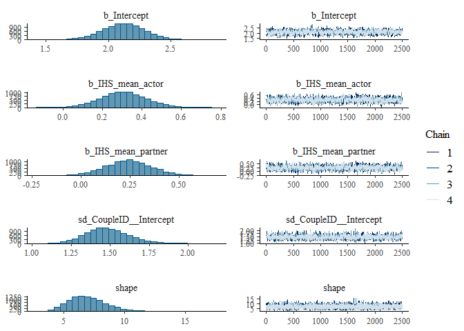<!-- -->

``` r
plot(aim1_psych_min)
```

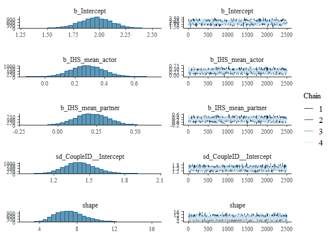<!-- -->

``` r
plot(aim1_psych_sev)
```

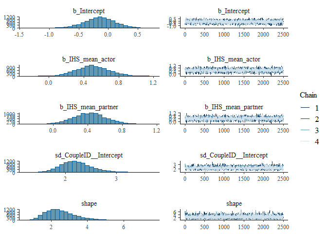<!-- -->

``` r
plot(aim1_phys)
```

<!-- -->

``` r
plot(aim1_sgm)
```

<!-- -->

Aim 1 with covariates: 


``` r
plot(aim1_psych_cov)
```

<!-- --><!-- --><!-- -->

``` r
plot(aim1_psych_cov_min)
```

<!-- --><!-- --><!-- -->

``` r
plot(aim1_psych_cov_sev)
```

<!-- --><!-- --><!-- -->

``` r
plot(aim1_phys_cov)
```

<!-- --><!-- -->

``` r
plot(aim1_sgm_cov)
```

<!-- --><!-- -->

Aim 3 - unadjusted models:


``` r
plot(aim3_psych)
```

<!-- --><!-- --><!-- --><!-- --><!-- -->

``` r
plot(aim3_psych_min)
```

<!-- --><!-- --><!-- --><!-- --><!-- -->

``` r
plot(aim3_psych_sev)
```

<!-- --><!-- --><!-- --><!-- --><!-- -->

``` r
plot(aim3_phys)
```

<!-- --><!-- --><!-- --><!-- --><!-- -->

``` r
plot(aim3_sgm)
```

<!-- --><!-- --><!-- --><!-- --><!-- -->

Aim 3 with covariates: 


``` r
plot(aim3_psych_cov)
```

<!-- --><!-- --><!-- --><!-- --><!-- --><!-- --><!-- --><!-- --><!-- --><!-- --><!-- -->

``` r
plot(aim3_psych_cov_min)
```

<!-- --><!-- --><!-- --><!-- --><!-- --><!-- --><!-- --><!-- --><!-- --><!-- --><!-- -->

``` r
plot(aim3_psych_cov_sev)
```

<!-- --><!-- --><!-- --><!-- --><!-- --><!-- --><!-- --><!-- --><!-- --><!-- --><!-- -->

``` r
plot(aim3_phys_cov)
```

<!-- --><!-- --><!-- --><!-- --><!-- --><!-- --><!-- --><!-- --><!-- --><!-- --><!-- -->

``` r
plot(aim3_sgm_cov)
```

<!-- --><!-- --><!-- --><!-- --><!-- --><!-- --><!-- --><!-- --><!-- --><!-- --><!-- -->
Fuzzy caterpillars all around, woo!

# Some other notes

It may be possible to conceptualize this as a conditional process model using Andy Hayes' language here. In his 2022 text, this would translate to:

>> W moderates the indirect effect of X on Y through its moderation of the effect of X on M

And in the context of this model, this would reflect: 

>> Discussion type moderates the indirect effect of internalized stigma on IPV perpetration through it's moderation of the effect of internalized stigma on post-discussion negative affect. 

This is fine & dandy, but preliminary analyses showed that it's difficult to estimate this b/c of the fact that our moderating factor here is a repeated measure. Therefore, we went with the parallel mediation model approach to allow for that to happen. It also allowed us to estimate the unique effects of negative affect as well. 

# Session info


``` r
sessionInfo()
```

```
## R version 4.4.3 (2025-02-28 ucrt)
## Platform: x86_64-w64-mingw32/x64
## Running under: Windows 11 x64 (build 22631)
## 
## Matrix products: default
## 
## 
## locale:
## [1] LC_COLLATE=English_United States.utf8 
## [2] LC_CTYPE=English_United States.utf8   
## [3] LC_MONETARY=English_United States.utf8
## [4] LC_NUMERIC=C                          
## [5] LC_TIME=English_United States.utf8    
## 
## time zone: America/New_York
## tzcode source: internal
## 
## attached base packages:
## [1] stats     graphics  grDevices utils     datasets  methods   base     
## 
## other attached packages:
##  [1] rstan_2.36.0.9000       StanHeaders_2.36.0.9000 see_0.11.0             
##  [4] report_0.6.1            parameters_0.24.2       performance_0.13.0     
##  [7] modelbased_0.10.0       insight_1.1.0           effectsize_1.0.0       
## [10] datawizard_1.0.2        correlation_0.8.7       bayestestR_0.15.2      
## [13] easystats_0.7.4         tidybayes_3.0.7         marginaleffects_0.25.1 
## [16] simstudy_0.8.1          cmdstanr_0.9.0          brms_2.22.0            
## [19] Rcpp_1.0.14             psych_2.5.3             sjmisc_2.8.10          
## [22] lubridate_1.9.4         forcats_1.0.0           stringr_1.5.1          
## [25] dplyr_1.1.4             purrr_1.0.4             readr_2.1.5            
## [28] tidyr_1.3.1             tibble_3.2.1            ggplot2_3.5.1          
## [31] tidyverse_2.0.0        
## 
## loaded via a namespace (and not attached):
##  [1] mnormt_2.1.1         gridExtra_2.3        inline_0.3.21       
##  [4] rlang_1.1.5          magrittr_2.0.3       snakecase_0.11.1    
##  [7] matrixStats_1.5.0    compiler_4.4.3       loo_2.8.0           
## [10] reshape2_1.4.4       vctrs_0.6.5          pkgconfig_2.0.3     
## [13] arrayhelpers_1.1-0   fastmap_1.2.0        backports_1.5.0     
## [16] labeling_0.4.3       utf8_1.2.4           rmarkdown_2.29      
## [19] tzdb_0.5.0           ps_1.9.0             xfun_0.52           
## [22] cachem_1.1.0         jsonlite_2.0.0       fastglm_0.0.3       
## [25] uuid_1.2-1           parallel_4.4.3       R6_2.6.1            
## [28] bslib_0.9.0          stringi_1.8.7        jquerylib_0.1.4     
## [31] estimability_1.5.1   knitr_1.50           bayesplot_1.11.1    
## [34] Matrix_1.7-2         timechange_0.3.0     tidyselect_1.2.1    
## [37] rstudioapi_0.17.1    abind_1.4-8          yaml_2.3.10         
## [40] codetools_0.2-20     sjlabelled_1.2.0     processx_3.8.6      
## [43] pkgbuild_1.4.7       plyr_1.8.9           lattice_0.22-6      
## [46] withr_3.0.2          bridgesampling_1.1-2 posterior_1.6.1     
## [49] coda_0.19-4.1        evaluate_1.0.3       RcppParallel_5.1.10 
## [52] ggdist_3.3.2         pillar_1.10.2        tensorA_0.36.2.1    
## [55] checkmate_2.3.2      stats4_4.4.3         distributional_0.5.0
## [58] generics_0.1.3       hms_1.1.3            rstantools_2.4.0    
## [61] munsell_0.5.1        scales_1.3.0         xtable_1.8-4        
## [64] glue_1.8.0           emmeans_1.11.0       tools_4.4.3         
## [67] data.table_1.17.0    mvtnorm_1.3-3        grid_4.4.3          
## [70] bigmemory_4.6.4      QuickJSR_1.7.0       colorspace_2.1-1    
## [73] nlme_3.1-167         cli_3.6.4            bigmemory.sri_0.1.8 
## [76] svUnit_1.0.6         Brobdingnag_1.2-9    gtable_0.3.6        
## [79] sass_0.4.9           digest_0.6.37        farver_2.1.2        
## [82] htmltools_0.5.8.1    lifecycle_1.0.4
```

