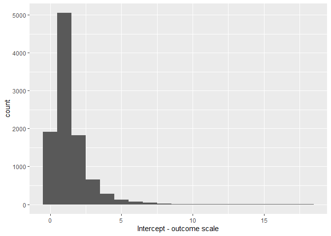
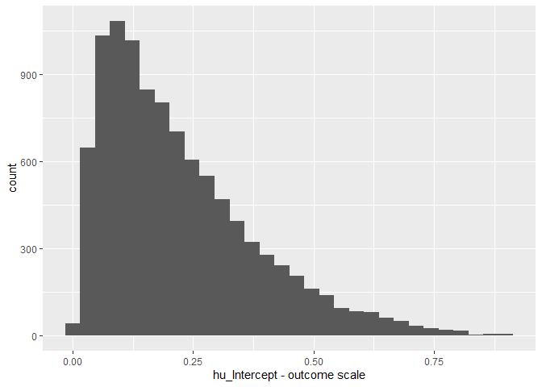
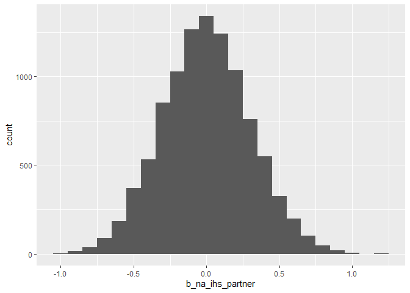
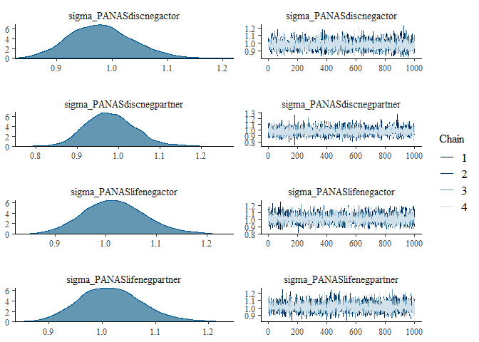
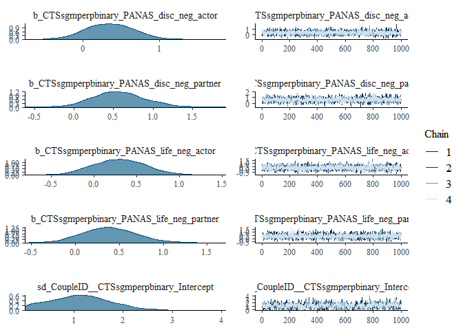
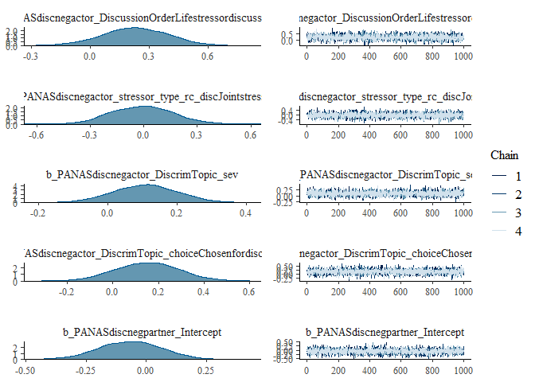
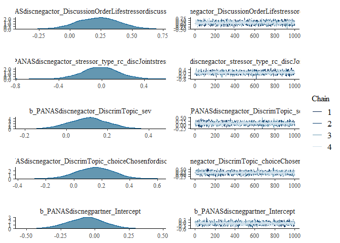
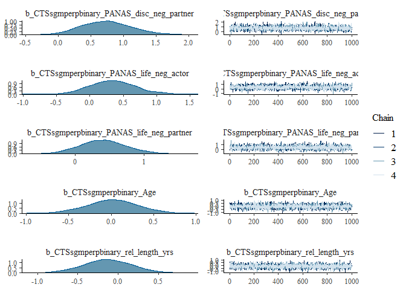

Main Analyses
================
T.J. Sullivan
2023-03-15

This document contains all of the main analyses to report for the
actor-partner interdependence models for Aims 1-3. Load packages we’ll
need:

``` r
library(tidyverse)
library(sjmisc)
library(psych)
library(brms)
library(cmdstanr)
# set options for brms to utilized cmdstanr rather than rstan default
options(mc.cores = 4,
        brms.backend = "cmdstanr")
library(simstudy)
library(marginaleffects)
library(tidybayes)
library(easystats)
```

Set options for Load the dataframe that we’ll use for these analyses
(created from data_clean_prep file).

``` r
data_clean <- readRDS("data/CCS_data_cleaned.rds")
```

# Prep for analyses

Let’s clean up the dataframe so we only have the summary variables and
relevant covaraites - we don’t need item level data for the main
analyses here.

``` r
data <- data_clean |>
  select(CoupleID, ParticipantID,
         # main variables
         IHS_mean, PANAS_disc_neg, PANAS_life_neg, CTS_phys_perp_HR, CTS_psych_perp_HR, CTS_sgm_perp_HR,
         # covariates
         Age, rel_length_yrs, sxlorx_dich, gender_three, race_dich, 
         CSI_sum, DiscussionOrder,
         GlobalCoping_rc_disc, stressor_type_rc_disc, DiscrimTopic_sev, DiscrimTopic_choice, 
         GlobalCoping_rc_life, stressor_type_rc_life, StressorTopic_sev, StressorTopic_choice,
         starts_with("missing"))
glimpse(data)
```

    ## Rows: 168
    ## Columns: 32
    ## $ CoupleID              <dbl> 1001, 1001, 1002, 1002, 1006, 1006, 1007, 1007, …
    ## $ ParticipantID         <dbl> 101, 102, 103, 104, 111, 112, 113, 114, 117, 118…
    ## $ IHS_mean              <dbl> 1.444444, 1.222222, 1.666667, 1.666667, 1.000000…
    ## $ PANAS_disc_neg        <dbl> 12, 13, 12, 11, 13, 15, 10, 12, 11, 14, 17, 13, …
    ## $ PANAS_life_neg        <dbl> 12, 15, 13, 13, 13, 16, 10, 11, 12, 10, 17, 13, …
    ## $ CTS_phys_perp_HR      <dbl> 0, 0, 0, 0, 0, 0, 0, 0, 0, 0, 0, 0, 0, 0, 0, 0, …
    ## $ CTS_psych_perp_HR     <dbl> 5, 6, 22, 22, 2, 2, 1, 4, 12, 8, 4, 2, 3, 6, 42,…
    ## $ CTS_sgm_perp_HR       <dbl> 0, 0, 0, 0, 0, 0, 0, 0, 0, 0, 0, 0, 0, 0, 0, 0, …
    ## $ Age                   <dbl> 25, 25, 30, 29, 21, 21, 24, 25, 20, 26, 21, 20, …
    ## $ rel_length_yrs        <dbl> 0.9166667, 0.9166667, 6.0000000, 6.0000000, 2.25…
    ## $ sxlorx_dich           <fct> Bi+, Bi+, Bi+, Bi+, Bi+, Bi+, Bi+, Bi+, Bi+, Mon…
    ## $ gender_three          <fct> Gender diverse, Cis woman, Cis man, Cis man, Cis…
    ## $ race_dich             <fct> Non-Hispanic White, Non-Hispanic White, BIPOC, B…
    ## $ CSI_sum               <dbl> 73, 75, 41, 37, 81, 79, 74, 75, 78, 77, 76, 78, …
    ## $ DiscussionOrder       <fct> Life stressor discussion first, Life stressor di…
    ## $ GlobalCoping_rc_disc  <dbl> 3, 3, 1, 1, 1, 1, 2, 2, 2, 2, 3, 3, 2, 2, 3, 3, …
    ## $ stressor_type_rc_disc <fct> Individual stressor, Individual stressor, Indivi…
    ## $ DiscrimTopic_sev      <dbl> 3, 3, 3, 3, 4, 4, 4, 4, 4, 4, 2, 2, 2, 2, 3, 3, …
    ## $ DiscrimTopic_choice   <fct> Chosen for discussion, NOT chosen for discussion…
    ## $ GlobalCoping_rc_life  <dbl> NA, NA, 1, 1, 2, 2, 1, 1, 1, 1, 4, 4, 1, 1, 3, 3…
    ## $ stressor_type_rc_life <fct> NA, NA, Individual stressor, Individual stressor…
    ## $ StressorTopic_sev     <dbl> 3, 3, 4, 4, 4, 4, 4, 4, 4, 4, 3, 3, 4, 4, 4, 4, …
    ## $ StressorTopic_choice  <fct> NOT chosen for discussion, Chosen for discussion…
    ## $ missing_IHS           <lgl> FALSE, FALSE, FALSE, FALSE, FALSE, FALSE, FALSE,…
    ## $ missing_CTSphys       <lgl> FALSE, FALSE, FALSE, FALSE, FALSE, FALSE, FALSE,…
    ## $ missing_CTSpsych      <lgl> FALSE, FALSE, FALSE, FALSE, FALSE, FALSE, FALSE,…
    ## $ missing_CTSsgm        <lgl> FALSE, FALSE, FALSE, FALSE, FALSE, FALSE, FALSE,…
    ## $ missing_PANASlife     <lgl> FALSE, FALSE, FALSE, FALSE, FALSE, FALSE, FALSE,…
    ## $ missing_PANASdisc     <lgl> FALSE, FALSE, FALSE, FALSE, FALSE, FALSE, FALSE,…
    ## $ missing_CSI           <lgl> FALSE, FALSE, FALSE, FALSE, FALSE, FALSE, FALSE,…
    ## $ missing_GlobalDClife  <lgl> TRUE, TRUE, FALSE, FALSE, FALSE, FALSE, FALSE, F…
    ## $ missing_GlobalDCdisc  <lgl> FALSE, FALSE, FALSE, FALSE, FALSE, FALSE, FALSE,…

Need to make IHS and PANAS into actor & partner effects. We’re going to
pull a function created based on Kenny et al.’s (2006) Doing Dyadic Data
Analyses book.

``` r
long_to_pw <- function(df, dyadid, var){
  df %>%
    group_by({{dyadid}}) %>%
    mutate("{{var}}_partner" := coalesce(lead({{var}}), lag({{var}}))) %>%
    ungroup() %>%
    rename("{{var}}_actor" := {{var}}) %>%
    relocate(ends_with("_partner"), .after = ends_with("_actor"))
}
data <- long_to_pw(data, CoupleID, IHS_mean)
data <- long_to_pw(data, CoupleID, PANAS_disc_neg)
data <- long_to_pw(data, CoupleID, PANAS_life_neg)
glimpse(data)
```

    ## Rows: 168
    ## Columns: 35
    ## $ CoupleID               <dbl> 1001, 1001, 1002, 1002, 1006, 1006, 1007, 1007,…
    ## $ ParticipantID          <dbl> 101, 102, 103, 104, 111, 112, 113, 114, 117, 11…
    ## $ IHS_mean_actor         <dbl> 1.444444, 1.222222, 1.666667, 1.666667, 1.00000…
    ## $ PANAS_disc_neg_actor   <dbl> 12, 13, 12, 11, 13, 15, 10, 12, 11, 14, 17, 13,…
    ## $ PANAS_life_neg_actor   <dbl> 12, 15, 13, 13, 13, 16, 10, 11, 12, 10, 17, 13,…
    ## $ IHS_mean_partner       <dbl> 1.222222, 1.444444, 1.666667, 1.666667, 1.22222…
    ## $ PANAS_disc_neg_partner <dbl> 13, 12, 11, 12, 15, 13, 12, 10, 14, 11, 13, 17,…
    ## $ PANAS_life_neg_partner <dbl> 15, 12, 13, 13, 16, 13, 11, 10, 10, 12, 13, 17,…
    ## $ CTS_phys_perp_HR       <dbl> 0, 0, 0, 0, 0, 0, 0, 0, 0, 0, 0, 0, 0, 0, 0, 0,…
    ## $ CTS_psych_perp_HR      <dbl> 5, 6, 22, 22, 2, 2, 1, 4, 12, 8, 4, 2, 3, 6, 42…
    ## $ CTS_sgm_perp_HR        <dbl> 0, 0, 0, 0, 0, 0, 0, 0, 0, 0, 0, 0, 0, 0, 0, 0,…
    ## $ Age                    <dbl> 25, 25, 30, 29, 21, 21, 24, 25, 20, 26, 21, 20,…
    ## $ rel_length_yrs         <dbl> 0.9166667, 0.9166667, 6.0000000, 6.0000000, 2.2…
    ## $ sxlorx_dich            <fct> Bi+, Bi+, Bi+, Bi+, Bi+, Bi+, Bi+, Bi+, Bi+, Mo…
    ## $ gender_three           <fct> Gender diverse, Cis woman, Cis man, Cis man, Ci…
    ## $ race_dich              <fct> Non-Hispanic White, Non-Hispanic White, BIPOC, …
    ## $ CSI_sum                <dbl> 73, 75, 41, 37, 81, 79, 74, 75, 78, 77, 76, 78,…
    ## $ DiscussionOrder        <fct> Life stressor discussion first, Life stressor d…
    ## $ GlobalCoping_rc_disc   <dbl> 3, 3, 1, 1, 1, 1, 2, 2, 2, 2, 3, 3, 2, 2, 3, 3,…
    ## $ stressor_type_rc_disc  <fct> Individual stressor, Individual stressor, Indiv…
    ## $ DiscrimTopic_sev       <dbl> 3, 3, 3, 3, 4, 4, 4, 4, 4, 4, 2, 2, 2, 2, 3, 3,…
    ## $ DiscrimTopic_choice    <fct> Chosen for discussion, NOT chosen for discussio…
    ## $ GlobalCoping_rc_life   <dbl> NA, NA, 1, 1, 2, 2, 1, 1, 1, 1, 4, 4, 1, 1, 3, …
    ## $ stressor_type_rc_life  <fct> NA, NA, Individual stressor, Individual stresso…
    ## $ StressorTopic_sev      <dbl> 3, 3, 4, 4, 4, 4, 4, 4, 4, 4, 3, 3, 4, 4, 4, 4,…
    ## $ StressorTopic_choice   <fct> NOT chosen for discussion, Chosen for discussio…
    ## $ missing_IHS            <lgl> FALSE, FALSE, FALSE, FALSE, FALSE, FALSE, FALSE…
    ## $ missing_CTSphys        <lgl> FALSE, FALSE, FALSE, FALSE, FALSE, FALSE, FALSE…
    ## $ missing_CTSpsych       <lgl> FALSE, FALSE, FALSE, FALSE, FALSE, FALSE, FALSE…
    ## $ missing_CTSsgm         <lgl> FALSE, FALSE, FALSE, FALSE, FALSE, FALSE, FALSE…
    ## $ missing_PANASlife      <lgl> FALSE, FALSE, FALSE, FALSE, FALSE, FALSE, FALSE…
    ## $ missing_PANASdisc      <lgl> FALSE, FALSE, FALSE, FALSE, FALSE, FALSE, FALSE…
    ## $ missing_CSI            <lgl> FALSE, FALSE, FALSE, FALSE, FALSE, FALSE, FALSE…
    ## $ missing_GlobalDClife   <lgl> TRUE, TRUE, FALSE, FALSE, FALSE, FALSE, FALSE, …
    ## $ missing_GlobalDCdisc   <lgl> FALSE, FALSE, FALSE, FALSE, FALSE, FALSE, FALSE…

Go ahead and standardized or grand-mean center continuous predictors.

``` r
center <- function(x){
  (x - mean(x, na.rm = T))
}
std <- function(x){
  (x - mean(x, na.rm = T)) / sd(x, na.rm = T)
}
data <- data |>
  mutate(across(c(GlobalCoping_rc_disc, GlobalCoping_rc_life, DiscrimTopic_sev, StressorTopic_sev), center)) |>
  mutate(across(c(Age, rel_length_yrs, CSI_sum, IHS_mean_actor, IHS_mean_partner, PANAS_disc_neg_actor, PANAS_life_neg_actor, PANAS_disc_neg_partner, PANAS_life_neg_partner), std))
```

I made the decision to standardize most variables for ease of
interpretation and to keep model estimation simpler - it is possible to
have sampling issues if you have many variables with wildly different
scales.

Create a binary outcome variable for physical and SGM-specific IPV:

``` r
data <- data |> 
  mutate(CTS_phys_perp_binary = if_else(CTS_phys_perp_HR > 0, 1, 0),
         CTS_sgm_perp_binary = if_else(CTS_sgm_perp_HR > 0, 1, 0)) |> 
  relocate(c(CTS_phys_perp_binary, CTS_sgm_perp_binary), .after = CTS_sgm_perp_HR)
```

# Model likelihood

Before we start on any of the main analyses, we need to properly specify
the likelihood to be used in `brms()` models. We’ll be utilizing a
hurdle model approach, which models both the occurrence and the
frequency of IPV perpetration. The occurrence is modeled as a logistic
regression (0/1 did it happen or not). Frequency is modeled among those
who had 1s (happened) and can be specified in as a Poisson or negative
binomial distribution. Typically, we justify Poisson vs. negative
binomial by looking at the mean & variance of the outcome variable.
Poisson is only appropriate when the mean and variance are roughly
equal. This is *not* the case for pretty much all of the variables (see
output from analyses_basic.Rmd files), so we’ll go for the negative
binomial distribution in these analyses. Before we get into any more
complex model building, let’s go ahead and run an outcomes-only model
for each type of IPV so we can see what that looks like and to build up
some of the interpretation here. We’ll do so using default priors in
`brms()` . Reported analyses will utilize informative priors based on
prior work (see below).

For future reference, here are more resources on the hurdle modeling
approach that were consulted in this: -
<https://www.andrewheiss.com/blog/2022/05/09/hurdle-lognormal-gaussian-brms/> -
For hurdle distribution functions:
<https://rdrr.io/cran/brms/man/Hurdle.html> - Marginal effects package
page that has material on processing stuff:
<https://vincentarelbundock.github.io/marginaleffects/articles/comparisons.html#ratios>

## Priors

### Default

Ok so let’s take a look at what these models look like with default
priors here. We’ll split this up by psychological and then physical &
SGM-specific IPV perpetration b/c there are vastly different rates of
zeroes across these two variables. For psych, almost everyone
perpetrated a little bit wheres for physical and SGM-specific, only
\~15% of the sample had endorsed any perpetration in the past year.
Let’s run these models:

``` r
like_psych <- brm(bf(CTS_psych_perp_HR ~ 1,
                     hu ~ 1),
                  data = data,
                  family = hurdle_negbinomial(),
                  chains = 4, iter = 2000, warmup = 1000, cores = 4,
                  seed = 1234,
                  file = "fits/like_psych",
                  file_refit = "on_change"
                  )
```

    ## Warning: Rows containing NAs were excluded from the model.

``` r
like_phys <- brm(bf(CTS_phys_perp_HR ~ 1,
                     hu ~ 1),
                  data = data,
                  family = hurdle_negbinomial(),
                  chains = 4, iter = 2000, warmup = 1000, cores = 4,
                  seed = 1234,
                  file = "fits/like_phys",
                  file_refit = "on_change"
                  )
```

    ## Warning: Rows containing NAs were excluded from the model.

``` r
like_sgm <- brm(bf(CTS_sgm_perp_HR ~ 1,
                   hu ~ 1),
                  data = data,
                  family = hurdle_negbinomial(),
                  chains = 4, iter = 2000, warmup = 1000, cores = 4,
                  seed = 1234,
                  file = "fits/like_sgm",
                  file_refit = "on_change"
                  )
```

    ## Warning: Rows containing NAs were excluded from the model.

Let’s take a look at psych IPV perpetration first. Let’s go ahead and
summarize that model here:

``` r
summary(like_psych)
```

    ##  Family: hurdle_negbinomial 
    ##   Links: mu = log; shape = identity; hu = logit 
    ## Formula: CTS_psych_perp_HR ~ 1 
    ##          hu ~ 1
    ##    Data: data (Number of observations: 164) 
    ##   Draws: 4 chains, each with iter = 2000; warmup = 1000; thin = 1;
    ##          total post-warmup draws = 4000
    ## 
    ## Population-Level Effects: 
    ##              Estimate Est.Error l-95% CI u-95% CI Rhat Bulk_ESS Tail_ESS
    ## Intercept        2.94      0.15     2.64     3.21 1.00     2466     2397
    ## hu_Intercept    -2.33      0.27    -2.88    -1.81 1.00     2876     2145
    ## 
    ## Family Specific Parameters: 
    ##       Estimate Est.Error l-95% CI u-95% CI Rhat Bulk_ESS Tail_ESS
    ## shape     0.44      0.10     0.25     0.64 1.00     2356     1792
    ## 
    ## Draws were sampled using sample(hmc). For each parameter, Bulk_ESS
    ## and Tail_ESS are effective sample size measures, and Rhat is the potential
    ## scale reduction factor on split chains (at convergence, Rhat = 1).

The Intercept population-level effect here is the negative binomial
term. This is in the log scale, which needs to be exponentiated for
interpretation. In the above model, the Intercept term is 2.94. That
would correspond to:

``` r
exp(2.94)
```

    ## [1] 18.91585

This is the “rate” for the Poisson distribution, which is just the mean
& is also called lambda. The shape parameter basically describes the
Poisson rates across each of the cases b/c we have parameterized this
model to allow for each case to have it’s own rate to account for
over-dispersion. This is not directly interpreted. hu_Intercept term is
the proportion of zeros in the data. This is in the logit scale, which
needs to be back-transformed for interpretation. In the above model, the
hu_Intercept term is -2.33. That would correspond to:

``` r
inv_logit_scaled(-2.33)
```

    ## [1] 0.08866866

Which means the estimated proportion of 0s in the data is 8.9%. That’s
not terribly far from the empirical proportion of 0s for psych IPV
perpetration (8.5%). So overall, this basic model here predicts that the
probability of no psychological IPV perpetration is 8.5% and, among
those who do perpetrate, they perpetrate an estimated 18.92 acts
(past-year).

Now let’s do this for physical:

``` r
summary(like_phys)
```

    ## Warning: There were 1 divergent transitions after warmup. Increasing
    ## adapt_delta above 0.8 may help. See
    ## http://mc-stan.org/misc/warnings.html#divergent-transitions-after-warmup

    ##  Family: hurdle_negbinomial 
    ##   Links: mu = log; shape = identity; hu = logit 
    ## Formula: CTS_phys_perp_HR ~ 1 
    ##          hu ~ 1
    ##    Data: data (Number of observations: 164) 
    ##   Draws: 4 chains, each with iter = 2000; warmup = 1000; thin = 1;
    ##          total post-warmup draws = 4000
    ## 
    ## Population-Level Effects: 
    ##              Estimate Est.Error l-95% CI u-95% CI Rhat Bulk_ESS Tail_ESS
    ## Intercept       -3.23      2.68    -9.74     0.77 1.00     1243     1045
    ## hu_Intercept     1.70      0.22     1.30     2.14 1.00     1673     1568
    ## 
    ## Family Specific Parameters: 
    ##       Estimate Est.Error l-95% CI u-95% CI Rhat Bulk_ESS Tail_ESS
    ## shape     0.00      0.01     0.00     0.03 1.00     1238     1021
    ## 
    ## Draws were sampled using sample(hmc). For each parameter, Bulk_ESS
    ## and Tail_ESS are effective sample size measures, and Rhat is the potential
    ## scale reduction factor on split chains (at convergence, Rhat = 1).

Mean/rate:

``` r
exp(-3.23)
```

    ## [1] 0.0395575

% of 0s:

``` r
plogis(1.70)
```

    ## [1] 0.8455347

We see here that the proportion of zeroes predicted by the model is
pretty close to the observed data (84%) but the mean rate of IPV is
VASTLY underestimated relative to the empirical mean here. However,
there is a HUGE range of credible values for that mean rate (range from
0 to 2.16, which is closer to the empirial mean at the tail end). What
this means is that the model is pretty uncertain about what that rate
could be, and this is likely because there is just so little data from
which to make this estimation. Further, we have a pretty severe outlier
in the couple. For now, we’re going to keep that couple in b/c, as
McElreath notes, outliers are sometimes true data to not be discarded.
We’ll do some sensitivity analyses later on to see how they influence
parameter estimation.

Note we also get a warning about a divergent transition - that’s ok for
now, there’s still rather effective sampling and we’ll make sure the
final models don’t have these.

Finally, let’s look at SGM-specific perpetration:

``` r
summary(like_sgm)
```

    ##  Family: hurdle_negbinomial 
    ##   Links: mu = log; shape = identity; hu = logit 
    ## Formula: CTS_sgm_perp_HR ~ 1 
    ##          hu ~ 1
    ##    Data: data (Number of observations: 164) 
    ##   Draws: 4 chains, each with iter = 2000; warmup = 1000; thin = 1;
    ##          total post-warmup draws = 4000
    ## 
    ## Population-Level Effects: 
    ##              Estimate Est.Error l-95% CI u-95% CI Rhat Bulk_ESS Tail_ESS
    ## Intercept       -2.47      2.89    -9.30     1.38 1.01      715      739
    ## hu_Intercept     1.84      0.22     1.40     2.29 1.00     1543     1490
    ## 
    ## Family Specific Parameters: 
    ##       Estimate Est.Error l-95% CI u-95% CI Rhat Bulk_ESS Tail_ESS
    ## shape     0.11      0.26     0.00     0.93 1.01      724      749
    ## 
    ## Draws were sampled using sample(hmc). For each parameter, Bulk_ESS
    ## and Tail_ESS are effective sample size measures, and Rhat is the potential
    ## scale reduction factor on split chains (at convergence, Rhat = 1).

Mean rate:

``` r
exp(-2.47)
```

    ## [1] 0.08458486

% of 0s:

``` r
plogis(1.84)
```

    ## [1] 0.8629487

Again, we see that the prediction of zeroes is pretty close to the
empirical data but the overall mean is pretty under-estimated relative
to the empirical means.

OK. SO. The default priors are bad. We know that they are going to have
a minimal influence on the parameter estimates and so they’re going to
rely on the data more for estimating the posterior. This is probably
fine for psychological IPV b/c we have a good amount of data there, but
this is definitely not fine for physical and SGM-specific IPV because of
the low rates of perpetration. And, regardless, we can do better b/c we
have content domain knowledge about what are reasonable bounds of the
data for these models.

One question I have is how the hurdle model works with simulated data,
so I can see whether the model actually picks up on the population
parameters that we used. It’s real possible that these models get
finicky with the physical and SGM-specific IPV perpetration estimates
b/c there is so little data. In this next section, I play around with
priors for these models.

### Simulating hurdle models

We’ll separate out these simulations b/c physical & SGM-specific IPV
would be expected to have low proportions of zeroes, whereas psych IPV
should have high proportions of zeroes. This will require some different
priors.

#### Physical & SGM-specific IPV

First, let’s see what the default priors are for these models:

``` r
prior_summary(like_phys)
```

    ##                    prior     class coef group resp dpar nlpar lb ub  source
    ##  student_t(3, -2.3, 2.5) Intercept                                  default
    ##           logistic(0, 1) Intercept                   hu             default
    ##        gamma(0.01, 0.01)     shape                             0    default

This are pretty broad, and will allow the data to have free reign on the
posterior. Let’s simulate some data from the `simstudy` package.

First, simulate some data:

``` r
# set population parameters - formula is the Intercept rate and the variance is the dispersion parameter
def <- defData(varname = "ipv", dist = "negBinomial", formula = 1, variance = 15, link = "log")

# simulate a dataset of 184 people to utilize
set.seed(12345)
dd <- genData(168, def)
```

Let’s see what that looks like

``` r
dd |> frq(ipv)
```

    ## ipv <integer> 
    ## # total N=168 valid N=168 mean=4.10 sd=14.28
    ## 
    ## Value |   N | Raw % | Valid % | Cum. %
    ## --------------------------------------
    ##     0 | 132 | 78.57 |   78.57 |  78.57
    ##     1 |   5 |  2.98 |    2.98 |  81.55
    ##     2 |   3 |  1.79 |    1.79 |  83.33
    ##     3 |   4 |  2.38 |    2.38 |  85.71
    ##     4 |   2 |  1.19 |    1.19 |  86.90
    ##     5 |   2 |  1.19 |    1.19 |  88.10
    ##     6 |   1 |  0.60 |    0.60 |  88.69
    ##     7 |   1 |  0.60 |    0.60 |  89.29
    ##     8 |   1 |  0.60 |    0.60 |  89.88
    ##    10 |   2 |  1.19 |    1.19 |  91.07
    ##    12 |   1 |  0.60 |    0.60 |  91.67
    ##    15 |   2 |  1.19 |    1.19 |  92.86
    ##    16 |   1 |  0.60 |    0.60 |  93.45
    ##    19 |   1 |  0.60 |    0.60 |  94.05
    ##    20 |   1 |  0.60 |    0.60 |  94.64
    ##    27 |   1 |  0.60 |    0.60 |  95.24
    ##    29 |   1 |  0.60 |    0.60 |  95.83
    ##    30 |   1 |  0.60 |    0.60 |  96.43
    ##    40 |   1 |  0.60 |    0.60 |  97.02
    ##    53 |   1 |  0.60 |    0.60 |  97.62
    ##    73 |   1 |  0.60 |    0.60 |  98.21
    ##    78 |   2 |  1.19 |    1.19 |  99.40
    ##   102 |   1 |  0.60 |    0.60 | 100.00
    ##  <NA> |   0 |  0.00 |    <NA> |   <NA>

``` r
ggplot(dd, aes(x = ipv)) + geom_histogram(binwidth = 1)
```

<!-- -->

Now, let’s go ahead and run the model:

``` r
sim_phys_1 <- brm(bf(ipv ~ 1,
                     hu ~ 1),
                     data = dd,
                     family = hurdle_negbinomial(),
                     chains = 4, iter = 2000, warmup = 1000, cores = 4,
                     seed = 1234,
                     file = "fits/sim_phys_1",
                     file_refit = "on_change"
                )
```

And summarize the output:

``` r
summary(sim_phys_1)
```

    ## Warning: There were 4 divergent transitions after warmup. Increasing
    ## adapt_delta above 0.8 may help. See
    ## http://mc-stan.org/misc/warnings.html#divergent-transitions-after-warmup

    ##  Family: hurdle_negbinomial 
    ##   Links: mu = log; shape = identity; hu = logit 
    ## Formula: ipv ~ 1 
    ##          hu ~ 1
    ##    Data: dd (Number of observations: 168) 
    ##   Draws: 4 chains, each with iter = 2000; warmup = 1000; thin = 1;
    ##          total post-warmup draws = 4000
    ## 
    ## Population-Level Effects: 
    ##              Estimate Est.Error l-95% CI u-95% CI Rhat Bulk_ESS Tail_ESS
    ## Intercept       -2.30      3.49   -10.74     2.68 1.01      591      515
    ## hu_Intercept     1.29      0.19     0.93     1.65 1.00     1399     1277
    ## 
    ## Family Specific Parameters: 
    ##       Estimate Est.Error l-95% CI u-95% CI Rhat Bulk_ESS Tail_ESS
    ## shape     0.03      0.08     0.00     0.30 1.00      580      513
    ## 
    ## Draws were sampled using sample(hmc). For each parameter, Bulk_ESS
    ## and Tail_ESS are effective sample size measures, and Rhat is the potential
    ## scale reduction factor on split chains (at convergence, Rhat = 1).

This result is somewhat similar to what we had with the observed data
for physical or SGM-specific IPV. In this model, we’d want to see an
Intercept around 1 because this is the population parameter that we
simulated (but we’re not getting that). In other words, when there’s
really high variance/dispersion going on here, we don’t get accurate
recovery of the mean/rate parameters in the population. It’s not even
the 95% compatibility interval, so that’s pretty severe.

Let’s also do a posterior predictive check to see how well the
model-implied predicted values correspond to the actual data.

``` r
pp_check(sim_phys_1, ndraws = 100)
```

<!-- -->

Not the worst in the world, but it’s not doing a particularly good job
here either.

Let’s take a look at what some more sensible priors would look like.
Note, for documentation here I just have the ones that I landed on but
different values can be played around with if needed.

``` r
# a is the Intercept term ON THE LOG SCALE, b is the hu_Intercept term ON THE LOG ODDS/LOGIT SCALE; we then back-transform to see what these priors imply about the observed data
set.seed(1234)
psim <- tibble(a = rnorm(1e4, mean = 0, sd = 0.8),
               b = rnorm(1e4, mean = 1.5, sd = 1)) |>
  mutate(lambda = exp(a),
         hu = inv_logit_scaled(b))
```

Let’s take a look at the Intercept term (expected mean/rate)

``` r
ggplot(psim, aes(x = a)) + geom_histogram() + xlab("Intercept - log scale")
```

    ## `stat_bin()` using `bins = 30`. Pick better value with `binwidth`.

``` r
ggplot(psim, aes(x = lambda)) + geom_histogram(binwidth = 1) + xlab("Intercept - outcome scale")
```



And the hu_Intercept term (proportion of 0s in the data)

``` r
ggplot(psim, aes(x = b)) + geom_histogram() + xlab("hu_Intercept - logit scale")
```

    ## `stat_bin()` using `bins = 30`. Pick better value with `binwidth`.

``` r
ggplot(psim, aes(x = hu)) + geom_histogram() + xlab("hu_Intercept - outcome scale")
```

    ## `stat_bin()` using `bins = 30`. Pick better value with `binwidth`.


Finally, we have the shape parameter that we want to think about. First
let’s simulate that default prior:

``` r
set.seed(1234)
psim <- psim |> 
  mutate(c = rgamma(1e4, 0.01, 0.01))
```

Then plot it:

``` r
ggplot(psim, aes(x = c)) + geom_histogram() + xlab("Shape/dispersion - gamma(0.01, 0.01)")
```

    ## `stat_bin()` using `bins = 30`. Pick better value with `binwidth`.

<!-- --> We
see here that there are plausible values that go into the 100s. Note
that this is on the scale of the data, although it’s a little weird to
interpret the parameter directly. That’s pretty wild, let’s keep it at a
more reasonable level with the weakly regularizing exponential(1) prior:

``` r
set.seed(1234)
psim <- psim |> 
  mutate(c = rexp(1e4, 1))
ggplot(psim, aes(x = c)) + geom_histogram() + xlab("Shape/dispersion - exponential(1)")
```

    ## `stat_bin()` using `bins = 30`. Pick better value with `binwidth`.

<!-- -->
That’s much more reasonable here. Wonderful!

Great, those all look pretty reasonable in terms of the mean/rate & the
probability of being a 0 & the dispersion. Let’s go ahead and re-run the
model with these priors. We’ll also place a more regularized prior on
the dispersion parameter (labeled shape) so it’s not going to go off
into the wild too much.

``` r
sim_phys_2 <- brm(bf(ipv ~ 1,
                     hu ~ 1),
                  prior = c(prior(normal(0, 0.8), class = Intercept), # prior on mean (log scale)
                            prior(normal(1.5, 1), class = Intercept, dpar = hu), # prior on odds of being 0 (logit scale)
                            prior(exponential(1), class = shape) # prior on dispersion
                  ),
                     data = dd,
                     family = hurdle_negbinomial(),
                     chains = 4, iter = 2000, warmup = 1000, cores = 4,
                     seed = 1234,
                     file = "fits/sim_phys_2",
                     file_refit = "on_change"
                )
```

And summarize the output:

``` r
summary(sim_phys_2)
```

    ##  Family: hurdle_negbinomial 
    ##   Links: mu = log; shape = identity; hu = logit 
    ## Formula: ipv ~ 1 
    ##          hu ~ 1
    ##    Data: dd (Number of observations: 168) 
    ##   Draws: 4 chains, each with iter = 2000; warmup = 1000; thin = 1;
    ##          total post-warmup draws = 4000
    ## 
    ## Population-Level Effects: 
    ##              Estimate Est.Error l-95% CI u-95% CI Rhat Bulk_ESS Tail_ESS
    ## Intercept        0.93      0.84    -0.78     2.46 1.00     1511     1686
    ## hu_Intercept     1.31      0.19     0.96     1.70 1.00     1655     1731
    ## 
    ## Family Specific Parameters: 
    ##       Estimate Est.Error l-95% CI u-95% CI Rhat Bulk_ESS Tail_ESS
    ## shape     0.07      0.08     0.01     0.30 1.00     1438     1680
    ## 
    ## Draws were sampled using sample(hmc). For each parameter, Bulk_ESS
    ## and Tail_ESS are effective sample size measures, and Rhat is the potential
    ## scale reduction factor on split chains (at convergence, Rhat = 1).

Now this is MUCH better - we see that the Intercept is roughly within
the range of the population parameter. Further, we see that the
compatibility interval around that estimate now contains the true
population parameter (1.0), which is much more encouraging. These priors
still leave some room for the data to speak to the story of what is
going on here.

Finally, let’s take a look at the posterior predictive check:

``` r
pp_check(sim_phys_2, ndraws = 100)
```

<!-- -->

That’s roughly within the bounds of the simulated data as well, although
the model does predict some potential really extreme values out in the
tails. That’s ok - that is possible in these data where you might get a
really aggressive couple or two in the sample.

#### Psych IPV

Now let’s fiddle with some data simulation where the rate of zeroes in
psych IPV is closer to 10% (vs. 80ish% for physical & SGM-specific IPV).

First, simulate some data:

``` r
# set population parameters - formula is the Intercept rate and the variance is the dispersion parameter
def <- defData(varname = "ipv", dist = "negBinomial", formula = 3, variance = 2, link = "log")

# simulate a dataset of 184 people to utilize
set.seed(12345)
dd <- genData(168, def)
```

Let’s see what that looks like

``` r
dd |> frq(ipv)
```

    ## ipv <integer> 
    ## # total N=168 valid N=168 mean=21.00 sd=27.23
    ## 
    ## Value |  N | Raw % | Valid % | Cum. %
    ## -------------------------------------
    ##     0 | 21 | 12.50 |   12.50 |  12.50
    ##     1 | 10 |  5.95 |    5.95 |  18.45
    ##     2 |  9 |  5.36 |    5.36 |  23.81
    ##     3 |  6 |  3.57 |    3.57 |  27.38
    ##     4 | 11 |  6.55 |    6.55 |  33.93
    ##     5 |  5 |  2.98 |    2.98 |  36.90
    ##     6 |  5 |  2.98 |    2.98 |  39.88
    ##     7 |  4 |  2.38 |    2.38 |  42.26
    ##     8 |  3 |  1.79 |    1.79 |  44.05
    ##     9 |  9 |  5.36 |    5.36 |  49.40
    ##    10 |  3 |  1.79 |    1.79 |  51.19
    ##    11 |  4 |  2.38 |    2.38 |  53.57
    ##    12 |  3 |  1.79 |    1.79 |  55.36
    ##    15 |  3 |  1.79 |    1.79 |  57.14
    ##    16 |  4 |  2.38 |    2.38 |  59.52
    ##    17 |  3 |  1.79 |    1.79 |  61.31
    ##    18 |  3 |  1.79 |    1.79 |  63.10
    ##    20 |  4 |  2.38 |    2.38 |  65.48
    ##    21 |  4 |  2.38 |    2.38 |  67.86
    ##    22 |  4 |  2.38 |    2.38 |  70.24
    ##    24 |  3 |  1.79 |    1.79 |  72.02
    ##    25 |  1 |  0.60 |    0.60 |  72.62
    ##    27 |  1 |  0.60 |    0.60 |  73.21
    ##    28 |  1 |  0.60 |    0.60 |  73.81
    ##    29 |  2 |  1.19 |    1.19 |  75.00
    ##    30 |  5 |  2.98 |    2.98 |  77.98
    ##    31 |  2 |  1.19 |    1.19 |  79.17
    ##    32 |  1 |  0.60 |    0.60 |  79.76
    ##    35 |  1 |  0.60 |    0.60 |  80.36
    ##    36 |  4 |  2.38 |    2.38 |  82.74
    ##    37 |  1 |  0.60 |    0.60 |  83.33
    ##    38 |  2 |  1.19 |    1.19 |  84.52
    ##    39 |  2 |  1.19 |    1.19 |  85.71
    ##    41 |  1 |  0.60 |    0.60 |  86.31
    ##    48 |  1 |  0.60 |    0.60 |  86.90
    ##    49 |  1 |  0.60 |    0.60 |  87.50
    ##    51 |  1 |  0.60 |    0.60 |  88.10
    ##    52 |  1 |  0.60 |    0.60 |  88.69
    ##    53 |  1 |  0.60 |    0.60 |  89.29
    ##    54 |  1 |  0.60 |    0.60 |  89.88
    ##    57 |  1 |  0.60 |    0.60 |  90.48
    ##    61 |  1 |  0.60 |    0.60 |  91.07
    ##    64 |  1 |  0.60 |    0.60 |  91.67
    ##    65 |  1 |  0.60 |    0.60 |  92.26
    ##    74 |  1 |  0.60 |    0.60 |  92.86
    ##    75 |  1 |  0.60 |    0.60 |  93.45
    ##    76 |  1 |  0.60 |    0.60 |  94.05
    ##    80 |  1 |  0.60 |    0.60 |  94.64
    ##    83 |  1 |  0.60 |    0.60 |  95.24
    ##    87 |  2 |  1.19 |    1.19 |  96.43
    ##    92 |  1 |  0.60 |    0.60 |  97.02
    ##   102 |  1 |  0.60 |    0.60 |  97.62
    ##   111 |  1 |  0.60 |    0.60 |  98.21
    ##   124 |  1 |  0.60 |    0.60 |  98.81
    ##   127 |  1 |  0.60 |    0.60 |  99.40
    ##   137 |  1 |  0.60 |    0.60 | 100.00
    ##  <NA> |  0 |  0.00 |    <NA> |   <NA>

``` r
ggplot(dd, aes(x = ipv)) + geom_histogram(binwidth = 1)
```

<!-- -->

Now, let’s go ahead and run the model:

``` r
sim_psych_1 <- brm(bf(ipv ~ 1,
                     hu ~ 1),
                     data = dd,
                     family = hurdle_negbinomial(),
                     chains = 4, iter = 2000, warmup = 1000, cores = 4,
                     seed = 1234,
                     file = "fits/sim_psych_1",
                     file_refit = "on_change"
                )
```

And summarize the output:

``` r
summary(sim_psych_1)
```

    ##  Family: hurdle_negbinomial 
    ##   Links: mu = log; shape = identity; hu = logit 
    ## Formula: ipv ~ 1 
    ##          hu ~ 1
    ##    Data: dd (Number of observations: 168) 
    ##   Draws: 4 chains, each with iter = 2000; warmup = 1000; thin = 1;
    ##          total post-warmup draws = 4000
    ## 
    ## Population-Level Effects: 
    ##              Estimate Est.Error l-95% CI u-95% CI Rhat Bulk_ESS Tail_ESS
    ## Intercept        3.04      0.12     2.80     3.27 1.00     2886     1985
    ## hu_Intercept    -1.93      0.23    -2.41    -1.51 1.00     2964     2485
    ## 
    ## Family Specific Parameters: 
    ##       Estimate Est.Error l-95% CI u-95% CI Rhat Bulk_ESS Tail_ESS
    ## shape     0.58      0.11     0.37     0.82 1.00     3023     2343
    ## 
    ## Draws were sampled using sample(hmc). For each parameter, Bulk_ESS
    ## and Tail_ESS are effective sample size measures, and Rhat is the potential
    ## scale reduction factor on split chains (at convergence, Rhat = 1).

We see here that, UNLIKE the physical & SGM-specific IPV, the default
priors do a much better job in this model. We see parameter estimates
that are roughly equivalent to the population parameters that we
simulated here. Let’s see how the posterior predictive check fairs:

``` r
pp_check(sim_psych_1, ndraws = 100)
```

<!-- -->

Not too shabby here!

Still, we want to make sure that we have reasoned priors that
incorporate our domain knowledge about psych IPV perpetration into the
model (rather than just based on the data at hand).

``` r
# a is the Intercept term ON THE LOG SCALE, b is the hu_Intercept term ON THE LOG ODDS/LOGIT SCALE; we then back-transform to see what these priors imply about the observed data
set.seed(1234)
psim <- tibble(a = rnorm(1e4, mean = 1, sd = 0.5),
               b = rnorm(1e4, mean = -1.5, sd = 1)) |>
  mutate(lambda = exp(a),
         hu = inv_logit_scaled(b))
```

Let’s take a look at the Intercept term (expected mean/rate)

``` r
ggplot(psim, aes(x = a)) + geom_histogram() + xlab("Intercept - log scale")
```

    ## `stat_bin()` using `bins = 30`. Pick better value with `binwidth`.

``` r
ggplot(psim, aes(x = lambda)) + geom_histogram(binwidth = 1) + xlab("Intercept - outcome scale")
```


And the hu_Intercept term (proportion of 0s in the data)

``` r
ggplot(psim, aes(x = b)) + geom_histogram() + xlab("hu_Intercept - logit scale")
```

    ## `stat_bin()` using `bins = 30`. Pick better value with `binwidth`.

``` r
ggplot(psim, aes(x = hu)) + geom_histogram() + xlab("hu_Intercept - outcome scale")
```

    ## `stat_bin()` using `bins = 30`. Pick better value with `binwidth`.



Now let’s re-run the model with those priors:

``` r
sim_psych_2 <- brm(bf(ipv ~ 1,
                      hu ~ 1),
                  prior = c(prior(normal(1, 0.5), class = Intercept), # prior on mean (log scale)
                            prior(normal(-1.5, 1), class = Intercept, dpar = hu), # prior on odds of being 0 (logit scale)
                            prior(exponential(1), class = shape) # prior on dispersion
                  ),
                     data = dd,
                     family = hurdle_negbinomial(),
                     chains = 4, iter = 2000, warmup = 1000, cores = 4,
                     seed = 1234,
                     file = "fits/sim_psych_2",
                     file_refit = "on_change"
                )
```

Summarize:

``` r
summary(sim_psych_2)
```

    ##  Family: hurdle_negbinomial 
    ##   Links: mu = log; shape = identity; hu = logit 
    ## Formula: ipv ~ 1 
    ##          hu ~ 1
    ##    Data: dd (Number of observations: 168) 
    ##   Draws: 4 chains, each with iter = 2000; warmup = 1000; thin = 1;
    ##          total post-warmup draws = 4000
    ## 
    ## Population-Level Effects: 
    ##              Estimate Est.Error l-95% CI u-95% CI Rhat Bulk_ESS Tail_ESS
    ## Intercept        2.93      0.13     2.65     3.16 1.00     2018     1305
    ## hu_Intercept    -1.94      0.22    -2.39    -1.50 1.00     2612     2593
    ## 
    ## Family Specific Parameters: 
    ##       Estimate Est.Error l-95% CI u-95% CI Rhat Bulk_ESS Tail_ESS
    ## shape     0.54      0.12     0.32     0.78 1.00     1699     1470
    ## 
    ## Draws were sampled using sample(hmc). For each parameter, Bulk_ESS
    ## and Tail_ESS are effective sample size measures, and Rhat is the potential
    ## scale reduction factor on split chains (at convergence, Rhat = 1).

It’s really not that different from the original, default priors. This
is good! It might not matter for this basic, intercept-only model that
doesn’t account for nesting but it might in future models as we get more
complex here. Let’s check out the posterior predictive check as well:

``` r
pp_check(sim_psych_2, ndraws = 100)
```

<!-- -->

Also doing a really nice job here still!

One thing to note for your future self is that the Intercept parameter
in these hurdle models seems to correspond to the OVERALL mean in the
data. It’s not necessarily picking up on the mean of those who are \> 0.

### Informative

Now that we’ve specified some priors, let’s re-run the basic models from
before with these priors in place.

``` r
like_psych_1 <- brm(bf(CTS_psych_perp_HR ~ 1,
                     hu ~ 1),
                  prior = c(prior(normal(1, 0.5), class = Intercept), # prior on mean (log scale)
                            prior(normal(-1.5, 1), class = Intercept, dpar = hu), # prior on odds of being 0 (logit scale)
                            prior(exponential(1), class = shape) # prior on dispersion
                  ),
                  data = data,
                  family = hurdle_negbinomial(),
                  chains = 4, iter = 2000, warmup = 1000, cores = 4,
                  seed = 1234,
                  file = "fits/like_psych_1",
                  file_refit = "on_change"
                  )
```

    ## Warning: Rows containing NAs were excluded from the model.

``` r
like_phys_1 <- brm(bf(CTS_phys_perp_HR ~ 1,
                     hu ~ 1),
                  prior = c(prior(normal(0, 0.8), class = Intercept), # prior on mean (log scale)
                            prior(normal(1.5, 1), class = Intercept, dpar = hu), # prior on odds of being 0 (logit scale)
                            prior(exponential(1), class = shape) # prior on dispersion
                  ),
                 data = data,
                  family = hurdle_negbinomial(),
                  chains = 4, iter = 2000, warmup = 1000, cores = 4,
                  seed = 1234,
                  file = "fits/like_phys_1",
                  file_refit = "on_change"
                  )
```

    ## Warning: Rows containing NAs were excluded from the model.

``` r
like_sgm_1 <- brm(bf(CTS_sgm_perp_HR ~ 1,
                   hu ~ 1),
                  prior = c(prior(normal(0, 0.8), class = Intercept), # prior on mean (log scale)
                            prior(normal(1.5, 1), class = Intercept, dpar = hu), # prior on odds of being 0 (logit scale)
                            prior(exponential(1), class = shape) # prior on dispersion
                  ),
                data = data,
                  family = hurdle_negbinomial(),
                  chains = 4, iter = 2000, warmup = 1000, cores = 4,
                  seed = 1234,
                  file = "fits/like_sgm_1",
                  file_refit = "on_change"
                  )
```

    ## Warning: Rows containing NAs were excluded from the model.

Now let’s summarize. Psychological:

``` r
summary(like_psych_1)
```

    ##  Family: hurdle_negbinomial 
    ##   Links: mu = log; shape = identity; hu = logit 
    ## Formula: CTS_psych_perp_HR ~ 1 
    ##          hu ~ 1
    ##    Data: data (Number of observations: 164) 
    ##   Draws: 4 chains, each with iter = 2000; warmup = 1000; thin = 1;
    ##          total post-warmup draws = 4000
    ## 
    ## Population-Level Effects: 
    ##              Estimate Est.Error l-95% CI u-95% CI Rhat Bulk_ESS Tail_ESS
    ## Intercept        2.78      0.20     2.31     3.09 1.00     1383      876
    ## hu_Intercept    -2.33      0.26    -2.88    -1.84 1.00     2071     1831
    ## 
    ## Family Specific Parameters: 
    ##       Estimate Est.Error l-95% CI u-95% CI Rhat Bulk_ESS Tail_ESS
    ## shape     0.39      0.11     0.16     0.61 1.00     1485      943
    ## 
    ## Draws were sampled using sample(hmc). For each parameter, Bulk_ESS
    ## and Tail_ESS are effective sample size measures, and Rhat is the potential
    ## scale reduction factor on split chains (at convergence, Rhat = 1).

Physical:

``` r
summary(like_phys_1)
```

    ##  Family: hurdle_negbinomial 
    ##   Links: mu = log; shape = identity; hu = logit 
    ## Formula: CTS_phys_perp_HR ~ 1 
    ##          hu ~ 1
    ##    Data: data (Number of observations: 164) 
    ##   Draws: 4 chains, each with iter = 2000; warmup = 1000; thin = 1;
    ##          total post-warmup draws = 4000
    ## 
    ## Population-Level Effects: 
    ##              Estimate Est.Error l-95% CI u-95% CI Rhat Bulk_ESS Tail_ESS
    ## Intercept        0.33      0.68    -1.10     1.56 1.00     1732     2029
    ## hu_Intercept     1.72      0.21     1.32     2.15 1.00     2263     2174
    ## 
    ## Family Specific Parameters: 
    ##       Estimate Est.Error l-95% CI u-95% CI Rhat Bulk_ESS Tail_ESS
    ## shape     0.03      0.03     0.00     0.10 1.00     1639     1848
    ## 
    ## Draws were sampled using sample(hmc). For each parameter, Bulk_ESS
    ## and Tail_ESS are effective sample size measures, and Rhat is the potential
    ## scale reduction factor on split chains (at convergence, Rhat = 1).

SGM-specific:

``` r
summary(like_sgm_1)
```

    ##  Family: hurdle_negbinomial 
    ##   Links: mu = log; shape = identity; hu = logit 
    ## Formula: CTS_sgm_perp_HR ~ 1 
    ##          hu ~ 1
    ##    Data: data (Number of observations: 164) 
    ##   Draws: 4 chains, each with iter = 2000; warmup = 1000; thin = 1;
    ##          total post-warmup draws = 4000
    ## 
    ## Population-Level Effects: 
    ##              Estimate Est.Error l-95% CI u-95% CI Rhat Bulk_ESS Tail_ESS
    ## Intercept        0.59      0.58    -0.75     1.50 1.01     1293     1405
    ## hu_Intercept     1.87      0.22     1.43     2.32 1.00     2129     1788
    ## 
    ## Family Specific Parameters: 
    ##       Estimate Est.Error l-95% CI u-95% CI Rhat Bulk_ESS Tail_ESS
    ## shape     0.39      0.34     0.04     1.29 1.01     1317     1457
    ## 
    ## Draws were sampled using sample(hmc). For each parameter, Bulk_ESS
    ## and Tail_ESS are effective sample size measures, and Rhat is the potential
    ## scale reduction factor on split chains (at convergence, Rhat = 1).

Now we see that the intervals for all of these models are much tighter
and within the bounds of the data. Just for curiosity, let’s see what
the posterior predictive checks show.

Psychological:

``` r
pp_check(like_psych_1, ndraws = 100)
```

<!-- -->

Physical:

``` r
pp_check(like_phys_1, ndraws = 100)
```

<!-- -->

SGM_specific:

``` r
pp_check(like_sgm_1, ndraws = 100)
```

<!-- -->

Not too terrible there with any of these! Physical is the least similar,
but not that the wide range is likely because of the one couple (1082)
with a very large number of physical acts (213) so it’s going to show on
the y-axis there.

Up to now, we’ve been ignoring the non-independence that is introduced
by couple nesting. This is absolutely something we are going to have to
model, so now let’s turn to how we can set some sensible priors when we
account for dyad-level variation in estimated odds of being a 0 and
mean/rates of IPV perpetraton frequency.

### Couple nesting

Let’s see what happens when we account for dyadic interdependence. We’ll
leave the default prior on intercept variation in these models to see
what that looks like.

``` r
like_psych_2 <- brm(bf(CTS_psych_perp_HR ~ 0 + Intercept + (1 | CoupleID),
                     hu ~ 0 + Intercept+ (1 | CoupleID)),
                  prior = c(prior(normal(1, 0.5), class = b, coef = Intercept), # prior on mean (log scale)
                            prior(normal(-1.5, 1), class = b, coef = Intercept, dpar = hu), # prior on odds of being 0 (logit scale)
                            prior(exponential(1), class = shape) # prior on dispersion
                  ),
                  data = data,
                  family = hurdle_negbinomial(),
                  chains = 4, iter = 2000, warmup = 1000, cores = 4,
                  seed = 1234,
                  file = "fits/like_psych_2",
                  file_refit = "on_change"
                  )
```

    ## Warning: Rows containing NAs were excluded from the model.

``` r
like_phys_2 <- brm(bf(CTS_phys_perp_HR ~ 0 + Intercept+ (1 | CoupleID),
                     hu ~ 0 + Intercept+ (1 | CoupleID)),
                  prior = c(prior(normal(0, 0.8), class = b, coef = Intercept), # prior on mean (log scale)
                            prior(normal(1.5, 1), class = b, coef = Intercept, dpar = hu), # prior on odds of being 0 (logit scale)
                            prior(exponential(1), class = shape) # prior on dispersion
                  ),
                 data = data,
                  family = hurdle_negbinomial(),
                  chains = 4, iter = 2000, warmup = 1000, cores = 4,
                  seed = 1234,
                  file = "fits/like_phys_2",
                  file_refit = "on_change"
                  )
```

    ## Warning: Rows containing NAs were excluded from the model.

``` r
like_sgm_2 <- brm(bf(CTS_sgm_perp_HR ~ 0 + Intercept + (1 | CoupleID),
                   hu ~ 0 + Intercept + (1 | CoupleID)),
                  prior = c(prior(normal(0, 0.8), class = b, coef = Intercept), # prior on mean (log scale)
                            prior(normal(1.5, 1), class = b, coef = Intercept, dpar = hu), # prior on odds of being 0 (logit scale)
                            prior(exponential(1), class = shape) # prior on dispersion
                  ),
                data = data,
                  family = hurdle_negbinomial(),
                  chains = 4, iter = 2000, warmup = 1000, cores = 4,
                  seed = 1234,
                  file = "fits/like_sgm_2",
                  file_refit = "on_change"
                  )
```

    ## Warning: Rows containing NAs were excluded from the model.

Now let’s summarize & look at the posterior predictive checks for each
model. Starting with psychological:

``` r
summary(like_psych_2)
```

    ##  Family: hurdle_negbinomial 
    ##   Links: mu = log; shape = identity; hu = logit 
    ## Formula: CTS_psych_perp_HR ~ 0 + Intercept + (1 | CoupleID) 
    ##          hu ~ 0 + Intercept + (1 | CoupleID)
    ##    Data: data (Number of observations: 164) 
    ##   Draws: 4 chains, each with iter = 2000; warmup = 1000; thin = 1;
    ##          total post-warmup draws = 4000
    ## 
    ## Group-Level Effects: 
    ## ~CoupleID (Number of levels: 82) 
    ##                  Estimate Est.Error l-95% CI u-95% CI Rhat Bulk_ESS Tail_ESS
    ## sd(Intercept)        1.41      0.14     1.16     1.70 1.01      627     1288
    ## sd(hu_Intercept)     2.00      0.71     0.38     3.41 1.02      296       66
    ## 
    ## Population-Level Effects: 
    ##              Estimate Est.Error l-95% CI u-95% CI Rhat Bulk_ESS Tail_ESS
    ## Intercept        2.26      0.16     1.94     2.57 1.01      505      898
    ## hu_Intercept    -3.38      0.60    -4.59    -2.27 1.01      533      194
    ## 
    ## Family Specific Parameters: 
    ##       Estimate Est.Error l-95% CI u-95% CI Rhat Bulk_ESS Tail_ESS
    ## shape     6.87      1.60     4.22    10.58 1.00     2462     2694
    ## 
    ## Draws were sampled using sample(hmc). For each parameter, Bulk_ESS
    ## and Tail_ESS are effective sample size measures, and Rhat is the potential
    ## scale reduction factor on split chains (at convergence, Rhat = 1).

& PPC:

``` r
pp_check(like_psych_2, ndraws = 100)
```

<!-- -->

Physical:

``` r
summary(like_phys_2)
```

    ##  Family: hurdle_negbinomial 
    ##   Links: mu = log; shape = identity; hu = logit 
    ## Formula: CTS_phys_perp_HR ~ 0 + Intercept + (1 | CoupleID) 
    ##          hu ~ 0 + Intercept + (1 | CoupleID)
    ##    Data: data (Number of observations: 164) 
    ##   Draws: 4 chains, each with iter = 2000; warmup = 1000; thin = 1;
    ##          total post-warmup draws = 4000
    ## 
    ## Group-Level Effects: 
    ## ~CoupleID (Number of levels: 82) 
    ##                  Estimate Est.Error l-95% CI u-95% CI Rhat Bulk_ESS Tail_ESS
    ## sd(Intercept)        2.64      0.81     1.50     4.60 1.00     2112     2775
    ## sd(hu_Intercept)     3.55      0.88     2.11     5.56 1.00     2551     2661
    ## 
    ## Population-Level Effects: 
    ##              Estimate Est.Error l-95% CI u-95% CI Rhat Bulk_ESS Tail_ESS
    ## Intercept        0.08      0.58    -1.14     1.16 1.00     3480     3075
    ## hu_Intercept     3.47      0.61     2.37     4.79 1.00     4611     3346
    ## 
    ## Family Specific Parameters: 
    ##       Estimate Est.Error l-95% CI u-95% CI Rhat Bulk_ESS Tail_ESS
    ## shape     1.60      1.11     0.15     4.35 1.00     1819     2103
    ## 
    ## Draws were sampled using sample(hmc). For each parameter, Bulk_ESS
    ## and Tail_ESS are effective sample size measures, and Rhat is the potential
    ## scale reduction factor on split chains (at convergence, Rhat = 1).

& PPC:

``` r
pp_check(like_phys_2, ndraws = 100)
```

<!-- -->

SGM-specific:

``` r
summary(like_sgm_2, ndraws = 100)
```

    ##  Family: hurdle_negbinomial 
    ##   Links: mu = log; shape = identity; hu = logit 
    ## Formula: CTS_sgm_perp_HR ~ 0 + Intercept + (1 | CoupleID) 
    ##          hu ~ 0 + Intercept + (1 | CoupleID)
    ##    Data: data (Number of observations: 164) 
    ##   Draws: 4 chains, each with iter = 2000; warmup = 1000; thin = 1;
    ##          total post-warmup draws = 4000
    ## 
    ## Group-Level Effects: 
    ## ~CoupleID (Number of levels: 82) 
    ##                  Estimate Est.Error l-95% CI u-95% CI Rhat Bulk_ESS Tail_ESS
    ## sd(Intercept)        1.07      0.50     0.14     2.17 1.00     1115     1487
    ## sd(hu_Intercept)     2.28      0.68     1.06     3.76 1.00     1203      970
    ## 
    ## Population-Level Effects: 
    ##              Estimate Est.Error l-95% CI u-95% CI Rhat Bulk_ESS Tail_ESS
    ## Intercept        0.68      0.46    -0.38     1.44 1.00     3469     2706
    ## hu_Intercept     2.95      0.54     1.98     4.12 1.00     2060     1611
    ## 
    ## Family Specific Parameters: 
    ##       Estimate Est.Error l-95% CI u-95% CI Rhat Bulk_ESS Tail_ESS
    ## shape     1.47      1.26     0.10     4.70 1.00     1302     2265
    ## 
    ## Draws were sampled using sample(hmc). For each parameter, Bulk_ESS
    ## and Tail_ESS are effective sample size measures, and Rhat is the potential
    ## scale reduction factor on split chains (at convergence, Rhat = 1).

& PPC:

``` r
pp_check(like_sgm_2, ndraws = 100)
```

<!-- -->

Ok so we see here that the default prior is pretty ok for psych IPV,
although that model did not sample super well. The default priors for
physical and SGM-specific IPV, however, are pretty wild. Because of the
introduction of the variability around the Intercept and hu_Intercept,
the model estimates a WIDE range of values based on each couple. Because
we’re working on log scales here, that can escalate pretty quickly. For
example, the physical IPV perp model has some plausible predicted mean
rates of IPV in the 5000s. We’ll need to think of a more restrictive
prior (i.e. a regularizing one) for the standard deviation terms so
these models don’t get too out of hand with the limited data.

One rather weakly regularizing prior for standard deviation parameters
is the Exponential(1) prior. Let’s see what that looks like:

``` r
set.seed(1234)
psim <- psim |> 
  mutate(exp = rexp(1e4, 1)) 
ggplot(psim, aes(x = exp)) + geom_histogram()
```

    ## `stat_bin()` using `bins = 30`. Pick better value with `binwidth`.

<!-- --> Here,
we see that the expected values of the standard deviation around the
intercept terms are in the lower end, with the majority of the probable
values between 0 and 2. This is still a *very* permissive prior here b/c
this is on the log scale. Let’s see if we regularize that more
substantially with the exponential(4).

``` r
set.seed(1234)
psim <- psim |> 
  mutate(exp = rexp(1e4, 4)) 
ggplot(psim, aes(x = exp)) + geom_histogram()
```

    ## `stat_bin()` using `bins = 30`. Pick better value with `binwidth`.

<!-- --> This
places the majority of values below 1, but still allows for greater
values here. Let’s see what happens if we re-run these models with the
more aggressive exponential(4) prior for the standard deviation terms.

``` r
like_psych_3 <- brm(bf(CTS_psych_perp_HR ~ 0 + Intercept + (1 | CoupleID),
                     hu ~ 0 + Intercept+ (1 | CoupleID)),
                  prior = c(prior(normal(1, 0.5), class = b, coef = Intercept), # prior on mean (log scale)
                            prior(normal(-1.5, 1), class = b, coef = Intercept, dpar = hu), # prior on odds of being 0 (logit scale)
                            prior(exponential(4), class = sd), # prior on couple variability
                            prior(exponential(1), class = shape) # prior on dispersion
                  ),
                  data = data,
                  family = hurdle_negbinomial(),
                  chains = 4, iter = 2000, warmup = 1000, cores = 4,
                  seed = 1234,
                  file = "fits/like_psych_3",
                  file_refit = "on_change"
                  )
```

    ## Warning: Rows containing NAs were excluded from the model.

``` r
like_phys_3 <- brm(bf(CTS_phys_perp_HR ~ 0 + Intercept+ (1 | CoupleID),
                     hu ~ 0 + Intercept+ (1 | CoupleID)),
                  prior = c(prior(normal(0, 0.8), class = b, coef = Intercept), # prior on mean (log scale)
                            prior(normal(1.5, 1), class = b, coef = Intercept, dpar = hu), # prior on odds of being 0 (logit scale)
                            prior(exponential(4), class = sd), # prior on couple variability
                            prior(exponential(1), class = shape) # prior on dispersion
                  ),
                 data = data,
                  family = hurdle_negbinomial(),
                  chains = 4, iter = 2000, warmup = 1000, cores = 4,
                  seed = 1234,
                  file = "fits/like_phys_3",
                  file_refit = "on_change"
                  )
```

    ## Warning: Rows containing NAs were excluded from the model.

``` r
like_sgm_3 <- brm(bf(CTS_sgm_perp_HR ~ 0 + Intercept + (1 | CoupleID),
                   hu ~ 0 + Intercept + (1 | CoupleID)),
                  prior = c(prior(normal(0, 0.8), class = b, coef = Intercept), # prior on mean (log scale)
                            prior(normal(1.5, 1), class = b, coef = Intercept, dpar = hu), # prior on odds of being 0 (logit scale)
                            prior(exponential(4), class = sd), # prior on couple variability
                            prior(exponential(1), class = shape) # prior on dispersion
                  ),
                data = data,
                  family = hurdle_negbinomial(),
                  chains = 4, iter = 2000, warmup = 1000, cores = 4,
                  seed = 1234,
                  file = "fits/like_sgm_3",
                  file_refit = "on_change"
                  )
```

    ## Warning: Rows containing NAs were excluded from the model.

Now let’s summarize & look at the posterior predictive checks for each
model. Starting with psychological:

``` r
summary(like_psych_3)
```

    ##  Family: hurdle_negbinomial 
    ##   Links: mu = log; shape = identity; hu = logit 
    ## Formula: CTS_psych_perp_HR ~ 0 + Intercept + (1 | CoupleID) 
    ##          hu ~ 0 + Intercept + (1 | CoupleID)
    ##    Data: data (Number of observations: 164) 
    ##   Draws: 4 chains, each with iter = 2000; warmup = 1000; thin = 1;
    ##          total post-warmup draws = 4000
    ## 
    ## Group-Level Effects: 
    ## ~CoupleID (Number of levels: 82) 
    ##                  Estimate Est.Error l-95% CI u-95% CI Rhat Bulk_ESS Tail_ESS
    ## sd(Intercept)        1.33      0.13     1.11     1.60 1.00      693     1530
    ## sd(hu_Intercept)     2.00      0.65     0.81     3.41 1.00     1288     1312
    ## 
    ## Population-Level Effects: 
    ##              Estimate Est.Error l-95% CI u-95% CI Rhat Bulk_ESS Tail_ESS
    ## Intercept        2.28      0.16     1.96     2.58 1.01      578      838
    ## hu_Intercept    -3.37      0.58    -4.63    -2.36 1.00     1901     2130
    ## 
    ## Family Specific Parameters: 
    ##       Estimate Est.Error l-95% CI u-95% CI Rhat Bulk_ESS Tail_ESS
    ## shape     6.87      1.61     4.16    10.40 1.00     2092     2665
    ## 
    ## Draws were sampled using sample(hmc). For each parameter, Bulk_ESS
    ## and Tail_ESS are effective sample size measures, and Rhat is the potential
    ## scale reduction factor on split chains (at convergence, Rhat = 1).

& PPC:

``` r
pp_check(like_psych_3, ndraws = 100)
```

<!-- -->

Physical:

``` r
summary(like_phys_3)
```

    ##  Family: hurdle_negbinomial 
    ##   Links: mu = log; shape = identity; hu = logit 
    ## Formula: CTS_phys_perp_HR ~ 0 + Intercept + (1 | CoupleID) 
    ##          hu ~ 0 + Intercept + (1 | CoupleID)
    ##    Data: data (Number of observations: 164) 
    ##   Draws: 4 chains, each with iter = 2000; warmup = 1000; thin = 1;
    ##          total post-warmup draws = 4000
    ## 
    ## Group-Level Effects: 
    ## ~CoupleID (Number of levels: 82) 
    ##                  Estimate Est.Error l-95% CI u-95% CI Rhat Bulk_ESS Tail_ESS
    ## sd(Intercept)        1.66      0.39     0.99     2.51 1.00     1434     1068
    ## sd(hu_Intercept)     3.57      0.89     2.12     5.61 1.00     1418     2671
    ## 
    ## Population-Level Effects: 
    ##              Estimate Est.Error l-95% CI u-95% CI Rhat Bulk_ESS Tail_ESS
    ## Intercept        0.37      0.49    -0.63     1.29 1.00     2161     2975
    ## hu_Intercept     3.48      0.62     2.37     4.76 1.00     2568     3063
    ## 
    ## Family Specific Parameters: 
    ##       Estimate Est.Error l-95% CI u-95% CI Rhat Bulk_ESS Tail_ESS
    ## shape     1.57      1.12     0.11     4.30 1.00     1150      762
    ## 
    ## Draws were sampled using sample(hmc). For each parameter, Bulk_ESS
    ## and Tail_ESS are effective sample size measures, and Rhat is the potential
    ## scale reduction factor on split chains (at convergence, Rhat = 1).

& PPC:

``` r
pp_check(like_phys_3, ndraws = 100)
```

<!-- -->

SGM-specific:

``` r
summary(like_sgm_3, ndraws = 100)
```

    ## Warning: There were 3 divergent transitions after warmup. Increasing
    ## adapt_delta above 0.8 may help. See
    ## http://mc-stan.org/misc/warnings.html#divergent-transitions-after-warmup

    ##  Family: hurdle_negbinomial 
    ##   Links: mu = log; shape = identity; hu = logit 
    ## Formula: CTS_sgm_perp_HR ~ 0 + Intercept + (1 | CoupleID) 
    ##          hu ~ 0 + Intercept + (1 | CoupleID)
    ##    Data: data (Number of observations: 164) 
    ##   Draws: 4 chains, each with iter = 2000; warmup = 1000; thin = 1;
    ##          total post-warmup draws = 4000
    ## 
    ## Group-Level Effects: 
    ## ~CoupleID (Number of levels: 82) 
    ##                  Estimate Est.Error l-95% CI u-95% CI Rhat Bulk_ESS Tail_ESS
    ## sd(Intercept)        0.39      0.33     0.01     1.18 1.00     1237     2129
    ## sd(hu_Intercept)     2.32      0.66     1.15     3.73 1.00     1108     1276
    ## 
    ## Population-Level Effects: 
    ##              Estimate Est.Error l-95% CI u-95% CI Rhat Bulk_ESS Tail_ESS
    ## Intercept        0.68      0.53    -0.61     1.48 1.00     2558     1803
    ## hu_Intercept     2.98      0.54     2.01     4.13 1.00     1801     1764
    ## 
    ## Family Specific Parameters: 
    ##       Estimate Est.Error l-95% CI u-95% CI Rhat Bulk_ESS Tail_ESS
    ## shape     0.77      0.90     0.05     3.26 1.00     1189     1819
    ## 
    ## Draws were sampled using sample(hmc). For each parameter, Bulk_ESS
    ## and Tail_ESS are effective sample size measures, and Rhat is the potential
    ## scale reduction factor on split chains (at convergence, Rhat = 1).

& PPC:

``` r
pp_check(like_sgm_3, ndraws = 100)
```

<!-- -->

We still see that it’s not the most effective sampling for psychological
IPV. We still have some pretty wild posterior predicted values for
physical IPV (it just moved from the 5000s to the 2000s in terms of the
range of the x-axis). SGM-specific IPV is also a lot better, but still a
little bit beyond the range of the data. This could be due to the one
more aggressive couple in the sample, however, the implausible values
don’t seem restricted to just physical IPV–we still get the same issue
with SGM-specific IPV as well. This suggests that it’s because of the
limited variability in the data, so the model is rather uncertain as to
the estimation of the couple-level variability in parameter estimates.
This may be because so many couples have 0s there.

Because of this, I don’t think it makes sense to move forward with
modeling physical and SGM-specific IPV frequency b/c it’s going to have
limited utility and is going to be asking too much of the data.

So let’s go ahead and re-run those models with binary (0/1) variables
for the physical and SGM-specific IPV outcomes. Of note, let’s go back
to the normal exponential(1) prior on the intercept variability. It
likely doesn’t need to be as aggressive there.

``` r
like_phys_3.1 <- brm(bf(CTS_phys_perp_binary ~ 0 + Intercept+ (1 | CoupleID)),
                  prior = c(prior(normal(1.5, 1), class = b, coef = Intercept), # prior on odds of being 0 (logit scale)
                            prior(exponential(1), class = sd) # prior on couple variability
                  ),
                 data = data,
                  family = bernoulli,
                  chains = 4, iter = 2000, warmup = 1000, cores = 4,
                  seed = 1234,
                  file = "fits/like_phys_3.1",
                  file_refit = "on_change"
                  )
```

    ## Warning: Rows containing NAs were excluded from the model.

``` r
like_sgm_3.1 <- brm(bf(CTS_sgm_perp_binary ~ 0 + Intercept + (1 | CoupleID)),
                  prior = c(prior(normal(1.5, 1), class = b, coef = Intercept), # prior on odds of being 0 (logit scale)
                            prior(exponential(1), class = sd) # prior on couple variability
                  ),
                data = data,
                  family = bernoulli,
                  chains = 4, iter = 2000, warmup = 1000, cores = 4,
                  seed = 1234,
                  file = "fits/like_sgm_3.1",
                  file_refit = "on_change"
                  )
```

    ## Warning: Rows containing NAs were excluded from the model.

Let’s look at the output of these.

Physical:

``` r
summary(like_phys_3.1)
```

    ##  Family: bernoulli 
    ##   Links: mu = logit 
    ## Formula: CTS_phys_perp_binary ~ 0 + Intercept + (1 | CoupleID) 
    ##    Data: data (Number of observations: 164) 
    ##   Draws: 4 chains, each with iter = 2000; warmup = 1000; thin = 1;
    ##          total post-warmup draws = 4000
    ## 
    ## Group-Level Effects: 
    ## ~CoupleID (Number of levels: 82) 
    ##               Estimate Est.Error l-95% CI u-95% CI Rhat Bulk_ESS Tail_ESS
    ## sd(Intercept)     2.57      0.70     1.39     4.12 1.00     1947     2533
    ## 
    ## Population-Level Effects: 
    ##           Estimate Est.Error l-95% CI u-95% CI Rhat Bulk_ESS Tail_ESS
    ## Intercept    -2.50      0.47    -3.49    -1.69 1.00     4364     3169
    ## 
    ## Draws were sampled using sample(hmc). For each parameter, Bulk_ESS
    ## and Tail_ESS are effective sample size measures, and Rhat is the potential
    ## scale reduction factor on split chains (at convergence, Rhat = 1).

& PPC:

``` r
pp_check(like_phys_3.1, ndraws = 100)
```

<!-- -->

SGM-specific:

``` r
summary(like_sgm_3.1)
```

    ##  Family: bernoulli 
    ##   Links: mu = logit 
    ## Formula: CTS_sgm_perp_binary ~ 0 + Intercept + (1 | CoupleID) 
    ##    Data: data (Number of observations: 164) 
    ##   Draws: 4 chains, each with iter = 2000; warmup = 1000; thin = 1;
    ##          total post-warmup draws = 4000
    ## 
    ## Group-Level Effects: 
    ## ~CoupleID (Number of levels: 82) 
    ##               Estimate Est.Error l-95% CI u-95% CI Rhat Bulk_ESS Tail_ESS
    ## sd(Intercept)     1.44      0.60     0.25     2.65 1.01      794      944
    ## 
    ## Population-Level Effects: 
    ##           Estimate Est.Error l-95% CI u-95% CI Rhat Bulk_ESS Tail_ESS
    ## Intercept    -2.18      0.39    -3.03    -1.52 1.00     1826     2308
    ## 
    ## Draws were sampled using sample(hmc). For each parameter, Bulk_ESS
    ## and Tail_ESS are effective sample size measures, and Rhat is the potential
    ## scale reduction factor on split chains (at convergence, Rhat = 1).

& PPC:

``` r
pp_check(like_sgm_3.1, ndraws = 100)
```

<!-- -->

Those are MUCH better posterior predictives, so let’s go ahead and work
with those models.

Given this decision to use logistic regression for physical and
SGM-specific IPV perpetration due to the limited number of couples who
perpetrated IPV, I also made the decision to simplify the models for
psychological aggression to negative binomial models. This decision is
based on making the models more parsimonious and the fact that the
*vast* majority of people in this sample perpetrated some psychological
aggression, so the hu/zero part of the model is going to be based on
only 14 people. This is even less than the amount of people who
perpetrated physical or SGM-specific IPV, so it seems appropriate to
follow the same logic that the parameter estimates for these portions of
the model are going to be based on very limited information. It will
also make interpretation easier in line with the physical and
SGM-specific forms of perpetration b/c we will not have to switch
between occurrence/non-occurrence language here.

### Internalized stigma slope priors

Now that we have our basic, intercept-only model here, let’s figure out
some priors for the actor-partner interdependence model.

Small note b/c I’m not sure where else to put this: typically within a
MLM for APIMs, you want to set up a compound symmetry correlation
structure for the residual variance to allow for possible negative
correlations between dyad scores. This is not possible within a GLM
framework b/c there is no residual variance term given the different
likelihood of the data that is used for these models. Thus, you have to
make the assumption that ICCs are positive for the couple. In this
study, this is a very fine assumption to make since IPV between partners
is typically rather strongly, positively correlated. This may not be the
case for other types of constructs though, so that’s just a caveat of
these models here.

Ok now back to the priors here. This gets really complicated/tricky
because we are working on the log or log odds/logit scale, depending
upon the portion of the model that we are estimating here. Here are some
additional resources for making sense of this when you inevitably forget
what you figured out when coming up with these priors:

- NEGATIVE logit regression coefficient means less likely to happen. 0
  logit is 50/50 prob, above 0 is MORE likely to happen (from Nick’s
  regression course)

- Conversion between odds, odds ratios, and probabilities can be done
  here:
  <https://easystats.github.io/effectsize/articles/convert_p_OR_RR.html>.

For example, if we have a logit of .04 (i.e., unstandardized regression
cofficient), we can convert it to an odds ratio via this:

``` r
# logit to odds ratio
inv_logit_scaled(.04)/(1 - inv_logit_scaled(.04))
```

    ## [1] 1.040811

Similarly if we need to convert an odds ratio to logit, let’s say we
want to convert .95, then we can use this:

``` r
# odds ratio to logit
log(.95)
```

    ## [1] -0.05129329

If you need some type of annotated output for logistic regression (of
MPlus) for looking at how this may have appeared in the Li et al. 2022
paper, you can find that here:
<https://stats.oarc.ucla.edu/mplus/output/logit-regression/>.

SO, with all of that being put there for future you, let’s go ahead and
summarize some of the results from the prior literature.

*Li et al. 2022:* \* Physical IPV occurrence: actor unstandardized
coefficient of -.05 (OR = .95); partner unstandardized coefficient of
-.07 (OR = .94) \* Psychological IPV occurrence: actor unstandardized
coefficient of 1.07 (OR = 2.90); partner unstandardized coefficient of
.82 (OR = 2.27) \* Psychological IPV frequency: actor unstandardized
coefficient of .92, partner unstandardized coefficient of .71

*Do et al. 2021:* Note they say they have standardized regression
coefficients but if you do the logit to odds ratio conversion it equals
the ORs they report in their tables.

- Physical IPV occurrence: actor coefficient of .19, se = .18 (OR =
  1.22, \[0.85, 1.72\]); partner coefficient of .00, se = .19 (OR =
  1.00, \[0.69, 1.44\])
- Psych IPV occurrence (not severe vs. severe): actor coefficient of
  -.03, se = .14 (OR = 0.97, \[0.74, 1.28\]); partner coefficient of
  .08, se = .14 (OR = 1.08, 0.83, 1.41)

*Badenes-Ribera et al. 2019 meta-analysis:* \* Mean r = .15 for any type
of IPV (also backed by Kimmes et al. 2019 meta that found r = .14 among
sexual minority women and r = .23 among sexual minority men)

That’s all fine and dandy, but can we convert the correlation
coefficient to an odds ratio? Turns out we can with the `easystats`
package:

``` r
d <- r_to_d(0.15)
d_to_oddsratio(d)
```

    ## [1] 1.733889

And we can also have it appear on the log scale, which makes it an
unstandardized regression coefficient:

``` r
d_to_oddsratio(d, log = T)
```

    ## [1] 0.5503667

Now that we have all of that background information, let’s go ahead and
make some sensible priors out of them.

#### Psych & phys occurrence:

- Li et al. have coefficient of 1.07, whereas Do et al have coefficient
  of -.03; meta-analysis would suggest inclusion of 0.55 in the range as
  well (see above conversion for where I got that). We want a
  distribution that could reflect ALL of these potential values here. A
  normal(0.5, 0.75) would contain all of these plausible values. It
  places the most weight on the estimate from the meta-analysis, but
  still incorporates values consistent with Do and with Li.

``` r
set.seed(1234)
psim <- psim |> 
  mutate(b_ihs_occur = rnorm(1e4, mean = 0.5, sd = 0.75))
ggplot(psim, aes(x = b_ihs_occur)) + geom_histogram(binwidth = 0.1)
```

<!-- -->
Probability that the coefficient is below 0:

``` r
psim |> summarize(sum = sum(ifelse(b_ihs_occur < 0, T, F))/1e4)
```

    ## # A tibble: 1 × 1
    ##     sum
    ##   <dbl>
    ## 1 0.248

Probabiliy that the coefficient is above 0.5 (mean from meta-analysis):

``` r
psim |> summarize(sum = sum(ifelse(b_ihs_occur > 0.5, T, F))/1e4)
```

    ## # A tibble: 1 × 1
    ##     sum
    ##   <dbl>
    ## 1 0.502

#### Psych frequency

Based on Li et al 2022 results, let’s do mean of 0.80 (which is mean of
.92 actor and .71 partner). We’ll still allow for significant
variability around that so it’s possible to have negative values as
well.

``` r
set.seed(1234)
psim <- psim |> 
  mutate(b_ihs_freq = rnorm(1e4, mean = 0.8, sd = 1))
ggplot(psim, aes(x = b_ihs_freq)) + geom_histogram(binwidth = 0.1)
```

<!-- -->
Proportion of distribution below 0:

``` r
psim |> summarize(sum = sum(ifelse(b_ihs_freq < 0, T, F))/1e4)
```

    ## # A tibble: 1 × 1
    ##     sum
    ##   <dbl>
    ## 1 0.209

#### SGM-specific

This is the first study to look at internalized stigma and SGM-specific
IPV, so let’s keep this prior much more vague. Here’s what we should do
for occurrence instead of the more “positive” prior above:

``` r
set.seed(1234)
psim <- psim |> 
  mutate(b_ihs_occur = rnorm(1e4, mean = 0, sd = 0.5))
ggplot(psim, aes(x = b_ihs_occur)) + geom_histogram(binwidth = 0.1)
```

<!-- -->

Basically, it’ll place the mass of probability around 0, and keep the
range of possible coefficients reasonable but still letting the data
inform the story here.

#### Important caveat

One IMPORTANT thing to note about the priors above is that they are
based on regression coefficients (IPV regressed on internalized stigma)
that use a different scale than this study, and internalized stigma was
not standardized in those studies. However, generally the zero-order
correlations b/t internalized stigma and IPV perpetration ranged \~ .14
(with some variability in there depending on the study and whether it
was psych or physical IPV). The priors above, which are based on the
meta-analytic correlation of .14, thus contain these values. They are
good enough for these purposes here.

### Negative affect

Next up is reasoning through priors for negative affect scores. The
examples will utilize just one of the negative affect variables
(PANAS_disc_neg_actor) with the assumption that priors will be the same
throughout all portions of the model (i.e., partner effect for
discrimination, actor + partner effects for life stressor discussions).
Remember that negative affect and internalized stigma are standardized
in these analyses.

#### Internalized stigma & NA

``` r
like_na <- brm(PANAS_disc_neg_actor ~ 0 + Intercept + cosy(gr = CoupleID),
              data = data,
              family = gaussian(),
              chains = 4, iter = 2000, warmup = 1000, cores = 4,
              seed = 1234,
              file = "fits/like_na",
              file_refit = "on_change"
)
```

    ## Warning: Rows containing NAs were excluded from the model.

Summarize:

``` r
summary(like_na, prob = .89)
```

    ##  Family: gaussian 
    ##   Links: mu = identity; sigma = identity 
    ## Formula: PANAS_disc_neg_actor ~ 0 + Intercept + cosy(gr = CoupleID) 
    ##    Data: data (Number of observations: 162) 
    ##   Draws: 4 chains, each with iter = 2000; warmup = 1000; thin = 1;
    ##          total post-warmup draws = 4000
    ## 
    ## Correlation Structures:
    ##      Estimate Est.Error l-89% CI u-89% CI Rhat Bulk_ESS Tail_ESS
    ## cosy     0.23      0.10     0.07     0.39 1.00     1836     1068
    ## 
    ## Population-Level Effects: 
    ##           Estimate Est.Error l-89% CI u-89% CI Rhat Bulk_ESS Tail_ESS
    ## Intercept    -0.00      0.09    -0.14     0.14 1.00     2424     2008
    ## 
    ## Family Specific Parameters: 
    ##       Estimate Est.Error l-89% CI u-89% CI Rhat Bulk_ESS Tail_ESS
    ## sigma     1.01      0.06     0.92     1.11 1.00     2689     2700
    ## 
    ## Draws were sampled using sample(hmc). For each parameter, Bulk_ESS
    ## and Tail_ESS are effective sample size measures, and Rhat is the potential
    ## scale reduction factor on split chains (at convergence, Rhat = 1).

& PPC:

``` r
pp_check(like_na, ndraws = 100)
```

<!-- -->

Default priors are probably fine here. Note that the observed data has
significant skew, which is why the model-implied values are not as
cleanly estimated here. That’s ok for now, and this is also how these
data are mostly going to be esitmated. To keep with convention and to
not make these models too wild, we’re going to stick with a Gaussian
likelihood for this study rather than introducing the skew_normal
distribution into things.

Next, let’s add in the actor & partner effects of internalized stigma
with default priors. This is a “proper” actor-partner interdependence
model here b/c we are able to specify a compound symmetry correlation
structure here.

``` r
like_na_1 <- brm(PANAS_disc_neg_actor ~ 0 + Intercept + IHS_mean_actor + IHS_mean_partner + cosy(gr = CoupleID),
              data = data,
              family = gaussian(),
              chains = 4, iter = 2000, warmup = 1000, cores = 4,
              seed = 1234,
              file = "fits/like_na_1",
              file_refit = "on_change"
)
```

    ## Warning: Rows containing NAs were excluded from the model.

Summarize:

``` r
summary(like_na_1, prob = .89)
```

    ##  Family: gaussian 
    ##   Links: mu = identity; sigma = identity 
    ## Formula: PANAS_disc_neg_actor ~ 0 + Intercept + IHS_mean_actor + IHS_mean_partner + cosy(gr = CoupleID) 
    ##    Data: data (Number of observations: 162) 
    ##   Draws: 4 chains, each with iter = 2000; warmup = 1000; thin = 1;
    ##          total post-warmup draws = 4000
    ## 
    ## Correlation Structures:
    ##      Estimate Est.Error l-89% CI u-89% CI Rhat Bulk_ESS Tail_ESS
    ## cosy     0.22      0.10     0.06     0.38 1.00     2723     1369
    ## 
    ## Population-Level Effects: 
    ##                  Estimate Est.Error l-89% CI u-89% CI Rhat Bulk_ESS Tail_ESS
    ## Intercept           -0.00      0.09    -0.14     0.14 1.00     4117     2715
    ## IHS_mean_actor       0.25      0.08     0.13     0.37 1.00     4237     2901
    ## IHS_mean_partner     0.03      0.08    -0.09     0.15 1.00     4815     2531
    ## 
    ## Family Specific Parameters: 
    ##       Estimate Est.Error l-89% CI u-89% CI Rhat Bulk_ESS Tail_ESS
    ## sigma     0.98      0.06     0.90     1.08 1.00     4443     3019
    ## 
    ## Draws were sampled using sample(hmc). For each parameter, Bulk_ESS
    ## and Tail_ESS are effective sample size measures, and Rhat is the potential
    ## scale reduction factor on split chains (at convergence, Rhat = 1).

& PPC:

``` r
pp_check(like_na_1, ndraws = 100)
```

<!-- -->

That’s all pretty good! At least for this specific mediator, we see
evidence of a reliably positive actor effect, but not so much for the
partner effect. Right now, these models are with the default priors.
They’re honestly probably pretty ok here in terms of nothing being too
wild or off, but let’s reason through some sensible priors here because
it’s quite possible this will matter when we move to the monster of the
mediation model.

Let’s get the summary of the default priors here:

``` r
prior_summary(like_na_1)
```

    ##                 prior class             coef group resp dpar nlpar lb ub
    ##                (flat)     b                                             
    ##                (flat)     b   IHS_mean_actor                            
    ##                (flat)     b IHS_mean_partner                            
    ##                (flat)     b        Intercept                            
    ##                (flat)  cosy                                         0  1
    ##  student_t(3, 0, 2.5) sigma                                         0   
    ##        source
    ##       default
    ##  (vectorized)
    ##  (vectorized)
    ##  (vectorized)
    ##       default
    ##       default

The compound symmetry prior SHOULD be a correlation that allows negative
values, but apparently the cosy() terms are bounded to be positive in
`brms` by default. There are more details about this issue here:
<https://github.com/paul-buerkner/brms/issues/878>. For the purposes of
this study given the size of the model and the relatively sparse data,
it’s best to just keep with these defaults. Testing out the implications
of this and the programming in Stan is a little beyond my skillset at
this point in time, and likely won’t change inference for this study
given that we do expect positive correlations for NA here between
partners (not negative).

First we have the overall Intercept. This should be close to 0 because
we are working with standardized data here. It’s possible it could
fluctuate a bit, but it shouldn’t be too wild. A normal(0, 0.25) prior
will keep it pretty reasonable.

``` r
psim <- psim |> 
  mutate(b_na = rnorm(1e4, mean = 0, sd = 0.25))
ggplot(psim, aes(x = b_na)) + geom_histogram(binwidth = 0.1)
```

<!-- -->

Finally, we have the actor and partner effects of internalized stigma on
negative affect. There’s no direct study out there that has tested this,
to my knowledge, so we’re going to rely on some broader correlations
from prior research. Seager van Dyk et al. (2021) found a .3 correlation
between internalized stigma and negative affect in their minority stress
induction study, so let’s consider a prior that generally points in a
more positive direction but still very well includes 0. Of course, a
regression model with more than one parameter in it isn’t technically a
correlation coefficient. However, we’re very much in the ballpark here.
This prior is also weakly informative enough that the data will probably
dominate the posterior.

``` r
psim <- psim |> 
  mutate(b_na_ihs = rnorm(1e4, mean = 0.15, sd = 0.3))
ggplot(psim, aes(x = b_na_ihs)) + geom_histogram(binwidth = 0.1)
```

<!-- -->

Proportion below zero:

``` r
psim |> summarize(sum = sum(ifelse(b_na_ihs < 0, T, F))/1e4)
```

    ## # A tibble: 1 × 1
    ##     sum
    ##   <dbl>
    ## 1 0.313

That seems pretty reasonable! Lots of chances to be near zero or at
zero, but still has a more positive slant to it that is reflective of at
least one prior study on this topic to inform the direction of effects
here.

Because we don’t really know what partner effects of internalized stigma
on negative affect would be here, let’s keep that prior a little more
agnostic:

``` r
psim <- psim |> 
  mutate(b_na_ihs_partner = rnorm(1e4, mean = 0, sd = 0.3))
ggplot(psim, aes(x = b_na_ihs_partner)) + geom_histogram(binwidth = 0.1)
```

<!-- -->

Proportion below zero:

``` r
psim |> summarize(sum = sum(ifelse(b_na_ihs_partner < 0, T, F))/1e4)
```

    ## # A tibble: 1 × 1
    ##     sum
    ##   <dbl>
    ## 1 0.501

Great!

Now with all of these priors in hand, let’s re-run that model. We’ll use
the normal Exponential(1) prior for sigma in line with McElreath (2020)
as a weakly informative prior for variance estimates.

``` r
like_na_2 <- brm(PANAS_disc_neg_actor ~ 0 + Intercept + IHS_mean_actor + IHS_mean_partner + cosy(gr = CoupleID),
              prior = c(prior(normal(0, 0.25), class = b, coef = Intercept),
                        prior(normal(0.15, 0.3), class = b, coef = IHS_mean_actor),
                        prior(normal(0, 0.3), class = b, coef = IHS_mean_partner),
                        prior(exponential(1), class = sigma)),
                 data = data,
              family = gaussian(),
              chains = 4, iter = 2000, warmup = 1000, cores = 4,
              seed = 1234,
              file = "fits/like_na_2",
              file_refit = "on_change"
)
```

    ## Warning: Rows containing NAs were excluded from the model.

Summarize:

``` r
summary(like_na_2, prob = .89)
```

    ##  Family: gaussian 
    ##   Links: mu = identity; sigma = identity 
    ## Formula: PANAS_disc_neg_actor ~ 0 + Intercept + IHS_mean_actor + IHS_mean_partner + cosy(gr = CoupleID) 
    ##    Data: data (Number of observations: 162) 
    ##   Draws: 4 chains, each with iter = 2000; warmup = 1000; thin = 1;
    ##          total post-warmup draws = 4000
    ## 
    ## Correlation Structures:
    ##      Estimate Est.Error l-89% CI u-89% CI Rhat Bulk_ESS Tail_ESS
    ## cosy     0.22      0.10     0.05     0.38 1.00     2750     1410
    ## 
    ## Population-Level Effects: 
    ##                  Estimate Est.Error l-89% CI u-89% CI Rhat Bulk_ESS Tail_ESS
    ## Intercept           -0.00      0.08    -0.13     0.12 1.00     4249     2588
    ## IHS_mean_actor       0.24      0.07     0.13     0.36 1.00     4528     2714
    ## IHS_mean_partner     0.03      0.07    -0.08     0.14 1.00     4671     2774
    ## 
    ## Family Specific Parameters: 
    ##       Estimate Est.Error l-89% CI u-89% CI Rhat Bulk_ESS Tail_ESS
    ## sigma     0.98      0.06     0.89     1.08 1.00     3513     2462
    ## 
    ## Draws were sampled using sample(hmc). For each parameter, Bulk_ESS
    ## and Tail_ESS are effective sample size measures, and Rhat is the potential
    ## scale reduction factor on split chains (at convergence, Rhat = 1).

We see here that the priors had very little influence on these parameter
estimates, they’re basically the same as before. However, this can
probably help a lot in the bigger models!

#### NA & IPV perpetration

Ok next up in building this out are the actor & partner effects of
negative affect on IPV perpetration, which is entered in combination
with the actor & partner effects of internalized stigma on IPV
perpetration. We’ll have to reason this out separately for psych +
physical/SGM perpetration because these are on different scales (log
vs. logit).

##### Physical/SGM

Now that we have all of that background information, let’s go ahead and
make some sensible priors out of them.

This prior here is similar to the one we used for actor & partner
effects for internalized stigma on IPV occurrence. This is based on a
mean correlation of .25 from the Birkley & Eckhardt (2015) meta-analysis
of emotion issues & IPV perpetration. This corresponds to a Cohen’s d
effect size of 0.51, which corresponds to an odds ratio of 2.55. On the
logit scale, this would be a coefficient of about 0.94. We’d want this
to be included in the regression coefficients.

Let’s verify that with the conversions from `easystats`:

``` r
d <- r_to_d(0.25)
d
```

    ## [1] 0.5163978

``` r
d_to_oddsratio(d)
```

    ## [1] 2.551399

And we can also have it appear on the log scale, which makes it an
unstandardized regression coefficient:

``` r
d_to_oddsratio(d, log = T)
```

    ## [1] 0.936642

And then visualize that distribution:

``` r
set.seed(1234)
psim <- psim |> 
  mutate(b_na_occur = rnorm(1e4, mean = 1, sd = 1))
ggplot(psim, aes(x = b_na_occur)) + geom_histogram(binwidth = 0.1)
```

<!-- --> That
seems good enough! It also allows for zero values to come up if they’re
present in the data:

``` r
psim |> summarize(sum = sum(ifelse(b_na_occur < 0, T, F))/1e4)
```

    ## # A tibble: 1 × 1
    ##     sum
    ##   <dbl>
    ## 1 0.155

Of note, this is a little bit of a stronger prior than the one for
internalized stigma (though not that dramatic) - I feel more comfortable
with this given the body of work linking negative emotions to IPV
perpetration is much bigger than the body of work linking internalized
stigma to IPV perpetration.

##### Psychological

Unfortunately, it’s not super straight-forward how to convert a
correlation of .25 to a negative binomial regression coefficient. Thus,
let’s go with a weakly informative prior approach that still skews in
the positive direction. We utilized normal(0.5,0.75) for effects of
internalized stigma on IPV perpetration based on coefficients from one
prior study. The zero-order correlation between internalized stigma and
IPV perp in that study (Li et al 2022) was .15. Here, let’s use a wider
range to capture potentially higher values.

``` r
set.seed(1234)
psim <- psim |> 
  mutate(b_na_freq = rnorm(1e4, mean = 0.5, sd = 1))
ggplot(psim, aes(x = b_na_freq)) + geom_histogram(binwidth = 0.1)
```

<!-- -->

### Covariates

For priors involving covariates, I kept these to be relatively
uninformative to let the data tell the story but still keep these
parameter estimates within reasonable ranges. For covariates on negative
affect scores (CSI, global dyadic coping, discussion order, stressor
type, and stressor severity), priors were all normal(0,1) because the
outcome was standardized. This is thus a pretty broad prior. For
covariates on IPV perpetration (age, relationship length, sexual
orientation, gender identity, and race/ethnicity), priors were all
normal (0, 0.5).

# Aim 1

Now that we have our priors figured out, let’s go ahead and run those
first analyses for aim 1, which is an APIM of internalized stigma
(standardized) predicting IPV. First, we’ll run the models with no
covariates. Then we’ll run them with. Finally, we’ll do a quick check to
see if results are sensitive to our prior specification for both the no
covariate and covariate adjusted models.

## No covariates

First, let’s run the models in a group batch here:

``` r
aim1_psych <- brm(bf(CTS_psych_perp_HR ~ 0 + Intercept + IHS_mean_actor + IHS_mean_partner + (1 | CoupleID)),
                  prior = c(# prior on mean (log scale)
                            prior(normal(1, 0.5), class = b, coef = Intercept), 
                            # priors for frequency
                            prior(normal(0.8, 1), class = b, coef = IHS_mean_actor),
                            prior(normal(0.8, 1), class = b, coef = IHS_mean_partner),
                            # prior on couple variability
                            prior(exponential(1), class = sd),
                            # prior on dispersion parameter
                            prior(exponential(1), class = shape) 
                  ),
                  data = data,
                  family = negbinomial(),
                  chains = 4, iter = 3500, warmup = 1000, cores = 4, 
                  seed = 1234,
                  control = list(adapt_delta = .99),
                  file = "fits/aim1_psych",
                  file_refit = "on_change"
                  )

aim1_phys <- brm(bf(CTS_phys_perp_binary ~ 0 + Intercept + IHS_mean_actor + IHS_mean_partner + (1 | CoupleID)),
                  prior = c(# prior on odds of being 1 (logit scale)
                            prior(normal(1.5, 1), class = b, coef = Intercept), 
                            # prior on regression relationship
                            prior(normal(0.5, 0.75), class = b, coef = IHS_mean_actor),
                            prior(normal(0.5, 0.75), class = b, coef = IHS_mean_partner), 
                            # prior on couple variability
                            prior(exponential(1), class = sd) 
                  ),
                 data = data,
                  family = bernoulli,
                  chains = 4, iter = 2000, warmup = 1000, cores = 4,
                  seed = 1234,
                  file = "fits/aim1_phys",
                  file_refit = "on_change"
                  )

aim1_sgm <- brm(bf(CTS_sgm_perp_binary ~ 0 + Intercept + IHS_mean_actor + IHS_mean_partner + (1 | CoupleID)),
                  prior = c(# prior on odds of being a 1 (logit scale)
                            prior(normal(1.5, 1), class = b, coef = Intercept),
                            # prior on regression relationship
                            prior(normal(0, 0.5), class = b, coef = IHS_mean_actor),
                            prior(normal(0, 0.5), class = b, coef = IHS_mean_partner), 
                            # prior on couple variability
                            prior(exponential(1), class = sd) 
                  ),
                data = data,
                  family = bernoulli,
                  chains = 4, iter = 2000, warmup = 1000, cores = 4,
                  seed = 1234,
                  file = "fits/aim1_sgm",
                  file_refit = "on_change"
                  )
```

And the sections below are going to parse out those results in a little
more detail.

### Psychological

Summarize output:

``` r
summary(aim1_psych, prob = .89)
```

    ##  Family: negbinomial 
    ##   Links: mu = log; shape = identity 
    ## Formula: CTS_psych_perp_HR ~ 0 + Intercept + IHS_mean_actor + IHS_mean_partner + (1 | CoupleID) 
    ##    Data: data (Number of observations: 164) 
    ##   Draws: 4 chains, each with iter = 3500; warmup = 1000; thin = 1;
    ##          total post-warmup draws = 10000
    ## 
    ## Group-Level Effects: 
    ## ~CoupleID (Number of levels: 82) 
    ##               Estimate Est.Error l-89% CI u-89% CI Rhat Bulk_ESS Tail_ESS
    ## sd(Intercept)     1.48      0.14     1.28     1.72 1.00     1581     2958
    ## 
    ## Population-Level Effects: 
    ##                  Estimate Est.Error l-89% CI u-89% CI Rhat Bulk_ESS Tail_ESS
    ## Intercept            2.10      0.16     1.83     2.35 1.00     1120     1987
    ## IHS_mean_actor       0.31      0.12     0.13     0.50 1.00     1211     2377
    ## IHS_mean_partner     0.24      0.12     0.06     0.43 1.00     1224     2115
    ## 
    ## Family Specific Parameters: 
    ##       Estimate Est.Error l-89% CI u-89% CI Rhat Bulk_ESS Tail_ESS
    ## shape     7.00      1.56     4.75     9.68 1.00     5099     7293
    ## 
    ## Draws were sampled using sample(hmc). For each parameter, Bulk_ESS
    ## and Tail_ESS are effective sample size measures, and Rhat is the potential
    ## scale reduction factor on split chains (at convergence, Rhat = 1).

We see here that we have evidence of positive, reliable actor and
partner effects of internalized stigma on the frequency of psychological
IPV perpetration.

PPC:

``` r
pp_check(aim1_psych, ndraws = 100)
```

<!-- -->

We see here that the model does a pretty good job of generating
predictiosn that look like our data.

### Physical

Summary:

``` r
summary(aim1_phys, prob = .89)
```

    ##  Family: bernoulli 
    ##   Links: mu = logit 
    ## Formula: CTS_phys_perp_binary ~ 0 + Intercept + IHS_mean_actor + IHS_mean_partner + (1 | CoupleID) 
    ##    Data: data (Number of observations: 164) 
    ##   Draws: 4 chains, each with iter = 2000; warmup = 1000; thin = 1;
    ##          total post-warmup draws = 4000
    ## 
    ## Group-Level Effects: 
    ## ~CoupleID (Number of levels: 82) 
    ##               Estimate Est.Error l-89% CI u-89% CI Rhat Bulk_ESS Tail_ESS
    ## sd(Intercept)     2.74      0.69     1.76     3.93 1.00     1863     2842
    ## 
    ## Population-Level Effects: 
    ##                  Estimate Est.Error l-89% CI u-89% CI Rhat Bulk_ESS Tail_ESS
    ## Intercept           -2.58      0.46    -3.35    -1.90 1.00     3882     3245
    ## IHS_mean_actor       0.21      0.34    -0.33     0.76 1.00     4554     2727
    ## IHS_mean_partner     0.36      0.32    -0.15     0.88 1.00     3846     3337
    ## 
    ## Draws were sampled using sample(hmc). For each parameter, Bulk_ESS
    ## and Tail_ESS are effective sample size measures, and Rhat is the potential
    ## scale reduction factor on split chains (at convergence, Rhat = 1).

We see here that there’s an estimated positive effect of actor and
partner internalized stigma on the log odds of physical IPV
pereptration. However, this effect is pretty variable and not reliably
different from zero.

PPC:

``` r
pp_check(aim1_phys, ndraws = 100)
```

<!-- -->

We see here that the model does a pretty decent job of predicting
probabilities of engaging in physical IPV.

### SGM-specific

Summarize:

``` r
summary(aim1_sgm, prob = .89)
```

    ##  Family: bernoulli 
    ##   Links: mu = logit 
    ## Formula: CTS_sgm_perp_binary ~ 0 + Intercept + IHS_mean_actor + IHS_mean_partner + (1 | CoupleID) 
    ##    Data: data (Number of observations: 164) 
    ##   Draws: 4 chains, each with iter = 2000; warmup = 1000; thin = 1;
    ##          total post-warmup draws = 4000
    ## 
    ## Group-Level Effects: 
    ## ~CoupleID (Number of levels: 82) 
    ##               Estimate Est.Error l-89% CI u-89% CI Rhat Bulk_ESS Tail_ESS
    ## sd(Intercept)     1.19      0.59     0.21     2.15 1.02      602      813
    ## 
    ## Population-Level Effects: 
    ##                  Estimate Est.Error l-89% CI u-89% CI Rhat Bulk_ESS Tail_ESS
    ## Intercept           -2.18      0.37    -2.82    -1.64 1.00     1205     1366
    ## IHS_mean_actor       0.25      0.22    -0.12     0.60 1.00     3413     2153
    ## IHS_mean_partner     0.57      0.22     0.23     0.92 1.00     2873     2410
    ## 
    ## Draws were sampled using sample(hmc). For each parameter, Bulk_ESS
    ## and Tail_ESS are effective sample size measures, and Rhat is the potential
    ## scale reduction factor on split chains (at convergence, Rhat = 1).

Here we see evidence of a positive, reliable partner internalized stigma
effect on log odds of perpetrating SGM-related IPV. There’s an estimated
positive effect for actor internalized stigma as well, but this is not
reliably ddifferent from zero.

PPC:

``` r
pp_check(aim1_sgm, ndraws = 100)
```

<!-- -->

Not a terrible job in predicting probabilities of engaging in
aggression.

## Covariates

Now let’s run the models with our chosen covariates to evaluate whether
accounting for their potential influence on both internalized stigma and
IPV perpetration may change results.

Run all of the models here:

``` r
aim1_psych_cov <- brm(bf(CTS_psych_perp_HR ~ 0 + Intercept + IHS_mean_actor + IHS_mean_partner + Age + rel_length_yrs + sxlorx_dich + gender_three + race_dich + (1 | CoupleID)),
                  prior = c(# prior on mean (log scale)
                            prior(normal(1, 0.5), class = b, coef = Intercept), 
                            # priors for frequency
                            prior(normal(0.8, 1), class = b, coef = IHS_mean_actor),
                            prior(normal(0.8, 1), class = b, coef = IHS_mean_partner),
                            # priors for covariates
                            prior(normal(0, 0.5), class = b, coef = Age),
                            prior(normal(0, 0.5), class = b, coef = rel_length_yrs),
                            prior(normal(0, 0.5), class = b, coef = sxlorx_dichBiP),
                            prior(normal(0, 0.5), class = b, coef = gender_threeCisman),
                            prior(normal(0, 0.5), class = b, coef = gender_threeGenderdiverse),
                            prior(normal(0, 0.5), class = b, coef = race_dichBIPOC),
                            # prior on couple variability
                            prior(exponential(1), class = sd),
                            # prior on dispersion parameter
                            prior(exponential(1), class = shape) 
                  ),
                  data = data,
                  family = negbinomial(),
                  chains = 4, iter = 3500, warmup = 1000, cores = 4, 
                  seed = 1234,
                  control = list(adapt_delta = .99),
                  file = "fits/aim1_psych_cov",
                  file_refit = "on_change"
                  )

aim1_phys_cov <- brm(bf(CTS_phys_perp_binary ~ 0 + Intercept + IHS_mean_actor + IHS_mean_partner + Age + rel_length_yrs + sxlorx_dich + gender_three + race_dich + (1 | CoupleID)),
                  prior = c(# prior on odds of being 1 (logit scale)
                            prior(normal(1.5, 1), class = b, coef = Intercept), 
                            # prior on regression relationship
                            prior(normal(0.5, 0.75), class = b, coef = IHS_mean_actor),
                            prior(normal(0.5, 0.75), class = b, coef = IHS_mean_partner), 
                            # priors for covariates
                            prior(normal(0, 0.5), class = b, coef = Age),
                            prior(normal(0, 0.5), class = b, coef = rel_length_yrs),
                            prior(normal(0, 0.5), class = b, coef = sxlorx_dichBiP),
                            prior(normal(0, 0.5), class = b, coef = gender_threeCisman),
                            prior(normal(0, 0.5), class = b, coef = gender_threeGenderdiverse),
                            prior(normal(0, 0.5), class = b, coef = race_dichBIPOC),
                            # prior on couple variability
                            prior(exponential(1), class = sd) 
                  ),
                 data = data,
                  family = bernoulli,
                  chains = 4, iter = 2000, warmup = 1000, cores = 4,
                  seed = 1234,
                  file = "fits/aim1_phys_cov",
                  file_refit = "on_change"
                  )

aim1_sgm_cov <- brm(bf(CTS_sgm_perp_binary ~ 0 + Intercept + IHS_mean_actor + IHS_mean_partner + Age + rel_length_yrs + sxlorx_dich + gender_three + race_dich + (1 | CoupleID)),
                  prior = c(# prior on odds of being a 1 (logit scale)
                            prior(normal(1.5, 1), class = b, coef = Intercept),
                            # prior on regression relationship
                            prior(normal(0, 0.5), class = b, coef = IHS_mean_actor),
                            prior(normal(0, 0.5), class = b, coef = IHS_mean_partner), 
                            # priors for covariates
                            prior(normal(0, 0.5), class = b, coef = Age),
                            prior(normal(0, 0.5), class = b, coef = rel_length_yrs),
                            prior(normal(0, 0.5), class = b, coef = sxlorx_dichBiP),
                            prior(normal(0, 0.5), class = b, coef = gender_threeCisman),
                            prior(normal(0, 0.5), class = b, coef = gender_threeGenderdiverse),
                            prior(normal(0, 0.5), class = b, coef = race_dichBIPOC),
                            # prior on couple variability
                            prior(exponential(1), class = sd) 
                  ),
                data = data,
                  family = bernoulli,
                  chains = 4, iter = 2000, warmup = 1000, cores = 4,
                  seed = 1234,
                  file = "fits/aim1_sgm_cov",
                  file_refit = "on_change"
                  )
```

Then, as before, we’ll go ahead and inspect the results by each type of
IPV.

### Psychological

Summarize:

``` r
summary(aim1_psych_cov, prob = .89)
```

    ##  Family: negbinomial 
    ##   Links: mu = log; shape = identity 
    ## Formula: CTS_psych_perp_HR ~ 0 + Intercept + IHS_mean_actor + IHS_mean_partner + Age + rel_length_yrs + sxlorx_dich + gender_three + race_dich + (1 | CoupleID) 
    ##    Data: data (Number of observations: 163) 
    ##   Draws: 4 chains, each with iter = 3500; warmup = 1000; thin = 1;
    ##          total post-warmup draws = 10000
    ## 
    ## Group-Level Effects: 
    ## ~CoupleID (Number of levels: 82) 
    ##               Estimate Est.Error l-89% CI u-89% CI Rhat Bulk_ESS Tail_ESS
    ## sd(Intercept)     1.47      0.14     1.26     1.71 1.00     1823     3180
    ## 
    ## Population-Level Effects: 
    ##                           Estimate Est.Error l-89% CI u-89% CI Rhat Bulk_ESS
    ## Intercept                     2.06      0.20     1.74     2.38 1.00     1776
    ## IHS_mean_actor                0.29      0.12     0.11     0.48 1.00     1378
    ## IHS_mean_partner              0.23      0.12     0.04     0.41 1.00     1420
    ## Age                           0.05      0.11    -0.13     0.23 1.00     2667
    ## rel_length_yrs                0.27      0.16    -0.00     0.53 1.00     1687
    ## sxlorx_dichBiP               -0.03      0.14    -0.25     0.20 1.00     5517
    ## gender_threeCisman            0.12      0.23    -0.26     0.49 1.00     2515
    ## gender_threeGenderdiverse     0.08      0.16    -0.17     0.33 1.00     5433
    ## race_dichBIPOC                0.05      0.14    -0.18     0.28 1.00     5540
    ##                           Tail_ESS
    ## Intercept                     3346
    ## IHS_mean_actor                2875
    ## IHS_mean_partner              2885
    ## Age                           4645
    ## rel_length_yrs                3251
    ## sxlorx_dichBiP                6835
    ## gender_threeCisman            4591
    ## gender_threeGenderdiverse     6572
    ## race_dichBIPOC                5965
    ## 
    ## Family Specific Parameters: 
    ##       Estimate Est.Error l-89% CI u-89% CI Rhat Bulk_ESS Tail_ESS
    ## shape     6.51      1.49     4.41     9.09 1.00     3752     6265
    ## 
    ## Draws were sampled using sample(hmc). For each parameter, Bulk_ESS
    ## and Tail_ESS are effective sample size measures, and Rhat is the potential
    ## scale reduction factor on split chains (at convergence, Rhat = 1).

Generally, covariates were not reliably related to psychological IPV
perpetration with the exception of relationship length, which just
barely passed over the 0 threshold. We also see that the estimates of
the actor & partner effects are pretty similar, though they decrease
slightly.

### Physical

Summarize:

``` r
summary(aim1_phys_cov, prob = .89)
```

    ##  Family: bernoulli 
    ##   Links: mu = logit 
    ## Formula: CTS_phys_perp_binary ~ 0 + Intercept + IHS_mean_actor + IHS_mean_partner + Age + rel_length_yrs + sxlorx_dich + gender_three + race_dich + (1 | CoupleID) 
    ##    Data: data (Number of observations: 163) 
    ##   Draws: 4 chains, each with iter = 2000; warmup = 1000; thin = 1;
    ##          total post-warmup draws = 4000
    ## 
    ## Group-Level Effects: 
    ## ~CoupleID (Number of levels: 82) 
    ##               Estimate Est.Error l-89% CI u-89% CI Rhat Bulk_ESS Tail_ESS
    ## sd(Intercept)     2.99      0.77     1.91     4.33 1.00     1875     2478
    ## 
    ## Population-Level Effects: 
    ##                           Estimate Est.Error l-89% CI u-89% CI Rhat Bulk_ESS
    ## Intercept                    -2.19      0.54    -3.06    -1.35 1.00     4421
    ## IHS_mean_actor                0.22      0.35    -0.33     0.78 1.00     3638
    ## IHS_mean_partner              0.35      0.35    -0.20     0.89 1.00     3593
    ## Age                          -0.08      0.36    -0.66     0.49 1.00     5084
    ## rel_length_yrs                0.29      0.36    -0.29     0.86 1.00     4468
    ## sxlorx_dichBiP               -0.60      0.41    -1.27     0.07 1.00     6020
    ## gender_threeCisman           -0.07      0.44    -0.79     0.64 1.00     5483
    ## gender_threeGenderdiverse    -0.34      0.44    -1.05     0.35 1.00     6570
    ## race_dichBIPOC               -0.33      0.43    -1.01     0.35 1.00     6039
    ##                           Tail_ESS
    ## Intercept                     3420
    ## IHS_mean_actor                3029
    ## IHS_mean_partner              2817
    ## Age                           3241
    ## rel_length_yrs                2958
    ## sxlorx_dichBiP                3338
    ## gender_threeCisman            3293
    ## gender_threeGenderdiverse     3027
    ## race_dichBIPOC                2922
    ## 
    ## Draws were sampled using sample(hmc). For each parameter, Bulk_ESS
    ## and Tail_ESS are effective sample size measures, and Rhat is the potential
    ## scale reduction factor on split chains (at convergence, Rhat = 1).

We see here the covariates aren’t reliably different from 0, and the
actor & partner effect estimates don’t really change.

### SGM-specific

Summarize:

``` r
summary(aim1_sgm_cov, prob = .89)
```

    ##  Family: bernoulli 
    ##   Links: mu = logit 
    ## Formula: CTS_sgm_perp_binary ~ 0 + Intercept + IHS_mean_actor + IHS_mean_partner + Age + rel_length_yrs + sxlorx_dich + gender_three + race_dich + (1 | CoupleID) 
    ##    Data: data (Number of observations: 163) 
    ##   Draws: 4 chains, each with iter = 2000; warmup = 1000; thin = 1;
    ##          total post-warmup draws = 4000
    ## 
    ## Group-Level Effects: 
    ## ~CoupleID (Number of levels: 82) 
    ##               Estimate Est.Error l-89% CI u-89% CI Rhat Bulk_ESS Tail_ESS
    ## sd(Intercept)     1.41      0.63     0.33     2.41 1.00      780      860
    ## 
    ## Population-Level Effects: 
    ##                           Estimate Est.Error l-89% CI u-89% CI Rhat Bulk_ESS
    ## Intercept                    -2.02      0.46    -2.77    -1.32 1.00     2461
    ## IHS_mean_actor                0.25      0.24    -0.13     0.63 1.00     4130
    ## IHS_mean_partner              0.58      0.23     0.22     0.97 1.00     3971
    ## Age                          -0.08      0.27    -0.52     0.35 1.00     3710
    ## rel_length_yrs                0.02      0.28    -0.42     0.47 1.00     3953
    ## sxlorx_dichBiP               -0.27      0.37    -0.88     0.32 1.00     4537
    ## gender_threeCisman           -0.24      0.40    -0.89     0.39 1.00     4627
    ## gender_threeGenderdiverse    -0.41      0.42    -1.08     0.25 1.00     5738
    ## race_dichBIPOC                0.13      0.39    -0.52     0.75 1.00     4608
    ##                           Tail_ESS
    ## Intercept                     2875
    ## IHS_mean_actor                2766
    ## IHS_mean_partner              3173
    ## Age                           2786
    ## rel_length_yrs                2884
    ## sxlorx_dichBiP                3036
    ## gender_threeCisman            2850
    ## gender_threeGenderdiverse     2877
    ## race_dichBIPOC                2782
    ## 
    ## Draws were sampled using sample(hmc). For each parameter, Bulk_ESS
    ## and Tail_ESS are effective sample size measures, and Rhat is the potential
    ## scale reduction factor on split chains (at convergence, Rhat = 1).

Again, not much of a change. Interestingly being a person of color was
more positively related to increased odds of using SGM-specific IPV–this
was different from the other forms of IPV. Also relationship length was
not as strongly related.

## Sensitivity to priors

Let’s see how sensitive those results are to the priors we set for the
actor & partner effects. Let’s first look at the models without
covariates.

``` r
aim1_psych_1 <- brm(bf(CTS_psych_perp_HR ~ 0 + Intercept + IHS_mean_actor + IHS_mean_partner + (1 | CoupleID)),
                  prior = c(# prior on mean (log scale)
                            prior(normal(1, 0.5), class = b, coef = Intercept), 
                            # prior on couple variability
                            prior(exponential(1), class = sd),
                            # prior on dispersion parameter
                            prior(exponential(1), class = shape) 
                  ),
                  data = data,
                  family = negbinomial(),
                  chains = 4, iter = 2000, warmup = 1000, cores = 4, 
                  seed = 1234,
                  file = "fits/aim1_psych_1",
                  file_refit = "on_change"
                  )

aim1_phys_1 <- brm(bf(CTS_phys_perp_binary ~ 0 + Intercept + IHS_mean_actor + IHS_mean_partner + (1 | CoupleID)),
                  prior = c(# prior on odds of being 1 (logit scale)
                            prior(normal(1.5, 1), class = b, coef = Intercept), 
                            # prior on couple variability
                            prior(exponential(1), class = sd) 
                  ),
                 data = data,
                  family = bernoulli,
                  chains = 4, iter = 2000, warmup = 1000, cores = 4,
                  seed = 1234,
                  file = "fits/aim1_phys_1",
                  file_refit = "on_change"
                  )

aim1_sgm_1 <- brm(bf(CTS_sgm_perp_binary ~ 0 + Intercept + IHS_mean_actor + IHS_mean_partner + (1 | CoupleID)),
                  prior = c(# prior on odds of being a 1 (logit scale)
                            prior(normal(1.5, 1), class = b, coef = Intercept),
                            # prior on couple variability
                            prior(exponential(1), class = sd) 
                  ),
                data = data,
                  family = bernoulli,
                  chains = 4, iter = 2000, warmup = 1000, cores = 4,
                  seed = 1234,
                  file = "fits/aim1_sgm_1",
                  file_refit = "on_change"
                  )
```

Summarize:

``` r
summary(aim1_psych_1, prob = .89)
```

    ##  Family: negbinomial 
    ##   Links: mu = log; shape = identity 
    ## Formula: CTS_psych_perp_HR ~ 0 + Intercept + IHS_mean_actor + IHS_mean_partner + (1 | CoupleID) 
    ##    Data: data (Number of observations: 164) 
    ##   Draws: 4 chains, each with iter = 2000; warmup = 1000; thin = 1;
    ##          total post-warmup draws = 4000
    ## 
    ## Group-Level Effects: 
    ## ~CoupleID (Number of levels: 82) 
    ##               Estimate Est.Error l-89% CI u-89% CI Rhat Bulk_ESS Tail_ESS
    ## sd(Intercept)     1.48      0.14     1.27     1.71 1.01      695     1332
    ## 
    ## Population-Level Effects: 
    ##                  Estimate Est.Error l-89% CI u-89% CI Rhat Bulk_ESS Tail_ESS
    ## Intercept            2.10      0.17     1.82     2.37 1.01      418      635
    ## IHS_mean_actor       0.31      0.12     0.12     0.51 1.01      577     1076
    ## IHS_mean_partner     0.25      0.12     0.05     0.44 1.01      573      969
    ## 
    ## Family Specific Parameters: 
    ##       Estimate Est.Error l-89% CI u-89% CI Rhat Bulk_ESS Tail_ESS
    ## shape     6.95      1.54     4.71     9.57 1.00     1843     2528
    ## 
    ## Draws were sampled using sample(hmc). For each parameter, Bulk_ESS
    ## and Tail_ESS are effective sample size measures, and Rhat is the potential
    ## scale reduction factor on split chains (at convergence, Rhat = 1).

``` r
summary(aim1_phys_1, prob = .89)
```

    ##  Family: bernoulli 
    ##   Links: mu = logit 
    ## Formula: CTS_phys_perp_binary ~ 0 + Intercept + IHS_mean_actor + IHS_mean_partner + (1 | CoupleID) 
    ##    Data: data (Number of observations: 164) 
    ##   Draws: 4 chains, each with iter = 2000; warmup = 1000; thin = 1;
    ##          total post-warmup draws = 4000
    ## 
    ## Group-Level Effects: 
    ## ~CoupleID (Number of levels: 82) 
    ##               Estimate Est.Error l-89% CI u-89% CI Rhat Bulk_ESS Tail_ESS
    ## sd(Intercept)     2.78      0.74     1.76     4.06 1.00     1892     2716
    ## 
    ## Population-Level Effects: 
    ##                  Estimate Est.Error l-89% CI u-89% CI Rhat Bulk_ESS Tail_ESS
    ## Intercept           -2.59      0.47    -3.37    -1.88 1.00     4046     3405
    ## IHS_mean_actor       0.13      0.38    -0.48     0.71 1.00     3192     2972
    ## IHS_mean_partner     0.30      0.38    -0.29     0.90 1.00     3504     2896
    ## 
    ## Draws were sampled using sample(hmc). For each parameter, Bulk_ESS
    ## and Tail_ESS are effective sample size measures, and Rhat is the potential
    ## scale reduction factor on split chains (at convergence, Rhat = 1).

``` r
summary(aim1_sgm_1, prob = .89)
```

    ##  Family: bernoulli 
    ##   Links: mu = logit 
    ## Formula: CTS_sgm_perp_binary ~ 0 + Intercept + IHS_mean_actor + IHS_mean_partner + (1 | CoupleID) 
    ##    Data: data (Number of observations: 164) 
    ##   Draws: 4 chains, each with iter = 2000; warmup = 1000; thin = 1;
    ##          total post-warmup draws = 4000
    ## 
    ## Group-Level Effects: 
    ## ~CoupleID (Number of levels: 82) 
    ##               Estimate Est.Error l-89% CI u-89% CI Rhat Bulk_ESS Tail_ESS
    ## sd(Intercept)     1.32      0.63     0.27     2.34 1.00      770     1145
    ## 
    ## Population-Level Effects: 
    ##                  Estimate Est.Error l-89% CI u-89% CI Rhat Bulk_ESS Tail_ESS
    ## Intercept           -2.26      0.39    -2.94    -1.70 1.00     1605     1789
    ## IHS_mean_actor       0.33      0.26    -0.08     0.74 1.01     2722     2667
    ## IHS_mean_partner     0.73      0.28     0.32     1.21 1.00     1893     1346
    ## 
    ## Draws were sampled using sample(hmc). For each parameter, Bulk_ESS
    ## and Tail_ESS are effective sample size measures, and Rhat is the potential
    ## scale reduction factor on split chains (at convergence, Rhat = 1).

Now let’s look at the models with covariates:

``` r
aim1_psych_cov_1 <- brm(bf(CTS_psych_perp_HR ~ 0 + Intercept + IHS_mean_actor + IHS_mean_partner + Age + rel_length_yrs + sxlorx_dich + gender_three + race_dich + (1 | CoupleID)),
                  prior = c(# prior on mean (log scale)
                            prior(normal(1, 0.5), class = b, coef = Intercept), 
                            # prior on couple variability
                            prior(exponential(1), class = sd),
                            # prior on dispersion parameter
                            prior(exponential(1), class = shape) 
                  ),
                  data = data,
                  family = negbinomial(),
                  chains = 4, iter = 3500, warmup = 1000, cores = 4, 
                  seed = 1234,
                  control = list(adapt_delta = .99),
                  file = "fits/aim1_psych_cov_1",
                  file_refit = "on_change"
                  )

aim1_phys_cov_1 <- brm(bf(CTS_phys_perp_binary ~ 0 + Intercept + IHS_mean_actor + IHS_mean_partner + Age + rel_length_yrs + sxlorx_dich + gender_three + race_dich + (1 | CoupleID)),
                  prior = c(# prior on odds of being 1 (logit scale)
                            prior(normal(1.5, 1), class = b, coef = Intercept), 
                            # prior on couple variability
                            prior(exponential(1), class = sd) 
                  ),
                 data = data,
                  family = bernoulli,
                  chains = 4, iter = 2000, warmup = 1000, cores = 4,
                  seed = 1234,
                  file = "fits/aim1_phys_cov_1",
                  file_refit = "on_change"
                  )

aim1_sgm_cov_1 <- brm(bf(CTS_sgm_perp_binary ~ 0 + Intercept + IHS_mean_actor + IHS_mean_partner + Age + rel_length_yrs + sxlorx_dich + gender_three + race_dich + (1 | CoupleID)),
                  prior = c(# prior on odds of being a 1 (logit scale)
                            prior(normal(1.5, 1), class = b, coef = Intercept),
                            # prior on couple variability
                            prior(exponential(1), class = sd) 
                  ),
                data = data,
                  family = bernoulli,
                  chains = 4, iter = 2000, warmup = 1000, cores = 4,
                  seed = 1234,
                  file = "fits/aim1_sgm_cov_1",
                  file_refit = "on_change"
                  )
```

Summary:

``` r
summary(aim1_psych_cov_1, prob = .89)
```

    ##  Family: negbinomial 
    ##   Links: mu = log; shape = identity 
    ## Formula: CTS_psych_perp_HR ~ 0 + Intercept + IHS_mean_actor + IHS_mean_partner + Age + rel_length_yrs + sxlorx_dich + gender_three + race_dich + (1 | CoupleID) 
    ##    Data: data (Number of observations: 163) 
    ##   Draws: 4 chains, each with iter = 3500; warmup = 1000; thin = 1;
    ##          total post-warmup draws = 10000
    ## 
    ## Group-Level Effects: 
    ## ~CoupleID (Number of levels: 82) 
    ##               Estimate Est.Error l-89% CI u-89% CI Rhat Bulk_ESS Tail_ESS
    ## sd(Intercept)     1.47      0.14     1.26     1.72 1.00     1741     3521
    ## 
    ## Population-Level Effects: 
    ##                           Estimate Est.Error l-89% CI u-89% CI Rhat Bulk_ESS
    ## Intercept                     2.03      0.21     1.69     2.37 1.00     1772
    ## IHS_mean_actor                0.28      0.12     0.09     0.47 1.00     1274
    ## IHS_mean_partner              0.21      0.12     0.02     0.40 1.00     1296
    ## Age                           0.05      0.11    -0.13     0.23 1.00     2689
    ## rel_length_yrs                0.30      0.17     0.02     0.57 1.00     1566
    ## sxlorx_dichBiP               -0.03      0.15    -0.26     0.20 1.00     4983
    ## gender_threeCisman            0.16      0.26    -0.25     0.58 1.00     2350
    ## gender_threeGenderdiverse     0.10      0.17    -0.17     0.37 1.00     4346
    ## race_dichBIPOC                0.06      0.15    -0.17     0.30 1.00     4792
    ##                           Tail_ESS
    ## Intercept                     3801
    ## IHS_mean_actor                2552
    ## IHS_mean_partner              2756
    ## Age                           4573
    ## rel_length_yrs                2720
    ## sxlorx_dichBiP                6034
    ## gender_threeCisman            4220
    ## gender_threeGenderdiverse     6479
    ## race_dichBIPOC                6399
    ## 
    ## Family Specific Parameters: 
    ##       Estimate Est.Error l-89% CI u-89% CI Rhat Bulk_ESS Tail_ESS
    ## shape     6.51      1.48     4.39     9.09 1.00     4297     5877
    ## 
    ## Draws were sampled using sample(hmc). For each parameter, Bulk_ESS
    ## and Tail_ESS are effective sample size measures, and Rhat is the potential
    ## scale reduction factor on split chains (at convergence, Rhat = 1).

``` r
summary(aim1_phys_cov_1, prob = .89)
```

    ##  Family: bernoulli 
    ##   Links: mu = logit 
    ## Formula: CTS_phys_perp_binary ~ 0 + Intercept + IHS_mean_actor + IHS_mean_partner + Age + rel_length_yrs + sxlorx_dich + gender_three + race_dich + (1 | CoupleID) 
    ##    Data: data (Number of observations: 163) 
    ##   Draws: 4 chains, each with iter = 2000; warmup = 1000; thin = 1;
    ##          total post-warmup draws = 4000
    ## 
    ## Group-Level Effects: 
    ## ~CoupleID (Number of levels: 82) 
    ##               Estimate Est.Error l-89% CI u-89% CI Rhat Bulk_ESS Tail_ESS
    ## sd(Intercept)     6.71      2.03     3.99    10.24 1.00     1532     1808
    ## 
    ## Population-Level Effects: 
    ##                           Estimate Est.Error l-89% CI u-89% CI Rhat Bulk_ESS
    ## Intercept                    -0.58      0.89    -1.98     0.87 1.00     2807
    ## IHS_mean_actor                0.25      0.79    -0.98     1.52 1.00     1831
    ## IHS_mean_partner              0.51      0.80    -0.77     1.80 1.00     1910
    ## Age                          -0.94      1.07    -2.75     0.65 1.00     2159
    ## rel_length_yrs                1.65      1.22    -0.07     3.64 1.00     1622
    ## sxlorx_dichBiP               -3.37      1.61    -6.10    -1.07 1.00     2819
    ## gender_threeCisman           -2.89      2.27    -6.81     0.40 1.00     1855
    ## gender_threeGenderdiverse    -4.20      2.65    -8.80    -0.70 1.00     1863
    ## race_dichBIPOC               -2.45      1.98    -5.98     0.34 1.00     2487
    ##                           Tail_ESS
    ## Intercept                     2875
    ## IHS_mean_actor                1939
    ## IHS_mean_partner              2299
    ## Age                           2124
    ## rel_length_yrs                1803
    ## sxlorx_dichBiP                2288
    ## gender_threeCisman            1911
    ## gender_threeGenderdiverse     1669
    ## race_dichBIPOC                2154
    ## 
    ## Draws were sampled using sample(hmc). For each parameter, Bulk_ESS
    ## and Tail_ESS are effective sample size measures, and Rhat is the potential
    ## scale reduction factor on split chains (at convergence, Rhat = 1).

``` r
summary(aim1_sgm_cov_1, prob = .89)
```

    ##  Family: bernoulli 
    ##   Links: mu = logit 
    ## Formula: CTS_sgm_perp_binary ~ 0 + Intercept + IHS_mean_actor + IHS_mean_partner + Age + rel_length_yrs + sxlorx_dich + gender_three + race_dich + (1 | CoupleID) 
    ##    Data: data (Number of observations: 163) 
    ##   Draws: 4 chains, each with iter = 2000; warmup = 1000; thin = 1;
    ##          total post-warmup draws = 4000
    ## 
    ## Group-Level Effects: 
    ## ~CoupleID (Number of levels: 82) 
    ##               Estimate Est.Error l-89% CI u-89% CI Rhat Bulk_ESS Tail_ESS
    ## sd(Intercept)     3.63      1.52     1.72     6.23 1.01      570      499
    ## 
    ## Population-Level Effects: 
    ##                           Estimate Est.Error l-89% CI u-89% CI Rhat Bulk_ESS
    ## Intercept                    -1.33      0.75    -2.47    -0.11 1.00     2068
    ## IHS_mean_actor                0.57      0.51    -0.17     1.42 1.00     2681
    ## IHS_mean_partner              1.39      0.66     0.53     2.56 1.00      993
    ## Age                          -0.43      0.70    -1.63     0.57 1.00     2083
    ## rel_length_yrs                0.54      0.74    -0.46     1.79 1.00     1487
    ## sxlorx_dichBiP               -1.57      1.16    -3.54     0.09 1.00     1602
    ## gender_threeCisman           -3.91      2.61    -8.56    -0.82 1.01      731
    ## gender_threeGenderdiverse    -2.83      1.81    -6.05    -0.44 1.00     1089
    ## race_dichBIPOC                0.93      1.15    -0.75     2.78 1.00     1844
    ##                           Tail_ESS
    ## Intercept                     1786
    ## IHS_mean_actor                2061
    ## IHS_mean_partner               744
    ## Age                           1628
    ## rel_length_yrs                1409
    ## sxlorx_dichBiP                2480
    ## gender_threeCisman             488
    ## gender_threeGenderdiverse      629
    ## race_dichBIPOC                1157
    ## 
    ## Draws were sampled using sample(hmc). For each parameter, Bulk_ESS
    ## and Tail_ESS are effective sample size measures, and Rhat is the potential
    ## scale reduction factor on split chains (at convergence, Rhat = 1).

Ok it looks like our models are not that sensitive to the priors we put
on the regression relationships. If anything our priors downwardly bias
the estimates there.

Of note, we do see that we start to get pretty wild/unlikely regression
relationships for the physical & SGM-specific IPV models when we include
covariates. Our priors keep things a lot more tame there, and
importantly our choice of prior does not affect ssubstantive conclusions
for any of the effects here (e.g., the partner internnalized stigma
effect).

## Pulling results for reporting

Next we want to pull up the results in a way that makes it easy to
report in tables. We’re going to rely on the `tidybayes` package for
this.

Let’s do psych IPV:

``` r
aim1_draws <- as_draws_df(aim1_psych) |> 
  # clean up dataframe
  select(b1_Intercept = b_Intercept,
         b2_Actor_IS = b_IHS_mean_actor,
         b3_Partner_IS = b_IHS_mean_partner) |> 
  # exponentiate to get IRR estimate
  mutate(irr1_Intercept = exp(b1_Intercept),
         irr2_Actor_IS = exp(b2_Actor_IS),
         irr3_Partner_IS = exp(b3_Partner_IS)) 

aim1_draws |> 
  pivot_longer(b1_Intercept:irr3_Partner_IS) |> 
  group_by(name) |> 
  median_qi(value, .width = .89)
```

    ## # A tibble: 6 × 7
    ##   name            value .lower .upper .width .point .interval
    ##   <chr>           <dbl>  <dbl>  <dbl>  <dbl> <chr>  <chr>    
    ## 1 b1_Intercept    2.10  1.83    2.35    0.89 median qi       
    ## 2 b2_Actor_IS     0.305 0.125   0.495   0.89 median qi       
    ## 3 b3_Partner_IS   0.242 0.0636  0.432   0.89 median qi       
    ## 4 irr1_Intercept  8.20  6.24   10.5     0.89 median qi       
    ## 5 irr2_Actor_IS   1.36  1.13    1.64    0.89 median qi       
    ## 6 irr3_Partner_IS 1.27  1.07    1.54    0.89 median qi

``` r
# first, let's get the unstandardized coefficients 

unstd_psych_1 <- as_draws_df(aim1_psych) |> 
  # isolate just the coefficients of interest
  select(b1_Intercept = b_Intercept,
         b2_Actor_IS = b_IHS_mean_actor,
         b3_Partner_IS = b_IHS_mean_partner) |> 
  # put in long format
  pivot_longer(everything()) |> 
  group_by(name) |> 
  median_qi(value, .width = .89) |>
  # get rid of columns not needed
  select(-.width, -.point, -.interval) |> 
  # round values out
  mutate(across(c("value", ".lower", ".upper"), ~ format(round(., 2), nsmall = 2))) |>
  # add brackets to confidence interval terms
  mutate(.lower = paste0('[', .lower),
         .lower = paste0(.lower, ','),
         .upper = paste0(.upper, ']')) |> 
  unite(psych_b_CrI, c("value", ".lower", ".upper"), sep = " ", remove = T)
unstd_psych_1
```

    ## # A tibble: 3 × 2
    ##   name          psych_b_CrI      
    ##   <chr>         <chr>            
    ## 1 b1_Intercept  2.10 [1.83, 2.35]
    ## 2 b2_Actor_IS   0.30 [0.13, 0.50]
    ## 3 b3_Partner_IS 0.24 [0.06, 0.43]

``` r
std_psych_1 <- as_draws_df(aim1_psych) |> 
  # isolate just the coefficients of interest
  select(b1_Intercept = b_Intercept,
         b2_Actor_IS = b_IHS_mean_actor,
         b3_Partner_IS = b_IHS_mean_partner) |> 
  # exponentiate them - this step was added in
  mutate(b1_Intercept = exp(b1_Intercept),
         b2_Actor_IS = exp(b2_Actor_IS),
         b3_Partner_IS = exp(b3_Partner_IS)) |> 
  # put in long format
  pivot_longer(everything()) |> 
  group_by(name) |> 
  median_qi(value, .width = .89) |>
  # get rid of columns not needed
  select(-.width, -.point, -.interval) |> 
  # round values out
  mutate(across(c("value", ".lower", ".upper"), ~ format(round(., 2), nsmall = 2))) |>
  # add brackets to confidence interval terms
  mutate(.lower = paste0('[', .lower),
         .lower = paste0(.lower, ','),
         .upper = paste0(.upper, ']')) |> 
  unite(psych_irr_CrI, c("value", ".lower", ".upper"), sep = " ", remove = T)
std_psych_1
```

    ## # A tibble: 3 × 2
    ##   name          psych_irr_CrI     
    ##   <chr>         <chr>             
    ## 1 b1_Intercept  8.20 [6.24, 10.53]
    ## 2 b2_Actor_IS   1.36 [1.13,  1.64]
    ## 3 b3_Partner_IS 1.27 [1.07,  1.54]

Doing this with physical:

``` r
# first, let's get the unstandardized coefficients 

unstd_phys_1 <- as_draws_df(aim1_phys) |> 
  # isolate just the coefficients of interest
  select(b1_Intercept = b_Intercept,
         b2_Actor_IS = b_IHS_mean_actor,
         b3_Partner_IS = b_IHS_mean_partner) |> 
  # put in long format
  pivot_longer(everything()) |> 
  group_by(name) |> 
  median_qi(value, .width = .89) |>
  # get rid of columns not needed
  select(-.width, -.point, -.interval) |> 
  # round values out
  mutate(across(c("value", ".lower", ".upper"), ~ format(round(., 2), nsmall = 2))) |>
  # add brackets to confidence interval terms
  mutate(.lower = paste0('[', .lower),
         .lower = paste0(.lower, ','),
         .upper = paste0(.upper, ']')) |> 
  unite(phys_b_CrI, c("value", ".lower", ".upper"), sep = " ", remove = T)
```

    ## Warning: Dropping 'draws_df' class as required metadata was removed.

``` r
unstd_phys_1
```

    ## # A tibble: 3 × 2
    ##   name          phys_b_CrI            
    ##   <chr>         <chr>                 
    ## 1 b1_Intercept  "-2.55 [-3.35, -1.90]"
    ## 2 b2_Actor_IS   " 0.21 [-0.33,  0.76]"
    ## 3 b3_Partner_IS " 0.35 [-0.15,  0.88]"

``` r
std_phys_1 <- as_draws_df(aim1_phys) |> 
  # isolate just the coefficients of interest
  select(b1_Intercept = b_Intercept,
         b2_Actor_IS = b_IHS_mean_actor,
         b3_Partner_IS = b_IHS_mean_partner) |> 
  # exponentiate them - this step was added in
  mutate(b1_Intercept = exp(b1_Intercept),
         b2_Actor_IS = exp(b2_Actor_IS),
         b3_Partner_IS = exp(b3_Partner_IS)) |> 
  # put in long format
  pivot_longer(everything()) |> 
  group_by(name) |> 
  median_qi(value, .width = .89) |>
  # get rid of columns not needed
  select(-.width, -.point, -.interval) |> 
  # round values out
  mutate(across(c("value", ".lower", ".upper"), ~ format(round(., 2), nsmall = 2))) |>
  # add brackets to confidence interval terms
  mutate(.lower = paste0('[', .lower),
         .lower = paste0(.lower, ','),
         .upper = paste0(.upper, ']')) |> 
  unite(phys_or_CrI, c("value", ".lower", ".upper"), sep = " ", remove = T)
```

    ## Warning: Dropping 'draws_df' class as required metadata was removed.

``` r
std_phys_1
```

    ## # A tibble: 3 × 2
    ##   name          phys_or_CrI      
    ##   <chr>         <chr>            
    ## 1 b1_Intercept  0.08 [0.04, 0.15]
    ## 2 b2_Actor_IS   1.24 [0.72, 2.14]
    ## 3 b3_Partner_IS 1.42 [0.86, 2.42]

SGM-specific:

``` r
unstd_sgm_1 <- as_draws_df(aim1_sgm) |> 
  # isolate just the coefficients of interest
  select(b1_Intercept = b_Intercept,
         b2_Actor_IS = b_IHS_mean_actor,
         b3_Partner_IS = b_IHS_mean_partner) |> 
  # put in long format
  pivot_longer(everything()) |> 
  group_by(name) |> 
  median_qi(value, .width = .89) |>
  # get rid of columns not needed
  select(-.width, -.point, -.interval) |> 
  # round values out
  mutate(across(c("value", ".lower", ".upper"), ~ format(round(., 2), nsmall = 2))) |>
  # add brackets to confidence interval terms
  mutate(.lower = paste0('[', .lower),
         .lower = paste0(.lower, ','),
         .upper = paste0(.upper, ']')) |> 
  unite(sgm_b_CrI, c("value", ".lower", ".upper"), sep = " ", remove = T)
```

    ## Warning: Dropping 'draws_df' class as required metadata was removed.

``` r
unstd_sgm_1
```

    ## # A tibble: 3 × 2
    ##   name          sgm_b_CrI             
    ##   <chr>         <chr>                 
    ## 1 b1_Intercept  "-2.15 [-2.82, -1.64]"
    ## 2 b2_Actor_IS   " 0.25 [-0.12,  0.60]"
    ## 3 b3_Partner_IS " 0.57 [ 0.23,  0.92]"

``` r
std_sgm_1 <- as_draws_df(aim1_sgm) |> 
  # isolate just the coefficients of interest
  select(b1_Intercept = b_Intercept,
         b2_Actor_IS = b_IHS_mean_actor,
         b3_Partner_IS = b_IHS_mean_partner) |> 
  # exponentiate them - this step was added in
  mutate(b1_Intercept = exp(b1_Intercept),
         b2_Actor_IS = exp(b2_Actor_IS),
         b3_Partner_IS = exp(b3_Partner_IS)) |> 
  # put in long format
  pivot_longer(everything()) |> 
  group_by(name) |> 
  median_qi(value, .width = .89) |>
  # get rid of columns not needed
  select(-.width, -.point, -.interval) |> 
  # round values out
  mutate(across(c("value", ".lower", ".upper"), ~ format(round(., 2), nsmall = 2))) |>
  # add brackets to confidence interval terms
  mutate(.lower = paste0('[', .lower),
         .lower = paste0(.lower, ','),
         .upper = paste0(.upper, ']')) |> 
  unite(sgm_or_CrI, c("value", ".lower", ".upper"), sep = " ", remove = T)
```

    ## Warning: Dropping 'draws_df' class as required metadata was removed.

``` r
std_sgm_1
```

    ## # A tibble: 3 × 2
    ##   name          sgm_or_CrI       
    ##   <chr>         <chr>            
    ## 1 b1_Intercept  0.12 [0.06, 0.19]
    ## 2 b2_Actor_IS   1.29 [0.89, 1.82]
    ## 3 b3_Partner_IS 1.77 [1.26, 2.50]

Unite all of them together:

``` r
aim1_no_cov <- unstd_psych_1 |> 
  left_join(std_psych_1) |> 
  left_join(unstd_phys_1) |> 
  left_join(std_phys_1) |> 
  left_join(unstd_sgm_1) |> 
  left_join(std_sgm_1)
aim1_no_cov
```

    ## # A tibble: 3 × 7
    ##   name          psych_b_CrI       psych_irr_CrI  phys_…¹ phys_…² sgm_b…³ sgm_o…⁴
    ##   <chr>         <chr>             <chr>          <chr>   <chr>   <chr>   <chr>  
    ## 1 b1_Intercept  2.10 [1.83, 2.35] 8.20 [6.24, 1… "-2.55… 0.08 [… "-2.15… 0.12 […
    ## 2 b2_Actor_IS   0.30 [0.13, 0.50] 1.36 [1.13,  … " 0.21… 1.24 [… " 0.25… 1.29 […
    ## 3 b3_Partner_IS 0.24 [0.06, 0.43] 1.27 [1.07,  … " 0.35… 1.42 [… " 0.57… 1.77 […
    ## # … with abbreviated variable names ¹​phys_b_CrI, ²​phys_or_CrI, ³​sgm_b_CrI,
    ## #   ⁴​sgm_or_CrI

Now let’s do the same process for the models with covariates:

``` r
unstd_psych_1_cov <- as_draws_df(aim1_psych_cov) |> 
  # isolate just the coefficients of interest
  select(b1_Intercept = b_Intercept,
         b2_Actor_IS = b_IHS_mean_actor,
         b3_Partner_IS = b_IHS_mean_partner,
         b4_age = b_Age,
         b5_length = b_rel_length_yrs,
         b6_sxlorx = b_sxlorx_dichBiP,
         b7_cism = b_gender_threeCisman,
         b8_gd = b_gender_threeGenderdiverse,
         b9_poc = b_race_dichBIPOC) |> 
  # put in long format
  pivot_longer(everything()) |> 
  group_by(name) |> 
  median_qi(value, .width = .89) |>
  # get rid of columns not needed
  select(-.width, -.point, -.interval) |> 
  # round values out
  mutate(across(c("value", ".lower", ".upper"), ~ format(round(., 2), nsmall = 2))) |>
  # add brackets to confidence interval terms
  mutate(.lower = paste0('[', .lower),
         .lower = paste0(.lower, ','),
         .upper = paste0(.upper, ']')) |> 
  unite(psych_b_CrI, c("value", ".lower", ".upper"), sep = " ", remove = T)
```

    ## Warning: Dropping 'draws_df' class as required metadata was removed.

``` r
unstd_psych_1_cov
```

    ## # A tibble: 9 × 2
    ##   name          psych_b_CrI          
    ##   <chr>         <chr>                
    ## 1 b1_Intercept  " 2.07 [ 1.74, 2.38]"
    ## 2 b2_Actor_IS   " 0.29 [ 0.11, 0.48]"
    ## 3 b3_Partner_IS " 0.22 [ 0.04, 0.41]"
    ## 4 b4_age        " 0.04 [-0.13, 0.23]"
    ## 5 b5_length     " 0.27 [ 0.00, 0.53]"
    ## 6 b6_sxlorx     "-0.03 [-0.25, 0.20]"
    ## 7 b7_cism       " 0.12 [-0.26, 0.49]"
    ## 8 b8_gd         " 0.08 [-0.17, 0.33]"
    ## 9 b9_poc        " 0.05 [-0.18, 0.28]"

``` r
std_psych_1_cov <- as_draws_df(aim1_psych_cov) |> 
  # isolate just the coefficients of interest
  select(b1_Intercept = b_Intercept,
         b2_Actor_IS = b_IHS_mean_actor,
         b3_Partner_IS = b_IHS_mean_partner,
         b4_age = b_Age,
         b5_length = b_rel_length_yrs,
         b6_sxlorx = b_sxlorx_dichBiP,
         b7_cism = b_gender_threeCisman,
         b8_gd = b_gender_threeGenderdiverse,
         b9_poc = b_race_dichBIPOC) |> 
  # exponentiate them - this step was added in
  mutate(b1_Intercept = exp(b1_Intercept),
         b2_Actor_IS = exp(b2_Actor_IS),
         b3_Partner_IS = exp(b3_Partner_IS),
         b4_age = exp(b4_age),
         b5_length = exp(b5_length),
         b6_sxlorx = exp(b6_sxlorx),
         b7_cism = exp(b7_cism),
         b8_gd = exp(b8_gd),
         b9_poc = exp(b9_poc)) |> 
  # put in long format
  pivot_longer(everything()) |> 
  group_by(name) |> 
  median_qi(value, .width = .89) |>
  # get rid of columns not needed
  select(-.width, -.point, -.interval) |> 
  # round values out
  mutate(across(c("value", ".lower", ".upper"), ~ format(round(., 2), nsmall = 2))) |>
  # add brackets to confidence interval terms
  mutate(.lower = paste0('[', .lower),
         .lower = paste0(.lower, ','),
         .upper = paste0(.upper, ']')) |> 
  unite(psych_irr_CrI, c("value", ".lower", ".upper"), sep = " ", remove = T)
```

    ## Warning: Dropping 'draws_df' class as required metadata was removed.

``` r
std_psych_1_cov
```

    ## # A tibble: 9 × 2
    ##   name          psych_irr_CrI     
    ##   <chr>         <chr>             
    ## 1 b1_Intercept  7.89 [5.67, 10.84]
    ## 2 b2_Actor_IS   1.34 [1.12,  1.61]
    ## 3 b3_Partner_IS 1.25 [1.04,  1.50]
    ## 4 b4_age        1.05 [0.88,  1.25]
    ## 5 b5_length     1.31 [1.00,  1.69]
    ## 6 b6_sxlorx     0.97 [0.78,  1.22]
    ## 7 b7_cism       1.12 [0.77,  1.63]
    ## 8 b8_gd         1.08 [0.84,  1.39]
    ## 9 b9_poc        1.05 [0.84,  1.32]

Physical:

``` r
unstd_phys_1_cov <- as_draws_df(aim1_phys_cov) |> 
  # isolate just the coefficients of interest
  select(b1_Intercept = b_Intercept,
         b2_Actor_IS = b_IHS_mean_actor,
         b3_Partner_IS = b_IHS_mean_partner,
         b4_age = b_Age,
         b5_length = b_rel_length_yrs,
         b6_sxlorx = b_sxlorx_dichBiP,
         b7_cism = b_gender_threeCisman,
         b8_gd = b_gender_threeGenderdiverse,
         b9_poc = b_race_dichBIPOC) |> 
  # put in long format
  pivot_longer(everything()) |> 
  group_by(name) |> 
  median_qi(value, .width = .89) |>
  # get rid of columns not needed
  select(-.width, -.point, -.interval) |> 
  # round values out
  mutate(across(c("value", ".lower", ".upper"), ~ format(round(., 2), nsmall = 2))) |>
  # add brackets to confidence interval terms
  mutate(.lower = paste0('[', .lower),
         .lower = paste0(.lower, ','),
         .upper = paste0(.upper, ']')) |> 
  unite(phys_b_CrI, c("value", ".lower", ".upper"), sep = " ", remove = T)
```

    ## Warning: Dropping 'draws_df' class as required metadata was removed.

``` r
unstd_phys_1_cov
```

    ## # A tibble: 9 × 2
    ##   name          phys_b_CrI            
    ##   <chr>         <chr>                 
    ## 1 b1_Intercept  "-2.17 [-3.06, -1.35]"
    ## 2 b2_Actor_IS   " 0.22 [-0.33,  0.78]"
    ## 3 b3_Partner_IS " 0.35 [-0.20,  0.89]"
    ## 4 b4_age        "-0.08 [-0.66,  0.49]"
    ## 5 b5_length     " 0.30 [-0.29,  0.86]"
    ## 6 b6_sxlorx     "-0.60 [-1.27,  0.07]"
    ## 7 b7_cism       "-0.08 [-0.79,  0.64]"
    ## 8 b8_gd         "-0.33 [-1.05,  0.35]"
    ## 9 b9_poc        "-0.33 [-1.01,  0.35]"

``` r
std_phys_1_cov <- as_draws_df(aim1_phys_cov) |> 
  # isolate just the coefficients of interest
  select(b1_Intercept = b_Intercept,
         b2_Actor_IS = b_IHS_mean_actor,
         b3_Partner_IS = b_IHS_mean_partner,
         b4_age = b_Age,
         b5_length = b_rel_length_yrs,
         b6_sxlorx = b_sxlorx_dichBiP,
         b7_cism = b_gender_threeCisman,
         b8_gd = b_gender_threeGenderdiverse,
         b9_poc = b_race_dichBIPOC) |> 
  # exponentiate them - this step was added in
  mutate(b1_Intercept = exp(b1_Intercept),
         b2_Actor_IS = exp(b2_Actor_IS),
         b3_Partner_IS = exp(b3_Partner_IS),
         b4_age = exp(b4_age),
         b5_length = exp(b5_length),
         b6_sxlorx = exp(b6_sxlorx),
         b7_cism = exp(b7_cism),
         b8_gd = exp(b8_gd),
         b9_poc = exp(b9_poc)) |> 
  # put in long format
  pivot_longer(everything()) |> 
  group_by(name) |> 
  median_qi(value, .width = .89) |>
  # get rid of columns not needed
  select(-.width, -.point, -.interval) |> 
  # round values out
  mutate(across(c("value", ".lower", ".upper"), ~ format(round(., 2), nsmall = 2))) |>
  # add brackets to confidence interval terms
  mutate(.lower = paste0('[', .lower),
         .lower = paste0(.lower, ','),
         .upper = paste0(.upper, ']')) |> 
  unite(phys_or_CrI, c("value", ".lower", ".upper"), sep = " ", remove = T)
```

    ## Warning: Dropping 'draws_df' class as required metadata was removed.

``` r
std_phys_1_cov
```

    ## # A tibble: 9 × 2
    ##   name          phys_or_CrI      
    ##   <chr>         <chr>            
    ## 1 b1_Intercept  0.11 [0.05, 0.26]
    ## 2 b2_Actor_IS   1.25 [0.72, 2.17]
    ## 3 b3_Partner_IS 1.41 [0.82, 2.43]
    ## 4 b4_age        0.92 [0.52, 1.63]
    ## 5 b5_length     1.36 [0.75, 2.36]
    ## 6 b6_sxlorx     0.55 [0.28, 1.07]
    ## 7 b7_cism       0.93 [0.45, 1.89]
    ## 8 b8_gd         0.72 [0.35, 1.42]
    ## 9 b9_poc        0.72 [0.37, 1.42]

SGM-specific:

``` r
unstd_sgm_1_cov <- as_draws_df(aim1_sgm_cov) |> 
  # isolate just the coefficients of interest
  select(b1_Intercept = b_Intercept,
         b2_Actor_IS = b_IHS_mean_actor,
         b3_Partner_IS = b_IHS_mean_partner,
         b4_age = b_Age,
         b5_length = b_rel_length_yrs,
         b6_sxlorx = b_sxlorx_dichBiP,
         b7_cism = b_gender_threeCisman,
         b8_gd = b_gender_threeGenderdiverse,
         b9_poc = b_race_dichBIPOC) |> 
  # put in long format
  pivot_longer(everything()) |> 
  group_by(name) |> 
  median_qi(value, .width = .89) |>
  # get rid of columns not needed
  select(-.width, -.point, -.interval) |> 
  # round values out
  mutate(across(c("value", ".lower", ".upper"), ~ format(round(., 2), nsmall = 2))) |>
  # add brackets to confidence interval terms
  mutate(.lower = paste0('[', .lower),
         .lower = paste0(.lower, ','),
         .upper = paste0(.upper, ']')) |> 
  unite(sgm_b_CrI, c("value", ".lower", ".upper"), sep = " ", remove = T)
```

    ## Warning: Dropping 'draws_df' class as required metadata was removed.

``` r
unstd_sgm_1_cov
```

    ## # A tibble: 9 × 2
    ##   name          sgm_b_CrI             
    ##   <chr>         <chr>                 
    ## 1 b1_Intercept  "-2.00 [-2.77, -1.32]"
    ## 2 b2_Actor_IS   " 0.25 [-0.13,  0.63]"
    ## 3 b3_Partner_IS " 0.57 [ 0.22,  0.97]"
    ## 4 b4_age        "-0.08 [-0.52,  0.35]"
    ## 5 b5_length     " 0.02 [-0.42,  0.47]"
    ## 6 b6_sxlorx     "-0.27 [-0.88,  0.32]"
    ## 7 b7_cism       "-0.24 [-0.89,  0.39]"
    ## 8 b8_gd         "-0.41 [-1.08,  0.25]"
    ## 9 b9_poc        " 0.13 [-0.52,  0.75]"

``` r
std_sgm_1_cov <- as_draws_df(aim1_sgm_cov) |> 
  # isolate just the coefficients of interest
  select(b1_Intercept = b_Intercept,
         b2_Actor_IS = b_IHS_mean_actor,
         b3_Partner_IS = b_IHS_mean_partner,
         b4_age = b_Age,
         b5_length = b_rel_length_yrs,
         b6_sxlorx = b_sxlorx_dichBiP,
         b7_cism = b_gender_threeCisman,
         b8_gd = b_gender_threeGenderdiverse,
         b9_poc = b_race_dichBIPOC) |> 
  # exponentiate them - this step was added in
  mutate(b1_Intercept = exp(b1_Intercept),
         b2_Actor_IS = exp(b2_Actor_IS),
         b3_Partner_IS = exp(b3_Partner_IS),
         b4_age = exp(b4_age),
         b5_length = exp(b5_length),
         b6_sxlorx = exp(b6_sxlorx),
         b7_cism = exp(b7_cism),
         b8_gd = exp(b8_gd),
         b9_poc = exp(b9_poc)) |> 
  # put in long format
  pivot_longer(everything()) |> 
  group_by(name) |> 
  median_qi(value, .width = .89) |>
  # get rid of columns not needed
  select(-.width, -.point, -.interval) |> 
  # round values out
  mutate(across(c("value", ".lower", ".upper"), ~ format(round(., 2), nsmall = 2))) |>
  # add brackets to confidence interval terms
  mutate(.lower = paste0('[', .lower),
         .lower = paste0(.lower, ','),
         .upper = paste0(.upper, ']')) |> 
  unite(sgm_or_CrI, c("value", ".lower", ".upper"), sep = " ", remove = T)
```

    ## Warning: Dropping 'draws_df' class as required metadata was removed.

``` r
std_sgm_1_cov
```

    ## # A tibble: 9 × 2
    ##   name          sgm_or_CrI       
    ##   <chr>         <chr>            
    ## 1 b1_Intercept  0.14 [0.06, 0.27]
    ## 2 b2_Actor_IS   1.28 [0.87, 1.88]
    ## 3 b3_Partner_IS 1.77 [1.25, 2.64]
    ## 4 b4_age        0.92 [0.59, 1.41]
    ## 5 b5_length     1.02 [0.65, 1.60]
    ## 6 b6_sxlorx     0.76 [0.41, 1.38]
    ## 7 b7_cism       0.79 [0.41, 1.47]
    ## 8 b8_gd         0.66 [0.34, 1.29]
    ## 9 b9_poc        1.14 [0.59, 2.11]

Now combine models with covariates together:

``` r
aim1_cov <- unstd_psych_1_cov |> 
  left_join(std_psych_1_cov) |> 
  left_join(unstd_phys_1_cov) |> 
  left_join(std_phys_1_cov) |> 
  left_join(unstd_sgm_1_cov) |> 
  left_join(std_sgm_1_cov)
```

    ## Joining with `by = join_by(name)`
    ## Joining with `by = join_by(name)`
    ## Joining with `by = join_by(name)`
    ## Joining with `by = join_by(name)`
    ## Joining with `by = join_by(name)`

``` r
aim1_cov
```

    ## # A tibble: 9 × 7
    ##   name          psych_b_CrI           psych_ir…¹ phys_…² phys_…³ sgm_b…⁴ sgm_o…⁵
    ##   <chr>         <chr>                 <chr>      <chr>   <chr>   <chr>   <chr>  
    ## 1 b1_Intercept  " 2.07 [ 1.74, 2.38]" 7.89 [5.6… "-2.17… 0.11 [… "-2.00… 0.14 […
    ## 2 b2_Actor_IS   " 0.29 [ 0.11, 0.48]" 1.34 [1.1… " 0.22… 1.25 [… " 0.25… 1.28 […
    ## 3 b3_Partner_IS " 0.22 [ 0.04, 0.41]" 1.25 [1.0… " 0.35… 1.41 [… " 0.57… 1.77 […
    ## 4 b4_age        " 0.04 [-0.13, 0.23]" 1.05 [0.8… "-0.08… 0.92 [… "-0.08… 0.92 […
    ## 5 b5_length     " 0.27 [ 0.00, 0.53]" 1.31 [1.0… " 0.30… 1.36 [… " 0.02… 1.02 […
    ## 6 b6_sxlorx     "-0.03 [-0.25, 0.20]" 0.97 [0.7… "-0.60… 0.55 [… "-0.27… 0.76 […
    ## 7 b7_cism       " 0.12 [-0.26, 0.49]" 1.12 [0.7… "-0.08… 0.93 [… "-0.24… 0.79 […
    ## 8 b8_gd         " 0.08 [-0.17, 0.33]" 1.08 [0.8… "-0.33… 0.72 [… "-0.41… 0.66 […
    ## 9 b9_poc        " 0.05 [-0.18, 0.28]" 1.05 [0.8… "-0.33… 0.72 [… " 0.13… 1.14 […
    ## # … with abbreviated variable names ¹​psych_irr_CrI, ²​phys_b_CrI, ³​phys_or_CrI,
    ## #   ⁴​sgm_b_CrI, ⁵​sgm_or_CrI

Finally combine all models together:

``` r
aim1_output <- rbind(aim1_no_cov, aim1_cov)
aim1_output
```

    ## # A tibble: 12 × 7
    ##    name          psych_b_CrI           psych_i…¹ phys_…² phys_…³ sgm_b…⁴ sgm_o…⁵
    ##    <chr>         <chr>                 <chr>     <chr>   <chr>   <chr>   <chr>  
    ##  1 b1_Intercept  "2.10 [1.83, 2.35]"   8.20 [6.… "-2.55… 0.08 [… "-2.15… 0.12 […
    ##  2 b2_Actor_IS   "0.30 [0.13, 0.50]"   1.36 [1.… " 0.21… 1.24 [… " 0.25… 1.29 […
    ##  3 b3_Partner_IS "0.24 [0.06, 0.43]"   1.27 [1.… " 0.35… 1.42 [… " 0.57… 1.77 […
    ##  4 b1_Intercept  " 2.07 [ 1.74, 2.38]" 7.89 [5.… "-2.17… 0.11 [… "-2.00… 0.14 […
    ##  5 b2_Actor_IS   " 0.29 [ 0.11, 0.48]" 1.34 [1.… " 0.22… 1.25 [… " 0.25… 1.28 […
    ##  6 b3_Partner_IS " 0.22 [ 0.04, 0.41]" 1.25 [1.… " 0.35… 1.41 [… " 0.57… 1.77 […
    ##  7 b4_age        " 0.04 [-0.13, 0.23]" 1.05 [0.… "-0.08… 0.92 [… "-0.08… 0.92 […
    ##  8 b5_length     " 0.27 [ 0.00, 0.53]" 1.31 [1.… " 0.30… 1.36 [… " 0.02… 1.02 […
    ##  9 b6_sxlorx     "-0.03 [-0.25, 0.20]" 0.97 [0.… "-0.60… 0.55 [… "-0.27… 0.76 […
    ## 10 b7_cism       " 0.12 [-0.26, 0.49]" 1.12 [0.… "-0.08… 0.93 [… "-0.24… 0.79 […
    ## 11 b8_gd         " 0.08 [-0.17, 0.33]" 1.08 [0.… "-0.33… 0.72 [… "-0.41… 0.66 […
    ## 12 b9_poc        " 0.05 [-0.18, 0.28]" 1.05 [0.… "-0.33… 0.72 [… " 0.13… 1.14 […
    ## # … with abbreviated variable names ¹​psych_irr_CrI, ²​phys_b_CrI, ³​phys_or_CrI,
    ## #   ⁴​sgm_b_CrI, ⁵​sgm_or_CrI

& save the output:

``` r
write.csv(aim1_output, "output/aim1_output.csv")
```

# Aims 2/3

Ok, now we test negative affect measured after stressor discussions as a
mediator between internalized stigma and IPV perpetration.

We’re going to be utilizing a parallel mediation approach for this. See
Hayes (2022) Intro to Mediation, Moderation, and Conditional Process
Analysis (3rd edition), chapter 5 specifically. Kurz has a brms
translation for the second edition:
<https://bookdown.org/content/b472c7b3-ede5-40f0-9677-75c3704c7e5c/more-than-one-mediator.html#models-with-parallel-and-serial-mediation-properties>.
In an ideal world, it’d be possible to use a conditional process
analysis to describe how indirect effects are moderated. Preliminary
analyses though suggested that this would be pretty complicated to do in
brms b/c our moderator of interest here (discussion type) is also a
repeated measure. However, it does seem tenable to be able to use a
parallel mediation approach. Furthermore, it’ll still let us compare the
strength & direction of the indirect effects so that’s pretty nice.

As with Aim 1, we’ll do two versions: one with covariates, one without
covariates. Of note, we aren’t going to do any sensitivity analyses with
the prior specifications b/c we have already done this in the code above
(for the direct effect model and when testing out the prior
specifications for the negative affect portions of the models).

## No covariates

Following along with Kurz, we’ll go ahead and separate out the different
portions of the mediation model into different lists so we can put them
all together in the main model code (below).

Setting up the models:

``` r
m1_actor <- bf(PANAS_disc_neg_actor ~ 0 + Intercept + IHS_mean_actor + IHS_mean_partner + cosy(gr = CoupleID), family = "gaussian")
m1_partner <- bf(PANAS_disc_neg_partner ~ 0 + Intercept + IHS_mean_actor + IHS_mean_partner + cosy(gr = CoupleID), family = "gaussian")
m2_actor <- bf(PANAS_life_neg_actor ~ 0 + Intercept + IHS_mean_actor + IHS_mean_partner + cosy(gr = CoupleID), family = "gaussian")
m2_partner <- bf(PANAS_life_neg_partner ~ 0 + Intercept + IHS_mean_actor + IHS_mean_partner + cosy(gr = CoupleID), family = "gaussian")

y_mod_psych <- bf(CTS_psych_perp_HR ~ 0 + Intercept + 
                    IHS_mean_actor + IHS_mean_partner + 
                    PANAS_disc_neg_actor + PANAS_disc_neg_partner +
                    PANAS_life_neg_actor + PANAS_life_neg_partner +
                    (1 | CoupleID), family = "negbinomial")

y_mod_phys <- bf(CTS_phys_perp_binary ~ 0 + Intercept + 
                    IHS_mean_actor + IHS_mean_partner + 
                    PANAS_disc_neg_actor + PANAS_disc_neg_partner +
                    PANAS_life_neg_actor + PANAS_life_neg_partner +
                    (1 | CoupleID), family = "bernoulli")

y_mod_sgm <- bf(CTS_sgm_perp_binary ~ 0 + Intercept + 
                    IHS_mean_actor + IHS_mean_partner + 
                    PANAS_disc_neg_actor + PANAS_disc_neg_partner +
                    PANAS_life_neg_actor + PANAS_life_neg_partner +
                    (1 | CoupleID), family = "bernoulli")
```

### Psychological

Set the priors:

``` r
psych_prior <- c(
## IPV PERPETRATION
  # prior on mean (log scale)
  prior(normal(1, 0.5), class = b, coef = Intercept, resp = CTSpsychperpHR), 
  # priors for frequency
  prior(normal(0.8, 1), class = b, coef = IHS_mean_actor, resp = CTSpsychperpHR),
  prior(normal(0.8, 1), class = b, coef = IHS_mean_partner, resp = CTSpsychperpHR),
  # priors for negative affect predicting IPV
  prior(normal(0.5, 1), class = b, coef = PANAS_disc_neg_actor, resp = CTSpsychperpHR),
  prior(normal(0.5, 1), class = b, coef = PANAS_disc_neg_partner, resp = CTSpsychperpHR),
  prior(normal(0.5, 1), class = b, coef = PANAS_life_neg_actor, resp = CTSpsychperpHR),
  prior(normal(0.5, 1), class = b, coef = PANAS_life_neg_partner, resp = CTSpsychperpHR),
  # prior on couple variability
  prior(exponential(1), class = sd, resp = CTSpsychperpHR),
  # prior on dispersion parameter
  prior(exponential(1), class = shape, resp = CTSpsychperpHR),

## NEGATIVE AFFECT
  # prior for mean NA
  prior(normal(0, 0.25), class = b, coef = Intercept, resp = PANASdiscnegactor),
  prior(normal(0, 0.25), class = b, coef = Intercept, resp = PANASdiscnegpartner),
  prior(normal(0, 0.25), class = b, coef = Intercept, resp = PANASlifenegactor),
  prior(normal(0, 0.25), class = b, coef = Intercept, resp = PANASlifenegpartner),
  # priors for internalized stigma predicting negative affect
  prior(normal(0.15, 0.3), class = b, coef = IHS_mean_actor, resp = PANASdiscnegactor), 
  prior(normal(0.15, 0.3), class = b, coef = IHS_mean_actor, resp = PANASdiscnegpartner),
  prior(normal(0.15, 0.3), class = b, coef = IHS_mean_actor, resp = PANASlifenegactor),
  prior(normal(0.15, 0.3), class = b, coef = IHS_mean_actor, resp = PANASlifenegpartner),
  prior(normal(0, 0.3), class = b, coef = IHS_mean_partner, resp = PANASdiscnegactor), 
  prior(normal(0, 0.3), class = b, coef = IHS_mean_partner, resp = PANASdiscnegpartner),
  prior(normal(0, 0.3), class = b, coef = IHS_mean_partner, resp = PANASlifenegactor),
  prior(normal(0, 0.3), class = b, coef = IHS_mean_partner, resp = PANASlifenegpartner),
  # priors for sigma (negative affect)
  prior(exponential(1), class = sigma, resp = PANASdiscnegactor),
  prior(exponential(1), class = sigma, resp = PANASdiscnegpartner),
  prior(exponential(1), class = sigma, resp = PANASlifenegactor),
  prior(exponential(1), class = sigma, resp = PANASlifenegpartner)
)
```

Run the model:

``` r
aim3_psych <- brm(m1_actor + m1_partner + m2_actor + m2_partner + y_mod_psych + set_rescor(rescor = F),
                  prior = psych_prior,
                  data = data,
                  chains = 4, iter = 3500, warmup = 1000, cores = 4, 
                  seed = 1234,
                  control = list(adapt_delta = .99),
                  file = "fits/aim3_psych",
                  file_refit = "on_change")
```

Check it out:

``` r
summary(aim3_psych, prob = .89)
```

    ##  Family: MV(gaussian, gaussian, gaussian, gaussian, negbinomial) 
    ##   Links: mu = identity; sigma = identity
    ##          mu = identity; sigma = identity
    ##          mu = identity; sigma = identity
    ##          mu = identity; sigma = identity
    ##          mu = log; shape = identity 
    ## Formula: PANAS_disc_neg_actor ~ 0 + Intercept + IHS_mean_actor + IHS_mean_partner + cosy(gr = CoupleID) 
    ##          PANAS_disc_neg_partner ~ 0 + Intercept + IHS_mean_actor + IHS_mean_partner + cosy(gr = CoupleID) 
    ##          PANAS_life_neg_actor ~ 0 + Intercept + IHS_mean_actor + IHS_mean_partner + cosy(gr = CoupleID) 
    ##          PANAS_life_neg_partner ~ 0 + Intercept + IHS_mean_actor + IHS_mean_partner + cosy(gr = CoupleID) 
    ##          CTS_psych_perp_HR ~ 0 + Intercept + IHS_mean_actor + IHS_mean_partner + PANAS_disc_neg_actor + PANAS_disc_neg_partner + PANAS_life_neg_actor + PANAS_life_neg_partner + (1 | CoupleID) 
    ##    Data: data (Number of observations: 158) 
    ##   Draws: 4 chains, each with iter = 3500; warmup = 1000; thin = 1;
    ##          total post-warmup draws = 10000
    ## 
    ## Correlation Structures:
    ##                          Estimate Est.Error l-89% CI u-89% CI Rhat Bulk_ESS
    ## cosy_PANASdiscnegactor       0.23      0.10     0.06     0.39 1.00     6822
    ## cosy_PANASdiscnegpartner     0.22      0.10     0.07     0.39 1.00     8979
    ## cosy_PANASlifenegactor       0.25      0.10     0.08     0.41 1.00     7657
    ## cosy_PANASlifenegpartner     0.25      0.10     0.09     0.40 1.00     7735
    ##                          Tail_ESS
    ## cosy_PANASdiscnegactor       3103
    ## cosy_PANASdiscnegpartner     4172
    ## cosy_PANASlifenegactor       3140
    ## cosy_PANASlifenegpartner     3713
    ## 
    ## Group-Level Effects: 
    ## ~CoupleID (Number of levels: 79) 
    ##                              Estimate Est.Error l-89% CI u-89% CI Rhat Bulk_ESS
    ## sd(CTSpsychperpHR_Intercept)     1.40      0.14     1.20     1.64 1.00     1819
    ##                              Tail_ESS
    ## sd(CTSpsychperpHR_Intercept)     3939
    ## 
    ## Population-Level Effects: 
    ##                                       Estimate Est.Error l-89% CI u-89% CI Rhat
    ## PANASdiscnegactor_Intercept               0.00      0.08    -0.13     0.13 1.00
    ## PANASdiscnegactor_IHS_mean_actor          0.27      0.08     0.15     0.39 1.00
    ## PANASdiscnegactor_IHS_mean_partner        0.05      0.08    -0.08     0.17 1.00
    ## PANASdiscnegpartner_Intercept             0.00      0.08    -0.13     0.14 1.00
    ## PANASdiscnegpartner_IHS_mean_actor        0.06      0.07    -0.06     0.18 1.00
    ## PANASdiscnegpartner_IHS_mean_partner      0.26      0.08     0.14     0.38 1.00
    ## PANASlifenegactor_Intercept               0.01      0.09    -0.13     0.14 1.00
    ## PANASlifenegactor_IHS_mean_actor          0.14      0.08     0.02     0.26 1.00
    ## PANASlifenegactor_IHS_mean_partner        0.00      0.08    -0.12     0.13 1.00
    ## PANASlifenegpartner_Intercept             0.01      0.09    -0.13     0.14 1.00
    ## PANASlifenegpartner_IHS_mean_actor        0.01      0.08    -0.11     0.14 1.00
    ## PANASlifenegpartner_IHS_mean_partner      0.13      0.08     0.01     0.26 1.00
    ## CTSpsychperpHR_Intercept                  2.13      0.16     1.88     2.40 1.00
    ## CTSpsychperpHR_IHS_mean_actor             0.27      0.12     0.08     0.46 1.00
    ## CTSpsychperpHR_IHS_mean_partner           0.19      0.12     0.01     0.38 1.00
    ## CTSpsychperpHR_PANAS_disc_neg_actor      -0.10      0.14    -0.32     0.12 1.00
    ## CTSpsychperpHR_PANAS_disc_neg_partner    -0.08      0.14    -0.30     0.15 1.00
    ## CTSpsychperpHR_PANAS_life_neg_actor       0.34      0.13     0.12     0.55 1.00
    ## CTSpsychperpHR_PANAS_life_neg_partner     0.40      0.13     0.19     0.61 1.00
    ##                                       Bulk_ESS Tail_ESS
    ## PANASdiscnegactor_Intercept              13002     7549
    ## PANASdiscnegactor_IHS_mean_actor         15434     6991
    ## PANASdiscnegactor_IHS_mean_partner       13195     6743
    ## PANASdiscnegpartner_Intercept            13199     6405
    ## PANASdiscnegpartner_IHS_mean_actor       15354     7035
    ## PANASdiscnegpartner_IHS_mean_partner     13334     6825
    ## PANASlifenegactor_Intercept              14057     7577
    ## PANASlifenegactor_IHS_mean_actor         12832     8004
    ## PANASlifenegactor_IHS_mean_partner       13124     7864
    ## PANASlifenegpartner_Intercept            16165     7420
    ## PANASlifenegpartner_IHS_mean_actor       13356     7693
    ## PANASlifenegpartner_IHS_mean_partner     14217     7902
    ## CTSpsychperpHR_Intercept                  1357     2588
    ## CTSpsychperpHR_IHS_mean_actor             1404     2609
    ## CTSpsychperpHR_IHS_mean_partner           1407     2783
    ## CTSpsychperpHR_PANAS_disc_neg_actor       1501     3548
    ## CTSpsychperpHR_PANAS_disc_neg_partner     1518     3359
    ## CTSpsychperpHR_PANAS_life_neg_actor       1491     3390
    ## CTSpsychperpHR_PANAS_life_neg_partner     1578     3466
    ## 
    ## Family Specific Parameters: 
    ##                           Estimate Est.Error l-89% CI u-89% CI Rhat Bulk_ESS
    ## sigma_PANASdiscnegactor       0.98      0.06     0.89     1.08 1.00    12422
    ## sigma_PANASdiscnegpartner     0.98      0.06     0.89     1.08 1.00    15043
    ## sigma_PANASlifenegactor       1.02      0.06     0.93     1.12 1.00    12885
    ## sigma_PANASlifenegpartner     1.02      0.06     0.92     1.12 1.00    13839
    ## shape_CTSpsychperpHR          6.96      1.61     4.68     9.74 1.00     5351
    ##                           Tail_ESS
    ## sigma_PANASdiscnegactor       7026
    ## sigma_PANASdiscnegpartner     6512
    ## sigma_PANASlifenegactor       7488
    ## sigma_PANASlifenegpartner     7020
    ## shape_CTSpsychperpHR          6914
    ## 
    ## Draws were sampled using sample(hmc). For each parameter, Bulk_ESS
    ## and Tail_ESS are effective sample size measures, and Rhat is the potential
    ## scale reduction factor on split chains (at convergence, Rhat = 1).

Calculate indirect effects via the product-of-coefficients approach:

``` r
psych_draws <- as_draws_df(aim3_psych)

psych_draws <- psych_draws |> 
  # first, rename variables to be consistent with a, b, and c frameworks 
  mutate(a1 = b_PANASdiscnegactor_IHS_mean_actor,
         a2 = b_PANASdiscnegpartner_IHS_mean_actor,
         a3 = b_PANASdiscnegactor_IHS_mean_partner,
         a4 = b_PANASdiscnegpartner_IHS_mean_partner,
         b1 = b_CTSpsychperpHR_PANAS_disc_neg_actor,
         b2 = b_CTSpsychperpHR_PANAS_disc_neg_partner,
         
         a5 = b_PANASlifenegactor_IHS_mean_actor,
         a6 = b_PANASlifenegpartner_IHS_mean_actor,
         a7 = b_PANASlifenegactor_IHS_mean_partner,
         a8 = b_PANASlifenegpartner_IHS_mean_partner,
         b3 = b_CTSpsychperpHR_PANAS_life_neg_actor,
         b4 = b_CTSpsychperpHR_PANAS_life_neg_partner,
         
         c_prime1 = b_CTSpsychperpHR_IHS_mean_actor,
         c_prime2 = b_CTSpsychperpHR_IHS_mean_partner
         ) |> 
  mutate(a1b1 = a1 * b1,
         a2b2 = a2 * b2,
         a3b1 = a3 * b1,
         a4b2 = a4 * b2,
         
         a5b3 = a5 * b3,
         a6b4 = a6 * b4,
         a7b3 = a7 * b3,
         a8b4 = a8 * b4)
```

Next, we’ll summarize those indirect effects:

``` r
psych_draws |> 
  select(a1b1:a8b4) |> 
  pivot_longer(a1b1:a8b4) |> 
  group_by(name) |> 
  median_qi(value, .width = .89)
```

    ## # A tibble: 8 × 7
    ##   name      value   .lower .upper .width .point .interval
    ##   <chr>     <dbl>    <dbl>  <dbl>  <dbl> <chr>  <chr>    
    ## 1 a1b1  -0.0248   -0.0932  0.0324   0.89 median qi       
    ## 2 a2b2  -0.00156  -0.0285  0.0143   0.89 median qi       
    ## 3 a3b1  -0.00189  -0.0306  0.0144   0.89 median qi       
    ## 4 a4b2  -0.0179   -0.0815  0.0376   0.89 median qi       
    ## 5 a5b3   0.0432    0.00317 0.106    0.89 median qi       
    ## 6 a6b4   0.00406  -0.0451  0.0570   0.89 median qi       
    ## 7 a7b3   0.000895 -0.0432  0.0452   0.89 median qi       
    ## 8 a8b4   0.0491    0.00205 0.118    0.89 median qi

We see two indirect effects that are reliably different from zero: a5b3
(actor IS –\> actor NA post life stressor discussion –\> psych IPV) and
a8b4 (partner IS –\> partner NA post life stressor discussion –\> psych
IPV). For Aim 3, we’ll calculate the difference in the size of those
indirect effects to see if they are different from the discrimination
stressor discussion.

One important thing here is that the two indirect effects that are being
compared here are DIFFERENT IN SIGN. Following recommendations from
Hayes (2022), we’ll calculate the difference between the absolute values
of the indirect effect estimates so we can evaluate whether they differ
in strength.

``` r
psych_draws <- psych_draws |> 
  mutate(comp1 = abs(a5b3) - abs(a1b1),
         comp2 = abs(a8b4) - abs(a4b2))

psych_draws |> 
  select(comp1:comp2) |> 
  pivot_longer(comp1:comp2) |> 
  group_by(name) |> 
  median_qi(value, .width = .89)
```

    ## # A tibble: 2 × 7
    ##   name   value  .lower .upper .width .point .interval
    ##   <chr>  <dbl>   <dbl>  <dbl>  <dbl> <chr>  <chr>    
    ## 1 comp1 0.0110 -0.0518 0.0715   0.89 median qi       
    ## 2 comp2 0.0209 -0.0428 0.0858   0.89 median qi

We see here that these contrasts are not reliably different from zero,
which means that the strength of association in the two indirect
pathways may overlap substantially.

### Physical

Set the priors:

``` r
phys_prior <- c(
## IPV PERPETRATION
  # prior on Intercept (logit scale)
  prior(normal(1.5, 1), class = b, coef = Intercept, resp = CTSphysperpbinary), 
  # prior on internalized stigma predicting IPV 
  prior(normal(0.5, 0.75), class = b, coef = IHS_mean_actor, resp = CTSphysperpbinary),
  prior(normal(0.5, 0.75), class = b, coef = IHS_mean_partner, resp = CTSphysperpbinary), 
  # prior on couple variability
  prior(exponential(1), class = sd, resp = CTSphysperpbinary),
  
  # priors for negative affect predicting IPV
  prior(normal(1, 1), class = b, coef = PANAS_disc_neg_actor, resp = CTSphysperpbinary),
  prior(normal(1, 1), class = b, coef = PANAS_disc_neg_partner, resp = CTSphysperpbinary),
  prior(normal(1, 1), class = b, coef = PANAS_life_neg_actor, resp = CTSphysperpbinary),
  prior(normal(1, 1), class = b, coef = PANAS_life_neg_partner, resp = CTSphysperpbinary),
  
## NEGATIVE AFFECT
  # prior for mean NA
  prior(normal(0, 0.25), class = b, coef = Intercept, resp = PANASdiscnegactor),
  prior(normal(0, 0.25), class = b, coef = Intercept, resp = PANASdiscnegpartner),
  prior(normal(0, 0.25), class = b, coef = Intercept, resp = PANASlifenegactor),
  prior(normal(0, 0.25), class = b, coef = Intercept, resp = PANASlifenegpartner),
  # priors for internalized stigma predicting negative affect
  prior(normal(0.15, 0.3), class = b, coef = IHS_mean_actor, resp = PANASdiscnegactor), 
  prior(normal(0.15, 0.3), class = b, coef = IHS_mean_actor, resp = PANASdiscnegpartner),
  prior(normal(0.15, 0.3), class = b, coef = IHS_mean_actor, resp = PANASlifenegactor),
  prior(normal(0.15, 0.3), class = b, coef = IHS_mean_actor, resp = PANASlifenegpartner),
  prior(normal(0, 0.3), class = b, coef = IHS_mean_partner, resp = PANASdiscnegactor), 
  prior(normal(0, 0.3), class = b, coef = IHS_mean_partner, resp = PANASdiscnegpartner),
  prior(normal(0, 0.3), class = b, coef = IHS_mean_partner, resp = PANASlifenegactor),
  prior(normal(0, 0.3), class = b, coef = IHS_mean_partner, resp = PANASlifenegpartner),
  # priors for sigma (negative affect)
  prior(exponential(1), class = sigma, resp = PANASdiscnegactor),
  prior(exponential(1), class = sigma, resp = PANASdiscnegpartner),
  prior(exponential(1), class = sigma, resp = PANASlifenegactor),
  prior(exponential(1), class = sigma, resp = PANASlifenegpartner)
)
```

Run the model:

``` r
aim3_phys <- brm(m1_actor + m1_partner + m2_actor + m2_partner + y_mod_phys + set_rescor(rescor = F),
                 prior = phys_prior,
                 data = data,
                 chains = 4, iter = 2000, warmup = 1000, cores = 4,
                 seed = 1234,
                 file = "fits/aim3_phys",
                 file_refit = "on_change")
```

Summarize:

``` r
summary(aim3_phys, prob = .89)
```

    ##  Family: MV(gaussian, gaussian, gaussian, gaussian, bernoulli) 
    ##   Links: mu = identity; sigma = identity
    ##          mu = identity; sigma = identity
    ##          mu = identity; sigma = identity
    ##          mu = identity; sigma = identity
    ##          mu = logit 
    ## Formula: PANAS_disc_neg_actor ~ 0 + Intercept + IHS_mean_actor + IHS_mean_partner + cosy(gr = CoupleID) 
    ##          PANAS_disc_neg_partner ~ 0 + Intercept + IHS_mean_actor + IHS_mean_partner + cosy(gr = CoupleID) 
    ##          PANAS_life_neg_actor ~ 0 + Intercept + IHS_mean_actor + IHS_mean_partner + cosy(gr = CoupleID) 
    ##          PANAS_life_neg_partner ~ 0 + Intercept + IHS_mean_actor + IHS_mean_partner + cosy(gr = CoupleID) 
    ##          CTS_phys_perp_binary ~ 0 + Intercept + IHS_mean_actor + IHS_mean_partner + PANAS_disc_neg_actor + PANAS_disc_neg_partner + PANAS_life_neg_actor + PANAS_life_neg_partner + (1 | CoupleID) 
    ##    Data: data (Number of observations: 158) 
    ##   Draws: 4 chains, each with iter = 2000; warmup = 1000; thin = 1;
    ##          total post-warmup draws = 4000
    ## 
    ## Correlation Structures:
    ##                          Estimate Est.Error l-89% CI u-89% CI Rhat Bulk_ESS
    ## cosy_PANASdiscnegactor       0.22      0.10     0.06     0.39 1.00     2786
    ## cosy_PANASdiscnegpartner     0.22      0.10     0.06     0.38 1.00     3739
    ## cosy_PANASlifenegactor       0.24      0.10     0.08     0.40 1.00     2785
    ## cosy_PANASlifenegpartner     0.25      0.10     0.08     0.41 1.01     3540
    ##                          Tail_ESS
    ## cosy_PANASdiscnegactor       1435
    ## cosy_PANASdiscnegpartner     1929
    ## cosy_PANASlifenegactor       1427
    ## cosy_PANASlifenegpartner     1573
    ## 
    ## Group-Level Effects: 
    ## ~CoupleID (Number of levels: 79) 
    ##                                 Estimate Est.Error l-89% CI u-89% CI Rhat
    ## sd(CTSphysperpbinary_Intercept)     3.22      0.85     2.04     4.76 1.01
    ##                                 Bulk_ESS Tail_ESS
    ## sd(CTSphysperpbinary_Intercept)     1505     2554
    ## 
    ## Population-Level Effects: 
    ##                                          Estimate Est.Error l-89% CI u-89% CI
    ## PANASdiscnegactor_Intercept                  0.00      0.08    -0.12     0.13
    ## PANASdiscnegactor_IHS_mean_actor             0.27      0.08     0.15     0.39
    ## PANASdiscnegactor_IHS_mean_partner           0.05      0.08    -0.08     0.17
    ## PANASdiscnegpartner_Intercept                0.01      0.08    -0.13     0.13
    ## PANASdiscnegpartner_IHS_mean_actor           0.06      0.07    -0.06     0.17
    ## PANASdiscnegpartner_IHS_mean_partner         0.26      0.07     0.14     0.38
    ## PANASlifenegactor_Intercept                  0.01      0.08    -0.13     0.15
    ## PANASlifenegactor_IHS_mean_actor             0.14      0.08     0.01     0.27
    ## PANASlifenegactor_IHS_mean_partner           0.00      0.08    -0.12     0.13
    ## PANASlifenegpartner_Intercept                0.01      0.09    -0.13     0.14
    ## PANASlifenegpartner_IHS_mean_actor           0.01      0.08    -0.11     0.14
    ## PANASlifenegpartner_IHS_mean_partner         0.13      0.08     0.01     0.25
    ## CTSphysperpbinary_Intercept                 -2.71      0.51    -3.56    -1.95
    ## CTSphysperpbinary_IHS_mean_actor             0.15      0.38    -0.47     0.75
    ## CTSphysperpbinary_IHS_mean_partner           0.23      0.36    -0.35     0.82
    ## CTSphysperpbinary_PANAS_disc_neg_actor       0.02      0.48    -0.74     0.80
    ## CTSphysperpbinary_PANAS_disc_neg_partner     0.29      0.47    -0.46     1.05
    ## CTSphysperpbinary_PANAS_life_neg_actor       0.28      0.46    -0.41     1.03
    ## CTSphysperpbinary_PANAS_life_neg_partner     0.67      0.44    -0.01     1.39
    ##                                          Rhat Bulk_ESS Tail_ESS
    ## PANASdiscnegactor_Intercept              1.00     8128     2628
    ## PANASdiscnegactor_IHS_mean_actor         1.00     7881     2854
    ## PANASdiscnegactor_IHS_mean_partner       1.00     8775     2861
    ## PANASdiscnegpartner_Intercept            1.00     8841     3100
    ## PANASdiscnegpartner_IHS_mean_actor       1.00     8461     3134
    ## PANASdiscnegpartner_IHS_mean_partner     1.00    10385     2708
    ## PANASlifenegactor_Intercept              1.00     8689     2934
    ## PANASlifenegactor_IHS_mean_actor         1.00     7083     2767
    ## PANASlifenegactor_IHS_mean_partner       1.00     7773     2993
    ## PANASlifenegpartner_Intercept            1.00     8067     2818
    ## PANASlifenegpartner_IHS_mean_actor       1.00     6803     2743
    ## PANASlifenegpartner_IHS_mean_partner     1.00     7909     2861
    ## CTSphysperpbinary_Intercept              1.00     4001     3256
    ## CTSphysperpbinary_IHS_mean_actor         1.00     4590     3089
    ## CTSphysperpbinary_IHS_mean_partner       1.00     4208     3543
    ## CTSphysperpbinary_PANAS_disc_neg_actor   1.00     3017     2902
    ## CTSphysperpbinary_PANAS_disc_neg_partner 1.00     3697     2944
    ## CTSphysperpbinary_PANAS_life_neg_actor   1.00     3784     3098
    ## CTSphysperpbinary_PANAS_life_neg_partner 1.00     3577     3129
    ## 
    ## Family Specific Parameters: 
    ##                           Estimate Est.Error l-89% CI u-89% CI Rhat Bulk_ESS
    ## sigma_PANASdiscnegactor       0.98      0.06     0.89     1.08 1.00     7842
    ## sigma_PANASdiscnegpartner     0.98      0.06     0.89     1.07 1.00     8276
    ## sigma_PANASlifenegactor       1.02      0.06     0.92     1.12 1.00     6594
    ## sigma_PANASlifenegpartner     1.02      0.06     0.93     1.12 1.00     7062
    ##                           Tail_ESS
    ## sigma_PANASdiscnegactor       2789
    ## sigma_PANASdiscnegpartner     2789
    ## sigma_PANASlifenegactor       3026
    ## sigma_PANASlifenegpartner     2902
    ## 
    ## Draws were sampled using sample(hmc). For each parameter, Bulk_ESS
    ## and Tail_ESS are effective sample size measures, and Rhat is the potential
    ## scale reduction factor on split chains (at convergence, Rhat = 1).

Now let’s calculate the indirect effects:

``` r
phys_draws <- as_draws_df(aim3_phys)

phys_draws <- phys_draws |> 
  mutate(a1 = b_PANASdiscnegactor_IHS_mean_actor,
         a2 = b_PANASdiscnegpartner_IHS_mean_actor,
         a3 = b_PANASdiscnegactor_IHS_mean_partner,
         a4 = b_PANASdiscnegpartner_IHS_mean_partner,
         b1 = b_CTSphysperpbinary_PANAS_disc_neg_actor,
         b2 = b_CTSphysperpbinary_PANAS_disc_neg_partner,
         
         a5 = b_PANASlifenegactor_IHS_mean_actor,
         a6 = b_PANASlifenegpartner_IHS_mean_actor,
         a7 = b_PANASlifenegactor_IHS_mean_partner,
         a8 = b_PANASlifenegpartner_IHS_mean_partner,
         b3 = b_CTSphysperpbinary_PANAS_life_neg_actor,
         b4 = b_CTSphysperpbinary_PANAS_life_neg_partner,
         
         c_prime1 = b_CTSphysperpbinary_IHS_mean_actor,
         c_prime2 = b_CTSphysperpbinary_IHS_mean_partner
         ) |> 
  mutate(a1b1 = a1 * b1,
         a2b2 = a2 * b2,
         a3b1 = a3 * b1,
         a4b2 = a4 * b2,
         
         a5b3 = a5 * b3,
         a6b4 = a6 * b4,
         a7b3 = a7 * b3,
         a8b4 = a8 * b4)
```

And summarize them:

``` r
phys_draws |> 
  select(a1b1:a8b4) |> 
  pivot_longer(a1b1:a8b4) |> 
  group_by(name) |> 
  median_qi(value, .width = .89)
```

    ## # A tibble: 8 × 7
    ##   name     value  .lower .upper .width .point .interval
    ##   <chr>    <dbl>   <dbl>  <dbl>  <dbl> <chr>  <chr>    
    ## 1 a1b1  0.00658  -0.201  0.216    0.89 median qi       
    ## 2 a2b2  0.00649  -0.0440 0.102    0.89 median qi       
    ## 3 a3b1  0.000436 -0.0608 0.0671   0.89 median qi       
    ## 4 a4b2  0.0676   -0.116  0.291    0.89 median qi       
    ## 5 a5b3  0.0261   -0.0601 0.174    0.89 median qi       
    ## 6 a6b4  0.00400  -0.0846 0.112    0.89 median qi       
    ## 7 a7b3  0.000170 -0.0576 0.0714   0.89 median qi       
    ## 8 a8b4  0.0746   -0.0106 0.240    0.89 median qi

We see here that none of them are reliably different from zero.

### SGM-specific

Set the priors:

``` r
sgm_prior <- c(
## IPV PERPETRATION
  # prior on Intercept (logit scale)
  prior(normal(1.5, 1), class = b, coef = Intercept, resp = CTSsgmperpbinary), 
  # prior on internalized stigma predicting IPV 
  prior(normal(0, 0.5), class = b, coef = IHS_mean_actor, resp = CTSsgmperpbinary),
  prior(normal(0, 0.5), class = b, coef = IHS_mean_partner, resp = CTSsgmperpbinary), 
  # prior on couple variability
  prior(exponential(1), class = sd, resp = CTSsgmperpbinary),
  
  # priors for negative affect predicting IPV
  prior(normal(1, 1), class = b, coef = PANAS_disc_neg_actor, resp = CTSsgmperpbinary),
  prior(normal(1, 1), class = b, coef = PANAS_disc_neg_partner, resp = CTSsgmperpbinary),
  prior(normal(1, 1), class = b, coef = PANAS_life_neg_actor, resp = CTSsgmperpbinary),
  prior(normal(1, 1), class = b, coef = PANAS_life_neg_partner, resp = CTSsgmperpbinary),
  
## NEGATIVE AFFECT
  # prior for mean NA
  prior(normal(0, 0.25), class = b, coef = Intercept, resp = PANASdiscnegactor),
  prior(normal(0, 0.25), class = b, coef = Intercept, resp = PANASdiscnegpartner),
  prior(normal(0, 0.25), class = b, coef = Intercept, resp = PANASlifenegactor),
  prior(normal(0, 0.25), class = b, coef = Intercept, resp = PANASlifenegpartner),
  # priors for internalized stigma predicting negative affect
  prior(normal(0.15, 0.3), class = b, coef = IHS_mean_actor, resp = PANASdiscnegactor), 
  prior(normal(0.15, 0.3), class = b, coef = IHS_mean_actor, resp = PANASdiscnegpartner),
  prior(normal(0.15, 0.3), class = b, coef = IHS_mean_actor, resp = PANASlifenegactor),
  prior(normal(0.15, 0.3), class = b, coef = IHS_mean_actor, resp = PANASlifenegpartner),
  prior(normal(0, 0.3), class = b, coef = IHS_mean_partner, resp = PANASdiscnegactor), 
  prior(normal(0, 0.3), class = b, coef = IHS_mean_partner, resp = PANASdiscnegpartner),
  prior(normal(0, 0.3), class = b, coef = IHS_mean_partner, resp = PANASlifenegactor),
  prior(normal(0, 0.3), class = b, coef = IHS_mean_partner, resp = PANASlifenegpartner),
  # priors for sigma (negative affect)
  prior(exponential(1), class = sigma, resp = PANASdiscnegactor),
  prior(exponential(1), class = sigma, resp = PANASdiscnegpartner),
  prior(exponential(1), class = sigma, resp = PANASlifenegactor),
  prior(exponential(1), class = sigma, resp = PANASlifenegpartner)
)
```

Run the model:

``` r
aim3_sgm <- brm(m1_actor + m1_partner + m2_actor + m2_partner + y_mod_sgm + set_rescor(rescor = F),
                prior = sgm_prior,
                data = data,
                chains = 4, iter = 2000, warmup = 1000, cores = 4,
                seed = 1234,
                control = list(adapt_delta = .9),
                file = "fits/aim3_sgm",
                file_refit = "on_change")
```

Summarize:

``` r
summary(aim3_sgm, prob = .89)
```

    ##  Family: MV(gaussian, gaussian, gaussian, gaussian, bernoulli) 
    ##   Links: mu = identity; sigma = identity
    ##          mu = identity; sigma = identity
    ##          mu = identity; sigma = identity
    ##          mu = identity; sigma = identity
    ##          mu = logit 
    ## Formula: PANAS_disc_neg_actor ~ 0 + Intercept + IHS_mean_actor + IHS_mean_partner + cosy(gr = CoupleID) 
    ##          PANAS_disc_neg_partner ~ 0 + Intercept + IHS_mean_actor + IHS_mean_partner + cosy(gr = CoupleID) 
    ##          PANAS_life_neg_actor ~ 0 + Intercept + IHS_mean_actor + IHS_mean_partner + cosy(gr = CoupleID) 
    ##          PANAS_life_neg_partner ~ 0 + Intercept + IHS_mean_actor + IHS_mean_partner + cosy(gr = CoupleID) 
    ##          CTS_sgm_perp_binary ~ 0 + Intercept + IHS_mean_actor + IHS_mean_partner + PANAS_disc_neg_actor + PANAS_disc_neg_partner + PANAS_life_neg_actor + PANAS_life_neg_partner + (1 | CoupleID) 
    ##    Data: data (Number of observations: 158) 
    ##   Draws: 4 chains, each with iter = 2000; warmup = 1000; thin = 1;
    ##          total post-warmup draws = 4000
    ## 
    ## Correlation Structures:
    ##                          Estimate Est.Error l-89% CI u-89% CI Rhat Bulk_ESS
    ## cosy_PANASdiscnegactor       0.23      0.10     0.06     0.39 1.00     2578
    ## cosy_PANASdiscnegpartner     0.22      0.10     0.06     0.39 1.00     3088
    ## cosy_PANASlifenegactor       0.25      0.10     0.08     0.40 1.00     3417
    ## cosy_PANASlifenegpartner     0.24      0.10     0.07     0.41 1.00     2884
    ##                          Tail_ESS
    ## cosy_PANASdiscnegactor       1164
    ## cosy_PANASdiscnegpartner     1250
    ## cosy_PANASlifenegactor       1799
    ## cosy_PANASlifenegpartner     1081
    ## 
    ## Group-Level Effects: 
    ## ~CoupleID (Number of levels: 79) 
    ##                                Estimate Est.Error l-89% CI u-89% CI Rhat
    ## sd(CTSsgmperpbinary_Intercept)     1.15      0.62     0.18     2.16 1.01
    ##                                Bulk_ESS Tail_ESS
    ## sd(CTSsgmperpbinary_Intercept)      941     1657
    ## 
    ## Population-Level Effects: 
    ##                                         Estimate Est.Error l-89% CI u-89% CI
    ## PANASdiscnegactor_Intercept                 0.00      0.08    -0.13     0.13
    ## PANASdiscnegactor_IHS_mean_actor            0.26      0.07     0.14     0.38
    ## PANASdiscnegactor_IHS_mean_partner          0.05      0.08    -0.07     0.17
    ## PANASdiscnegpartner_Intercept               0.01      0.08    -0.13     0.14
    ## PANASdiscnegpartner_IHS_mean_actor          0.05      0.07    -0.06     0.17
    ## PANASdiscnegpartner_IHS_mean_partner        0.26      0.07     0.14     0.37
    ## PANASlifenegactor_Intercept                 0.01      0.08    -0.12     0.14
    ## PANASlifenegactor_IHS_mean_actor            0.14      0.08     0.02     0.26
    ## PANASlifenegactor_IHS_mean_partner          0.00      0.08    -0.12     0.13
    ## PANASlifenegpartner_Intercept               0.01      0.09    -0.13     0.15
    ## PANASlifenegpartner_IHS_mean_actor          0.01      0.08    -0.12     0.14
    ## PANASlifenegpartner_IHS_mean_partner        0.13      0.08     0.01     0.25
    ## CTSsgmperpbinary_Intercept                 -2.47      0.41    -3.16    -1.87
    ## CTSsgmperpbinary_IHS_mean_actor             0.12      0.24    -0.27     0.50
    ## CTSsgmperpbinary_IHS_mean_partner           0.46      0.24     0.08     0.84
    ## CTSsgmperpbinary_PANAS_disc_neg_actor       0.36      0.32    -0.14     0.86
    ## CTSsgmperpbinary_PANAS_disc_neg_partner     0.57      0.34     0.06     1.14
    ## CTSsgmperpbinary_PANAS_life_neg_actor       0.30      0.31    -0.18     0.80
    ## CTSsgmperpbinary_PANAS_life_neg_partner     0.39      0.31    -0.09     0.89
    ##                                         Rhat Bulk_ESS Tail_ESS
    ## PANASdiscnegactor_Intercept             1.00     9004     2996
    ## PANASdiscnegactor_IHS_mean_actor        1.00     9742     2975
    ## PANASdiscnegactor_IHS_mean_partner      1.01     8646     2752
    ## PANASdiscnegpartner_Intercept           1.00     9624     2754
    ## PANASdiscnegpartner_IHS_mean_actor      1.00     8561     2502
    ## PANASdiscnegpartner_IHS_mean_partner    1.00     8809     2974
    ## PANASlifenegactor_Intercept             1.00     8353     2748
    ## PANASlifenegactor_IHS_mean_actor        1.00     7108     2848
    ## PANASlifenegactor_IHS_mean_partner      1.00     8246     2608
    ## PANASlifenegpartner_Intercept           1.00     7689     2649
    ## PANASlifenegpartner_IHS_mean_actor      1.00     7684     2769
    ## PANASlifenegpartner_IHS_mean_partner    1.00     9269     3128
    ## CTSsgmperpbinary_Intercept              1.00     2215     2745
    ## CTSsgmperpbinary_IHS_mean_actor         1.00     6432     3522
    ## CTSsgmperpbinary_IHS_mean_partner       1.00     5093     3237
    ## CTSsgmperpbinary_PANAS_disc_neg_actor   1.00     4512     3263
    ## CTSsgmperpbinary_PANAS_disc_neg_partner 1.00     3138     1973
    ## CTSsgmperpbinary_PANAS_life_neg_actor   1.00     4861     2813
    ## CTSsgmperpbinary_PANAS_life_neg_partner 1.00     4572     3202
    ## 
    ## Family Specific Parameters: 
    ##                           Estimate Est.Error l-89% CI u-89% CI Rhat Bulk_ESS
    ## sigma_PANASdiscnegactor       0.98      0.06     0.89     1.08 1.00     8010
    ## sigma_PANASdiscnegpartner     0.98      0.06     0.89     1.08 1.00     7762
    ## sigma_PANASlifenegactor       1.02      0.06     0.93     1.11 1.00    10136
    ## sigma_PANASlifenegpartner     1.02      0.06     0.92     1.12 1.00     8331
    ##                           Tail_ESS
    ## sigma_PANASdiscnegactor       2253
    ## sigma_PANASdiscnegpartner     2685
    ## sigma_PANASlifenegactor       3108
    ## sigma_PANASlifenegpartner     2859
    ## 
    ## Draws were sampled using sample(hmc). For each parameter, Bulk_ESS
    ## and Tail_ESS are effective sample size measures, and Rhat is the potential
    ## scale reduction factor on split chains (at convergence, Rhat = 1).

Calculate the indirect effects:

``` r
sgm_draws <- as_draws_df(aim3_sgm)

sgm_draws <- sgm_draws |> 
  mutate(a1 = b_PANASdiscnegactor_IHS_mean_actor,
         a2 = b_PANASdiscnegpartner_IHS_mean_actor,
         a3 = b_PANASdiscnegactor_IHS_mean_partner,
         a4 = b_PANASdiscnegpartner_IHS_mean_partner,
         b1 = b_CTSsgmperpbinary_PANAS_disc_neg_actor,
         b2 = b_CTSsgmperpbinary_PANAS_disc_neg_partner,
         
         a5 = b_PANASlifenegactor_IHS_mean_actor,
         a6 = b_PANASlifenegpartner_IHS_mean_actor,
         a7 = b_PANASlifenegactor_IHS_mean_partner,
         a8 = b_PANASlifenegpartner_IHS_mean_partner,
         b3 = b_CTSsgmperpbinary_PANAS_life_neg_actor,
         b4 = b_CTSsgmperpbinary_PANAS_life_neg_partner,
         
         c_prime1 = b_CTSsgmperpbinary_IHS_mean_actor,
         c_prime2 = b_CTSsgmperpbinary_IHS_mean_partner
         ) |> 
  mutate(a1b1 = a1 * b1,
         a2b2 = a2 * b2,
         a3b1 = a3 * b1,
         a4b2 = a4 * b2,
         
         a5b3 = a5 * b3,
         a6b4 = a6 * b4,
         a7b3 = a7 * b3,
         a8b4 = a8 * b4)
```

Summarize the indirect effects:

``` r
sgm_draws |> 
  select(a1b1:a8b4) |> 
  pivot_longer(a1b1:a8b4) |> 
  group_by(name) |> 
  median_qi(value, .width = .89)
```

    ## # A tibble: 8 × 7
    ##   name      value  .lower .upper .width .point .interval
    ##   <chr>     <dbl>   <dbl>  <dbl>  <dbl> <chr>  <chr>    
    ## 1 a1b1  0.0857    -0.0350 0.252    0.89 median qi       
    ## 2 a2b2  0.0221    -0.0369 0.125    0.89 median qi       
    ## 3 a3b1  0.00808   -0.0317 0.0855   0.89 median qi       
    ## 4 a4b2  0.134      0.0136 0.324    0.89 median qi       
    ## 5 a5b3  0.0315    -0.0262 0.138    0.89 median qi       
    ## 6 a6b4  0.00177   -0.0512 0.0694   0.89 median qi       
    ## 7 a7b3  0.0000388 -0.0498 0.0508   0.89 median qi       
    ## 8 a8b4  0.0406    -0.0143 0.155    0.89 median qi

We see here that one of these effects (partner IS –\> partner neg affect
after discrimination discussion –\> SGM IPV perpetration) is reliably
different from zero. Let’s see if this is significantly different in
strength from the adjacent pathway via post-life stressor discussion
affect.

``` r
sgm_draws <- sgm_draws |> 
  mutate(comp = abs(a4b2) - abs(a8b4))

sgm_draws |> 
  select(comp) |> 
  pivot_longer(comp) |> 
  group_by(name) |> 
  median_qi(value, .width = .89)
```

    ## # A tibble: 1 × 7
    ##   name   value  .lower .upper .width .point .interval
    ##   <chr>  <dbl>   <dbl>  <dbl>  <dbl> <chr>  <chr>    
    ## 1 comp  0.0862 -0.0885  0.297   0.89 median qi

There’s a relatively wide range here, and the difference is not reliably
different from zero.

## Covariates

Set up the models:

``` r
m1_actor_cov <- bf(PANAS_disc_neg_actor ~ 0 + Intercept + IHS_mean_actor + IHS_mean_partner + CSI_sum + GlobalCoping_rc_disc + DiscussionOrder + stressor_type_rc_disc + DiscrimTopic_sev + DiscrimTopic_choice + cosy(gr = CoupleID), family = "gaussian")
m1_partner_cov <- bf(PANAS_disc_neg_partner ~ 0 + Intercept + IHS_mean_actor + IHS_mean_partner + CSI_sum + GlobalCoping_rc_disc + DiscussionOrder + stressor_type_rc_disc + DiscrimTopic_sev + DiscrimTopic_choice + cosy(gr = CoupleID), family = "gaussian")
m2_actor_cov <- bf(PANAS_life_neg_actor ~ 0 + Intercept + IHS_mean_actor + IHS_mean_partner + CSI_sum + GlobalCoping_rc_life + DiscussionOrder + stressor_type_rc_life + StressorTopic_sev + StressorTopic_choice + cosy(gr = CoupleID), family = "gaussian")
m2_partner_cov <- bf(PANAS_life_neg_partner ~ 0 + Intercept + IHS_mean_actor + IHS_mean_partner + CSI_sum + GlobalCoping_rc_life + DiscussionOrder + stressor_type_rc_life + StressorTopic_sev + StressorTopic_choice + cosy(gr = CoupleID), family = "gaussian")

y_mod_psych_cov <- bf(CTS_psych_perp_HR ~ 0 + Intercept + 
                    IHS_mean_actor + IHS_mean_partner + 
                    PANAS_disc_neg_actor + PANAS_disc_neg_partner +
                    PANAS_life_neg_actor + PANAS_life_neg_partner +
                    Age + rel_length_yrs + sxlorx_dich + gender_three + race_dich + 
                    (1 | CoupleID), family = "negbinomial")

y_mod_phys_cov <- bf(CTS_phys_perp_binary ~ 0 + Intercept + 
                    IHS_mean_actor + IHS_mean_partner + 
                    PANAS_disc_neg_actor + PANAS_disc_neg_partner +
                    PANAS_life_neg_actor + PANAS_life_neg_partner +
                    Age + rel_length_yrs + sxlorx_dich + gender_three + race_dich +
                    (1 | CoupleID), family = "bernoulli")

y_mod_sgm_cov <- bf(CTS_sgm_perp_binary ~ 0 + Intercept + 
                    IHS_mean_actor + IHS_mean_partner + 
                    PANAS_disc_neg_actor + PANAS_disc_neg_partner +
                    PANAS_life_neg_actor + PANAS_life_neg_partner +
                    Age + rel_length_yrs + sxlorx_dich + gender_three + race_dich +
                    (1 | CoupleID), family = "bernoulli")
```

### Psychological

Set the priors:

``` r
psych_prior_cov <- c(
## IPV PERPETRATION
  # prior on mean (log scale)
  prior(normal(1, 0.5), class = b, coef = Intercept, resp = CTSpsychperpHR), 
  # priors for frequency
  prior(normal(0.8, 1), class = b, coef = IHS_mean_actor, resp = CTSpsychperpHR),
  prior(normal(0.8, 1), class = b, coef = IHS_mean_partner, resp = CTSpsychperpHR),
  # priors for negative affect predicting IPV
  prior(normal(0.5, 1), class = b, coef = PANAS_disc_neg_actor, resp = CTSpsychperpHR),
  prior(normal(0.5, 1), class = b, coef = PANAS_disc_neg_partner, resp = CTSpsychperpHR),
  prior(normal(0.5, 1), class = b, coef = PANAS_life_neg_actor, resp = CTSpsychperpHR),
  prior(normal(0.5, 1), class = b, coef = PANAS_life_neg_partner, resp = CTSpsychperpHR),
  # prior on couple variability
  prior(exponential(1), class = sd, resp = CTSpsychperpHR),
  # prior on dispersion parameter
  prior(exponential(1), class = shape, resp = CTSpsychperpHR),
  # priors for covariates
  prior(normal(0, 0.5), class = b, coef = Age, resp = CTSpsychperpHR),
  prior(normal(0, 0.5), class = b, coef = rel_length_yrs, resp = CTSpsychperpHR),
  prior(normal(0, 0.5), class = b, coef = sxlorx_dichBiP, resp = CTSpsychperpHR),
  prior(normal(0, 0.5), class = b, coef = gender_threeCisman, resp = CTSpsychperpHR),
  prior(normal(0, 0.5), class = b, coef = gender_threeGenderdiverse, resp = CTSpsychperpHR),
  prior(normal(0, 0.5), class = b, coef = race_dichBIPOC, resp = CTSpsychperpHR),

## NEGATIVE AFFECT
  # prior for mean NA
  prior(normal(0, 0.25), class = b, coef = Intercept, resp = PANASdiscnegactor),
  prior(normal(0, 0.25), class = b, coef = Intercept, resp = PANASdiscnegpartner),
  prior(normal(0, 0.25), class = b, coef = Intercept, resp = PANASlifenegactor),
  prior(normal(0, 0.25), class = b, coef = Intercept, resp = PANASlifenegpartner),
  # priors for internalized stigma predicting negative affect
  prior(normal(0.15, 0.3), class = b, coef = IHS_mean_actor, resp = PANASdiscnegactor), 
  prior(normal(0.15, 0.3), class = b, coef = IHS_mean_actor, resp = PANASdiscnegpartner),
  prior(normal(0.15, 0.3), class = b, coef = IHS_mean_actor, resp = PANASlifenegactor),
  prior(normal(0.15, 0.3), class = b, coef = IHS_mean_actor, resp = PANASlifenegpartner),
  prior(normal(0, 0.3), class = b, coef = IHS_mean_partner, resp = PANASdiscnegactor), 
  prior(normal(0, 0.3), class = b, coef = IHS_mean_partner, resp = PANASdiscnegpartner),
  prior(normal(0, 0.3), class = b, coef = IHS_mean_partner, resp = PANASlifenegactor),
  prior(normal(0, 0.3), class = b, coef = IHS_mean_partner, resp = PANASlifenegpartner),
  # priors for sigma (negative affect)
  prior(exponential(1), class = sigma, resp = PANASdiscnegactor),
  prior(exponential(1), class = sigma, resp = PANASdiscnegpartner),
  prior(exponential(1), class = sigma, resp = PANASlifenegactor),
  prior(exponential(1), class = sigma, resp = PANASlifenegpartner),
  # priors for covariates 
  prior(normal(0, 1), class = b, coef = CSI_sum, resp = PANASdiscnegactor),
  prior(normal(0, 1), class = b, coef = DiscussionOrderLifestressordiscussionfirst, resp = PANASdiscnegactor),
  prior(normal(0, 1), class = b, coef = GlobalCoping_rc_disc, resp = PANASdiscnegactor),
  prior(normal(0, 1), class = b, coef = stressor_type_rc_discJointstressor, resp = PANASdiscnegactor),
  prior(normal(0, 1), class = b, coef = DiscrimTopic_sev, resp = PANASdiscnegactor),
  prior(normal(0, 1), class = b, coef = DiscrimTopic_choiceChosenfordiscussion, resp = PANASdiscnegactor),
  
  prior(normal(0, 1), class = b, coef = CSI_sum, resp = PANASdiscnegpartner),
  prior(normal(0, 1), class = b, coef = DiscussionOrderLifestressordiscussionfirst, resp = PANASdiscnegpartner),
  prior(normal(0, 1), class = b, coef = GlobalCoping_rc_disc, resp = PANASdiscnegpartner),
  prior(normal(0, 1), class = b, coef = stressor_type_rc_discJointstressor, resp = PANASdiscnegpartner),
  prior(normal(0, 1), class = b, coef = DiscrimTopic_sev, resp = PANASdiscnegpartner),
  prior(normal(0, 1), class = b, coef = DiscrimTopic_choiceChosenfordiscussion, resp = PANASdiscnegpartner),
  
  prior(normal(0, 1), class = b, coef = CSI_sum, resp = PANASlifenegactor),
  prior(normal(0, 1), class = b, coef = DiscussionOrderLifestressordiscussionfirst, resp = PANASlifenegactor),
  prior(normal(0, 1), class = b, coef = GlobalCoping_rc_life, resp = PANASlifenegactor),
  prior(normal(0, 1), class = b, coef = stressor_type_rc_lifeJointstressor, resp = PANASlifenegactor),
  prior(normal(0, 1), class = b, coef = StressorTopic_sev, resp = PANASlifenegactor),
  prior(normal(0, 1), class = b, coef = StressorTopic_choiceChosenfordiscussion, resp = PANASlifenegactor),
  
  prior(normal(0, 1), class = b, coef = CSI_sum, resp = PANASlifenegpartner),
  prior(normal(0, 1), class = b, coef = DiscussionOrderLifestressordiscussionfirst, resp = PANASlifenegpartner),
  prior(normal(0, 1), class = b, coef = GlobalCoping_rc_life, resp = PANASlifenegpartner),
  prior(normal(0, 1), class = b, coef = stressor_type_rc_lifeJointstressor, resp = PANASlifenegpartner),
  prior(normal(0, 1), class = b, coef = StressorTopic_sev, resp = PANASlifenegpartner),
  prior(normal(0, 1), class = b, coef = StressorTopic_choiceChosenfordiscussion, resp = PANASlifenegpartner)
)
```

Run the model:

``` r
aim3_psych_cov <- brm(m1_actor_cov + m1_partner_cov + m2_actor_cov + m2_partner_cov + y_mod_psych_cov + set_rescor(rescor = F),
                  prior = psych_prior_cov,
                  data = data,
                  chains = 4, iter = 3500, warmup = 1000, cores = 4, 
                  seed = 1234,
                  control = list(adapt_delta = .99),
                  file = "fits/aim3_psych_cov",
                  file_refit = "on_change")
```

Summarize:

``` r
summary(aim3_psych_cov, prob = .89)
```

    ##  Family: MV(gaussian, gaussian, gaussian, gaussian, negbinomial) 
    ##   Links: mu = identity; sigma = identity
    ##          mu = identity; sigma = identity
    ##          mu = identity; sigma = identity
    ##          mu = identity; sigma = identity
    ##          mu = log; shape = identity 
    ## Formula: PANAS_disc_neg_actor ~ 0 + Intercept + IHS_mean_actor + IHS_mean_partner + CSI_sum + GlobalCoping_rc_disc + DiscussionOrder + stressor_type_rc_disc + DiscrimTopic_sev + DiscrimTopic_choice + cosy(gr = CoupleID) 
    ##          PANAS_disc_neg_partner ~ 0 + Intercept + IHS_mean_actor + IHS_mean_partner + CSI_sum + GlobalCoping_rc_disc + DiscussionOrder + stressor_type_rc_disc + DiscrimTopic_sev + DiscrimTopic_choice + cosy(gr = CoupleID) 
    ##          PANAS_life_neg_actor ~ 0 + Intercept + IHS_mean_actor + IHS_mean_partner + CSI_sum + GlobalCoping_rc_life + DiscussionOrder + stressor_type_rc_life + StressorTopic_sev + StressorTopic_choice + cosy(gr = CoupleID) 
    ##          PANAS_life_neg_partner ~ 0 + Intercept + IHS_mean_actor + IHS_mean_partner + CSI_sum + GlobalCoping_rc_life + DiscussionOrder + stressor_type_rc_life + StressorTopic_sev + StressorTopic_choice + cosy(gr = CoupleID) 
    ##          CTS_psych_perp_HR ~ 0 + Intercept + IHS_mean_actor + IHS_mean_partner + PANAS_disc_neg_actor + PANAS_disc_neg_partner + PANAS_life_neg_actor + PANAS_life_neg_partner + Age + rel_length_yrs + sxlorx_dich + gender_three + race_dich + (1 | CoupleID) 
    ##    Data: data (Number of observations: 145) 
    ##   Draws: 4 chains, each with iter = 3500; warmup = 1000; thin = 1;
    ##          total post-warmup draws = 10000
    ## 
    ## Correlation Structures:
    ##                          Estimate Est.Error l-89% CI u-89% CI Rhat Bulk_ESS
    ## cosy_PANASdiscnegactor       0.20      0.10     0.04     0.36 1.00     8192
    ## cosy_PANASdiscnegpartner     0.19      0.10     0.04     0.36 1.00     6392
    ## cosy_PANASlifenegactor       0.21      0.10     0.05     0.38 1.00     7752
    ## cosy_PANASlifenegpartner     0.19      0.10     0.04     0.36 1.00     6929
    ##                          Tail_ESS
    ## cosy_PANASdiscnegactor       3970
    ## cosy_PANASdiscnegpartner     3357
    ## cosy_PANASlifenegactor       3476
    ## cosy_PANASlifenegpartner     4336
    ## 
    ## Group-Level Effects: 
    ## ~CoupleID (Number of levels: 73) 
    ##                              Estimate Est.Error l-89% CI u-89% CI Rhat Bulk_ESS
    ## sd(CTSpsychperpHR_Intercept)     1.31      0.14     1.10     1.54 1.00     2370
    ##                              Tail_ESS
    ## sd(CTSpsychperpHR_Intercept)     4832
    ## 
    ## Population-Level Effects: 
    ##                                                                Estimate
    ## PANASdiscnegactor_Intercept                                       -0.17
    ## PANASdiscnegactor_IHS_mean_actor                                   0.21
    ## PANASdiscnegactor_IHS_mean_partner                                 0.03
    ## PANASdiscnegactor_CSI_sum                                         -0.16
    ## PANASdiscnegactor_GlobalCoping_rc_disc                            -0.03
    ## PANASdiscnegactor_DiscussionOrderLifestressordiscussionfirst       0.22
    ## PANASdiscnegactor_stressor_type_rc_discJointstressor              -0.01
    ## PANASdiscnegactor_DiscrimTopic_sev                                 0.11
    ## PANASdiscnegactor_DiscrimTopic_choiceChosenfordiscussion           0.15
    ## PANASdiscnegpartner_Intercept                                     -0.06
    ## PANASdiscnegpartner_IHS_mean_actor                                 0.04
    ## PANASdiscnegpartner_IHS_mean_partner                               0.23
    ## PANASdiscnegpartner_CSI_sum                                       -0.07
    ## PANASdiscnegpartner_GlobalCoping_rc_disc                          -0.07
    ## PANASdiscnegpartner_DiscussionOrderLifestressordiscussionfirst     0.28
    ## PANASdiscnegpartner_stressor_type_rc_discJointstressor             0.01
    ## PANASdiscnegpartner_DiscrimTopic_sev                               0.11
    ## PANASdiscnegpartner_DiscrimTopic_choiceChosenfordiscussion        -0.18
    ## PANASlifenegactor_Intercept                                       -0.08
    ## PANASlifenegactor_IHS_mean_actor                                   0.05
    ## PANASlifenegactor_IHS_mean_partner                                -0.04
    ## PANASlifenegactor_CSI_sum                                         -0.29
    ## PANASlifenegactor_GlobalCoping_rc_life                            -0.19
    ## PANASlifenegactor_DiscussionOrderLifestressordiscussionfirst      -0.02
    ## PANASlifenegactor_stressor_type_rc_lifeJointstressor              -0.16
    ## PANASlifenegactor_StressorTopic_sev                               -0.09
    ## PANASlifenegactor_StressorTopic_choiceChosenfordiscussion          0.29
    ## PANASlifenegpartner_Intercept                                      0.13
    ## PANASlifenegpartner_IHS_mean_actor                                -0.03
    ## PANASlifenegpartner_IHS_mean_partner                               0.11
    ## PANASlifenegpartner_CSI_sum                                       -0.13
    ## PANASlifenegpartner_GlobalCoping_rc_life                          -0.21
    ## PANASlifenegpartner_DiscussionOrderLifestressordiscussionfirst     0.06
    ## PANASlifenegpartner_stressor_type_rc_lifeJointstressor            -0.18
    ## PANASlifenegpartner_StressorTopic_sev                             -0.08
    ## PANASlifenegpartner_StressorTopic_choiceChosenfordiscussion       -0.29
    ## CTSpsychperpHR_Intercept                                           2.03
    ## CTSpsychperpHR_IHS_mean_actor                                      0.29
    ## CTSpsychperpHR_IHS_mean_partner                                    0.19
    ## CTSpsychperpHR_PANAS_disc_neg_actor                               -0.20
    ## CTSpsychperpHR_PANAS_disc_neg_partner                             -0.16
    ## CTSpsychperpHR_PANAS_life_neg_actor                                0.41
    ## CTSpsychperpHR_PANAS_life_neg_partner                              0.47
    ## CTSpsychperpHR_Age                                                 0.08
    ## CTSpsychperpHR_rel_length_yrs                                      0.30
    ## CTSpsychperpHR_sxlorx_dichBiP                                     -0.08
    ## CTSpsychperpHR_gender_threeCisman                                  0.12
    ## CTSpsychperpHR_gender_threeGenderdiverse                           0.06
    ## CTSpsychperpHR_race_dichBIPOC                                      0.09
    ##                                                                Est.Error
    ## PANASdiscnegactor_Intercept                                         0.14
    ## PANASdiscnegactor_IHS_mean_actor                                    0.08
    ## PANASdiscnegactor_IHS_mean_partner                                  0.08
    ## PANASdiscnegactor_CSI_sum                                           0.09
    ## PANASdiscnegactor_GlobalCoping_rc_disc                              0.10
    ## PANASdiscnegactor_DiscussionOrderLifestressordiscussionfirst        0.17
    ## PANASdiscnegactor_stressor_type_rc_discJointstressor                0.17
    ## PANASdiscnegactor_DiscrimTopic_sev                                  0.09
    ## PANASdiscnegactor_DiscrimTopic_choiceChosenfordiscussion            0.14
    ## PANASdiscnegpartner_Intercept                                       0.14
    ## PANASdiscnegpartner_IHS_mean_actor                                  0.08
    ## PANASdiscnegpartner_IHS_mean_partner                                0.08
    ## PANASdiscnegpartner_CSI_sum                                         0.09
    ## PANASdiscnegpartner_GlobalCoping_rc_disc                            0.10
    ## PANASdiscnegpartner_DiscussionOrderLifestressordiscussionfirst      0.17
    ## PANASdiscnegpartner_stressor_type_rc_discJointstressor              0.17
    ## PANASdiscnegpartner_DiscrimTopic_sev                                0.09
    ## PANASdiscnegpartner_DiscrimTopic_choiceChosenfordiscussion          0.14
    ## PANASlifenegactor_Intercept                                         0.13
    ## PANASlifenegactor_IHS_mean_actor                                    0.08
    ## PANASlifenegactor_IHS_mean_partner                                  0.08
    ## PANASlifenegactor_CSI_sum                                           0.09
    ## PANASlifenegactor_GlobalCoping_rc_life                              0.08
    ## PANASlifenegactor_DiscussionOrderLifestressordiscussionfirst        0.17
    ## PANASlifenegactor_stressor_type_rc_lifeJointstressor                0.24
    ## PANASlifenegactor_StressorTopic_sev                                 0.15
    ## PANASlifenegactor_StressorTopic_choiceChosenfordiscussion           0.14
    ## PANASlifenegpartner_Intercept                                       0.13
    ## PANASlifenegpartner_IHS_mean_actor                                  0.08
    ## PANASlifenegpartner_IHS_mean_partner                                0.08
    ## PANASlifenegpartner_CSI_sum                                         0.09
    ## PANASlifenegpartner_GlobalCoping_rc_life                            0.08
    ## PANASlifenegpartner_DiscussionOrderLifestressordiscussionfirst      0.17
    ## PANASlifenegpartner_stressor_type_rc_lifeJointstressor              0.25
    ## PANASlifenegpartner_StressorTopic_sev                               0.15
    ## PANASlifenegpartner_StressorTopic_choiceChosenfordiscussion         0.14
    ## CTSpsychperpHR_Intercept                                            0.21
    ## CTSpsychperpHR_IHS_mean_actor                                       0.12
    ## CTSpsychperpHR_IHS_mean_partner                                     0.12
    ## CTSpsychperpHR_PANAS_disc_neg_actor                                 0.14
    ## CTSpsychperpHR_PANAS_disc_neg_partner                               0.14
    ## CTSpsychperpHR_PANAS_life_neg_actor                                 0.13
    ## CTSpsychperpHR_PANAS_life_neg_partner                               0.13
    ## CTSpsychperpHR_Age                                                  0.12
    ## CTSpsychperpHR_rel_length_yrs                                       0.16
    ## CTSpsychperpHR_sxlorx_dichBiP                                       0.15
    ## CTSpsychperpHR_gender_threeCisman                                   0.23
    ## CTSpsychperpHR_gender_threeGenderdiverse                            0.17
    ## CTSpsychperpHR_race_dichBIPOC                                       0.15
    ##                                                                l-89% CI
    ## PANASdiscnegactor_Intercept                                       -0.39
    ## PANASdiscnegactor_IHS_mean_actor                                   0.08
    ## PANASdiscnegactor_IHS_mean_partner                                -0.09
    ## PANASdiscnegactor_CSI_sum                                         -0.29
    ## PANASdiscnegactor_GlobalCoping_rc_disc                            -0.20
    ## PANASdiscnegactor_DiscussionOrderLifestressordiscussionfirst      -0.05
    ## PANASdiscnegactor_stressor_type_rc_discJointstressor              -0.28
    ## PANASdiscnegactor_DiscrimTopic_sev                                -0.04
    ## PANASdiscnegactor_DiscrimTopic_choiceChosenfordiscussion          -0.06
    ## PANASdiscnegpartner_Intercept                                     -0.28
    ## PANASdiscnegpartner_IHS_mean_actor                                -0.09
    ## PANASdiscnegpartner_IHS_mean_partner                               0.10
    ## PANASdiscnegpartner_CSI_sum                                       -0.21
    ## PANASdiscnegpartner_GlobalCoping_rc_disc                          -0.23
    ## PANASdiscnegpartner_DiscussionOrderLifestressordiscussionfirst     0.01
    ## PANASdiscnegpartner_stressor_type_rc_discJointstressor            -0.26
    ## PANASdiscnegpartner_DiscrimTopic_sev                              -0.04
    ## PANASdiscnegpartner_DiscrimTopic_choiceChosenfordiscussion        -0.39
    ## PANASlifenegactor_Intercept                                       -0.28
    ## PANASlifenegactor_IHS_mean_actor                                  -0.08
    ## PANASlifenegactor_IHS_mean_partner                                -0.16
    ## PANASlifenegactor_CSI_sum                                         -0.43
    ## PANASlifenegactor_GlobalCoping_rc_life                            -0.32
    ## PANASlifenegactor_DiscussionOrderLifestressordiscussionfirst      -0.29
    ## PANASlifenegactor_stressor_type_rc_lifeJointstressor              -0.55
    ## PANASlifenegactor_StressorTopic_sev                               -0.33
    ## PANASlifenegactor_StressorTopic_choiceChosenfordiscussion          0.07
    ## PANASlifenegpartner_Intercept                                     -0.08
    ## PANASlifenegpartner_IHS_mean_actor                                -0.16
    ## PANASlifenegpartner_IHS_mean_partner                              -0.02
    ## PANASlifenegpartner_CSI_sum                                       -0.27
    ## PANASlifenegpartner_GlobalCoping_rc_life                          -0.34
    ## PANASlifenegpartner_DiscussionOrderLifestressordiscussionfirst    -0.21
    ## PANASlifenegpartner_stressor_type_rc_lifeJointstressor            -0.57
    ## PANASlifenegpartner_StressorTopic_sev                             -0.33
    ## PANASlifenegpartner_StressorTopic_choiceChosenfordiscussion       -0.52
    ## CTSpsychperpHR_Intercept                                           1.70
    ## CTSpsychperpHR_IHS_mean_actor                                      0.11
    ## CTSpsychperpHR_IHS_mean_partner                                    0.00
    ## CTSpsychperpHR_PANAS_disc_neg_actor                               -0.43
    ## CTSpsychperpHR_PANAS_disc_neg_partner                             -0.39
    ## CTSpsychperpHR_PANAS_life_neg_actor                                0.21
    ## CTSpsychperpHR_PANAS_life_neg_partner                              0.27
    ## CTSpsychperpHR_Age                                                -0.11
    ## CTSpsychperpHR_rel_length_yrs                                      0.04
    ## CTSpsychperpHR_sxlorx_dichBiP                                     -0.32
    ## CTSpsychperpHR_gender_threeCisman                                 -0.25
    ## CTSpsychperpHR_gender_threeGenderdiverse                          -0.21
    ## CTSpsychperpHR_race_dichBIPOC                                     -0.16
    ##                                                                u-89% CI Rhat
    ## PANASdiscnegactor_Intercept                                        0.04 1.00
    ## PANASdiscnegactor_IHS_mean_actor                                   0.34 1.00
    ## PANASdiscnegactor_IHS_mean_partner                                 0.16 1.00
    ## PANASdiscnegactor_CSI_sum                                         -0.03 1.00
    ## PANASdiscnegactor_GlobalCoping_rc_disc                             0.13 1.00
    ## PANASdiscnegactor_DiscussionOrderLifestressordiscussionfirst       0.50 1.00
    ## PANASdiscnegactor_stressor_type_rc_discJointstressor               0.26 1.00
    ## PANASdiscnegactor_DiscrimTopic_sev                                 0.26 1.00
    ## PANASdiscnegactor_DiscrimTopic_choiceChosenfordiscussion           0.37 1.00
    ## PANASdiscnegpartner_Intercept                                      0.15 1.00
    ## PANASdiscnegpartner_IHS_mean_actor                                 0.17 1.00
    ## PANASdiscnegpartner_IHS_mean_partner                               0.36 1.00
    ## PANASdiscnegpartner_CSI_sum                                        0.07 1.00
    ## PANASdiscnegpartner_GlobalCoping_rc_disc                           0.09 1.00
    ## PANASdiscnegpartner_DiscussionOrderLifestressordiscussionfirst     0.55 1.00
    ## PANASdiscnegpartner_stressor_type_rc_discJointstressor             0.29 1.00
    ## PANASdiscnegpartner_DiscrimTopic_sev                               0.26 1.00
    ## PANASdiscnegpartner_DiscrimTopic_choiceChosenfordiscussion         0.05 1.00
    ## PANASlifenegactor_Intercept                                        0.13 1.00
    ## PANASlifenegactor_IHS_mean_actor                                   0.18 1.00
    ## PANASlifenegactor_IHS_mean_partner                                 0.08 1.00
    ## PANASlifenegactor_CSI_sum                                         -0.15 1.00
    ## PANASlifenegactor_GlobalCoping_rc_life                            -0.06 1.00
    ## PANASlifenegactor_DiscussionOrderLifestressordiscussionfirst       0.24 1.00
    ## PANASlifenegactor_stressor_type_rc_lifeJointstressor               0.24 1.00
    ## PANASlifenegactor_StressorTopic_sev                                0.15 1.00
    ## PANASlifenegactor_StressorTopic_choiceChosenfordiscussion          0.51 1.00
    ## PANASlifenegpartner_Intercept                                      0.34 1.00
    ## PANASlifenegpartner_IHS_mean_actor                                 0.11 1.00
    ## PANASlifenegpartner_IHS_mean_partner                               0.24 1.00
    ## PANASlifenegpartner_CSI_sum                                        0.02 1.00
    ## PANASlifenegpartner_GlobalCoping_rc_life                          -0.08 1.00
    ## PANASlifenegpartner_DiscussionOrderLifestressordiscussionfirst     0.34 1.00
    ## PANASlifenegpartner_stressor_type_rc_lifeJointstressor             0.22 1.00
    ## PANASlifenegpartner_StressorTopic_sev                              0.16 1.00
    ## PANASlifenegpartner_StressorTopic_choiceChosenfordiscussion       -0.06 1.00
    ## CTSpsychperpHR_Intercept                                           2.35 1.00
    ## CTSpsychperpHR_IHS_mean_actor                                      0.48 1.00
    ## CTSpsychperpHR_IHS_mean_partner                                    0.38 1.00
    ## CTSpsychperpHR_PANAS_disc_neg_actor                                0.03 1.00
    ## CTSpsychperpHR_PANAS_disc_neg_partner                              0.07 1.00
    ## CTSpsychperpHR_PANAS_life_neg_actor                                0.62 1.00
    ## CTSpsychperpHR_PANAS_life_neg_partner                              0.68 1.00
    ## CTSpsychperpHR_Age                                                 0.27 1.00
    ## CTSpsychperpHR_rel_length_yrs                                      0.56 1.00
    ## CTSpsychperpHR_sxlorx_dichBiP                                      0.17 1.00
    ## CTSpsychperpHR_gender_threeCisman                                  0.50 1.00
    ## CTSpsychperpHR_gender_threeGenderdiverse                           0.33 1.00
    ## CTSpsychperpHR_race_dichBIPOC                                      0.33 1.00
    ##                                                                Bulk_ESS
    ## PANASdiscnegactor_Intercept                                        8399
    ## PANASdiscnegactor_IHS_mean_actor                                  12169
    ## PANASdiscnegactor_IHS_mean_partner                                12342
    ## PANASdiscnegactor_CSI_sum                                         11630
    ## PANASdiscnegactor_GlobalCoping_rc_disc                            10754
    ## PANASdiscnegactor_DiscussionOrderLifestressordiscussionfirst      11066
    ## PANASdiscnegactor_stressor_type_rc_discJointstressor              10486
    ## PANASdiscnegactor_DiscrimTopic_sev                                14512
    ## PANASdiscnegactor_DiscrimTopic_choiceChosenfordiscussion          11484
    ## PANASdiscnegpartner_Intercept                                      8792
    ## PANASdiscnegpartner_IHS_mean_actor                                13160
    ## PANASdiscnegpartner_IHS_mean_partner                              13379
    ## PANASdiscnegpartner_CSI_sum                                       12791
    ## PANASdiscnegpartner_GlobalCoping_rc_disc                          12655
    ## PANASdiscnegpartner_DiscussionOrderLifestressordiscussionfirst    10849
    ## PANASdiscnegpartner_stressor_type_rc_discJointstressor            11032
    ## PANASdiscnegpartner_DiscrimTopic_sev                              13395
    ## PANASdiscnegpartner_DiscrimTopic_choiceChosenfordiscussion        11644
    ## PANASlifenegactor_Intercept                                        8595
    ## PANASlifenegactor_IHS_mean_actor                                  12980
    ## PANASlifenegactor_IHS_mean_partner                                14137
    ## PANASlifenegactor_CSI_sum                                         13306
    ## PANASlifenegactor_GlobalCoping_rc_life                            13605
    ## PANASlifenegactor_DiscussionOrderLifestressordiscussionfirst       9774
    ## PANASlifenegactor_stressor_type_rc_lifeJointstressor              13219
    ## PANASlifenegactor_StressorTopic_sev                               13848
    ## PANASlifenegactor_StressorTopic_choiceChosenfordiscussion         11740
    ## PANASlifenegpartner_Intercept                                      9041
    ## PANASlifenegpartner_IHS_mean_actor                                13240
    ## PANASlifenegpartner_IHS_mean_partner                              13886
    ## PANASlifenegpartner_CSI_sum                                       11278
    ## PANASlifenegpartner_GlobalCoping_rc_life                          11426
    ## PANASlifenegpartner_DiscussionOrderLifestressordiscussionfirst     9979
    ## PANASlifenegpartner_stressor_type_rc_lifeJointstressor            11977
    ## PANASlifenegpartner_StressorTopic_sev                             13996
    ## PANASlifenegpartner_StressorTopic_choiceChosenfordiscussion       12240
    ## CTSpsychperpHR_Intercept                                           2553
    ## CTSpsychperpHR_IHS_mean_actor                                      2093
    ## CTSpsychperpHR_IHS_mean_partner                                    2138
    ## CTSpsychperpHR_PANAS_disc_neg_actor                                2172
    ## CTSpsychperpHR_PANAS_disc_neg_partner                              2115
    ## CTSpsychperpHR_PANAS_life_neg_actor                                2507
    ## CTSpsychperpHR_PANAS_life_neg_partner                              2407
    ## CTSpsychperpHR_Age                                                 4251
    ## CTSpsychperpHR_rel_length_yrs                                      2591
    ## CTSpsychperpHR_sxlorx_dichBiP                                      6712
    ## CTSpsychperpHR_gender_threeCisman                                  4594
    ## CTSpsychperpHR_gender_threeGenderdiverse                           5815
    ## CTSpsychperpHR_race_dichBIPOC                                      7042
    ##                                                                Tail_ESS
    ## PANASdiscnegactor_Intercept                                        7205
    ## PANASdiscnegactor_IHS_mean_actor                                   7345
    ## PANASdiscnegactor_IHS_mean_partner                                 7574
    ## PANASdiscnegactor_CSI_sum                                          7917
    ## PANASdiscnegactor_GlobalCoping_rc_disc                             7555
    ## PANASdiscnegactor_DiscussionOrderLifestressordiscussionfirst       7702
    ## PANASdiscnegactor_stressor_type_rc_discJointstressor               7678
    ## PANASdiscnegactor_DiscrimTopic_sev                                 7445
    ## PANASdiscnegactor_DiscrimTopic_choiceChosenfordiscussion           7241
    ## PANASdiscnegpartner_Intercept                                      7373
    ## PANASdiscnegpartner_IHS_mean_actor                                 7422
    ## PANASdiscnegpartner_IHS_mean_partner                               6900
    ## PANASdiscnegpartner_CSI_sum                                        7834
    ## PANASdiscnegpartner_GlobalCoping_rc_disc                           7645
    ## PANASdiscnegpartner_DiscussionOrderLifestressordiscussionfirst     7813
    ## PANASdiscnegpartner_stressor_type_rc_discJointstressor             7820
    ## PANASdiscnegpartner_DiscrimTopic_sev                               7221
    ## PANASdiscnegpartner_DiscrimTopic_choiceChosenfordiscussion         7302
    ## PANASlifenegactor_Intercept                                        7750
    ## PANASlifenegactor_IHS_mean_actor                                   7600
    ## PANASlifenegactor_IHS_mean_partner                                 6974
    ## PANASlifenegactor_CSI_sum                                          7665
    ## PANASlifenegactor_GlobalCoping_rc_life                             7350
    ## PANASlifenegactor_DiscussionOrderLifestressordiscussionfirst       7546
    ## PANASlifenegactor_stressor_type_rc_lifeJointstressor               7130
    ## PANASlifenegactor_StressorTopic_sev                                6744
    ## PANASlifenegactor_StressorTopic_choiceChosenfordiscussion          8001
    ## PANASlifenegpartner_Intercept                                      7636
    ## PANASlifenegpartner_IHS_mean_actor                                 6262
    ## PANASlifenegpartner_IHS_mean_partner                               7770
    ## PANASlifenegpartner_CSI_sum                                        7795
    ## PANASlifenegpartner_GlobalCoping_rc_life                           7522
    ## PANASlifenegpartner_DiscussionOrderLifestressordiscussionfirst     7719
    ## PANASlifenegpartner_stressor_type_rc_lifeJointstressor             7170
    ## PANASlifenegpartner_StressorTopic_sev                              6459
    ## PANASlifenegpartner_StressorTopic_choiceChosenfordiscussion        7912
    ## CTSpsychperpHR_Intercept                                           5034
    ## CTSpsychperpHR_IHS_mean_actor                                      3731
    ## CTSpsychperpHR_IHS_mean_partner                                    3773
    ## CTSpsychperpHR_PANAS_disc_neg_actor                                4588
    ## CTSpsychperpHR_PANAS_disc_neg_partner                              3709
    ## CTSpsychperpHR_PANAS_life_neg_actor                                4765
    ## CTSpsychperpHR_PANAS_life_neg_partner                              5088
    ## CTSpsychperpHR_Age                                                 6349
    ## CTSpsychperpHR_rel_length_yrs                                      4086
    ## CTSpsychperpHR_sxlorx_dichBiP                                      6807
    ## CTSpsychperpHR_gender_threeCisman                                  6223
    ## CTSpsychperpHR_gender_threeGenderdiverse                           7373
    ## CTSpsychperpHR_race_dichBIPOC                                      7294
    ## 
    ## Family Specific Parameters: 
    ##                           Estimate Est.Error l-89% CI u-89% CI Rhat Bulk_ESS
    ## sigma_PANASdiscnegactor       0.96      0.06     0.87     1.07 1.00    12935
    ## sigma_PANASdiscnegpartner     0.97      0.06     0.88     1.07 1.00    12688
    ## sigma_PANASlifenegactor       0.97      0.06     0.88     1.07 1.00    11969
    ## sigma_PANASlifenegpartner     1.00      0.06     0.90     1.10 1.00    10936
    ## shape_CTSpsychperpHR          5.98      1.44     3.97     8.51 1.00     4965
    ##                           Tail_ESS
    ## sigma_PANASdiscnegactor       7152
    ## sigma_PANASdiscnegpartner     7322
    ## sigma_PANASlifenegactor       7161
    ## sigma_PANASlifenegpartner     6981
    ## shape_CTSpsychperpHR          6538
    ## 
    ## Draws were sampled using sample(hmc). For each parameter, Bulk_ESS
    ## and Tail_ESS are effective sample size measures, and Rhat is the potential
    ## scale reduction factor on split chains (at convergence, Rhat = 1).

Calculate indirect effects:

``` r
psych_cov_draws <- as_draws_df(aim3_psych_cov)

psych_cov_draws <- psych_cov_draws |> 
  mutate(a1 = b_PANASdiscnegactor_IHS_mean_actor,
         a2 = b_PANASdiscnegpartner_IHS_mean_actor,
         a3 = b_PANASdiscnegactor_IHS_mean_partner,
         a4 = b_PANASdiscnegpartner_IHS_mean_partner,
         b1 = b_CTSpsychperpHR_PANAS_disc_neg_actor,
         b2 = b_CTSpsychperpHR_PANAS_disc_neg_partner,
         
         a5 = b_PANASlifenegactor_IHS_mean_actor,
         a6 = b_PANASlifenegpartner_IHS_mean_actor,
         a7 = b_PANASlifenegactor_IHS_mean_partner,
         a8 = b_PANASlifenegpartner_IHS_mean_partner,
         b3 = b_CTSpsychperpHR_PANAS_life_neg_actor,
         b4 = b_CTSpsychperpHR_PANAS_life_neg_partner,
         
         c_prime1 = b_CTSpsychperpHR_IHS_mean_actor,
         c_prime2 = b_CTSpsychperpHR_IHS_mean_partner
         ) |> 
  mutate(a1b1 = a1 * b1,
         a2b2 = a2 * b2,
         a3b1 = a3 * b1,
         a4b2 = a4 * b2,
         
         a5b3 = a5 * b3,
         a6b4 = a6 * b4,
         a7b3 = a7 * b3,
         a8b4 = a8 * b4)
```

Summarize indirect effect output:

``` r
psych_cov_draws |> 
  select(a1b1:a8b4) |> 
  pivot_longer(a1b1:a8b4) |> 
  group_by(name) |> 
  median_qi(value, .width = .89)
```

    ## # A tibble: 8 × 7
    ##   name     value   .lower  .upper .width .point .interval
    ##   <chr>    <dbl>    <dbl>   <dbl>  <dbl> <chr>  <chr>    
    ## 1 a1b1  -0.0383  -0.106   0.00538   0.89 median qi       
    ## 2 a2b2  -0.00283 -0.0378  0.0177    0.89 median qi       
    ## 3 a3b1  -0.00391 -0.0414  0.0211    0.89 median qi       
    ## 4 a4b2  -0.0323  -0.101   0.0154    0.89 median qi       
    ## 5 a5b3   0.0196  -0.0306  0.0807    0.89 median qi       
    ## 6 a6b4  -0.0118  -0.0802  0.0512    0.89 median qi       
    ## 7 a7b3  -0.0146  -0.0705  0.0344    0.89 median qi       
    ## 8 a8b4   0.0488  -0.00687 0.123     0.89 median qi

We see here now that none of the indirect effects were reliably
different from zero. This could potentially be because we included
dyadic coping as a covariate, which be a mediator along the pathway from
internalized stigma –\> negative affect after life stressor discususions
–\> psychological IPV perpetration. This is because these indirect
effects are no longer reliably different from zero when we include it in
models.

### Physical

Set up the priors:

``` r
phys_prior_cov <- c(
## IPV PERPETRATION
  # prior on Intercept (logit scale)
  prior(normal(1.5, 1), class = b, coef = Intercept, resp = CTSphysperpbinary), 
  # prior on internalized stigma predicting IPV 
  prior(normal(0.5, 0.75), class = b, coef = IHS_mean_actor, resp = CTSphysperpbinary),
  prior(normal(0.5, 0.75), class = b, coef = IHS_mean_partner, resp = CTSphysperpbinary), 
  # prior on couple variability
  prior(exponential(1), class = sd, resp = CTSphysperpbinary),
  
  # priors for negative affect predicting IPV
  prior(normal(1, 1), class = b, coef = PANAS_disc_neg_actor, resp = CTSphysperpbinary),
  prior(normal(1, 1), class = b, coef = PANAS_disc_neg_partner, resp = CTSphysperpbinary),
  prior(normal(1, 1), class = b, coef = PANAS_life_neg_actor, resp = CTSphysperpbinary),
  prior(normal(1, 1), class = b, coef = PANAS_life_neg_partner, resp = CTSphysperpbinary),
  # priors for covariates
  prior(normal(0, 0.5), class = b, coef = Age, resp = CTSphysperpbinary),
  prior(normal(0, 0.5), class = b, coef = rel_length_yrs, resp = CTSphysperpbinary),
  prior(normal(0, 0.5), class = b, coef = sxlorx_dichBiP, resp = CTSphysperpbinary),
  prior(normal(0, 0.5), class = b, coef = gender_threeCisman, resp = CTSphysperpbinary),
  prior(normal(0, 0.5), class = b, coef = gender_threeGenderdiverse, resp = CTSphysperpbinary),
  prior(normal(0, 0.5), class = b, coef = race_dichBIPOC, resp = CTSphysperpbinary),
  
## NEGATIVE AFFECT
  # prior for mean NA
  prior(normal(0, 0.25), class = b, coef = Intercept, resp = PANASdiscnegactor),
  prior(normal(0, 0.25), class = b, coef = Intercept, resp = PANASdiscnegpartner),
  prior(normal(0, 0.25), class = b, coef = Intercept, resp = PANASlifenegactor),
  prior(normal(0, 0.25), class = b, coef = Intercept, resp = PANASlifenegpartner),
  # priors for internalized stigma predicting negative affect
  prior(normal(0.15, 0.3), class = b, coef = IHS_mean_actor, resp = PANASdiscnegactor), 
  prior(normal(0.15, 0.3), class = b, coef = IHS_mean_actor, resp = PANASdiscnegpartner),
  prior(normal(0.15, 0.3), class = b, coef = IHS_mean_actor, resp = PANASlifenegactor),
  prior(normal(0.15, 0.3), class = b, coef = IHS_mean_actor, resp = PANASlifenegpartner),
  prior(normal(0, 0.3), class = b, coef = IHS_mean_partner, resp = PANASdiscnegactor), 
  prior(normal(0, 0.3), class = b, coef = IHS_mean_partner, resp = PANASdiscnegpartner),
  prior(normal(0, 0.3), class = b, coef = IHS_mean_partner, resp = PANASlifenegactor),
  prior(normal(0, 0.3), class = b, coef = IHS_mean_partner, resp = PANASlifenegpartner),
  # priors for sigma (negative affect)
  prior(exponential(1), class = sigma, resp = PANASdiscnegactor),
  prior(exponential(1), class = sigma, resp = PANASdiscnegpartner),
  prior(exponential(1), class = sigma, resp = PANASlifenegactor),
  prior(exponential(1), class = sigma, resp = PANASlifenegpartner),

  # priors for covariates 
  # priors for covariates 
  prior(normal(0, 1), class = b, coef = CSI_sum, resp = PANASdiscnegactor),
  prior(normal(0, 1), class = b, coef = DiscussionOrderLifestressordiscussionfirst, resp = PANASdiscnegactor),
  prior(normal(0, 1), class = b, coef = GlobalCoping_rc_disc, resp = PANASdiscnegactor),
  prior(normal(0, 1), class = b, coef = stressor_type_rc_discJointstressor, resp = PANASdiscnegactor),
  prior(normal(0, 1), class = b, coef = DiscrimTopic_sev, resp = PANASdiscnegactor),
  prior(normal(0, 1), class = b, coef = DiscrimTopic_choiceChosenfordiscussion, resp = PANASdiscnegactor),
  
  prior(normal(0, 1), class = b, coef = CSI_sum, resp = PANASdiscnegpartner),
  prior(normal(0, 1), class = b, coef = DiscussionOrderLifestressordiscussionfirst, resp = PANASdiscnegpartner),
  prior(normal(0, 1), class = b, coef = GlobalCoping_rc_disc, resp = PANASdiscnegpartner),
  prior(normal(0, 1), class = b, coef = stressor_type_rc_discJointstressor, resp = PANASdiscnegpartner),
  prior(normal(0, 1), class = b, coef = DiscrimTopic_sev, resp = PANASdiscnegpartner),
  prior(normal(0, 1), class = b, coef = DiscrimTopic_choiceChosenfordiscussion, resp = PANASdiscnegpartner),
  
  prior(normal(0, 1), class = b, coef = CSI_sum, resp = PANASlifenegactor),
  prior(normal(0, 1), class = b, coef = DiscussionOrderLifestressordiscussionfirst, resp = PANASlifenegactor),
  prior(normal(0, 1), class = b, coef = GlobalCoping_rc_life, resp = PANASlifenegactor),
  prior(normal(0, 1), class = b, coef = stressor_type_rc_lifeJointstressor, resp = PANASlifenegactor),
  prior(normal(0, 1), class = b, coef = StressorTopic_sev, resp = PANASlifenegactor),
  prior(normal(0, 1), class = b, coef = StressorTopic_choiceChosenfordiscussion, resp = PANASlifenegactor),
  
  prior(normal(0, 1), class = b, coef = CSI_sum, resp = PANASlifenegpartner),
  prior(normal(0, 1), class = b, coef = DiscussionOrderLifestressordiscussionfirst, resp = PANASlifenegpartner),
  prior(normal(0, 1), class = b, coef = GlobalCoping_rc_life, resp = PANASlifenegpartner),
  prior(normal(0, 1), class = b, coef = stressor_type_rc_lifeJointstressor, resp = PANASlifenegpartner),
  prior(normal(0, 1), class = b, coef = StressorTopic_sev, resp = PANASlifenegpartner),
  prior(normal(0, 1), class = b, coef = StressorTopic_choiceChosenfordiscussion, resp = PANASlifenegpartner)
)
```

Run the model:

``` r
aim3_phys_cov <- brm(m1_actor_cov + m1_partner_cov + m2_actor_cov + m2_partner_cov + y_mod_phys_cov + set_rescor(rescor = F),
                 prior = phys_prior_cov,
                 data = data,
                 chains = 4, iter = 2000, warmup = 1000, cores = 4,
                 seed = 1234,
                 file = "fits/aim3_phys_cov",
                 file_refit = "on_change")
```

Summarize:

``` r
summary(aim3_phys_cov, prob = .89)
```

    ##  Family: MV(gaussian, gaussian, gaussian, gaussian, bernoulli) 
    ##   Links: mu = identity; sigma = identity
    ##          mu = identity; sigma = identity
    ##          mu = identity; sigma = identity
    ##          mu = identity; sigma = identity
    ##          mu = logit 
    ## Formula: PANAS_disc_neg_actor ~ 0 + Intercept + IHS_mean_actor + IHS_mean_partner + CSI_sum + GlobalCoping_rc_disc + DiscussionOrder + stressor_type_rc_disc + DiscrimTopic_sev + DiscrimTopic_choice + cosy(gr = CoupleID) 
    ##          PANAS_disc_neg_partner ~ 0 + Intercept + IHS_mean_actor + IHS_mean_partner + CSI_sum + GlobalCoping_rc_disc + DiscussionOrder + stressor_type_rc_disc + DiscrimTopic_sev + DiscrimTopic_choice + cosy(gr = CoupleID) 
    ##          PANAS_life_neg_actor ~ 0 + Intercept + IHS_mean_actor + IHS_mean_partner + CSI_sum + GlobalCoping_rc_life + DiscussionOrder + stressor_type_rc_life + StressorTopic_sev + StressorTopic_choice + cosy(gr = CoupleID) 
    ##          PANAS_life_neg_partner ~ 0 + Intercept + IHS_mean_actor + IHS_mean_partner + CSI_sum + GlobalCoping_rc_life + DiscussionOrder + stressor_type_rc_life + StressorTopic_sev + StressorTopic_choice + cosy(gr = CoupleID) 
    ##          CTS_phys_perp_binary ~ 0 + Intercept + IHS_mean_actor + IHS_mean_partner + PANAS_disc_neg_actor + PANAS_disc_neg_partner + PANAS_life_neg_actor + PANAS_life_neg_partner + Age + rel_length_yrs + sxlorx_dich + gender_three + race_dich + (1 | CoupleID) 
    ##    Data: data (Number of observations: 145) 
    ##   Draws: 4 chains, each with iter = 2000; warmup = 1000; thin = 1;
    ##          total post-warmup draws = 4000
    ## 
    ## Correlation Structures:
    ##                          Estimate Est.Error l-89% CI u-89% CI Rhat Bulk_ESS
    ## cosy_PANASdiscnegactor       0.19      0.10     0.04     0.37 1.00     3147
    ## cosy_PANASdiscnegpartner     0.19      0.10     0.04     0.36 1.00     2947
    ## cosy_PANASlifenegactor       0.21      0.10     0.04     0.38 1.00     2568
    ## cosy_PANASlifenegpartner     0.19      0.10     0.03     0.37 1.00     3241
    ##                          Tail_ESS
    ## cosy_PANASdiscnegactor       2083
    ## cosy_PANASdiscnegpartner     1505
    ## cosy_PANASlifenegactor        962
    ## cosy_PANASlifenegpartner     1800
    ## 
    ## Group-Level Effects: 
    ## ~CoupleID (Number of levels: 73) 
    ##                                 Estimate Est.Error l-89% CI u-89% CI Rhat
    ## sd(CTSphysperpbinary_Intercept)     3.31      0.88     2.09     4.81 1.00
    ##                                 Bulk_ESS Tail_ESS
    ## sd(CTSphysperpbinary_Intercept)     1630     2688
    ## 
    ## Population-Level Effects: 
    ##                                                                Estimate
    ## PANASdiscnegactor_Intercept                                       -0.17
    ## PANASdiscnegactor_IHS_mean_actor                                   0.21
    ## PANASdiscnegactor_IHS_mean_partner                                 0.03
    ## PANASdiscnegactor_CSI_sum                                         -0.16
    ## PANASdiscnegactor_GlobalCoping_rc_disc                            -0.04
    ## PANASdiscnegactor_DiscussionOrderLifestressordiscussionfirst       0.23
    ## PANASdiscnegactor_stressor_type_rc_discJointstressor              -0.01
    ## PANASdiscnegactor_DiscrimTopic_sev                                 0.11
    ## PANASdiscnegactor_DiscrimTopic_choiceChosenfordiscussion           0.15
    ## PANASdiscnegpartner_Intercept                                     -0.07
    ## PANASdiscnegpartner_IHS_mean_actor                                 0.04
    ## PANASdiscnegpartner_IHS_mean_partner                               0.23
    ## PANASdiscnegpartner_CSI_sum                                       -0.07
    ## PANASdiscnegpartner_GlobalCoping_rc_disc                          -0.07
    ## PANASdiscnegpartner_DiscussionOrderLifestressordiscussionfirst     0.28
    ## PANASdiscnegpartner_stressor_type_rc_discJointstressor             0.01
    ## PANASdiscnegpartner_DiscrimTopic_sev                               0.11
    ## PANASdiscnegpartner_DiscrimTopic_choiceChosenfordiscussion        -0.18
    ## PANASlifenegactor_Intercept                                       -0.08
    ## PANASlifenegactor_IHS_mean_actor                                   0.05
    ## PANASlifenegactor_IHS_mean_partner                                -0.04
    ## PANASlifenegactor_CSI_sum                                         -0.29
    ## PANASlifenegactor_GlobalCoping_rc_life                            -0.19
    ## PANASlifenegactor_DiscussionOrderLifestressordiscussionfirst      -0.02
    ## PANASlifenegactor_stressor_type_rc_lifeJointstressor              -0.16
    ## PANASlifenegactor_StressorTopic_sev                               -0.09
    ## PANASlifenegactor_StressorTopic_choiceChosenfordiscussion          0.29
    ## PANASlifenegpartner_Intercept                                      0.13
    ## PANASlifenegpartner_IHS_mean_actor                                -0.03
    ## PANASlifenegpartner_IHS_mean_partner                               0.11
    ## PANASlifenegpartner_CSI_sum                                       -0.13
    ## PANASlifenegpartner_GlobalCoping_rc_life                          -0.21
    ## PANASlifenegpartner_DiscussionOrderLifestressordiscussionfirst     0.07
    ## PANASlifenegpartner_stressor_type_rc_lifeJointstressor            -0.17
    ## PANASlifenegpartner_StressorTopic_sev                             -0.08
    ## PANASlifenegpartner_StressorTopic_choiceChosenfordiscussion       -0.29
    ## CTSphysperpbinary_Intercept                                       -2.24
    ## CTSphysperpbinary_IHS_mean_actor                                   0.03
    ## CTSphysperpbinary_IHS_mean_partner                                 0.14
    ## CTSphysperpbinary_PANAS_disc_neg_actor                             0.08
    ## CTSphysperpbinary_PANAS_disc_neg_partner                           0.40
    ## CTSphysperpbinary_PANAS_life_neg_actor                             0.38
    ## CTSphysperpbinary_PANAS_life_neg_partner                           0.73
    ## CTSphysperpbinary_Age                                             -0.02
    ## CTSphysperpbinary_rel_length_yrs                                   0.20
    ## CTSphysperpbinary_sxlorx_dichBiP                                  -0.61
    ## CTSphysperpbinary_gender_threeCisman                              -0.19
    ## CTSphysperpbinary_gender_threeGenderdiverse                       -0.25
    ## CTSphysperpbinary_race_dichBIPOC                                  -0.36
    ##                                                                Est.Error
    ## PANASdiscnegactor_Intercept                                         0.14
    ## PANASdiscnegactor_IHS_mean_actor                                    0.08
    ## PANASdiscnegactor_IHS_mean_partner                                  0.08
    ## PANASdiscnegactor_CSI_sum                                           0.09
    ## PANASdiscnegactor_GlobalCoping_rc_disc                              0.10
    ## PANASdiscnegactor_DiscussionOrderLifestressordiscussionfirst        0.17
    ## PANASdiscnegactor_stressor_type_rc_discJointstressor                0.17
    ## PANASdiscnegactor_DiscrimTopic_sev                                  0.09
    ## PANASdiscnegactor_DiscrimTopic_choiceChosenfordiscussion            0.14
    ## PANASdiscnegpartner_Intercept                                       0.13
    ## PANASdiscnegpartner_IHS_mean_actor                                  0.08
    ## PANASdiscnegpartner_IHS_mean_partner                                0.08
    ## PANASdiscnegpartner_CSI_sum                                         0.09
    ## PANASdiscnegpartner_GlobalCoping_rc_disc                            0.10
    ## PANASdiscnegpartner_DiscussionOrderLifestressordiscussionfirst      0.17
    ## PANASdiscnegpartner_stressor_type_rc_discJointstressor              0.17
    ## PANASdiscnegpartner_DiscrimTopic_sev                                0.09
    ## PANASdiscnegpartner_DiscrimTopic_choiceChosenfordiscussion          0.14
    ## PANASlifenegactor_Intercept                                         0.13
    ## PANASlifenegactor_IHS_mean_actor                                    0.08
    ## PANASlifenegactor_IHS_mean_partner                                  0.08
    ## PANASlifenegactor_CSI_sum                                           0.08
    ## PANASlifenegactor_GlobalCoping_rc_life                              0.08
    ## PANASlifenegactor_DiscussionOrderLifestressordiscussionfirst        0.16
    ## PANASlifenegactor_stressor_type_rc_lifeJointstressor                0.24
    ## PANASlifenegactor_StressorTopic_sev                                 0.15
    ## PANASlifenegactor_StressorTopic_choiceChosenfordiscussion           0.13
    ## PANASlifenegpartner_Intercept                                       0.13
    ## PANASlifenegpartner_IHS_mean_actor                                  0.08
    ## PANASlifenegpartner_IHS_mean_partner                                0.08
    ## PANASlifenegpartner_CSI_sum                                         0.09
    ## PANASlifenegpartner_GlobalCoping_rc_life                            0.08
    ## PANASlifenegpartner_DiscussionOrderLifestressordiscussionfirst      0.17
    ## PANASlifenegpartner_stressor_type_rc_lifeJointstressor              0.25
    ## PANASlifenegpartner_StressorTopic_sev                               0.15
    ## PANASlifenegpartner_StressorTopic_choiceChosenfordiscussion         0.14
    ## CTSphysperpbinary_Intercept                                         0.58
    ## CTSphysperpbinary_IHS_mean_actor                                    0.40
    ## CTSphysperpbinary_IHS_mean_partner                                  0.39
    ## CTSphysperpbinary_PANAS_disc_neg_actor                              0.51
    ## CTSphysperpbinary_PANAS_disc_neg_partner                            0.50
    ## CTSphysperpbinary_PANAS_life_neg_actor                              0.48
    ## CTSphysperpbinary_PANAS_life_neg_partner                            0.46
    ## CTSphysperpbinary_Age                                               0.38
    ## CTSphysperpbinary_rel_length_yrs                                    0.38
    ## CTSphysperpbinary_sxlorx_dichBiP                                    0.43
    ## CTSphysperpbinary_gender_threeCisman                                0.45
    ## CTSphysperpbinary_gender_threeGenderdiverse                         0.45
    ## CTSphysperpbinary_race_dichBIPOC                                    0.43
    ##                                                                l-89% CI
    ## PANASdiscnegactor_Intercept                                       -0.39
    ## PANASdiscnegactor_IHS_mean_actor                                   0.08
    ## PANASdiscnegactor_IHS_mean_partner                                -0.09
    ## PANASdiscnegactor_CSI_sum                                         -0.30
    ## PANASdiscnegactor_GlobalCoping_rc_disc                            -0.20
    ## PANASdiscnegactor_DiscussionOrderLifestressordiscussionfirst      -0.05
    ## PANASdiscnegactor_stressor_type_rc_discJointstressor              -0.28
    ## PANASdiscnegactor_DiscrimTopic_sev                                -0.04
    ## PANASdiscnegactor_DiscrimTopic_choiceChosenfordiscussion          -0.07
    ## PANASdiscnegpartner_Intercept                                     -0.27
    ## PANASdiscnegpartner_IHS_mean_actor                                -0.09
    ## PANASdiscnegpartner_IHS_mean_partner                               0.11
    ## PANASdiscnegpartner_CSI_sum                                       -0.21
    ## PANASdiscnegpartner_GlobalCoping_rc_disc                          -0.24
    ## PANASdiscnegpartner_DiscussionOrderLifestressordiscussionfirst     0.01
    ## PANASdiscnegpartner_stressor_type_rc_discJointstressor            -0.26
    ## PANASdiscnegpartner_DiscrimTopic_sev                              -0.04
    ## PANASdiscnegpartner_DiscrimTopic_choiceChosenfordiscussion        -0.40
    ## PANASlifenegactor_Intercept                                       -0.28
    ## PANASlifenegactor_IHS_mean_actor                                  -0.07
    ## PANASlifenegactor_IHS_mean_partner                                -0.16
    ## PANASlifenegactor_CSI_sum                                         -0.43
    ## PANASlifenegactor_GlobalCoping_rc_life                            -0.32
    ## PANASlifenegactor_DiscussionOrderLifestressordiscussionfirst      -0.28
    ## PANASlifenegactor_stressor_type_rc_lifeJointstressor              -0.55
    ## PANASlifenegactor_StressorTopic_sev                               -0.33
    ## PANASlifenegactor_StressorTopic_choiceChosenfordiscussion          0.08
    ## PANASlifenegpartner_Intercept                                     -0.08
    ## PANASlifenegpartner_IHS_mean_actor                                -0.16
    ## PANASlifenegpartner_IHS_mean_partner                              -0.02
    ## PANASlifenegpartner_CSI_sum                                       -0.26
    ## PANASlifenegpartner_GlobalCoping_rc_life                          -0.34
    ## PANASlifenegpartner_DiscussionOrderLifestressordiscussionfirst    -0.20
    ## PANASlifenegpartner_stressor_type_rc_lifeJointstressor            -0.57
    ## PANASlifenegpartner_StressorTopic_sev                             -0.32
    ## PANASlifenegpartner_StressorTopic_choiceChosenfordiscussion       -0.51
    ## CTSphysperpbinary_Intercept                                       -3.18
    ## CTSphysperpbinary_IHS_mean_actor                                  -0.60
    ## CTSphysperpbinary_IHS_mean_partner                                -0.49
    ## CTSphysperpbinary_PANAS_disc_neg_actor                            -0.72
    ## CTSphysperpbinary_PANAS_disc_neg_partner                          -0.39
    ## CTSphysperpbinary_PANAS_life_neg_actor                            -0.38
    ## CTSphysperpbinary_PANAS_life_neg_partner                           0.00
    ## CTSphysperpbinary_Age                                             -0.61
    ## CTSphysperpbinary_rel_length_yrs                                  -0.42
    ## CTSphysperpbinary_sxlorx_dichBiP                                  -1.29
    ## CTSphysperpbinary_gender_threeCisman                              -0.92
    ## CTSphysperpbinary_gender_threeGenderdiverse                       -0.98
    ## CTSphysperpbinary_race_dichBIPOC                                  -1.07
    ##                                                                u-89% CI Rhat
    ## PANASdiscnegactor_Intercept                                        0.05 1.00
    ## PANASdiscnegactor_IHS_mean_actor                                   0.34 1.00
    ## PANASdiscnegactor_IHS_mean_partner                                 0.16 1.00
    ## PANASdiscnegactor_CSI_sum                                         -0.02 1.00
    ## PANASdiscnegactor_GlobalCoping_rc_disc                             0.13 1.00
    ## PANASdiscnegactor_DiscussionOrderLifestressordiscussionfirst       0.49 1.00
    ## PANASdiscnegactor_stressor_type_rc_discJointstressor               0.27 1.00
    ## PANASdiscnegactor_DiscrimTopic_sev                                 0.26 1.00
    ## PANASdiscnegactor_DiscrimTopic_choiceChosenfordiscussion           0.37 1.00
    ## PANASdiscnegpartner_Intercept                                      0.15 1.00
    ## PANASdiscnegpartner_IHS_mean_actor                                 0.17 1.00
    ## PANASdiscnegpartner_IHS_mean_partner                               0.36 1.00
    ## PANASdiscnegpartner_CSI_sum                                        0.07 1.00
    ## PANASdiscnegpartner_GlobalCoping_rc_disc                           0.09 1.00
    ## PANASdiscnegpartner_DiscussionOrderLifestressordiscussionfirst     0.55 1.00
    ## PANASdiscnegpartner_stressor_type_rc_discJointstressor             0.28 1.00
    ## PANASdiscnegpartner_DiscrimTopic_sev                               0.26 1.00
    ## PANASdiscnegpartner_DiscrimTopic_choiceChosenfordiscussion         0.05 1.00
    ## PANASlifenegactor_Intercept                                        0.12 1.00
    ## PANASlifenegactor_IHS_mean_actor                                   0.18 1.00
    ## PANASlifenegactor_IHS_mean_partner                                 0.08 1.00
    ## PANASlifenegactor_CSI_sum                                         -0.16 1.00
    ## PANASlifenegactor_GlobalCoping_rc_life                            -0.06 1.00
    ## PANASlifenegactor_DiscussionOrderLifestressordiscussionfirst       0.24 1.00
    ## PANASlifenegactor_stressor_type_rc_lifeJointstressor               0.22 1.00
    ## PANASlifenegactor_StressorTopic_sev                                0.15 1.00
    ## PANASlifenegactor_StressorTopic_choiceChosenfordiscussion          0.51 1.00
    ## PANASlifenegpartner_Intercept                                      0.34 1.00
    ## PANASlifenegpartner_IHS_mean_actor                                 0.11 1.00
    ## PANASlifenegpartner_IHS_mean_partner                               0.23 1.00
    ## PANASlifenegpartner_CSI_sum                                        0.02 1.00
    ## PANASlifenegpartner_GlobalCoping_rc_life                          -0.08 1.00
    ## PANASlifenegpartner_DiscussionOrderLifestressordiscussionfirst     0.34 1.00
    ## PANASlifenegpartner_stressor_type_rc_lifeJointstressor             0.23 1.00
    ## PANASlifenegpartner_StressorTopic_sev                              0.16 1.00
    ## PANASlifenegpartner_StressorTopic_choiceChosenfordiscussion       -0.06 1.00
    ## CTSphysperpbinary_Intercept                                       -1.34 1.00
    ## CTSphysperpbinary_IHS_mean_actor                                   0.64 1.00
    ## CTSphysperpbinary_IHS_mean_partner                                 0.75 1.00
    ## CTSphysperpbinary_PANAS_disc_neg_actor                             0.88 1.00
    ## CTSphysperpbinary_PANAS_disc_neg_partner                           1.20 1.00
    ## CTSphysperpbinary_PANAS_life_neg_actor                             1.15 1.00
    ## CTSphysperpbinary_PANAS_life_neg_partner                           1.49 1.00
    ## CTSphysperpbinary_Age                                              0.60 1.00
    ## CTSphysperpbinary_rel_length_yrs                                   0.79 1.00
    ## CTSphysperpbinary_sxlorx_dichBiP                                   0.10 1.00
    ## CTSphysperpbinary_gender_threeCisman                               0.53 1.00
    ## CTSphysperpbinary_gender_threeGenderdiverse                        0.48 1.00
    ## CTSphysperpbinary_race_dichBIPOC                                   0.32 1.00
    ##                                                                Bulk_ESS
    ## PANASdiscnegactor_Intercept                                        3236
    ## PANASdiscnegactor_IHS_mean_actor                                   5002
    ## PANASdiscnegactor_IHS_mean_partner                                 4767
    ## PANASdiscnegactor_CSI_sum                                          5566
    ## PANASdiscnegactor_GlobalCoping_rc_disc                             4123
    ## PANASdiscnegactor_DiscussionOrderLifestressordiscussionfirst       4314
    ## PANASdiscnegactor_stressor_type_rc_discJointstressor               4044
    ## PANASdiscnegactor_DiscrimTopic_sev                                 5268
    ## PANASdiscnegactor_DiscrimTopic_choiceChosenfordiscussion           4360
    ## PANASdiscnegpartner_Intercept                                      3516
    ## PANASdiscnegpartner_IHS_mean_actor                                 4488
    ## PANASdiscnegpartner_IHS_mean_partner                               4859
    ## PANASdiscnegpartner_CSI_sum                                        4894
    ## PANASdiscnegpartner_GlobalCoping_rc_disc                           4180
    ## PANASdiscnegpartner_DiscussionOrderLifestressordiscussionfirst     4741
    ## PANASdiscnegpartner_stressor_type_rc_discJointstressor             4915
    ## PANASdiscnegpartner_DiscrimTopic_sev                               5426
    ## PANASdiscnegpartner_DiscrimTopic_choiceChosenfordiscussion         5525
    ## PANASlifenegactor_Intercept                                        3297
    ## PANASlifenegactor_IHS_mean_actor                                   5382
    ## PANASlifenegactor_IHS_mean_partner                                 5268
    ## PANASlifenegactor_CSI_sum                                          5565
    ## PANASlifenegactor_GlobalCoping_rc_life                             5972
    ## PANASlifenegactor_DiscussionOrderLifestressordiscussionfirst       4200
    ## PANASlifenegactor_stressor_type_rc_lifeJointstressor               5402
    ## PANASlifenegactor_StressorTopic_sev                                5431
    ## PANASlifenegactor_StressorTopic_choiceChosenfordiscussion          4655
    ## PANASlifenegpartner_Intercept                                      3933
    ## PANASlifenegpartner_IHS_mean_actor                                 5138
    ## PANASlifenegpartner_IHS_mean_partner                               5689
    ## PANASlifenegpartner_CSI_sum                                        4526
    ## PANASlifenegpartner_GlobalCoping_rc_life                           5369
    ## PANASlifenegpartner_DiscussionOrderLifestressordiscussionfirst     4460
    ## PANASlifenegpartner_stressor_type_rc_lifeJointstressor             6053
    ## PANASlifenegpartner_StressorTopic_sev                              5926
    ## PANASlifenegpartner_StressorTopic_choiceChosenfordiscussion        4425
    ## CTSphysperpbinary_Intercept                                        3288
    ## CTSphysperpbinary_IHS_mean_actor                                   3141
    ## CTSphysperpbinary_IHS_mean_partner                                 2860
    ## CTSphysperpbinary_PANAS_disc_neg_actor                             2644
    ## CTSphysperpbinary_PANAS_disc_neg_partner                           2923
    ## CTSphysperpbinary_PANAS_life_neg_actor                             2959
    ## CTSphysperpbinary_PANAS_life_neg_partner                           2971
    ## CTSphysperpbinary_Age                                              3610
    ## CTSphysperpbinary_rel_length_yrs                                   3423
    ## CTSphysperpbinary_sxlorx_dichBiP                                   4515
    ## CTSphysperpbinary_gender_threeCisman                               5081
    ## CTSphysperpbinary_gender_threeGenderdiverse                        5119
    ## CTSphysperpbinary_race_dichBIPOC                                   4495
    ##                                                                Tail_ESS
    ## PANASdiscnegactor_Intercept                                        3126
    ## PANASdiscnegactor_IHS_mean_actor                                   2632
    ## PANASdiscnegactor_IHS_mean_partner                                 2755
    ## PANASdiscnegactor_CSI_sum                                          2849
    ## PANASdiscnegactor_GlobalCoping_rc_disc                             2947
    ## PANASdiscnegactor_DiscussionOrderLifestressordiscussionfirst       2771
    ## PANASdiscnegactor_stressor_type_rc_discJointstressor               3006
    ## PANASdiscnegactor_DiscrimTopic_sev                                 3179
    ## PANASdiscnegactor_DiscrimTopic_choiceChosenfordiscussion           3020
    ## PANASdiscnegpartner_Intercept                                      2953
    ## PANASdiscnegpartner_IHS_mean_actor                                 2657
    ## PANASdiscnegpartner_IHS_mean_partner                               2980
    ## PANASdiscnegpartner_CSI_sum                                        2985
    ## PANASdiscnegpartner_GlobalCoping_rc_disc                           3190
    ## PANASdiscnegpartner_DiscussionOrderLifestressordiscussionfirst     2297
    ## PANASdiscnegpartner_stressor_type_rc_discJointstressor             3059
    ## PANASdiscnegpartner_DiscrimTopic_sev                               2826
    ## PANASdiscnegpartner_DiscrimTopic_choiceChosenfordiscussion         3356
    ## PANASlifenegactor_Intercept                                        3214
    ## PANASlifenegactor_IHS_mean_actor                                   3006
    ## PANASlifenegactor_IHS_mean_partner                                 2936
    ## PANASlifenegactor_CSI_sum                                          3154
    ## PANASlifenegactor_GlobalCoping_rc_life                             3060
    ## PANASlifenegactor_DiscussionOrderLifestressordiscussionfirst       2898
    ## PANASlifenegactor_stressor_type_rc_lifeJointstressor               3139
    ## PANASlifenegactor_StressorTopic_sev                                2696
    ## PANASlifenegactor_StressorTopic_choiceChosenfordiscussion          3100
    ## PANASlifenegpartner_Intercept                                      3342
    ## PANASlifenegpartner_IHS_mean_actor                                 3070
    ## PANASlifenegpartner_IHS_mean_partner                               2641
    ## PANASlifenegpartner_CSI_sum                                        3113
    ## PANASlifenegpartner_GlobalCoping_rc_life                           2910
    ## PANASlifenegpartner_DiscussionOrderLifestressordiscussionfirst     3293
    ## PANASlifenegpartner_stressor_type_rc_lifeJointstressor             2952
    ## PANASlifenegpartner_StressorTopic_sev                              2778
    ## PANASlifenegpartner_StressorTopic_choiceChosenfordiscussion        2952
    ## CTSphysperpbinary_Intercept                                        2955
    ## CTSphysperpbinary_IHS_mean_actor                                   2880
    ## CTSphysperpbinary_IHS_mean_partner                                 2486
    ## CTSphysperpbinary_PANAS_disc_neg_actor                             2752
    ## CTSphysperpbinary_PANAS_disc_neg_partner                           3030
    ## CTSphysperpbinary_PANAS_life_neg_actor                             2911
    ## CTSphysperpbinary_PANAS_life_neg_partner                           3075
    ## CTSphysperpbinary_Age                                              3136
    ## CTSphysperpbinary_rel_length_yrs                                   3049
    ## CTSphysperpbinary_sxlorx_dichBiP                                   3234
    ## CTSphysperpbinary_gender_threeCisman                               3066
    ## CTSphysperpbinary_gender_threeGenderdiverse                        3107
    ## CTSphysperpbinary_race_dichBIPOC                                   2749
    ## 
    ## Family Specific Parameters: 
    ##                           Estimate Est.Error l-89% CI u-89% CI Rhat Bulk_ESS
    ## sigma_PANASdiscnegactor       0.96      0.06     0.87     1.06 1.00     4988
    ## sigma_PANASdiscnegpartner     0.97      0.06     0.88     1.07 1.00     5353
    ## sigma_PANASlifenegactor       0.97      0.06     0.87     1.07 1.00     4533
    ## sigma_PANASlifenegpartner     1.00      0.06     0.90     1.10 1.00     4879
    ##                           Tail_ESS
    ## sigma_PANASdiscnegactor       2926
    ## sigma_PANASdiscnegpartner     2911
    ## sigma_PANASlifenegactor       2513
    ## sigma_PANASlifenegpartner     2941
    ## 
    ## Draws were sampled using sample(hmc). For each parameter, Bulk_ESS
    ## and Tail_ESS are effective sample size measures, and Rhat is the potential
    ## scale reduction factor on split chains (at convergence, Rhat = 1).

Calculate indirect effects:

``` r
phys_cov_draws <- as_draws_df(aim3_phys_cov)

phys_cov_draws <- phys_cov_draws |> 
  mutate(a1 = b_PANASdiscnegactor_IHS_mean_actor,
         a2 = b_PANASdiscnegpartner_IHS_mean_actor,
         a3 = b_PANASdiscnegactor_IHS_mean_partner,
         a4 = b_PANASdiscnegpartner_IHS_mean_partner,
         b1 = b_CTSphysperpbinary_PANAS_disc_neg_actor,
         b2 = b_CTSphysperpbinary_PANAS_disc_neg_partner,
         
         a5 = b_PANASlifenegactor_IHS_mean_actor,
         a6 = b_PANASlifenegpartner_IHS_mean_actor,
         a7 = b_PANASlifenegactor_IHS_mean_partner,
         a8 = b_PANASlifenegpartner_IHS_mean_partner,
         b3 = b_CTSphysperpbinary_PANAS_life_neg_actor,
         b4 = b_CTSphysperpbinary_PANAS_life_neg_partner,
         
         c_prime1 = b_CTSphysperpbinary_IHS_mean_actor,
         c_prime2 = b_CTSphysperpbinary_IHS_mean_partner
         ) |> 
  mutate(a1b1 = a1 * b1,
         a2b2 = a2 * b2,
         a3b1 = a3 * b1,
         a4b2 = a4 * b2,
         
         a5b3 = a5 * b3,
         a6b4 = a6 * b4,
         a7b3 = a7 * b3,
         a8b4 = a8 * b4)
```

``` r
phys_cov_draws |> 
  select(a1b1:a8b4) |> 
  pivot_longer(a1b1:a8b4) |> 
  group_by(name) |> 
  median_qi(value, .width = .89)
```

    ## # A tibble: 8 × 7
    ##   name      value  .lower .upper .width .point .interval
    ##   <chr>     <dbl>   <dbl>  <dbl>  <dbl> <chr>  <chr>    
    ## 1 a1b1   0.0135   -0.159  0.206    0.89 median qi       
    ## 2 a2b2   0.00556  -0.0586 0.115    0.89 median qi       
    ## 3 a3b1   0.000677 -0.0608 0.0769   0.89 median qi       
    ## 4 a4b2   0.0794   -0.0899 0.308    0.89 median qi       
    ## 5 a5b3   0.00908  -0.0482 0.120    0.89 median qi       
    ## 6 a6b4  -0.0125   -0.133  0.0832   0.89 median qi       
    ## 7 a7b3  -0.00571  -0.0968 0.0511   0.89 median qi       
    ## 8 a8b4   0.0637   -0.0209 0.231    0.89 median qi

Again, we see that none of the indirect effects of interest were
reliably different from zero.

### SGM-specific

Set the priors:

``` r
sgm_prior_cov <- c(
## IPV PERPETRATION
  # prior on Intercept (logit scale)
  prior(normal(1.5, 1), class = b, coef = Intercept, resp = CTSsgmperpbinary), 
  # prior on internalized stigma predicting IPV 
  prior(normal(0, 0.5), class = b, coef = IHS_mean_actor, resp = CTSsgmperpbinary),
  prior(normal(0, 0.5), class = b, coef = IHS_mean_partner, resp = CTSsgmperpbinary), 
  # prior on couple variability
  prior(exponential(1), class = sd, resp = CTSsgmperpbinary),
  
  # priors for negative affect predicting IPV
  prior(normal(1, 1), class = b, coef = PANAS_disc_neg_actor, resp = CTSsgmperpbinary),
  prior(normal(1, 1), class = b, coef = PANAS_disc_neg_partner, resp = CTSsgmperpbinary),
  prior(normal(1, 1), class = b, coef = PANAS_life_neg_actor, resp = CTSsgmperpbinary),
  prior(normal(1, 1), class = b, coef = PANAS_life_neg_partner, resp = CTSsgmperpbinary),
  # priors for covariates
  prior(normal(0, 0.5), class = b, coef = Age, resp = CTSsgmperpbinary),
  prior(normal(0, 0.5), class = b, coef = rel_length_yrs, resp = CTSsgmperpbinary),
  prior(normal(0, 0.5), class = b, coef = sxlorx_dichBiP, resp = CTSsgmperpbinary),
  prior(normal(0, 0.5), class = b, coef = gender_threeCisman, resp = CTSsgmperpbinary),
  prior(normal(0, 0.5), class = b, coef = gender_threeGenderdiverse, resp = CTSsgmperpbinary),
  prior(normal(0, 0.5), class = b, coef = race_dichBIPOC, resp = CTSsgmperpbinary),
  
## NEGATIVE AFFECT
  # prior for mean NA
  prior(normal(0, 0.25), class = b, coef = Intercept, resp = PANASdiscnegactor),
  prior(normal(0, 0.25), class = b, coef = Intercept, resp = PANASdiscnegpartner),
  prior(normal(0, 0.25), class = b, coef = Intercept, resp = PANASlifenegactor),
  prior(normal(0, 0.25), class = b, coef = Intercept, resp = PANASlifenegpartner),
  # priors for internalized stigma predicting negative affect
  prior(normal(0.15, 0.3), class = b, coef = IHS_mean_actor, resp = PANASdiscnegactor), 
  prior(normal(0.15, 0.3), class = b, coef = IHS_mean_actor, resp = PANASdiscnegpartner),
  prior(normal(0.15, 0.3), class = b, coef = IHS_mean_actor, resp = PANASlifenegactor),
  prior(normal(0.15, 0.3), class = b, coef = IHS_mean_actor, resp = PANASlifenegpartner),
  prior(normal(0, 0.3), class = b, coef = IHS_mean_partner, resp = PANASdiscnegactor), 
  prior(normal(0, 0.3), class = b, coef = IHS_mean_partner, resp = PANASdiscnegpartner),
  prior(normal(0, 0.3), class = b, coef = IHS_mean_partner, resp = PANASlifenegactor),
  prior(normal(0, 0.3), class = b, coef = IHS_mean_partner, resp = PANASlifenegpartner),
  # priors for sigma (negative affect)
  prior(exponential(1), class = sigma, resp = PANASdiscnegactor),
  prior(exponential(1), class = sigma, resp = PANASdiscnegpartner),
  prior(exponential(1), class = sigma, resp = PANASlifenegactor),
  prior(exponential(1), class = sigma, resp = PANASlifenegpartner),

  # priors for covariates 
  prior(normal(0, 1), class = b, coef = CSI_sum, resp = PANASdiscnegactor),
  prior(normal(0, 1), class = b, coef = DiscussionOrderLifestressordiscussionfirst, resp = PANASdiscnegactor),
  prior(normal(0, 1), class = b, coef = GlobalCoping_rc_disc, resp = PANASdiscnegactor),
  prior(normal(0, 1), class = b, coef = stressor_type_rc_discJointstressor, resp = PANASdiscnegactor),
  prior(normal(0, 1), class = b, coef = DiscrimTopic_sev, resp = PANASdiscnegactor),
  prior(normal(0, 1), class = b, coef = DiscrimTopic_choiceChosenfordiscussion, resp = PANASdiscnegactor),
  
  prior(normal(0, 1), class = b, coef = CSI_sum, resp = PANASdiscnegpartner),
  prior(normal(0, 1), class = b, coef = DiscussionOrderLifestressordiscussionfirst, resp = PANASdiscnegpartner),
  prior(normal(0, 1), class = b, coef = GlobalCoping_rc_disc, resp = PANASdiscnegpartner),
  prior(normal(0, 1), class = b, coef = stressor_type_rc_discJointstressor, resp = PANASdiscnegpartner),
  prior(normal(0, 1), class = b, coef = DiscrimTopic_sev, resp = PANASdiscnegpartner),
  prior(normal(0, 1), class = b, coef = DiscrimTopic_choiceChosenfordiscussion, resp = PANASdiscnegpartner),
  
  prior(normal(0, 1), class = b, coef = CSI_sum, resp = PANASlifenegactor),
  prior(normal(0, 1), class = b, coef = DiscussionOrderLifestressordiscussionfirst, resp = PANASlifenegactor),
  prior(normal(0, 1), class = b, coef = GlobalCoping_rc_life, resp = PANASlifenegactor),
  prior(normal(0, 1), class = b, coef = stressor_type_rc_lifeJointstressor, resp = PANASlifenegactor),
  prior(normal(0, 1), class = b, coef = StressorTopic_sev, resp = PANASlifenegactor),
  prior(normal(0, 1), class = b, coef = StressorTopic_choiceChosenfordiscussion, resp = PANASlifenegactor),
  
  prior(normal(0, 1), class = b, coef = CSI_sum, resp = PANASlifenegpartner),
  prior(normal(0, 1), class = b, coef = DiscussionOrderLifestressordiscussionfirst, resp = PANASlifenegpartner),
  prior(normal(0, 1), class = b, coef = GlobalCoping_rc_life, resp = PANASlifenegpartner),
  prior(normal(0, 1), class = b, coef = stressor_type_rc_lifeJointstressor, resp = PANASlifenegpartner),
  prior(normal(0, 1), class = b, coef = StressorTopic_sev, resp = PANASlifenegpartner),
  prior(normal(0, 1), class = b, coef = StressorTopic_choiceChosenfordiscussion, resp = PANASlifenegpartner)
)
```

Run the model:

``` r
aim3_sgm_cov <- brm(m1_actor_cov + m1_partner_cov + m2_actor_cov + m2_partner_cov + y_mod_sgm_cov + set_rescor(rescor = F),
                prior = sgm_prior_cov,
                data = data,
                chains = 4, iter = 2000, warmup = 1000, cores = 4,
                seed = 1234,
                control = list(adapt_delta = .9),
                file = "fits/aim3_sgm_cov",
                file_refit = "on_change")
```

Summarize:

``` r
summary(aim3_sgm_cov, prob = .89)
```

    ##  Family: MV(gaussian, gaussian, gaussian, gaussian, bernoulli) 
    ##   Links: mu = identity; sigma = identity
    ##          mu = identity; sigma = identity
    ##          mu = identity; sigma = identity
    ##          mu = identity; sigma = identity
    ##          mu = logit 
    ## Formula: PANAS_disc_neg_actor ~ 0 + Intercept + IHS_mean_actor + IHS_mean_partner + CSI_sum + GlobalCoping_rc_disc + DiscussionOrder + stressor_type_rc_disc + DiscrimTopic_sev + DiscrimTopic_choice + cosy(gr = CoupleID) 
    ##          PANAS_disc_neg_partner ~ 0 + Intercept + IHS_mean_actor + IHS_mean_partner + CSI_sum + GlobalCoping_rc_disc + DiscussionOrder + stressor_type_rc_disc + DiscrimTopic_sev + DiscrimTopic_choice + cosy(gr = CoupleID) 
    ##          PANAS_life_neg_actor ~ 0 + Intercept + IHS_mean_actor + IHS_mean_partner + CSI_sum + GlobalCoping_rc_life + DiscussionOrder + stressor_type_rc_life + StressorTopic_sev + StressorTopic_choice + cosy(gr = CoupleID) 
    ##          PANAS_life_neg_partner ~ 0 + Intercept + IHS_mean_actor + IHS_mean_partner + CSI_sum + GlobalCoping_rc_life + DiscussionOrder + stressor_type_rc_life + StressorTopic_sev + StressorTopic_choice + cosy(gr = CoupleID) 
    ##          CTS_sgm_perp_binary ~ 0 + Intercept + IHS_mean_actor + IHS_mean_partner + PANAS_disc_neg_actor + PANAS_disc_neg_partner + PANAS_life_neg_actor + PANAS_life_neg_partner + Age + rel_length_yrs + sxlorx_dich + gender_three + race_dich + (1 | CoupleID) 
    ##    Data: data (Number of observations: 145) 
    ##   Draws: 4 chains, each with iter = 2000; warmup = 1000; thin = 1;
    ##          total post-warmup draws = 4000
    ## 
    ## Correlation Structures:
    ##                          Estimate Est.Error l-89% CI u-89% CI Rhat Bulk_ESS
    ## cosy_PANASdiscnegactor       0.20      0.10     0.04     0.36 1.00     3406
    ## cosy_PANASdiscnegpartner     0.19      0.10     0.03     0.36 1.00     3278
    ## cosy_PANASlifenegactor       0.21      0.10     0.04     0.37 1.00     3177
    ## cosy_PANASlifenegpartner     0.19      0.10     0.03     0.36 1.00     2805
    ##                          Tail_ESS
    ## cosy_PANASdiscnegactor       1746
    ## cosy_PANASdiscnegpartner     1803
    ## cosy_PANASlifenegactor       1730
    ## cosy_PANASlifenegpartner     1476
    ## 
    ## Group-Level Effects: 
    ## ~CoupleID (Number of levels: 73) 
    ##                                Estimate Est.Error l-89% CI u-89% CI Rhat
    ## sd(CTSsgmperpbinary_Intercept)     1.40      0.70     0.28     2.53 1.00
    ##                                Bulk_ESS Tail_ESS
    ## sd(CTSsgmperpbinary_Intercept)     1059     1274
    ## 
    ## Population-Level Effects: 
    ##                                                                Estimate
    ## PANASdiscnegactor_Intercept                                       -0.17
    ## PANASdiscnegactor_IHS_mean_actor                                   0.21
    ## PANASdiscnegactor_IHS_mean_partner                                 0.03
    ## PANASdiscnegactor_CSI_sum                                         -0.16
    ## PANASdiscnegactor_GlobalCoping_rc_disc                            -0.04
    ## PANASdiscnegactor_DiscussionOrderLifestressordiscussionfirst       0.23
    ## PANASdiscnegactor_stressor_type_rc_discJointstressor              -0.01
    ## PANASdiscnegactor_DiscrimTopic_sev                                 0.11
    ## PANASdiscnegactor_DiscrimTopic_choiceChosenfordiscussion           0.15
    ## PANASdiscnegpartner_Intercept                                     -0.06
    ## PANASdiscnegpartner_IHS_mean_actor                                 0.04
    ## PANASdiscnegpartner_IHS_mean_partner                               0.23
    ## PANASdiscnegpartner_CSI_sum                                       -0.07
    ## PANASdiscnegpartner_GlobalCoping_rc_disc                          -0.07
    ## PANASdiscnegpartner_DiscussionOrderLifestressordiscussionfirst     0.28
    ## PANASdiscnegpartner_stressor_type_rc_discJointstressor             0.01
    ## PANASdiscnegpartner_DiscrimTopic_sev                               0.11
    ## PANASdiscnegpartner_DiscrimTopic_choiceChosenfordiscussion        -0.18
    ## PANASlifenegactor_Intercept                                       -0.08
    ## PANASlifenegactor_IHS_mean_actor                                   0.05
    ## PANASlifenegactor_IHS_mean_partner                                -0.04
    ## PANASlifenegactor_CSI_sum                                         -0.29
    ## PANASlifenegactor_GlobalCoping_rc_life                            -0.19
    ## PANASlifenegactor_DiscussionOrderLifestressordiscussionfirst      -0.02
    ## PANASlifenegactor_stressor_type_rc_lifeJointstressor              -0.16
    ## PANASlifenegactor_StressorTopic_sev                               -0.09
    ## PANASlifenegactor_StressorTopic_choiceChosenfordiscussion          0.29
    ## PANASlifenegpartner_Intercept                                      0.13
    ## PANASlifenegpartner_IHS_mean_actor                                -0.03
    ## PANASlifenegpartner_IHS_mean_partner                               0.11
    ## PANASlifenegpartner_CSI_sum                                       -0.13
    ## PANASlifenegpartner_GlobalCoping_rc_life                          -0.21
    ## PANASlifenegpartner_DiscussionOrderLifestressordiscussionfirst     0.06
    ## PANASlifenegpartner_stressor_type_rc_lifeJointstressor            -0.17
    ## PANASlifenegpartner_StressorTopic_sev                             -0.08
    ## PANASlifenegpartner_StressorTopic_choiceChosenfordiscussion       -0.29
    ## CTSsgmperpbinary_Intercept                                        -2.24
    ## CTSsgmperpbinary_IHS_mean_actor                                    0.06
    ## CTSsgmperpbinary_IHS_mean_partner                                  0.42
    ## CTSsgmperpbinary_PANAS_disc_neg_actor                              0.46
    ## CTSsgmperpbinary_PANAS_disc_neg_partner                            0.74
    ## CTSsgmperpbinary_PANAS_life_neg_actor                              0.35
    ## CTSsgmperpbinary_PANAS_life_neg_partner                            0.41
    ## CTSsgmperpbinary_Age                                               0.01
    ## CTSsgmperpbinary_rel_length_yrs                                   -0.13
    ## CTSsgmperpbinary_sxlorx_dichBiP                                   -0.38
    ## CTSsgmperpbinary_gender_threeCisman                               -0.22
    ## CTSsgmperpbinary_gender_threeGenderdiverse                        -0.29
    ## CTSsgmperpbinary_race_dichBIPOC                                    0.21
    ##                                                                Est.Error
    ## PANASdiscnegactor_Intercept                                         0.13
    ## PANASdiscnegactor_IHS_mean_actor                                    0.08
    ## PANASdiscnegactor_IHS_mean_partner                                  0.08
    ## PANASdiscnegactor_CSI_sum                                           0.09
    ## PANASdiscnegactor_GlobalCoping_rc_disc                              0.10
    ## PANASdiscnegactor_DiscussionOrderLifestressordiscussionfirst        0.17
    ## PANASdiscnegactor_stressor_type_rc_discJointstressor                0.17
    ## PANASdiscnegactor_DiscrimTopic_sev                                  0.10
    ## PANASdiscnegactor_DiscrimTopic_choiceChosenfordiscussion            0.14
    ## PANASdiscnegpartner_Intercept                                       0.14
    ## PANASdiscnegpartner_IHS_mean_actor                                  0.08
    ## PANASdiscnegpartner_IHS_mean_partner                                0.08
    ## PANASdiscnegpartner_CSI_sum                                         0.08
    ## PANASdiscnegpartner_GlobalCoping_rc_disc                            0.10
    ## PANASdiscnegpartner_DiscussionOrderLifestressordiscussionfirst      0.17
    ## PANASdiscnegpartner_stressor_type_rc_discJointstressor              0.17
    ## PANASdiscnegpartner_DiscrimTopic_sev                                0.09
    ## PANASdiscnegpartner_DiscrimTopic_choiceChosenfordiscussion          0.14
    ## PANASlifenegactor_Intercept                                         0.13
    ## PANASlifenegactor_IHS_mean_actor                                    0.08
    ## PANASlifenegactor_IHS_mean_partner                                  0.08
    ## PANASlifenegactor_CSI_sum                                           0.08
    ## PANASlifenegactor_GlobalCoping_rc_life                              0.08
    ## PANASlifenegactor_DiscussionOrderLifestressordiscussionfirst        0.16
    ## PANASlifenegactor_stressor_type_rc_lifeJointstressor                0.24
    ## PANASlifenegactor_StressorTopic_sev                                 0.15
    ## PANASlifenegactor_StressorTopic_choiceChosenfordiscussion           0.13
    ## PANASlifenegpartner_Intercept                                       0.13
    ## PANASlifenegpartner_IHS_mean_actor                                  0.08
    ## PANASlifenegpartner_IHS_mean_partner                                0.08
    ## PANASlifenegpartner_CSI_sum                                         0.09
    ## PANASlifenegpartner_GlobalCoping_rc_life                            0.08
    ## PANASlifenegpartner_DiscussionOrderLifestressordiscussionfirst      0.17
    ## PANASlifenegpartner_stressor_type_rc_lifeJointstressor              0.25
    ## PANASlifenegpartner_StressorTopic_sev                               0.15
    ## PANASlifenegpartner_StressorTopic_choiceChosenfordiscussion         0.14
    ## CTSsgmperpbinary_Intercept                                          0.49
    ## CTSsgmperpbinary_IHS_mean_actor                                     0.27
    ## CTSsgmperpbinary_IHS_mean_partner                                   0.26
    ## CTSsgmperpbinary_PANAS_disc_neg_actor                               0.37
    ## CTSsgmperpbinary_PANAS_disc_neg_partner                             0.38
    ## CTSsgmperpbinary_PANAS_life_neg_actor                               0.35
    ## CTSsgmperpbinary_PANAS_life_neg_partner                             0.34
    ## CTSsgmperpbinary_Age                                                0.30
    ## CTSsgmperpbinary_rel_length_yrs                                     0.30
    ## CTSsgmperpbinary_sxlorx_dichBiP                                     0.40
    ## CTSsgmperpbinary_gender_threeCisman                                 0.43
    ## CTSsgmperpbinary_gender_threeGenderdiverse                          0.42
    ## CTSsgmperpbinary_race_dichBIPOC                                     0.40
    ##                                                                l-89% CI
    ## PANASdiscnegactor_Intercept                                       -0.39
    ## PANASdiscnegactor_IHS_mean_actor                                   0.08
    ## PANASdiscnegactor_IHS_mean_partner                                -0.09
    ## PANASdiscnegactor_CSI_sum                                         -0.30
    ## PANASdiscnegactor_GlobalCoping_rc_disc                            -0.20
    ## PANASdiscnegactor_DiscussionOrderLifestressordiscussionfirst      -0.04
    ## PANASdiscnegactor_stressor_type_rc_discJointstressor              -0.29
    ## PANASdiscnegactor_DiscrimTopic_sev                                -0.05
    ## PANASdiscnegactor_DiscrimTopic_choiceChosenfordiscussion          -0.06
    ## PANASdiscnegpartner_Intercept                                     -0.29
    ## PANASdiscnegpartner_IHS_mean_actor                                -0.09
    ## PANASdiscnegpartner_IHS_mean_partner                               0.10
    ## PANASdiscnegpartner_CSI_sum                                       -0.21
    ## PANASdiscnegpartner_GlobalCoping_rc_disc                          -0.24
    ## PANASdiscnegpartner_DiscussionOrderLifestressordiscussionfirst     0.01
    ## PANASdiscnegpartner_stressor_type_rc_discJointstressor            -0.26
    ## PANASdiscnegpartner_DiscrimTopic_sev                              -0.04
    ## PANASdiscnegpartner_DiscrimTopic_choiceChosenfordiscussion        -0.40
    ## PANASlifenegactor_Intercept                                       -0.28
    ## PANASlifenegactor_IHS_mean_actor                                  -0.07
    ## PANASlifenegactor_IHS_mean_partner                                -0.16
    ## PANASlifenegactor_CSI_sum                                         -0.42
    ## PANASlifenegactor_GlobalCoping_rc_life                            -0.31
    ## PANASlifenegactor_DiscussionOrderLifestressordiscussionfirst      -0.29
    ## PANASlifenegactor_stressor_type_rc_lifeJointstressor              -0.55
    ## PANASlifenegactor_StressorTopic_sev                               -0.33
    ## PANASlifenegactor_StressorTopic_choiceChosenfordiscussion          0.07
    ## PANASlifenegpartner_Intercept                                     -0.08
    ## PANASlifenegpartner_IHS_mean_actor                                -0.16
    ## PANASlifenegpartner_IHS_mean_partner                              -0.02
    ## PANASlifenegpartner_CSI_sum                                       -0.27
    ## PANASlifenegpartner_GlobalCoping_rc_life                          -0.33
    ## PANASlifenegpartner_DiscussionOrderLifestressordiscussionfirst    -0.21
    ## PANASlifenegpartner_stressor_type_rc_lifeJointstressor            -0.57
    ## PANASlifenegpartner_StressorTopic_sev                             -0.33
    ## PANASlifenegpartner_StressorTopic_choiceChosenfordiscussion       -0.52
    ## CTSsgmperpbinary_Intercept                                        -3.05
    ## CTSsgmperpbinary_IHS_mean_actor                                   -0.38
    ## CTSsgmperpbinary_IHS_mean_partner                                  0.01
    ## CTSsgmperpbinary_PANAS_disc_neg_actor                             -0.11
    ## CTSsgmperpbinary_PANAS_disc_neg_partner                            0.16
    ## CTSsgmperpbinary_PANAS_life_neg_actor                             -0.18
    ## CTSsgmperpbinary_PANAS_life_neg_partner                           -0.12
    ## CTSsgmperpbinary_Age                                              -0.48
    ## CTSsgmperpbinary_rel_length_yrs                                   -0.62
    ## CTSsgmperpbinary_sxlorx_dichBiP                                   -1.02
    ## CTSsgmperpbinary_gender_threeCisman                               -0.93
    ## CTSsgmperpbinary_gender_threeGenderdiverse                        -0.97
    ## CTSsgmperpbinary_race_dichBIPOC                                   -0.44
    ##                                                                u-89% CI Rhat
    ## PANASdiscnegactor_Intercept                                        0.04 1.00
    ## PANASdiscnegactor_IHS_mean_actor                                   0.33 1.00
    ## PANASdiscnegactor_IHS_mean_partner                                 0.16 1.00
    ## PANASdiscnegactor_CSI_sum                                         -0.02 1.00
    ## PANASdiscnegactor_GlobalCoping_rc_disc                             0.13 1.00
    ## PANASdiscnegactor_DiscussionOrderLifestressordiscussionfirst       0.49 1.00
    ## PANASdiscnegactor_stressor_type_rc_discJointstressor               0.27 1.00
    ## PANASdiscnegactor_DiscrimTopic_sev                                 0.26 1.00
    ## PANASdiscnegactor_DiscrimTopic_choiceChosenfordiscussion           0.36 1.00
    ## PANASdiscnegpartner_Intercept                                      0.15 1.00
    ## PANASdiscnegpartner_IHS_mean_actor                                 0.16 1.00
    ## PANASdiscnegpartner_IHS_mean_partner                               0.36 1.00
    ## PANASdiscnegpartner_CSI_sum                                        0.06 1.00
    ## PANASdiscnegpartner_GlobalCoping_rc_disc                           0.09 1.00
    ## PANASdiscnegpartner_DiscussionOrderLifestressordiscussionfirst     0.56 1.00
    ## PANASdiscnegpartner_stressor_type_rc_discJointstressor             0.29 1.00
    ## PANASdiscnegpartner_DiscrimTopic_sev                               0.26 1.00
    ## PANASdiscnegpartner_DiscrimTopic_choiceChosenfordiscussion         0.04 1.00
    ## PANASlifenegactor_Intercept                                        0.12 1.00
    ## PANASlifenegactor_IHS_mean_actor                                   0.18 1.00
    ## PANASlifenegactor_IHS_mean_partner                                 0.08 1.00
    ## PANASlifenegactor_CSI_sum                                         -0.15 1.00
    ## PANASlifenegactor_GlobalCoping_rc_life                            -0.06 1.00
    ## PANASlifenegactor_DiscussionOrderLifestressordiscussionfirst       0.23 1.00
    ## PANASlifenegactor_stressor_type_rc_lifeJointstressor               0.22 1.00
    ## PANASlifenegactor_StressorTopic_sev                                0.15 1.00
    ## PANASlifenegactor_StressorTopic_choiceChosenfordiscussion          0.50 1.00
    ## PANASlifenegpartner_Intercept                                      0.34 1.00
    ## PANASlifenegpartner_IHS_mean_actor                                 0.10 1.00
    ## PANASlifenegpartner_IHS_mean_partner                               0.23 1.00
    ## PANASlifenegpartner_CSI_sum                                        0.02 1.00
    ## PANASlifenegpartner_GlobalCoping_rc_life                          -0.08 1.00
    ## PANASlifenegpartner_DiscussionOrderLifestressordiscussionfirst     0.34 1.00
    ## PANASlifenegpartner_stressor_type_rc_lifeJointstressor             0.23 1.00
    ## PANASlifenegpartner_StressorTopic_sev                              0.15 1.00
    ## PANASlifenegpartner_StressorTopic_choiceChosenfordiscussion       -0.07 1.00
    ## CTSsgmperpbinary_Intercept                                        -1.49 1.00
    ## CTSsgmperpbinary_IHS_mean_actor                                    0.48 1.00
    ## CTSsgmperpbinary_IHS_mean_partner                                  0.83 1.00
    ## CTSsgmperpbinary_PANAS_disc_neg_actor                              1.05 1.00
    ## CTSsgmperpbinary_PANAS_disc_neg_partner                            1.38 1.00
    ## CTSsgmperpbinary_PANAS_life_neg_actor                              0.93 1.00
    ## CTSsgmperpbinary_PANAS_life_neg_partner                            0.98 1.00
    ## CTSsgmperpbinary_Age                                               0.50 1.00
    ## CTSsgmperpbinary_rel_length_yrs                                    0.36 1.00
    ## CTSsgmperpbinary_sxlorx_dichBiP                                    0.26 1.00
    ## CTSsgmperpbinary_gender_threeCisman                                0.45 1.00
    ## CTSsgmperpbinary_gender_threeGenderdiverse                         0.39 1.00
    ## CTSsgmperpbinary_race_dichBIPOC                                    0.86 1.00
    ##                                                                Bulk_ESS
    ## PANASdiscnegactor_Intercept                                        4822
    ## PANASdiscnegactor_IHS_mean_actor                                   6460
    ## PANASdiscnegactor_IHS_mean_partner                                 7490
    ## PANASdiscnegactor_CSI_sum                                          6474
    ## PANASdiscnegactor_GlobalCoping_rc_disc                             5932
    ## PANASdiscnegactor_DiscussionOrderLifestressordiscussionfirst       6047
    ## PANASdiscnegactor_stressor_type_rc_discJointstressor               6140
    ## PANASdiscnegactor_DiscrimTopic_sev                                 7454
    ## PANASdiscnegactor_DiscrimTopic_choiceChosenfordiscussion           6901
    ## PANASdiscnegpartner_Intercept                                      4586
    ## PANASdiscnegpartner_IHS_mean_actor                                 6308
    ## PANASdiscnegpartner_IHS_mean_partner                               6764
    ## PANASdiscnegpartner_CSI_sum                                        6078
    ## PANASdiscnegpartner_GlobalCoping_rc_disc                           5543
    ## PANASdiscnegpartner_DiscussionOrderLifestressordiscussionfirst     5654
    ## PANASdiscnegpartner_stressor_type_rc_discJointstressor             5990
    ## PANASdiscnegpartner_DiscrimTopic_sev                               7352
    ## PANASdiscnegpartner_DiscrimTopic_choiceChosenfordiscussion         6176
    ## PANASlifenegactor_Intercept                                        4079
    ## PANASlifenegactor_IHS_mean_actor                                   6454
    ## PANASlifenegactor_IHS_mean_partner                                 6828
    ## PANASlifenegactor_CSI_sum                                          5999
    ## PANASlifenegactor_GlobalCoping_rc_life                             7827
    ## PANASlifenegactor_DiscussionOrderLifestressordiscussionfirst       4724
    ## PANASlifenegactor_stressor_type_rc_lifeJointstressor               5872
    ## PANASlifenegactor_StressorTopic_sev                                6713
    ## PANASlifenegactor_StressorTopic_choiceChosenfordiscussion          6673
    ## PANASlifenegpartner_Intercept                                      4707
    ## PANASlifenegpartner_IHS_mean_actor                                 7993
    ## PANASlifenegpartner_IHS_mean_partner                               7682
    ## PANASlifenegpartner_CSI_sum                                        5656
    ## PANASlifenegpartner_GlobalCoping_rc_life                           7194
    ## PANASlifenegpartner_DiscussionOrderLifestressordiscussionfirst     5544
    ## PANASlifenegpartner_stressor_type_rc_lifeJointstressor             6076
    ## PANASlifenegpartner_StressorTopic_sev                              7407
    ## PANASlifenegpartner_StressorTopic_choiceChosenfordiscussion        7552
    ## CTSsgmperpbinary_Intercept                                         3649
    ## CTSsgmperpbinary_IHS_mean_actor                                    6332
    ## CTSsgmperpbinary_IHS_mean_partner                                  4659
    ## CTSsgmperpbinary_PANAS_disc_neg_actor                              4007
    ## CTSsgmperpbinary_PANAS_disc_neg_partner                            3369
    ## CTSsgmperpbinary_PANAS_life_neg_actor                              3650
    ## CTSsgmperpbinary_PANAS_life_neg_partner                            4134
    ## CTSsgmperpbinary_Age                                               4478
    ## CTSsgmperpbinary_rel_length_yrs                                    4653
    ## CTSsgmperpbinary_sxlorx_dichBiP                                    5977
    ## CTSsgmperpbinary_gender_threeCisman                                5376
    ## CTSsgmperpbinary_gender_threeGenderdiverse                         6309
    ## CTSsgmperpbinary_race_dichBIPOC                                    5575
    ##                                                                Tail_ESS
    ## PANASdiscnegactor_Intercept                                        3195
    ## PANASdiscnegactor_IHS_mean_actor                                   3080
    ## PANASdiscnegactor_IHS_mean_partner                                 3088
    ## PANASdiscnegactor_CSI_sum                                          2878
    ## PANASdiscnegactor_GlobalCoping_rc_disc                             3265
    ## PANASdiscnegactor_DiscussionOrderLifestressordiscussionfirst       2914
    ## PANASdiscnegactor_stressor_type_rc_discJointstressor               2948
    ## PANASdiscnegactor_DiscrimTopic_sev                                 2992
    ## PANASdiscnegactor_DiscrimTopic_choiceChosenfordiscussion           2837
    ## PANASdiscnegpartner_Intercept                                      3022
    ## PANASdiscnegpartner_IHS_mean_actor                                 3186
    ## PANASdiscnegpartner_IHS_mean_partner                               3256
    ## PANASdiscnegpartner_CSI_sum                                        3222
    ## PANASdiscnegpartner_GlobalCoping_rc_disc                           2993
    ## PANASdiscnegpartner_DiscussionOrderLifestressordiscussionfirst     3182
    ## PANASdiscnegpartner_stressor_type_rc_discJointstressor             3063
    ## PANASdiscnegpartner_DiscrimTopic_sev                               3164
    ## PANASdiscnegpartner_DiscrimTopic_choiceChosenfordiscussion         2985
    ## PANASlifenegactor_Intercept                                        2536
    ## PANASlifenegactor_IHS_mean_actor                                   3027
    ## PANASlifenegactor_IHS_mean_partner                                 2893
    ## PANASlifenegactor_CSI_sum                                          3164
    ## PANASlifenegactor_GlobalCoping_rc_life                             2791
    ## PANASlifenegactor_DiscussionOrderLifestressordiscussionfirst       2951
    ## PANASlifenegactor_stressor_type_rc_lifeJointstressor               2698
    ## PANASlifenegactor_StressorTopic_sev                                2631
    ## PANASlifenegactor_StressorTopic_choiceChosenfordiscussion          2990
    ## PANASlifenegpartner_Intercept                                      3100
    ## PANASlifenegpartner_IHS_mean_actor                                 3243
    ## PANASlifenegpartner_IHS_mean_partner                               3038
    ## PANASlifenegpartner_CSI_sum                                        2914
    ## PANASlifenegpartner_GlobalCoping_rc_life                           2637
    ## PANASlifenegpartner_DiscussionOrderLifestressordiscussionfirst     2526
    ## PANASlifenegpartner_stressor_type_rc_lifeJointstressor             2700
    ## PANASlifenegpartner_StressorTopic_sev                              2888
    ## PANASlifenegpartner_StressorTopic_choiceChosenfordiscussion        3166
    ## CTSsgmperpbinary_Intercept                                         2755
    ## CTSsgmperpbinary_IHS_mean_actor                                    3390
    ## CTSsgmperpbinary_IHS_mean_partner                                  2855
    ## CTSsgmperpbinary_PANAS_disc_neg_actor                              2928
    ## CTSsgmperpbinary_PANAS_disc_neg_partner                            2549
    ## CTSsgmperpbinary_PANAS_life_neg_actor                              2610
    ## CTSsgmperpbinary_PANAS_life_neg_partner                            3276
    ## CTSsgmperpbinary_Age                                               2982
    ## CTSsgmperpbinary_rel_length_yrs                                    3006
    ## CTSsgmperpbinary_sxlorx_dichBiP                                    3323
    ## CTSsgmperpbinary_gender_threeCisman                                2974
    ## CTSsgmperpbinary_gender_threeGenderdiverse                         3026
    ## CTSsgmperpbinary_race_dichBIPOC                                    3560
    ## 
    ## Family Specific Parameters: 
    ##                           Estimate Est.Error l-89% CI u-89% CI Rhat Bulk_ESS
    ## sigma_PANASdiscnegactor       0.96      0.06     0.87     1.06 1.00     6053
    ## sigma_PANASdiscnegpartner     0.97      0.06     0.88     1.07 1.00     5347
    ## sigma_PANASlifenegactor       0.97      0.06     0.88     1.07 1.00     6649
    ## sigma_PANASlifenegpartner     1.00      0.06     0.90     1.10 1.00     6129
    ##                           Tail_ESS
    ## sigma_PANASdiscnegactor       2908
    ## sigma_PANASdiscnegpartner     2693
    ## sigma_PANASlifenegactor       3052
    ## sigma_PANASlifenegpartner     2906
    ## 
    ## Draws were sampled using sample(hmc). For each parameter, Bulk_ESS
    ## and Tail_ESS are effective sample size measures, and Rhat is the potential
    ## scale reduction factor on split chains (at convergence, Rhat = 1).

Calculate indirect effects:

``` r
sgm_cov_draws <- as_draws_df(aim3_sgm_cov)

sgm_cov_draws <- sgm_cov_draws |> 
  mutate(a1 = b_PANASdiscnegactor_IHS_mean_actor,
         a2 = b_PANASdiscnegpartner_IHS_mean_actor,
         a3 = b_PANASdiscnegactor_IHS_mean_partner,
         a4 = b_PANASdiscnegpartner_IHS_mean_partner,
         b1 = b_CTSsgmperpbinary_PANAS_disc_neg_actor,
         b2 = b_CTSsgmperpbinary_PANAS_disc_neg_partner,
         
         a5 = b_PANASlifenegactor_IHS_mean_actor,
         a6 = b_PANASlifenegpartner_IHS_mean_actor,
         a7 = b_PANASlifenegactor_IHS_mean_partner,
         a8 = b_PANASlifenegpartner_IHS_mean_partner,
         b3 = b_CTSsgmperpbinary_PANAS_life_neg_actor,
         b4 = b_CTSsgmperpbinary_PANAS_life_neg_partner,
         
         c_prime1 = b_CTSsgmperpbinary_IHS_mean_actor,
         c_prime2 = b_CTSsgmperpbinary_IHS_mean_partner
         ) |> 
  mutate(a1b1 = a1 * b1,
         a2b2 = a2 * b2,
         a3b1 = a3 * b1,
         a4b2 = a4 * b2,
         
         a5b3 = a5 * b3,
         a6b4 = a6 * b4,
         a7b3 = a7 * b3,
         a8b4 = a8 * b4)
```

Summarize the indirect effects:

``` r
sgm_cov_draws |> 
  select(a1b1:a8b4) |> 
  pivot_longer(a1b1:a8b4) |> 
  group_by(name) |> 
  median_qi(value, .width = .89)
```

    ## # A tibble: 8 × 7
    ##   name     value  .lower .upper .width .point .interval
    ##   <chr>    <dbl>   <dbl>  <dbl>  <dbl> <chr>  <chr>    
    ## 1 a1b1   0.0851  -0.0214 0.254    0.89 median qi       
    ## 2 a2b2   0.0214  -0.0694 0.144    0.89 median qi       
    ## 3 a3b1   0.00717 -0.0470 0.0977   0.89 median qi       
    ## 4 a4b2   0.156    0.0261 0.370    0.89 median qi       
    ## 5 a5b3   0.00858 -0.0356 0.0968   0.89 median qi       
    ## 6 a6b4  -0.00464 -0.0886 0.0533   0.89 median qi       
    ## 7 a7b3  -0.00591 -0.0845 0.0369   0.89 median qi       
    ## 8 a8b4   0.0332  -0.0190 0.152    0.89 median qi

We still see that the result from before (partner IS –\> partner
negative affect after discrimination stressor discussion –\>
SGM-specific IPV perpetration) was reliably different from zero. Let’s
test to see if that is different from the equivalent life stressor
pathway.

``` r
sgm_cov_draws <- sgm_cov_draws |> 
  mutate(comp = abs(a4b2) - abs(a8b4))

sgm_cov_draws |> 
  select(comp) |> 
  pivot_longer(comp) |> 
  group_by(name) |> 
  median_qi(value, .width = .89)
```

    ## # A tibble: 1 × 7
    ##   name  value  .lower .upper .width .point .interval
    ##   <chr> <dbl>   <dbl>  <dbl>  <dbl> <chr>  <chr>    
    ## 1 comp  0.112 -0.0691  0.337   0.89 median qi

Again, we see that there’s not a reliable difference although the
estimate is quite variable.

## Pulling results for tables

Ok so summarizing all fo the results of the models above is a TASK. A
figure would be quite messy, and one large table wouldn’t fit nicely on
a page in a way that would make the organization of information simple.
So, instead, the best bet I could figure out was to separate out the
results into the various components of the mediation models.

I start with the “b pathways” that represent the portion of models where
internalized stigma predicts negative affect after the various
discussions. These estimates are similar for each of the models, but
note that each of the outcome models may have some slight variation in
rounding/simulation variance as a result.

I then move on to the “c’ pathways” that represent the prediction of IPV
from both internalized stigma and negative affect (i.e. the effect of
internalized stigma on IPV perpetration controlling for negative
affect).

Finally, I then pull all of the indirect effect calculations into one
table. I’ll report the specific comparisons that I completed in-text
since there were only a few there.

### b pathways

For reporting, we’ll use the estimates from the psychological IPV
perpetration model.

``` r
# bpaths post-life, actor NA 
b_life_actorNA <- as_draws_df(aim3_psych) |> 
  # select only the portions that focus on negative affect, clean it up
  select(b1_ActorIS = b_PANASlifenegactor_IHS_mean_actor,
         b2_PartnerIS = b_PANASlifenegactor_IHS_mean_partner) |> 
  pivot_longer(everything()) |> 
  group_by(name) |> 
  median_qi(value, .width = .89) |> 
  # get rid of columns not needed
  select(-.width, -.point, -.interval) |> 
  # round values out
  mutate(across(c("value", ".lower", ".upper"), ~ format(round(., 2), nsmall = 2))) |>
  # add brackets to confidence interval terms
  mutate(.lower = paste0('[', .lower),
         .lower = paste0(.lower, ','),
         .upper = paste0(.upper, ']')) |> 
  unite(actorNA_life, c("value", ".lower", ".upper"), sep = " ", remove = T)

# bpaths post-life, partner NA
b_life_partnerNA <- as_draws_df(aim3_psych) |> 
  # select only the portions that focus on negative affect, clean it up
  select(b1_ActorIS = b_PANASlifenegpartner_IHS_mean_actor,
         b2_PartnerIS = b_PANASlifenegpartner_IHS_mean_partner) |> 
  pivot_longer(everything()) |> 
  group_by(name) |> 
  median_qi(value, .width = .89) |> 
  # get rid of columns not needed
  select(-.width, -.point, -.interval) |> 
  # round values out
  mutate(across(c("value", ".lower", ".upper"), ~ format(round(., 2), nsmall = 2))) |>
  # add brackets to confidence interval terms
  mutate(.lower = paste0('[', .lower),
         .lower = paste0(.lower, ','),
         .upper = paste0(.upper, ']')) |> 
  unite(partnerNA_life, c("value", ".lower", ".upper"), sep = " ", remove = T)

# bpaths post-discrimination, actor NA
b_disc_actorNA <- as_draws_df(aim3_psych) |> 
  # select only the portions that focus on negative affect, clean it up
  select(b1_ActorIS = b_PANASdiscnegactor_IHS_mean_actor,
         b2_PartnerIS = b_PANASdiscnegactor_IHS_mean_partner) |> 
  pivot_longer(everything()) |> 
  group_by(name) |> 
  median_qi(value, .width = .89) |> 
  # get rid of columns not needed
  select(-.width, -.point, -.interval) |> 
  # round values out
  mutate(across(c("value", ".lower", ".upper"), ~ format(round(., 2), nsmall = 2))) |>
  # add brackets to confidence interval terms
  mutate(.lower = paste0('[', .lower),
         .lower = paste0(.lower, ','),
         .upper = paste0(.upper, ']')) |> 
  unite(actorNA_disc, c("value", ".lower", ".upper"), sep = " ", remove = T)

# bpaths post-discrimination, partner NA 
b_disc_partnerNA <- as_draws_df(aim3_psych) |> 
  # select only the portions that focus on negative affect, clean it up
  select(b1_ActorIS = b_PANASdiscnegpartner_IHS_mean_actor,
         b2_PartnerIS = b_PANASdiscnegpartner_IHS_mean_partner) |> 
  pivot_longer(everything()) |> 
  group_by(name) |> 
  median_qi(value, .width = .89) |> 
  # get rid of columns not needed
  select(-.width, -.point, -.interval) |> 
  # round values out
  mutate(across(c("value", ".lower", ".upper"), ~ format(round(., 2), nsmall = 2))) |>
  # add brackets to confidence interval terms
  mutate(.lower = paste0('[', .lower),
         .lower = paste0(.lower, ','),
         .upper = paste0(.upper, ']')) |> 
  unite(partnerNA_disc, c("value", ".lower", ".upper"), sep = " ", remove = T)
```

Pull all of those together:

``` r
bpaths_no_cov <- b_life_actorNA |> 
  left_join(b_life_partnerNA) |> 
  left_join(b_disc_actorNA) |> 
  left_join(b_disc_partnerNA)
bpaths_no_cov
```

    ## # A tibble: 2 × 5
    ##   name         actorNA_life       partnerNA_life     actorNA_disc       partne…¹
    ##   <chr>        <chr>              <chr>              <chr>              <chr>   
    ## 1 b1_ActorIS   0.14 [ 0.02, 0.26] 0.01 [-0.11, 0.14] 0.27 [ 0.15, 0.39] 0.05 [-…
    ## 2 b2_PartnerIS 0.00 [-0.12, 0.13] 0.13 [ 0.01, 0.26] 0.05 [-0.08, 0.17] 0.26 [ …
    ## # … with abbreviated variable name ¹​partnerNA_disc

Great, now let’s also pull results from the model with covariates:

``` r
# bpaths post-life, actor NA 
b_life_actorNA_cov <- as_draws_df(aim3_psych_cov) |> 
  # select only the portions that focus on negative affect, clean it up
  select(b1_ActorIS = b_PANASlifenegactor_IHS_mean_actor,
         b2_PartnerIS = b_PANASlifenegactor_IHS_mean_partner,
         b3_CSI = b_PANASlifenegactor_CSI_sum,
         b4_DC = b_PANASlifenegactor_GlobalCoping_rc_life,
         b5_order = b_PANASlifenegactor_DiscussionOrderLifestressordiscussionfirst,
         b6_type = b_PANASlifenegactor_stressor_type_rc_lifeJointstressor,
         b7_sev = b_PANASlifenegactor_StressorTopic_sev,
         b8_choice = b_PANASlifenegactor_StressorTopic_choiceChosenfordiscussion) |> 
  pivot_longer(everything()) |> 
  group_by(name) |> 
  median_qi(value, .width = .89) |> 
  # get rid of columns not needed
  select(-.width, -.point, -.interval) |> 
  # round values out
  mutate(across(c("value", ".lower", ".upper"), ~ format(round(., 2), nsmall = 2))) |>
  # add brackets to confidence interval terms
  mutate(.lower = paste0('[', .lower),
         .lower = paste0(.lower, ','),
         .upper = paste0(.upper, ']')) |> 
  unite(actorNA_life, c("value", ".lower", ".upper"), sep = " ", remove = T)

# bpaths post-life, partner NA
b_life_partnerNA_cov <- as_draws_df(aim3_psych_cov) |> 
  # select only the portions that focus on negative affect, clean it up
  select(b1_ActorIS = b_PANASlifenegpartner_IHS_mean_actor,
         b2_PartnerIS = b_PANASlifenegpartner_IHS_mean_partner,
         b3_CSI = b_PANASlifenegpartner_CSI_sum,
         b4_DC = b_PANASlifenegpartner_GlobalCoping_rc_life,
         b5_order = b_PANASlifenegpartner_DiscussionOrderLifestressordiscussionfirst,
         b6_type = b_PANASlifenegpartner_stressor_type_rc_lifeJointstressor,
         b7_sev = b_PANASlifenegpartner_StressorTopic_sev,
         b8_choice = b_PANASlifenegpartner_StressorTopic_choiceChosenfordiscussion) |> 
  pivot_longer(everything()) |> 
  group_by(name) |> 
  median_qi(value, .width = .89) |> 
  # get rid of columns not needed
  select(-.width, -.point, -.interval) |> 
  # round values out
  mutate(across(c("value", ".lower", ".upper"), ~ format(round(., 2), nsmall = 2))) |>
  # add brackets to confidence interval terms
  mutate(.lower = paste0('[', .lower),
         .lower = paste0(.lower, ','),
         .upper = paste0(.upper, ']')) |> 
  unite(partnerNA_life, c("value", ".lower", ".upper"), sep = " ", remove = T)

# bpaths post-discrimination, actor NA
b_disc_actorNA_cov <- as_draws_df(aim3_psych_cov) |> 
  # select only the portions that focus on negative affect, clean it up
  select(b1_ActorIS = b_PANASdiscnegactor_IHS_mean_actor,
         b2_PartnerIS = b_PANASdiscnegactor_IHS_mean_partner,
         b3_CSI = b_PANASdiscnegactor_CSI_sum,
         b4_DC = b_PANASdiscnegactor_GlobalCoping_rc_disc,
         b5_order = b_PANASdiscnegactor_DiscussionOrderLifestressordiscussionfirst,
         b6_type = b_PANASdiscnegactor_stressor_type_rc_discJointstressor,
         b7_sev = b_PANASdiscnegactor_DiscrimTopic_sev,
         b8_choice = b_PANASdiscnegactor_DiscrimTopic_choiceChosenfordiscussion) |> 
  pivot_longer(everything()) |> 
  group_by(name) |> 
  median_qi(value, .width = .89) |> 
  # get rid of columns not needed
  select(-.width, -.point, -.interval) |> 
  # round values out
  mutate(across(c("value", ".lower", ".upper"), ~ format(round(., 2), nsmall = 2))) |>
  # add brackets to confidence interval terms
  mutate(.lower = paste0('[', .lower),
         .lower = paste0(.lower, ','),
         .upper = paste0(.upper, ']')) |> 
  unite(actorNA_disc, c("value", ".lower", ".upper"), sep = " ", remove = T)

# bpaths post-discrimination, partner NA 
b_disc_partnerNA_cov <- as_draws_df(aim3_psych_cov) |> 
  # select only the portions that focus on negative affect, clean it up
  select(b1_ActorIS = b_PANASdiscnegpartner_IHS_mean_actor,
         b2_PartnerIS = b_PANASdiscnegpartner_IHS_mean_partner,
         b3_CSI = b_PANASdiscnegpartner_CSI_sum,
         b4_DC = b_PANASdiscnegpartner_GlobalCoping_rc_disc,
         b5_order = b_PANASdiscnegpartner_DiscussionOrderLifestressordiscussionfirst,
         b6_type = b_PANASdiscnegpartner_stressor_type_rc_discJointstressor,
         b7_sev = b_PANASdiscnegpartner_DiscrimTopic_sev,
         b8_choice = b_PANASdiscnegpartner_DiscrimTopic_choiceChosenfordiscussion) |> 
  pivot_longer(everything()) |> 
  group_by(name) |> 
  median_qi(value, .width = .89) |> 
  # get rid of columns not needed
  select(-.width, -.point, -.interval) |> 
  # round values out
  mutate(across(c("value", ".lower", ".upper"), ~ format(round(., 2), nsmall = 2))) |>
  # add brackets to confidence interval terms
  mutate(.lower = paste0('[', .lower),
         .lower = paste0(.lower, ','),
         .upper = paste0(.upper, ']')) |> 
  unite(partnerNA_disc, c("value", ".lower", ".upper"), sep = " ", remove = T)
```

Combine them together into one frame:

``` r
bpaths_cov <- b_life_actorNA_cov |> 
  left_join(b_life_partnerNA_cov) |> 
  left_join(b_disc_actorNA_cov) |> 
  left_join(b_disc_partnerNA_cov)
bpaths_cov
```

    ## # A tibble: 8 × 5
    ##   name         actorNA_life           partnerNA_life         actorNA_d…¹ partn…²
    ##   <chr>        <chr>                  <chr>                  <chr>       <chr>  
    ## 1 b1_ActorIS   " 0.05 [-0.08,  0.18]" "-0.03 [-0.16,  0.11]" " 0.21 [ 0… " 0.04…
    ## 2 b2_PartnerIS "-0.04 [-0.16,  0.08]" " 0.11 [-0.02,  0.24]" " 0.03 [-0… " 0.23…
    ## 3 b3_CSI       "-0.29 [-0.43, -0.15]" "-0.13 [-0.27,  0.02]" "-0.16 [-0… "-0.07…
    ## 4 b4_DC        "-0.19 [-0.32, -0.06]" "-0.21 [-0.34, -0.08]" "-0.04 [-0… "-0.07…
    ## 5 b5_order     "-0.02 [-0.29,  0.24]" " 0.06 [-0.21,  0.34]" " 0.23 [-0… " 0.28…
    ## 6 b6_type      "-0.16 [-0.55,  0.24]" "-0.18 [-0.57,  0.22]" "-0.01 [-0… " 0.02…
    ## 7 b7_sev       "-0.09 [-0.33,  0.15]" "-0.08 [-0.33,  0.16]" " 0.11 [-0… " 0.11…
    ## 8 b8_choice    " 0.29 [ 0.07,  0.51]" "-0.29 [-0.52, -0.06]" " 0.16 [-0… "-0.18…
    ## # … with abbreviated variable names ¹​actorNA_disc, ²​partnerNA_disc

Then put both sets of models together to save:

``` r
aim2_output_bpaths <- rbind(bpaths_no_cov, bpaths_cov)
aim2_output_bpaths
```

    ## # A tibble: 10 × 5
    ##    name         actorNA_life           partnerNA_life         actorNA_…¹ partn…²
    ##    <chr>        <chr>                  <chr>                  <chr>      <chr>  
    ##  1 b1_ActorIS   "0.14 [ 0.02, 0.26]"   "0.01 [-0.11, 0.14]"   "0.27 [ 0… "0.05 …
    ##  2 b2_PartnerIS "0.00 [-0.12, 0.13]"   "0.13 [ 0.01, 0.26]"   "0.05 [-0… "0.26 …
    ##  3 b1_ActorIS   " 0.05 [-0.08,  0.18]" "-0.03 [-0.16,  0.11]" " 0.21 [ … " 0.04…
    ##  4 b2_PartnerIS "-0.04 [-0.16,  0.08]" " 0.11 [-0.02,  0.24]" " 0.03 [-… " 0.23…
    ##  5 b3_CSI       "-0.29 [-0.43, -0.15]" "-0.13 [-0.27,  0.02]" "-0.16 [-… "-0.07…
    ##  6 b4_DC        "-0.19 [-0.32, -0.06]" "-0.21 [-0.34, -0.08]" "-0.04 [-… "-0.07…
    ##  7 b5_order     "-0.02 [-0.29,  0.24]" " 0.06 [-0.21,  0.34]" " 0.23 [-… " 0.28…
    ##  8 b6_type      "-0.16 [-0.55,  0.24]" "-0.18 [-0.57,  0.22]" "-0.01 [-… " 0.02…
    ##  9 b7_sev       "-0.09 [-0.33,  0.15]" "-0.08 [-0.33,  0.16]" " 0.11 [-… " 0.11…
    ## 10 b8_choice    " 0.29 [ 0.07,  0.51]" "-0.29 [-0.52, -0.06]" " 0.16 [-… "-0.18…
    ## # … with abbreviated variable names ¹​actorNA_disc, ²​partnerNA_disc

Save:

``` r
write.csv(aim2_output_bpaths, "output/aim2_output_bpaths.csv")
```

### c’ pathways

Luckily, the code for this table of models (direct effects, controlling
for negative affect) is very similar to what we used above for Aim 1.

Let’s do psych IPV:

``` r
aim3_draws_psych <- as_draws_df(aim3_psych) |> 
  select(b1_Intercept = b_CTSpsychperpHR_Intercept,
         b2_Actor_IS = b_CTSpsychperpHR_IHS_mean_actor,
         b3_Partner_IS = b_CTSpsychperpHR_IHS_mean_partner,
         b4_ActorNA_life = b_CTSpsychperpHR_PANAS_life_neg_actor,
         b5_PartnerNA_life = b_CTSpsychperpHR_PANAS_life_neg_partner,
         b6_ActorNA_disc = b_CTSpsychperpHR_PANAS_disc_neg_actor,
         b7_PartnerNA_disc = b_CTSpsychperpHR_PANAS_disc_neg_partner) |> 
  # exponentiate to get IRR estimate
  mutate(irr1_Intercept = exp(b1_Intercept),
         irr2_Actor_IS = exp(b2_Actor_IS),
         irr3_Partner_IS = exp(b3_Partner_IS),
         irr4_ActorNA_life = exp(b4_ActorNA_life),
         irr5_PartnerNA_life = exp(b5_PartnerNA_life),
         irr6_ActorNA_disc = exp(b6_ActorNA_disc),
         irr7_PartnerNA_disc = exp(b7_PartnerNA_disc))  |> 
  pivot_longer(everything()) |> 
  group_by(name) |> 
  median_qi(value, .width = .89) |> 
  select(-.width, -.point, -.interval) |> 
  # round values out
  mutate(across(c("value", ".lower", ".upper"), ~ format(round(., 2), nsmall = 2))) |>
  # add brackets to confidence interval terms
  mutate(.lower = paste0('[', .lower),
         .lower = paste0(.lower, ','),
         .upper = paste0(.upper, ']'))
aim3_draws_psych
```

    ## # A tibble: 14 × 4
    ##    name                value   .lower  .upper  
    ##    <chr>               <chr>   <chr>   <chr>   
    ##  1 b1_Intercept        " 2.13" [ 1.88, " 2.40]"
    ##  2 b2_Actor_IS         " 0.27" [ 0.08, " 0.46]"
    ##  3 b3_Partner_IS       " 0.19" [ 0.01, " 0.38]"
    ##  4 b4_ActorNA_life     " 0.34" [ 0.12, " 0.55]"
    ##  5 b5_PartnerNA_life   " 0.40" [ 0.19, " 0.61]"
    ##  6 b6_ActorNA_disc     "-0.10" [-0.32, " 0.12]"
    ##  7 b7_PartnerNA_disc   "-0.08" [-0.30, " 0.15]"
    ##  8 irr1_Intercept      " 8.45" [ 6.56, "10.97]"
    ##  9 irr2_Actor_IS       " 1.30" [ 1.09, " 1.58]"
    ## 10 irr3_Partner_IS     " 1.21" [ 1.01, " 1.46]"
    ## 11 irr4_ActorNA_life   " 1.40" [ 1.13, " 1.72]"
    ## 12 irr5_PartnerNA_life " 1.50" [ 1.21, " 1.85]"
    ## 13 irr6_ActorNA_disc   " 0.90" [ 0.72, " 1.13]"
    ## 14 irr7_PartnerNA_disc " 0.93" [ 0.74, " 1.16]"

``` r
# separate out unstandardized coefficients
unstd_psych_3 <- aim3_draws_psych |> 
  filter(str_detect(name, 'b')) |> 
  unite(psych_b_CrI, c("value", ".lower", ".upper"), sep = " ", remove = T)
unstd_psych_3
```

    ## # A tibble: 7 × 2
    ##   name              psych_b_CrI           
    ##   <chr>             <chr>                 
    ## 1 b1_Intercept      " 2.13 [ 1.88,  2.40]"
    ## 2 b2_Actor_IS       " 0.27 [ 0.08,  0.46]"
    ## 3 b3_Partner_IS     " 0.19 [ 0.01,  0.38]"
    ## 4 b4_ActorNA_life   " 0.34 [ 0.12,  0.55]"
    ## 5 b5_PartnerNA_life " 0.40 [ 0.19,  0.61]"
    ## 6 b6_ActorNA_disc   "-0.10 [-0.32,  0.12]"
    ## 7 b7_PartnerNA_disc "-0.08 [-0.30,  0.15]"

``` r
# separate out standardized 
std_psych_3 <- aim3_draws_psych |> 
  filter(str_detect(name, 'irr')) |> 
  mutate(name = str_replace(name, "irr", "b")) |> 
  unite(psych_irr_CrI, c("value", ".lower", ".upper"), sep = " ", remove = T)
std_psych_3
```

    ## # A tibble: 7 × 2
    ##   name              psych_irr_CrI         
    ##   <chr>             <chr>                 
    ## 1 b1_Intercept      " 8.45 [ 6.56, 10.97]"
    ## 2 b2_Actor_IS       " 1.30 [ 1.09,  1.58]"
    ## 3 b3_Partner_IS     " 1.21 [ 1.01,  1.46]"
    ## 4 b4_ActorNA_life   " 1.40 [ 1.13,  1.72]"
    ## 5 b5_PartnerNA_life " 1.50 [ 1.21,  1.85]"
    ## 6 b6_ActorNA_disc   " 0.90 [ 0.72,  1.13]"
    ## 7 b7_PartnerNA_disc " 0.93 [ 0.74,  1.16]"

Doing this with physical:

``` r
aim3_draws_phys <- as_draws_df(aim3_phys) |> 
  select(b1_Intercept = b_CTSphysperpbinary_Intercept,
         b2_Actor_IS = b_CTSphysperpbinary_IHS_mean_actor,
         b3_Partner_IS = b_CTSphysperpbinary_IHS_mean_partner,
         b4_ActorNA_life = b_CTSphysperpbinary_PANAS_life_neg_actor,
         b5_PartnerNA_life = b_CTSphysperpbinary_PANAS_life_neg_partner,
         b6_ActorNA_disc = b_CTSphysperpbinary_PANAS_disc_neg_actor,
         b7_PartnerNA_disc = b_CTSphysperpbinary_PANAS_disc_neg_partner) |> 
  # exponentiate to get OR estimate
  mutate(or1_Intercept = exp(b1_Intercept),
         or2_Actor_IS = exp(b2_Actor_IS),
         or3_Partner_IS = exp(b3_Partner_IS),
         or4_ActorNA_life = exp(b4_ActorNA_life),
         or5_PartnerNA_life = exp(b5_PartnerNA_life),
         or6_ActorNA_disc = exp(b6_ActorNA_disc),
         or7_PartnerNA_disc = exp(b7_PartnerNA_disc))  |> 
  pivot_longer(everything()) |> 
  group_by(name) |> 
  median_qi(value, .width = .89) |> 
  select(-.width, -.point, -.interval) |> 
  # round values out
  mutate(across(c("value", ".lower", ".upper"), ~ format(round(., 2), nsmall = 2))) |>
  # add brackets to confidence interval terms
  mutate(.lower = paste0('[', .lower),
         .lower = paste0(.lower, ','),
         .upper = paste0(.upper, ']'))
```

    ## Warning: Dropping 'draws_df' class as required metadata was removed.

``` r
aim3_draws_phys
```

    ## # A tibble: 14 × 4
    ##    name               value   .lower  .upper  
    ##    <chr>              <chr>   <chr>   <chr>   
    ##  1 b1_Intercept       "-2.68" [-3.56, "-1.95]"
    ##  2 b2_Actor_IS        " 0.15" [-0.47, " 0.75]"
    ##  3 b3_Partner_IS      " 0.23" [-0.35, " 0.82]"
    ##  4 b4_ActorNA_life    " 0.27" [-0.41, " 1.03]"
    ##  5 b5_PartnerNA_life  " 0.66" [-0.01, " 1.39]"
    ##  6 b6_ActorNA_disc    " 0.03" [-0.74, " 0.80]"
    ##  7 b7_PartnerNA_disc  " 0.29" [-0.46, " 1.05]"
    ##  8 or1_Intercept      " 0.07" [ 0.03, " 0.14]"
    ##  9 or2_Actor_IS       " 1.16" [ 0.63, " 2.12]"
    ## 10 or3_Partner_IS     " 1.26" [ 0.70, " 2.27]"
    ## 11 or4_ActorNA_life   " 1.31" [ 0.66, " 2.79]"
    ## 12 or5_PartnerNA_life " 1.93" [ 0.99, " 4.00]"
    ## 13 or6_ActorNA_disc   " 1.03" [ 0.48, " 2.23]"
    ## 14 or7_PartnerNA_disc " 1.33" [ 0.63, " 2.84]"

``` r
# separate out unstandardized coefficients
unstd_phys_3 <- aim3_draws_phys |> 
  filter(str_detect(name, 'b')) |> 
  unite(phys_b_CrI, c("value", ".lower", ".upper"), sep = " ", remove = T)
unstd_phys_3
```

    ## # A tibble: 7 × 2
    ##   name              phys_b_CrI            
    ##   <chr>             <chr>                 
    ## 1 b1_Intercept      "-2.68 [-3.56, -1.95]"
    ## 2 b2_Actor_IS       " 0.15 [-0.47,  0.75]"
    ## 3 b3_Partner_IS     " 0.23 [-0.35,  0.82]"
    ## 4 b4_ActorNA_life   " 0.27 [-0.41,  1.03]"
    ## 5 b5_PartnerNA_life " 0.66 [-0.01,  1.39]"
    ## 6 b6_ActorNA_disc   " 0.03 [-0.74,  0.80]"
    ## 7 b7_PartnerNA_disc " 0.29 [-0.46,  1.05]"

``` r
# separate out standardized 
std_phys_3 <- aim3_draws_phys |> 
  filter(str_detect(name, 'or')) |> 
  mutate(name = str_replace(name, "or", "b")) |> 
  unite(phys_or_CrI, c("value", ".lower", ".upper"), sep = " ", remove = T)
std_phys_3
```

    ## # A tibble: 10 × 2
    ##    name              phys_or_CrI           
    ##    <chr>             <chr>                 
    ##  1 b2_Actb_IS        " 0.15 [-0.47,  0.75]"
    ##  2 b4_ActbNA_life    " 0.27 [-0.41,  1.03]"
    ##  3 b6_ActbNA_disc    " 0.03 [-0.74,  0.80]"
    ##  4 b1_Intercept      " 0.07 [ 0.03,  0.14]"
    ##  5 b2_Actor_IS       " 1.16 [ 0.63,  2.12]"
    ##  6 b3_Partner_IS     " 1.26 [ 0.70,  2.27]"
    ##  7 b4_ActorNA_life   " 1.31 [ 0.66,  2.79]"
    ##  8 b5_PartnerNA_life " 1.93 [ 0.99,  4.00]"
    ##  9 b6_ActorNA_disc   " 1.03 [ 0.48,  2.23]"
    ## 10 b7_PartnerNA_disc " 1.33 [ 0.63,  2.84]"

SGM-specific:

``` r
aim3_draws_sgm <- as_draws_df(aim3_sgm) |> 
  select(b1_Intercept = b_CTSsgmperpbinary_Intercept,
         b2_Actor_IS = b_CTSsgmperpbinary_IHS_mean_actor,
         b3_Partner_IS = b_CTSsgmperpbinary_IHS_mean_partner,
         b4_ActorNA_life = b_CTSsgmperpbinary_PANAS_life_neg_actor,
         b5_PartnerNA_life = b_CTSsgmperpbinary_PANAS_life_neg_partner,
         b6_ActorNA_disc = b_CTSsgmperpbinary_PANAS_disc_neg_actor,
         b7_PartnerNA_disc = b_CTSsgmperpbinary_PANAS_disc_neg_partner) |> 
  # exponentiate to get OR estimate
  mutate(or1_Intercept = exp(b1_Intercept),
         or2_Actor_IS = exp(b2_Actor_IS),
         or3_Partner_IS = exp(b3_Partner_IS),
         or4_ActorNA_life = exp(b4_ActorNA_life),
         or5_PartnerNA_life = exp(b5_PartnerNA_life),
         or6_ActorNA_disc = exp(b6_ActorNA_disc),
         or7_PartnerNA_disc = exp(b7_PartnerNA_disc))  |> 
  pivot_longer(everything()) |> 
  group_by(name) |> 
  median_qi(value, .width = .89) |> 
  select(-.width, -.point, -.interval) |> 
  # round values out
  mutate(across(c("value", ".lower", ".upper"), ~ format(round(., 2), nsmall = 2))) |>
  # add brackets to confidence interval terms
  mutate(.lower = paste0('[', .lower),
         .lower = paste0(.lower, ','),
         .upper = paste0(.upper, ']'))
```

    ## Warning: Dropping 'draws_df' class as required metadata was removed.

``` r
aim3_draws_sgm
```

    ## # A tibble: 14 × 4
    ##    name               value   .lower  .upper  
    ##    <chr>              <chr>   <chr>   <chr>   
    ##  1 b1_Intercept       "-2.44" [-3.16, "-1.87]"
    ##  2 b2_Actor_IS        " 0.13" [-0.27, " 0.50]"
    ##  3 b3_Partner_IS      " 0.46" [ 0.08, " 0.84]"
    ##  4 b4_ActorNA_life    " 0.30" [-0.18, " 0.80]"
    ##  5 b5_PartnerNA_life  " 0.38" [-0.09, " 0.89]"
    ##  6 b6_ActorNA_disc    " 0.35" [-0.14, " 0.86]"
    ##  7 b7_PartnerNA_disc  " 0.56" [ 0.06, " 1.14]"
    ##  8 or1_Intercept      " 0.09" [ 0.04, " 0.15]"
    ##  9 or2_Actor_IS       " 1.14" [ 0.76, " 1.65]"
    ## 10 or3_Partner_IS     " 1.59" [ 1.08, " 2.33]"
    ## 11 or4_ActorNA_life   " 1.35" [ 0.83, " 2.22]"
    ## 12 or5_PartnerNA_life " 1.46" [ 0.91, " 2.43]"
    ## 13 or6_ActorNA_disc   " 1.42" [ 0.87, " 2.37]"
    ## 14 or7_PartnerNA_disc " 1.75" [ 1.07, " 3.12]"

``` r
# separate out unstandardized coefficients
unstd_sgm_3 <- aim3_draws_sgm |> 
  filter(str_detect(name, 'b')) |> 
  unite(sgm_b_CrI, c("value", ".lower", ".upper"), sep = " ", remove = T)
unstd_sgm_3
```

    ## # A tibble: 7 × 2
    ##   name              sgm_b_CrI             
    ##   <chr>             <chr>                 
    ## 1 b1_Intercept      "-2.44 [-3.16, -1.87]"
    ## 2 b2_Actor_IS       " 0.13 [-0.27,  0.50]"
    ## 3 b3_Partner_IS     " 0.46 [ 0.08,  0.84]"
    ## 4 b4_ActorNA_life   " 0.30 [-0.18,  0.80]"
    ## 5 b5_PartnerNA_life " 0.38 [-0.09,  0.89]"
    ## 6 b6_ActorNA_disc   " 0.35 [-0.14,  0.86]"
    ## 7 b7_PartnerNA_disc " 0.56 [ 0.06,  1.14]"

``` r
# separate out standardized 
std_sgm_3 <- aim3_draws_sgm |> 
  filter(str_detect(name, 'or')) |> 
  mutate(name = str_replace(name, "or", "b")) |> 
  unite(sgm_or_CrI, c("value", ".lower", ".upper"), sep = " ", remove = T)
std_sgm_3
```

    ## # A tibble: 10 × 2
    ##    name              sgm_or_CrI            
    ##    <chr>             <chr>                 
    ##  1 b2_Actb_IS        " 0.13 [-0.27,  0.50]"
    ##  2 b4_ActbNA_life    " 0.30 [-0.18,  0.80]"
    ##  3 b6_ActbNA_disc    " 0.35 [-0.14,  0.86]"
    ##  4 b1_Intercept      " 0.09 [ 0.04,  0.15]"
    ##  5 b2_Actor_IS       " 1.14 [ 0.76,  1.65]"
    ##  6 b3_Partner_IS     " 1.59 [ 1.08,  2.33]"
    ##  7 b4_ActorNA_life   " 1.35 [ 0.83,  2.22]"
    ##  8 b5_PartnerNA_life " 1.46 [ 0.91,  2.43]"
    ##  9 b6_ActorNA_disc   " 1.42 [ 0.87,  2.37]"
    ## 10 b7_PartnerNA_disc " 1.75 [ 1.07,  3.12]"

Unite all of them together:

``` r
aim3_no_cov <- unstd_psych_3 |> 
  left_join(std_psych_3) |> 
  left_join(unstd_phys_3) |> 
  left_join(std_phys_3) |> 
  left_join(unstd_sgm_3) |> 
  left_join(std_sgm_3)
aim3_no_cov
```

    ## # A tibble: 7 × 7
    ##   name              psych_b_CrI          psych…¹ phys_…² phys_…³ sgm_b…⁴ sgm_o…⁵
    ##   <chr>             <chr>                <chr>   <chr>   <chr>   <chr>   <chr>  
    ## 1 b1_Intercept      " 2.13 [ 1.88,  2.4… " 8.45… "-2.68… " 0.07… "-2.44… " 0.09…
    ## 2 b2_Actor_IS       " 0.27 [ 0.08,  0.4… " 1.30… " 0.15… " 1.16… " 0.13… " 1.14…
    ## 3 b3_Partner_IS     " 0.19 [ 0.01,  0.3… " 1.21… " 0.23… " 1.26… " 0.46… " 1.59…
    ## 4 b4_ActorNA_life   " 0.34 [ 0.12,  0.5… " 1.40… " 0.27… " 1.31… " 0.30… " 1.35…
    ## 5 b5_PartnerNA_life " 0.40 [ 0.19,  0.6… " 1.50… " 0.66… " 1.93… " 0.38… " 1.46…
    ## 6 b6_ActorNA_disc   "-0.10 [-0.32,  0.1… " 0.90… " 0.03… " 1.03… " 0.35… " 1.42…
    ## 7 b7_PartnerNA_disc "-0.08 [-0.30,  0.1… " 0.93… " 0.29… " 1.33… " 0.56… " 1.75…
    ## # … with abbreviated variable names ¹​psych_irr_CrI, ²​phys_b_CrI, ³​phys_or_CrI,
    ## #   ⁴​sgm_b_CrI, ⁵​sgm_or_CrI

Now let’s do the same process for the models with covariates:

``` r
aim3_draws_psych_cov <- as_draws_df(aim3_psych_cov) |> 
  select(b01_Intercept = b_CTSpsychperpHR_Intercept,
         b02_Actor_IS = b_CTSpsychperpHR_IHS_mean_actor,
         b03_Partner_IS = b_CTSpsychperpHR_IHS_mean_partner,
         b04_ActorNA_life = b_CTSpsychperpHR_PANAS_life_neg_actor,
         b05_PartnerNA_life = b_CTSpsychperpHR_PANAS_life_neg_partner,
         b06_ActorNA_disc = b_CTSpsychperpHR_PANAS_disc_neg_actor,
         b07_PartnerNA_disc = b_CTSpsychperpHR_PANAS_disc_neg_partner,
         b08_age = b_CTSpsychperpHR_Age,
         b09_length = b_CTSpsychperpHR_rel_length_yrs,
         b10_sxlorx = b_CTSpsychperpHR_sxlorx_dichBiP,
         b11_cism = b_CTSpsychperpHR_gender_threeCisman,
         b12_gd = b_CTSpsychperpHR_gender_threeGenderdiverse,
         b13_poc = b_CTSpsychperpHR_race_dichBIPOC) |> 
  # exponentiate to get IRR estimate
  mutate(irr01_Intercept = exp(b01_Intercept),
         irr02_Actor_IS = exp(b02_Actor_IS),
         irr03_Partner_IS = exp(b03_Partner_IS),
         irr04_ActorNA_life = exp(b04_ActorNA_life),
         irr05_PartnerNA_life = exp(b05_PartnerNA_life),
         irr06_ActorNA_disc = exp(b06_ActorNA_disc),
         irr07_PartnerNA_disc = exp(b07_PartnerNA_disc),
         irr08_age = exp(b08_age),
         irr09_length = exp(b09_length),
         irr10_sxlorx = exp(b10_sxlorx),
         irr11_cism = exp(b11_cism),
         irr12_gd = exp(b12_gd),
         irr13_poc = exp(b13_poc))  |> 
  pivot_longer(everything()) |> 
  group_by(name) |> 
  median_qi(value, .width = .89) |> 
  select(-.width, -.point, -.interval) |> 
  # round values out
  mutate(across(c("value", ".lower", ".upper"), ~ format(round(., 2), nsmall = 2))) |>
  # add brackets to confidence interval terms
  mutate(.lower = paste0('[', .lower),
         .lower = paste0(.lower, ','),
         .upper = paste0(.upper, ']'))
```

    ## Warning: Dropping 'draws_df' class as required metadata was removed.

``` r
aim3_draws_psych_cov
```

    ## # A tibble: 26 × 4
    ##    name               value   .lower  .upper  
    ##    <chr>              <chr>   <chr>   <chr>   
    ##  1 b01_Intercept      " 2.03" [ 1.70, " 2.35]"
    ##  2 b02_Actor_IS       " 0.29" [ 0.11, " 0.48]"
    ##  3 b03_Partner_IS     " 0.19" [ 0.00, " 0.38]"
    ##  4 b04_ActorNA_life   " 0.41" [ 0.21, " 0.62]"
    ##  5 b05_PartnerNA_life " 0.47" [ 0.27, " 0.68]"
    ##  6 b06_ActorNA_disc   "-0.20" [-0.43, " 0.03]"
    ##  7 b07_PartnerNA_disc "-0.16" [-0.39, " 0.07]"
    ##  8 b08_age            " 0.08" [-0.11, " 0.27]"
    ##  9 b09_length         " 0.30" [ 0.04, " 0.56]"
    ## 10 b10_sxlorx         "-0.08" [-0.32, " 0.17]"
    ## # … with 16 more rows

``` r
# separate out unstandardized coefficients
unstd_psych_3_cov <- aim3_draws_psych_cov |> 
  filter(str_detect(name, 'b')) |> 
  unite(psych_b_CrI, c("value", ".lower", ".upper"), sep = " ", remove = T)
unstd_psych_3_cov
```

    ## # A tibble: 13 × 2
    ##    name               psych_b_CrI           
    ##    <chr>              <chr>                 
    ##  1 b01_Intercept      " 2.03 [ 1.70,  2.35]"
    ##  2 b02_Actor_IS       " 0.29 [ 0.11,  0.48]"
    ##  3 b03_Partner_IS     " 0.19 [ 0.00,  0.38]"
    ##  4 b04_ActorNA_life   " 0.41 [ 0.21,  0.62]"
    ##  5 b05_PartnerNA_life " 0.47 [ 0.27,  0.68]"
    ##  6 b06_ActorNA_disc   "-0.20 [-0.43,  0.03]"
    ##  7 b07_PartnerNA_disc "-0.16 [-0.39,  0.07]"
    ##  8 b08_age            " 0.08 [-0.11,  0.27]"
    ##  9 b09_length         " 0.30 [ 0.04,  0.56]"
    ## 10 b10_sxlorx         "-0.08 [-0.32,  0.17]"
    ## 11 b11_cism           " 0.13 [-0.25,  0.50]"
    ## 12 b12_gd             " 0.06 [-0.21,  0.33]"
    ## 13 b13_poc            " 0.08 [-0.16,  0.33]"

``` r
# separate out standardized 
std_psych_3_cov <- aim3_draws_psych_cov |> 
  filter(str_detect(name, 'irr')) |> 
  mutate(name = str_replace(name, "irr", "b")) |> 
  unite(psych_irr_CrI, c("value", ".lower", ".upper"), sep = " ", remove = T)
std_psych_3_cov
```

    ## # A tibble: 13 × 2
    ##    name               psych_irr_CrI         
    ##    <chr>              <chr>                 
    ##  1 b01_Intercept      " 7.63 [ 5.45, 10.52]"
    ##  2 b02_Actor_IS       " 1.34 [ 1.11,  1.62]"
    ##  3 b03_Partner_IS     " 1.21 [ 1.00,  1.46]"
    ##  4 b04_ActorNA_life   " 1.51 [ 1.23,  1.87]"
    ##  5 b05_PartnerNA_life " 1.60 [ 1.31,  1.97]"
    ##  6 b06_ActorNA_disc   " 0.82 [ 0.65,  1.03]"
    ##  7 b07_PartnerNA_disc " 0.85 [ 0.68,  1.07]"
    ##  8 b08_age            " 1.08 [ 0.90,  1.31]"
    ##  9 b09_length         " 1.34 [ 1.04,  1.75]"
    ## 10 b10_sxlorx         " 0.93 [ 0.73,  1.18]"
    ## 11 b11_cism           " 1.13 [ 0.78,  1.64]"
    ## 12 b12_gd             " 1.07 [ 0.81,  1.39]"
    ## 13 b13_poc            " 1.09 [ 0.85,  1.39]"

Physical:

``` r
aim3_draws_phys_cov <- as_draws_df(aim3_phys_cov) |> 
  select(b01_Intercept = b_CTSphysperpbinary_Intercept,
         b02_Actor_IS = b_CTSphysperpbinary_IHS_mean_actor,
         b03_Partner_IS = b_CTSphysperpbinary_IHS_mean_partner,
         b04_ActorNA_life = b_CTSphysperpbinary_PANAS_life_neg_actor,
         b05_PartnerNA_life = b_CTSphysperpbinary_PANAS_life_neg_partner,
         b06_ActorNA_disc = b_CTSphysperpbinary_PANAS_disc_neg_actor,
         b07_PartnerNA_disc = b_CTSphysperpbinary_PANAS_disc_neg_partner,
         b08_age = b_CTSphysperpbinary_Age,
         b09_length = b_CTSphysperpbinary_rel_length_yrs,
         b10_sxlorx = b_CTSphysperpbinary_sxlorx_dichBiP,
         b11_cism = b_CTSphysperpbinary_gender_threeCisman,
         b12_gd = b_CTSphysperpbinary_gender_threeGenderdiverse,
         b13_poc = b_CTSphysperpbinary_race_dichBIPOC) |> 
  # exponentiate to get IRR estimate
  mutate(or01_Intercept = exp(b01_Intercept),
         or02_Actor_IS = exp(b02_Actor_IS),
         or03_Partner_IS = exp(b03_Partner_IS),
         or04_ActorNA_life = exp(b04_ActorNA_life),
         or05_PartnerNA_life = exp(b05_PartnerNA_life),
         or06_ActorNA_disc = exp(b06_ActorNA_disc),
         or07_PartnerNA_disc = exp(b07_PartnerNA_disc),
         or08_age = exp(b08_age),
         or09_length = exp(b09_length),
         or10_sxlorx = exp(b10_sxlorx),
         or11_cism = exp(b11_cism),
         or12_gd = exp(b12_gd),
         or13_poc = exp(b13_poc))  |> 
  pivot_longer(everything()) |> 
  group_by(name) |> 
  median_qi(value, .width = .89) |> 
  select(-.width, -.point, -.interval) |> 
  # round values out
  mutate(across(c("value", ".lower", ".upper"), ~ format(round(., 2), nsmall = 2))) |>
  # add brackets to confidence interval terms
  mutate(.lower = paste0('[', .lower),
         .lower = paste0(.lower, ','),
         .upper = paste0(.upper, ']'))
```

    ## Warning: Dropping 'draws_df' class as required metadata was removed.

``` r
aim3_draws_phys_cov
```

    ## # A tibble: 26 × 4
    ##    name               value   .lower  .upper  
    ##    <chr>              <chr>   <chr>   <chr>   
    ##  1 b01_Intercept      "-2.23" [-3.18, "-1.34]"
    ##  2 b02_Actor_IS       " 0.03" [-0.60, " 0.64]"
    ##  3 b03_Partner_IS     " 0.13" [-0.49, " 0.75]"
    ##  4 b04_ActorNA_life   " 0.37" [-0.38, " 1.15]"
    ##  5 b05_PartnerNA_life " 0.72" [ 0.00, " 1.49]"
    ##  6 b06_ActorNA_disc   " 0.08" [-0.72, " 0.88]"
    ##  7 b07_PartnerNA_disc " 0.39" [-0.39, " 1.20]"
    ##  8 b08_age            "-0.03" [-0.61, " 0.60]"
    ##  9 b09_length         " 0.20" [-0.42, " 0.79]"
    ## 10 b10_sxlorx         "-0.62" [-1.29, " 0.10]"
    ## # … with 16 more rows

``` r
# separate out unstandardized coefficients
unstd_phys_3_cov <- aim3_draws_phys_cov |> 
  filter(str_detect(name, 'b')) |> 
  unite(phys_b_CrI, c("value", ".lower", ".upper"), sep = " ", remove = T)
unstd_phys_3_cov
```

    ## # A tibble: 13 × 2
    ##    name               phys_b_CrI            
    ##    <chr>              <chr>                 
    ##  1 b01_Intercept      "-2.23 [-3.18, -1.34]"
    ##  2 b02_Actor_IS       " 0.03 [-0.60,  0.64]"
    ##  3 b03_Partner_IS     " 0.13 [-0.49,  0.75]"
    ##  4 b04_ActorNA_life   " 0.37 [-0.38,  1.15]"
    ##  5 b05_PartnerNA_life " 0.72 [ 0.00,  1.49]"
    ##  6 b06_ActorNA_disc   " 0.08 [-0.72,  0.88]"
    ##  7 b07_PartnerNA_disc " 0.39 [-0.39,  1.20]"
    ##  8 b08_age            "-0.03 [-0.61,  0.60]"
    ##  9 b09_length         " 0.20 [-0.42,  0.79]"
    ## 10 b10_sxlorx         "-0.62 [-1.29,  0.10]"
    ## 11 b11_cism           "-0.19 [-0.92,  0.53]"
    ## 12 b12_gd             "-0.24 [-0.98,  0.48]"
    ## 13 b13_poc            "-0.36 [-1.07,  0.32]"

``` r
# separate out standardized 
std_phys_3_cov <- aim3_draws_phys_cov |> 
  filter(str_detect(name, 'or')) |> 
  mutate(name = str_replace(name, "or", "b")) |> 
  unite(phys_or_CrI, c("value", ".lower", ".upper"), sep = " ", remove = T)
std_phys_3_cov
```

    ## # A tibble: 17 × 2
    ##    name               phys_or_CrI           
    ##    <chr>              <chr>                 
    ##  1 b02_Actb_IS        " 0.03 [-0.60,  0.64]"
    ##  2 b04_ActbNA_life    " 0.37 [-0.38,  1.15]"
    ##  3 b06_ActbNA_disc    " 0.08 [-0.72,  0.88]"
    ##  4 b10_sxlbx          "-0.62 [-1.29,  0.10]"
    ##  5 b01_Intercept      " 0.11 [ 0.04,  0.26]"
    ##  6 b02_Actor_IS       " 1.03 [ 0.55,  1.90]"
    ##  7 b03_Partner_IS     " 1.14 [ 0.61,  2.12]"
    ##  8 b04_ActorNA_life   " 1.45 [ 0.68,  3.17]"
    ##  9 b05_PartnerNA_life " 2.06 [ 1.00,  4.45]"
    ## 10 b06_ActorNA_disc   " 1.08 [ 0.49,  2.42]"
    ## 11 b07_PartnerNA_disc " 1.48 [ 0.68,  3.33]"
    ## 12 b08_age            " 0.97 [ 0.54,  1.82]"
    ## 13 b09_length         " 1.22 [ 0.66,  2.20]"
    ## 14 b10_sxlorx         " 0.54 [ 0.28,  1.10]"
    ## 15 b11_cism           " 0.82 [ 0.40,  1.70]"
    ## 16 b12_gd             " 0.78 [ 0.38,  1.61]"
    ## 17 b13_poc            " 0.70 [ 0.34,  1.38]"

SGM-specific:

``` r
aim3_draws_sgm_cov <- as_draws_df(aim3_sgm_cov) |> 
  select(b01_Intercept = b_CTSsgmperpbinary_Intercept,
         b02_Actor_IS = b_CTSsgmperpbinary_IHS_mean_actor,
         b03_Partner_IS = b_CTSsgmperpbinary_IHS_mean_partner,
         b04_ActorNA_life = b_CTSsgmperpbinary_PANAS_life_neg_actor,
         b05_PartnerNA_life = b_CTSsgmperpbinary_PANAS_life_neg_partner,
         b06_ActorNA_disc = b_CTSsgmperpbinary_PANAS_disc_neg_actor,
         b07_PartnerNA_disc = b_CTSsgmperpbinary_PANAS_disc_neg_partner,
         b08_age = b_CTSsgmperpbinary_Age,
         b09_length = b_CTSsgmperpbinary_rel_length_yrs,
         b10_sxlorx = b_CTSsgmperpbinary_sxlorx_dichBiP,
         b11_cism = b_CTSsgmperpbinary_gender_threeCisman,
         b12_gd = b_CTSsgmperpbinary_gender_threeGenderdiverse,
         b13_poc = b_CTSsgmperpbinary_race_dichBIPOC) |> 
  # exponentiate to get IRR estimate
  mutate(or01_Intercept = exp(b01_Intercept),
         or02_Actor_IS = exp(b02_Actor_IS),
         or03_Partner_IS = exp(b03_Partner_IS),
         or04_ActorNA_life = exp(b04_ActorNA_life),
         or05_PartnerNA_life = exp(b05_PartnerNA_life),
         or06_ActorNA_disc = exp(b06_ActorNA_disc),
         or07_PartnerNA_disc = exp(b07_PartnerNA_disc),
         or08_age = exp(b08_age),
         or09_length = exp(b09_length),
         or10_sxlorx = exp(b10_sxlorx),
         or11_cism = exp(b11_cism),
         or12_gd = exp(b12_gd),
         or13_poc = exp(b13_poc))  |> 
  pivot_longer(everything()) |> 
  group_by(name) |> 
  median_qi(value, .width = .89) |> 
  select(-.width, -.point, -.interval) |> 
  # round values out
  mutate(across(c("value", ".lower", ".upper"), ~ format(round(., 2), nsmall = 2))) |>
  # add brackets to confidence interval terms
  mutate(.lower = paste0('[', .lower),
         .lower = paste0(.lower, ','),
         .upper = paste0(.upper, ']'))
```

    ## Warning: Dropping 'draws_df' class as required metadata was removed.

``` r
aim3_draws_sgm_cov
```

    ## # A tibble: 26 × 4
    ##    name               value   .lower  .upper  
    ##    <chr>              <chr>   <chr>   <chr>   
    ##  1 b01_Intercept      "-2.22" [-3.05, "-1.49]"
    ##  2 b02_Actor_IS       " 0.06" [-0.38, " 0.48]"
    ##  3 b03_Partner_IS     " 0.42" [ 0.01, " 0.83]"
    ##  4 b04_ActorNA_life   " 0.34" [-0.18, " 0.93]"
    ##  5 b05_PartnerNA_life " 0.40" [-0.12, " 0.98]"
    ##  6 b06_ActorNA_disc   " 0.45" [-0.11, " 1.05]"
    ##  7 b07_PartnerNA_disc " 0.73" [ 0.16, " 1.38]"
    ##  8 b08_age            " 0.02" [-0.48, " 0.50]"
    ##  9 b09_length         "-0.13" [-0.62, " 0.36]"
    ## 10 b10_sxlorx         "-0.38" [-1.02, " 0.26]"
    ## # … with 16 more rows

``` r
# separate out unstandardized coefficients
unstd_sgm_3_cov <- aim3_draws_sgm_cov |> 
  filter(str_detect(name, 'b')) |> 
  unite(sgm_b_CrI, c("value", ".lower", ".upper"), sep = " ", remove = T)
unstd_sgm_3_cov
```

    ## # A tibble: 13 × 2
    ##    name               sgm_b_CrI             
    ##    <chr>              <chr>                 
    ##  1 b01_Intercept      "-2.22 [-3.05, -1.49]"
    ##  2 b02_Actor_IS       " 0.06 [-0.38,  0.48]"
    ##  3 b03_Partner_IS     " 0.42 [ 0.01,  0.83]"
    ##  4 b04_ActorNA_life   " 0.34 [-0.18,  0.93]"
    ##  5 b05_PartnerNA_life " 0.40 [-0.12,  0.98]"
    ##  6 b06_ActorNA_disc   " 0.45 [-0.11,  1.05]"
    ##  7 b07_PartnerNA_disc " 0.73 [ 0.16,  1.38]"
    ##  8 b08_age            " 0.02 [-0.48,  0.50]"
    ##  9 b09_length         "-0.13 [-0.62,  0.36]"
    ## 10 b10_sxlorx         "-0.38 [-1.02,  0.26]"
    ## 11 b11_cism           "-0.21 [-0.93,  0.45]"
    ## 12 b12_gd             "-0.28 [-0.97,  0.39]"
    ## 13 b13_poc            " 0.21 [-0.44,  0.86]"

``` r
# separate out standardized 
std_sgm_3_cov <- aim3_draws_sgm_cov |> 
  filter(str_detect(name, 'or')) |> 
  mutate(name = str_replace(name, "or", "b")) |> 
  unite(sgm_or_CrI, c("value", ".lower", ".upper"), sep = " ", remove = T)
std_sgm_3_cov
```

    ## # A tibble: 17 × 2
    ##    name               sgm_or_CrI            
    ##    <chr>              <chr>                 
    ##  1 b02_Actb_IS        " 0.06 [-0.38,  0.48]"
    ##  2 b04_ActbNA_life    " 0.34 [-0.18,  0.93]"
    ##  3 b06_ActbNA_disc    " 0.45 [-0.11,  1.05]"
    ##  4 b10_sxlbx          "-0.38 [-1.02,  0.26]"
    ##  5 b01_Intercept      " 0.11 [ 0.05,  0.23]"
    ##  6 b02_Actor_IS       " 1.06 [ 0.68,  1.62]"
    ##  7 b03_Partner_IS     " 1.52 [ 1.01,  2.28]"
    ##  8 b04_ActorNA_life   " 1.40 [ 0.84,  2.52]"
    ##  9 b05_PartnerNA_life " 1.50 [ 0.89,  2.65]"
    ## 10 b06_ActorNA_disc   " 1.57 [ 0.89,  2.87]"
    ## 11 b07_PartnerNA_disc " 2.08 [ 1.18,  3.99]"
    ## 12 b08_age            " 1.02 [ 0.62,  1.65]"
    ## 13 b09_length         " 0.88 [ 0.54,  1.43]"
    ## 14 b10_sxlorx         " 0.68 [ 0.36,  1.30]"
    ## 15 b11_cism           " 0.81 [ 0.40,  1.57]"
    ## 16 b12_gd             " 0.75 [ 0.38,  1.48]"
    ## 17 b13_poc            " 1.24 [ 0.65,  2.36]"

Now combine models with covariates together:

``` r
aim3_cov <- unstd_psych_3_cov |> 
  left_join(std_psych_3_cov) |> 
  left_join(unstd_phys_3_cov) |> 
  left_join(std_phys_3_cov) |> 
  left_join(unstd_sgm_3_cov) |> 
  left_join(std_sgm_3_cov)
aim3_cov
```

    ## # A tibble: 13 × 7
    ##    name               psych_b_CrI        psych…¹ phys_…² phys_…³ sgm_b…⁴ sgm_o…⁵
    ##    <chr>              <chr>              <chr>   <chr>   <chr>   <chr>   <chr>  
    ##  1 b01_Intercept      " 2.03 [ 1.70,  2… " 7.63… "-2.23… " 0.11… "-2.22… " 0.11…
    ##  2 b02_Actor_IS       " 0.29 [ 0.11,  0… " 1.34… " 0.03… " 1.03… " 0.06… " 1.06…
    ##  3 b03_Partner_IS     " 0.19 [ 0.00,  0… " 1.21… " 0.13… " 1.14… " 0.42… " 1.52…
    ##  4 b04_ActorNA_life   " 0.41 [ 0.21,  0… " 1.51… " 0.37… " 1.45… " 0.34… " 1.40…
    ##  5 b05_PartnerNA_life " 0.47 [ 0.27,  0… " 1.60… " 0.72… " 2.06… " 0.40… " 1.50…
    ##  6 b06_ActorNA_disc   "-0.20 [-0.43,  0… " 0.82… " 0.08… " 1.08… " 0.45… " 1.57…
    ##  7 b07_PartnerNA_disc "-0.16 [-0.39,  0… " 0.85… " 0.39… " 1.48… " 0.73… " 2.08…
    ##  8 b08_age            " 0.08 [-0.11,  0… " 1.08… "-0.03… " 0.97… " 0.02… " 1.02…
    ##  9 b09_length         " 0.30 [ 0.04,  0… " 1.34… " 0.20… " 1.22… "-0.13… " 0.88…
    ## 10 b10_sxlorx         "-0.08 [-0.32,  0… " 0.93… "-0.62… " 0.54… "-0.38… " 0.68…
    ## 11 b11_cism           " 0.13 [-0.25,  0… " 1.13… "-0.19… " 0.82… "-0.21… " 0.81…
    ## 12 b12_gd             " 0.06 [-0.21,  0… " 1.07… "-0.24… " 0.78… "-0.28… " 0.75…
    ## 13 b13_poc            " 0.08 [-0.16,  0… " 1.09… "-0.36… " 0.70… " 0.21… " 1.24…
    ## # … with abbreviated variable names ¹​psych_irr_CrI, ²​phys_b_CrI, ³​phys_or_CrI,
    ## #   ⁴​sgm_b_CrI, ⁵​sgm_or_CrI

Finally combine all models together:

``` r
aim3_output_cpaths <- rbind(aim3_no_cov, aim3_cov)
aim3_output_cpaths
```

    ## # A tibble: 20 × 7
    ##    name               psych_b_CrI        psych…¹ phys_…² phys_…³ sgm_b…⁴ sgm_o…⁵
    ##    <chr>              <chr>              <chr>   <chr>   <chr>   <chr>   <chr>  
    ##  1 b1_Intercept       " 2.13 [ 1.88,  2… " 8.45… "-2.68… " 0.07… "-2.44… " 0.09…
    ##  2 b2_Actor_IS        " 0.27 [ 0.08,  0… " 1.30… " 0.15… " 1.16… " 0.13… " 1.14…
    ##  3 b3_Partner_IS      " 0.19 [ 0.01,  0… " 1.21… " 0.23… " 1.26… " 0.46… " 1.59…
    ##  4 b4_ActorNA_life    " 0.34 [ 0.12,  0… " 1.40… " 0.27… " 1.31… " 0.30… " 1.35…
    ##  5 b5_PartnerNA_life  " 0.40 [ 0.19,  0… " 1.50… " 0.66… " 1.93… " 0.38… " 1.46…
    ##  6 b6_ActorNA_disc    "-0.10 [-0.32,  0… " 0.90… " 0.03… " 1.03… " 0.35… " 1.42…
    ##  7 b7_PartnerNA_disc  "-0.08 [-0.30,  0… " 0.93… " 0.29… " 1.33… " 0.56… " 1.75…
    ##  8 b01_Intercept      " 2.03 [ 1.70,  2… " 7.63… "-2.23… " 0.11… "-2.22… " 0.11…
    ##  9 b02_Actor_IS       " 0.29 [ 0.11,  0… " 1.34… " 0.03… " 1.03… " 0.06… " 1.06…
    ## 10 b03_Partner_IS     " 0.19 [ 0.00,  0… " 1.21… " 0.13… " 1.14… " 0.42… " 1.52…
    ## 11 b04_ActorNA_life   " 0.41 [ 0.21,  0… " 1.51… " 0.37… " 1.45… " 0.34… " 1.40…
    ## 12 b05_PartnerNA_life " 0.47 [ 0.27,  0… " 1.60… " 0.72… " 2.06… " 0.40… " 1.50…
    ## 13 b06_ActorNA_disc   "-0.20 [-0.43,  0… " 0.82… " 0.08… " 1.08… " 0.45… " 1.57…
    ## 14 b07_PartnerNA_disc "-0.16 [-0.39,  0… " 0.85… " 0.39… " 1.48… " 0.73… " 2.08…
    ## 15 b08_age            " 0.08 [-0.11,  0… " 1.08… "-0.03… " 0.97… " 0.02… " 1.02…
    ## 16 b09_length         " 0.30 [ 0.04,  0… " 1.34… " 0.20… " 1.22… "-0.13… " 0.88…
    ## 17 b10_sxlorx         "-0.08 [-0.32,  0… " 0.93… "-0.62… " 0.54… "-0.38… " 0.68…
    ## 18 b11_cism           " 0.13 [-0.25,  0… " 1.13… "-0.19… " 0.82… "-0.21… " 0.81…
    ## 19 b12_gd             " 0.06 [-0.21,  0… " 1.07… "-0.24… " 0.78… "-0.28… " 0.75…
    ## 20 b13_poc            " 0.08 [-0.16,  0… " 1.09… "-0.36… " 0.70… " 0.21… " 1.24…
    ## # … with abbreviated variable names ¹​psych_irr_CrI, ²​phys_b_CrI, ³​phys_or_CrI,
    ## #   ⁴​sgm_b_CrI, ⁵​sgm_or_CrI

& save the output:

``` r
write.csv(aim3_output_cpaths, "output/aim3_output_cpaths.csv")
```

### indirect effect pathways

Let’s gather these results for psych IPV:

``` r
ind_psych_no_covs <- psych_draws |> 
  select(
    ## actor effects
    # own NA life 
    b1_ownIS_ownIPV_ownNA_life = a5b3,
    # partner NA life
    b2_ownIS_ownIPV_parNA_life = a6b4,
    # own NA disc
    b3_ownIS_ownIPV_ownNA_disc = a1b1,
    # partner NA disc
    b4_ownIS_ownIPV_parNA_disc = a2b2,
    
    ## partner effects
    # own NA life
    b5_parIS_ownIPV_ownNA_life = a7b3,
    # partner NA life
    b6_parIS_ownIPV_parNA_life = a8b4,
    # own NA disc
    b7_parIS_ownIPV_ownNA_disc = a3b1,
    # partner NA disc
    b8_parIS_ownIPV_parNA_disc = a4b2) |> 
  pivot_longer(everything()) |> 
  group_by(name) |> 
  median_qi(value, .width = .89) |> 
  select(-.width, -.point, -.interval) |> 
  # round values out
  mutate(across(c("value", ".lower", ".upper"), ~ format(round(., 2), nsmall = 2))) |>
  # add brackets to confidence interval terms
  mutate(.lower = paste0('[', .lower),
         .lower = paste0(.lower, ','),
         .upper = paste0(.upper, ']')) |> 
  unite(psych_b_CrI, c("value", ".lower", ".upper"), sep = " ", remove = T)
```

    ## Warning: Dropping 'draws_df' class as required metadata was removed.

``` r
ind_psych_no_covs
```

    ## # A tibble: 8 × 2
    ##   name                       psych_b_CrI          
    ##   <chr>                      <chr>                
    ## 1 b1_ownIS_ownIPV_ownNA_life " 0.04 [ 0.00, 0.11]"
    ## 2 b2_ownIS_ownIPV_parNA_life " 0.00 [-0.05, 0.06]"
    ## 3 b3_ownIS_ownIPV_ownNA_disc "-0.02 [-0.09, 0.03]"
    ## 4 b4_ownIS_ownIPV_parNA_disc " 0.00 [-0.03, 0.01]"
    ## 5 b5_parIS_ownIPV_ownNA_life " 0.00 [-0.04, 0.05]"
    ## 6 b6_parIS_ownIPV_parNA_life " 0.05 [ 0.00, 0.12]"
    ## 7 b7_parIS_ownIPV_ownNA_disc " 0.00 [-0.03, 0.01]"
    ## 8 b8_parIS_ownIPV_parNA_disc "-0.02 [-0.08, 0.04]"

``` r
ind_psych_covs <- psych_cov_draws |> 
  select(
    ## actor effects
    # own NA life 
    b1_ownIS_ownIPV_ownNA_life = a5b3,
    # partner NA life
    b2_ownIS_ownIPV_parNA_life = a6b4,
    # own NA disc
    b3_ownIS_ownIPV_ownNA_disc = a1b1,
    # partner NA disc
    b4_ownIS_ownIPV_parNA_disc = a2b2,
    
    ## partner effects
    # own NA life
    b5_parIS_ownIPV_ownNA_life = a7b3,
    # partner NA life
    b6_parIS_ownIPV_parNA_life = a8b4,
    # own NA disc
    b7_parIS_ownIPV_ownNA_disc = a3b1,
    # partner NA disc
    b8_parIS_ownIPV_parNA_disc = a4b2) |> 
  pivot_longer(everything()) |> 
  group_by(name) |> 
  median_qi(value, .width = .89) |> 
  select(-.width, -.point, -.interval) |> 
  # round values out
  mutate(across(c("value", ".lower", ".upper"), ~ format(round(., 2), nsmall = 2))) |>
  # add brackets to confidence interval terms
  mutate(.lower = paste0('[', .lower),
         .lower = paste0(.lower, ','),
         .upper = paste0(.upper, ']')) |> 
  unite(psych_b_CrI_covs, c("value", ".lower", ".upper"), sep = " ", remove = T)
```

    ## Warning: Dropping 'draws_df' class as required metadata was removed.

``` r
ind_psych_covs
```

    ## # A tibble: 8 × 2
    ##   name                       psych_b_CrI_covs     
    ##   <chr>                      <chr>                
    ## 1 b1_ownIS_ownIPV_ownNA_life " 0.02 [-0.03, 0.08]"
    ## 2 b2_ownIS_ownIPV_parNA_life "-0.01 [-0.08, 0.05]"
    ## 3 b3_ownIS_ownIPV_ownNA_disc "-0.04 [-0.11, 0.01]"
    ## 4 b4_ownIS_ownIPV_parNA_disc " 0.00 [-0.04, 0.02]"
    ## 5 b5_parIS_ownIPV_ownNA_life "-0.01 [-0.07, 0.03]"
    ## 6 b6_parIS_ownIPV_parNA_life " 0.05 [-0.01, 0.12]"
    ## 7 b7_parIS_ownIPV_ownNA_disc " 0.00 [-0.04, 0.02]"
    ## 8 b8_parIS_ownIPV_parNA_disc "-0.03 [-0.10, 0.02]"

Physical IPV:

``` r
ind_phys_no_covs <- phys_draws |> 
  select(
    ## actor effects
    # own NA life 
    b1_ownIS_ownIPV_ownNA_life = a5b3,
    # partner NA life
    b2_ownIS_ownIPV_parNA_life = a6b4,
    # own NA disc
    b3_ownIS_ownIPV_ownNA_disc = a1b1,
    # partner NA disc
    b4_ownIS_ownIPV_parNA_disc = a2b2,
    
    ## partner effects
    # own NA life
    b5_parIS_ownIPV_ownNA_life = a7b3,
    # partner NA life
    b6_parIS_ownIPV_parNA_life = a8b4,
    # own NA disc
    b7_parIS_ownIPV_ownNA_disc = a3b1,
    # partner NA disc
    b8_parIS_ownIPV_parNA_disc = a4b2) |> 
  pivot_longer(everything()) |> 
  group_by(name) |> 
  median_qi(value, .width = .89) |> 
  select(-.width, -.point, -.interval) |> 
  # round values out
  mutate(across(c("value", ".lower", ".upper"), ~ format(round(., 2), nsmall = 2))) |>
  # add brackets to confidence interval terms
  mutate(.lower = paste0('[', .lower),
         .lower = paste0(.lower, ','),
         .upper = paste0(.upper, ']')) |> 
  unite(phys_b_CrI, c("value", ".lower", ".upper"), sep = " ", remove = T)
```

    ## Warning: Dropping 'draws_df' class as required metadata was removed.

``` r
ind_phys_no_covs
```

    ## # A tibble: 8 × 2
    ##   name                       phys_b_CrI        
    ##   <chr>                      <chr>             
    ## 1 b1_ownIS_ownIPV_ownNA_life 0.03 [-0.06, 0.17]
    ## 2 b2_ownIS_ownIPV_parNA_life 0.00 [-0.08, 0.11]
    ## 3 b3_ownIS_ownIPV_ownNA_disc 0.01 [-0.20, 0.22]
    ## 4 b4_ownIS_ownIPV_parNA_disc 0.01 [-0.04, 0.10]
    ## 5 b5_parIS_ownIPV_ownNA_life 0.00 [-0.06, 0.07]
    ## 6 b6_parIS_ownIPV_parNA_life 0.07 [-0.01, 0.24]
    ## 7 b7_parIS_ownIPV_ownNA_disc 0.00 [-0.06, 0.07]
    ## 8 b8_parIS_ownIPV_parNA_disc 0.07 [-0.12, 0.29]

``` r
ind_phys_covs <- phys_cov_draws |> 
  select(
    ## actor effects
    # own NA life 
    b1_ownIS_ownIPV_ownNA_life = a5b3,
    # partner NA life
    b2_ownIS_ownIPV_parNA_life = a6b4,
    # own NA disc
    b3_ownIS_ownIPV_ownNA_disc = a1b1,
    # partner NA disc
    b4_ownIS_ownIPV_parNA_disc = a2b2,
    
    ## partner effects
    # own NA life
    b5_parIS_ownIPV_ownNA_life = a7b3,
    # partner NA life
    b6_parIS_ownIPV_parNA_life = a8b4,
    # own NA disc
    b7_parIS_ownIPV_ownNA_disc = a3b1,
    # partner NA disc
    b8_parIS_ownIPV_parNA_disc = a4b2) |> 
  pivot_longer(everything()) |> 
  group_by(name) |> 
  median_qi(value, .width = .89) |> 
  select(-.width, -.point, -.interval) |> 
  # round values out
  mutate(across(c("value", ".lower", ".upper"), ~ format(round(., 2), nsmall = 2))) |>
  # add brackets to confidence interval terms
  mutate(.lower = paste0('[', .lower),
         .lower = paste0(.lower, ','),
         .upper = paste0(.upper, ']')) |> 
  unite(phys_b_CrI_covs, c("value", ".lower", ".upper"), sep = " ", remove = T)
```

    ## Warning: Dropping 'draws_df' class as required metadata was removed.

``` r
ind_phys_covs
```

    ## # A tibble: 8 × 2
    ##   name                       phys_b_CrI_covs      
    ##   <chr>                      <chr>                
    ## 1 b1_ownIS_ownIPV_ownNA_life " 0.01 [-0.05, 0.12]"
    ## 2 b2_ownIS_ownIPV_parNA_life "-0.01 [-0.13, 0.08]"
    ## 3 b3_ownIS_ownIPV_ownNA_disc " 0.01 [-0.16, 0.21]"
    ## 4 b4_ownIS_ownIPV_parNA_disc " 0.01 [-0.06, 0.11]"
    ## 5 b5_parIS_ownIPV_ownNA_life "-0.01 [-0.10, 0.05]"
    ## 6 b6_parIS_ownIPV_parNA_life " 0.06 [-0.02, 0.23]"
    ## 7 b7_parIS_ownIPV_ownNA_disc " 0.00 [-0.06, 0.08]"
    ## 8 b8_parIS_ownIPV_parNA_disc " 0.08 [-0.09, 0.31]"

& SGM-specific IPV:

``` r
ind_sgm_no_covs <- sgm_draws |> 
  select(
    ## actor effects
    # own NA life 
    b1_ownIS_ownIPV_ownNA_life = a5b3,
    # partner NA life
    b2_ownIS_ownIPV_parNA_life = a6b4,
    # own NA disc
    b3_ownIS_ownIPV_ownNA_disc = a1b1,
    # partner NA disc
    b4_ownIS_ownIPV_parNA_disc = a2b2,
    
    ## partner effects
    # own NA life
    b5_parIS_ownIPV_ownNA_life = a7b3,
    # partner NA life
    b6_parIS_ownIPV_parNA_life = a8b4,
    # own NA disc
    b7_parIS_ownIPV_ownNA_disc = a3b1,
    # partner NA disc
    b8_parIS_ownIPV_parNA_disc = a4b2) |> 
  pivot_longer(everything()) |> 
  group_by(name) |> 
  median_qi(value, .width = .89) |> 
  select(-.width, -.point, -.interval) |> 
  # round values out
  mutate(across(c("value", ".lower", ".upper"), ~ format(round(., 2), nsmall = 2))) |>
  # add brackets to confidence interval terms
  mutate(.lower = paste0('[', .lower),
         .lower = paste0(.lower, ','),
         .upper = paste0(.upper, ']')) |> 
  unite(sgm_b_CrI, c("value", ".lower", ".upper"), sep = " ", remove = T)
```

    ## Warning: Dropping 'draws_df' class as required metadata was removed.

``` r
ind_sgm_no_covs
```

    ## # A tibble: 8 × 2
    ##   name                       sgm_b_CrI         
    ##   <chr>                      <chr>             
    ## 1 b1_ownIS_ownIPV_ownNA_life 0.03 [-0.03, 0.14]
    ## 2 b2_ownIS_ownIPV_parNA_life 0.00 [-0.05, 0.07]
    ## 3 b3_ownIS_ownIPV_ownNA_disc 0.09 [-0.03, 0.25]
    ## 4 b4_ownIS_ownIPV_parNA_disc 0.02 [-0.04, 0.12]
    ## 5 b5_parIS_ownIPV_ownNA_life 0.00 [-0.05, 0.05]
    ## 6 b6_parIS_ownIPV_parNA_life 0.04 [-0.01, 0.16]
    ## 7 b7_parIS_ownIPV_ownNA_disc 0.01 [-0.03, 0.09]
    ## 8 b8_parIS_ownIPV_parNA_disc 0.13 [ 0.01, 0.32]

``` r
ind_sgm_covs <- sgm_cov_draws |> 
  select(
    ## actor effects
    # own NA life 
    b1_ownIS_ownIPV_ownNA_life = a5b3,
    # partner NA life
    b2_ownIS_ownIPV_parNA_life = a6b4,
    # own NA disc
    b3_ownIS_ownIPV_ownNA_disc = a1b1,
    # partner NA disc
    b4_ownIS_ownIPV_parNA_disc = a2b2,
    
    ## partner effects
    # own NA life
    b5_parIS_ownIPV_ownNA_life = a7b3,
    # partner NA life
    b6_parIS_ownIPV_parNA_life = a8b4,
    # own NA disc
    b7_parIS_ownIPV_ownNA_disc = a3b1,
    # partner NA disc
    b8_parIS_ownIPV_parNA_disc = a4b2) |> 
  pivot_longer(everything()) |> 
  group_by(name) |> 
  median_qi(value, .width = .89) |> 
  select(-.width, -.point, -.interval) |> 
  # round values out
  mutate(across(c("value", ".lower", ".upper"), ~ format(round(., 2), nsmall = 2))) |>
  # add brackets to confidence interval terms
  mutate(.lower = paste0('[', .lower),
         .lower = paste0(.lower, ','),
         .upper = paste0(.upper, ']')) |> 
  unite(sgm_b_CrI_covs, c("value", ".lower", ".upper"), sep = " ", remove = T)
```

    ## Warning: Dropping 'draws_df' class as required metadata was removed.

``` r
ind_sgm_covs
```

    ## # A tibble: 8 × 2
    ##   name                       sgm_b_CrI_covs       
    ##   <chr>                      <chr>                
    ## 1 b1_ownIS_ownIPV_ownNA_life " 0.01 [-0.04, 0.10]"
    ## 2 b2_ownIS_ownIPV_parNA_life " 0.00 [-0.09, 0.05]"
    ## 3 b3_ownIS_ownIPV_ownNA_disc " 0.09 [-0.02, 0.25]"
    ## 4 b4_ownIS_ownIPV_parNA_disc " 0.02 [-0.07, 0.14]"
    ## 5 b5_parIS_ownIPV_ownNA_life "-0.01 [-0.08, 0.04]"
    ## 6 b6_parIS_ownIPV_parNA_life " 0.03 [-0.02, 0.15]"
    ## 7 b7_parIS_ownIPV_ownNA_disc " 0.01 [-0.05, 0.10]"
    ## 8 b8_parIS_ownIPV_parNA_disc " 0.16 [ 0.03, 0.37]"

Then combine these altogether into a table:

``` r
aim3_output_indpaths <- ind_psych_no_covs |> 
  left_join(ind_psych_covs) |> 
  left_join(ind_phys_no_covs) |> 
  left_join(ind_phys_covs) |> 
  left_join(ind_sgm_no_covs) |> 
  left_join(ind_sgm_covs) 
aim3_output_indpaths
```

    ## # A tibble: 8 × 7
    ##   name                       psych_b_CrI psych…¹ phys_…² phys_…³ sgm_b…⁴ sgm_b…⁵
    ##   <chr>                      <chr>       <chr>   <chr>   <chr>   <chr>   <chr>  
    ## 1 b1_ownIS_ownIPV_ownNA_life " 0.04 [ 0… " 0.02… 0.03 [… " 0.01… 0.03 [… " 0.01…
    ## 2 b2_ownIS_ownIPV_parNA_life " 0.00 [-0… "-0.01… 0.00 [… "-0.01… 0.00 [… " 0.00…
    ## 3 b3_ownIS_ownIPV_ownNA_disc "-0.02 [-0… "-0.04… 0.01 [… " 0.01… 0.09 [… " 0.09…
    ## 4 b4_ownIS_ownIPV_parNA_disc " 0.00 [-0… " 0.00… 0.01 [… " 0.01… 0.02 [… " 0.02…
    ## 5 b5_parIS_ownIPV_ownNA_life " 0.00 [-0… "-0.01… 0.00 [… "-0.01… 0.00 [… "-0.01…
    ## 6 b6_parIS_ownIPV_parNA_life " 0.05 [ 0… " 0.05… 0.07 [… " 0.06… 0.04 [… " 0.03…
    ## 7 b7_parIS_ownIPV_ownNA_disc " 0.00 [-0… " 0.00… 0.00 [… " 0.00… 0.01 [… " 0.01…
    ## 8 b8_parIS_ownIPV_parNA_disc "-0.02 [-0… "-0.03… 0.07 [… " 0.08… 0.13 [… " 0.16…
    ## # … with abbreviated variable names ¹​psych_b_CrI_covs, ²​phys_b_CrI,
    ## #   ³​phys_b_CrI_covs, ⁴​sgm_b_CrI, ⁵​sgm_b_CrI_covs

Then save:

``` r
write.csv(aim3_output_indpaths, "output/aim3_output_indpaths.csv")
```

# Sensitivity analysis

Ok so it is possible that some of the different results we see with
covariates (for psych perp) could be due to the fact that these models
are based on a different N overall. So, let’s go ahead and re-run the
portions of Aim 1 and 2 that do *not* have covariates to see if we have
the same pattern of effects present.

First, create a new dataframe of only couples who have complete data:

``` r
data_comp <- data |> 
  mutate(missing_any = ifelse((missing_CTSphys == T | missing_CTSpsych == T | missing_CTSsgm == T | CoupleID == 1054 | CoupleID == 1138 | missing_PANASlife == T | missing_PANASdisc == T | missing_GlobalDClife == T | missing_GlobalDCdisc == T | CoupleID == 1083), T, F)) |> 
  filter(missing_any == F)
```

## Aim 1

Now run the models:

``` r
aim1_psych_sens <- brm(bf(CTS_psych_perp_HR ~ 0 + Intercept + IHS_mean_actor + IHS_mean_partner + (1 | CoupleID)),
                  prior = c(# prior on mean (log scale)
                            prior(normal(1, 0.5), class = b, coef = Intercept), 
                            # priors for frequency
                            prior(normal(0.8, 1), class = b, coef = IHS_mean_actor),
                            prior(normal(0.8, 1), class = b, coef = IHS_mean_partner),
                            # prior on couple variability
                            prior(exponential(1), class = sd),
                            # prior on dispersion parameter
                            prior(exponential(1), class = shape) 
                  ),
                  data = data_comp,
                  family = negbinomial(),
                  chains = 4, iter = 3500, warmup = 1000, cores = 4, 
                  seed = 1234,
                  control = list(adapt_delta = .99),
                  file = "fits/aim1_psych_sens",
                  file_refit = "on_change"
                  )

aim1_phys_sens <- brm(bf(CTS_phys_perp_binary ~ 0 + Intercept + IHS_mean_actor + IHS_mean_partner + (1 | CoupleID)),
                  prior = c(# prior on odds of being 1 (logit scale)
                            prior(normal(1.5, 1), class = b, coef = Intercept), 
                            # prior on regression relationship
                            prior(normal(0.5, 0.75), class = b, coef = IHS_mean_actor),
                            prior(normal(0.5, 0.75), class = b, coef = IHS_mean_partner), 
                            # prior on couple variability
                            prior(exponential(1), class = sd) 
                  ),
                 data = data_comp,
                  family = bernoulli,
                  chains = 4, iter = 2000, warmup = 1000, cores = 4,
                  seed = 1234,
                  file = "fits/aim1_phys_sens",
                  file_refit = "on_change"
                  )

aim1_sgm_sens <- brm(bf(CTS_sgm_perp_binary ~ 0 + Intercept + IHS_mean_actor + IHS_mean_partner + (1 | CoupleID)),
                  prior = c(# prior on odds of being a 1 (logit scale)
                            prior(normal(1.5, 1), class = b, coef = Intercept),
                            # prior on regression relationship
                            prior(normal(0, 0.5), class = b, coef = IHS_mean_actor),
                            prior(normal(0, 0.5), class = b, coef = IHS_mean_partner), 
                            # prior on couple variability
                            prior(exponential(1), class = sd) 
                  ),
                data = data_comp,
                  family = bernoulli,
                  chains = 4, iter = 2000, warmup = 1000, cores = 4,
                  seed = 1234,
                  file = "fits/aim1_sgm_sens",
                  file_refit = "on_change"
                  )
```

``` r
summary(aim1_psych_sens, prob = .89)
```

    ##  Family: negbinomial 
    ##   Links: mu = log; shape = identity 
    ## Formula: CTS_psych_perp_HR ~ 0 + Intercept + IHS_mean_actor + IHS_mean_partner + (1 | CoupleID) 
    ##    Data: data_comp (Number of observations: 144) 
    ##   Draws: 4 chains, each with iter = 3500; warmup = 1000; thin = 1;
    ##          total post-warmup draws = 10000
    ## 
    ## Group-Level Effects: 
    ## ~CoupleID (Number of levels: 72) 
    ##               Estimate Est.Error l-89% CI u-89% CI Rhat Bulk_ESS Tail_ESS
    ## sd(Intercept)     1.44      0.15     1.22     1.69 1.00     1566     2731
    ## 
    ## Population-Level Effects: 
    ##                  Estimate Est.Error l-89% CI u-89% CI Rhat Bulk_ESS Tail_ESS
    ## Intercept            2.09      0.18     1.81     2.38 1.00     1069     1912
    ## IHS_mean_actor       0.30      0.12     0.11     0.49 1.00     1332     2207
    ## IHS_mean_partner     0.23      0.12     0.04     0.42 1.00     1269     1987
    ## 
    ## Family Specific Parameters: 
    ##       Estimate Est.Error l-89% CI u-89% CI Rhat Bulk_ESS Tail_ESS
    ## shape     6.38      1.48     4.25     8.93 1.00     4472     6817
    ## 
    ## Draws were sampled using sample(hmc). For each parameter, Bulk_ESS
    ## and Tail_ESS are effective sample size measures, and Rhat is the potential
    ## scale reduction factor on split chains (at convergence, Rhat = 1).

``` r
summary(aim1_phys_sens, prob = .89)
```

    ##  Family: bernoulli 
    ##   Links: mu = logit 
    ## Formula: CTS_phys_perp_binary ~ 0 + Intercept + IHS_mean_actor + IHS_mean_partner + (1 | CoupleID) 
    ##    Data: data_comp (Number of observations: 144) 
    ##   Draws: 4 chains, each with iter = 2000; warmup = 1000; thin = 1;
    ##          total post-warmup draws = 4000
    ## 
    ## Group-Level Effects: 
    ## ~CoupleID (Number of levels: 72) 
    ##               Estimate Est.Error l-89% CI u-89% CI Rhat Bulk_ESS Tail_ESS
    ## sd(Intercept)     2.68      0.79     1.59     4.01 1.00     1838     2670
    ## 
    ## Population-Level Effects: 
    ##                  Estimate Est.Error l-89% CI u-89% CI Rhat Bulk_ESS Tail_ESS
    ## Intercept           -2.39      0.47    -3.19    -1.70 1.00     3827     3411
    ## IHS_mean_actor       0.08      0.33    -0.43     0.60 1.00     4608     3189
    ## IHS_mean_partner     0.24      0.33    -0.29     0.77 1.00     4767     3508
    ## 
    ## Draws were sampled using sample(hmc). For each parameter, Bulk_ESS
    ## and Tail_ESS are effective sample size measures, and Rhat is the potential
    ## scale reduction factor on split chains (at convergence, Rhat = 1).

``` r
summary(aim1_sgm_sens, prob = .89)
```

    ##  Family: bernoulli 
    ##   Links: mu = logit 
    ## Formula: CTS_sgm_perp_binary ~ 0 + Intercept + IHS_mean_actor + IHS_mean_partner + (1 | CoupleID) 
    ##    Data: data_comp (Number of observations: 144) 
    ##   Draws: 4 chains, each with iter = 2000; warmup = 1000; thin = 1;
    ##          total post-warmup draws = 4000
    ## 
    ## Group-Level Effects: 
    ## ~CoupleID (Number of levels: 72) 
    ##               Estimate Est.Error l-89% CI u-89% CI Rhat Bulk_ESS Tail_ESS
    ## sd(Intercept)     1.27      0.66     0.21     2.34 1.01      494      603
    ## 
    ## Population-Level Effects: 
    ##                  Estimate Est.Error l-89% CI u-89% CI Rhat Bulk_ESS Tail_ESS
    ## Intercept           -2.10      0.39    -2.76    -1.54 1.00     1367     2158
    ## IHS_mean_actor       0.21      0.23    -0.16     0.57 1.00     4231     2868
    ## IHS_mean_partner     0.54      0.22     0.19     0.90 1.00     3581     2830
    ## 
    ## Draws were sampled using sample(hmc). For each parameter, Bulk_ESS
    ## and Tail_ESS are effective sample size measures, and Rhat is the potential
    ## scale reduction factor on split chains (at convergence, Rhat = 1).

These effects are alls till the same - nothing substantive changed.
Let’s go ahead and re-run Aim 2/3 models as well.

## Aims 2/3

### Psychological

Run the model:

``` r
aim3_psych_sens <- brm(m1_actor + m1_partner + m2_actor + m2_partner + y_mod_psych + set_rescor(rescor = F),
                  prior = psych_prior,
                  data = data_comp,
                  chains = 4, iter = 3500, warmup = 1000, cores = 4, 
                  seed = 1234,
                  control = list(adapt_delta = .99),
                  file = "fits/aim3_psych_sens",
                  file_refit = "on_change")
```

Check it out:

``` r
summary(aim3_psych_sens, prob = .89)
```

    ##  Family: MV(gaussian, gaussian, gaussian, gaussian, negbinomial) 
    ##   Links: mu = identity; sigma = identity
    ##          mu = identity; sigma = identity
    ##          mu = identity; sigma = identity
    ##          mu = identity; sigma = identity
    ##          mu = log; shape = identity 
    ## Formula: PANAS_disc_neg_actor ~ 0 + Intercept + IHS_mean_actor + IHS_mean_partner + cosy(gr = CoupleID) 
    ##          PANAS_disc_neg_partner ~ 0 + Intercept + IHS_mean_actor + IHS_mean_partner + cosy(gr = CoupleID) 
    ##          PANAS_life_neg_actor ~ 0 + Intercept + IHS_mean_actor + IHS_mean_partner + cosy(gr = CoupleID) 
    ##          PANAS_life_neg_partner ~ 0 + Intercept + IHS_mean_actor + IHS_mean_partner + cosy(gr = CoupleID) 
    ##          CTS_psych_perp_HR ~ 0 + Intercept + IHS_mean_actor + IHS_mean_partner + PANAS_disc_neg_actor + PANAS_disc_neg_partner + PANAS_life_neg_actor + PANAS_life_neg_partner + (1 | CoupleID) 
    ##    Data: data_comp (Number of observations: 144) 
    ##   Draws: 4 chains, each with iter = 3500; warmup = 1000; thin = 1;
    ##          total post-warmup draws = 10000
    ## 
    ## Correlation Structures:
    ##                          Estimate Est.Error l-89% CI u-89% CI Rhat Bulk_ESS
    ## cosy_PANASdiscnegactor       0.20      0.10     0.04     0.37 1.00     5548
    ## cosy_PANASdiscnegpartner     0.20      0.10     0.05     0.37 1.00     7668
    ## cosy_PANASlifenegactor       0.24      0.10     0.07     0.40 1.00     6697
    ## cosy_PANASlifenegpartner     0.24      0.10     0.07     0.40 1.00     6354
    ##                          Tail_ESS
    ## cosy_PANASdiscnegactor       2666
    ## cosy_PANASdiscnegpartner     3760
    ## cosy_PANASlifenegactor       3352
    ## cosy_PANASlifenegpartner     3107
    ## 
    ## Group-Level Effects: 
    ## ~CoupleID (Number of levels: 72) 
    ##                              Estimate Est.Error l-89% CI u-89% CI Rhat Bulk_ESS
    ## sd(CTSpsychperpHR_Intercept)     1.33      0.14     1.12     1.57 1.00     1679
    ##                              Tail_ESS
    ## sd(CTSpsychperpHR_Intercept)     3328
    ## 
    ## Population-Level Effects: 
    ##                                       Estimate Est.Error l-89% CI u-89% CI Rhat
    ## PANASdiscnegactor_Intercept              -0.01      0.08    -0.14     0.13 1.00
    ## PANASdiscnegactor_IHS_mean_actor          0.27      0.08     0.15     0.40 1.00
    ## PANASdiscnegactor_IHS_mean_partner        0.06      0.08    -0.06     0.18 1.00
    ## PANASdiscnegpartner_Intercept            -0.00      0.08    -0.14     0.13 1.00
    ## PANASdiscnegpartner_IHS_mean_actor        0.07      0.08    -0.05     0.19 1.00
    ## PANASdiscnegpartner_IHS_mean_partner      0.26      0.08     0.14     0.38 1.00
    ## PANASlifenegactor_Intercept               0.01      0.09    -0.13     0.15 1.00
    ## PANASlifenegactor_IHS_mean_actor          0.15      0.08     0.02     0.28 1.00
    ## PANASlifenegactor_IHS_mean_partner       -0.00      0.08    -0.13     0.13 1.00
    ## PANASlifenegpartner_Intercept             0.01      0.09    -0.13     0.16 1.00
    ## PANASlifenegpartner_IHS_mean_actor        0.01      0.08    -0.12     0.14 1.00
    ## PANASlifenegpartner_IHS_mean_partner      0.14      0.08     0.01     0.27 1.00
    ## CTSpsychperpHR_Intercept                  2.10      0.16     1.84     2.36 1.00
    ## CTSpsychperpHR_IHS_mean_actor             0.28      0.12     0.10     0.47 1.00
    ## CTSpsychperpHR_IHS_mean_partner           0.19      0.12     0.01     0.38 1.00
    ## CTSpsychperpHR_PANAS_disc_neg_actor      -0.14      0.14    -0.37     0.09 1.00
    ## CTSpsychperpHR_PANAS_disc_neg_partner    -0.10      0.14    -0.33     0.12 1.00
    ## CTSpsychperpHR_PANAS_life_neg_actor       0.36      0.13     0.15     0.56 1.00
    ## CTSpsychperpHR_PANAS_life_neg_partner     0.43      0.13     0.22     0.63 1.00
    ##                                       Bulk_ESS Tail_ESS
    ## PANASdiscnegactor_Intercept              10132     7259
    ## PANASdiscnegactor_IHS_mean_actor          9354     7306
    ## PANASdiscnegactor_IHS_mean_partner       12323     7360
    ## PANASdiscnegpartner_Intercept            12286     7577
    ## PANASdiscnegpartner_IHS_mean_actor       12381     7648
    ## PANASdiscnegpartner_IHS_mean_partner     11537     7498
    ## PANASlifenegactor_Intercept              10359     7290
    ## PANASlifenegactor_IHS_mean_actor         11386     7568
    ## PANASlifenegactor_IHS_mean_partner       10021     7152
    ## PANASlifenegpartner_Intercept            12204     7747
    ## PANASlifenegpartner_IHS_mean_actor       11028     7616
    ## PANASlifenegpartner_IHS_mean_partner     11342     6996
    ## CTSpsychperpHR_Intercept                  1156     2484
    ## CTSpsychperpHR_IHS_mean_actor             1202     2998
    ## CTSpsychperpHR_IHS_mean_partner           1120     2708
    ## CTSpsychperpHR_PANAS_disc_neg_actor       1253     2590
    ## CTSpsychperpHR_PANAS_disc_neg_partner     1229     2524
    ## CTSpsychperpHR_PANAS_life_neg_actor       1458     2802
    ## CTSpsychperpHR_PANAS_life_neg_partner     1486     2836
    ## 
    ## Family Specific Parameters: 
    ##                           Estimate Est.Error l-89% CI u-89% CI Rhat Bulk_ESS
    ## sigma_PANASdiscnegactor       0.98      0.06     0.89     1.08 1.00    11481
    ## sigma_PANASdiscnegpartner     0.98      0.06     0.89     1.08 1.00    11081
    ## sigma_PANASlifenegactor       1.04      0.06     0.94     1.15 1.00    12142
    ## sigma_PANASlifenegpartner     1.04      0.06     0.94     1.15 1.00    10530
    ## shape_CTSpsychperpHR          6.42      1.55     4.25     9.11 1.00     4551
    ##                           Tail_ESS
    ## sigma_PANASdiscnegactor       7512
    ## sigma_PANASdiscnegpartner     7410
    ## sigma_PANASlifenegactor       7299
    ## sigma_PANASlifenegpartner     6745
    ## shape_CTSpsychperpHR          6191
    ## 
    ## Draws were sampled using sample(hmc). For each parameter, Bulk_ESS
    ## and Tail_ESS are effective sample size measures, and Rhat is the potential
    ## scale reduction factor on split chains (at convergence, Rhat = 1).

Calculate indirect effects via the product-of-coefficients approach:

``` r
psych_draws_sens <- as_draws_df(aim3_psych_sens)

psych_draws_sens <- psych_draws_sens |> 
  # first, rename variables to be consistent with a, b, and c frameworks 
  mutate(a1 = b_PANASdiscnegactor_IHS_mean_actor,
         a2 = b_PANASdiscnegpartner_IHS_mean_actor,
         a3 = b_PANASdiscnegactor_IHS_mean_partner,
         a4 = b_PANASdiscnegpartner_IHS_mean_partner,
         b1 = b_CTSpsychperpHR_PANAS_disc_neg_actor,
         b2 = b_CTSpsychperpHR_PANAS_disc_neg_partner,
         
         a5 = b_PANASlifenegactor_IHS_mean_actor,
         a6 = b_PANASlifenegpartner_IHS_mean_actor,
         a7 = b_PANASlifenegactor_IHS_mean_partner,
         a8 = b_PANASlifenegpartner_IHS_mean_partner,
         b3 = b_CTSpsychperpHR_PANAS_life_neg_actor,
         b4 = b_CTSpsychperpHR_PANAS_life_neg_partner,
         
         c_prime1 = b_CTSpsychperpHR_IHS_mean_actor,
         c_prime2 = b_CTSpsychperpHR_IHS_mean_partner
         ) |> 
  mutate(a1b1 = a1 * b1,
         a2b2 = a2 * b2,
         a3b1 = a3 * b1,
         a4b2 = a4 * b2,
         
         a5b3 = a5 * b3,
         a6b4 = a6 * b4,
         a7b3 = a7 * b3,
         a8b4 = a8 * b4)
```

Next, we’ll summarize those indirect effects:

``` r
psych_draws_sens |> 
  select(a1b1:a8b4) |> 
  pivot_longer(a1b1:a8b4) |> 
  group_by(name) |> 
  median_qi(value, .width = .89)
```

    ## # A tibble: 8 × 7
    ##   name      value   .lower .upper .width .point .interval
    ##   <chr>     <dbl>    <dbl>  <dbl>  <dbl> <chr>  <chr>    
    ## 1 a1b1  -0.0349   -0.109   0.0226   0.89 median qi       
    ## 2 a2b2  -0.00354  -0.0367  0.0135   0.89 median qi       
    ## 3 a3b1  -0.00437  -0.0406  0.0134   0.89 median qi       
    ## 4 a4b2  -0.0257   -0.0918  0.0315   0.89 median qi       
    ## 5 a5b3   0.0474    0.00362 0.115    0.89 median qi       
    ## 6 a6b4   0.00311  -0.0531  0.0622   0.89 median qi       
    ## 7 a7b3  -0.000337 -0.0500  0.0490   0.89 median qi       
    ## 8 a8b4   0.0546    0.00282 0.129    0.89 median qi

Same effects as before were reliably different from zero. Let’s see the
difference:

``` r
psych_draws_sens <- psych_draws_sens |> 
  mutate(comp1 = abs(a5b3) - abs(a1b1),
         comp2 = abs(a8b4) - abs(a4b2))

psych_draws_sens |> 
  select(comp1:comp2) |> 
  pivot_longer(comp1:comp2) |> 
  group_by(name) |> 
  median_qi(value, .width = .89)
```

    ## # A tibble: 2 × 7
    ##   name    value  .lower .upper .width .point .interval
    ##   <chr>   <dbl>   <dbl>  <dbl>  <dbl> <chr>  <chr>    
    ## 1 comp1 0.00913 -0.0618 0.0741   0.89 median qi       
    ## 2 comp2 0.0214  -0.0464 0.0922   0.89 median qi

Still the same.

### Physical

Run the model:

``` r
aim3_phys_sens <- brm(m1_actor + m1_partner + m2_actor + m2_partner + y_mod_phys + set_rescor(rescor = F),
                 prior = phys_prior,
                 data = data_comp,
                 chains = 4, iter = 2000, warmup = 1000, cores = 4,
                 seed = 1234,
                 file = "fits/aim3_phys_sens",
                 file_refit = "on_change")
```

Summarize:

``` r
summary(aim3_phys_sens, prob = .89)
```

    ##  Family: MV(gaussian, gaussian, gaussian, gaussian, bernoulli) 
    ##   Links: mu = identity; sigma = identity
    ##          mu = identity; sigma = identity
    ##          mu = identity; sigma = identity
    ##          mu = identity; sigma = identity
    ##          mu = logit 
    ## Formula: PANAS_disc_neg_actor ~ 0 + Intercept + IHS_mean_actor + IHS_mean_partner + cosy(gr = CoupleID) 
    ##          PANAS_disc_neg_partner ~ 0 + Intercept + IHS_mean_actor + IHS_mean_partner + cosy(gr = CoupleID) 
    ##          PANAS_life_neg_actor ~ 0 + Intercept + IHS_mean_actor + IHS_mean_partner + cosy(gr = CoupleID) 
    ##          PANAS_life_neg_partner ~ 0 + Intercept + IHS_mean_actor + IHS_mean_partner + cosy(gr = CoupleID) 
    ##          CTS_phys_perp_binary ~ 0 + Intercept + IHS_mean_actor + IHS_mean_partner + PANAS_disc_neg_actor + PANAS_disc_neg_partner + PANAS_life_neg_actor + PANAS_life_neg_partner + (1 | CoupleID) 
    ##    Data: data_comp (Number of observations: 144) 
    ##   Draws: 4 chains, each with iter = 2000; warmup = 1000; thin = 1;
    ##          total post-warmup draws = 4000
    ## 
    ## Correlation Structures:
    ##                          Estimate Est.Error l-89% CI u-89% CI Rhat Bulk_ESS
    ## cosy_PANASdiscnegactor       0.20      0.10     0.05     0.37 1.00     3514
    ## cosy_PANASdiscnegpartner     0.21      0.10     0.05     0.37 1.00     3558
    ## cosy_PANASlifenegactor       0.24      0.10     0.07     0.40 1.00     3742
    ## cosy_PANASlifenegpartner     0.24      0.10     0.07     0.40 1.00     3104
    ##                          Tail_ESS
    ## cosy_PANASdiscnegactor       1908
    ## cosy_PANASdiscnegpartner     1958
    ## cosy_PANASlifenegactor       2115
    ## cosy_PANASlifenegpartner     1561
    ## 
    ## Group-Level Effects: 
    ## ~CoupleID (Number of levels: 72) 
    ##                                 Estimate Est.Error l-89% CI u-89% CI Rhat
    ## sd(CTSphysperpbinary_Intercept)     3.10      0.90     1.86     4.66 1.00
    ##                                 Bulk_ESS Tail_ESS
    ## sd(CTSphysperpbinary_Intercept)     1600     1962
    ## 
    ## Population-Level Effects: 
    ##                                          Estimate Est.Error l-89% CI u-89% CI
    ## PANASdiscnegactor_Intercept                 -0.00      0.08    -0.14     0.13
    ## PANASdiscnegactor_IHS_mean_actor             0.27      0.08     0.15     0.40
    ## PANASdiscnegactor_IHS_mean_partner           0.06      0.08    -0.06     0.18
    ## PANASdiscnegpartner_Intercept               -0.01      0.08    -0.14     0.13
    ## PANASdiscnegpartner_IHS_mean_actor           0.07      0.08    -0.06     0.20
    ## PANASdiscnegpartner_IHS_mean_partner         0.26      0.08     0.14     0.39
    ## PANASlifenegactor_Intercept                  0.01      0.09    -0.13     0.16
    ## PANASlifenegactor_IHS_mean_actor             0.15      0.08     0.02     0.28
    ## PANASlifenegactor_IHS_mean_partner           0.00      0.08    -0.12     0.13
    ## PANASlifenegpartner_Intercept                0.01      0.09    -0.13     0.15
    ## PANASlifenegpartner_IHS_mean_actor           0.01      0.08    -0.12     0.14
    ## PANASlifenegpartner_IHS_mean_partner         0.14      0.08     0.01     0.27
    ## CTSphysperpbinary_Intercept                 -2.59      0.51    -3.44    -1.81
    ## CTSphysperpbinary_IHS_mean_actor             0.01      0.36    -0.57     0.58
    ## CTSphysperpbinary_IHS_mean_partner           0.08      0.38    -0.52     0.70
    ## CTSphysperpbinary_PANAS_disc_neg_actor       0.16      0.47    -0.58     0.90
    ## CTSphysperpbinary_PANAS_disc_neg_partner     0.41      0.48    -0.33     1.20
    ## CTSphysperpbinary_PANAS_life_neg_actor       0.29      0.44    -0.40     1.01
    ## CTSphysperpbinary_PANAS_life_neg_partner     0.67      0.43     0.02     1.37
    ##                                          Rhat Bulk_ESS Tail_ESS
    ## PANASdiscnegactor_Intercept              1.00     7861     2936
    ## PANASdiscnegactor_IHS_mean_actor         1.00     7905     2921
    ## PANASdiscnegactor_IHS_mean_partner       1.00     7709     3089
    ## PANASdiscnegpartner_Intercept            1.00     7205     2889
    ## PANASdiscnegpartner_IHS_mean_actor       1.00     7478     2953
    ## PANASdiscnegpartner_IHS_mean_partner     1.00     9165     2743
    ## PANASlifenegactor_Intercept              1.00     6346     2815
    ## PANASlifenegactor_IHS_mean_actor         1.00     7733     2719
    ## PANASlifenegactor_IHS_mean_partner       1.00     7062     2968
    ## PANASlifenegpartner_Intercept            1.00     7346     2733
    ## PANASlifenegpartner_IHS_mean_actor       1.00     7189     2672
    ## PANASlifenegpartner_IHS_mean_partner     1.00     7032     2683
    ## CTSphysperpbinary_Intercept              1.00     3601     3028
    ## CTSphysperpbinary_IHS_mean_actor         1.00     3690     2804
    ## CTSphysperpbinary_IHS_mean_partner       1.00     3705     2817
    ## CTSphysperpbinary_PANAS_disc_neg_actor   1.00     3343     2705
    ## CTSphysperpbinary_PANAS_disc_neg_partner 1.00     3652     3009
    ## CTSphysperpbinary_PANAS_life_neg_actor   1.00     3464     2975
    ## CTSphysperpbinary_PANAS_life_neg_partner 1.00     3454     3085
    ## 
    ## Family Specific Parameters: 
    ##                           Estimate Est.Error l-89% CI u-89% CI Rhat Bulk_ESS
    ## sigma_PANASdiscnegactor       0.98      0.06     0.89     1.08 1.00     7830
    ## sigma_PANASdiscnegpartner     0.98      0.06     0.89     1.07 1.00     6406
    ## sigma_PANASlifenegactor       1.04      0.06     0.94     1.15 1.00     6178
    ## sigma_PANASlifenegpartner     1.04      0.06     0.94     1.14 1.00     6803
    ##                           Tail_ESS
    ## sigma_PANASdiscnegactor       2939
    ## sigma_PANASdiscnegpartner     2824
    ## sigma_PANASlifenegactor       2638
    ## sigma_PANASlifenegpartner     2729
    ## 
    ## Draws were sampled using sample(hmc). For each parameter, Bulk_ESS
    ## and Tail_ESS are effective sample size measures, and Rhat is the potential
    ## scale reduction factor on split chains (at convergence, Rhat = 1).

Now let’s calculate the indirect effects:

``` r
phys_draws_sens <- as_draws_df(aim3_phys_sens)

phys_draws_sens <- phys_draws_sens |> 
  mutate(a1 = b_PANASdiscnegactor_IHS_mean_actor,
         a2 = b_PANASdiscnegpartner_IHS_mean_actor,
         a3 = b_PANASdiscnegactor_IHS_mean_partner,
         a4 = b_PANASdiscnegpartner_IHS_mean_partner,
         b1 = b_CTSphysperpbinary_PANAS_disc_neg_actor,
         b2 = b_CTSphysperpbinary_PANAS_disc_neg_partner,
         
         a5 = b_PANASlifenegactor_IHS_mean_actor,
         a6 = b_PANASlifenegpartner_IHS_mean_actor,
         a7 = b_PANASlifenegactor_IHS_mean_partner,
         a8 = b_PANASlifenegpartner_IHS_mean_partner,
         b3 = b_CTSphysperpbinary_PANAS_life_neg_actor,
         b4 = b_CTSphysperpbinary_PANAS_life_neg_partner,
         
         c_prime1 = b_CTSphysperpbinary_IHS_mean_actor,
         c_prime2 = b_CTSphysperpbinary_IHS_mean_partner
         ) |> 
  mutate(a1b1 = a1 * b1,
         a2b2 = a2 * b2,
         a3b1 = a3 * b1,
         a4b2 = a4 * b2,
         
         a5b3 = a5 * b3,
         a6b4 = a6 * b4,
         a7b3 = a7 * b3,
         a8b4 = a8 * b4)
```

And summarize them:

``` r
phys_draws_sens |> 
  select(a1b1:a8b4) |> 
  pivot_longer(a1b1:a8b4) |> 
  group_by(name) |> 
  median_qi(value, .width = .89)
```

    ## # A tibble: 8 × 7
    ##   name      value   .lower .upper .width .point .interval
    ##   <chr>     <dbl>    <dbl>  <dbl>  <dbl> <chr>  <chr>    
    ## 1 a1b1  0.0418    -0.164   0.254    0.89 median qi       
    ## 2 a2b2  0.0154    -0.0434  0.135    0.89 median qi       
    ## 3 a3b1  0.00302   -0.0556  0.0902   0.89 median qi       
    ## 4 a4b2  0.0988    -0.0832  0.339    0.89 median qi       
    ## 5 a5b3  0.0313    -0.0619  0.179    0.89 median qi       
    ## 6 a6b4  0.00313   -0.0904  0.112    0.89 median qi       
    ## 7 a7b3  0.0000486 -0.0657  0.0587   0.89 median qi       
    ## 8 a8b4  0.0755    -0.00976 0.251    0.89 median qi

Nothing changed here.

### SGM-specific

Run the model:

``` r
aim3_sgm_sens <- brm(m1_actor + m1_partner + m2_actor + m2_partner + y_mod_sgm + set_rescor(rescor = F),
                prior = sgm_prior,
                data = data_comp,
                chains = 4, iter = 2000, warmup = 1000, cores = 4,
                seed = 1234,
                control = list(adapt_delta = .9),
                file = "fits/aim3_sgm_sens",
                file_refit = "on_change")
```

Summarize:

``` r
summary(aim3_sgm_sens, prob = .89)
```

    ##  Family: MV(gaussian, gaussian, gaussian, gaussian, bernoulli) 
    ##   Links: mu = identity; sigma = identity
    ##          mu = identity; sigma = identity
    ##          mu = identity; sigma = identity
    ##          mu = identity; sigma = identity
    ##          mu = logit 
    ## Formula: PANAS_disc_neg_actor ~ 0 + Intercept + IHS_mean_actor + IHS_mean_partner + cosy(gr = CoupleID) 
    ##          PANAS_disc_neg_partner ~ 0 + Intercept + IHS_mean_actor + IHS_mean_partner + cosy(gr = CoupleID) 
    ##          PANAS_life_neg_actor ~ 0 + Intercept + IHS_mean_actor + IHS_mean_partner + cosy(gr = CoupleID) 
    ##          PANAS_life_neg_partner ~ 0 + Intercept + IHS_mean_actor + IHS_mean_partner + cosy(gr = CoupleID) 
    ##          CTS_sgm_perp_binary ~ 0 + Intercept + IHS_mean_actor + IHS_mean_partner + PANAS_disc_neg_actor + PANAS_disc_neg_partner + PANAS_life_neg_actor + PANAS_life_neg_partner + (1 | CoupleID) 
    ##    Data: data_comp (Number of observations: 144) 
    ##   Draws: 4 chains, each with iter = 2000; warmup = 1000; thin = 1;
    ##          total post-warmup draws = 4000
    ## 
    ## Correlation Structures:
    ##                          Estimate Est.Error l-89% CI u-89% CI Rhat Bulk_ESS
    ## cosy_PANASdiscnegactor       0.21      0.10     0.05     0.37 1.00     3118
    ## cosy_PANASdiscnegpartner     0.20      0.10     0.05     0.37 1.00     3617
    ## cosy_PANASlifenegactor       0.24      0.10     0.07     0.41 1.00     2873
    ## cosy_PANASlifenegpartner     0.23      0.10     0.07     0.40 1.00     3216
    ##                          Tail_ESS
    ## cosy_PANASdiscnegactor       1842
    ## cosy_PANASdiscnegpartner     2330
    ## cosy_PANASlifenegactor       1816
    ## cosy_PANASlifenegpartner     1771
    ## 
    ## Group-Level Effects: 
    ## ~CoupleID (Number of levels: 72) 
    ##                                Estimate Est.Error l-89% CI u-89% CI Rhat
    ## sd(CTSsgmperpbinary_Intercept)     1.16      0.65     0.15     2.25 1.00
    ##                                Bulk_ESS Tail_ESS
    ## sd(CTSsgmperpbinary_Intercept)      939     1286
    ## 
    ## Population-Level Effects: 
    ##                                         Estimate Est.Error l-89% CI u-89% CI
    ## PANASdiscnegactor_Intercept                -0.01      0.09    -0.14     0.13
    ## PANASdiscnegactor_IHS_mean_actor            0.27      0.08     0.15     0.40
    ## PANASdiscnegactor_IHS_mean_partner          0.06      0.08    -0.06     0.18
    ## PANASdiscnegpartner_Intercept              -0.01      0.09    -0.14     0.13
    ## PANASdiscnegpartner_IHS_mean_actor          0.07      0.08    -0.06     0.19
    ## PANASdiscnegpartner_IHS_mean_partner        0.26      0.08     0.14     0.39
    ## PANASlifenegactor_Intercept                 0.01      0.09    -0.14     0.16
    ## PANASlifenegactor_IHS_mean_actor            0.15      0.08     0.02     0.28
    ## PANASlifenegactor_IHS_mean_partner         -0.00      0.08    -0.13     0.12
    ## PANASlifenegpartner_Intercept               0.01      0.09    -0.13     0.15
    ## PANASlifenegpartner_IHS_mean_actor          0.01      0.08    -0.12     0.14
    ## PANASlifenegpartner_IHS_mean_partner        0.14      0.08     0.01     0.26
    ## CTSsgmperpbinary_Intercept                 -2.35      0.41    -3.05    -1.76
    ## CTSsgmperpbinary_IHS_mean_actor             0.07      0.25    -0.33     0.46
    ## CTSsgmperpbinary_IHS_mean_partner           0.41      0.24     0.04     0.81
    ## CTSsgmperpbinary_PANAS_disc_neg_actor       0.41      0.35    -0.14     0.98
    ## CTSsgmperpbinary_PANAS_disc_neg_partner     0.65      0.36     0.10     1.23
    ## CTSsgmperpbinary_PANAS_life_neg_actor       0.32      0.33    -0.19     0.84
    ## CTSsgmperpbinary_PANAS_life_neg_partner     0.38      0.33    -0.12     0.91
    ##                                         Rhat Bulk_ESS Tail_ESS
    ## PANASdiscnegactor_Intercept             1.00     6974     2894
    ## PANASdiscnegactor_IHS_mean_actor        1.00     7635     2727
    ## PANASdiscnegactor_IHS_mean_partner      1.00     6805     2953
    ## PANASdiscnegpartner_Intercept           1.00     6858     2407
    ## PANASdiscnegpartner_IHS_mean_actor      1.00     7546     2445
    ## PANASdiscnegpartner_IHS_mean_partner    1.00     7040     2921
    ## PANASlifenegactor_Intercept             1.00     7341     3068
    ## PANASlifenegactor_IHS_mean_actor        1.00     7503     2959
    ## PANASlifenegactor_IHS_mean_partner      1.00     8341     2377
    ## PANASlifenegpartner_Intercept           1.00     7346     2907
    ## PANASlifenegpartner_IHS_mean_actor      1.00     8319     2245
    ## PANASlifenegpartner_IHS_mean_partner    1.00     8055     2690
    ## CTSsgmperpbinary_Intercept              1.00     2378     2024
    ## CTSsgmperpbinary_IHS_mean_actor         1.00     4927     2739
    ## CTSsgmperpbinary_IHS_mean_partner       1.00     5608     3018
    ## CTSsgmperpbinary_PANAS_disc_neg_actor   1.00     3973     2858
    ## CTSsgmperpbinary_PANAS_disc_neg_partner 1.00     3617     2384
    ## CTSsgmperpbinary_PANAS_life_neg_actor   1.00     3520     2614
    ## CTSsgmperpbinary_PANAS_life_neg_partner 1.00     3942     2564
    ## 
    ## Family Specific Parameters: 
    ##                           Estimate Est.Error l-89% CI u-89% CI Rhat Bulk_ESS
    ## sigma_PANASdiscnegactor       0.98      0.06     0.89     1.08 1.00     7377
    ## sigma_PANASdiscnegpartner     0.98      0.06     0.89     1.08 1.00     7074
    ## sigma_PANASlifenegactor       1.04      0.07     0.94     1.15 1.00     7752
    ## sigma_PANASlifenegpartner     1.04      0.07     0.94     1.14 1.00     7229
    ##                           Tail_ESS
    ## sigma_PANASdiscnegactor       2528
    ## sigma_PANASdiscnegpartner     2770
    ## sigma_PANASlifenegactor       2906
    ## sigma_PANASlifenegpartner     2512
    ## 
    ## Draws were sampled using sample(hmc). For each parameter, Bulk_ESS
    ## and Tail_ESS are effective sample size measures, and Rhat is the potential
    ## scale reduction factor on split chains (at convergence, Rhat = 1).

Calculate the indirect effects:

``` r
sgm_draws_sens <- as_draws_df(aim3_sgm_sens)

sgm_draws_sens <- sgm_draws_sens |> 
  mutate(a1 = b_PANASdiscnegactor_IHS_mean_actor,
         a2 = b_PANASdiscnegpartner_IHS_mean_actor,
         a3 = b_PANASdiscnegactor_IHS_mean_partner,
         a4 = b_PANASdiscnegpartner_IHS_mean_partner,
         b1 = b_CTSsgmperpbinary_PANAS_disc_neg_actor,
         b2 = b_CTSsgmperpbinary_PANAS_disc_neg_partner,
         
         a5 = b_PANASlifenegactor_IHS_mean_actor,
         a6 = b_PANASlifenegpartner_IHS_mean_actor,
         a7 = b_PANASlifenegactor_IHS_mean_partner,
         a8 = b_PANASlifenegpartner_IHS_mean_partner,
         b3 = b_CTSsgmperpbinary_PANAS_life_neg_actor,
         b4 = b_CTSsgmperpbinary_PANAS_life_neg_partner,
         
         c_prime1 = b_CTSsgmperpbinary_IHS_mean_actor,
         c_prime2 = b_CTSsgmperpbinary_IHS_mean_partner
         ) |> 
  mutate(a1b1 = a1 * b1,
         a2b2 = a2 * b2,
         a3b1 = a3 * b1,
         a4b2 = a4 * b2,
         
         a5b3 = a5 * b3,
         a6b4 = a6 * b4,
         a7b3 = a7 * b3,
         a8b4 = a8 * b4)
```

Summarize the indirect effects:

``` r
sgm_draws_sens |> 
  select(a1b1:a8b4) |> 
  pivot_longer(a1b1:a8b4) |> 
  group_by(name) |> 
  median_qi(value, .width = .89)
```

    ## # A tibble: 8 × 7
    ##   name       value  .lower .upper .width .point .interval
    ##   <chr>      <dbl>   <dbl>  <dbl>  <dbl> <chr>  <chr>    
    ## 1 a1b1   0.103     -0.0360 0.289    0.89 median qi       
    ## 2 a2b2   0.0348    -0.0344 0.155    0.89 median qi       
    ## 3 a3b1   0.0145    -0.0312 0.109    0.89 median qi       
    ## 4 a4b2   0.158      0.0217 0.366    0.89 median qi       
    ## 5 a5b3   0.0353    -0.0279 0.158    0.89 median qi       
    ## 6 a6b4   0.00105   -0.0576 0.0723   0.89 median qi       
    ## 7 a7b3  -0.0000200 -0.0557 0.0561   0.89 median qi       
    ## 8 a8b4   0.0409    -0.0195 0.162    0.89 median qi

Compare:

``` r
sgm_draws_sens <- sgm_draws_sens |> 
  mutate(comp = abs(a4b2) - abs(a8b4))

sgm_draws_sens |> 
  select(comp) |> 
  pivot_longer(comp) |> 
  group_by(name) |> 
  median_qi(value, .width = .89)
```

    ## # A tibble: 1 × 7
    ##   name  value  .lower .upper .width .point .interval
    ##   <chr> <dbl>   <dbl>  <dbl>  <dbl> <chr>  <chr>    
    ## 1 comp  0.110 -0.0913  0.334   0.89 median qi

And again nothing changed - the different n’s across models with and
without covariates did not impact the pattern of results.

# Evaluating numerical results

This section is to check that the sampling for all of the models worked
as intended. We’ll be looking at the effective sample size and trace
plots here.

Aim 1 - unadjusted models:

``` r
plot(aim1_psych)
```

<!-- -->

``` r
plot(aim1_phys)
```

<!-- -->

``` r
plot(aim1_sgm)
```

<!-- -->

Aim 1 with covariates:

``` r
plot(aim1_psych_cov)
```

<!-- --><!-- --><!-- -->

``` r
plot(aim1_phys_cov)
```

<!-- --><!-- -->

``` r
plot(aim1_sgm_cov)
```

<!-- --><!-- -->

Aim 3 - unadjusted models:

``` r
plot(aim3_psych)
```

<!-- --><!-- --><!-- --><!-- --><!-- -->

``` r
plot(aim3_phys)
```

<!-- --><!-- --><!-- --><!-- --><!-- -->

``` r
plot(aim3_sgm)
```

<!-- --><!-- --><!-- --><!-- --><!-- -->

Aim 3 with covariates:

``` r
plot(aim3_psych_cov)
```

<!-- --><!-- --><!-- --><!-- --><!-- --><!-- --><!-- --><!-- --><!-- --><!-- --><!-- -->

``` r
plot(aim3_phys_cov)
```

<!-- --><!-- --><!-- --><!-- --><!-- --><!-- --><!-- --><!-- --><!-- --><!-- --><!-- -->

``` r
plot(aim3_sgm_cov)
```

<!-- --><!-- --><!-- --><!-- --><!-- --><!-- --><!-- --><!-- --><!-- --><!-- --><!-- -->
Fuzzy caterpillars all around, woo!

# Some other notes

It may be possible to conceptualize this as a conditional process model
using Andy Hayes’ language here. In his 2022 text, this would translate
to:

> > W moderates the indirect effect of X on Y through its moderation of
> > the effect of X on M

And in the context of this model, this would reflect:

> > Discussion type moderates the indirect effect of internalized stigma
> > on IPV perpetration through it’s moderation of the effect of
> > internalized stigma on post-discussion negative affect.

This is fine & dandy, but preliminary analyses showed that it’s
difficult to estimate this b/c of the fact that our moderating factor
here is a repeated measure. Therefore, we went with the parallel
mediation model approach to allow for that to happen. It also allowed us
to estimate the unique effects of negative affect as well.
